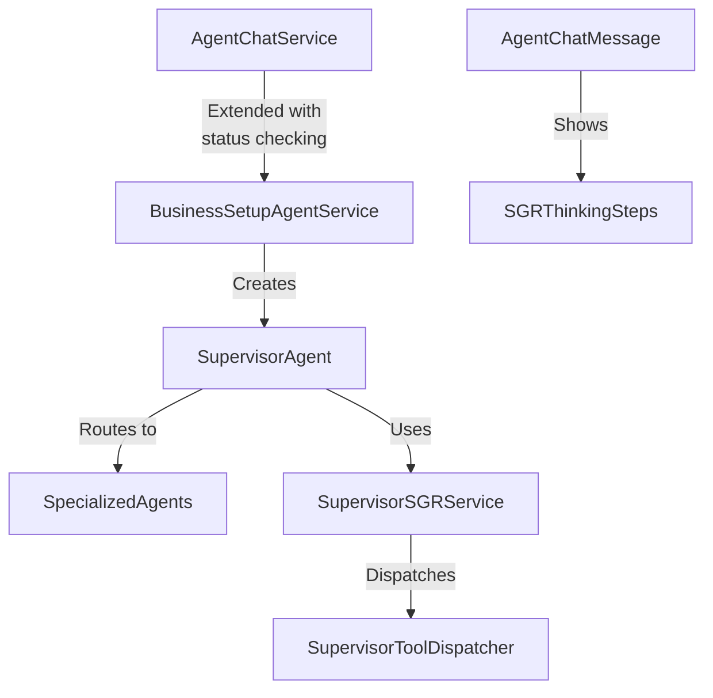
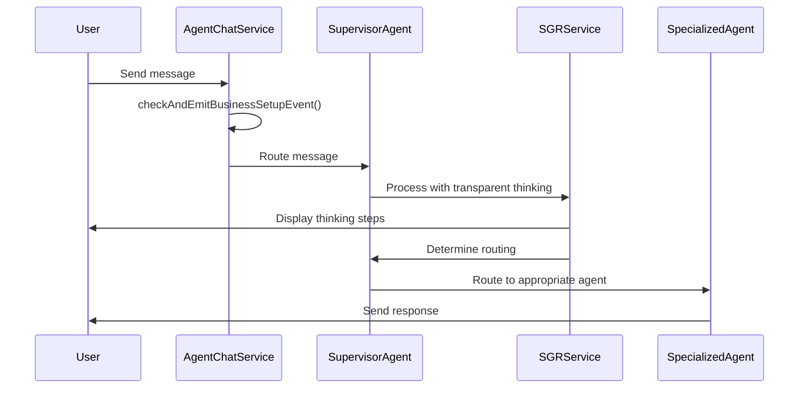
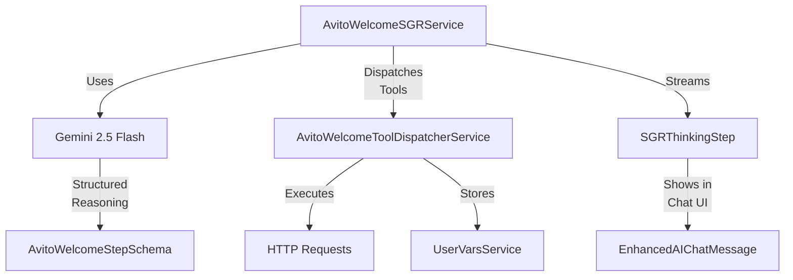
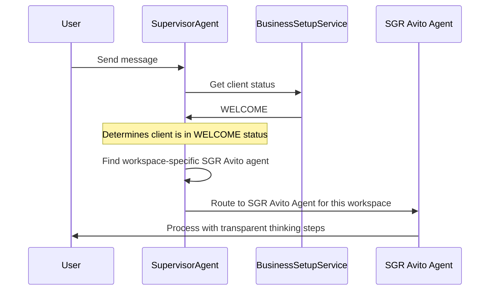

# Agent Workflow Router Design

## 1. Overview

This document outlines the design for an Agent Workflow Router within the Business Setup flow. The router implements a "supervisor agent" pattern where a main agent analyzes client status and routes requests to specialized agents while displaying transparent thinking steps in the chat.

## 2. Architecture Integration

The design extends the existing SGR (Schema-Guided Reasoning) implementation to create a supervisor agent that:
1. Launches automatically when a client in the Business Setup workflow starts a new chat
2. Determines the client's current Business Setup status
3. Routes requests to specialized agents for specific stages
4. Displays transparent reasoning steps in the chat interface

## 3. Component Architecture

### 3.1. Supervisor Agent Integration



### 3.2. Message Handling Flow



## 4. Key Components

### 4.1. BusinessSetupAgentService (Extended)

Add a new method to create a supervisor agent:

```typescript
@Injectable()
export class BusinessSetupAgentService {
  constructor(
    private readonly agentRepository: Repository<AgentEntity>,
    private readonly workspaceRepository: Repository<WorkspaceEntity>
  ) {}

  async getSupervisorAgent(userWorkspaceId: string): Promise<AgentEntity> {
    const actualWorkspaceId = await this.resolveWorkspaceId(userWorkspaceId);
    
    let supervisorAgent = await this.agentRepository.findOne({
      where: { 
        name: 'business-setup-supervisor',
        workspaceId: actualWorkspaceId 
      },
    });
    
    if (!supervisorAgent) {
      supervisorAgent = await this.createSupervisorAgent(actualWorkspaceId);
    }
    
    return supervisorAgent;
  }

  private async createSupervisorAgent(workspaceId: string): Promise<AgentEntity> {
    const agent = this.agentRepository.create({
      name: 'business-setup-supervisor',
      label: 'Business Setup Supervisor',
      description: 'Supervisor agent that routes requests to specialized agents based on business setup status',
      prompt: SUPERVISOR_AGENT_PROMPT,
      modelId: 'google/gemini-2.5-flash',
      icon: '🧠',
      workspaceId,
      isCustom: true,
      isActive: true,
      createdAt: new Date(),
      updatedAt: new Date(),
    });

    return await this.agentRepository.save(agent);
  }

  async getAgentForStep(step: BusinessSetupStatus, workspaceId: string): Promise<AgentEntity> {
    const actualWorkspaceId = await this.resolveWorkspaceId(workspaceId);
    
    if (step === 'WELCOME') {
      let sgrAgent = await this.agentRepository.findOne({
        where: { 
          name: 'sgr-avito-agent', 
          workspaceId: actualWorkspaceId 
        },
      });
      
      if (!sgrAgent) {
        sgrAgent = await this.createSGRAvitoAgent(actualWorkspaceId);
      }
      
      return sgrAgent;
    }
    
    const agentName = this.getAgentNameForStep(step);
    let agent = await this.agentRepository.findOne({
      where: { 
        name: agentName, 
        workspaceId: actualWorkspaceId 
      },
    });
    
    if (!agent) {
      agent = await this.createAgentForStep(step, actualWorkspaceId);
    }
    
    return agent;
  }

  private getAgentNameForStep(step: BusinessSetupStatus): string {
    const agentNames: Record<BusinessSetupStatus, string> = {
      'WELCOME': 'sgr-avito-agent',
      'BUSINESS_ANALYSIS': 'business-analysis-agent',
      'SALES_FUNNEL_DESIGN': 'sales-funnel-agent',
      'AGENT_SETUP': 'agent-setup-agent',
      'WORKFLOW_CREATION': 'workflow-creation-agent',
      'TEAM_ASSIGNMENT': 'team-assignment-agent',
      'TESTING_OPTIMIZATION': 'testing-optimization-agent',
      'COMPLETED': 'business-setup-complete-agent'
    };
    
    return agentNames[step];
  }

  private async createSGRAvitoAgent(workspaceId: string): Promise<AgentEntity> {
    const agent = this.agentRepository.create({
      name: 'sgr-avito-agent',
      label: 'SGR Avito Integration Assistant',
      description: 'Specialized SGR agent for Avito API integration during business setup',
      prompt: SGR_AVITO_AGENT_PROMPT,
      modelId: 'google/gemini-2.5-flash',
      icon: '🤖',
      workspaceId,
      isCustom: true,
      isActive: true,
      createdAt: new Date(),
      updatedAt: new Date(),
    });

    return await this.agentRepository.save(agent);
  }

  private async createAgentForStep(step: BusinessSetupStatus, workspaceId: string): Promise<AgentEntity> {
    const agent = this.agentRepository.create({
      name: this.getAgentNameForStep(step),
      label: this.getAgentLabelForStep(step),
      description: this.getAgentDescriptionForStep(step),
      prompt: this.getAgentPromptForStep(step),
      modelId: 'google/gemini-2.5-flash',
      icon: this.getAgentIconForStep(step),
      workspaceId,
      isCustom: true,
      isActive: true,
      createdAt: new Date(),
      updatedAt: new Date(),
    });

    return await this.agentRepository.save(agent);
  }

  private getAgentLabelForStep(step: BusinessSetupStatus): string {
    const labels: Record<BusinessSetupStatus, string> = {
      'WELCOME': 'SGR Avito Integration Assistant',
      'BUSINESS_ANALYSIS': 'Business Analysis Specialist',
      'SALES_FUNNEL_DESIGN': 'Sales Funnel Designer',
      'AGENT_SETUP': 'Agent Setup Specialist',
      'WORKFLOW_CREATION': 'Workflow Creation Expert',
      'TEAM_ASSIGNMENT': 'Team Assignment Coordinator',
      'TESTING_OPTIMIZATION': 'Testing & Optimization Expert',
      'COMPLETED': 'Business Setup Complete'
    };
    
    return labels[step];
  }

  private getAgentDescriptionForStep(step: BusinessSetupStatus): string {
    const descriptions: Record<BusinessSetupStatus, string> = {
      'WELCOME': 'Specialized SGR agent for Avito API integration during business setup',
      'BUSINESS_ANALYSIS': 'Analyzes business requirements and creates detailed business plans',
      'SALES_FUNNEL_DESIGN': 'Designs and optimizes sales funnels for maximum conversion',
      'AGENT_SETUP': 'Sets up specialized AI agents for different business functions',
      'WORKFLOW_CREATION': 'Creates automated workflows to streamline business processes',
      'TEAM_ASSIGNMENT': 'Assigns team members to appropriate roles and responsibilities',
      'TESTING_OPTIMIZATION': 'Tests and optimizes the complete business setup',
      'COMPLETED': 'Business setup process is complete and ready for operation'
    };
    
    return descriptions[step];
  }

  private getAgentIconForStep(step: BusinessSetupStatus): string {
    const icons: Record<BusinessSetupStatus, string> = {
      'WELCOME': '��',
      'BUSINESS_ANALYSIS': '��',
      'SALES_FUNNEL_DESIGN': '��',
      'AGENT_SETUP': '⚙️',
      'WORKFLOW_CREATION': '🔧',
      'TEAM_ASSIGNMENT': '👥',
      'TESTING_OPTIMIZATION': '✅',
      'COMPLETED': '🎉'
    };
    
    return icons[step];
  }

  private getAgentPromptForStep(step: BusinessSetupStatus): string {
    const prompts: Record<BusinessSetupStatus, string> = {
      'WELCOME': SGR_AVITO_AGENT_PROMPT,
      'BUSINESS_ANALYSIS': 'You are a Business Analysis Specialist...',
      'SALES_FUNNEL_DESIGN': 'You are a Sales Funnel Designer...',
      'AGENT_SETUP': 'You are an Agent Setup Specialist...',
      'WORKFLOW_CREATION': 'You are a Workflow Creation Expert...',
      'TEAM_ASSIGNMENT': 'You are a Team Assignment Coordinator...',
      'TESTING_OPTIMIZATION': 'You are a Testing & Optimization Expert...',
      'COMPLETED': 'Business setup is complete. You can help with ongoing operations and optimization.'
    };
    
    return prompts[step];
  }

  private async resolveWorkspaceId(userWorkspaceId: string): Promise<string> {
    if (userWorkspaceId.length === 36) {
      return userWorkspaceId;
    }
    
    const userWorkspace = await this.userWorkspaceRepository.findOne({
      where: { id: userWorkspaceId },
      relations: ['workspace']
    });
    
    if (!userWorkspace?.workspace) {
      throw new Error(`Could not resolve workspace ID from user workspace ID: ${userWorkspaceId}`);
    }
    
    return userWorkspace.workspace.id;
  }
}
```

### 4.2. Agent Chat Service (Extended)

Enhance `checkAndEmitBusinessSetupEvent` to check for Business Setup status and use supervisor agent:

```typescript
private async checkAndEmitBusinessSetupEvent(threadId: string, content: string) {
  try {
    const thread = await this.threadRepository.findOne({
      where: { id: threadId },
      relations: ['agent', 'userWorkspace']
    });

    if (!thread || !thread.userWorkspace) {
      return;
    }

    const userWorkspaceId = thread.userWorkspaceId;
    const isBusinessSetupStatus = await this.businessSetupService.isInBusinessSetup(
      thread.userWorkspace.userId,
      thread.userWorkspace.workspaceId
    );

    if (isBusinessSetupStatus) {
      const supervisorAgent = await this.businessSetupAgentService.getSupervisorAgent(userWorkspaceId);
      
      this.eventEmitter.emit(BUSINESS_SETUP_EVENTS.BUSINESS_SETUP_ROUTE_MESSAGE, {
        userId: thread.userWorkspace.userId,
        workspaceId: thread.userWorkspace.workspaceId,
        threadId,
        message: content,
        supervisorAgentId: supervisorAgent.id,
        timestamp: new Date()
      });
    }
  } catch (error) {
    console.error('Failed to check business setup status:', error);
  }
}
```

### 4.3. SupervisorSGRService

Create a new service that extends the existing SGR pattern:

```typescript
@Injectable()
export class SupervisorSGRService {
  constructor(
    private readonly userVarsService: UserVarsService<BusinessSetupKeyValueTypeMap>,
    private readonly agentChatService: AgentChatService,
    private readonly aiModelRegistryService: AiModelRegistryService,
    private readonly businessSetupAgentService: BusinessSetupAgentService,
    private readonly supervisorToolDispatcher: SupervisorToolDispatcherService,
    private readonly eventEmitter: EventEmitter2
  ) {}

  async *processMessageWithStreaming(
    message: string,
    userId: string,
    workspaceId: string,
    threadId: string
  ): AsyncGenerator<SGRStreamingResult> {
    const model = await this.aiModelRegistryService.getModel('google/gemini-2.5-flash');
    
    let stepNumber = 1;
    let currentState = `Analyzing user request: "${message}"`;
    let plannedSteps = ['Check current business setup status', 'Determine appropriate specialized agent', 'Route request'];
    
    while (true) {
      const reasoningStep = await this.executeReasoningStepWithStreaming(
        message,
        currentState,
        plannedSteps,
        stepNumber,
        model
      );
      
      yield {
        type: 'thinking_step',
        data: {
          stepNumber,
          currentState,
          plannedSteps,
          selectedTool: reasoningStep.function.tool,
          timestamp: new Date()
        }
      };
      
      const toolResult = await this.supervisorToolDispatcher.dispatch(
        reasoningStep.function,
        userId,
        workspaceId,
        threadId
      );
      
      yield {
        type: 'tool_execution',
        data: {
          stepNumber,
          tool: reasoningStep.function.tool,
          result: toolResult,
          timestamp: new Date()
        }
      };
      
      currentState = toolResult.message;
      stepNumber++;
      
      if (reasoningStep.task_completed) {
        break;
      }
      
      plannedSteps = reasoningStep.plan_remaining_steps;
    }
  }

  private async executeReasoningStepWithStreaming(
    message: string,
    currentState: string,
    plannedSteps: string[],
    stepNumber: number,
    model: AiModel
  ): Promise<SupervisorStepSchema> {
    const prompt = this.buildSupervisorPrompt(message, currentState, plannedSteps, stepNumber);
    
    const response = await model.complete({
      messages: [{ role: 'user', content: prompt }],
      temperature: 0.1,
      maxTokens: 1000,
    });
    
    const content = response.choices[0]?.message?.content;
    if (!content) {
      throw new Error('Failed to get response from AI model');
    }
    
    return SupervisorStepSchema.parse(JSON.parse(content));
  }

  private buildSupervisorPrompt(
    message: string,
    currentState: string,
    plannedSteps: string[],
    stepNumber: number
  ): string {
    return `You are a Supervisor Agent for the Business Setup workflow. Your role is to:

1. Determine the client's current status in the Business Setup process
2. Route requests to specialized agents based on that status
3. Provide transparent reasoning about your routing decisions

Available Business Setup statuses:
- WELCOME: Initial welcome and credential setup
- BUSINESS_ANALYSIS: Business analysis and requirements gathering
- SALES_FUNNEL_DESIGN: Sales funnel creation and optimization
- AGENT_SETUP: Setting up specialized agents
- WORKFLOW_CREATION: Creating automated workflows
- TEAM_ASSIGNMENT: Assigning team members to roles
- TESTING_OPTIMIZATION: Testing and optimizing the setup
- COMPLETED: Business setup is complete

Current situation:
- User message: "${message}"
- Current state: "${currentState}"
- Planned steps: ${JSON.stringify(plannedSteps)}
- Step number: ${stepNumber}

IMPORTANT: For WELCOME status, ALWAYS route to the SGR Avito Agent (name: sgr-avito-agent) for the client's workspace.
For WELCOME status, do not try to process requests yourself, always delegate to the workspace-specific specialized SGR agent.

You can also detect when a status change is needed and trigger it using the status_change tool.

Respond with a JSON object that follows this schema:
${SupervisorStepSchema.toString()}

Always maintain a helpful and informative tone while making routing decisions.`;
  }
}
```

### 4.4. SupervisorSchema

Define the schema for structured reasoning:

```typescript
export const SupervisorStepSchema = z.object({
  current_state: z.string()
    .describe('Current understanding of the user request and business setup status'),
  
  plan_remaining_steps: z.array(z.string())
    .min(1).max(3)
    .describe('Next 1-3 planned steps to handle the request'),
  
  task_completed: z.boolean()
    .describe('Whether the request routing is complete'),
  
  function: z.discriminatedUnion('tool', [
    z.object({
      tool: z.literal('check_business_setup_status'),
      userId: z.string(),
      workspaceId: z.string()
    }),
    
    z.object({
      tool: z.literal('route_to_specialized_agent'),
      status: z.enum(Object.values(BusinessSetupStatus) as [string, ...string[]]),
      reason: z.string(),
      message: string
    }),
    
    z.object({
      tool: z.literal('process_directly'),
      message: z.string(),
      response: z.string()
    }),
    
    z.object({
      tool: z.literal('status_change'),
      from_status: z.enum(Object.values(BusinessSetupStatus) as [string, ...string[]]),
      to_status: z.enum(Object.values(BusinessSetupStatus) as [string, ...string[]]),
      reason: z.string()
    }),
    
    z.object({
      tool: z.literal('complete_routing'),
      success: z.boolean(),
      final_message: z.string()
    })
  ])
});
```

### 4.5. SupervisorToolDispatcherService

Implement the tool dispatcher to handle supervisor actions:

```typescript
@Injectable()
export class SupervisorToolDispatcherService {
  constructor(
    private readonly businessSetupService: BusinessSetupService,
    private readonly businessSetupAgentService: BusinessSetupAgentService,
    private readonly agentChatService: AgentChatService,
    private readonly agentRepository: Repository<AgentEntity>,
    private readonly eventEmitter: EventEmitter2
  ) {}

  async dispatch(command: SupervisorToolUnion, userId: string, workspaceId: string, threadId: string): Promise<ToolExecutionResult> {
    switch (command.tool) {
      case 'check_business_setup_status':
        return this.handleCheckBusinessSetupStatus(command, userId, workspaceId);
        
      case 'route_to_specialized_agent':
        return this.handleRouteToSpecializedAgent(command, userId, workspaceId, threadId);
        
      case 'process_directly':
        return {
          success: true,
          data: { processed: true },
          message: command.response
        };
        
      case 'status_change':
        return this.handleStatusChange(command, userId, workspaceId);
        
      case 'complete_routing':
        return {
          success: command.success,
          message: command.final_message
        };
        
      default:
        const exhaustiveCheck: never = command;
        throw new Error(`Unknown tool: ${(exhaustiveCheck as any).tool}`);
    }
  }

  private async handleCheckBusinessSetupStatus(cmd: CheckBusinessSetupStatusType, userId: string, workspaceId: string): Promise<ToolExecutionResult> {
    const status = await this.businessSetupService.getBusinessSetupStatus(userId, workspaceId);
    return {
      success: true,
      data: { status },
      message: `Current business setup status: ${status}`
    };
  }

  private async handleStatusChange(cmd: StatusChangeType, userId: string, workspaceId: string): Promise<ToolExecutionResult> {
    try {
      const currentStatus = await this.businessSetupService.getBusinessSetupStatus(userId, workspaceId);
      
      if (currentStatus !== cmd.from_status) {
        return {
          success: false,
          error: `Status mismatch: Expected ${cmd.from_status}, found ${currentStatus}`,
          message: `Cannot change status: Current status is ${currentStatus}, not ${cmd.from_status}`
        };
      }
      
      await this.businessSetupService.setBusinessSetupStatus(userId, workspaceId, cmd.to_status);
      
      this.eventEmitter.emit(BUSINESS_SETUP_EVENTS.BUSINESS_SETUP_STATUS_CHANGED, {
        userId,
        workspaceId,
        fromStatus: cmd.from_status,
        toStatus: cmd.to_status,
        reason: cmd.reason,
        timestamp: new Date()
      });
      
      return {
        success: true,
        data: {
          previous_status: cmd.from_status,
          new_status: cmd.to_status,
          reason: cmd.reason
        },
        message: `Status changed from ${cmd.from_status} to ${cmd.to_status}: ${cmd.reason}`
      };
    } catch (error) {
      return {
        success: false,
        error: error.message,
        message: `Failed to change status: ${error.message}`
      };
    }
  }

  private async handleRouteToSpecializedAgent(cmd: RouteToSpecializedAgentType, userId: string, workspaceId: string, threadId: string): Promise<ToolExecutionResult> {
    if (cmd.status === 'WELCOME') {
      const SGR_AVITO_AGENT_NAME = 'sgr-avito-agent';
      
      const sgrAvitoAgent = await this.agentRepository.findOne({
        where: { 
          name: SGR_AVITO_AGENT_NAME, 
          workspaceId 
        },
      });
      
      if (!sgrAvitoAgent) {
        throw new Error(`SGR Avito Agent not found for workspace ${workspaceId}`);
      }
      
      await this.agentChatService.sendMessage({
        threadId,
        agentId: sgrAvitoAgent.id,
        content: cmd.message,
        userId,
        workspaceId
      });
      
      return {
        success: true,
        data: { 
          routed: true,
          agent: sgrAvitoAgent.name,
          agent_id: sgrAvitoAgent.id,
          status: 'WELCOME',
          workspace_id: workspaceId
        },
        message: `Routed to ${sgrAvitoAgent.label} for workspace ${workspaceId}`
      };
    }
    
    const specializedAgent = await this.businessSetupAgentService.getAgentForStep(
      cmd.status as BusinessSetupStatus,
      workspaceId
    );
    
    await this.agentChatService.sendMessage({
      threadId,
      agentId: specializedAgent.id,
      content: cmd.message,
      userId,
      workspaceId
    });
    
    return {
      success: true,
      data: { 
        routed: true,
        agent: specializedAgent.name,
        agent_id: specializedAgent.id,
        status: cmd.status
      },
      message: `Routed to ${specializedAgent.name}`
    };
  }
}
```

## 5. Event System Integration

Add new event constant:

```typescript
// twenty-shared/constants/event.constants.ts
export const BUSINESS_SETUP_EVENTS = {
  BUSINESS_SETUP_STARTED: 'business-setup.started',
  BUSINESS_SETUP_STATUS_CHANGED: 'business-setup.status-changed',
  BUSINESS_SETUP_COMPLETED: 'business-setup.completed',
  BUSINESS_SETUP_ROUTE_MESSAGE: 'business-setup.route-message',
  BUSINESS_SETUP_AGENT_CREATED: 'business-setup.agent-created',
  BUSINESS_SETUP_ERROR: 'business-setup.error',
} as const;

export type BusinessSetupEventType = typeof BUSINESS_SETUP_EVENTS[keyof typeof BUSINESS_SETUP_EVENTS];
```

Create handler in BusinessSetupService:

```typescript
@OnEvent(BUSINESS_SETUP_EVENTS.BUSINESS_SETUP_ROUTE_MESSAGE)
async handleRouteMessage(payload: {
  userId: string;
  workspaceId: string;
  threadId: string;
  message: string;
  supervisorAgentId: string;
  timestamp: Date;
}): Promise<void> {
  await this.supervisorSGRService.processMessage(
    payload.message,
    payload.userId,
    payload.workspaceId,
    payload.threadId,
    payload.supervisorAgentId
  );
}
```

## 6. Transparent Reasoning Implementation

The design leverages the existing SGR thinking stream implementation to display agent reasoning in the chat interface:

```typescript
export interface SGRThinkingStep {
  stepNumber: number;
  currentState: string;
  plannedSteps: string[];
  selectedTool: string;
  toolExecution?: {
    status: 'in_progress' | 'completed' | 'failed';
    result?: any;
    error?: string;
  };
  timestamp: Date;
}

export interface SGRStreamingResult {
  type: 'thinking_step' | 'tool_execution';
  data: SGRThinkingStep | {
    stepNumber: number;
    tool: string;
    result: ToolExecutionResult;
    timestamp: Date;
  };
}
```

The supervisor will generate thinking steps that look like:

1. **Step 1: Analysis**
   - Current State: "Analyzing user request: 'I need to set up my sales funnel'"
   - Planned Steps: ["Check current business setup status", "Determine appropriate specialized agent", "Route request"]
   - Selected Tool: check_business_setup_status

2. **Step 2: Routing Decision**
   - Current State: "User is in SALES_FUNNEL_DESIGN phase of business setup"
   - Planned Steps: ["Route to Sales Funnel Designer agent", "Provide context about user's request"]
   - Selected Tool: route_to_specialized_agent

## 7. Configuration

### Supervisor Agent Prompt

```typescript
// twenty-shared/constants/agent-prompts.constants.ts
export const SUPERVISOR_AGENT_PROMPT = `You are a Supervisor Agent for the Business Setup workflow. Your role is to:

1. Determine the client's current status in the Business Setup process
2. Route requests to specialized agents based on that status
3. Provide transparent reasoning about your routing decisions

Available Business Setup statuses:
- WELCOME: Initial welcome and credential setup
- BUSINESS_ANALYSIS: Business analysis and requirements gathering
- SALES_FUNNEL_DESIGN: Sales funnel creation and optimization
- AGENT_SETUP: Setting up specialized agents
- WORKFLOW_CREATION: Creating automated workflows
- TEAM_ASSIGNMENT: Assigning team members to roles
- TESTING_OPTIMIZATION: Testing and optimizing the setup
- COMPLETED: Business setup is complete

For each user message:
1. Check the current business setup status
2. Analyze if the request is relevant to that status
3. Route to the appropriate specialized agent
4. Show your reasoning process transparently

IMPORTANT: For WELCOME status, ALWAYS route to the SGR Avito Agent (name: sgr-avito-agent) for the client's workspace.
For WELCOME status, do not try to process requests yourself, always delegate to the workspace-specific specialized SGR agent.

You can also detect when a status change is needed and trigger it using the status_change tool.

Always maintain a helpful and informative tone while making routing decisions.`;

export const SGR_AVITO_AGENT_PROMPT = `You are the SGR Avito Integration Assistant, a specialized agent for handling Avito API integration during business setup.

Your responsibilities:
1. Collect and validate Avito API credentials (CLIENT_ID and CLIENT_SECRET)
2. Test the credentials with Avito API endpoints
3. Securely store validated credentials
4. Guide users through the credential setup process
5. Provide clear feedback in Russian language

Available tools:
- extract_credentials: Extract API credentials from user messages
- request_credentials: Generate user-friendly messages asking for proper credentials
- validate_avito_token: Validate credentials with Avito API
- store_credentials: Securely store valid credentials
- report_welcome_completion: Signal completion and transition to next stage

Always communicate in Russian with users and provide clear, step-by-step guidance.
When credentials are successfully stored and validated, use the report_welcome_completion tool to signal readiness for the next stage.`;
```

## 8. LLM Model Selection

The supervisor agent uses the Gemini 2.5 Flash model for:
- Fast response times for routing decisions
- Efficient structured reasoning capabilities
- Strong schema adherence for consistent tool usage
- Cost efficiency for frequent routing operations

## 9. Specialized Agents Implementation

### 9.1. First Stage Agent: SGR Avito Welcome Agent

#### 9.1.1. Overview

The SGR Avito Welcome Agent is a specialized agent that handles the first stage (WELCOME) of the Business Setup workflow. This agent is responsible for collecting, validating, and storing Avito API credentials using Schema-Guided Reasoning (SGR) with transparent thinking steps.

#### 9.1.2. Architecture



#### 9.1.3. Core Components

**1. AvitoWelcomeStepSchema**

Zod schema that defines the structured reasoning pattern:

```typescript
export const AvitoWelcomeStepSchema = z.object({
  current_state: z.string()
    .describe('Current understanding of the credential collection task'),
  
  plan_remaining_steps: z.array(z.string())
    .min(1).max(3)
    .describe('Next 1-3 planned steps to complete the task'),
  
  task_completed: z.boolean()
    .describe('Whether the credential collection process is complete'),
  
  function: z.discriminatedUnion('tool', [
    z.object({ tool: z.literal('extract_credentials'), ... }),
    z.object({ tool: z.literal('request_credentials'), ... }),
    z.object({ tool: z.literal('validate_avito_token'), ... }),
    z.object({ tool: z.literal('store_credentials'), ... }),
    z.object({ tool: z.literal('report_welcome_completion'), ... })
  ])
});
```

**2. AvitoWelcomeSGRService**

Orchestrates the SGR workflow:

- `processWelcomeMessageWithStreaming()`: Main entry point for streaming SGR processing
- `executeSGRWorkflowWithStreaming()`: Core streaming workflow implementation
- `executeReasoningStepWithStreaming()`: Generates single reasoning step with LLM

**3. AvitoWelcomeToolDispatcherService**

Type-safe tool execution service for SGR agent:

- `extract_credentials`: Extracts API credentials from user messages
- `request_credentials`: Generates credential request messages
- `validate_avito_token`: Validates credentials with Avito API
- `store_credentials`: Securely stores credentials using UserVarsService
- `report_welcome_completion`: Reports successful completion

**4. SGR Thinking Stream Types**

Types for displaying transparent reasoning:

```typescript
export interface SGRThinkingStep {
  stepNumber: number;
  currentState: string;
  plannedSteps: string[];
  selectedTool: string;
  toolExecution?: {
    status: 'in_progress' | 'completed' | 'failed';
    result?: any;
    error?: string;
  };
  timestamp: Date;
}
```

#### 9.1.4. UI Integration

1. **Frontend Rendering**: Utilizes `EnhancedAIChatMessage` component with specialized SGR visualization
2. **Streaming**: Chat messages show real-time thinking steps with tool execution progress
3. **Step Visualization**: Displays clear reasoning steps, planned actions, and tool execution results

#### 9.1.5. Agent Registration

Each workspace needs its own instance of the SGR Avito agent. Instead of a fixed global ID, we'll use a consistent name pattern:

```typescript
const SGR_AVITO_AGENT_NAME = 'sgr-avito-agent';
```

In `BusinessSetupAgentService`, the agent is created or retrieved per workspace when needed:

```typescript
if (step === BusinessSetupStatus.WELCOME) {
  let sgrAgent = await this.agentRepository.findOne({
    where: { 
      name: SGR_AVITO_AGENT_NAME, 
      workspaceId: actualWorkspaceId 
    },
  });
  
  if (!sgrAgent) {
    sgrAgent = await this.createSGRAvitoAgent(actualWorkspaceId);
  }
  
  return sgrAgent;
}
```

The `createSGRAvitoAgent` method creates a workspace-specific agent:

```typescript
private async createSGRAvitoAgent(workspaceId: string): Promise<AgentEntity> {
  const agent = this.agentRepository.create({
    name: 'sgr-avito-agent',
    label: 'SGR Avito Integration Assistant',
    description: 'Specialized SGR agent for Avito API integration during business setup',
    prompt: `You are the SGR Avito Integration Assistant...`, // Same prompt as before
    modelId: 'google/gemini-2.5-flash',
    icon: '🤖',
    workspaceId,
    isCustom: true,
  });

  return await this.agentRepository.save(agent);
}
```

This approach ensures that:
1. Each workspace gets its own dedicated SGR Avito agent
2. Agents are properly isolated between workspaces
3. No hardcoded global IDs are used

#### 9.1.6. Supervisor Integration with SGR Avito Agent

The supervisor agent has special handling for the WELCOME status to ensure proper routing to the SGR Avito agent:

1. **Name-Based Routing**: For WELCOME status, the supervisor routes to the workspace-specific SGR Avito agent by name

2. **Forced Routing**: The supervisor ensures that WELCOME stage requests are always sent to the SGR Avito agent, not to generic agents

3. **Error Handling**: Clear error messages if the SGR Avito agent is not found for the workspace



**Supervisor Agent Code for SGR Avito Routing:**

```typescript
if (cmd.status === 'WELCOME') {
  const SGR_AVITO_AGENT_NAME = 'sgr-avito-agent';
  
  const sgrAvitoAgent = await this.agentRepository.findOne({
    where: { 
      name: SGR_AVITO_AGENT_NAME, 
      workspaceId 
    },
  });
  
  if (!sgrAvitoAgent) {
    throw new Error(`SGR Avito Agent not found for workspace ${workspaceId}`);
  }
  
  await this.agentChatService.sendMessage({
    threadId,
    agentId: sgrAvitoAgent.id,
    content: cmd.message,
    userId,
    workspaceId
  });
  
  return {
    success: true,
    data: { 
      routed: true,
      agent: sgrAvitoAgent.name,
      agent_id: sgrAvitoAgent.id,
      status: 'WELCOME',
      workspace_id: workspaceId
    },
    message: `Routed to ${sgrAvitoAgent.label} for workspace ${workspaceId}`
  };
}
```

#### 9.1.7. Status Transition from WELCOME to BUSINESS_ANALYSIS

```typescript
function: {
  tool: 'status_change',
  from_status: 'WELCOME',
  to_status: 'BUSINESS_ANALYSIS',
  reason: 'Avito API credentials successfully stored and verified'
}
```

Completion indicators that the supervisor can detect include:
- User message mentioning successful credential validation
- User asking "what's next" after credential setup
- User asking to move to the next stage
- The supervisor detecting that all required credentials are stored

### 9.1.8. SGR Avito Agent Capabilities Analysis

The SGR Avito agent implements a sophisticated Schema-Guided Reasoning approach with several key capabilities that our supervisor needs to properly integrate with:

1. **Tool-Based Reasoning**: The SGR Avito agent uses a structured set of tools to accomplish its tasks:
   - `extract_credentials`: Extracts CLIENT_ID and CLIENT_SECRET from user messages
   - `request_credentials`: Generates user-friendly messages asking for proper credentials
   - `validate_avito_token`: Validates credentials with the Avito API endpoint
   - `store_credentials`: Securely stores valid credentials in UserVarsService
   - `report_welcome_completion`: Signals completion and transition to the next stage

2. **Transparent Reasoning Display**: The agent streams its thinking process in real-time:
   - Uses `SGRThinkingStep` interface to structure reasoning steps
   - Shows current state, planned steps, and selected tools
   - Visualizes tool execution status (in progress, completed, failed)

3. **Russian Language Support**: The agent communicates with users in Russian:
   - All user-facing messages are in Russian
   - Error messages and success messages use Russian formatting

4. **Status Transition Signals**: The agent can signal readiness to move to the next stage:
   - Uses `next_stage: 'business_analysis'` in completion report
   - Indicates when credentials are successfully stored

### 9.1.9. Supervisor Integration with SGR Avito Tools

Our Supervisor Agent enhances the SGR Avito agent's capabilities through careful integration:

1. **Status Detection**: When the supervisor detects the user is in WELCOME status, it routes to the SGR Avito agent

2. **Completion Monitoring**: The supervisor monitors for completion indicators from the SGR Avito agent:
   ```typescript
   if (message.includes('credentials successfully stored') || 
       message.includes('Учетные данные безопасно сохранены')) {
     return {
       tool: 'status_change',
       from_status: 'WELCOME',
       to_status: 'BUSINESS_ANALYSIS',
       reason: 'Avito API credentials successfully stored and verified'
     };
   }
   ```

3. **Graceful Transition**: When the SGR Avito agent completes its task, the supervisor facilitates a smooth transition to the next stage:
   - Acknowledges completion in Russian and English
   - Provides a bridge to the next stage's content
   - Ensures no context is lost during transition

4. **Message Preservation**: The supervisor ensures all SGR thinking steps are preserved in the chat history:
   - Maintains the transparent reasoning display
   - Ensures reasoning steps remain visible after transitions

## 10. Missing Types and Interfaces

### 10.1. Business Setup Types

```typescript
export type BusinessSetupStatus = 
  | 'WELCOME'
  | 'BUSINESS_ANALYSIS'
  | 'SALES_FUNNEL_DESIGN'
  | 'AGENT_SETUP'
  | 'WORKFLOW_CREATION'
  | 'TEAM_ASSIGNMENT'
  | 'TESTING_OPTIMIZATION'
  | 'COMPLETED';

export interface BusinessSetupProgress {
  status: BusinessSetupStatus;
  lastUpdated: Date;
  isComplete: boolean;
}

export interface BusinessSetupKeyValueTypeMap {
  BUSINESS_SETUP_STATUS: BusinessSetupStatus;
  BUSINESS_SETUP_STATUS_TIMESTAMP: string;
  AVITO_CLIENT_ID?: string;
  AVITO_CLIENT_SECRET?: string;
  BUSINESS_ANALYSIS_DATA?: string;
  SALES_FUNNEL_CONFIG?: string;
  WORKFLOW_CONFIG?: string;
  TEAM_ASSIGNMENTS?: string;
}
```

### 10.2. Supervisor Tool Types

```typescript
export type SupervisorToolUnion = 
  | CheckBusinessSetupStatusType
  | RouteToSpecializedAgentType
  | ProcessDirectlyType
  | StatusChangeType
  | CompleteRoutingType;

export interface CheckBusinessSetupStatusType {
  tool: 'check_business_setup_status';
  userId: string;
  workspaceId: string;
}

export interface RouteToSpecializedAgentType {
  tool: 'route_to_specialized_agent';
  status: BusinessSetupStatus;
  reason: string;
  message: string;
}

export interface ProcessDirectlyType {
  tool: 'process_directly';
  message: string;
  response: string;
}

export interface StatusChangeType {
  tool: 'status_change';
  from_status: BusinessSetupStatus;
  to_status: BusinessSetupStatus;
  reason: string;
}

export interface CompleteRoutingType {
  tool: 'complete_routing';
  success: boolean;
  final_message: string;
}

export interface ToolExecutionResult {
  success: boolean;
  data?: any;
  error?: string;
  message: string;
}
```

## 11. Missing Business Setup Service Methods

### 11.1. Extended BusinessSetupService

```typescript
@Injectable()
export class BusinessSetupService {
  constructor(
    private readonly userVarsService: UserVarsService<BusinessSetupKeyValueTypeMap>,
    private readonly userWorkspaceRepository: Repository<UserWorkspaceEntity>,
    private readonly eventEmitter: EventEmitter2
  ) {}

  async isInBusinessSetup(userId: string, workspaceId: string): Promise<boolean> {
    try {
      const status = await this.getBusinessSetupStatus(userId, workspaceId);
      return status !== 'COMPLETED';
    } catch (error) {
      return false;
    }
  }

  async getBusinessSetupStatus(userId: string, workspaceId: string): Promise<BusinessSetupStatus> {
    try {
      const status = await this.userVarsService.get(userId, 'BUSINESS_SETUP_STATUS');
      return status as BusinessSetupStatus || 'WELCOME';
    } catch (error) {
      return 'WELCOME';
    }
  }

  async setBusinessSetupStatus(userId: string, workspaceId: string, status: BusinessSetupStatus): Promise<void> {
    await this.userVarsService.set(userId, 'BUSINESS_SETUP_STATUS', status);
    
    await this.userVarsService.set(userId, 'BUSINESS_SETUP_STATUS_TIMESTAMP', new Date().toISOString());
    
    this.eventEmitter.emit(BUSINESS_SETUP_EVENTS.BUSINESS_SETUP_STATUS_CHANGED, {
      userId,
      workspaceId,
      status,
      timestamp: new Date()
    });
  }

  async getBusinessSetupProgress(userId: string, workspaceId: string): Promise<BusinessSetupProgress> {
    const status = await this.getBusinessSetupStatus(userId, workspaceId);
    const timestamp = await this.userVarsService.get(userId, 'BUSINESS_SETUP_STATUS_TIMESTAMP');
    
    return {
      status,
      lastUpdated: timestamp ? new Date(timestamp) : new Date(),
      isComplete: status === 'COMPLETED'
    };
  }
}
```

## 12. Implementation Checklist

### 12.1. Backend Services
- [ ] Create `SupervisorSGRService`
- [ ] Create `SupervisorToolDispatcherService`
- [ ] Extend `BusinessSetupService` with missing methods
- [ ] Extend `BusinessSetupAgentService` with supervisor methods
- [ ] Add event constants and handlers

### 12.2. Types and Schemas
- [ ] Define `BusinessSetupStatus` enum
- [ ] Create `SupervisorStepSchema`
- [ ] Define tool types and interfaces
- [ ] Add `BusinessSetupKeyValueTypeMap`

### 12.3. Agent Creation
- [ ] Implement supervisor agent creation
- [ ] Implement specialized agent creation for each step
- [ ] Add agent prompts and configurations

### 12.4. Integration
- [ ] Update `AgentChatService` with business setup detection
- [ ] Add event handlers for business setup routing
- [ ] Integrate with existing SGR system

### 12.5. Testing
- [ ] Unit tests for all new services
- [ ] Integration tests for agent routing
- [ ] End-to-end tests for complete workflow

## 13. Deployment Considerations

### 13.1. Database Migrations
- Ensure `AgentEntity` table supports all required fields
- Verify `UserVarsService` can handle new business setup variables

### 13.2. Configuration
- Set up Gemini 2.5 Flash model access
- Configure business setup workflow parameters
- Set up monitoring and logging for supervisor agent

### 13.3. Performance
- Monitor supervisor agent response times
- Implement caching for frequently accessed business setup status
- Optimize agent creation and retrieval

## 14. Future Enhancements

### 14.1. Advanced Routing
- Implement machine learning-based routing decisions
- Add support for dynamic workflow customization
- Implement A/B testing for different routing strategies

### 14.2. Analytics and Monitoring
- Track routing success rates
- Monitor agent performance metrics
- Implement automated workflow optimization

### 14.3. Multi-Language Support
- Extend SGR Avito agent to support additional languages
- Implement localization for business setup workflow
- Add cultural adaptation for different regions

This updated document now 