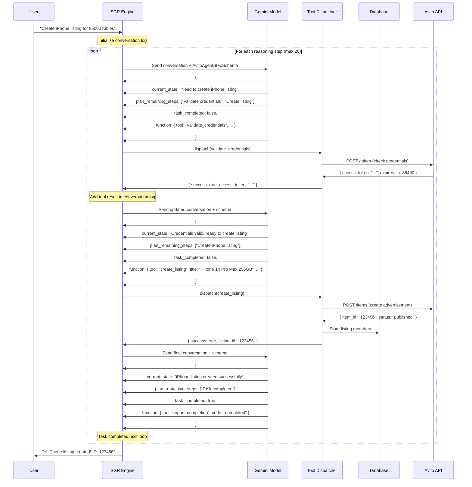
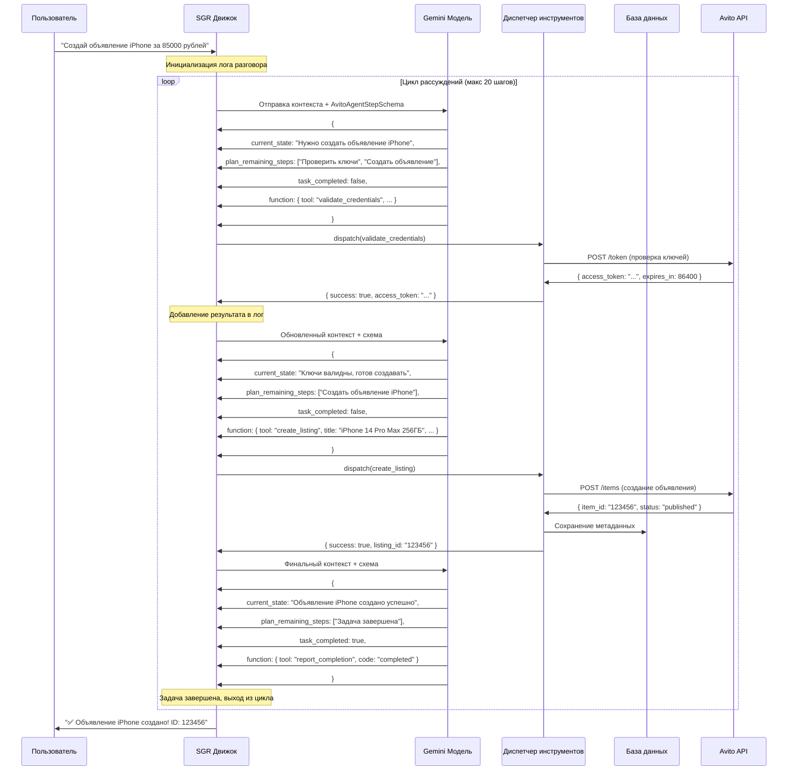

# Avito Agent Analysis: Credential Storage and Token Management Architecture

## Overview

This document analyzes the current implementation of the Avito agent creation process in the Twenty CRM system, focusing on credential storage mechanisms and access token management architecture.

## Technology Stack & Dependencies

- **Backend Framework**: NestJS with TypeScript
- **Database**: PostgreSQL with TypeORM
- **Security**: JWT tokens, UserVarsService for credential storage
- **HTTP Client**: HTTP tool for external API validation
- **Agent Framework**: Custom AI agent system with business setup workflow

## Architecture Analysis

### 1. Avito Agent Creation Process

``mermaid
flowchart TD
    A[User provides credentials] --> B[Extract CLIENT_ID & CLIENT_SECRET]
    B --> C{Credentials valid format?}
    C -->|No| D[Send retry message]
    C -->|Yes| E[Create HTTP validation request]
    E --> F[Execute agent with HTTP tool]
    F --> G[Validate against Avito API]
    G --> H{Validation successful?}
    H -->|No| I[Show error message]
    H -->|Yes| J[Store credentials via UserVarsService]
    J --> K[Transition to next business step]
    
    D --> A
    I --> A
```

### 2. Credential Storage Architecture

#### Current Implementation: UserVarsService

The system uses a hierarchical key-value storage pattern through `UserVarsService`:

```

```

### 3. Access Token Management

#### Current Token Lifecycle

``mermaid
sequenceDiagram
    participant U as User
    participant A as Avito Agent
    participant API as Avito API
    participant UVS as UserVarsService
    participant DB as Database
    
    U->>A: Provides CLIENT_ID & CLIENT_SECRET
    A->>API: POST /token (OAuth2 request)
    API->>A: Returns access_token + expires_in
    A->>UVS: Store access_token & expiration
    UVS->>DB: Persist tokens
    
    Note over API,DB: Token expires after ~24 hours
    
    A->>UVS: Retrieve stored credentials
    UVS->>DB: Fetch CLIENT_ID & CLIENT_SECRET
    A->>API: Request new access_token
    API->>A: New access_token
    A->>UVS: Update stored token
```

#### Token Storage Schema

| Key | Type | Purpose | Example |
|-----|------|---------|---------|
| `AVITO_CLIENT_ID` | string | API client identifier | `R3cTDMk9rEJ2lh5A9_QF` |
| `AVITO_CLIENT_SECRET` | string | API client secret | `ehAWb-RBQrLmgoJWfgtst737eQV6KIBHzmV1NmIc` |
| `AVITO_ACCESS_TOKEN` | string | OAuth2 access token | `X5Bmu0HbQjuu3I9nVN2Sdwy8kCWs0dnzCl98yEM4` |
| `AVITO_TOKEN_EXPIRES_AT` | string | Token expiration timestamp | `2024-01-02T12:00:00Z` |

## Core Components Analysis

### 1. BusinessSetupWelcomeAgentService

**Purpose**: Manages the complete Avito agent creation and credential validation workflow.

**Key Methods**:
- `extractCredentialsFromMessage()`: Regex-based credential extraction
- `storeAvitoCredentials()`: Secure credential storage via UserVarsService
- `handleValidationResponse()`: Process API validation results
- `getAvitoAgent()`: Create or retrieve dedicated Avito agent

### 2. Credential Processing Pipeline

``mermaid
graph LR
    A[User Message] --> B[Regex Extraction]
    B --> C[Format Validation]
    C --> D[HTTP API Call]
    D --> E[Response Analysis]
    E --> F[Credential Storage]
    F --> G[Workflow Transition]
```

**Supported Input Formats**:
- `CLIENT_ID = 'value'`
- `CLIENT_ID: value`
- `CLIENT_ID=value`
- Mixed case variations

### 3. Token Reuse Architecture Recommendations

#### Current Limitations
1. **No automatic token refresh**: System requires manual re-authentication
2. **No token expiration handling**: No proactive refresh before expiration
3. **No concurrent access management**: Multiple agents may conflict

#### Proposed Token Management Service

```typescript
interface AvitoTokenManager {
  getValidAccessToken(userId: string, workspaceId: string): Promise<string>;
  refreshTokenIfNeeded(userId: string, workspaceId: string): Promise<void>;
  isTokenExpired(expiresAt: string): boolean;
  scheduleTokenRefresh(userId: string, workspaceId: string): void;
}
```

### 4. Security Considerations

#### Current Security Measures
- Credentials stored via UserVarsService (encrypted at rest)
- User and workspace isolation
- Regex validation for input sanitization

#### Architectural Security Pattern

``mermaid
graph TD
    A[Input Validation] --> B[Credential Extraction]
    B --> C[UserVarsService Storage]
    C --> D[Database Encryption]
    
    E[Access Control] --> F[User Authorization]
    F --> G[Workspace Isolation]
    G --> H[Role-Based Access]
```

## Data Flow Architecture

### Complete Credential Processing Flow

``mermaid
graph TD
    A[User Input] --> B[Message Processing]
    B --> C{Credentials Found?}
    C -->|No| D[Retry Request]
    C -->|Yes| E[Validate Format]
    E --> F[HTTP Tool Execution]
    F --> G[Avito API Call]
    G --> H{API Success?}
    H -->|No| I[Error Response]
    H -->|Yes| J[Parse Response]
    J --> K[Extract Tokens]
    K --> L[Store via UserVarsService]
    L --> M[Update Business Step]
    M --> N[Transition Workflow]
    
    D --> A
    I --> A
```

### Storage and Retrieval Operations

``mermaid
sequenceDiagram
    participant Service as BusinessSetupService
    participant UVS as UserVarsService
    participant KVP as KeyValuePairService
    participant DB as Database
    
    Service->>UVS: set(userId, workspaceId, key, value)
    UVS->>KVP: set(type: USER_VARIABLE, ...)
    KVP->>DB: INSERT/UPDATE key_value_pair
    
    Service->>UVS: get(userId, workspaceId, key)
    UVS->>KVP: get(type: USER_VARIABLE, ...)
    KVP->>DB: SELECT key_value_pair
    DB->>KVP: Return value
    KVP->>UVS: Return value
    UVS->>Service: Return typed value
```

## Schema-Guided Reasoning (SGR) Implementation Design

### Overview

This section outlines the implementation of Schema-Guided Reasoning (SGR) patterns for the Avito agent, based on the current Twenty CRM architecture and inspired by the SGR demo methodology.

### Current Agent Architecture Analysis

**Existing Components**:
- `AgentExecutionService`: Handles agent execution with tools
- `AgentToolService`: Manages tool generation and execution  
- `BusinessSetupWelcomeAgentService`: Manages Avito-specific workflow
- HTTP tool for API validation
- UserVarsService for credential storage
- Gemini 2.5 Flash model integration

### SGR Implementation Strategy

#### 1. Core SGR Schema Design

```typescript
// Base schema for Avito agent reasoning steps
interface AvitoAgentStep {
  current_state: string;
  plan_remaining_steps: string[]; // 1-5 steps max
  task_completed: boolean;
  function: AvitoToolUnion;
}

// Tool union for type-safe routing
type AvitoToolUnion = 
  | ReportTaskCompletion
  | ValidateCredentials  
  | StoreCredentials
  | CreateListing
  | UpdateListing
  | GetListings
  | AnalyzeMarket
  | GenerateDescription;
```

#### 2. Avito-Specific Tool Definitions

```typescript
// Pydantic-equivalent Zod schemas for constrained decoding
import { z } from 'zod';

// Credential validation tool
const ValidateCredentialsSchema = z.object({
  tool: z.literal('validate_credentials'),
  client_id: z.string().min(1, 'CLIENT_ID is required'),
  client_secret: z.string().min(1, 'CLIENT_SECRET is required')
});

// Store credentials securely
const StoreCredentialsSchema = z.object({
  tool: z.literal('store_credentials'),
  client_id: z.string(),
  client_secret: z.string(),
  access_token: z.string().optional(),
  expires_at: z.string().optional()
});

// Create Avito listing
const CreateListingSchema = z.object({
  tool: z.literal('create_listing'),
  title: z.string().max(50, 'Title must be under 50 characters'),
  description: z.string().max(4000, 'Description too long'),
  price: z.number().positive('Price must be positive'),
  category_id: z.number().int(),
  location_id: z.number().int(),
  images: z.array(z.string()).max(10, 'Maximum 10 images'),
  contact_phone: z.string().regex(/^\+7\d{10}$/, 'Invalid Russian phone format')
});

// Market analysis tool
const AnalyzeMarketSchema = z.object({
  tool: z.literal('analyze_market'),
  category: z.string(),
  location: z.string(),
  price_range: z.object({
    min: z.number().optional(),
    max: z.number().optional()
  }).optional()
});

// Task completion reporting
const ReportTaskCompletionSchema = z.object({
  tool: z.literal('report_completion'),
  completed_steps: z.array(z.string()).min(1),
  code: z.enum(['completed', 'failed']),
  result_summary: z.string()
});
```

#### 3. SGR Integration with Current Architecture

```typescript
// Enhanced AgentExecutionService for SGR
@Injectable()
export class AvitoSGRExecutionService {
  constructor(
    private readonly agentExecutionService: AgentExecutionService,
    private readonly userVarsService: UserVarsService,
    private readonly httpTool: HttpToolService
  ) {}

  async executeSGRWorkflow({
    task,
    userId,
    workspaceId,
    threadId,
    maxSteps = 20
  }: SGRExecutionParams): Promise<SGRResult> {
    
    const conversationLog = [
      {
        role: 'system',
        content: this.getAvitoSGRSystemPrompt()
      },
      {
        role: 'user', 
        content: task
      }
    ];

    for (let i = 0; i < maxSteps; i++) {
      const stepResult = await this.executeSGRStep({
        conversationLog,
        stepNumber: i + 1,
        userId,
        workspaceId
      });

      if (stepResult.function.tool === 'report_completion') {
        return {
          success: stepResult.function.code === 'completed',
          steps: stepResult.function.completed_steps,
          result: stepResult.function.result_summary
        };
      }

      // Execute the tool and add results to conversation
      const toolResult = await this.dispatchTool(
        stepResult.function,
        userId,
        workspaceId
      );
      
      conversationLog.push({
        role: 'assistant',
        content: stepResult.plan_remaining_steps[0],
        tool_calls: [{
          type: 'function',
          id: `step_${i + 1}`,
          function: {
            name: stepResult.function.tool,
            arguments: JSON.stringify(stepResult.function)
          }
        }]
      });
      
      conversationLog.push({
        role: 'tool',
        content: JSON.stringify(toolResult),
        tool_call_id: `step_${i + 1}`
      });
    }
    
    throw new Error('SGR workflow exceeded maximum steps');
  }
}
```

#### 4. Tool Dispatch Implementation

```typescript
// Command dispatcher for Avito tools
class AvitoToolDispatcher {
  async dispatch(
    command: AvitoToolUnion,
    userId: string,
    workspaceId: string
  ): Promise<any> {
    
    switch (command.tool) {
      case 'validate_credentials':
        return this.validateCredentials(command);
        
      case 'store_credentials':
        return this.storeCredentials(command, userId, workspaceId);
        
      case 'create_listing':
        return this.createListing(command, userId, workspaceId);
        
      case 'analyze_market':
        return this.analyzeMarket(command, userId, workspaceId);
        
      default:
        throw new Error(`Unknown tool: ${(command as any).tool}`);
    }
  }

  private async validateCredentials(cmd: ValidateCredentialsType) {
    try {
      const response = await this.httpTool.execute({
        url: 'https://api.avito.ru/token',
        method: 'POST',
        headers: {
          'Content-Type': 'application/x-www-form-urlencoded'
        },
        body: `grant_type=client_credentials&client_id=${cmd.client_id}&client_secret=${cmd.client_secret}`
      });
      
      if (response.status === 200) {
        return {
          success: true,
          access_token: response.data.access_token,
          expires_in: response.data.expires_in
        };
      }
      
      return {
        success: false,
        error: `HTTP ${response.status}: ${response.statusText}`
      };
    } catch (error) {
      return {
        success: false,
        error: error.message
      };
    }
  }

  private async storeCredentials(
    cmd: StoreCredentialsType,
    userId: string,
    workspaceId: string
  ) {
    await Promise.all([
      this.userVarsService.set({
        userId,
        workspaceId,
        key: BusinessSetupStepKeys.AVITO_CLIENT_ID,
        value: cmd.client_id
      }),
      this.userVarsService.set({
        userId,
        workspaceId,
        key: BusinessSetupStepKeys.AVITO_CLIENT_SECRET,
        value: cmd.client_secret
      })
    ]);
    
    if (cmd.access_token) {
      await this.userVarsService.set({
        userId,
        workspaceId,
        key: BusinessSetupStepKeys.AVITO_ACCESS_TOKEN,
        value: cmd.access_token
      });
    }
    
    return { stored: true, credentials_secured: true };
  }
}
```

#### 5. SGR System Prompt Design

```typescript
private getAvitoSGRSystemPrompt(): string {
  return `
You are an Avito marketplace integration assistant with Schema-Guided Reasoning capabilities.

Your role:
- Help users integrate with Avito API
- Validate and store API credentials securely
- Create, update, and manage Avito listings
- Analyze market data and pricing
- Provide step-by-step guidance

Available Tools:
- validate_credentials: Check CLIENT_ID and CLIENT_SECRET with Avito API
- store_credentials: Securely save validated credentials
- create_listing: Create new Avito advertisement
- update_listing: Modify existing listings
- analyze_market: Research category pricing and competition
- report_completion: Mark task as completed with summary

Constraints:
- Always validate credentials before using them
- Follow Avito API rate limits and guidelines
- Ensure data privacy and security
- Maximum 5 planning steps per reasoning cycle
- Use constrained decoding for all tool parameters

Avito API Guidelines:
- Russian phone format: +7XXXXXXXXXX
- Title max length: 50 characters
- Description max length: 4000 characters
- Maximum 10 images per listing
- Price must be in Russian rubles (positive integer)

You must think step-by-step and use available tools to complete user requests.
`;
}
```

#### 6. Integration with Business Setup Workflow

```typescript
// Enhanced BusinessSetupWelcomeAgentService with SGR
@Injectable()
export class BusinessSetupSGRAgentService extends BusinessSetupWelcomeAgentService {
  constructor(
    // ... existing dependencies
    private readonly sgrExecutionService: AvitoSGRExecutionService
  ) {
    super(/* existing parameters */);
  }

  async processUserMessageWithSGR(
    threadId: string,
    message: string,
    workspaceId: string,
    userId: string
  ): Promise<void> {
    
    // Check if message contains credentials
    const credentials = this.extractCredentialsFromMessage(message);
    
    if (credentials.isValid) {
      // Use SGR for credential validation and storage
      const task = `
User provided Avito credentials:
CLIENT_ID: ${credentials.clientId}
CLIENT_SECRET: ${credentials.clientSecret}

Validate these credentials and store them securely if valid.
`;
      
      const result = await this.sgrExecutionService.executeSGRWorkflow({
        task,
        userId,
        workspaceId,
        threadId,
        maxSteps: 10
      });
      
      // Send result back to user
      await this.agentChatService.addMessage({
        threadId,
        role: AgentChatMessageRole.ASSISTANT,
        content: this.formatSGRResult(result),
        fileIds: []
      });
      
      if (result.success) {
        await this.transitionToBusinessAnalysis(workspaceId, userId);
      }
    } else {
      // Use SGR for guidance and credential collection
      const task = `
User message: "${message}"

The user wants to integrate with Avito but hasn't provided valid credentials yet.
Guide them on how to obtain and provide CLIENT_ID and CLIENT_SECRET.
`;
      
      const result = await this.sgrExecutionService.executeSGRWorkflow({
        task,
        userId,
        workspaceId,
        threadId,
        maxSteps: 5
      });
      
      await this.agentChatService.addMessage({
        threadId,
        role: AgentChatMessageRole.ASSISTANT,
        content: result.result,
        fileIds: []
      });
    }
  }
}
```

### SGR Task Examples for Avito Agent

#### Task 1: Credential Validation
```typescript
const CREDENTIAL_VALIDATION_TASK = `
User provided:
CLIENT_ID = 'R3cTDMk9rEJ2lh5A9_QF'
CLIENT_SECRET = 'ehAWb-RBQrLmgoJWfgtst737eQV6KIBHzmV1NmIc'

Validate these credentials with Avito API and store them securely if valid.
`;
```

#### Task 2: Create Product Listing
```typescript
const CREATE_LISTING_TASK = `
User wants to create a listing for:
- iPhone 14 Pro Max 256GB
- Price: 85000 rubles
- Category: Electronics > Mobile phones
- Location: Moscow
- Phone: +79161234567

Create the listing with optimized title and description.
`;
```

#### Task 3: Market Analysis
```typescript
const MARKET_ANALYSIS_TASK = `
Analyze the Moscow market for iPhone 14 Pro Max:
- Find average pricing
- Identify key competitors
- Suggest optimal pricing strategy
- Generate market insights report
`;
```

### Benefits of SGR Implementation

1. **Structured Reasoning**: Clear step-by-step planning and execution
2. **Type Safety**: Zod schemas ensure parameter validation
3. **Error Handling**: Robust error recovery and user feedback
4. **Audit Trail**: Complete conversation log for debugging
5. **Extensibility**: Easy to add new Avito-specific tools
6. **Consistency**: Reliable behavior across different scenarios
7. **Cost Efficiency**: Focused tool usage reduces API costs

### SGR Schema Architecture Explained

#### 1. Core Reasoning Schema

The main schema that controls the agent's thinking process:

```typescript
// Main SGR control schema - this is the "brain" of the agent
const AvitoAgentStepSchema = z.object({
  // Agent describes current situation
  current_state: z.string()
    .describe('Current understanding of the task and context'),
  
  // Agent plans next 1-5 steps (only first step will be executed)
  plan_remaining_steps: z.array(z.string())
    .min(1).max(5)
    .describe('Planned steps to complete the task, starting with immediate next action'),
  
  // Agent decides if task is finished
  task_completed: z.boolean()
    .describe('Whether the current task has been completed'),
  
  // Agent selects which tool to execute (discriminated union)
  function: AvitoToolUnion
    .describe('Tool to execute for the next step')
});
```

#### 2. Tool Selection Schema (Discriminated Union)

This ensures type-safe tool routing using the `tool` field as discriminator:

```typescript
// Union of all available tools - AI can only pick one
type AvitoToolUnion = 
  | ValidateCredentialsSchema    // Check API credentials
  | StoreCredentialsSchema       // Save credentials securely  
  | CreateListingSchema          // Create Avito advertisement
  | UpdateListingSchema          // Modify existing listing
  | GetListingsSchema           // Retrieve user's listings
  | AnalyzeMarketSchema         // Market research
  | GenerateDescriptionSchema   // Optimize listing text
  | ReportTaskCompletionSchema; // Task finished

// Example: Credential validation tool
const ValidateCredentialsSchema = z.object({
  tool: z.literal('validate_credentials'), // ← Discriminator field
  client_id: z.string().min(1, 'CLIENT_ID required'),
  client_secret: z.string().min(1, 'CLIENT_SECRET required')
});
```

#### 3. Business Logic Schemas

Each tool has specific business constraints built into the schema:

```typescript
// Avito listing creation with Russian marketplace rules
const CreateListingSchema = z.object({
  tool: z.literal('create_listing'),
  
  // Avito-specific constraints
  title: z.string()
    .max(50, 'Avito title limit: 50 characters')
    .min(1, 'Title required'),
  
  description: z.string()
    .max(4000, 'Avito description limit: 4000 characters')
    .min(10, 'Description too short'),
  
  price: z.number()
    .positive('Price must be positive')
    .int('Price must be in rubles (integer)'),
  
  category_id: z.number().int().positive(),
  location_id: z.number().int().positive(),
  
  // Maximum 10 images per Avito rules
  images: z.array(z.string().url())
    .max(10, 'Avito allows maximum 10 images'),
  
  // Russian phone number format
  contact_phone: z.string()
    .regex(/^\+7\d{10}$/, 'Must be Russian format: +7XXXXXXXXXX'),
  
  // Optional advanced fields
  auto_republish: z.boolean().optional(),
  highlight: z.boolean().optional()
});
```

### How SGR Workflow Operates

#### Step-by-Step Execution Flow



#### Conversation Log Structure

The SGR engine maintains a growing conversation context:

```json
[
  {
    "role": "system",
    "content": "You are Avito integration assistant with SGR..."
  },
  {
    "role": "user", 
    "content": "Create iPhone listing for 85000 rubles"
  },
  {
    "role": "assistant",
    "content": "Validating credentials first",
    "tool_calls": [{
      "type": "function",
      "id": "step_1",
      "function": {
        "name": "validate_credentials",
        "arguments": "{\"tool\":\"validate_credentials\",\"client_id\":\"...\",\"client_secret\":\"...\"}"
      }
    }]
  },
  {
    "role": "tool",
    "content": "{\"success\": true, \"access_token\": \"xyz...\"}",
    "tool_call_id": "step_1"
  },
  {
    "role": "assistant",
    "content": "Creating iPhone 14 Pro Max listing",
    "tool_calls": [{
      "type": "function", 
      "id": "step_2",
      "function": {
        "name": "create_listing",
        "arguments": "{\"tool\":\"create_listing\",\"title\":\"iPhone 14 Pro Max 256GB\",\"price\":85000,...}"
      }
    }]
  },
  {
    "role": "tool",
    "content": "{\"success\": true, \"listing_id\": \"123456\"}",
    "tool_call_id": "step_2"
  }
]
```

### Schema Validation and Constrained Decoding

#### How Zod Schemas Enforce Business Rules

```typescript
// Example: Schema prevents invalid data at AI level
const result = CreateListingSchema.parse({
  tool: 'create_listing',
  title: 'This title is way too long and exceeds the 50 character limit that Avito enforces',
  price: -1000, // Negative price
  contact_phone: '123-456-7890' // Wrong format
});

// ❌ Validation fails with detailed errors:
// - "Title must be under 50 characters"
// - "Price must be positive" 
// - "Must be Russian format: +7XXXXXXXXXX"
```

#### AI Model Response Format

The AI model must respond in exact schema format:

```typescript
// ✅ Valid AI response
{
  "current_state": "User wants to create iPhone listing, I have validated credentials",
  "plan_remaining_steps": [
    "Create listing with optimized title and description",
    "Verify listing was published successfully",
    "Provide listing URL to user"
  ],
  "task_completed": false,
  "function": {
    "tool": "create_listing",
    "title": "iPhone 14 Pro Max 256GB Space Black",
    "description": "Excellent condition iPhone 14 Pro Max...",
    "price": 85000,
    "category_id": 105,
    "location_id": 637640,
    "images": ["https://example.com/img1.jpg"],
    "contact_phone": "+79161234567"
  }
}
```

### Tool Dispatcher Implementation

#### Command Pattern with Type Safety

```typescript
class AvitoToolDispatcher {
  async dispatch(
    command: AvitoToolUnion,
    context: ExecutionContext
  ): Promise<ToolResult> {
    
    // TypeScript ensures exhaustive handling
    switch (command.tool) {
      case 'validate_credentials':
        return this.handleValidateCredentials(command);
        
      case 'create_listing':
        return this.handleCreateListing(command, context);
        
      case 'analyze_market':
        return this.handleMarketAnalysis(command, context);
        
      case 'report_completion':
        return this.handleCompletion(command);
        
      default:
        // TypeScript compiler error if any case is missing
        const exhaustiveCheck: never = command;
        throw new Error(`Unhandled tool: ${exhaustiveCheck}`);
    }
  }
  
  private async handleCreateListing(
    cmd: CreateListingType, 
    ctx: ExecutionContext
  ): Promise<ListingResult> {
    
    // 1. Get stored credentials
    const credentials = await this.getStoredCredentials(ctx.userId, ctx.workspaceId);
    
    // 2. Prepare Avito API request
    const avitoRequest = {
      title: cmd.title,
      description: cmd.description,
      price: cmd.price,
      category: cmd.category_id,
      location: cmd.location_id,
      images: cmd.images,
      contacts: {
        phone: cmd.contact_phone
      }
    };
    
    // 3. Call Avito API
    try {
      const response = await this.avitoApi.createListing(credentials.access_token, avitoRequest);
      
      // 4. Store listing reference in Twenty CRM
      await this.storeListing({
        avitoId: response.id,
        userId: ctx.userId,
        workspaceId: ctx.workspaceId,
        title: cmd.title,
        price: cmd.price,
        status: 'published'
      });
      
      return {
        success: true,
        listing_id: response.id,
        listing_url: `https://avito.ru/items/${response.id}`,
        published_at: response.published_at
      };
      
    } catch (error) {
      return {
        success: false,
        error: `Failed to create listing: ${error.message}`,
        retry_possible: error.status !== 400
      };
    }
  }
}
```

### Error Handling and Recovery

#### Schema-Level Error Prevention

```typescript
// 1. Schema validation catches errors before API calls
const CreateListingSchema = z.object({
  title: z.string().max(50).refine(
    (title) => !title.includes('БУ'), 
    { message: 'Use "подержанный" instead of "БУ" for better Avito ranking' }
  ),
  price: z.number().refine(
    (price) => price >= 100,
    { message: 'Minimum price on Avito is 100 rubles' }
  )
});

// 2. AI model gets validation errors and can retry
if (!validationResult.success) {
  conversationLog.push({
    role: 'tool',
    content: JSON.stringify({
      error: validationResult.error.message,
      retry_needed: true
    }),
    tool_call_id: stepId
  });
  // Continue SGR loop - AI will plan next step
}
```

### Integration with Twenty CRM Business Setup

#### Enhanced Business Setup Flow

```typescript
// SGR replaces simple credential validation with intelligent workflow
@Injectable()
export class BusinessSetupSGRService {
  
  async handleUserMessage(
    message: string, 
    userId: string, 
    workspaceId: string
  ): Promise<void> {
    
    // Detect intent from user message
    const intent = this.detectIntent(message);
    
    switch (intent) {
      case 'credentials_provided':
        await this.executeSGRTask(
          `User provided: ${message}. Validate and store Avito credentials.`,
          userId, workspaceId
        );
        break;
        
      case 'create_listing':
        await this.executeSGRTask(
          `Create Avito listing: ${message}`,
          userId, workspaceId
        );
        break;
        
      case 'market_research':
        await this.executeSGRTask(
          `Analyze Avito market: ${message}`,
          userId, workspaceId
        );
        break;
        
      default:
        await this.executeSGRTask(
          `Help user with Avito integration: ${message}`,
          userId, workspaceId
        );
    }
  }
}
```

## Полное объяснение SGR (Schema-Guided Reasoning) на русском языке

### Что такое SGR и зачем оно нужно

**Schema-Guided Reasoning (SGR)** — это архитектурный подход, который заставляет AI агента мыслить структурированно и выполнять задачи пошагово. Вместо хаотичных ответов, агент следует четкой схеме:

1. **Анализирует текущее состояние**
2. **Планирует следующие шаги** (1-5 шагов)
3. **Выбирает конкретный инструмент** для выполнения
4. **Выполняет действие** и получает результат
5. **Повторяет цикл** до завершения задачи

### Основные компоненты системы

#### 1. Главная схема рассуждений

```typescript
// Главная схема, которая контролирует мышление агента
const AvitoAgentStepSchema = z.object({
  // Агент описывает, что он понимает о текущей ситуации
  current_state: z.string()
    .describe('Текущее понимание задачи и контекста'),
  
  // Агент планирует 1-5 шагов (выполняется только первый)
  plan_remaining_steps: z.array(z.string())
    .min(1).max(5)
    .describe('Запланированные шаги для выполнения задачи'),
  
  // Агент решает, завершена ли задача
  task_completed: z.boolean()
    .describe('Завершена ли текущая задача'),
  
  // Агент выбирает инструмент для выполнения
  function: AvitoToolUnion
    .describe('Инструмент для выполнения следующего шага')
});
```

#### 2. Система инструментов для Avito

```typescript
// Все доступные инструменты для работы с Avito
type AvitoToolUnion = 
  | ValidateCredentialsSchema    // Проверка API ключей
  | StoreCredentialsSchema       // Сохранение ключей
  | CreateListingSchema          // Создание объявления
  | UpdateListingSchema          // Изменение объявления
  | GetListingsSchema           // Получение списка объявлений
  | AnalyzeMarketSchema         // Анализ рынка
  | GenerateDescriptionSchema   // Генерация описания
  | ReportTaskCompletionSchema; // Завершение задачи

// Пример: Инструмент для проверки ключей API
const ValidateCredentialsSchema = z.object({
  tool: z.literal('validate_credentials'), // Дискриминатор
  client_id: z.string().min(1, 'CLIENT_ID обязателен'),
  client_secret: z.string().min(1, 'CLIENT_SECRET обязателен')
});
```

#### 3. Бизнес-правила Avito в схемах

```typescript
// Создание объявления с правилами Avito
const CreateListingSchema = z.object({
  tool: z.literal('create_listing'),
  
  // Ограничения Avito
  title: z.string()
    .max(50, 'Заголовок: максимум 50 символов')
    .min(1, 'Заголовок обязателен'),
  
  description: z.string()
    .max(4000, 'Описание: максимум 4000 символов')
    .min(10, 'Описание слишком короткое'),
  
  price: z.number()
    .positive('Цена должна быть положительной')
    .int('Цена в рублях (целое число)'),
  
  category_id: z.number().int().positive(),
  location_id: z.number().int().positive(),
  
  // Максимум 10 фото по правилам Avito
  images: z.array(z.string().url())
    .max(10, 'Avito разрешает максимум 10 фотографий'),
  
  // Российский формат телефона
  contact_phone: z.string()
    .regex(/^\+7\d{10}$/, 'Формат: +7XXXXXXXXXX'),
  
  // Дополнительные опции
  auto_republish: z.boolean().optional(),
  highlight: z.boolean().optional()
});
```

### Как работает SGR цикл

#### Пошаговое выполнение



### Практические примеры задач

#### Задача 1: Проверка учетных данных

```typescript
const ЗАДАЧА_ПРОВЕРКИ_КЛЮЧЕЙ = `
Пользователь предоставил:
CLIENT_ID = 'R3cTDMk9rEJ2lh5A9_QF'
CLIENT_SECRET = 'ehAWb-RBQrLmgoJWfgtst737eQV6KIBHzmV1NmIc'

Проверь эти ключи через Avito API и сохрани их безопасно если они валидны.
`;

// Агент планирует:
// 1. Проверить ключи через API
// 2. Если успешно - сохранить в UserVarsService
// 3. Уведомить пользователя о результате
```

#### Задача 2: Создание объявления

```typescript
const ЗАДАЧА_СОЗДАНИЯ_ОБЪЯВЛЕНИЯ = `
Пользователь хочет создать объявление:
- iPhone 14 Pro Max 256ГБ
- Цена: 85000 рублей
- Категория: Электроника > Мобильные телефоны
- Город: Москва
- Телефон: +79161234567

Создай объявление с оптимизированным заголовком и описанием.
`;

// Агент планирует:
// 1. Проверить сохраненные ключи
// 2. Сгенерировать привлекательное описание
// 3. Создать объявление через Avito API
// 4. Сохранить ссылку в CRM
```

#### Задача 3: Анализ рынка

```typescript
const ЗАДАЧА_АНАЛИЗА_РЫНКА = `
Проанализируй московский рынок iPhone 14 Pro Max:
- Найди среднюю цену
- Определи основных конкурентов
- Предложи оптимальную стратегию ценообразования
- Создай отчет с инсайтами рынка
`;

// Агент планирует:
// 1. Получить объявления конкурентов
// 2. Проанализировать цены и характеристики
// 3. Рассчитать статистику
// 4. Сформировать рекомендации
```

### Обработка ошибок и валидация

#### Предотвращение ошибок на уровне схем

```typescript
// 1. Схема ловит ошибки до обращения к API
const CreateListingSchema = z.object({
  title: z.string().max(50).refine(
    (title) => !title.includes('БУ'), 
    { message: 'Используй "подержанный" вместо "БУ" для лучшего ранжирования' }
  ),
  price: z.number().refine(
    (price) => price >= 100,
    { message: 'Минимальная цена на Avito - 100 рублей' }
  ),
  contact_phone: z.string().refine(
    (phone) => phone.startsWith('+7'),
    { message: 'Телефон должен начинаться с +7' }
  )
});

// 2. AI модель получает ошибки валидации и может повторить
if (!validationResult.success) {
  conversationLog.push({
    role: 'tool',
    content: JSON.stringify({
      error: 'Ошибка валидации: ' + validationResult.error.message,
      retry_needed: true,
      suggestions: [
        'Проверь формат телефона: +7XXXXXXXXXX',
        'Убедись что цена больше 100 рублей',
        'Заголовок не должен превышать 50 символов'
      ]
    }),
    tool_call_id: stepId
  });
  // Продолжаем SGR цикл - AI спланирует следующий шаг
}
```

### Диспетчер инструментов

#### Реализация с типобезопасностью

```typescript
class AvitoToolDispatcher {
  async dispatch(
    command: AvitoToolUnion,
    context: ExecutionContext
  ): Promise<ToolResult> {
    
    // TypeScript обеспечивает полную обработку всех случаев
    switch (command.tool) {
      case 'validate_credentials':
        return this.handleValidateCredentials(command);
        
      case 'create_listing':
        return this.handleCreateListing(command, context);
        
      case 'analyze_market':
        return this.handleMarketAnalysis(command, context);
        
      case 'store_credentials':
        return this.handleStoreCredentials(command, context);
        
      case 'report_completion':
        return this.handleCompletion(command);
        
      default:
        // TypeScript выдаст ошибку если какой-то случай не обработан
        const exhaustiveCheck: never = command;
        throw new Error(`Необработанный инструмент: ${exhaustiveCheck}`);
    }
  }
  
  private async handleCreateListing(
    cmd: CreateListingType, 
    ctx: ExecutionContext
  ): Promise<ListingResult> {
    
    // 1. Получаем сохраненные ключи
    const credentials = await this.userVarsService.get({
      userId: ctx.userId,
      workspaceId: ctx.workspaceId,
      key: BusinessSetupStepKeys.AVITO_CLIENT_ID
    });
    
    // 2. Подготавливаем запрос к Avito API
    const avitoRequest = {
      title: cmd.title,
      description: cmd.description,
      price: cmd.price,
      category: cmd.category_id,
      location: cmd.location_id,
      images: cmd.images,
      contacts: {
        phone: cmd.contact_phone
      }
    };
    
    // 3. Вызываем Avito API
    try {
      const response = await this.httpTool.execute({
        url: 'https://api.avito.ru/core/v1/items',
        method: 'POST',
        headers: {
          'Authorization': `Bearer ${credentials.access_token}`,
          'Content-Type': 'application/json'
        },
        body: JSON.stringify(avitoRequest)
      });
      
      // 4. Сохраняем ссылку на объявление в Twenty CRM
      await this.storeListing({
        avitoId: response.data.id,
        userId: ctx.userId,
        workspaceId: ctx.workspaceId,
        title: cmd.title,
        price: cmd.price,
        status: 'published',
        url: `https://avito.ru/items/${response.data.id}`
      });
      
      return {
        success: true,
        listing_id: response.data.id,
        listing_url: `https://avito.ru/items/${response.data.id}`,
        published_at: response.data.published_at,
        message: 'Объявление успешно создано и опубликовано на Avito'
      };
      
    } catch (error) {
      return {
        success: false,
        error: `Не удалось создать объявление: ${error.message}`,
        retry_possible: error.status !== 400,
        suggestions: [
          'Проверь правильность данных',
          'Убедись что ключи API актуальны',
          'Попробуй изменить категорию или регион'
        ]
      };
    }
  }
}
```

### Интеграция с Twenty CRM

#### Расширенный Business Setup поток

```typescript
// SGR заменяет простую валидацию ключей интеллектуальным рабочим процессом
@Injectable()
export class BusinessSetupSGRService {
  
  async handleUserMessage(
    message: string, 
    userId: string, 
    workspaceId: string,
    threadId: string
  ): Promise<void> {
    
    // Определяем намерение пользователя
    const intent = this.detectIntent(message);
    
    switch (intent) {
      case 'credentials_provided':
        await this.executeSGRTask(
          `Пользователь предоставил: ${message}. Проверь и сохрани ключи Avito.`,
          userId, workspaceId, threadId
        );
        break;
        
      case 'create_listing':
        await this.executeSGRTask(
          `Создай объявление на Avito: ${message}`,
          userId, workspaceId, threadId
        );
        break;
        
      case 'market_research':
        await this.executeSGRTask(
          `Проанализируй рынок Avito: ${message}`,
          userId, workspaceId, threadId
        );
        break;
        
      case 'need_help':
        await this.executeSGRTask(
          `Помоги пользователю с интеграцией Avito: ${message}`,
          userId, workspaceId, threadId
        );
        break;
        
      default:
        await this.executeSGRTask(
          `Обработай запрос пользователя: ${message}`,
          userId, workspaceId, threadId
        );
    }
  }
  
  private detectIntent(message: string): string {
    const lowerMessage = message.toLowerCase();
    
    if (lowerMessage.includes('client_id') && lowerMessage.includes('client_secret')) {
      return 'credentials_provided';
    }
    
    if (lowerMessage.includes('создать') || lowerMessage.includes('объявление')) {
      return 'create_listing';
    }
    
    if (lowerMessage.includes('анализ') || lowerMessage.includes('рынок') || lowerMessage.includes('цена')) {
      return 'market_research';
    }
    
    if (lowerMessage.includes('помощь') || lowerMessage.includes('как') || lowerMessage.includes('что')) {
      return 'need_help';
    }
    
    return 'general';
  }
}
```

### Системный промпт для SGR

```typescript
private getAvitoSGRSystemPrompt(): string {
  return `
Ты - ассистент интеграции с маркетплейсом Avito с возможностями Schema-Guided Reasoning.

Твоя роль:
- Помогать пользователям интегрироваться с Avito API
- Проверять и сохранять API ключи безопасно
- Создавать, обновлять и управлять объявлениями Avito
- Анализировать рыночные данные и ценообразование
- Предоставлять пошаговое руководство

Доступные инструменты:
- validate_credentials: Проверка CLIENT_ID и CLIENT_SECRET через Avito API
- store_credentials: Безопасное сохранение проверенных ключей
- create_listing: Создание нового объявления Avito
- update_listing: Изменение существующих объявлений
- analyze_market: Исследование цен категории и конкуренции
- report_completion: Отметка задачи как завершенной с резюме

Ограничения:
- Всегда проверяй ключи перед их использованием
- Соблюдай лимиты API Avito и рекомендации
- Обеспечивай конфиденциальность и безопасность данных
- Максимум 5 шагов планирования за цикл рассуждений
- Используй ограниченное декодирование для всех параметров инструментов

Рекомендации Avito API:
- Российский формат телефона: +7XXXXXXXXXX
- Максимальная длина заголовка: 50 символов
- Максимальная длина описания: 4000 символов
- Максимум 10 изображений на объявление
- Цена должна быть в российских рублях (положительное целое число)

Ты должен мыслить пошагово и использовать доступные инструменты для выполнения запросов пользователей.

Всегда отвечай на русском языке и используй дружелюбный, профессиональный тон.
`;
}
```

### Преимущества SGR реализации

1. **Структурированное мышление**: Четкое пошаговое планирование и выполнение
2. **Типобезопасность**: Zod схемы обеспечивают валидацию параметров
3. **Обработка ошибок**: Надежное восстановление и обратная связь с пользователем
4. **Аудиторский след**: Полный лог разговора для отладки
5. **Расширяемость**: Легко добавлять новые инструменты для Avito
6. **Консистентность**: Надежное поведение в различных сценариях
7. **Экономичность**: Фокусированное использование инструментов снижает затраты на API
8. **Русская локализация**: Полная поддержка русского языка для российского рынка

### Этапы внедрения

1. **Этап 1**: Интеграция основного SGR фреймворка
2. **Этап 2**: Базовые инструменты Avito (ключи, объявления)
3. **Этап 3**: Продвинутые инструменты (анализ рынка, оптимизация)
4. **Этап 4**: Интеграция с бизнес-процессами
5. **Этап 5**: Тестирование и оптимизация

## Реализация Welcome Stage Avito Agent с SGR

### Текущая задача агента

Ваш Avito агент на стадии `welcome` должен выполнять следующий процесс:

1. **Получить от клиента** `CLIENT_ID` и `CLIENT_SECRET`
2. **Проверить** возможность получения токена через `https://api.avito.ru/token`
3. **Сохранить** учетные данные для дальнейшего использования

### SGR Workflow для Welcome Stage

#### Схема для обработки учетных данных

```typescript
// Основная схема рассуждений для welcome stage
const AvitoWelcomeStepSchema = z.object({
  current_state: z.string()
    .describe('Текущее понимание состояния процесса получения и валидации credentials'),
  
  plan_remaining_steps: z.array(z.string())
    .min(1).max(3)
    .describe('Запланированные шаги (максимум 3 для welcome stage)'),
  
  task_completed: z.boolean()
    .describe('Завершена ли задача получения и сохранения credentials'),
  
  function: WelcomeToolUnion
    .describe('Инструмент для выполнения следующего шага')
});

// Инструменты для welcome stage
type WelcomeToolUnion = 
  | ExtractCredentialsSchema
  | ValidateAvitoTokenSchema  
  | StoreCredentialsSchema
  | RequestCredentialsSchema
  | ReportWelcomeCompletionSchema;
```

#### Специализированные инструменты

```typescript
// 1. Извлечение credentials из сообщения пользователя
const ExtractCredentialsSchema = z.object({
  tool: z.literal('extract_credentials'),
  message: z.string().describe('Сообщение пользователя для анализа'),
  expected_format: z.enum(['client_id_secret_pair', 'separate_values'])
});

// 2. Запрос credentials у пользователя
const RequestCredentialsSchema = z.object({
  tool: z.literal('request_credentials'),
  reason: z.enum([
    'no_credentials_found',
    'invalid_format', 
    'missing_client_id',
    'missing_client_secret'
  ]),
  user_friendly_message: z.string()
    .describe('Дружелюбное сообщение на русском языке с инструкциями')
});

// 3. Валидация через Avito API
const ValidateAvitoTokenSchema = z.object({
  tool: z.literal('validate_avito_token'),
  client_id: z.string().min(1, 'CLIENT_ID обязателен'),
  client_secret: z.string().min(1, 'CLIENT_SECRET обязателен'),
  token_url: z.string().url().default('https://api.avito.ru/token')
});

// 4. Сохранение учетных данных
const StoreCredentialsSchema = z.object({
  tool: z.literal('store_credentials'),
  client_id: z.string(),
  client_secret: z.string(),
  access_token: z.string().optional(),
  expires_in: z.number().optional(),
  token_type: z.string().optional()
});

// 5. Завершение welcome stage
const ReportWelcomeCompletionSchema = z.object({
  tool: z.literal('report_welcome_completion'),
  success: z.boolean(),
  credentials_stored: z.boolean(),
  next_stage: z.enum(['business_analysis', 'error_retry']),
  summary_message: z.string()
    .describe('Итоговое сообщение пользователю на русском языке')
});
```

### Реализация Welcome Stage Service

```typescript
@Injectable()
export class AvitoWelcomeSGRService {
  constructor(
    private readonly userVarsService: UserVarsService<BusinessSetupKeyValueTypeMap>,
    private readonly httpTool: HttpToolService,
    private readonly agentChatService: AgentChatService,
    private readonly eventEmitter: EventEmitter2,
    private readonly logger: Logger
  ) {}

  async processWelcomeMessage(
    message: string,
    userId: string,
    workspaceId: string,
    threadId: string
  ): Promise<void> {
    
    const task = `
Пользователь отправил сообщение: "${message}"

Задача: Получить CLIENT_ID и CLIENT_SECRET для Avito API, проверить их валидность 
через https://api.avito.ru/token и сохранить для дальнейшего использования.

Если credentials найдены - проверь их. Если не найдены - запроси у пользователя.
`;

    const result = await this.executeWelcomeSGR({
      task,
      userId,
      workspaceId,
      threadId,
      maxSteps: 5 // Ограничиваем для welcome stage
    });

    await this.handleWelcomeResult(result, userId, workspaceId, threadId);
  }

  private async executeWelcomeSGR(params: WelcomeSGRParams): Promise<WelcomeSGRResult> {
    const conversationLog = [
      {
        role: 'system',
        content: this.getWelcomeSGRSystemPrompt()
      },
      {
        role: 'user',
        content: params.task
      }
    ];

    for (let i = 0; i < params.maxSteps; i++) {
      try {
        // Получаем решение от AI модели
        const stepResult = await this.executeWelcomeStep({
          conversationLog,
          stepNumber: i + 1,
          userId: params.userId,
          workspaceId: params.workspaceId
        });

        // Проверяем завершение
        if (stepResult.function.tool === 'report_welcome_completion') {
          return {
            success: stepResult.function.success,
            credentials_stored: stepResult.function.credentials_stored,
            next_stage: stepResult.function.next_stage,
            summary: stepResult.function.summary_message
          };
        }

        // Выполняем выбранный инструмент
        const toolResult = await this.dispatchWelcomeTool(
          stepResult.function,
          params.userId,
          params.workspaceId
        );

        // Добавляем результат в контекст
        conversationLog.push({
          role: 'assistant',
          content: stepResult.plan_remaining_steps[0],
          tool_calls: [{
            type: 'function',
            id: `step_${i + 1}`,
            function: {
              name: stepResult.function.tool,
              arguments: JSON.stringify(stepResult.function)
            }
          }]
        });

        conversationLog.push({
          role: 'tool',
          content: JSON.stringify(toolResult),
          tool_call_id: `step_${i + 1}`
        });

      } catch (error) {
        this.logger.error(`Welcome SGR step ${i + 1} failed:`, error);
        return {
          success: false,
          credentials_stored: false,
          next_stage: 'error_retry',
          summary: 'Произошла ошибка при обработке запроса. Попробуйте еще раз.'
        };
      }
    }

    return {
      success: false,
      credentials_stored: false,
      next_stage: 'error_retry',
      summary: 'Превышено максимальное количество шагов обработки.'
    };
  }
}
```

### Dispatcher для Welcome Tools

```typescript
class AvitoWelcomeToolDispatcher {
  constructor(
    private readonly userVarsService: UserVarsService,
    private readonly httpTool: HttpToolService
  ) {}

  async dispatch(
    command: WelcomeToolUnion,
    userId: string,
    workspaceId: string
  ): Promise<any> {
    
    switch (command.tool) {
      case 'extract_credentials':
        return this.handleExtractCredentials(command);
        
      case 'request_credentials':
        return this.handleRequestCredentials(command);
        
      case 'validate_avito_token':
        return this.handleValidateToken(command);
        
      case 'store_credentials':
        return this.handleStoreCredentials(command, userId, workspaceId);
        
      case 'report_welcome_completion':
        return this.handleCompletion(command);
        
      default:
        throw new Error(`Unknown welcome tool: ${(command as any).tool}`);
    }
  }

  private handleExtractCredentials(cmd: ExtractCredentialsType) {
    // Используем существующую логику извлечения
    const clientIdRegex = /CLIENT_ID[\s=:]*['"]*([A-Za-z0-9_-]+)['"]*(?:\s|$)/i;
    const clientSecretRegex = /CLIENT_SECRET[\s=:]*['"]*([A-Za-z0-9_-]+)['"]*(?:\s|$)/i;
    
    const clientIdMatch = cmd.message.match(clientIdRegex);
    const clientSecretMatch = cmd.message.match(clientSecretRegex);
    
    return {
      client_id: clientIdMatch ? clientIdMatch[1] : null,
      client_secret: clientSecretMatch ? clientSecretMatch[1] : null,
      extraction_successful: !!(clientIdMatch && clientSecretMatch),
      message: cmd.message
    };
  }

  private handleRequestCredentials(cmd: RequestCredentialsType) {
    const messages = {
      no_credentials_found: `🔍 Не удалось найти CLIENT_ID и CLIENT_SECRET в вашем сообщении.

💡 Пожалуйста, предоставьте ваши учетные данные Avito API в следующем формате:

CLIENT_ID = 'ваш_client_id'
CLIENT_SECRET = 'ваш_client_secret'

📋 Где найти эти данные:
1. Войдите в личный кабинет Avito
2. Перейдите в раздел "API для разработчиков"
3. Скопируйте CLIENT_ID и CLIENT_SECRET`,
      
      invalid_format: `❌ Неверный формат данных.

✅ Правильный формат:
CLIENT_ID = 'R3cTDMk9rEJ2lh5A9_QF'
CLIENT_SECRET = 'ehAWb-RBQrLmgoJWfgtst737eQV6KIBHzmV1NmIc'`,
      
      missing_client_id: 'CLIENT_ID не найден. Пожалуйста, укажите CLIENT_ID.',
      missing_client_secret: 'CLIENT_SECRET не найден. Пожалуйста, укажите CLIENT_SECRET.'
    };
    
    return {
      message_sent: true,
      message_content: cmd.user_friendly_message || messages[cmd.reason],
      reason: cmd.reason
    };
  }

  private async handleValidateToken(cmd: ValidateAvitoTokenType) {
    try {
      // Используем существующий HTTP tool
      const response = await this.httpTool.execute({
        url: cmd.token_url,
        method: 'POST',
        headers: {
          'Content-Type': 'application/x-www-form-urlencoded'
        },
        body: `grant_type=client_credentials&client_id=${cmd.client_id}&client_secret=${cmd.client_secret}`
      });

      if (response.status === 200 && response.data.access_token) {
        return {
          validation_successful: true,
          access_token: response.data.access_token,
          expires_in: response.data.expires_in,
          token_type: response.data.token_type,
          message: '✅ Учетные данные успешно проверены!'
        };
      } else {
        return {
          validation_successful: false,
          error: `HTTP ${response.status}: Неверные учетные данные`,
          message: '❌ Проверьте правильность CLIENT_ID и CLIENT_SECRET'
        };
      }
    } catch (error) {
      return {
        validation_successful: false,
        error: error.message,
        message: '❌ Ошибка при проверке учетных данных. Проверьте подключение к интернету.'
      };
    }
  }

  private async handleStoreCredentials(
    cmd: StoreCredentialsType,
    userId: string,
    workspaceId: string
  ) {
    try {
      // Используем существующий UserVarsService
      await Promise.all([
        this.userVarsService.set({
          userId,
          workspaceId,
          key: BusinessSetupStepKeys.AVITO_CLIENT_ID,
          value: cmd.client_id
        }),
        this.userVarsService.set({
          userId,
          workspaceId,
          key: BusinessSetupStepKeys.AVITO_CLIENT_SECRET,
          value: cmd.client_secret
        })
      ]);

      // Сохраняем токен если получен
      if (cmd.access_token) {
        await this.userVarsService.set({
          userId,
          workspaceId,
          key: BusinessSetupStepKeys.AVITO_ACCESS_TOKEN,
          value: cmd.access_token
        });
      }

      return {
        storage_successful: true,
        credentials_saved: true,
        message: '💾 Учетные данные успешно сохранены и готовы к использованию!'
      };
    } catch (error) {
      return {
        storage_successful: false,
        error: error.message,
        message: '❌ Ошибка при сохранении учетных данных'
      };
    }
  }
}
```

### Системный промпт для Welcome Stage

```typescript
private getWelcomeSGRSystemPrompt(): string {
  return `
Ты - специализированный ассистент для настройки интеграции с Avito API на этапе Welcome.

Твоя единственная задача:
1. Получить от пользователя CLIENT_ID и CLIENT_SECRET
2. Проверить их через https://api.avito.ru/token
3. Сохранить учетные данные для дальнейшего использования

Доступные инструменты:
- extract_credentials: Извлечь CLIENT_ID и CLIENT_SECRET из сообщения
- request_credentials: Запросить учетные данные у пользователя  
- validate_avito_token: Проверить credentials через Avito API
- store_credentials: Сохранить проверенные учетные данные
- report_welcome_completion: Завершить welcome stage

Правила:
- Всегда проверяй credentials перед сохранением
- Используй дружелюбный тон на русском языке
- Давай четкие инструкции если credentials не найдены
- Максимум 3 шага планирования за раз
- Переходи к business_analysis только после успешного сохранения credentials

Формат ожидаемых данных:
CLIENT_ID = 'R3cTDMk9rEJ2lh5A9_QF'
CLIENT_SECRET = 'ehAWb-RBQrLmgoJWfgtst737eQV6KIBHzmV1NmIc'

URL для проверки: https://api.avito.ru/token
Метод: POST
Тело запроса: grant_type=client_credentials&client_id=XXX&client_secret=XXX

Ожидаемый ответ при успехе:
{
  "access_token": "токен",
  "expires_in": 86400,
  "token_type": "Bearer"
}
`;
}
```

### Интеграция с существующим Business Setup

```typescript
// Обновленный BusinessSetupWelcomeAgentService
@Injectable()
export class BusinessSetupWelcomeAgentService {
  constructor(
    // ... существующие зависимости
    private readonly welcomeSGRService: AvitoWelcomeSGRService
  ) {}

  async processUserMessage(
    threadId: string, 
    message: string, 
    workspaceId: string, 
    userId: string
  ): Promise<void> {
    
    // Используем SGR вместо простой проверки регулярными выражениями
    await this.welcomeSGRService.processWelcomeMessage(
      message,
      userId,
      workspaceId,
      threadId
    );
  }
}
```

### Преимущества SGR подхода для Welcome Stage

1. **Интеллектуальная обработка**: Агент понимает различные форматы ввода credentials
2. **Автоматическая валидация**: Проверка через реальный Avito API
3. **Надежное сохранение**: Использование существующего UserVarsService
4. **Обработка ошибок**: Четкие сообщения пользователю при проблемах
5. **Русская локализация**: Все сообщения на русском языке
6. **Типобезопасность**: Zod схемы предотвращают ошибки
7. **Аудит**: Полная история взаимодействий
8. **Переход к следующему этапу**: Автоматический переход к business_analysis при успехе

Эта реализация превращает простой процесс получения credentials в интеллектуальный диалог с пользователем, обеспечивая высокую надежность и удобство использования.

## Avito Agent Prompt Storage Analysis

### Primary Prompt Storage Locations

#### 1. Agent Entity Database Storage (Primary)
**Location**: Agent table in PostgreSQL database  
**Path**: `packages/twenty-server/src/engine/core-modules/business-setup/services/business-setup-welcome-agent.service.ts:L627-L648`

```
# Avito Agent Analysis: Credential Storage and Token Management Architecture

## Overview

This document analyzes the current implementation of the Avito agent creation process in the Twenty CRM system, focusing on credential storage mechanisms and access token management architecture.

## Technology Stack & Dependencies

- **Backend Framework**: NestJS with TypeScript
- **Database**: PostgreSQL with TypeORM
- **Security**: JWT tokens, UserVarsService for credential storage
- **HTTP Client**: HTTP tool for external API validation
- **Agent Framework**: Custom AI agent system with business setup workflow

## Architecture Analysis

### 1. Avito Agent Creation Process

``mermaid
flowchart TD
    A[User provides credentials] --> B[Extract CLIENT_ID & CLIENT_SECRET]
    B --> C{Credentials valid format?}
    C -->|No| D[Send retry message]
    C -->|Yes| E[Create HTTP validation request]
    E --> F[Execute agent with HTTP tool]
    F --> G[Validate against Avito API]
    G --> H{Validation successful?}
    H -->|No| I[Show error message]
    H -->|Yes| J[Store credentials via UserVarsService]
    J --> K[Transition to next business step]
    
    D --> A
    I --> A
```

### 2. Credential Storage Architecture

#### Current Implementation: UserVarsService

The system uses a hierarchical key-value storage pattern through `UserVarsService`:

```
