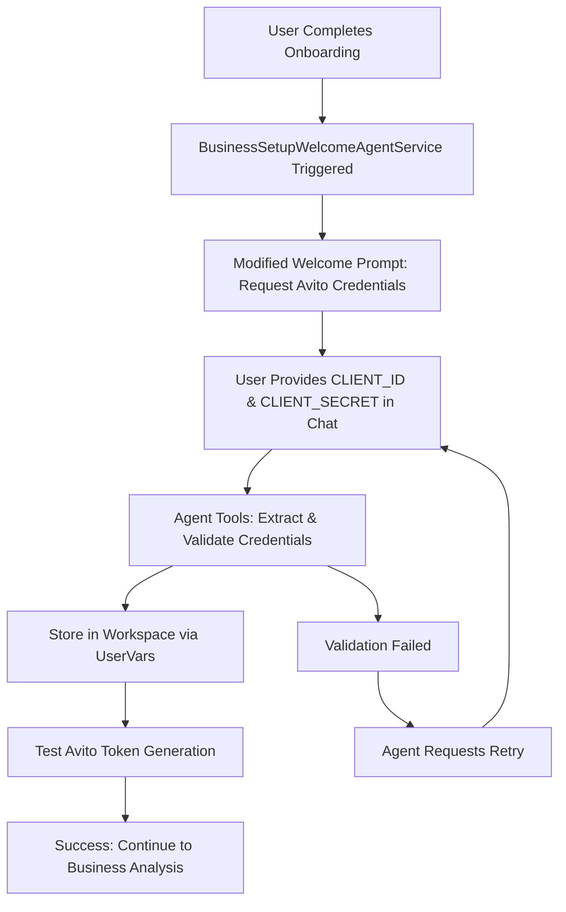
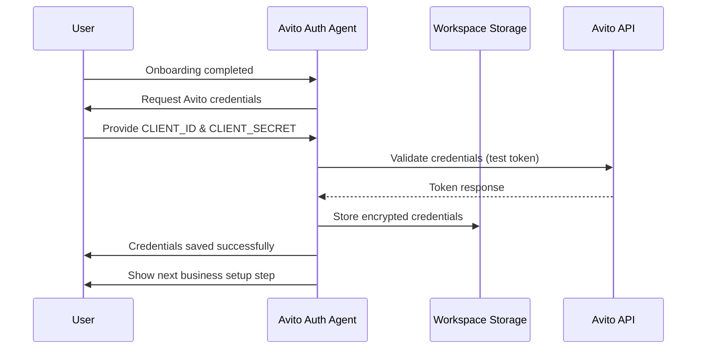
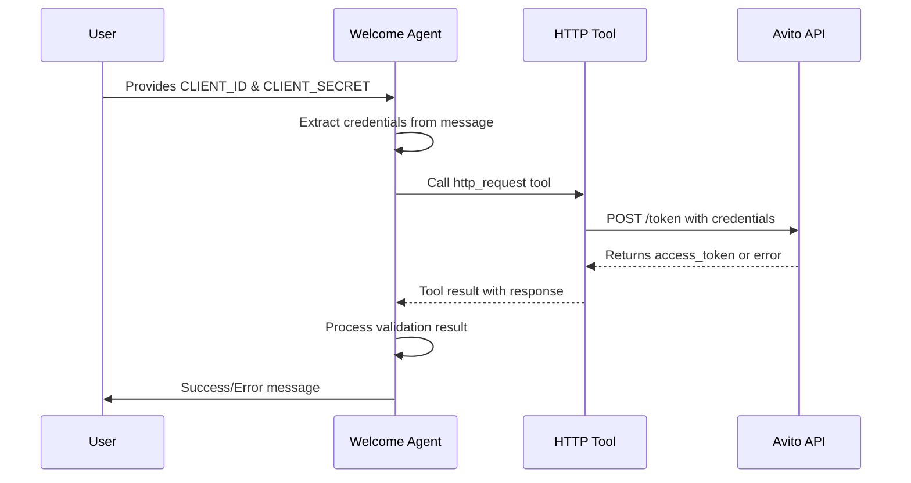

# Welcome Agent Redesign for Avito Authentication

## Overview

This document outlines the redesign of the existing Welcome Agent in Twenty CRM's business setup flow. The agent will be modified to collect and manage Avito API credentials (CLIENT_ID and CLIENT_SECRET) from users during the welcome step.

### Project Context
- **Repository Type**: Full-Stack Application (NestJS Backend + React Frontend)
- **Existing Infrastructure**: Twenty CRM with BusinessSetupWelcomeAgentService already implemented
- **Modification Target**: Existing welcome agent in packages/twenty-server/src/engine/core-modules/business-setup/
- **Goal**: Replace welcome greeting with Avito credentials collection flow

## Architecture

### Modified Welcome Agent Flow



### Data Flow Architecture



## Agent Chat Flow Design

### Welcome Message Flow

**Phase 1: Credential Collection**
```
🎉 Добро пожаловать в интеграцию Avito!

Для подключения к Avito API мне нужны ваши уникальные данные:

📋 **Что мне нужно:**
• CLIENT_ID - идентификатор клиента
• CLIENT_SECRET - секретный ключ

🔍 **Где найти эти данные:**
1. Войдите в ваш аккаунт Avito
2. Перейдите в раздел API
3. Скопируйте CLIENT_ID и CLIENT_SECRET

💡 **Формат ответа:**
CLIENT_ID: ваш_client_id
CLIENT_SECRET: ваш_client_secret

Или отправьте данные в любом удобном формате - я их пойму!
```

**Phase 2: Validation Process**
```
✅ Отлично! Проверяю ваши данные...

🔐 Тестирую подключение к Avito API:
• Отправляю запрос на получение токена
• Проверяю валидность учетных данных
• Сохраняю данные в защищенном хранилище

⏳ Подождите несколько секунд...
```

**Phase 3: Success Confirmation**
```
🎉 Успешно подключено к Avito API!

✅ **Что было сделано:**
• CLIENT_ID и CLIENT_SECRET сохранены
• Получен рабочий Access Token
• Соединение с Avito API проверено

🚀 **Следующий шаг:**
Теперь мы можем продолжить настройку вашего бизнеса.
Готовы перейти к анализу бизнес-процессов?
```

### Error Handling Flow

**Invalid Credentials**
```
❌ Не удалось подключиться к Avito API

🔍 **Возможные причины:**
• Неверный CLIENT_ID или CLIENT_SECRET
• Истек срок действия учетных данных
• Проблемы с сетевым соединением

💡 **Что делать:**
Проверьте данные в вашем аккаунте Avito и попробуйте еще раз.

Отправьте корректные данные в формате:
CLIENT_ID: ваш_client_id
CLIENT_SECRET: ваш_client_secret
```

## Backend Implementation

### Modified Welcome Agent Service

#### BusinessSetupWelcomeAgentService (Modified)
Update the existing welcome agent service to handle Avito authentication:

```typescript
// File: packages/twenty-server/src/engine/core-modules/business-setup/business-setup-welcome-agent.service.ts

@Injectable()
export class BusinessSetupWelcomeAgentService {
  // Existing method - modified prompt
  @OnEvent('onboarding.status.changed')
  async handleOnboardingStatusChange(payload: OnboardingStatusChangedEvent)
  
  // New methods for Avito integration
  private async getAvitoWelcomePrompt(user: User, workspace: Workspace): Promise<string>
  private async processUserResponse(threadId: string, message: string, workspaceId: string)
  private async validateAvitoCredentials(clientId: string, clientSecret: string)
  private async storeAvitoCredentials(workspaceId: string, credentials: AvitoCredentials)
}
```

#### Credentials Storage via UserVars
Use existing UserVarsService for secure credential storage:

```typescript
// Extend existing BusinessSetupStepKeys enum
export enum BusinessSetupStepKeys {
  // ... existing keys
  AVITO_CLIENT_ID = 'AVITO_CLIENT_ID',
  AVITO_CLIENT_SECRET = 'AVITO_CLIENT_SECRET',
  AVITO_ACCESS_TOKEN = 'AVITO_ACCESS_TOKEN',
  AVITO_TOKEN_EXPIRES_AT = 'AVITO_TOKEN_EXPIRES_AT',
}

// Update BusinessSetupKeyValueTypeMap
export type BusinessSetupKeyValueTypeMap = {
  // ... existing mappings
  [BusinessSetupStepKeys.AVITO_CLIENT_ID]: string;
  [BusinessSetupStepKeys.AVITO_CLIENT_SECRET]: string;
  [BusinessSetupStepKeys.AVITO_ACCESS_TOKEN]: string;
  [BusinessSetupStepKeys.AVITO_TOKEN_EXPIRES_AT]: string;
};
```

### Modified Welcome Agent Implementation

#### Step 1: Update BusinessSetupWelcomeAgentService
```typescript
// File: packages/twenty-server/src/engine/core-modules/business-setup/business-setup-welcome-agent.service.ts

@Injectable()
export class BusinessSetupWelcomeAgentService {
  constructor(
    private readonly eventEmitter: EventEmitter2,
    private readonly agentExecutionService: AgentExecutionService,
    private readonly agentChatService: AgentChatService,
    private readonly userVarsService: UserVarsService, // Use existing service
    private readonly userService: UserService,
    private readonly workspaceService: WorkspaceService,
    private readonly httpService: HttpService, // For Avito API calls
  ) {}

  @OnEvent('onboarding.status.changed')
  async handleOnboardingStatusChange(payload: OnboardingStatusChangedEvent) {
    if (payload.status === 'COMPLETED' && payload.previousStatus !== 'COMPLETED') {
      await this.createAvitoWelcomeChatWithRetry(payload.userId, payload.workspaceId);
    }
  }

  private async createAvitoWelcomeChatWithRetry(userId: string, workspaceId: string) {
    try {
      // Create thread for Avito authentication
      const thread = await this.agentChatService.createThread('welcome-agent', workspaceId);
      
      // Get user and workspace data
      const [user, workspace] = await Promise.all([
        this.userService.findById(userId),
        this.workspaceService.findById(workspaceId)
      ]);
      
      // Generate Avito-specific welcome prompt
      const prompt = this.getAvitoWelcomePrompt(user, workspace);
      
      // Send initial message
      const agentResponse = await this.agentExecutionService.executeAgent({
        agentId: 'welcome-agent',
        context: {
          workspaceId,
          userId,
          prompt,
          tools: ['extract_credentials', 'validate_avito_token', 'store_credentials']
        }
      });
      
      // Save agent's welcome message
      await this.agentChatService.addMessage({
        threadId: thread.id,
        role: 'assistant',
        content: agentResponse.content,
        fileIds: []
      });
      
      // Emit success event
      this.eventEmitter.emit('ai-agent.welcome.chat-created', {
        userId,
        workspaceId,
        threadId: thread.id,
        aiResponse: agentResponse.content,
        timestamp: new Date()
      });
      
    } catch (error) {
      this.logger.error('Failed to create Avito welcome chat:', error);
      
      this.eventEmitter.emit('ai-agent.welcome.chat-creation-failed', {
        userId,
        workspaceId,
        error: error.message,
        attempts: 1,
        timestamp: new Date()
      });
    }
  }

  // New method for processing user responses in the chat
  async processUserMessage(threadId: string, message: string, workspaceId: string, userId: string) {
    try {
      // Extract credentials from user message
      const credentials = this.extractCredentialsFromMessage(message);
      
      if (credentials.isValid) {
        // The agent will automatically use the http_request tool to validate credentials
        // This happens through the agent execution pipeline with tools
        const validationPrompt = `
User provided Avito credentials:
CLIENT_ID: ${credentials.clientId}
CLIENT_SECRET: ${credentials.clientSecret}

Please validate these credentials by making an HTTP request to Avito API to get an access token. Use the http_request tool with the following parameters:
- URL: https://api.avito.ru/token
- Method: POST
- Headers: Content-Type: application/x-www-form-urlencoded
- Body: grant_type=client_credentials&client_id=${credentials.clientId}&client_secret=${credentials.clientSecret}

If the request succeeds (status 200), the credentials are valid.
If it fails (status 400/401), the credentials are invalid.

Respond with validation results and next steps.`;
        
        // Execute agent with tools to validate credentials
        const agentResponse = await this.agentExecutionService.executeAgent({
          agentId: 'welcome-agent',
          context: {
            workspaceId,
            userId,
            threadId,
            prompt: validationPrompt
          }
        });
        
        // Process the agent's response which includes tool execution results
        await this.handleValidationResponse(agentResponse, credentials, workspaceId, userId, threadId);
        
      } else {
        // Request credentials again
        const retryMessage = `🔍 Не удалось найти CLIENT_ID и CLIENT_SECRET в вашем сообщении.

💡 Пожалуйста, отправьте данные в формате:

CLIENT_ID: ваш_client_id
CLIENT_SECRET: ваш_client_secret`;
        
        await this.agentChatService.addMessage({
          threadId,
          role: 'assistant',
          content: retryMessage,
          fileIds: []
        });
      }
    } catch (error) {
      this.logger.error('Error processing user message:', error);
    }
  }

  private async handleValidationResponse(
    agentResponse: any, 
    credentials: CredentialsExtractionResult, 
    workspaceId: string, 
    userId: string, 
    threadId: string
  ) {
    // Check if the agent's response indicates successful validation
    // The agent will have used the http_request tool and processed the response
    const responseText = agentResponse.result?.response || agentResponse.text;
    const isValidationSuccessful = this.parseValidationResult(responseText);
    
    if (isValidationSuccessful) {
      // Store credentials using UserVarsService
      await this.storeAvitoCredentials(workspaceId, userId, {
        clientId: credentials.clientId,
        clientSecret: credentials.clientSecret
      });
      
      // The success message will be sent by the agent itself as part of its response
      // We just need to handle the business logic transition
      await this.transitionToBusinessAnalysis(workspaceId, userId);
      
    } else {
      // The error message will be sent by the agent itself
      // We don't need to add additional messages here
      this.logger.warn(`Avito credentials validation failed for workspace ${workspaceId}`);
    }
  }
  
  private parseValidationResult(agentResponse: string): boolean {
    // Parse the agent's response to determine if validation was successful
    // Look for indicators of successful HTTP request (status 200, access_token, etc.)
    const successIndicators = [
      'access_token',
      'успешно',
      'status":200',
      'successfully',
      'validated'
    ];
    
    const errorIndicators = [
      'error',
      'failed',
      'invalid',
      'unauthorized',
      'status":400',
      'status":401'
    ];
    
    const hasSuccess = successIndicators.some(indicator => 
      agentResponse.toLowerCase().includes(indicator)
    );
    
    const hasError = errorIndicators.some(indicator => 
      agentResponse.toLowerCase().includes(indicator)
    );
    
    return hasSuccess && !hasError;
  }
          
          await this.agentChatService.addMessage({
            threadId,
            role: 'assistant',
            content: errorMessage,
            fileIds: []
          });
        }
      } else {
        // Request credentials again
        const retryMessage = `🔍 Не удалось найти CLIENT_ID и CLIENT_SECRET в вашем сообщении.

💡 Пожалуйста, отправьте данные в формате:

CLIENT_ID: ваш_client_id
CLIENT_SECRET: ваш_client_secret`;
        
        await this.agentChatService.addMessage({
          threadId,
          role: 'assistant',
          content: retryMessage,
          fileIds: []
        });
      }
    } catch (error) {
      this.logger.error('Error processing user message:', error);
    }
  }

  private extractCredentialsFromMessage(message: string): CredentialsExtractionResult {
    // Extract CLIENT_ID and CLIENT_SECRET from various formats
    const clientIdRegex = /CLIENT_ID[\s=:]*['"]?([A-Za-z0-9_-]+)['"]?/i;
    const clientSecretRegex = /CLIENT_SECRET[\s=:]*['"]?([A-Za-z0-9_-]+)['"]?/i;
    
    const clientIdMatch = message.match(clientIdRegex);
    const clientSecretMatch = message.match(clientSecretRegex);
    
    return {
      clientId: clientIdMatch ? clientIdMatch[1] : null,
      clientSecret: clientSecretMatch ? clientSecretMatch[1] : null,
      isValid: !!(clientIdMatch && clientSecretMatch)
    };
  }


  private async storeAvitoCredentials(
    workspaceId: string, 
    userId: string, 
    credentials: { clientId: string; clientSecret: string }
  ) {
    // Store using existing UserVarsService
    await Promise.all([
      this.userVarsService.set({
        userId,
        workspaceId,
        key: BusinessSetupStepKeys.AVITO_CLIENT_ID,
        value: credentials.clientId
      }),
      this.userVarsService.set({
        userId,
        workspaceId,
        key: BusinessSetupStepKeys.AVITO_CLIENT_SECRET,
        value: credentials.clientSecret
      })
    ]);
  }

  private async transitionToBusinessAnalysis(workspaceId: string, userId: string) {
    // Mark welcome step as completed and transition to business analysis
    await this.userVarsService.set({
      userId,
      workspaceId,
      key: BusinessSetupStepKeys.BUSINESS_SETUP_WELCOME_PENDING,
      value: false
    });
    
    await this.userVarsService.set({
      userId,
      workspaceId,
      key: BusinessSetupStepKeys.BUSINESS_SETUP_BUSINESS_ANALYSIS_PENDING,
      value: true
    });
    
    // Emit transition event
    this.eventEmitter.emit('business-setup.step-transition', {
      userId,
      workspaceId,
      fromStep: 'WELCOME',
      toStep: 'BUSINESS_ANALYSIS',
      timestamp: new Date()
    });
  }
}
```

### Data Models

#### Use Existing UserVars Storage
No new database tables needed - use existing UserVarsService:

```typescript
// Types for Avito credentials
export interface AvitoCredentials {
  clientId: string;
  clientSecret: string;
}

export interface AvitoTokenResponse {
  access_token: string;
  token_type: string;
  expires_in: number;
}

export interface CredentialsExtractionResult {
  clientId: string | null;
  clientSecret: string | null;
  isValid: boolean;
}
```


## Agent Tools & Validation

### Using Existing HTTP Tool for Avito API Validation

The agent will use Twenty's existing **HTTP Tool** (`http_request`) to validate Avito credentials. This tool is automatically available to all agents and supports:

- All HTTP methods (GET, POST, PUT, PATCH, DELETE)
- Custom headers and request body
- Error handling and response processing

#### Validation Flow with HTTP Tool



### Agent Tool Configuration

#### HTTP Tool Usage for Token Validation
```typescript
// The agent will use the http_request tool like this:
const httpToolCall = {
  toolDescription: "Проверяю ваши Avito credentials через API",
  input: {
    url: "https://api.avito.ru/token",
    method: "POST",
    headers: {
      "Content-Type": "application/x-www-form-urlencoded"
    },
    body: "grant_type=client_credentials&client_id=YOUR_CLIENT_ID&client_secret=YOUR_CLIENT_SECRET"
  }
};
```

#### Agent Tools Available
1. **http_request** - For Avito API calls
2. **Database tools** - For storing credentials in UserVars
3. **Handoff tools** - For transferring to next business setup step

### Modified Agent Prompt for Tool Usage

```typescript
private getAvitoWelcomePrompt(user: User, workspace: Workspace): string {
  return `
Привет, ${user.firstName || 'пользователь'}! 👋

Добро пожаловать в настройку интеграции с Avito для ${workspace.displayName}!

Для подключения к Avito API мне нужны ваши уникальные учетные данные:

📋 **Что мне нужно:**
• CLIENT_ID - идентификатор вашего приложения
• CLIENT_SECRET - секретный ключ

🔍 **Где найти эти данные:**
1. Войдите в ваш аккаунт на Avito
2. Перейдите в раздел "API для разработчиков"
3. Скопируйте CLIENT_ID и CLIENT_SECRET

💡 **Как отправить:**
Просто напишите мне в любом удобном формате, например:

CLIENT_ID = 'R3cTDMk9rEJ2lh5A9_QF'
CLIENT_SECRET = 'ehAWb-RBQrLmgoJWfgtst737eQV6KIBHzmV1NmIc'

Или просто:
CLIENT_ID: ваш_id
CLIENT_SECRET: ваш_secret

Я автоматически извлеку данные и проверю их работоспособность! 🚀

---

TOOL USAGE INSTRUCTIONS:
When user provides credentials:
1. Extract CLIENT_ID and CLIENT_SECRET from their message
2. Use http_request tool to validate credentials:
   - URL: https://api.avito.ru/token
   - Method: POST
   - Headers: Content-Type: application/x-www-form-urlencoded
   - Body: grant_type=client_credentials&client_id=EXTRACTED_ID&client_secret=EXTRACTED_SECRET
3. If successful (status 200), store credentials and congratulate user
4. If failed, explain the error and ask to retry
5. Once validated, transition to next business setup step

Always use the http_request tool for API validation - don't try to validate manually.
  `;
}
```

## Frontend Implementation

### Modified Welcome Popup

#### Update Existing Welcome Popup
Modify existing welcome popup to show Avito-specific content:

```typescript
// File: packages/twenty-front/src/modules/ai/providers/BusinessSetupEventProvider.tsx

// Update welcome message processing
const lastWelcomeMessage = subscriptions.lastWelcomeeChatEvent?.status === 'CHAT_CREATED' 
  ? '🎉 Настройка интеграции Avito начинается! Нажмите, чтобы продолжить.' 
  : null;
```

#### Update Welcome Message Hook
```typescript
// File: packages/twenty-front/src/modules/business-setup/hooks/useBusinessSetupAgentChat.ts

const getWelcomeMessageForStep = (step: BusinessSetupStatus): string => {
  const messages = {
    WELCOME: "🚀 Настройка интеграции Avito! Мне нужны ваши CLIENT_ID и CLIENT_SECRET для подключения к API.",
    // ... other steps remain the same
  };
  return messages[step] || messages.WELCOME;
};
```


## Environment Configuration

### Update .env for Avito Integration
```bash
# Add to packages/twenty-server/.env
AVITO_TOKEN_URL=https://api.avito.ru/token
AVITO_API_TIMEOUT=30000
AVITO_MAX_RETRY_ATTEMPTS=3
```

### Update ConfigService
```typescript
// File: packages/twenty-server/src/engine/core-modules/environment/environment.service.ts

// Add Avito configuration
export interface AvitoConfig {
  tokenUrl: string;
  apiTimeout: number;
  maxRetryAttempts: number;
}

// In EnvironmentService class
get avito(): AvitoConfig {
  return {
    tokenUrl: this.get('AVITO_TOKEN_URL') || 'https://api.avito.ru/token',
    apiTimeout: parseInt(this.get('AVITO_API_TIMEOUT') || '30000'),
    maxRetryAttempts: parseInt(this.get('AVITO_MAX_RETRY_ATTEMPTS') || '3')
  };
}
```

## Database Storage

### Use Existing UserVars System
No database migration needed - utilize existing user_vars table:

```typescript
// Store Avito credentials via UserVarsService
const userVarsService = this.userVarsService;

// Store CLIENT_ID
await userVarsService.set({
  userId: user.id,
  workspaceId: workspace.id,
  key: BusinessSetupStepKeys.AVITO_CLIENT_ID,
  value: clientId
});

// Store CLIENT_SECRET
await userVarsService.set({
  userId: user.id,
  workspaceId: workspace.id,
  key: BusinessSetupStepKeys.AVITO_CLIENT_SECRET,
  value: clientSecret
});
```


## Testing Implementation

### Unit Tests for Modified Welcome Agent
```typescript
// File: packages/twenty-server/src/engine/core-modules/business-setup/business-setup-welcome-agent.service.spec.ts

describe('BusinessSetupWelcomeAgentService - Avito Integration', () => {
  let service: BusinessSetupWelcomeAgentService;
  let mockUserVarsService: jest.Mocked<UserVarsService>;
  let mockHttpService: jest.Mocked<HttpService>;
  
  beforeEach(async () => {
    const module = await Test.createTestingModule({
      providers: [
        BusinessSetupWelcomeAgentService,
        { provide: UserVarsService, useFactory: () => mockUserVarsService },
        { provide: HttpService, useFactory: () => mockHttpService },
        // ... other mocked services
      ],
    }).compile();
    
    service = module.get<BusinessSetupWelcomeAgentService>(BusinessSetupWelcomeAgentService);
  });
  
  describe('extractCredentialsFromMessage', () => {
    it('should extract credentials from standard format', () => {
      const message = "CLIENT_ID = 'R3cTDMk9rEJ2lh5A9_QF'\nCLIENT_SECRET = 'ehAWb-RBQrLmgoJWfgtst737eQV6KIBHzmV1NmIc'";
      
      const result = service['extractCredentialsFromMessage'](message);
      
      expect(result.isValid).toBe(true);
      expect(result.clientId).toBe('R3cTDMk9rEJ2lh5A9_QF');
      expect(result.clientSecret).toBe('ehAWb-RBQrLmgoJWfgtst737eQV6KIBHzmV1NmIc');
    });
    
    it('should extract credentials from colon format', () => {
      const message = "CLIENT_ID: test123\nCLIENT_SECRET: secret456";
      
      const result = service['extractCredentialsFromMessage'](message);
      
      expect(result.isValid).toBe(true);
      expect(result.clientId).toBe('test123');
      expect(result.clientSecret).toBe('secret456');
    });
    
    it('should return invalid for incomplete credentials', () => {
      const message = "CLIENT_ID: test123";
      
      const result = service['extractCredentialsFromMessage'](message);
      
      expect(result.isValid).toBe(false);
    });
  });
  
  describe('validateAvitoCredentials', () => {
    it('should validate correct credentials', async () => {
      const mockResponse = {
        data: {
          access_token: 'valid_token',
          expires_in: 3600
        }
      };
      
      mockHttpService.post.mockReturnValue(of(mockResponse) as any);
      
      const result = await service['validateAvitoCredentials']('test_id', 'test_secret');
      
      expect(result.success).toBe(true);
      expect(result.accessToken).toBe('valid_token');
    });
    
    it('should handle invalid credentials', async () => {
      mockHttpService.post.mockReturnValue(throwError(new Error('Unauthorized')) as any);
      
      const result = await service['validateAvitoCredentials']('invalid_id', 'invalid_secret');
      
      expect(result.success).toBe(false);
      expect(result.error).toContain('Unauthorized');
    });
  });
  
  describe('processUserMessage', () => {
    it('should process valid credentials and store them', async () => {
      const message = "CLIENT_ID: R3cTDMk9rEJ2lh5A9_QF\nCLIENT_SECRET: ehAWb-RBQrLmgoJWfgtst737eQV6KIBHzmV1NmIc";
      
      // Mock successful validation
      mockHttpService.post.mockReturnValue(of({
        data: { access_token: 'token123', expires_in: 3600 }
      }) as any);
      
      await service.processUserMessage('thread-123', message, 'workspace-123', 'user-123');
      
      // Verify credentials were stored
      expect(mockUserVarsService.set).toHaveBeenCalledWith({
        userId: 'user-123',
        workspaceId: 'workspace-123',
        key: BusinessSetupStepKeys.AVITO_CLIENT_ID,
        value: 'R3cTDMk9rEJ2lh5A9_QF'
      });
      
      expect(mockUserVarsService.set).toHaveBeenCalledWith({
        userId: 'user-123',
        workspaceId: 'workspace-123',
        key: BusinessSetupStepKeys.AVITO_CLIENT_SECRET,
        value: 'ehAWb-RBQrLmgoJWfgtst737eQV6KIBHzmV1NmIc'
      });
    });
  });
});
```