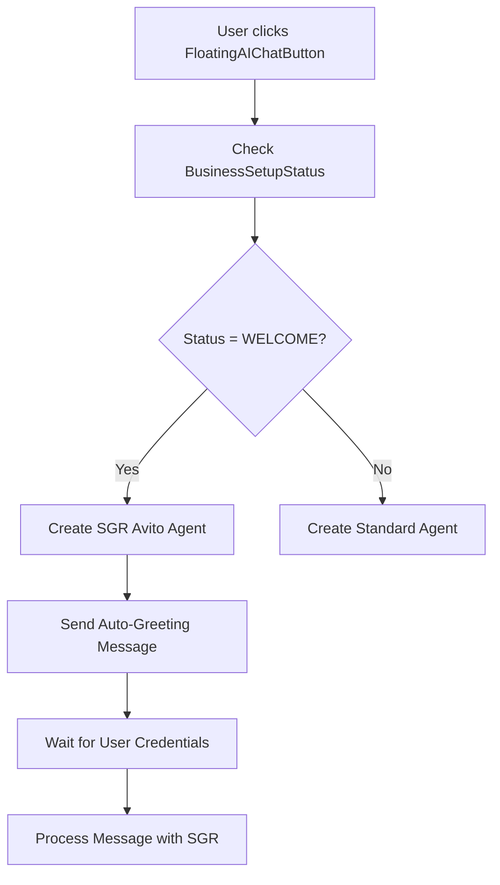
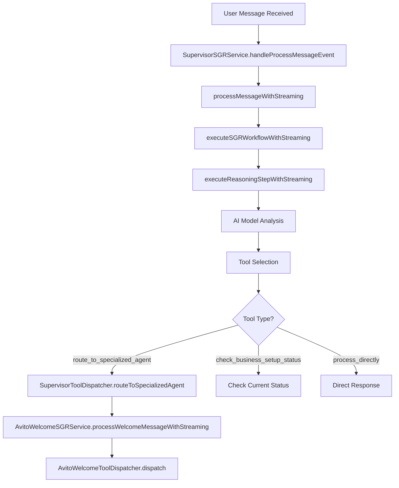
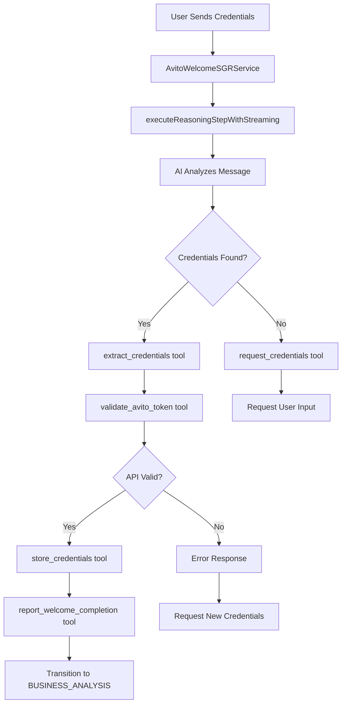
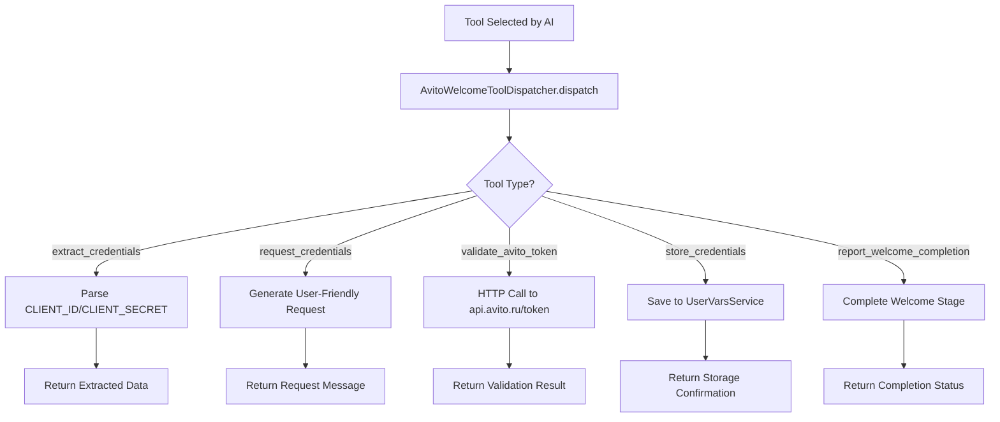
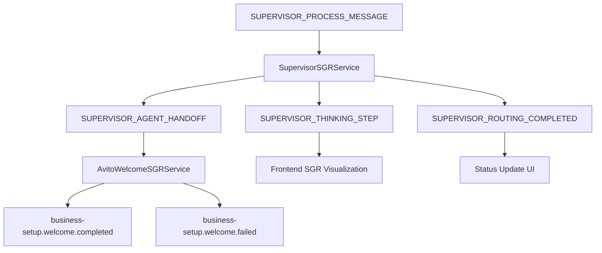
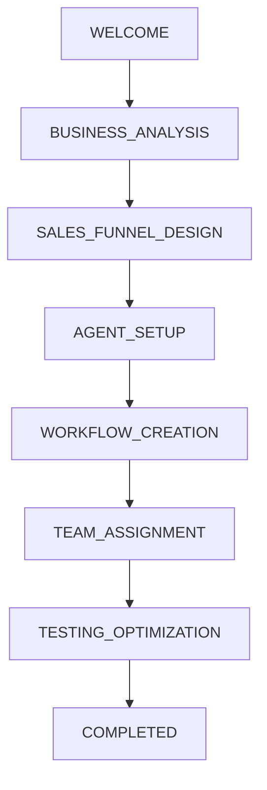
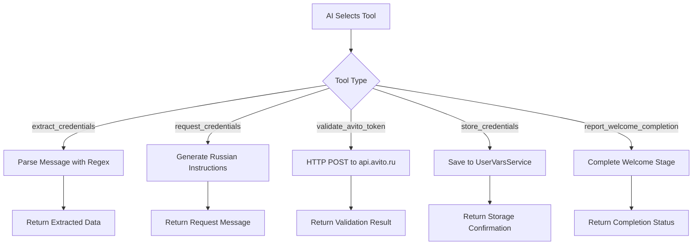

# SGR Avito Integration Assistant - Architecture Analysis

## Overview

The SGR Avito Integration Assistant represents a sophisticated implementation of Schema-Guided Reasoning (SGR) within the Twenty CRM system. This specialized AI agent handles automated Avito API integration setup during the business onboarding process, utilizing streaming responses and intelligent credential processing.

## Architecture Components

### Core Service Classes

#### 1. AvitoWelcomeSGRService

**Location**: `packages/twenty-server/src/engine/core-modules/business-setup/sgr/services/avito-welcome-sgr.service.ts`

**Purpose**: Main SGR orchestrator for Avito Welcome Agent workflow execution

**Key Dependencies**:
- UserVarsService<BusinessSetupKeyValueTypeMap>
- AgentChatService  
- AiModelRegistryService
- AvitoWelcomeToolDispatcherService
- EventEmitter2

**Core Methods**:
```typescript
// Main entry points
async processWelcomeMessage(message: string, userId: string, workspaceId: string, threadId: string): Promise<void>
async *processWelcomeMessageWithStreaming(userMessage: string, userId: string, workspaceId: string, threadId: string): AsyncGenerator<SGRStreamingResult>

// Workflow execution
private async *executeSGRWorkflowWithStreaming(params: SGRExecutionParams, context: SGRStreamingContext): AsyncGenerator<SGRStreamingResult>
private async executeReasoningStepWithStreaming(context: WelcomeExecutionContext): Promise<SGRStepResult>

// Result handling
private async handleWelcomeResult(result: SGRExecutionResult, userId: string, workspaceId: string, threadId: string): Promise<void>
private async handleWelcomeResultStreaming(result: SGRExecutionResult, userId: string, workspaceId: string, threadId: string): Promise<void>
```

#### 2. AvitoWelcomeToolDispatcherService

**Location**: `packages/twenty-server/src/engine/core-modules/business-setup/sgr/services/avito-welcome-tool-dispatcher.service.ts`

**Purpose**: Type-safe routing and execution of structured reasoning tools for credential processing

**Key Dependencies**:
- UserVarsService<BusinessSetupKeyValueTypeMap>
- HttpTool

**Core Methods**:
```typescript
// Main dispatcher
async dispatch(command: WelcomeToolUnion, userId: string, workspaceId: string): Promise<ToolExecutionResult>

// Tool implementations
private async extractCredentials(cmd: ExtractCredentialsType, userId: string, workspaceId: string): Promise<ToolExecutionResult>
private handleCredentialRequest(cmd: RequestCredentialsType): ToolExecutionResult
private async validateCredentials(cmd: ValidateAvitoTokenType, userId: string, workspaceId: string): Promise<ToolExecutionResult>
private async storeCredentials(cmd: StoreCredentialsType, userId: string, workspaceId: string): Promise<ToolExecutionResult>
private handleCompletion(cmd: ReportWelcomeCompletionType): ToolExecutionResult
```

#### 3. SupervisorSGRService

**Location**: `packages/twenty-server/src/engine/core-modules/business-setup/sgr/services/supervisor-sgr.service.ts`

**Purpose**: Central orchestrator for business setup reasoning workflows with supervisor agent capabilities

**Key Dependencies**:
- UserVarsService<BusinessSetupKeyValueTypeMap>
- AgentChatService
- AiModelRegistryService
- SupervisorToolDispatcherService (via forwardRef)
- EventEmitter2

**Core Methods**:
```typescript
// Event-driven processing
@OnEvent(BUSINESS_SETUP_EVENTS.SUPERVISOR_PROCESS_MESSAGE)
async handleProcessMessageEvent(payload: SupervisorProcessMessageEvent): Promise<void>

// Streaming workflow
async *processMessageWithStreaming(userMessage: string, userId: string, workspaceId: string, threadId: string): AsyncGenerator<SupervisorSGRStreamingResult>

// Execution engine
private async *executeSGRWorkflowWithStreaming(params: SupervisorExecutionParams, context: SupervisorStreamingContext): AsyncGenerator<SupervisorSGRStreamingResult>
private async executeReasoningStepWithStreaming(context: ExecutionContext): Promise<SupervisorStepResult>
```

#### 4. SupervisorToolDispatcherService

**Location**: `packages/twenty-server/src/engine/core-modules/business-setup/sgr/services/supervisor-tool-dispatcher.service.ts`

**Purpose**: Type-safe tool execution for supervisor decisions and agent routing

**Key Dependencies**:
- UserVarsService<BusinessSetupKeyValueTypeMap>
- AgentChatService
- BusinessSetupAgentService (via forwardRef)
- AvitoWelcomeSGRService
- EventEmitter2

**Core Methods**:
```typescript
// Main dispatch system
async dispatch(tool: SupervisorStepResult['function'], userId: string, workspaceId: string): Promise<SupervisorToolExecutionResult>

// Business setup management
async checkBusinessSetupStatus(userId: string, workspaceId: string): Promise<BusinessSetupProgress>

// Agent routing
async routeToSpecializedAgent(status: BusinessSetupStatus, message: string, userId: string, workspaceId: string, threadId: string, reason: string): Promise<SupervisorToolExecutionResult>

// Direct processing
async processDirectly(response: string, reason: string): Promise<SupervisorToolExecutionResult>

// Status management
async statusChange(fromStatus: BusinessSetupStatus, toStatus: BusinessSetupStatus, userId: string, workspaceId: string, reason: string, triggerEvent?: string): Promise<SupervisorToolExecutionResult>
```

### Configuration Classes

#### 1. Business Setup Agent Configuration

**Location**: `packages/twenty-front/src/modules/business-setup/config/businessSetupAgents.config.ts`

**Purpose**: Defines specialized agent configurations for each business setup stage

```typescript
export const BUSINESS_SETUP_AGENTS: Record<BusinessSetupStatus, BusinessSetupAgentConfig> = {
  WELCOME: {
    step: 'WELCOME',
    agentId: SGR_AVITO_AGENT_ID,
    displayName: 'SGR Avito Integration Assistant',
    capabilities: ['credential_extraction', 'api_validation', 'setup_guidance', 'auto_greeting', 'sgr_processing'],
    sgrEnabled: true,
    autoInit: true,
    forceAgent: true,
    autoGreeting: true,
    greetingMessage: "🤖 **Привет! Я SGR Avito Integration Assistant**..."
  }
  // ... other stages
}
```

### Schema Definition Classes

#### 1. Avito Welcome SGR Schema

**Location**: `packages/twenty-server/src/engine/core-modules/business-setup/sgr/schemas/avito-welcome-sgr.schema.ts`

**Purpose**: Zod schemas for type-safe Schema-Guided Reasoning patterns

**Key Schemas**:
```typescript
// Main reasoning control
export const AvitoWelcomeStepSchema = z.object({
  current_state: z.string(),
  plan_remaining_steps: z.array(z.string()).min(1).max(3),
  task_completed: z.boolean(),
  function: z.discriminatedUnion('tool', [
    ExtractCredentialsSchema,
    RequestCredentialsSchema,
    ValidateAvitoTokenSchema,
    StoreCredentialsSchema,
    ReportWelcomeCompletionSchema
  ])
});

// Tool-specific schemas
export const ExtractCredentialsSchema = z.object({
  tool: z.literal('extract_credentials'),
  message: z.string(),
  extraction_method: z.enum(['regex', 'nlp', 'guided']).optional()
});

export const ValidateAvitoTokenSchema = z.object({
  tool: z.literal('validate_avito_token'),
  client_id: z.string().min(1),
  client_secret: z.string().min(1),
  validation_url: z.string().url().optional()
});
```

#### 2. Supervisor SGR Schema

**Location**: `packages/twenty-server/src/engine/core-modules/business-setup/sgr/schemas/supervisor-sgr.schema.ts`

**Purpose**: Schemas for supervisor reasoning and routing decisions

```typescript
export const SupervisorStepSchema = z.object({
  thinking: z.string(),
  current_state: z.string(),
  plan_remaining_steps: z.array(z.string()).min(1).max(3),
  function: z.discriminatedUnion('tool', [
    CheckBusinessSetupStatusToolSchema,
    RouteToSpecializedAgentToolSchema,
    ProcessDirectlyToolSchema,
    StatusChangeToolSchema,
    CompleteRoutingToolSchema
  ])
});
```

### Frontend Integration Classes

#### 1. Business Setup Agent Chat Hook

**Location**: `packages/twenty-front/src/modules/business-setup/hooks/useBusinessSetupAgentChat.ts`

**Purpose**: React hook for creating specialized SGR agents during business setup

```typescript
export const useBusinessSetupAgentChat = () => {
  // SGR Avito Agent creation with auto-greeting
  const createSGRAvitoAgentWithGreeting = useCallback(async () => {
    const maxRetries = 3;
    for (let attempt = 1; attempt <= maxRetries; attempt++) {
      try {
        await aiChatErrorRecovery.executeRecovery(
          async () => await createSGRThread(),
          {
            agentId: SGR_AVITO_AGENT_ID,
            businessSetupStatus: 'WELCOME',
            maxRetries: 1
          }
        );
        return;
      } catch (error) {
        // Retry logic with exponential backoff
      }
    }
  }, []);
};
```

#### 2. SGR Streaming Hook

**Location**: `packages/twenty-front/src/modules/ai/hooks/useSGRStreaming.ts`

**Purpose**: Frontend hook for handling real-time SGR streaming messages

```typescript
export const useSGRStreaming = (agentId: string) => {
  const [currentSGRStep, setCurrentSGRStep] = useState<string>('');
  
  const handleSGRStreamingMessage = useCallback((message: SGRStreamingMessage) => {
    switch (message.type) {
      case SGRMessageType.THINKING:
        addThinkingMessage(message.step);
        break;
      case SGRMessageType.TOOL_EXECUTION:
        addToolExecutionMessage(message.step);
        break;
      case SGRMessageType.FINAL_RESPONSE:
        addFinalResponseMessage(message.content);
        break;
    }
  }, []);
};
```

### Type Definition Classes

#### 1. SGR Streaming Types

**Location**: `packages/twenty-server/src/engine/core-modules/business-setup/sgr/types/sgr-thinking-stream.types.ts`

**Purpose**: Type definitions for SGR streaming workflow

```typescript
export interface SGRStreamingResult {
  type: 'thinking' | 'function_call' | 'tool_result' | 'final_response';
  content?: string;
  step?: SGRThinkingStep;
  completed: boolean;
  timestamp?: Date;
}

export interface SGRThinkingStep {
  stepNumber: number;
  thinking?: string;
  reasoning?: string;
  currentState: string;
  plannedSteps: string[];
  selectedTool: string;
  toolData?: any;
  timestamp: Date;
}
```

#### 2. Supervisor Types

**Location**: `packages/twenty-server/src/engine/core-modules/business-setup/sgr/types/supervisor-types.ts`

**Purpose**: Type definitions for supervisor workflow

```typescript
export interface SupervisorSGRStreamingResult {
  type: 'thinking' | 'function_call' | 'tool_result' | 'final_response';
  content?: string;
  step?: SupervisorThinkingStep;
  completed: boolean;
}

export interface SupervisorToolExecutionResult {
  success: boolean;
  message?: string;
  data?: any;
  error?: string;
  routedTo?: string;
  nextStatus?: BusinessSetupStatus;
}
```

## Workflow Architecture

### 1. User Interaction Flow



### 2. SGR Processing Workflow



### 3. Avito Credential Processing



### 4. Tool Execution Flow



### 5. Event-Driven Communication



## Analysis and Integration Strategy for Enhanced Avito Agent Workflow

### Current Architecture Assessment

Our existing Avito SGR system already implements many of the proposed concepts, but with a more flexible, AI-driven approach rather than a rigid state machine. Let me analyze the key differences and integration opportunities:

#### Current Implementation Strengths

1. **AI-Guided Decision Making**: Uses Gemini 2.5 Flash with Zod schemas for intelligent tool selection
2. **Type-Safe Tool Dispatch**: Discriminated unions ensure compile-time safety
3. **Streaming Responses**: Real-time user feedback via AsyncGenerator patterns
4. **Event-Driven Architecture**: Prevents circular dependencies and enables monitoring
5. **Comprehensive Testing**: Unit, integration, and streaming test coverage

#### Proposed Architecture Benefits

1. **Explicit State Management**: Clear state transitions and validation
2. **Retry Logic**: Built-in error recovery mechanisms
3. **Context Persistence**: Workflow state preservation across sessions
4. **Stricter Validation**: Tool-to-state validation matrix
5. **Enhanced Monitoring**: Health checks and audit trails

### Integration Strategy

#### Phase 1: Enhanced Context Management

**Add State Tracking to Existing SGR Service**

```typescript
// packages/twenty-server/src/engine/core-modules/business-setup/sgr/types/avito-workflow-context.ts

export enum AvitoWorkflowState {
  INIT = 'INIT',
  GREETING_SENT = 'GREETING_SENT',
  AWAITING_CREDENTIALS = 'AWAITING_CREDENTIALS',
  EXTRACTING_CREDENTIALS = 'EXTRACTING_CREDENTIALS',
  VALIDATING_CREDENTIALS = 'VALIDATING_CREDENTIALS',
  STORING_CREDENTIALS = 'STORING_CREDENTIALS',
  COMPLETING_WELCOME = 'COMPLETING_WELCOME',
  WELCOME_COMPLETED = 'WELCOME_COMPLETED',
  ERROR_STATE = 'ERROR_STATE'
}

export interface AvitoWorkflowContext {
  state: AvitoWorkflowState;
  attemptCount: number;
  maxAttempts: number;
  credentials?: {
    clientId?: string;
    clientSecret?: string;
    accessToken?: string;
    expiresAt?: Date;
  };
  validationResult?: {
    success: boolean;
    error?: string;
    accessToken?: string;
    expiresIn?: number;
  };
  lastError?: string;
  userId: string;
  workspaceId: string;
  threadId: string;
  createdAt: Date;
  updatedAt: Date;
}
```

**Enhance Existing AvitoWelcomeSGRService**

```typescript
// Enhanced processWelcomeMessageWithStreaming method
async *processWelcomeMessageWithStreaming(
  userMessage: string,
  userId: string,
  workspaceId: string,
  threadId: string
): AsyncGenerator<SGRStreamingResult> {
  
  // Get or initialize workflow context
  const context = await this.getOrInitializeWorkflowContext(
    userId, workspaceId, threadId
  );
  
  // Validate state transition
  if (!this.isValidStateTransition(context.state, userMessage)) {
    yield* this.handleInvalidStateTransition(context);
    return;
  }
  
  // Update context with current message
  context.updatedAt = new Date();
  await this.saveWorkflowContext(context);
  
  // Execute existing SGR workflow with state awareness
  const sgrContext: SGRStreamingContext = {
    userId,
    workspaceId,
    threadId,
    userMessage,
    maxSteps: 5,
    workflowContext: context // Add workflow context
  };
  
  try {
    yield* this.executeSGRWorkflowWithStreaming({
      task: this.buildContextAwareTask(userMessage, context),
      userId,
      workspaceId,
      threadId,
      maxSteps: 5
    }, sgrContext);
    
  } catch (error) {
    // Update context with error state
    context.state = AvitoWorkflowState.ERROR_STATE;
    context.lastError = error.message;
    await this.saveWorkflowContext(context);
    
    yield {
      type: 'final_response',
      content: this.buildRetryMessage(context),
      completed: true
    };
  }
}

private buildContextAwareTask(
  userMessage: string, 
  context: AvitoWorkflowContext
): string {
  const baseTask = `
Пользователь отправил сообщение: "${userMessage}"

Текущее состояние: ${context.state}
Попытка: ${context.attemptCount + 1} из ${context.maxAttempts}
`;
  
  switch (context.state) {
    case AvitoWorkflowState.INIT:
    case AvitoWorkflowState.GREETING_SENT:
      return baseTask + `
Задача: Отправить приветствие и запросить учетные данные Avito API.`;
      
    case AvitoWorkflowState.AWAITING_CREDENTIALS:
      return baseTask + `
Задача: Извлечь CLIENT_ID и CLIENT_SECRET из сообщения пользователя.
Если данные не найдены - запросить повторно с подробными инструкциями.`;
      
    case AvitoWorkflowState.EXTRACTING_CREDENTIALS:
      return baseTask + `
Задача: Проверить валидность извлеченных учетных данных через API Avito.
CLIENT_ID: ${context.credentials?.clientId}
CLIENT_SECRET: ${context.credentials?.clientSecret?.substring(0, 10)}...`;
      
    default:
      return baseTask + `
Задача: Продолжить обработку в соответствии с текущим состоянием.`;
  }
}
```

#### Phase 2: Enhanced Tool Dispatcher with State Validation

**Extend AvitoWelcomeToolDispatcherService**

```typescript
// Enhanced dispatch method with state validation
async dispatch(
  command: WelcomeToolUnion,
  userId: string,
  workspaceId: string,
  context?: AvitoWorkflowContext
): Promise<ToolExecutionResult> {
  
  // Get workflow context if not provided
  if (!context) {
    context = await this.getWorkflowContext(userId, workspaceId);
  }
  
  // Validate tool is allowed in current state
  if (!this.isToolAllowedInState(command.tool, context.state)) {
    return {
      success: false,
      error: `Tool ${command.tool} not allowed in state ${context.state}`,
      message: this.buildStateValidationMessage(command.tool, context.state)
    };
  }
  
  // Execute tool with state updates
  const result = await this.executeToolWithStateManagement(
    command, userId, workspaceId, context
  );
  
  // Update workflow state based on result
  await this.updateWorkflowState(result, context, userId, workspaceId);
  
  return result;
}

private isToolAllowedInState(
  tool: string, 
  state: AvitoWorkflowState
): boolean {
  const allowedTools: Record<AvitoWorkflowState, string[]> = {
    [AvitoWorkflowState.INIT]: ['request_credentials'],
    [AvitoWorkflowState.GREETING_SENT]: ['request_credentials'],
    [AvitoWorkflowState.AWAITING_CREDENTIALS]: [
      'extract_credentials', 
      'request_credentials'
    ],
    [AvitoWorkflowState.EXTRACTING_CREDENTIALS]: [
      'validate_avito_token',
      'request_credentials' // Allow retry on extraction failure
    ],
    [AvitoWorkflowState.VALIDATING_CREDENTIALS]: [
      'store_credentials',
      'request_credentials' // Allow retry on validation failure
    ],
    [AvitoWorkflowState.STORING_CREDENTIALS]: [
      'report_welcome_completion'
    ],
    [AvitoWorkflowState.ERROR_STATE]: [
      'request_credentials',
      'extract_credentials'
    ]
  };
  
  return allowedTools[state]?.includes(tool) || false;
}

private async updateWorkflowState(
  result: ToolExecutionResult,
  context: AvitoWorkflowContext,
  userId: string,
  workspaceId: string
): Promise<void> {
  
  const previousState = context.state;
  
  // Update state based on tool execution result
  switch (context.state) {
    case AvitoWorkflowState.AWAITING_CREDENTIALS:
      if (result.success && result.data?.extraction_successful) {
        context.state = AvitoWorkflowState.EXTRACTING_CREDENTIALS;
        context.credentials = result.data.credentials;
      } else {
        context.attemptCount++;
        if (context.attemptCount >= context.maxAttempts) {
          context.state = AvitoWorkflowState.ERROR_STATE;
        }
      }
      break;
      
    case AvitoWorkflowState.EXTRACTING_CREDENTIALS:
      if (result.success && result.data?.validation_successful) {
        context.state = AvitoWorkflowState.VALIDATING_CREDENTIALS;
        context.validationResult = result.data;
      } else {
        context.state = AvitoWorkflowState.AWAITING_CREDENTIALS;
        context.attemptCount++;
      }
      break;
      
    case AvitoWorkflowState.VALIDATING_CREDENTIALS:
      if (result.success && result.data?.storage_successful) {
        context.state = AvitoWorkflowState.STORING_CREDENTIALS;
      } else {
        context.state = AvitoWorkflowState.ERROR_STATE;
      }
      break;
      
    case AvitoWorkflowState.STORING_CREDENTIALS:
      if (result.success && result.data?.task_completed) {
        context.state = AvitoWorkflowState.WELCOME_COMPLETED;
      }
      break;
  }
  
  // Save updated context
  context.updatedAt = new Date();
  await this.saveWorkflowContext(context, userId, workspaceId);
  
  // Emit state change event
  this.eventEmitter.emit('avito-workflow.state.changed', {
    userId,
    workspaceId,
    threadId: context.threadId,
    previousState,
    newState: context.state,
    timestamp: new Date()
  });
}
```

#### Phase 3: Enhanced Error Recovery and Retry Logic

**Add Retry Service**

```typescript
// packages/twenty-server/src/engine/core-modules/business-setup/sgr/services/avito-error-recovery.service.ts

@Injectable()
export class AvitoErrorRecoveryService {
  private readonly logger = new Logger(AvitoErrorRecoveryService.name);
  
  private readonly retryConfig = {
    maxAttempts: 3,
    backoffMultiplier: 2,
    initialDelayMs: 1000,
    maxDelayMs: 10000
  };

  async executeWithRetry<T>(
    operation: () => Promise<T>,
    context: AvitoWorkflowContext,
    retryableErrors: string[] = ['ECONNREFUSED', 'ETIMEDOUT']
  ): Promise<T> {
    let lastError: Error | undefined;
    
    for (let attempt = 1; attempt <= this.retryConfig.maxAttempts; attempt++) {
      try {
        return await operation();
      } catch (error) {
        lastError = error as Error;
        
        if (!this.isRetryableError(error, retryableErrors)) {
          throw error;
        }
        
        if (attempt < this.retryConfig.maxAttempts) {
          const delay = this.calculateBackoffDelay(attempt);
          this.logger.warn(
            `Retry attempt ${attempt}/${this.retryConfig.maxAttempts} failed. Retrying in ${delay}ms`,
            { error: error.message, context: context.state }
          );
          await this.delay(delay);
        }
      }
    }
    
    throw lastError;
  }

  private isRetryableError(
    error: any, 
    retryableErrors: string[]
  ): boolean {
    // Network errors
    if (retryableErrors.includes(error.code)) {
      return true;
    }
    
    // Rate limiting
    if (error.status === 429) {
      return true;
    }
    
    // Server errors
    if (error.status >= 500) {
      return true;
    }
    
    return false;
  }

  private calculateBackoffDelay(attempt: number): number {
    const delay = Math.min(
      this.retryConfig.initialDelayMs * 
        Math.pow(this.retryConfig.backoffMultiplier, attempt - 1),
      this.retryConfig.maxDelayMs
    );
    
    // Add jitter to prevent thundering herd
    return delay + Math.random() * 1000;
  }

  private delay(ms: number): Promise<void> {
    return new Promise(resolve => setTimeout(resolve, ms));
  }
}
```

#### Phase 4: Enhanced Database Schema and Audit Trail

**Extend BusinessSetupStepKeys**

```typescript
// Add to existing enum
export enum BusinessSetupStepKeys {
  // ... existing keys
  
  // Avito workflow context
  AVITO_WORKFLOW_CONTEXT = 'AVITO_WORKFLOW_CONTEXT',
  AVITO_WORKFLOW_STATE = 'AVITO_WORKFLOW_STATE',
  AVITO_WORKFLOW_ATTEMPT_COUNT = 'AVITO_WORKFLOW_ATTEMPT_COUNT',
  AVITO_WORKFLOW_LAST_ERROR = 'AVITO_WORKFLOW_LAST_ERROR',
  
  // Enhanced credential management
  AVITO_CREDENTIALS_VALIDATED_AT = 'AVITO_CREDENTIALS_VALIDATED_AT',
  AVITO_CREDENTIALS_VALIDATION_STATUS = 'AVITO_CREDENTIALS_VALIDATION_STATUS',
  AVITO_TOKEN_REFRESH_TOKEN = 'AVITO_TOKEN_REFRESH_TOKEN',
  AVITO_TOKEN_LAST_REFRESHED = 'AVITO_TOKEN_LAST_REFRESHED'
}
```

**Add Audit Service**

```typescript
// packages/twenty-server/src/engine/core-modules/business-setup/sgr/services/avito-audit.service.ts

@Injectable()
export class AvitoAuditService {
  constructor(
    private readonly userVarsService: UserVarsService<BusinessSetupKeyValueTypeMap>
  ) {}

  async logWorkflowEvent(
    userId: string,
    workspaceId: string,
    event: {
      type: 'state_change' | 'tool_execution' | 'error' | 'completion';
      fromState?: AvitoWorkflowState;
      toState?: AvitoWorkflowState;
      toolName?: string;
      success?: boolean;
      error?: string;
      metadata?: Record<string, any>;
    }
  ): Promise<void> {
    const auditEntry = {
      timestamp: new Date().toISOString(),
      userId,
      workspaceId,
      ...event
    };
    
    // Store in audit log
    const auditKey = `avito_audit_${Date.now()}_${Math.random().toString(36).substr(2, 9)}`;
    await this.userVarsService.set({
      userId,
      workspaceId,
      key: auditKey,
      value: JSON.stringify(auditEntry)
    });
  }

  async getAuditTrail(
    userId: string,
    workspaceId: string,
    limit: number = 50
  ): Promise<any[]> {
    // Implementation to retrieve audit entries
    // This would typically involve querying UserVars with pattern matching
    return [];
  }
}
```

#### Phase 5: Module Integration

**Update BusinessSetupModule**

```typescript
// Add to existing providers array
@Module({
  providers: [
    // ... existing providers
    
    // Enhanced Avito workflow services
    AvitoErrorRecoveryService,
    AvitoAuditService,
    
    // ... rest of providers
  ],
  exports: [
    // ... existing exports
    
    // Export new services
    AvitoErrorRecoveryService,
    AvitoAuditService,
  ]
})
export class BusinessSetupModule {}
```

### Implementation Recommendations

#### 1. Gradual Migration Strategy

**Phase 1 (Low Risk)**:
- Add context management to existing service
- Implement state tracking alongside current AI-driven approach
- Add audit logging

**Phase 2 (Medium Risk)**:
- Enhance tool dispatcher with state validation
- Add retry mechanisms
- Implement health checks

**Phase 3 (Higher Risk)**:
- Replace AI-driven tool selection with state machine logic (optional)
- Add strict state transition validation
- Implement database schema changes

#### 2. Preserve Existing Strengths

- **Keep AI-Driven Decision Making**: Our current Gemini-powered approach is more flexible than rigid state machines
- **Maintain Type Safety**: Continue using Zod schemas and discriminated unions
- **Preserve Streaming**: Keep AsyncGenerator patterns for real-time feedback
- **Event-Driven Architecture**: Maintain EventEmitter2 for decoupling

#### 3. Hybrid Approach Benefits

```typescript
// Combine AI reasoning with state validation
const aiDecision = await this.executeAIReasoning(userMessage, context);

// Validate AI decision against current state
if (this.isToolAllowedInState(aiDecision.function.tool, context.state)) {
  return await this.toolDispatcher.dispatch(aiDecision.function, userId, workspaceId, context);
} else {
  // AI made invalid decision, use fallback logic
  return await this.handleInvalidAIDecision(aiDecision, context);
}
```

#### 4. Monitoring and Observability

- **State Transition Metrics**: Track state changes and transition success rates
- **AI Decision Validation**: Monitor when AI decisions are overridden by state validation
- **Error Recovery Metrics**: Track retry success rates and failure patterns
- **Performance Monitoring**: Measure workflow completion times and user satisfaction

### Conclusion

The proposed architecture offers valuable enhancements, but our current AI-driven SGR approach already provides most benefits with greater flexibility. I recommend a **hybrid implementation** that:

1. **Adds state tracking and context management** for better user experience
2. **Implements retry logic and error recovery** for reliability
3. **Maintains AI-driven tool selection** for adaptability
4. **Adds validation layers** for safety
5. **Preserves type safety and streaming** for performance

This approach combines the robustness of state machines with the intelligence of AI-driven decision making, creating a more reliable and user-friendly system while maintaining the flexibility to handle edge cases that rigid state machines cannot address.

## Current Business Setup Statuses

The system currently supports 8 business setup statuses defined in the BusinessSetupStatus enum:

### Business Setup Status Enumeration

```typescript
export enum BusinessSetupStatus {
  WELCOME = 'WELCOME',
  BUSINESS_ANALYSIS = 'BUSINESS_ANALYSIS',
  SALES_FUNNEL_DESIGN = 'SALES_FUNNEL_DESIGN',
  AGENT_SETUP = 'AGENT_SETUP',
  WORKFLOW_CREATION = 'WORKFLOW_CREATION',
  TEAM_ASSIGNMENT = 'TEAM_ASSIGNMENT',
  TESTING_OPTIMIZATION = 'TESTING_OPTIMIZATION',
  COMPLETED = 'COMPLETED'
}
```

### Status Flow and Descriptions

#### 1. WELCOME
- **Purpose**: Initial setup and Avito API credential collection
- **Agent**: SGR Avito Integration Assistant (`sgr-avito-agent`)
- **Key Activities**:
  - Collect CLIENT_ID and CLIENT_SECRET
  - Validate credentials with Avito API
  - Store credentials securely
  - Auto-greeting and setup guidance

#### 2. BUSINESS_ANALYSIS
- **Purpose**: Business requirements analysis
- **Agent**: `business-analysis-agent`
- **Key Activities**:
  - Analyze business model and requirements
  - Identify automation opportunities
  - Define integration scope

#### 3. SALES_FUNNEL_DESIGN
- **Purpose**: Sales funnel creation and optimization
- **Agent**: `funnel-designer-agent`
- **Key Activities**:
  - Design customer acquisition funnels
  - Define conversion paths
  - Optimize funnel performance

#### 4. AGENT_SETUP
- **Purpose**: AI agent team configuration
- **Agent**: `agent-orchestrator-agent`
- **Key Activities**:
  - Configure specialized AI agents
  - Set up automation rules
  - Define agent workflows

#### 5. WORKFLOW_CREATION
- **Purpose**: Automated workflow creation
- **Agent**: `workflow-generator-agent`
- **Key Activities**:
  - Create automated business processes
  - Set up triggers and actions
  - Test workflow automation

#### 6. TEAM_ASSIGNMENT
- **Purpose**: Team role and responsibility assignment
- **Agent**: `team-assignment-agent`
- **Key Activities**:
  - Assign team roles
  - Define responsibilities
  - Set up permissions

#### 7. TESTING_OPTIMIZATION
- **Purpose**: System testing and optimization
- **Agent**: `testing-optimization-agent`
- **Key Activities**:
  - Comprehensive system testing
  - Performance optimization
  - Final quality assurance

#### 8. COMPLETED
- **Purpose**: Business setup complete
- **Agent**: No agent needed
- **Result**: All business setup stages finished

### Status Transition Flow



### Status Management

#### Storage Keys

```typescript
enum BusinessSetupStepKeys {
  BUSINESS_SETUP_WELCOME_PENDING = 'BUSINESS_SETUP_WELCOME_PENDING',
  BUSINESS_SETUP_BUSINESS_ANALYSIS_PENDING = 'BUSINESS_SETUP_BUSINESS_ANALYSIS_PENDING',
  BUSINESS_SETUP_SALES_FUNNEL_DESIGN_PENDING = 'BUSINESS_SETUP_SALES_FUNNEL_DESIGN_PENDING',
  BUSINESS_SETUP_AGENT_SETUP_PENDING = 'BUSINESS_SETUP_AGENT_SETUP_PENDING',
  BUSINESS_SETUP_WORKFLOW_CREATION_PENDING = 'BUSINESS_SETUP_WORKFLOW_CREATION_PENDING',
  BUSINESS_SETUP_TEAM_ASSIGNMENT_PENDING = 'BUSINESS_SETUP_TEAM_ASSIGNMENT_PENDING',
  BUSINESS_SETUP_TESTING_OPTIMIZATION_PENDING = 'BUSINESS_SETUP_TESTING_OPTIMIZATION_PENDING',
  BUSINESS_SETUP_CURRENT_STATUS = 'BUSINESS_SETUP_CURRENT_STATUS'
}
```

#### Status Transition Rules

**Valid Transitions**:
```typescript
const validTransitions: Record<BusinessSetupStatus, BusinessSetupStatus[]> = {
  [BusinessSetupStatus.WELCOME]: [BusinessSetupStatus.BUSINESS_ANALYSIS],
  [BusinessSetupStatus.BUSINESS_ANALYSIS]: [BusinessSetupStatus.SALES_FUNNEL_DESIGN],
  [BusinessSetupStatus.SALES_FUNNEL_DESIGN]: [BusinessSetupStatus.AGENT_SETUP],
  [BusinessSetupStatus.AGENT_SETUP]: [BusinessSetupStatus.WORKFLOW_CREATION],
  [BusinessSetupStatus.WORKFLOW_CREATION]: [BusinessSetupStatus.TEAM_ASSIGNMENT],
  [BusinessSetupStatus.TEAM_ASSIGNMENT]: [BusinessSetupStatus.TESTING_OPTIMIZATION],
  [BusinessSetupStatus.TESTING_OPTIMIZATION]: [BusinessSetupStatus.COMPLETED],
  [BusinessSetupStatus.COMPLETED]: [] // No transitions from completed
};
```

#### Agent Mapping

```typescript
export const BUSINESS_SETUP_AGENT_MAPPING: Record<BusinessSetupStatus, string> = {
  [BusinessSetupStatus.WELCOME]: 'sgr-avito-agent',
  [BusinessSetupStatus.BUSINESS_ANALYSIS]: 'business-analysis-agent',
  [BusinessSetupStatus.SALES_FUNNEL_DESIGN]: 'funnel-designer-agent',
  [BusinessSetupStatus.AGENT_SETUP]: 'agent-orchestrator-agent',
  [BusinessSetupStatus.WORKFLOW_CREATION]: 'workflow-generator-agent',
  [BusinessSetupStatus.TEAM_ASSIGNMENT]: 'team-assignment-agent',
  [BusinessSetupStatus.TESTING_OPTIMIZATION]: 'testing-optimization-agent',
  [BusinessSetupStatus.COMPLETED]: 'no-agent-needed'
};
```

### Status Operations

#### Get Current Status

```typescript
async getBusinessSetupStatus(
  userId: string,
  workspaceId: string
): Promise<BusinessSetupStatus> {
  // Check pending flags in order
  const stepChecks = [
    { key: BusinessSetupStepKeys.BUSINESS_SETUP_WELCOME_PENDING, status: BusinessSetupStatus.WELCOME },
    { key: BusinessSetupStepKeys.BUSINESS_SETUP_BUSINESS_ANALYSIS_PENDING, status: BusinessSetupStatus.BUSINESS_ANALYSIS },
    // ... other statuses
  ];
  
  // Return first pending status or COMPLETED
}
```

#### Set Status

```typescript
async setBusinessSetupStatus(
  userId: string,
  workspaceId: string,
  status: BusinessSetupStatus
): Promise<void> {
  // Clear all current statuses
  await this.clearAllBusinessSetupStatuses(userId, workspaceId);
  
  // Set new status flag
  switch (status) {
    case BusinessSetupStatus.WELCOME:
      await this.userVarsService.set({
        userId,
        workspaceId,
        key: BusinessSetupStepKeys.BUSINESS_SETUP_WELCOME_PENDING,
        value: true
      });
      break;
    // ... other cases
  }
}
```

#### Progress Tracking

```typescript
async getBusinessSetupProgress(
  userId: string,
  workspaceId: string
): Promise<{
  currentStep: BusinessSetupStatus;
  completedSteps: BusinessSetupStatus[];
  totalSteps: number;
  progressPercentage: number;
}> {
  const currentStep = await this.getBusinessSetupStatus(userId, workspaceId);
  const allSteps = Object.values(BusinessSetupStatus);
  const currentIndex = allSteps.indexOf(currentStep);
  
  return {
    currentStep,
    completedSteps: allSteps.slice(0, currentIndex),
    totalSteps: allSteps.length,
    progressPercentage: (currentIndex / (allSteps.length - 1)) * 100
  };
}
```

### Critical Routing Rules

1. **WELCOME Status**: ALWAYS route to SGR Avito Agent
2. **Sequential Flow**: Statuses must be completed in order
3. **Validation**: Status transitions are validated before execution
4. **Supervisor Agent**: Routes requests based on current status
5. **Event-Driven**: Status changes emit events for monitoring

### Frontend Integration

```typescript
// Frontend status constants
export const BUSINESS_SETUP_STATUS = {
  WELCOME: 'WELCOME',
  BUSINESS_ANALYSIS: 'BUSINESS_ANALYSIS',
  SALES_FUNNEL_DESIGN: 'SALES_FUNNEL_DESIGN',
  AGENT_SETUP: 'AGENT_SETUP',
  WORKFLOW_CREATION: 'WORKFLOW_CREATION',
  TEAM_ASSIGNMENT: 'TEAM_ASSIGNMENT',
  TESTING_OPTIMIZATION: 'TESTING_OPTIMIZATION',
  COMPLETED: 'COMPLETED'
} as const;

// Auto-progression logic
const getNextBusinessSetupStatus = (
  currentStatus: BusinessSetupStatus
): BusinessSetupStatus | null => {
  switch (currentStatus) {
    case BUSINESS_SETUP_STATUS.WELCOME:
      return BUSINESS_SETUP_STATUS.BUSINESS_ANALYSIS;
    case BUSINESS_SETUP_STATUS.BUSINESS_ANALYSIS:
      return BUSINESS_SETUP_STATUS.SALES_FUNNEL_DESIGN;
    // ... other transitions
    default:
      return null;
  }
};
```

## Data Models

### Business Setup Status Enumeration

```typescript
enum BusinessSetupStatus {
  WELCOME = 'WELCOME',
  BUSINESS_ANALYSIS = 'BUSINESS_ANALYSIS', 
  SALES_FUNNEL_DESIGN = 'SALES_FUNNEL_DESIGN',
  AGENT_SETUP = 'AGENT_SETUP',
  WORKFLOW_CREATION = 'WORKFLOW_CREATION',
  TEAM_ASSIGNMENT = 'TEAM_ASSIGNMENT',
  TESTING_OPTIMIZATION = 'TESTING_OPTIMIZATION',
  COMPLETED = 'COMPLETED'
}
```

### Credential Storage Keys

```typescript
enum BusinessSetupStepKeys {
  AVITO_CLIENT_ID = 'avito_client_id',
  AVITO_CLIENT_SECRET = 'avito_client_secret',
  AVITO_ACCESS_TOKEN = 'avito_access_token',
  AVITO_TOKEN_EXPIRES_AT = 'avito_token_expires_at',
  BUSINESS_SETUP_STATUS = 'business_setup_status'
}
```

### SGR Tool Union Types

```typescript
type WelcomeToolUnion = 
  | ExtractCredentialsType
  | RequestCredentialsType
  | ValidateAvitoTokenType
  | StoreCredentialsType
  | ReportWelcomeCompletionType;

type SupervisorToolUnion =
  | CheckBusinessSetupStatusTool
  | RouteToSpecializedAgentTool
  | ProcessDirectlyTool
  | StatusChangeTool
  | CompleteRoutingTool;
```

## Integration Points

### 1. Frontend-Backend Communication

- **WebSocket Streaming**: Real-time SGR step visualization
- **GraphQL Mutations**: Agent creation and thread management
- **REST API**: Avito API validation calls

### 2. AI Model Integration

- **Provider**: Google Gemini 2.5 Flash
- **Schema Validation**: Zod-based type safety
- **Structured Generation**: `generateObject` from 'ai' package

### 3. Database Integration

- **UserVarsService**: Key-value storage for user preferences and credentials
- **AgentRepository**: Agent entity management
- **MessageRepository**: Chat message persistence

### 4. External API Integration

- **Avito API Endpoint**: `https://api.avito.ru/token`
- **Authentication**: OAuth 2.0 client credentials flow
- **Validation**: Real-time credential verification

## Error Handling

### Exception Types

```typescript
class SGRStreamingException extends Error {
  constructor(
    public type: SGRStreamingError,
    message: string,
    public context?: any
  ) {
    super(message);
  }
}

class SupervisorException extends Error {
  constructor(
    message: string,
    public errorType: SupervisorErrorType,
    public context?: any
  ) {
    super(message);
  }
}
```

### Recovery Mechanisms

1. **Graceful Degradation**: Fallback to legacy processing on streaming failure
2. **Retry Logic**: Exponential backoff for API calls
3. **Event Emission**: Error events for monitoring and recovery
4. **User Feedback**: Clear error messages in Russian language

## Security Considerations

### Credential Handling

- **Secure Storage**: Encrypted storage via UserVarsService
- **API Validation**: Real-time verification before storage
- **No Logging**: Credentials excluded from application logs
- **Token Management**: Automatic token expiration handling

### Input Validation

- **Zod Schemas**: Runtime type checking for all inputs
- **Regex Patterns**: Secure credential extraction
- **HTTP Tool**: Parameterized API calls to prevent injection

## Testing Strategy

### Unit Tests

- **Service Layer**: Individual tool execution validation
- **Schema Validation**: Zod schema compliance testing  
- **Tool Dispatcher**: Type-safe routing verification
- **Error Scenarios**: Exception handling validation

### Integration Tests

- **End-to-End Workflow**: Complete credential processing flow
- **API Integration**: Avito API validation testing
- **Event Communication**: Cross-service event handling
- **Streaming Functionality**: Real-time message processing

### Test Files

- `avito-welcome-sgr.service.spec.ts`: Core SGR service testing
- `avito-welcome-sgr.integration.spec.ts`: Full workflow testing
- `avito-welcome-sgr.streaming.spec.ts`: Streaming functionality
- `supervisor-integration.spec.ts`: Supervisor workflow testing
- `supervisor-error-scenarios.spec.ts`: Error handling validation

## Performance Optimization

### Streaming Implementation

- **Async Generators**: Memory-efficient streaming responses
- **Event-Driven Architecture**: Non-blocking service communication
- **Connection Pooling**: Efficient WebSocket management
- **Step Throttling**: Controlled AI model request rate

### Caching Strategy

- **Agent Configuration**: Cached business setup agent configs
- **API Responses**: Temporary caching of validation results
- **Status Tracking**: In-memory business setup status cache

## Monitoring and Health Checks

### Health Indicators

```typescript
class SGRModuleHealthIndicator extends HealthIndicator {
  async performFullHealthCheck(): Promise<SGRModuleHealthReport> {
    // Service dependency health
    // Event system performance  
    // AI model availability
    // Database connectivity
  }
}
```

### Metrics Collection

- **Tool Execution**: Success/failure rates per tool type
- **Streaming Performance**: Message delivery latency
- **API Integration**: Avito API response times
- **User Completion**: Workflow completion rates

### Health Endpoints

- `GET /healthz/business-setup-sgr`: Overall module health
- `GET /healthz/sgr/services`: Individual service status
- `GET /healthz/sgr/events`: Event system metrics

## Avito Agent Tools and Zod Schemas

### Available Tools (WelcomeToolUnion)

The SGR Avito Integration Assistant has access to 5 specialized tools that are defined as a discriminated union using Zod schemas for type safety:

#### 1. extract_credentials Tool

**Purpose**: Extract CLIENT_ID and CLIENT_SECRET from user messages

**Zod Schema**:
```typescript
export const ExtractCredentialsSchema = z.object({
  tool: z.literal('extract_credentials'),
  message: z.string().describe('User message to analyze'),
  extraction_method: z.enum(['regex', 'nlp', 'guided']).optional()
    .describe('Method to use for credential extraction')
});
```

**Implementation**: Parses user input using regex patterns to identify:
- `CLIENT_ID = 'value'` or `CLIENT_ID: value` formats
- `CLIENT_SECRET = 'value'` or `CLIENT_SECRET: value` formats
- JSON format: `{"client_id": "value", "client_secret": "value"}`

**Validation**: Uses `validateCredentialFormat()` helper:
- CLIENT_ID: Alphanumeric + underscore/dash, min 10 characters
- CLIENT_SECRET: Alphanumeric + underscore/dash, min 20 characters

#### 2. request_credentials Tool

**Purpose**: Request credentials from user when not found or invalid

**Zod Schema**:
```typescript
export const RequestCredentialsSchema = z.object({
  tool: z.literal('request_credentials'),
  reason: z.enum([
    'no_credentials_found',
    'invalid_format',
    'missing_client_id',
    'missing_client_secret'
  ]),
  user_friendly_message: z.string()
    .describe('Russian language instructions for user')
});
```

**Implementation**: Generates user-friendly Russian messages explaining:
- Where to find Avito API credentials
- Proper format for providing credentials
- Step-by-step instructions for API access

#### 3. validate_avito_token Tool

**Purpose**: Validate credentials against Avito API

**Zod Schema**:
```typescript
export const ValidateAvitoTokenSchema = z.object({
  tool: z.literal('validate_avito_token'),
  client_id: z.string().min(1, 'CLIENT_ID required'),
  client_secret: z.string().min(1, 'CLIENT_SECRET required'),
  api_url: z.string().url().default('https://api.avito.ru/token')
});
```

**Implementation**: Makes HTTP POST request to Avito API:
- **URL**: `https://api.avito.ru/token`
- **Method**: POST
- **Headers**: `Content-Type: application/x-www-form-urlencoded`
- **Body**: `grant_type=client_credentials&client_id=XXX&client_secret=XXX`

**Expected Response**:
```json
{
  "access_token": "X5Bmu0HbQjuu3I9nVN2Sdwy8kCWs0dnzCl98yEM4",
  "expires_in": 86400,
  "token_type": "Bearer"
}
```

#### 4. store_credentials Tool

**Purpose**: Store validated credentials securely

**Zod Schema**:
```typescript
export const StoreCredentialsSchema = z.object({
  tool: z.literal('store_credentials'),
  client_id: z.string(),
  client_secret: z.string(),
  access_token: z.string().optional(),
  expires_in: z.number().optional(),
  token_type: z.string().optional()
});
```

**Implementation**: Stores data using UserVarsService with keys:
- `BusinessSetupStepKeys.AVITO_CLIENT_ID`
- `BusinessSetupStepKeys.AVITO_CLIENT_SECRET`
- `BusinessSetupStepKeys.AVITO_ACCESS_TOKEN` (if provided)
- `BusinessSetupStepKeys.AVITO_TOKEN_EXPIRES_AT` (calculated expiration)

#### 5. report_welcome_completion Tool

**Purpose**: Complete welcome stage and transition to next phase

**Zod Schema**:
```typescript
export const ReportWelcomeCompletionSchema = z.object({
  tool: z.literal('report_welcome_completion'),
  success: z.boolean(),
  credentials_stored: z.boolean(),
  next_stage: z.enum(['business_analysis', 'error_retry']),
  summary_message: z.string()
    .describe('Final Russian message to user')
});
```

**Implementation**: Finalizes welcome stage by:
- Emitting `business-setup.welcome.completed` event
- Updating business setup status to next stage
- Providing completion summary to user

### Core SGR Control Schema

**Main Reasoning Schema**:
```typescript
export const AvitoWelcomeStepSchema = z.object({
  current_state: z.string()
    .describe('Current understanding of the credential collection and validation task'),
  
  plan_remaining_steps: z.array(z.string())
    .min(1).max(3)
    .describe('Next 1-3 planned steps to complete the credential collection task'),
  
  task_completed: z.boolean()
    .describe('Whether the credential collection and validation process is complete'),
  
  function: z.discriminatedUnion('tool', [
    // All 5 tool schemas as discriminated union
  ]).describe('Tool to execute for the next step in the reasoning process')
});
```

### Type System Integration

**Union Type Definition**:
```typescript
export type WelcomeToolUnion = 
  | ExtractCredentialsType
  | RequestCredentialsType
  | ValidateAvitoTokenType
  | StoreCredentialsType
  | ReportWelcomeCompletionType;
```

**Type Safety Features**:
- Discriminated unions ensure exhaustive handling
- Runtime validation with Zod schemas
- TypeScript compile-time checking
- Automatic type inference from schemas

### SGR Reasoning Rules

**Defined in System Prompts**:
1. **Sequential Processing**: Execute only one tool at a time
2. **Step Planning**: Plan maximum 3 steps ahead
3. **State Analysis**: Analyze current task understanding
4. **Russian Language**: User-friendly Russian messages
5. **Completion Logic**: Transition only after successful credential storage

### Tool Execution Flow



### Validation Helpers

**Credential Format Validation**:
```typescript
export const validateCredentialFormat = (clientId: string, clientSecret: string): boolean => {
  const idPattern = /^[A-Za-z0-9_-]+$/;
  const secretPattern = /^[A-Za-z0-9_-]+$/;
  
  return idPattern.test(clientId) && secretPattern.test(clientSecret) &&
         clientId.length >= 10 && clientSecret.length >= 20;
};
```

**Completion Tool Checker**:
```typescript
export const isCompletionTool = (tool: WelcomeToolUnion): tool is ReportWelcomeCompletionType => {
  return tool.tool === 'report_welcome_completion';
};
```

## Module Dependencies

### Service Registration Order

```typescript
@Module({
  providers: [
    // 1. Tool dispatchers (no circular dependencies)
    SupervisorToolDispatcherService,
    AvitoWelcomeToolDispatcherService,
    
    // 2. SGR services (depend on dispatchers)
    SupervisorSGRService,
    AvitoWelcomeSGRService,
    
    // 3. Supporting services
    HttpTool,
    EventEmitterBridgeService
  ]
})
export class BusinessSetupModule {}
```

### Circular Dependency Resolution

- **Event-Driven Communication**: Services communicate via EventEmitter2
- **Forward References**: `forwardRef()` for essential dependencies
- **Interface Abstraction**: Dependency injection via interfaces
- **Lazy Loading**: Dynamic service resolution when needed