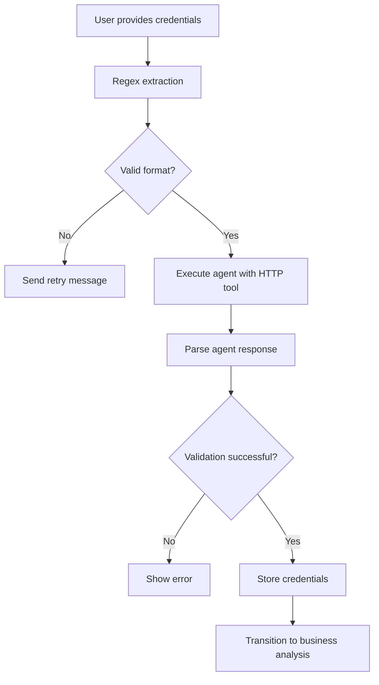
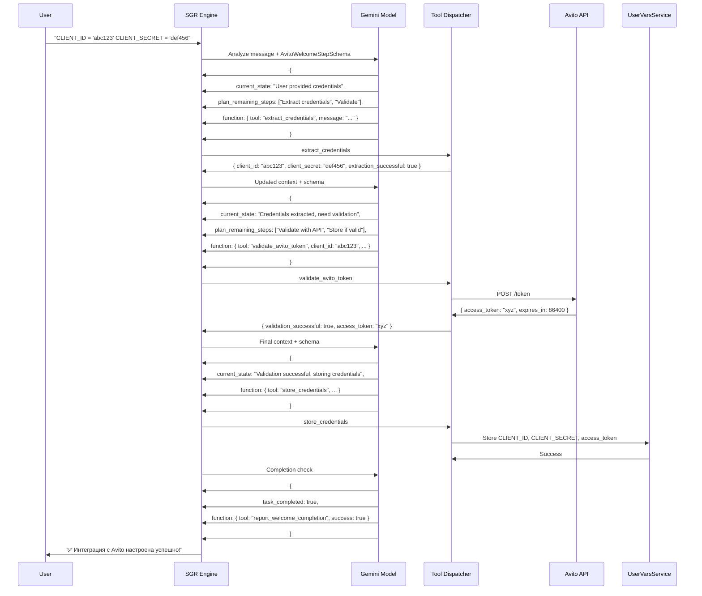
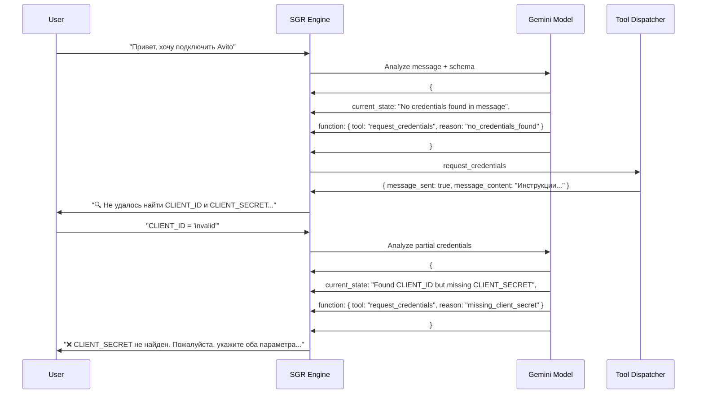

# Avito Welcome Agent SGR Implementation Design

## Overview

This document outlines the implementation of **Schema-Guided Reasoning (SGR)** for the Avito Welcome Agent in the Twenty CRM system. SGR enhances the current agent by enforcing structured thinking patterns and type-safe tool execution, transforming the simple credential validation process into an intelligent, step-by-step workflow.

## Technology Stack & Dependencies

- **Backend Framework**: NestJS with TypeScript
- **Schema Validation**: Zod for runtime type safety and constrained decoding
- **AI Model**: Google Gemini 2.5 Flash (existing integration)
- **Database**: PostgreSQL with TypeORM (existing UserVarsService)
- **HTTP Client**: Existing HTTP tool for Avito API validation
- **Agent Framework**: Extending existing AgentExecutionService

## Current Architecture Analysis

### Existing Welcome Agent Flow



### Current Limitations

1. **Simple regex parsing** - Limited input format support
2. **Unstructured agent responses** - Difficult to parse reliably  
3. **No reasoning visibility** - Black box decision making
4. **Error handling gaps** - Limited recovery mechanisms
5. **No type safety** - Runtime errors possible

## SGR Architecture Design

### Core SGR Schema

```typescript
// Main reasoning control schema
const AvitoWelcomeStepSchema = z.object({
  current_state: z.string()
    .describe('Current understanding of credential collection task'),
  
  plan_remaining_steps: z.array(z.string())
    .min(1).max(3)
    .describe('Next 1-3 planned steps'),
  
  task_completed: z.boolean()
    .describe('Whether credential collection is complete'),
  
  function: WelcomeToolUnion
    .describe('Tool to execute for next step')
});

// Discriminated union for type-safe tool routing
type WelcomeToolUnion = 
  | ExtractCredentialsSchema
  | ValidateAvitoTokenSchema  
  | StoreCredentialsSchema
  | RequestCredentialsSchema
  | ReportWelcomeCompletionSchema;
```

### Tool Definitions

#### 1. Credential Extraction Tool

```typescript
const ExtractCredentialsSchema = z.object({
  tool: z.literal('extract_credentials'),
  message: z.string().describe('User message to analyze'),
  extraction_method: z.enum(['regex', 'nlp', 'guided']).optional()
});
```

#### 2. Credential Request Tool

```typescript
const RequestCredentialsSchema = z.object({
  tool: z.literal('request_credentials'),
  reason: z.enum([
    'no_credentials_found',
    'invalid_format',
    'missing_client_id', 
    'missing_client_secret'
  ]),
  user_friendly_message: z.string()
    .describe('Russian language instructions for user')
});
```

#### 3. Avito API Validation Tool

```typescript
const ValidateAvitoTokenSchema = z.object({
  tool: z.literal('validate_avito_token'),
  client_id: z.string().min(1, 'CLIENT_ID required'),
  client_secret: z.string().min(1, 'CLIENT_SECRET required'),
  api_url: z.string().url().default('https://api.avito.ru/token')
});
```

#### 4. Secure Storage Tool

```typescript
const StoreCredentialsSchema = z.object({
  tool: z.literal('store_credentials'),
  client_id: z.string(),
  client_secret: z.string(),
  access_token: z.string().optional(),
  expires_in: z.number().optional()
});
```

#### 5. Completion Reporting Tool

```typescript
const ReportWelcomeCompletionSchema = z.object({
  tool: z.literal('report_welcome_completion'),
  success: z.boolean(),
  credentials_stored: z.boolean(),
  next_stage: z.enum(['business_analysis', 'error_retry']),
  summary_message: z.string()
    .describe('Final Russian message to user')
});
```

## SGR Implementation Components

### 1. SGR Execution Service

```typescript
@Injectable()
export class AvitoWelcomeSGRService {
  constructor(
    private readonly userVarsService: UserVarsService,
    private readonly httpTool: HttpToolService,
    private readonly agentChatService: AgentChatService,
    private readonly aiModelRegistryService: AiModelRegistryService
  ) {}

  async processWelcomeMessage(
    message: string,
    userId: string,
    workspaceId: string,
    threadId: string
  ): Promise<void> {
    
    const task = `
User message: "${message}"

Task: Collect and validate Avito API credentials (CLIENT_ID and CLIENT_SECRET).
If valid credentials are found, validate them with https://api.avito.ru/token 
and store securely. If not found, guide user to provide them.
`;

    const result = await this.executeSGRWorkflow({
      task,
      userId,
      workspaceId,
      threadId,
      maxSteps: 5
    });

    await this.handleWelcomeResult(result, userId, workspaceId, threadId);
  }

  private async executeSGRWorkflow(params: SGRParams): Promise<SGRResult> {
    const conversationLog = [
      {
        role: 'system',
        content: this.getWelcomeSGRSystemPrompt()
      },
      {
        role: 'user',
        content: params.task
      }
    ];

    for (let step = 0; step < params.maxSteps; step++) {
      // Get structured decision from AI
      const stepResult = await this.executeReasoningStep({
        conversationLog,
        stepNumber: step + 1,
        schema: AvitoWelcomeStepSchema
      });

      // Check for completion
      if (stepResult.function.tool === 'report_welcome_completion') {
        return this.handleCompletion(stepResult.function);
      }

      // Execute selected tool
      const toolResult = await this.dispatchTool(
        stepResult.function,
        params.userId,
        params.workspaceId
      );

      // Add tool execution to conversation context
      conversationLog.push(
        {
          role: 'assistant',
          content: stepResult.plan_remaining_steps[0],
          tool_calls: [{
            type: 'function',
            id: `step_${step + 1}`,
            function: {
              name: stepResult.function.tool,
              arguments: JSON.stringify(stepResult.function)
            }
          }]
        },
        {
          role: 'tool',
          content: JSON.stringify(toolResult),
          tool_call_id: `step_${step + 1}`
        }
      );
    }

    throw new Error('SGR workflow exceeded maximum steps');
  }
}
```

### 2. Tool Dispatcher

```typescript
class AvitoWelcomeToolDispatcher {
  async dispatch(
    command: WelcomeToolUnion,
    userId: string,
    workspaceId: string
  ): Promise<ToolResult> {
    
    switch (command.tool) {
      case 'extract_credentials':
        return this.handleExtractCredentials(command);
        
      case 'request_credentials':
        return this.handleRequestCredentials(command);
        
      case 'validate_avito_token':
        return this.handleValidateToken(command);
        
      case 'store_credentials':
        return this.handleStoreCredentials(command, userId, workspaceId);
        
      case 'report_welcome_completion':
        return this.handleCompletion(command);
        
      default:
        throw new Error(`Unknown tool: ${(command as any).tool}`);
    }
  }

  private handleExtractCredentials(cmd: ExtractCredentialsType) {
    // Enhanced extraction with multiple patterns
    const patterns = {
      standard: /CLIENT_ID[\s=:]*['"]*([A-Za-z0-9_-]+)['"]*(?:\s|$)/i,
      json: /"client_id"\s*:\s*"([^"]+)"/i,
      yaml: /client_id\s*:\s*([^\s]+)/i
    };
    
    const secretPatterns = {
      standard: /CLIENT_SECRET[\s=:]*['"]*([A-Za-z0-9_-]+)['"]*(?:\s|$)/i,
      json: /"client_secret"\s*:\s*"([^"]+)"/i,
      yaml: /client_secret\s*:\s*([^\s]+)/i
    };

    // Try all patterns
    let clientId = null;
    let clientSecret = null;

    for (const pattern of Object.values(patterns)) {
      const match = cmd.message.match(pattern);
      if (match) {
        clientId = match[1];
        break;
      }
    }

    for (const pattern of Object.values(secretPatterns)) {
      const match = cmd.message.match(pattern);
      if (match) {
        clientSecret = match[1];
        break;
      }
    }

    return {
      client_id: clientId,
      client_secret: clientSecret,
      extraction_successful: !!(clientId && clientSecret),
      patterns_matched: clientId && clientSecret ? 'both' : 'partial',
      message: cmd.message
    };
  }

  private async handleValidateToken(cmd: ValidateAvitoTokenType) {
    try {
      const response = await this.httpTool.execute({
        url: cmd.api_url,
        method: 'POST',
        headers: {
          'Content-Type': 'application/x-www-form-urlencoded'
        },
        body: `grant_type=client_credentials&client_id=${cmd.client_id}&client_secret=${cmd.client_secret}`
      });

      if (response.status === 200 && response.data.access_token) {
        return {
          validation_successful: true,
          access_token: response.data.access_token,
          expires_in: response.data.expires_in,
          token_type: response.data.token_type,
          message: '✅ Учетные данные успешно проверены через Avito API!'
        };
      } else {
        return {
          validation_successful: false,
          error: `HTTP ${response.status}: Неверные учетные данные`,
          message: '❌ Учетные данные не прошли проверку. Убедитесь в правильности CLIENT_ID и CLIENT_SECRET.'
        };
      }
    } catch (error) {
      return {
        validation_successful: false,
        error: error.message,
        message: '❌ Ошибка соединения с Avito API. Проверьте подключение к интернету.'
      };
    }
  }

  private async handleStoreCredentials(
    cmd: StoreCredentialsType,
    userId: string,
    workspaceId: string
  ) {
    try {
      // Use existing UserVarsService
      await Promise.all([
        this.userVarsService.set({
          userId,
          workspaceId,
          key: BusinessSetupStepKeys.AVITO_CLIENT_ID,
          value: cmd.client_id
        }),
        this.userVarsService.set({
          userId,
          workspaceId,
          key: BusinessSetupStepKeys.AVITO_CLIENT_SECRET,
          value: cmd.client_secret
        })
      ]);

      // Store access token if provided
      if (cmd.access_token) {
        await this.userVarsService.set({
          userId,
          workspaceId,
          key: BusinessSetupStepKeys.AVITO_ACCESS_TOKEN,
          value: cmd.access_token
        });

        if (cmd.expires_in) {
          const expiresAt = new Date(Date.now() + cmd.expires_in * 1000);
          await this.userVarsService.set({
            userId,
            workspaceId,
            key: BusinessSetupStepKeys.AVITO_TOKEN_EXPIRES_AT,
            value: expiresAt.toISOString()
          });
        }
      }

      return {
        storage_successful: true,
        credentials_saved: true,
        tokens_saved: !!cmd.access_token,
        message: '💾 Учетные данные безопасно сохранены в системе!'
      };
    } catch (error) {
      return {
        storage_successful: false,
        error: error.message,
        message: '❌ Ошибка при сохранении учетных данных'
      };
    }
  }
}
```

### 3. System Prompt for SGR

```typescript
private getWelcomeSGRSystemPrompt(): string {
  return `
Ты - специализированный ассистент для настройки интеграции с Avito API на этапе Welcome.

ТВОЯ ЕДИНСТВЕННАЯ ЗАДАЧА:
1. Получить от пользователя CLIENT_ID и CLIENT_SECRET для Avito API
2. Проверить их валидность через https://api.avito.ru/token  
3. Сохранить учетные данные для дальнейшего использования

ДОСТУПНЫЕ ИНСТРУМЕНТЫ:
- extract_credentials: Извлечь CLIENT_ID и CLIENT_SECRET из сообщения
- request_credentials: Запросить учетные данные у пользователя
- validate_avito_token: Проверить credentials через Avito API
- store_credentials: Сохранить проверенные учетные данные
- report_welcome_completion: Завершить welcome stage

ПРАВИЛА SGR:
- Анализируй текущее состояние задачи
- Планируй максимум 3 шага вперед
- Выполняй только один инструмент за раз
- Используй дружелюбный тон на русском языке
- Переходи к business_analysis только после успешного сохранения

ФОРМАТЫ ВХОДНЫХ ДАННЫХ:
CLIENT_ID = 'R3cTDMk9rEJ2lh5A9_QF'
CLIENT_SECRET = 'ehAWb-RBQrLmgoJWfgtst737eQV6KIBHzmV1NmIc'

Или JSON:
{
  "client_id": "R3cTDMk9rEJ2lh5A9_QF",
  "client_secret": "ehAWb-RBQrLmgoJWfgtst737eQV6KIBHzmV1NmIc"
}

AVITO API:
URL: https://api.avito.ru/token
Method: POST
Body: grant_type=client_credentials&client_id=XXX&client_secret=XXX

Успешный ответ:
{
  "access_token": "токен",
  "expires_in": 86400,
  "token_type": "Bearer"
}

Мыслите пошагово и используйте схему рассуждений для структурированного решения задач.
`;
}
```

## Integration with Existing Architecture

### Enhanced Business Setup Service

```typescript
@Injectable()
export class BusinessSetupWelcomeAgentService {
  constructor(
    // ... existing dependencies
    private readonly welcomeSGRService: AvitoWelcomeSGRService
  ) {}

  async processUserMessage(
    threadId: string,
    message: string,
    workspaceId: string,
    userId: string
  ): Promise<void> {
    
    // Replace simple regex checking with SGR workflow
    await this.welcomeSGRService.processWelcomeMessage(
      message,
      userId,
      workspaceId,
      threadId
    );
  }
}
```

### Module Integration

```typescript
@Module({
  imports: [
    // ... existing imports
  ],
  providers: [
    BusinessSetupWelcomeAgentService,
    AvitoWelcomeSGRService,
    AvitoWelcomeToolDispatcher,
    // ... other providers
  ],
  exports: [
    BusinessSetupWelcomeAgentService,
    AvitoWelcomeSGRService
  ]
})
export class BusinessSetupModule {}
```

## SGR Workflow Examples

### Example 1: Successful Credential Flow



### Example 2: Error Recovery Flow



## Error Handling and Validation

### Schema-Level Error Prevention

```typescript
// Schema validation catches errors before API calls
const CreateListingSchema = z.object({
  client_id: z.string()
    .min(10, 'CLIENT_ID должен быть не менее 10 символов')
    .regex(/^[A-Za-z0-9_-]+$/, 'CLIENT_ID содержит недопустимые символы'),
    
  client_secret: z.string()
    .min(20, 'CLIENT_SECRET должен быть не менее 20 символов')
    .regex(/^[A-Za-z0-9_-]+$/, 'CLIENT_SECRET содержит недопустимые символы')
});

// AI model gets validation errors and can retry
if (!validationResult.success) {
  conversationLog.push({
    role: 'tool',
    content: JSON.stringify({
      error: validationResult.error.message,
      retry_needed: true,
      suggestions: [
        'Проверьте формат CLIENT_ID (минимум 10 символов)',
        'Убедитесь что CLIENT_SECRET содержит не менее 20 символов',
        'Используйте только буквы, цифры, дефисы и подчеркивания'
      ]
    }),
    tool_call_id: stepId
  });
}
```

### Runtime Error Recovery

```typescript
@Injectable() 
export class SGRErrorRecoveryService {
  async executeWithRecovery<T>(
    operation: () => Promise<T>,
    recoveryStrategies: RecoveryStrategy[]
  ): Promise<T> {
    
    for (let attempt = 0; attempt < recoveryStrategies.length + 1; attempt++) {
      try {
        return await operation();
      } catch (error) {
        if (attempt < recoveryStrategies.length) {
          const strategy = recoveryStrategies[attempt];
          await strategy.recover(error);
          continue;
        }
        throw error;
      }
    }
  }
}
```

## Benefits of SGR Implementation

### 1. Structured Reasoning
- **Clear step-by-step planning**: Agent explains its reasoning process
- **Predictable behavior**: Consistent responses across scenarios
- **Debugging visibility**: Full audit trail of decisions

### 2. Type Safety
- **Zod schema validation**: Runtime type checking prevents errors
- **Exhaustive tool handling**: TypeScript ensures all cases covered
- **Parameter validation**: Incorrect tool usage caught early

### 3. Enhanced User Experience  
- **Intelligent input parsing**: Handles multiple credential formats
- **Contextual error messages**: Clear guidance in Russian
- **Recovery workflows**: Graceful handling of incomplete data

### 4. Reliability Improvements
- **Robust error handling**: Multiple fallback strategies
- **Retry mechanisms**: Automatic recovery from transient failures
- **Data validation**: Prevents invalid API calls

### 5. Extensibility
- **Tool-based architecture**: Easy to add new capabilities
- **Schema evolution**: Type-safe updates to workflows
- **Integration ready**: Prepared for business analysis stage

## Implementation Timeline

### Phase 1: Core SGR Framework (Week 1-2)
- [ ] Implement AvitoWelcomeSGRService base structure
- [ ] Create Zod schemas for all welcome tools
- [ ] Build tool dispatcher with type safety
- [ ] Add comprehensive error handling

### Phase 2: Tool Implementation (Week 2-3)  
- [ ] Enhanced credential extraction (multiple formats)
- [ ] Avito API validation with existing HTTP tool
- [ ] Secure storage via UserVarsService integration
- [ ] Completion reporting and stage transition

### Phase 3: Integration & Testing (Week 3-4)
- [ ] Integrate with existing BusinessSetupWelcomeAgentService
- [ ] Update module dependencies and exports
- [ ] Create comprehensive unit and integration tests
- [ ] Performance optimization and monitoring

### Phase 4: Russian Localization & UX (Week 4)
- [ ] Complete Russian language support
- [ ] User-friendly error messages and guidance
- [ ] Contextual help and format examples
- [ ] Final testing with Russian user scenarios

This SGR implementation transforms the simple Avito credential collection into an intelligent, reliable, and user-friendly process that maintains the existing architecture while dramatically improving capabilities and user experience.