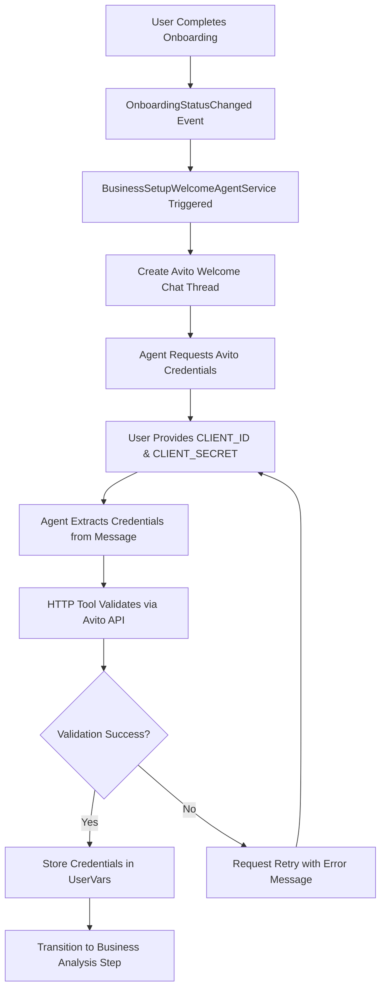
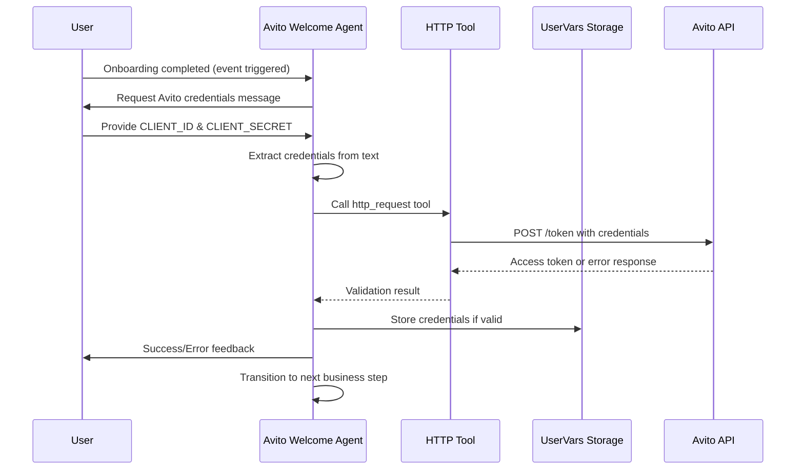
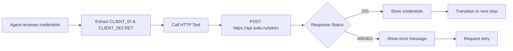
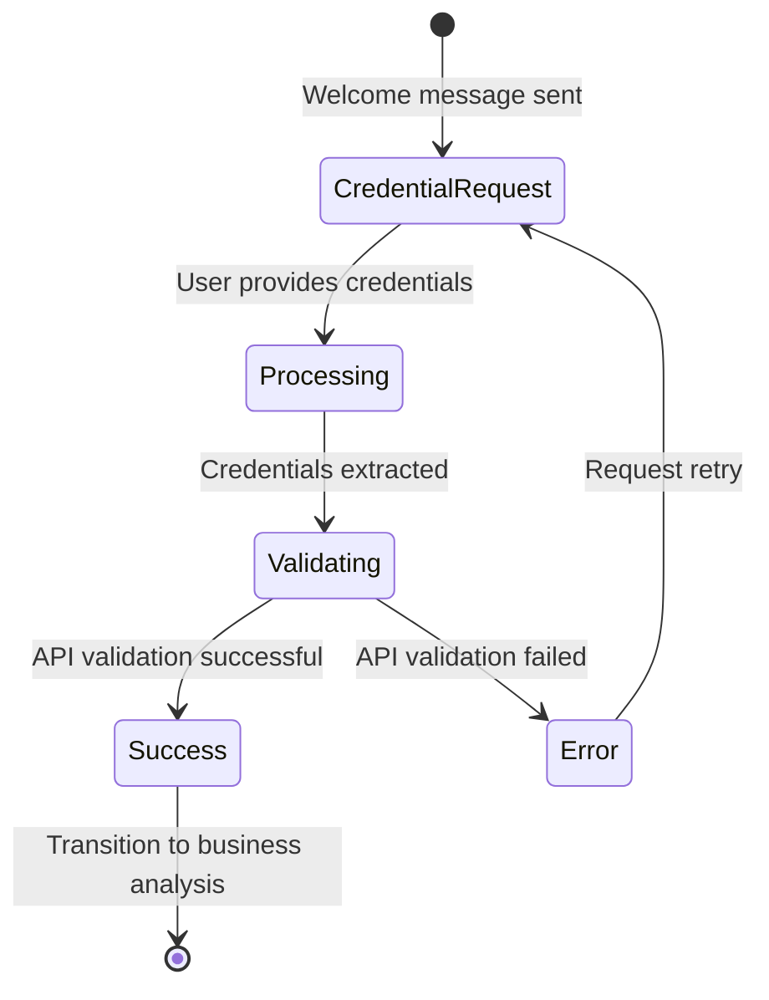
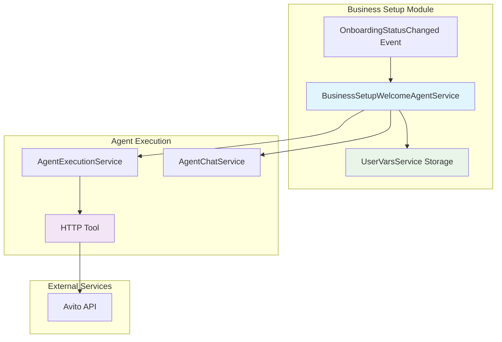
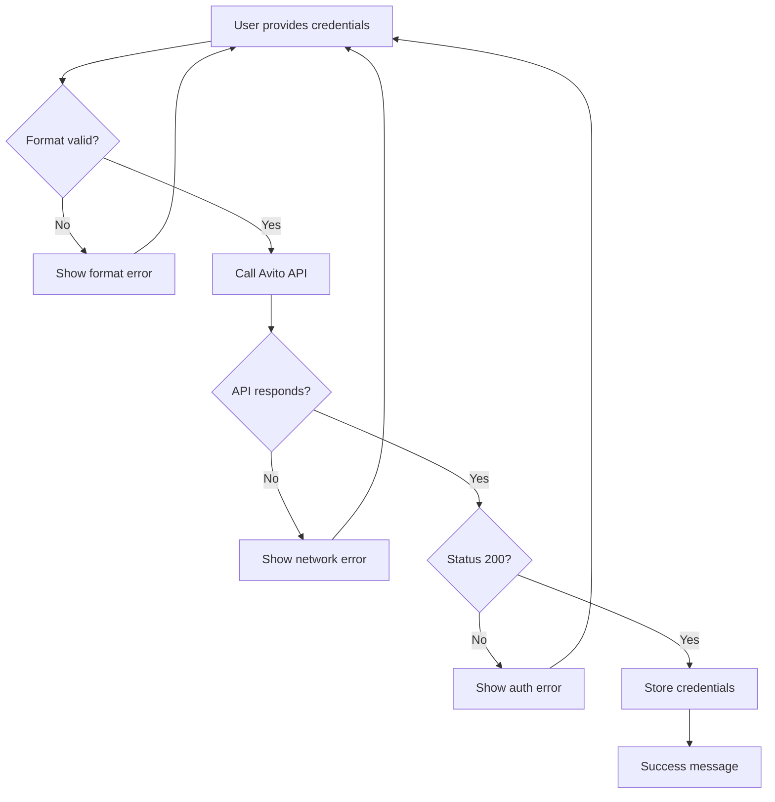

# Avito Welcome Agent Integration Design

## Overview

This document outlines the redesign of Twenty CRM's existing Welcome Agent to collect and manage Avito API credentials during the business setup flow. The agent will be modified to replace the generic welcome greeting with an Avito-specific credential collection flow, enabling seamless integration with Avito's marketplace API.

**Repository Type**: Full-Stack Application (NestJS Backend + React Frontend)  
**Target Component**: BusinessSetupWelcomeAgentService in packages/twenty-server/src/engine/core-modules/business-setup/

## Architecture

### System Overview



### Agent Data Flow



## Agent Implementation

### Modified Welcome Agent Service

#### Core Service Structure
```typescript
@Injectable()
export class BusinessSetupWelcomeAgentService {
  private readonly logger = new Logger(BusinessSetupWelcomeAgentService.name);
  private readonly GEMINI_MODEL_ID = 'google/gemini-2.5-flash';
  
  constructor(
    private readonly eventEmitter: EventEmitter2,
    private readonly agentExecutionService: AgentExecutionService,
    private readonly agentChatService: AgentChatService,
    private readonly userVarsService: UserVarsService,
    private readonly userService: UserService,
    private readonly workspaceService: WorkspaceService,
  ) {}
  
  @OnEvent('onboarding.status.changed')
  async handleOnboardingStatusChange(payload: OnboardingStatusChangedEvent)
  
  private async createAvitoWelcomeChat(userId: string, workspaceId: string)
  private async getAvitoWelcomePrompt(user: User, workspace: Workspace): Promise<string>
  async processUserMessage(threadId: string, message: string, workspaceId: string, userId: string)
  private extractCredentialsFromMessage(message: string): CredentialsExtractionResult
  private async storeAvitoCredentials(workspaceId: string, userId: string, credentials: AvitoCredentials)
}
```

#### Modified Agent Prompt
The agent will use a specialized prompt for Avito credential collection:

```typescript
private getAvitoWelcomePrompt(user: User, workspace: Workspace): string {
  return `
Привет, ${user.firstName || 'пользователь'}! 👋

Добро пожаловать в настройку интеграции с Avito для ${workspace.displayName}!

Для подключения к Avito API мне нужны ваши уникальные учетные данные:

📋 **Что мне нужно:**
• CLIENT_ID - идентификатор вашего приложения
• CLIENT_SECRET - секретный ключ

🔍 **Где найти эти данные:**
1. Войдите в ваш аккаунт на Avito
2. Перейдите в раздел "API для разработчиков"
3. Скопируйте CLIENT_ID и CLIENT_SECRET

💡 **Как отправить:**
Просто напишите мне в любом удобном формате, например:

CLIENT_ID = 'R3cTDMk9rEJ2lh5A9_QF'
CLIENT_SECRET = 'ehAWb-RBQrLmgoJWfgtst737eQV6KIBHzmV1NmIc'

Или просто:
CLIENT_ID: ваш_id
CLIENT_SECRET: ваш_secret

Я автоматически извлеку данные и проверю их работоспособность! 🚀

TOOL USAGE INSTRUCTIONS:
When user provides credentials:
1. Extract CLIENT_ID and CLIENT_SECRET from their message
2. Use http_request tool to validate credentials:
   - URL: https://api.avito.ru/token
   - Method: POST
   - Headers: Content-Type: application/x-www-form-urlencoded
   - Body: grant_type=client_credentials&client_id=EXTRACTED_ID&client_secret=EXTRACTED_SECRET
3. If successful (status 200), store credentials and congratulate user
4. If failed, explain the error and ask to retry
5. Once validated, transition to next business setup step
  `;
}
```

#### Credential Processing Logic
```typescript
async processUserMessage(threadId: string, message: string, workspaceId: string, userId: string) {
  try {
    // Extract credentials from user message
    const credentials = this.extractCredentialsFromMessage(message);
    
    if (credentials.isValid) {
      // Agent uses HTTP tool to validate credentials automatically
      const validationPrompt = `
User provided Avito credentials:
CLIENT_ID: ${credentials.clientId}
CLIENT_SECRET: ${credentials.clientSecret}

Validate these credentials using the http_request tool:
- URL: https://api.avito.ru/token
- Method: POST
- Headers: Content-Type: application/x-www-form-urlencoded
- Body: grant_type=client_credentials&client_id=${credentials.clientId}&client_secret=${credentials.clientSecret}

Respond with validation results and next steps.`;
      
      // Execute agent with HTTP tool for validation
      const agentResponse = await this.agentExecutionService.executeAgent({
        agentId: 'welcome-agent',
        context: {
          workspaceId,
          userId,
          threadId,
          prompt: validationPrompt
        }
      });
      
      await this.handleValidationResponse(agentResponse, credentials, workspaceId, userId, threadId);
      
    } else {
      // Request credentials again with helpful message
      const retryMessage = `🔍 Не удалось найти CLIENT_ID и CLIENT_SECRET в вашем сообщении.

💡 Пожалуйста, отправьте данные в формате:
CLIENT_ID: ваш_client_id
CLIENT_SECRET: ваш_client_secret`;
      
      await this.agentChatService.addMessage({
        threadId,
        role: 'assistant',
        content: retryMessage,
        fileIds: []
      });
    }
  } catch (error) {
    this.logger.error('Error processing user message:', error);
  }
}
```

### Data Storage Architecture

#### Enhanced Business Setup Step Keys
```typescript
export enum BusinessSetupStepKeys {
  // Existing keys
  BUSINESS_SETUP_WELCOME_PENDING = 'BUSINESS_SETUP_WELCOME_PENDING',
  BUSINESS_SETUP_BUSINESS_ANALYSIS_PENDING = 'BUSINESS_SETUP_BUSINESS_ANALYSIS_PENDING',
  
  // New Avito-specific keys
  AVITO_CLIENT_ID = 'AVITO_CLIENT_ID',
  AVITO_CLIENT_SECRET = 'AVITO_CLIENT_SECRET',
  AVITO_ACCESS_TOKEN = 'AVITO_ACCESS_TOKEN',
  AVITO_TOKEN_EXPIRES_AT = 'AVITO_TOKEN_EXPIRES_AT',
}

export type BusinessSetupKeyValueTypeMap = {
  // Existing mappings
  [BusinessSetupStepKeys.BUSINESS_SETUP_WELCOME_PENDING]: boolean;
  [BusinessSetupStepKeys.BUSINESS_SETUP_BUSINESS_ANALYSIS_PENDING]: boolean;
  
  // New Avito mappings
  [BusinessSetupStepKeys.AVITO_CLIENT_ID]: string;
  [BusinessSetupStepKeys.AVITO_CLIENT_SECRET]: string;
  [BusinessSetupStepKeys.AVITO_ACCESS_TOKEN]: string;
  [BusinessSetupStepKeys.AVITO_TOKEN_EXPIRES_AT]: string;
};
```

#### Credential Storage Implementation
```typescript
private async storeAvitoCredentials(
  workspaceId: string, 
  userId: string, 
  credentials: AvitoCredentials
) {
  // Store using existing UserVarsService
  await Promise.all([
    this.userVarsService.set({
      userId,
      workspaceId,
      key: BusinessSetupStepKeys.AVITO_CLIENT_ID,
      value: credentials.clientId
    }),
    this.userVarsService.set({
      userId,
      workspaceId,
      key: BusinessSetupStepKeys.AVITO_CLIENT_SECRET,
      value: credentials.clientSecret
    })
  ]);
}
```

## Agent Tools Integration

### HTTP Tool for API Validation

The agent leverages Twenty's existing HTTP Tool (`http_request`) for Avito API validation:

#### Tool Usage Flow


#### HTTP Tool Configuration
```typescript
const httpToolCall = {
  toolDescription: "Проверяю ваши Avito credentials через API",
  input: {
    url: "https://api.avito.ru/token",
    method: "POST",
    headers: {
      "Content-Type": "application/x-www-form-urlencoded"
    },
    body: "grant_type=client_credentials&client_id=USER_CLIENT_ID&client_secret=USER_CLIENT_SECRET"
  }
};
```

### Credential Extraction Logic
```typescript
private extractCredentialsFromMessage(message: string): CredentialsExtractionResult {
  // Support multiple formats
  const clientIdRegex = /CLIENT_ID[\s=:]*['"]?([A-Za-z0-9_-]+)['"]?/i;
  const clientSecretRegex = /CLIENT_SECRET[\s=:]*['"]?([A-Za-z0-9_-]+)['"]?/i;
  
  const clientIdMatch = message.match(clientIdRegex);
  const clientSecretMatch = message.match(clientSecretRegex);
  
  return {
    clientId: clientIdMatch ? clientIdMatch[1] : null,
    clientSecret: clientSecretMatch ? clientSecretMatch[1] : null,
    isValid: !!(clientIdMatch && clientSecretMatch)
  };
}
```

## Frontend Integration

### Modified Welcome Popup

#### Update Business Setup Event Provider
```typescript
// File: packages/twenty-front/src/modules/ai/providers/BusinessSetupEventProvider.tsx

const lastWelcomeMessage = subscriptions.lastWelcomeeChatEvent?.status === 'CHAT_CREATED' 
  ? '🎉 Настройка интеграции Avito начинается! Нажмите, чтобы продолжить.' 
  : null;
```

#### Update Welcome Message Hook
```typescript
// File: packages/twenty-front/src/modules/business-setup/hooks/useBusinessSetupAgentChat.ts

const getWelcomeMessageForStep = (step: BusinessSetupStatus): string => {
  const messages = {
    WELCOME: "🚀 Настройка интеграции Avito! Мне нужны ваши CLIENT_ID и CLIENT_SECRET для подключения к API.",
    BUSINESS_ANALYSIS: "Анализ бизнес-процессов...",
    // ... other steps remain the same
  };
  return messages[step] || messages.WELCOME;
};
```

## Data Models

### Type Definitions
```typescript
export interface AvitoCredentials {
  clientId: string;
  clientSecret: string;
}

export interface AvitoTokenResponse {
  access_token: string;
  token_type: string;
  expires_in: number;
}

export interface CredentialsExtractionResult {
  clientId: string | null;
  clientSecret: string | null;
  isValid: boolean;
}

export interface ValidationResult {
  success: boolean;
  accessToken?: string;
  expiresIn?: number;
  error?: string;
}
```

### Agent Chat Flow States


## Environment Configuration

### Server Configuration
```bash
# Add to packages/twenty-server/.env
AVITO_TOKEN_URL=https://api.avito.ru/token
AVITO_API_TIMEOUT=30000
AVITO_MAX_RETRY_ATTEMPTS=3
```

### Environment Service Extension
```typescript
// File: packages/twenty-server/src/engine/core-modules/environment/environment.service.ts

export interface AvitoConfig {
  tokenUrl: string;
  apiTimeout: number;
  maxRetryAttempts: number;
}

// In EnvironmentService class
get avito(): AvitoConfig {
  return {
    tokenUrl: this.get('AVITO_TOKEN_URL') || 'https://api.avito.ru/token',
    apiTimeout: parseInt(this.get('AVITO_API_TIMEOUT') || '30000'),
    maxRetryAttempts: parseInt(this.get('AVITO_MAX_RETRY_ATTEMPTS') || '3')
  };
}
```

## Testing Strategy

### Unit Testing Structure
```typescript
describe('BusinessSetupWelcomeAgentService - Avito Integration', () => {
  let service: BusinessSetupWelcomeAgentService;
  let mockUserVarsService: jest.Mocked<UserVarsService>;
  let mockAgentExecutionService: jest.Mocked<AgentExecutionService>;
  
  describe('extractCredentialsFromMessage', () => {
    it('should extract credentials from standard format')
    it('should extract credentials from colon format')
    it('should return invalid for incomplete credentials')
  });
  
  describe('processUserMessage', () => {
    it('should process valid credentials and store them')
    it('should handle invalid format gracefully')
    it('should retry on validation failure')
  });
  
  describe('validation flow', () => {
    it('should validate correct credentials via HTTP tool')
    it('should handle API errors appropriately')
    it('should transition to business analysis on success')
  });
});
```

### Test Cases Coverage

| Test Category | Test Cases |
|---------------|------------|
| **Credential Extraction** | Standard format, Colon format, Quoted values, Incomplete data |
| **API Validation** | Valid credentials, Invalid credentials, Network errors, Timeout handling |
| **Storage Operations** | Successful storage, Storage failures, Duplicate handling |
| **Agent Flow** | Welcome message generation, Error handling, Step transitions |
| **User Experience** | Message formatting, Retry flows, Success confirmations |

## Component Architecture

### Modified Welcome Agent Flow



### Integration Points

| Component | Integration Type | Purpose |
|-----------|------------------|---------|
| **BusinessSetupWelcomeAgentService** | Core modification | Main credential collection logic |
| **UserVarsService** | Existing service | Secure credential storage |
| **AgentExecutionService** | Existing service | Agent prompt execution |
| **HTTP Tool** | Existing tool | Avito API validation |
| **AgentChatService** | Existing service | Chat message management |

## Error Handling

### Error Scenarios and Responses

| Error Type | Agent Response | Recovery Action |
|------------|----------------|-----------------|
| **Invalid Format** | "🔍 Не удалось найти CLIENT_ID и CLIENT_SECRET..." | Request re-entry with format example |
| **API Validation Failed** | "❌ Не удалось подключиться к Avito API..." | Show possible causes and retry prompt |
| **Network Error** | "⏰ Проблемы с соединением..." | Suggest checking connection and retry |
| **Storage Error** | "💾 Ошибка сохранения данных..." | Log error and request retry |

### Validation Flow Robustness
