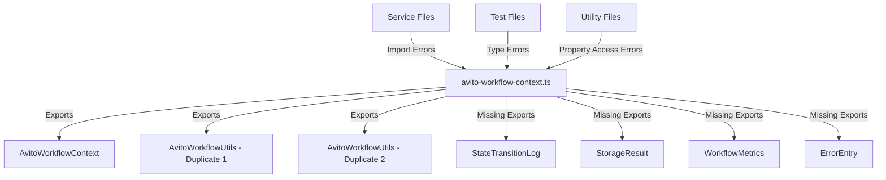
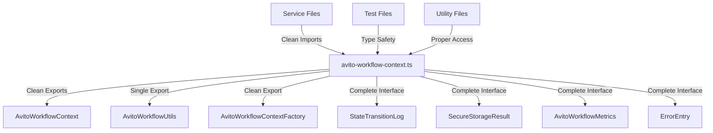
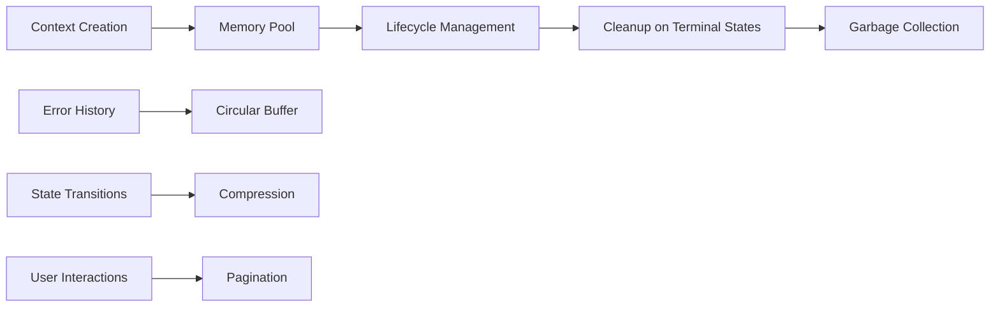

# Avito Workflow Context TypeScript Fixes Design

## Overview

This design addresses critical TypeScript compilation errors in the Avito workflow context system within the Twenty CRM's business setup module. The errors stem from duplicate class definitions, missing type exports, inconsistent interface structures, and malformed type definitions that prevent successful compilation.

## Technology Stack & Dependencies

- **Backend Framework**: NestJS 9+ with TypeScript 5.3.3
- **Architecture**: Monorepo structure using Nx 21.3.11
- **State Management**: Custom workflow state machine with enum-based transitions
- **Type System**: Zod validation with discriminated unions for SGR implementation
- **Dependencies**: Event-driven architecture with EventEmitter2, BullMQ for background jobs

## Architecture

### Current Problematic Structure



### Target Fixed Architecture



## Data Models & Interface Fixes

### Missing Interface Definitions

```typescript
// Add missing StateTransitionLog interface
interface StateTransitionLog {
  fromState: AvitoWorkflowState;
  toState: AvitoWorkflowState;
  timestamp: Date;
  trigger: 'USER_INPUT' | 'API_RESPONSE' | 'TIMEOUT' | 'ERROR' | 'MANUAL';
  metadata?: Record<string, any>;
  duration: number;
}

// Add missing ErrorEntry interface
interface ErrorEntry {
  error: string;
  errorCode?: string;
  state: AvitoWorkflowState;
  timestamp: Date;
  recoverable: boolean;
  retryCount: number;
}

// Add missing SecureStorageResult interface
interface SecureStorageResult {
  encrypted: boolean;
  stored: boolean;
  encryptionKeyId?: string;
  storageLocation?: string;
  integrityHash?: string;
  auditTrail: StorageAuditEntry[];
}

// Add missing AvitoWorkflowMetrics interface
interface AvitoWorkflowMetrics {
  completedSteps: number;
  averageStepDurationMs: number;
  bottleneckStates: AvitoWorkflowState[];
  recoveryRate: number;
  apiResponseTimes: number[];
}
```

### Enhanced AvitoWorkflowContext Interface

```typescript
interface AvitoWorkflowContext {
  // Core identifiers
  userId: string;
  workspaceId: string;
  threadId: string;
  workflowId: string;
  
  // State management with transition log
  state: AvitoWorkflowState;
  previousState?: AvitoWorkflowState;
  stateChangedAt: Date;
  stateTransitionLog: StateTransitionLog[];
  
  // Enhanced attempt tracking
  attemptMetrics: AttemptMetrics;
  
  // Credential data with validation status
  credentials?: AvitoCredentials;
  validationResult?: ValidationResult;
  
  // Error tracking with recovery info
  lastError?: string;
  errorHistory: ErrorEntry[];
  
  // Workflow metadata with version tracking
  workflowStartedAt: Date;
  completedAt?: Date;
  timeoutAt?: Date;
  workflowVersion: string;
  
  // Performance metrics
  metrics: AvitoWorkflowMetrics;
  
  // User interaction tracking
  userInteractions: Array<{
    type: 'MESSAGE_SENT' | 'CREDENTIALS_PROVIDED' | 'RETRY_REQUESTED';
    timestamp: Date;
    content?: string;
    metadata?: Record<string, any>;
  }>;
  
  // Integration settings
  integrations: {
    avitoApiEndpoint: string;
    backupStorageEnabled: boolean;
    monitoringEnabled: boolean;
    healthCheckInterval: number;
  };
  
  // Configuration with complete type safety
  config: {
    maxAttempts: number;
    timeoutMs: number;
    retryDelayMs: number;
    enableAutoRetry: boolean;
    enableEncryption: boolean;
    enableAuditLog: boolean;
    apiTimeoutMs: number;
    validationStrictMode: boolean;
    allowedCredentialFormats: string[];
  };
}
```

### Enhanced Credential Interfaces

```typescript
interface AvitoCredentials {
  clientId?: string;
  clientSecret?: string;
  accessToken?: string;
  refreshToken?: string;
  expiresAt?: Date;
  tokenType?: string;
  lastValidatedAt?: Date;
  validationStatus?: CredentialValidationStatus;
  encryptionStatus?: StorageOperationStatus;
}

interface ValidationResult {
  success: boolean;
  error?: string;
  errorType?: 'TIMEOUT' | 'AUTH' | 'NETWORK' | 'VALIDATION' | 'EXECUTION' | 'UNKNOWN';
  accessToken?: string;
  expiresIn?: number;
  tokenType?: string;
  validatedAt?: Date;
  apiResponseTime?: number;
}
```

## Business Logic Layer Fixes

### State Transition Matrix Completion

```typescript
// Fix incomplete state transition matrix
export const VALID_STATE_TRANSITIONS: Record<AvitoWorkflowState, AvitoWorkflowState[]> = {
  [AvitoWorkflowState.INIT]: [AvitoWorkflowState.GREETING_SENT],
  [AvitoWorkflowState.GREETING_SENT]: [AvitoWorkflowState.AWAITING_CREDENTIALS],
  [AvitoWorkflowState.AWAITING_CREDENTIALS]: [
    AvitoWorkflowState.EXTRACTING_CREDENTIALS,
    AvitoWorkflowState.ERROR_INVALID_FORMAT,
    AvitoWorkflowState.MAX_RETRIES_EXCEEDED
  ],
  [AvitoWorkflowState.EXTRACTING_CREDENTIALS]: [
    AvitoWorkflowState.VALIDATING_CREDENTIALS,
    AvitoWorkflowState.ERROR_INVALID_FORMAT
  ],
  [AvitoWorkflowState.VALIDATING_CREDENTIALS]: [
    AvitoWorkflowState.VALIDATION_SUCCESS,
    AvitoWorkflowState.VALIDATION_FAILED,
    AvitoWorkflowState.ERROR_API_FAILURE
  ],
  [AvitoWorkflowState.VALIDATION_SUCCESS]: [AvitoWorkflowState.STORING_CREDENTIALS],
  [AvitoWorkflowState.VALIDATION_FAILED]: [
    AvitoWorkflowState.AWAITING_CREDENTIALS,
    AvitoWorkflowState.MAX_RETRIES_EXCEEDED
  ],
  [AvitoWorkflowState.STORING_CREDENTIALS]: [
    AvitoWorkflowState.STORAGE_COMPLETE,
    AvitoWorkflowState.ERROR_STORAGE_FAILURE
  ],
  [AvitoWorkflowState.STORAGE_COMPLETE]: [AvitoWorkflowState.COMPLETING_WELCOME],
  [AvitoWorkflowState.COMPLETING_WELCOME]: [AvitoWorkflowState.WELCOME_COMPLETED],
  [AvitoWorkflowState.ERROR_INVALID_FORMAT]: [
    AvitoWorkflowState.AWAITING_CREDENTIALS,
    AvitoWorkflowState.MAX_RETRIES_EXCEEDED
  ],
  [AvitoWorkflowState.ERROR_API_FAILURE]: [
    AvitoWorkflowState.AWAITING_CREDENTIALS,
    AvitoWorkflowState.MAX_RETRIES_EXCEEDED
  ],
  [AvitoWorkflowState.ERROR_STORAGE_FAILURE]: [
    AvitoWorkflowState.STORING_CREDENTIALS,
    AvitoWorkflowState.MAX_RETRIES_EXCEEDED
  ],
  [AvitoWorkflowState.REQUEST_RETRY]: [
    AvitoWorkflowState.AWAITING_CREDENTIALS,
    AvitoWorkflowState.MAX_RETRIES_EXCEEDED
  ],
  [AvitoWorkflowState.WELCOME_COMPLETED]: [],
  [AvitoWorkflowState.MAX_RETRIES_EXCEEDED]: []
};
```

### Tool State Permission Matrix Completion

```typescript
// Fix incomplete tool permission matrix
export const ALLOWED_TOOLS_BY_STATE: Record<AvitoWorkflowState, string[]> = {
  [AvitoWorkflowState.INIT]: [],
  [AvitoWorkflowState.GREETING_SENT]: ['request_credentials'],
  [AvitoWorkflowState.AWAITING_CREDENTIALS]: ['extract_credentials', 'request_credentials'],
  [AvitoWorkflowState.EXTRACTING_CREDENTIALS]: ['validate_avito_token'],
  [AvitoWorkflowState.VALIDATING_CREDENTIALS]: [],
  [AvitoWorkflowState.VALIDATION_SUCCESS]: ['store_credentials'],
  [AvitoWorkflowState.VALIDATION_FAILED]: ['request_credentials'],
  [AvitoWorkflowState.STORING_CREDENTIALS]: [],
  [AvitoWorkflowState.STORAGE_COMPLETE]: ['report_welcome_completion'],
  [AvitoWorkflowState.COMPLETING_WELCOME]: [],
  [AvitoWorkflowState.WELCOME_COMPLETED]: [],
  [AvitoWorkflowState.ERROR_INVALID_FORMAT]: ['request_credentials'],
  [AvitoWorkflowState.ERROR_API_FAILURE]: ['request_credentials'],
  [AvitoWorkflowState.ERROR_STORAGE_FAILURE]: ['store_credentials'],
  [AvitoWorkflowState.REQUEST_RETRY]: ['request_credentials'],
  [AvitoWorkflowState.MAX_RETRIES_EXCEEDED]: []
};
```

## Error Recovery & Type Safety Improvements

### Class Duplication Resolution

The file contains duplicate `AvitoWorkflowUtils` class definitions that need consolidation:

```typescript
// Single consolidated AvitoWorkflowUtils class
export class AvitoWorkflowUtils {
  // Static method consolidation with proper typing
  static isTimedOut(context: AvitoWorkflowContext): boolean {
    return context.timeoutAt ? new Date() > context.timeoutAt : false;
  }
  
  static getRemainingTime(context: AvitoWorkflowContext): number {
    if (!context.timeoutAt) return Infinity;
    return Math.max(0, context.timeoutAt.getTime() - Date.now());
  }
  
  static getWorkflowDuration(context: AvitoWorkflowContext): number {
    const endTime = context.completedAt || new Date();
    return endTime.getTime() - context.workflowStartedAt.getTime();
  }
  
  static canRetry(context: AvitoWorkflowContext): boolean {
    return (
      context.attemptMetrics.attemptCount < context.attemptMetrics.maxAttempts &&
      !AvitoWorkflowStateValidator.isTerminalState(context.state) &&
      !this.isTimedOut(context)
    );
  }
  
  static getNextRetryDelay(context: AvitoWorkflowContext): number {
    const { attemptCount, retryDelayMs } = context.attemptMetrics;
    const baseDelay = retryDelayMs || 2000;
    return Math.min(baseDelay * Math.pow(2, attemptCount), 30000);
  }
  
  static addError(
    context: AvitoWorkflowContext,
    error: string,
    errorCode?: string,
    recoverable = true
  ): AvitoWorkflowContext {
    const errorEntry: ErrorEntry = {
      error,
      errorCode,
      state: context.state,
      timestamp: new Date(),
      recoverable,
      retryCount: 0
    };
    
    return {
      ...context,
      lastError: error,
      errorHistory: [...context.errorHistory, errorEntry],
      metrics: {
        ...context.metrics,
        errorRate: (context.errorHistory.length + 1) / Math.max(1, context.metrics.completedSteps + 1)
      }
    };
  }
}
```

### Service Integration Pattern Fixes

```typescript
// Fix service type integration issues
interface HTTPRequestConfig {
  url: string;
  method: 'GET' | 'POST' | 'PUT' | 'PATCH' | 'DELETE';
  body?: any;
  headers?: Record<string, string>;
  timeout?: number; // Add missing timeout property
}

// Fix API response type structure
interface AvitoAPIResponse {
  access_token: string;
  expires_in: number;
  token_type: string;
  response_time: number;
}

// Fix validation tool structure
interface ValidateAvitoTokenTool {
  tool: 'validate_avito_token';
  client_id: string;
  client_secret: string;
  api_url: string; // Make required property explicit
}
```

## Service Layer Refactoring

### Error Recovery Service Deduplication

The `avito-workflow-error-recovery.service.ts` file contains duplicate enum and class definitions that need consolidation:

```typescript
// Consolidated error type enumeration
export enum AvitoErrorType {
  // Input validation errors
  INVALID_CREDENTIAL_FORMAT = 'INVALID_CREDENTIAL_FORMAT',
  MISSING_CREDENTIALS = 'MISSING_CREDENTIALS',
  MALFORMED_MESSAGE = 'MALFORMED_MESSAGE',
  
  // API communication errors
  API_AUTHENTICATION_FAILED = 'API_AUTHENTICATION_FAILED',
  API_RATE_LIMITED = 'API_RATE_LIMITED',
  API_SERVER_ERROR = 'API_SERVER_ERROR',
  API_TIMEOUT = 'API_TIMEOUT',
  API_NETWORK_ERROR = 'API_NETWORK_ERROR',
  
  // Storage operation errors
  STORAGE_ENCRYPTION_FAILED = 'STORAGE_ENCRYPTION_FAILED',
  STORAGE_WRITE_FAILED = 'STORAGE_WRITE_FAILED',
  STORAGE_READ_FAILED = 'STORAGE_READ_FAILED',
  STORAGE_INTEGRITY_FAILED = 'STORAGE_INTEGRITY_FAILED',
  
  // Workflow management errors
  INVALID_STATE_TRANSITION = 'INVALID_STATE_TRANSITION',
  WORKFLOW_TIMEOUT = 'WORKFLOW_TIMEOUT',
  MAX_RETRIES_EXCEEDED = 'MAX_RETRIES_EXCEEDED',
  TOOL_EXECUTION_FAILED = 'TOOL_EXECUTION_FAILED',
  
  // System resource errors
  MEMORY_EXHAUSTED = 'MEMORY_EXHAUSTED',
  RESOURCE_UNAVAILABLE = 'RESOURCE_UNAVAILABLE',
  CONFIGURATION_ERROR = 'CONFIGURATION_ERROR',
  DEPENDENCY_FAILURE = 'DEPENDENCY_FAILURE',
  
  // Critical system errors
  DATA_CORRUPTION = 'DATA_CORRUPTION',
  SECURITY_VIOLATION = 'SECURITY_VIOLATION',
  SYSTEM_FAILURE = 'SYSTEM_FAILURE'
}
```

### Monitoring Service Type Fixes

Fix missing property access in monitoring service:

```typescript
// Enhanced AvitoWorkflowMetrics with complete interface
interface AvitoWorkflowMetrics {
  totalSteps: number;
  completedSteps: number;
  averageStepDurationMs: number;
  bottleneckStates: AvitoWorkflowState[];
  errorRate: number;
  recoveryRate: number;
  apiResponseTimes: number[];
}
```

### Storage Service Crypto Fix

Fix crypto module import issues:

```typescript
// Correct crypto module imports
import { 
  createCipheriv as createCipherGCM, 
  createDecipheriv as createDecipherGCM,
  randomBytes,
  pbkdf2Sync
} from 'crypto';
```

## Testing Strategy Fixes

### Mock Interface Corrections

```typescript
// Fix test mock interfaces
interface MockSecureStorageResult {
  encrypted: boolean;
  stored: boolean;
  encryptionKeyId?: string;
  storageLocation?: string;
  integrityHash?: string;
  auditTrail: StorageAuditEntry[];
}

// Fix streaming result interface for tests
interface MockSGRStreamingResult {
  type: 'thinking' | 'tool_execution' | 'final_response';
  content?: string;
  completed: boolean;
  workflowState?: AvitoWorkflowState;
  workflowContext?: AvitoWorkflowContext;
  timestamp?: Date;
  error?: string;
  workflowDuration?: number;
}
```

### Test Module Builder Fixes

```typescript
// Fix test module builder pattern
let testingModule: TestingModule;

beforeEach(async () => {
  testingModule = await Test.createTestingModule({
    providers: [
      AvitoWorkflowErrorRecoveryService,
      {
        provide: EventEmitter2,
        useValue: mockEventEmitter
      }
    ]
  }).compile();
  
  service = testingModule.get<AvitoWorkflowErrorRecoveryService>(
    AvitoWorkflowErrorRecoveryService
  );
});

afterEach(async () => {
  await testingModule.close();
});
```

### Business Setup Key Value Type Map Integration

```typescript
// Extend BusinessSetupKeyValueTypeMap for proper type checking
interface BusinessSetupKeyValueTypeMap {
  // Existing keys...
  AVITO_CREDENTIALS_STORED: string;
  AVITO_CLIENT_SECRET_STATUS: string;
  'health-check-test': string;
  // Additional dynamic keys for testing
  [key: string]: string | undefined;
}
```

## API Endpoints Reference

### Avito Integration Status Endpoint

```typescript
// Health check controller fixes
@Controller('sgr/health')
@ApiTags('SGR Health') // Fix missing swagger imports
export class SGRHealthController {
  @Get('avito-workflow')
  @ApiOperation({ summary: 'Check Avito workflow system health' })
  @ApiResponse({ status: 200, description: 'Health check completed' })
  async checkAvitoWorkflowHealth(): Promise<HealthIndicatorResult> {
    return this.health.check([
      () => this.sgrModuleHealth.isHealthy('avito-workflow')
    ]);
  }
}
```

### Tool Dispatcher Type Safety

```typescript
// Fix tool dispatcher union types
type WelcomeToolUnion = 
  | { tool: 'request_credentials'; message: string; }
  | { tool: 'extract_credentials'; userMessage: string; }
  | { 
      tool: 'validate_avito_token'; 
      client_id: string; 
      client_secret: string; 
      api_url: string; 
    }
  | { tool: 'store_credentials'; credentials: AvitoCredentials; }
  | { tool: 'report_welcome_completion'; summary: string; };
```

## Performance Optimization

### Memory Management for Large Contexts



### Streaming Result Optimization

```typescript
// Optimized streaming result structure
interface OptimizedSGRStreamingResult {
  type: 'thinking' | 'tool_execution' | 'final_response';
  content?: string;
  completed: boolean;
  metadata?: {
    stepNumber?: number;
    timestamp?: Date;
    duration?: number;
  };
}
```

## Configuration Management

### Enhanced Default Configuration

```typescript
export const ENHANCED_DEFAULT_WORKFLOW_CONFIG = {
  maxAttempts: 3,
  timeoutMs: 600000,
  retryDelayMs: 2000,
  enableAutoRetry: true,
  enableEncryption: true,
  enableAuditLog: true,
  apiTimeoutMs: 30000,
  validationStrictMode: true,
  allowedCredentialFormats: [
    'KEY_VALUE_EQUALS',
    'KEY_VALUE_COLON', 
    'JSON_FORMAT',
    'YAML_FORMAT',
    'MULTILINE_TEXT'
  ],
  // Performance tuning
  maxContextSize: 1000000, // 1MB limit
  cleanupInterval: 300000, // 5 minutes
  compressionEnabled: true,
  // Monitoring
  metricsRetentionDays: 30,
  healthCheckInterval: 30000,
  errorThreshold: 0.1
} as const;
```

## Testing Integration

### Unit Test Coverage Requirements

- **State Machine Logic**: 100% coverage for all state transitions
- **Error Recovery**: Complete error scenario testing
- **Tool Validation**: Type safety verification for all tool interfaces
- **Context Management**: Memory leak detection and lifecycle testing
- **API Integration**: Mock-based validation endpoint testing

### Integration Test Scenarios

```typescript
describe('Avito Workflow Integration', () => {
  test('Complete workflow from initialization to completion', async () => {
    // Test full workflow state machine
  });
  
  test('Error recovery with retry logic', async () => {
    // Test error states and recovery mechanisms
  });
  
  test('Tool validation and execution', async () => {
    // Test tool dispatcher type safety
  });
  
  test('Context persistence and restoration', async () => {
    // Test workflow context serialization
  });
});
```