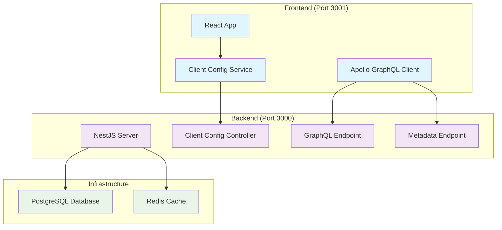
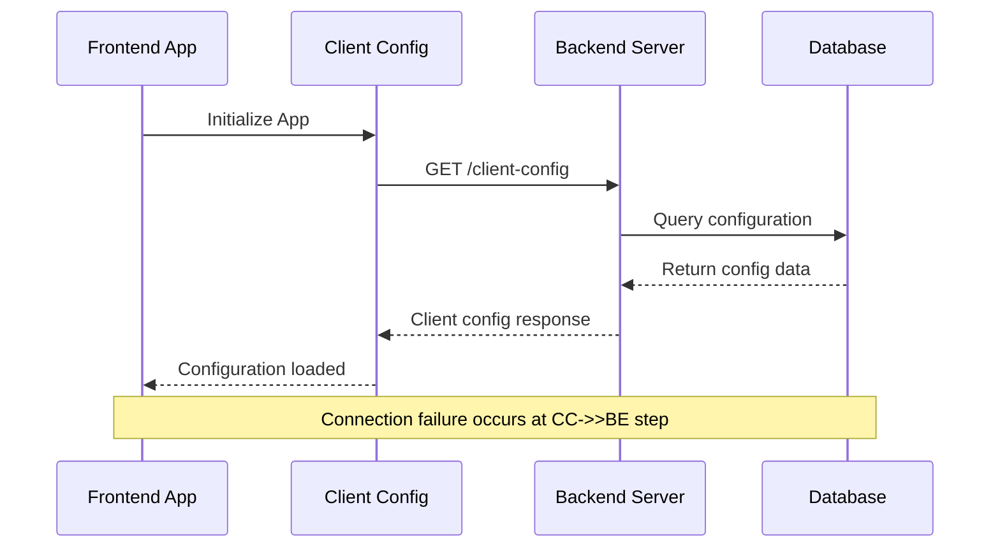
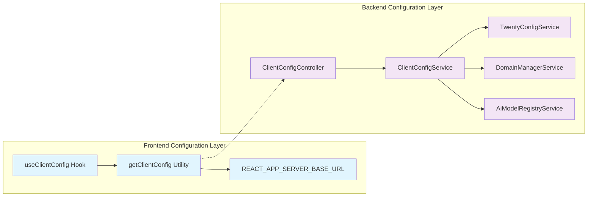
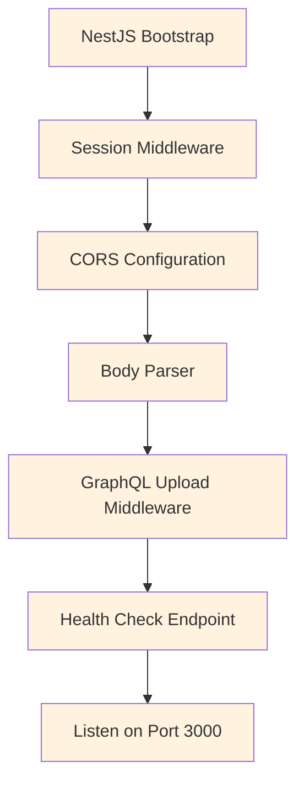
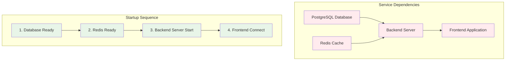

# Twenty Backend Server Connectivity Issue Resolution

## Overview

The Twenty application is experiencing backend server connectivity issues where the frontend cannot reach the backend server on `localhost:3000`. This manifests as `ERR_CONNECTION_REFUSED` errors when trying to access `/client-config` and `/metadata` endpoints.

**Problem Statement**: Frontend requests to `http://localhost:3000/client-config` and `http://localhost:3000/metadata` are failing with `net::ERR_CONNECTION_REFUSED`, indicating the backend server is not running or accessible.

## Architecture

The Twenty application follows a full-stack architecture with clear separation between frontend and backend services:



### Service Communication Flow



## API Endpoints Reference

### Client Configuration Endpoint
- **Route**: `GET /client-config`
- **Controller**: `ClientConfigController`
- **Purpose**: Provides frontend configuration including auth providers, feature flags, and system settings
- **Authentication**: Public endpoint (no authentication required)

### GraphQL Metadata Endpoint
- **Route**: `POST /metadata`
- **Purpose**: GraphQL introspection and metadata queries
- **Authentication**: Required for most operations

### Primary Endpoints Status
| Endpoint | Expected Status | Current Status | Impact |
|----------|----------------|----------------|---------|
| `/client-config` | 200 OK | Connection Refused | Critical - App initialization fails |
| `/metadata` | 200 OK | Connection Refused | Critical - GraphQL operations fail |
| `/graphql` | 200 OK | Connection Refused | Critical - All API operations fail |

## Business Logic Layer

### Client Configuration Service Architecture



### Configuration Resolution Logic

The frontend determines the backend URL through this hierarchy:
1. `window._env_.REACT_APP_SERVER_BASE_URL` (runtime environment variable)
2. `process.env.REACT_APP_SERVER_BASE_URL` (build-time environment variable)  
3. `getDefaultUrl()` function (localhost:3000 for development, same origin for production)

## Middleware & Interceptors

### Server Startup Configuration

The NestJS server configures the following middleware stack:



**Key Server Components:**
- **Port Configuration**: Defaults to 3000 (configurable via `NODE_PORT`)
- **CORS**: Enabled for cross-origin requests
- **Health Check**: Available at `/healthz`
- **GraphQL Endpoints**: `/graphql` and `/metadata`

## Testing Strategy

### Service Connectivity Tests

**Backend Server Validation:**
```bash
# Test 1: Check if port 3000 is in use
netstat -an | findstr :3000

# Test 2: Health check endpoint
curl http://localhost:3000/healthz

# Test 3: Client config endpoint
curl http://localhost:3000/client-config
```

**Frontend Configuration Tests:**
```javascript
// Verify server URL resolution
console.log('Server URL:', REACT_APP_SERVER_BASE_URL);

// Test client config service
const config = await getClientConfig();
```

### Diagnostic Test Matrix

| Test Category | Test Case | Expected Result | Troubleshooting |
|---------------|-----------|----------------|-----------------|
| Network | Port 3000 listening | LISTENING | Start backend server |
| HTTP | GET /healthz | 200 OK | Check server startup logs |
| API | GET /client-config | 200 OK | Verify controller registration |
| GraphQL | POST /metadata | 200 OK | Check GraphQL module config |

### Development Environment Testing

**Docker Compose Validation:**
```yaml
# Verify service health
docker-compose ps
docker-compose logs server

# Check port mapping
docker-compose port server 3000
```

**Local Development Testing:**
```bash
# Start backend server
cd packages/twenty-server
yarn start:dev

# Start frontend (separate terminal)
cd packages/twenty-front  
yarn start
```

### Resolution Strategies

#### Strategy 1: Start Backend Server
```bash
# Navigate to server directory
cd packages/twenty-server

# Install dependencies
yarn install

# Set up environment
cp .env.example .env

# Start development server
yarn start:dev
```

#### Strategy 2: Docker Environment
```bash
# Use Docker Compose for full stack
cd packages/twenty-docker
docker-compose up -d

# Verify services are running
docker-compose ps
```

#### Strategy 3: Environment Configuration
```bash
# Set custom server URL for frontend
export REACT_APP_SERVER_BASE_URL=http://localhost:3000

# Or create .env file in twenty-front
echo "REACT_APP_SERVER_BASE_URL=http://localhost:3000" > packages/twenty-front/.env
```

### Service Dependencies Validation



**Dependency Checklist:**
- [ ] PostgreSQL running on port 5432
- [ ] Redis running on port 6379  
- [ ] Backend server started on port 3000
- [ ] Frontend configured with correct server URL
- [ ] Network connectivity between services

### Error Recovery Patterns

**Graceful Degradation:**
- Frontend should handle server unavailability
- Display appropriate error messages
- Implement retry mechanisms for critical operations
- Cache client configuration when possible

**Monitoring and Alerts:**
- Health check endpoint monitoring
- Connection failure logging
- Performance metrics collection
- Automated restart procedures