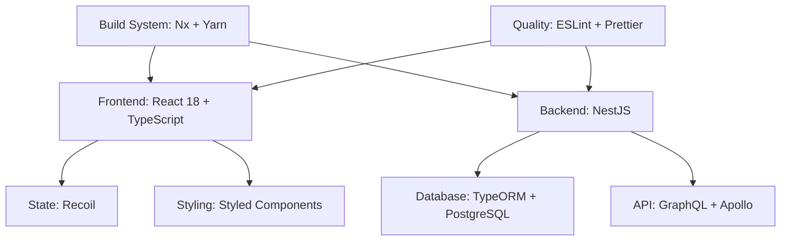
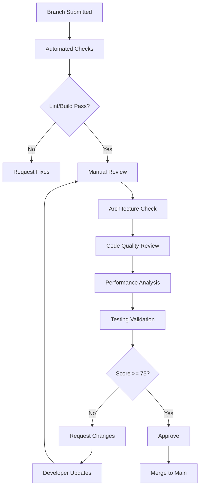
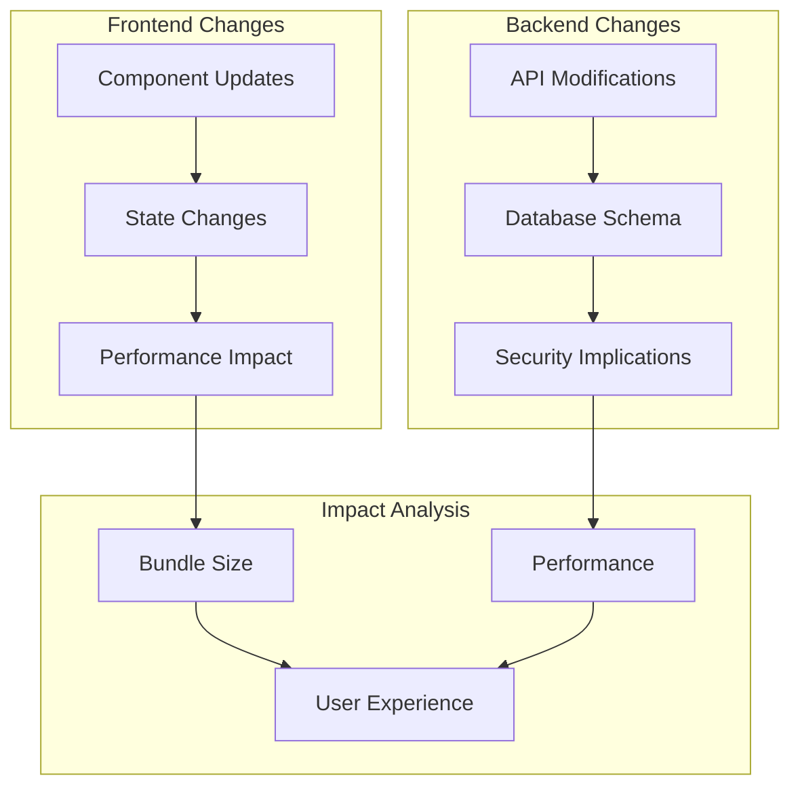

# Branch Review Framework for Twenty CRM

## Overview

This document outlines a comprehensive framework for evaluating branch changes against Twenty's architectural principles, coding standards, and project rules. As a code reviewer, this framework ensures that all modifications align with the established patterns and maintain code quality across the monorepo.

## Architecture Compliance Review

### Technology Stack Validation

The review process evaluates changes against Twenty's core technology stack:



**Compliance Checks:**
- React functional components only (no class components)
- NestJS decorators and dependency injection patterns
- TypeORM entity definitions and relationships
- GraphQL schema definitions and resolvers
- Nx workspace structure adherence

### Package Structure Integrity

Changes must respect the monorepo architecture:

| Package | Purpose | Review Focus |
|---------|---------|--------------|
| `twenty-front` | React application | Component patterns, state management |
| `twenty-server` | NestJS API | Module structure, GraphQL resolvers |
| `twenty-ui` | Shared components | Design system consistency |
| `twenty-shared` | Common utilities | Type definitions, utility functions |
| `twenty-emails` | Email templates | Template structure, i18n |

**Review Criteria:**
- No cross-package boundary violations
- Proper import paths using modular conventions
- Shared code placement in appropriate packages

## Code Quality Assessment

### TypeScript Standards Compliance

**Strict Typing Requirements:**
```typescript
// ✅ Compliant - Strong typing
type UserProfile = {
  id: string;
  name: string;
  role: 'admin' | 'user' | 'guest';
};

// ❌ Non-compliant - any type usage
function processUser(user: any) {
  return user.name;
}
```

**Review Checklist:**
- [ ] No `any` types used
- [ ] Types preferred over interfaces (except third-party extensions)
- [ ] String literals over enums (except GraphQL)
- [ ] Proper generic usage with descriptive names
- [ ] Component props suffixed with 'Props'

### React Component Patterns

**Component Structure Validation:**
```typescript
// ✅ Compliant pattern
export const UserCard = ({ user, onEdit }: UserCardProps) => {
  const handleEdit = useCallback(() => {
    onEdit(user.id);
  }, [onEdit, user.id]);

  return (
    <StyledCard>
      <UserAvatar user={user} />
      <UserInfo user={user} />
      <Button onClick={handleEdit}>Edit</Button>
    </StyledCard>
  );
};

// ❌ Non-compliant - default export
export default function UserCard(props) {
  // Implementation
}
```

**Review Criteria:**
- [ ] Functional components only
- [ ] Named exports exclusively
- [ ] Event handlers over useEffect for state updates
- [ ] Proper prop destructuring
- [ ] Component composition over complex logic

### State Management Patterns

**Recoil Usage Validation:**
```typescript
// ✅ Proper atom definition
export const currentUserState = atom<User | null>({
  key: 'currentUserState',
  default: null,
});

// ✅ Proper selector usage
export const userDisplayNameSelector = selector({
  key: 'userDisplayNameSelector',
  get: ({ get }) => {
    const user = get(currentUserState);
    return user ? `${user.firstName} ${user.lastName}` : 'Guest';
  },
});
```

**Review Points:**
- [ ] Atoms for primitive state
- [ ] Selectors for derived state
- [ ] Atom families for dynamic collections
- [ ] Proper key naming conventions
- [ ] Unidirectional data flow maintenance

## File Structure & Organization

### Naming Convention Compliance

**File Naming Standards:**
```
// ✅ Compliant naming
user-profile.component.tsx
user-profile.styles.ts
user-profile.test.tsx
user.service.ts
user.entity.ts
create-user.dto.ts

// ❌ Non-compliant
UserProfile.tsx
userProfile.js
user_profile.component.tsx
```

### Import/Export Patterns

**Import Organization Review:**
```typescript
// ✅ Proper import order
// 1. External libraries
import React, { useCallback } from 'react';
import styled from 'styled-components';

// 2. Internal modules (absolute paths)
import { Button } from 'twenty-ui/display';
import { UserService } from 'twenty-shared/utils';

// 3. Relative imports
import { UserCardProps } from './types';
```

**Review Checklist:**
- [ ] Modular import paths for twenty-ui and twenty-shared
- [ ] Named exports only
- [ ] Proper import ordering
- [ ] No unused imports
- [ ] Barrel export usage for modules

## Performance & Security Review

### Performance Considerations

**Component Optimization:**
```typescript
// ✅ Proper memoization usage
const ExpensiveChart = memo(({ data }: ChartProps) => {
  const processedData = useMemo(() => 
    processChartData(data), [data]
  );
  
  return <Chart data={processedData} />;
});

// ✅ Callback optimization
const UserList = ({ users, onUserSelect }: UserListProps) => {
  const handleUserSelect = useCallback((user: User) => {
    onUserSelect(user);
  }, [onUserSelect]);
  
  return (
    <div>
      {users.map(user => (
        <UserItem key={user.id} user={user} onSelect={handleUserSelect} />
      ))}
    </div>
  );
};
```

### Security Validation

**Input Sanitization:**
```typescript
// ✅ Proper validation
const validateUserInput = (input: string): string => {
  return DOMPurify.sanitize(input.trim());
};

// ✅ Proper error handling
try {
  const user = await userService.findById(userId);
  if (!user) {
    throw new UserNotFoundError(`User with ID ${userId} not found`);
  }
  return user;
} catch (error) {
  logger.error('Failed to fetch user', { userId, error });
  throw error;
}
```

## Testing Strategy Compliance

### Unit Testing Requirements

**Test Structure Validation:**
```typescript
// ✅ Proper test structure
describe('UserService', () => {
  let userService: UserService;
  
  beforeEach(() => {
    userService = new UserService();
  });

  it('should find user by ID', async () => {
    // Arrange
    const userId = 'user-123';
    const expectedUser = { id: userId, name: 'John Doe' };
    
    // Act
    const result = await userService.findById(userId);
    
    // Assert
    expect(result).toEqual(expectedUser);
  });
});
```

### E2E Testing Considerations

**Playwright Test Integration:**
- [ ] New features include E2E test coverage
- [ ] Test selectors follow data-testid conventions
- [ ] User workflows are properly tested
- [ ] Cross-browser compatibility considered

## Documentation & Comments

### Code Documentation Standards

**JSDoc Usage:**
```typescript
/**
 * Calculates the total price including tax and discount
 * @param basePrice - The base price before modifications
 * @param taxRate - Tax rate as decimal (0.1 for 10%)
 * @param discount - Discount amount in absolute value
 * @returns The final price after tax and discount
 */
const calculateTotalPrice = (
  basePrice: number,
  taxRate: number,
  discount: number = 0
): number => {
  const taxAmount = basePrice * taxRate;
  return basePrice + taxAmount - discount;
};
```

### Inline Comments

**Business Logic Documentation:**
```typescript
// Apply premium discount for users with orders > $100
const discount = isPremiumUser && orderTotal > 100 ? 0.15 : 0;

// TODO: Replace with proper authentication service
const isAuthenticated = localStorage.getItem('token') !== null;
```

## Branch Review Scoring Matrix

### Compliance Score Calculation

| Category | Weight | Score Range | Criteria |
|----------|--------|-------------|----------|
| Architecture Adherence | 25% | 0-100 | Stack compliance, package boundaries |
| Code Quality | 30% | 0-100 | TypeScript standards, React patterns |
| File Organization | 15% | 0-100 | Naming conventions, import patterns |
| Performance | 15% | 0-100 | Optimization techniques, memory usage |
| Testing | 10% | 0-100 | Test coverage, test quality |
| Documentation | 5% | 0-100 | Code comments, JSDoc coverage |

**Overall Score = Σ(Category Score × Weight)**

### Approval Criteria

| Score Range | Action | Requirements |
|-------------|--------|--------------|
| 90-100 | ✅ Approve | Minor suggestions, ready to merge |
| 75-89 | 🔄 Approve with Changes | Address feedback before merge |
| 50-74 | ❌ Request Changes | Significant issues require resolution |
| <50 | 🚫 Reject | Major architectural violations |

## Review Process Workflow



## Common Violation Patterns

### Anti-Patterns to Watch For

**React Anti-Patterns:**
```typescript
// ❌ Direct state mutation
const updateUser = (user: User) => {
  user.name = 'Updated Name'; // Mutating props
  setUser(user);
};

// ❌ Missing dependency array
useEffect(() => {
  fetchUserData(userId);
}, []); // Missing userId dependency

// ❌ Excessive useEffect usage
useEffect(() => {
  if (user) {
    setUserName(user.name);
  }
}, [user]); // Should be derived state
```

**TypeScript Anti-Patterns:**
```typescript
// ❌ Any type usage
const processData = (data: any) => {
  return data.someProperty;
};

// ❌ Interface instead of type
interface UserData {
  id: string;
  name: string;
}

// ❌ Enum usage (except GraphQL)
enum UserRole {
  Admin = 'admin',
  User = 'user'
}
```

### Architecture Violations

**Package Boundary Issues:**
```typescript
// ❌ Direct cross-package imports
import { UserComponent } from '../twenty-server/src/modules/user';

// ❌ Backend logic in frontend
const validatePassword = (password: string) => {
  // Complex validation logic belongs in backend
};

// ❌ Frontend-specific code in shared packages
import { useState } from 'react'; // In twenty-shared
```

## Action Items for Reviewers

### Pre-Review Checklist

- [ ] Automated checks passed (lint, build, tests)
- [ ] Branch is up-to-date with main
- [ ] No merge conflicts present
- [ ] Appropriate branch naming convention used

### Review Execution

1. **Architecture Review** (10 minutes)
   - Verify package boundaries
   - Check technology stack compliance
   - Validate import patterns

2. **Code Quality Review** (15 minutes)
   - TypeScript standards adherence
   - React component patterns
   - State management compliance

3. **Performance Review** (10 minutes)
   - Component optimization
   - Memory leak prevention
   - Bundle size impact

4. **Testing Review** (10 minutes)
   - Test coverage adequacy
   - Test quality assessment
   - E2E test requirements

### Post-Review Actions

- [ ] Provide constructive feedback with examples
- [ ] Reference specific rule violations
- [ ] Suggest improvements with code samples
- [ ] Schedule follow-up if major changes required

## Branch Review Framework Improvement Plan

### Phase 1: Automation Enhancement (Priority: High)

#### 1.1 Automated Code Analysis Tools

**ESLint Rules Enhancement:**
```json
{
  "rules": {
    "@twenty/component-props-naming": "error",
    "@twenty/no-hardcoded-colors": "error",
    "@twenty/styled-components-prefixed": "error",
    "@twenty/max-consts-per-file": "error",
    "@twenty/recoil-callback-dependency-array": "error",
    "@twenty/no-navigate-prefer-link": "error"
  }
}
```

**Implementation Tasks:**
- [ ] Create custom ESLint plugin for Twenty-specific rules
- [ ] Add pre-commit hooks using husky
- [ ] Integrate SonarQube for code quality metrics
- [ ] Setup automated dependency vulnerability scanning
- [ ] Configure Nx affected commands for optimized CI/CD

#### 1.2 GitHub Actions Integration

**CI/CD Pipeline Enhancement:**
```yaml
name: Branch Review Automation
on:
  pull_request:
    types: [opened, synchronize]

jobs:
  automated-review:
    runs-on: ubuntu-latest
    steps:
      - uses: actions/checkout@v4
      - name: Setup Node.js
        uses: actions/setup-node@v4
        with:
          node-version: '24.5'
          cache: 'yarn'
      
      - name: Install dependencies
        run: yarn install --frozen-lockfile
      
      - name: Run ESLint with custom rules
        run: npx nx run-many -t lint
      
      - name: TypeScript compilation check
        run: npx nx run-many -t type-check
      
      - name: Run unit tests
        run: npx nx run-many -t test
      
      - name: Bundle size analysis
        run: npx nx run-many -t bundle-analyzer
      
      - name: Architecture compliance check
        run: npx nx run-many -t arch-check
```

**Automated Checks:**
- [ ] Bundle size impact analysis
- [ ] Test coverage threshold enforcement
- [ ] Architecture dependency graph validation
- [ ] Performance regression detection
- [ ] Security vulnerability scanning

#### 1.3 Code Quality Metrics Dashboard

**Metrics Collection:**
```typescript
type ReviewMetrics = {
  codeQualityScore: number;
  testCoverage: number;
  bundleSizeImpact: number;
  architectureCompliance: number;
  performanceScore: number;
  securityScore: number;
};

type TrendAnalysis = {
  weeklyTrends: ReviewMetrics[];
  monthlyAverages: ReviewMetrics;
  teamComparison: Record<string, ReviewMetrics>;
};
```

**Dashboard Features:**
- [ ] Real-time code quality trends
- [ ] Team performance comparison
- [ ] Technical debt tracking
- [ ] Review time optimization metrics
- [ ] Common violation pattern analysis

### Phase 2: Advanced Review Capabilities (Priority: Medium)

#### 2.1 AI-Powered Code Analysis

**Intelligent Review Assistant:**
```typescript
type AIReviewSuggestion = {
  type: 'performance' | 'security' | 'maintainability' | 'architecture';
  severity: 'low' | 'medium' | 'high' | 'critical';
  location: {
    file: string;
    line: number;
    column: number;
  };
  description: string;
  suggestedFix: string;
  relatedPatterns: string[];
};

const analyzeCodeChanges = async (diff: GitDiff): Promise<AIReviewSuggestion[]> => {
  // AI-powered analysis implementation
};
```

**AI Features:**
- [ ] Pattern recognition for common issues
- [ ] Automated code suggestion generation
- [ ] Context-aware architectural advice
- [ ] Performance bottleneck detection
- [ ] Security vulnerability identification

#### 2.2 Interactive Review Templates

**Dynamic Checklist Generation:**
```typescript
type ReviewTemplate = {
  frontend: {
    components: ChecklistItem[];
    stateManagement: ChecklistItem[];
    performance: ChecklistItem[];
  };
  backend: {
    apiDesign: ChecklistItem[];
    dataModeling: ChecklistItem[];
    security: ChecklistItem[];
  };
  shared: {
    typeDefinitions: ChecklistItem[];
    utilities: ChecklistItem[];
    testing: ChecklistItem[];
  };
};

const generateReviewChecklist = (changedFiles: string[]): ReviewTemplate => {
  // Generate contextual checklist based on file changes
};
```

**Template Features:**
- [ ] File-type specific checklists
- [ ] Progressive disclosure of review items
- [ ] Historical review data integration
- [ ] Customizable review criteria
- [ ] Team-specific review templates

#### 2.3 Visual Code Analysis Tools

**Architecture Visualization:**


**Visualization Tools:**
- [ ] Component dependency graphs
- [ ] Data flow diagrams
- [ ] Performance impact heatmaps
- [ ] Test coverage visualization
- [ ] Architecture compliance radar charts

### Phase 3: Collaboration & Knowledge Sharing (Priority: Medium)

#### 3.1 Review Knowledge Base

**Pattern Library Integration:**
```typescript
type ReviewPattern = {
  id: string;
  name: string;
  category: 'component' | 'service' | 'utility' | 'pattern';
  description: string;
  goodExample: string;
  badExample: string;
  relatedRules: string[];
  frequency: number;
  lastUpdated: Date;
};

type ReviewGuideline = {
  title: string;
  applicableFiles: string[];
  checkpoints: string[];
  commonMistakes: string[];
  bestPractices: string[];
};
```

**Knowledge Base Features:**
- [ ] Searchable pattern library
- [ ] Interactive code examples
- [ ] Video walkthrough guides
- [ ] Team-specific best practices
- [ ] Historical decision documentation

#### 3.2 Reviewer Training System

**Skill Development Framework:**
```typescript
type ReviewerSkill = {
  category: 'architecture' | 'security' | 'performance' | 'testing';
  level: 'beginner' | 'intermediate' | 'advanced' | 'expert';
  assessmentScore: number;
  improvementAreas: string[];
  recommendedResources: Resource[];
};

type TrainingModule = {
  title: string;
  difficulty: 'basic' | 'intermediate' | 'advanced';
  duration: number;
  practiceExercises: Exercise[];
  assessmentCriteria: Criteria[];
};
```

**Training Components:**
- [ ] Interactive code review simulations
- [ ] Architecture decision workshops
- [ ] Security review certification
- [ ] Performance optimization training
- [ ] Mentorship program integration

#### 3.3 Review Analytics & Insights

**Team Performance Analytics:**
```typescript
type ReviewAnalytics = {
  reviewerEffectiveness: {
    accuracy: number;
    thoroughness: number;
    timeEfficiency: number;
  };
  teamMetrics: {
    averageReviewTime: number;
    defectDetectionRate: number;
    codeQualityImprovement: number;
  };
  trendAnalysis: {
    qualityTrends: TimeSeries[];
    productivityMetrics: TimeSeries[];
    learningCurveAnalysis: TimeSeries[];
  };
};
```

**Analytics Features:**
- [ ] Individual reviewer performance tracking
- [ ] Team productivity metrics
- [ ] Code quality trend analysis
- [ ] Review bottleneck identification
- [ ] Skill gap analysis

### Phase 4: Integration & Ecosystem (Priority: Low)

#### 4.1 IDE Integration

**VSCode Extension Development:**
```typescript
interface TwentyReviewExtension {
  features: {
    inlineCodeSuggestions: boolean;
    architectureValidation: boolean;
    performanceHints: boolean;
    testCoverageIndicators: boolean;
  };
  
  commands: {
    'twenty.validateArchitecture': () => Promise<ValidationResult>;
    'twenty.analyzePerformance': () => Promise<PerformanceReport>;
    'twenty.generateTests': () => Promise<TestSuggestion[]>;
  };
}
```

**IDE Features:**
- [ ] Real-time code quality feedback
- [ ] Architecture compliance indicators
- [ ] Automated test generation suggestions
- [ ] Performance optimization hints
- [ ] Security vulnerability highlighting

#### 4.2 Third-Party Tool Integration

**Tool Ecosystem:**
```yaml
integrations:
  codeQuality:
    - SonarQube
    - CodeClimate
    - Codacy
  
  security:
    - Snyk
    - OWASP Dependency Check
    - GitHub Security Advisories
  
  performance:
    - Lighthouse CI
    - WebPageTest
    - Bundle Analyzer
  
  testing:
    - Jest
    - Playwright
    - Storybook
```

**Integration Benefits:**
- [ ] Comprehensive quality metrics
- [ ] Automated security scanning
- [ ] Performance regression detection
- [ ] Visual regression testing
- [ ] Accessibility compliance checking

### Implementation Timeline

#### Quarter 1: Foundation
- [ ] Setup automated CI/CD pipeline
- [ ] Implement custom ESLint rules
- [ ] Create basic metrics dashboard
- [ ] Establish review templates

#### Quarter 2: Enhancement
- [ ] Deploy AI-powered analysis
- [ ] Build interactive review tools
- [ ] Launch knowledge base
- [ ] Implement training modules

#### Quarter 3: Optimization
- [ ] Refine automation workflows
- [ ] Enhance analytics capabilities
- [ ] Improve team collaboration features
- [ ] Optimize review performance

#### Quarter 4: Integration
- [ ] Complete IDE extensions
- [ ] Finalize third-party integrations
- [ ] Launch comprehensive training program
- [ ] Evaluate and iterate on entire system

### Success Metrics

#### Quantitative KPIs
- [ ] 50% reduction in review time
- [ ] 30% improvement in code quality scores
- [ ] 80% automated check coverage
- [ ] 95% reviewer satisfaction rate
- [ ] 40% decrease in post-merge defects

#### Qualitative Goals
- [ ] Enhanced developer learning experience
- [ ] Improved code review culture
- [ ] Faster onboarding for new team members
- [ ] Better architectural decision documentation
- [ ] Increased knowledge sharing across teams

### Risk Mitigation

#### Technical Risks
- [ ] **Over-automation**: Balance automation with human insight
- [ ] **Tool fatigue**: Integrate smoothly into existing workflows
- [ ] **False positives**: Fine-tune AI and rules to minimize noise
- [ ] **Performance impact**: Optimize tools to avoid slowing development

#### Organizational Risks
- [ ] **Resistance to change**: Gradual rollout with clear benefits
- [ ] **Training overhead**: Provide comprehensive but efficient training
- [ ] **Maintenance burden**: Design for sustainability and low maintenance
- [ ] **Cost considerations**: Prioritize high-impact, low-cost improvements