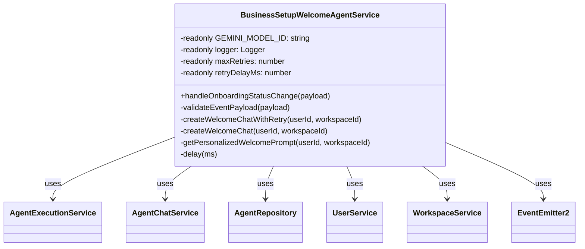

# Business Setup Welcome Agent Fix Design Document

## Overview

This document outlines the design for fixing TypeScript errors in the `BusinessSetupWelcomeAgentService` related to the missing `GEMINI_MODEL_ID` property and the incorrect import path in the test file.

## Problem Statement

The current codebase has the following issues:

1. `src/engine/core-modules/business-setup/services/business-setup-welcome-agent.service.ts` references `this.GEMINI_MODEL_ID` but this property is not defined in the class.

2. `src/engine/core-modules/business-setup/tests/business-setup-welcome-agent-gemini.spec.ts` has an incorrect import path: `import { BusinessSetupWelcomeAgentService } from './services/business-setup-welcome-agent.service';`. The path is relative and doesn't match the actual file structure.

## Technology Stack

- TypeScript
- NestJS

## Architecture

The fix will maintain the existing architecture while ensuring proper TypeScript compliance:

### Component Diagram



## Technical Design

### 1. Fix Missing `GEMINI_MODEL_ID` Property

Add the missing class property:

```typescript
@Injectable()
export class BusinessSetupWelcomeAgentService {
  private readonly logger = new Logger(BusinessSetupWelcomeAgentService.name);
  // Define the Gemini model ID to be used exclusively for welcome step
  private readonly GEMINI_MODEL_ID = 'google/gemini-2.5-flash';
  private readonly maxRetries = 3;
  private readonly retryDelayMs = 1000;
  
  // ... rest of the class remains unchanged
}
```

### 2. Fix Test Import Path

Correct the import path in the test file from:

```typescript
import { BusinessSetupWelcomeAgentService } from './services/business-setup-welcome-agent.service';
```

To:

```typescript
import { BusinessSetupWelcomeAgentService } from '../services/business-setup-welcome-agent.service';
```

The '../' prefix correctly points to the parent directory where the services folder is located.

## Testing

After implementing the fixes:

1. Ensure that the TypeScript compilation errors are resolved.
2. Verify that the existing tests pass without any issues.
3. No new tests are needed as these are purely TypeScript errors being fixed.

## Implementation Plan

1. Add the missing `GEMINI_MODEL_ID` property to `BusinessSetupWelcomeAgentService`.
2. Fix the import path in `business-setup-welcome-agent-gemini.spec.ts`.
3. Run TypeScript compilation to confirm errors are resolved.
4. Run tests to ensure functionality remains intact.

## Data Model Impact

None. These changes are purely TypeScript-related and do not affect the data model.

## API Impact

None. These changes are internal implementation details and do not affect the API surface.

## Potential Issues and Considerations

- Ensure the value of `GEMINI_MODEL_ID` is consistent with what's used in tests and documentation.
- Verify that the model ID string is exactly as expected by the OpenRouter API.