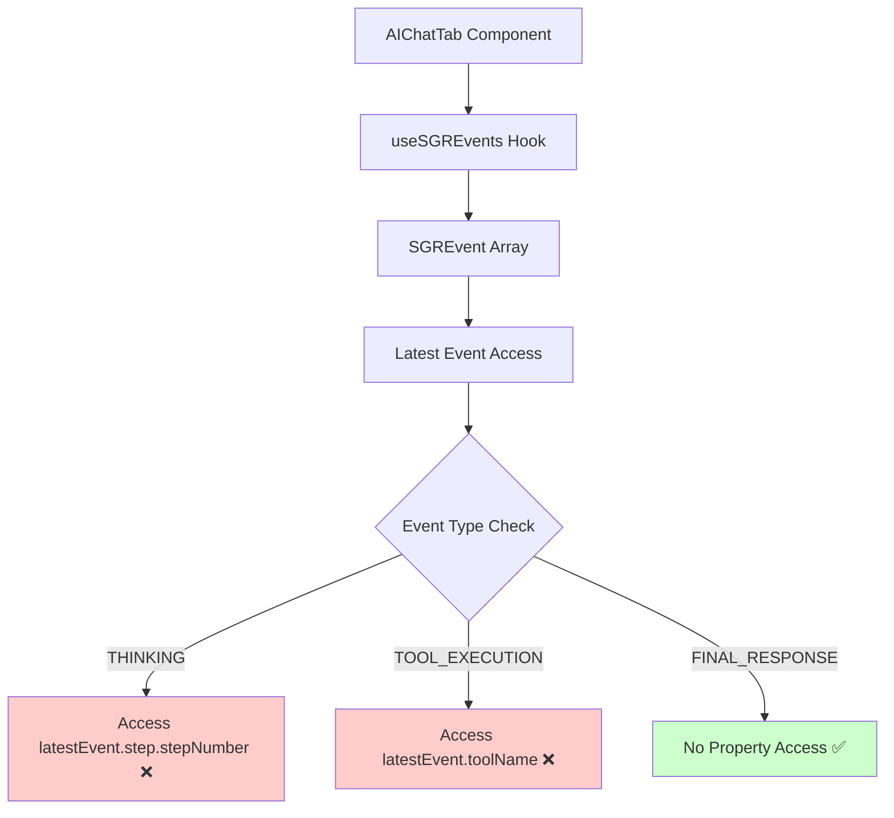
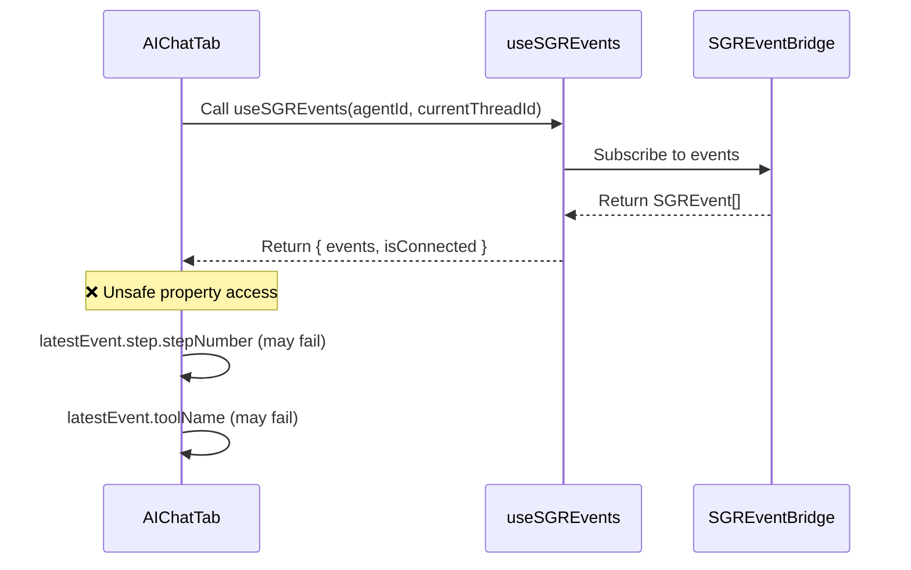
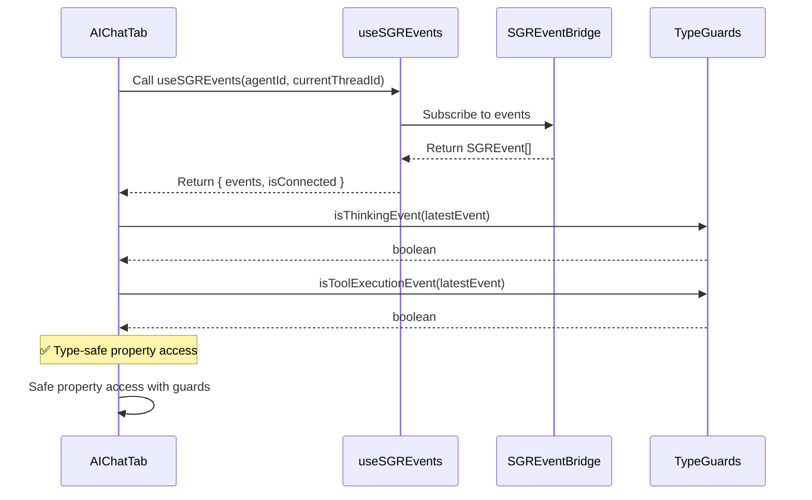
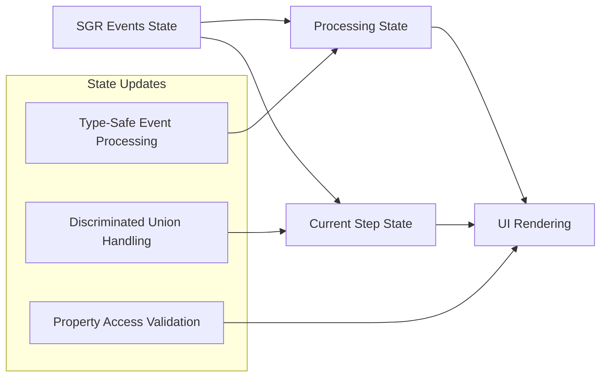
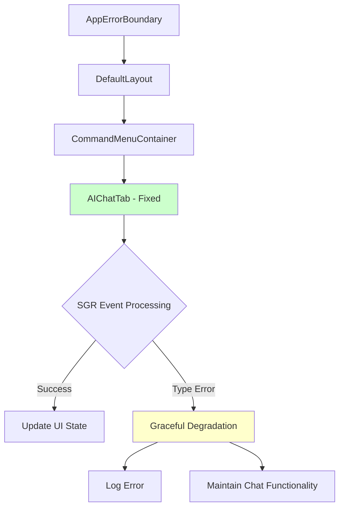

# AIChatTab Component Error Fix Design

## Overview

This design addresses a critical React runtime error in the AIChatTab component within the Twenty CRM frontend application. The error occurs when processing SGR (Schema-Guided Reasoning) events due to type mismatches and unsafe property access on union types.

## Technology Stack & Dependencies

- **Frontend Framework**: React 18 with TypeScript
- **State Management**: Recoil for component state
- **Styling**: Emotion styled-components
- **Build System**: Nx monorepo with Vite
- **Type Safety**: Strict TypeScript configuration

## Component Architecture

### Root Cause Analysis

The error occurs in the AIChatTab component's useEffect hook that processes SGR events:



### Type Definition Issues

The component attempts to access properties that don't exist on all SGR event types:

| Event Type | Properties Accessed | Available Properties |
|------------|-------------------|---------------------|
| `SGRThinkingEvent` | `latestEvent.step.stepNumber` | ✅ Has `step` property |
| `SGRToolExecutionEvent` | `latestEvent.toolName` | ✅ Has `toolName` property |
| `SGRFinalResponseEvent` | No unsafe access | ✅ Safe |

## Data Flow Between Layers

### Current (Problematic) Implementation



### Fixed Implementation



## Error Handling Implementation

### Type Guard Functions

The solution leverages TypeScript discriminated unions with proper type guards:

```typescript
// Type guard functions for runtime type safety
function isThinkingEvent(event: SGREvent): event is SGRThinkingEvent {
  return event.type === SGRMessageType.THINKING;
}

function isToolExecutionEvent(event: SGREvent): event is SGRToolExecutionEvent {
  return event.type === SGRMessageType.TOOL_EXECUTION;
}

function isFinalResponseEvent(event: SGREvent): event is SGRFinalResponseEvent {
  return event.type === SGRMessageType.FINAL_RESPONSE;
}
```

### Safe Property Access Pattern

```typescript
useEffect(() => {
  if (sgrEvents.length > 0) {
    const latestEvent = sgrEvents[sgrEvents.length - 1];
    
    if (isThinkingEvent(latestEvent)) {
      // TypeScript knows latestEvent.step exists
      setIsProcessingSGR(true);
      setCurrentSGRStep(`Анализирую шаг ${latestEvent.step.stepNumber}...`);
    } else if (isToolExecutionEvent(latestEvent)) {
      // TypeScript knows latestEvent.toolName exists
      setIsProcessingSGR(true);
      setCurrentSGRStep(`${latestEvent.toolName}: ${latestEvent.status}`);
    } else if (isFinalResponseEvent(latestEvent)) {
      setIsProcessingSGR(false);
      setCurrentSGRStep(null);
    }
  }
}, [sgrEvents]);
```

## Architectural Improvements

### Component State Management



### Error Boundary Integration

The component should work seamlessly with the existing error boundary structure:



## Testing Strategy

### Unit Test Coverage

```mermaid
graph TD
    A[Test Suite] --> B[Type Guard Tests]
    A --> C[Event Processing Tests]
    A --> D[State Update Tests]
    A --> E[Error Handling Tests]
    
    B --> B1[isThinkingEvent()]
    B --> B2[isToolExecutionEvent()]
    B --> B3[isFinalResponseEvent()]
    
    C --> C1[THINKING Event Processing]
    C --> C2[TOOL_EXECUTION Event Processing]
    C --> C3[FINAL_RESPONSE Event Processing]
    
    D --> D1[isProcessingSGR State]
    D --> D2[currentSGRStep State]
    
    E --> E1[Invalid Event Types]
    E --> E2[Missing Properties]
    E --> E3[Null/Undefined Events]
```

### Test Scenarios

| Test Case | Input | Expected Behavior |
|-----------|-------|------------------|
| Valid THINKING event | SGRThinkingEvent with step | Updates processing state with step number |
| Valid TOOL_EXECUTION event | SGRToolExecutionEvent with toolName | Updates processing state with tool status |
| Valid FINAL_RESPONSE event | SGRFinalResponseEvent | Clears processing state |
| Invalid event type | Malformed event | Graceful degradation, no crash |
| Empty events array | [] | No state changes |
| Null/undefined events | null/undefined | Safe handling, no errors |

## Implementation Requirements

### Code Quality Standards

- **Type Safety**: Strict TypeScript with no `any` types
- **Error Handling**: Comprehensive error boundaries and fallbacks
- **Performance**: Efficient event processing with proper cleanup
- **Maintainability**: Clear separation of concerns and modular design

### Development Guidelines

- Use discriminated unions for type safety
- Implement proper type guards for runtime checks
- Follow React best practices for useEffect dependencies
- Maintain consistent error handling patterns
- Ensure backward compatibility with existing SGR functionality

### Monitoring and Observability

- Add debug logging for SGR event processing
- Track error rates and types through existing error boundaries
- Monitor performance impact of event processing
- Ensure graceful degradation when SGR features are unavailable