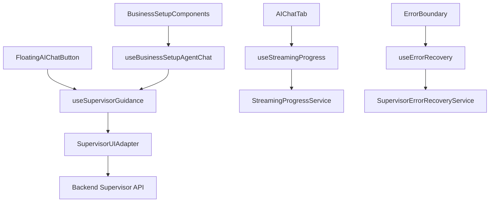
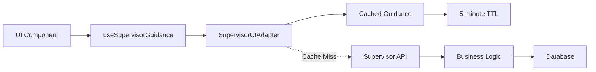
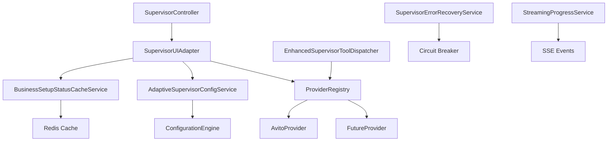
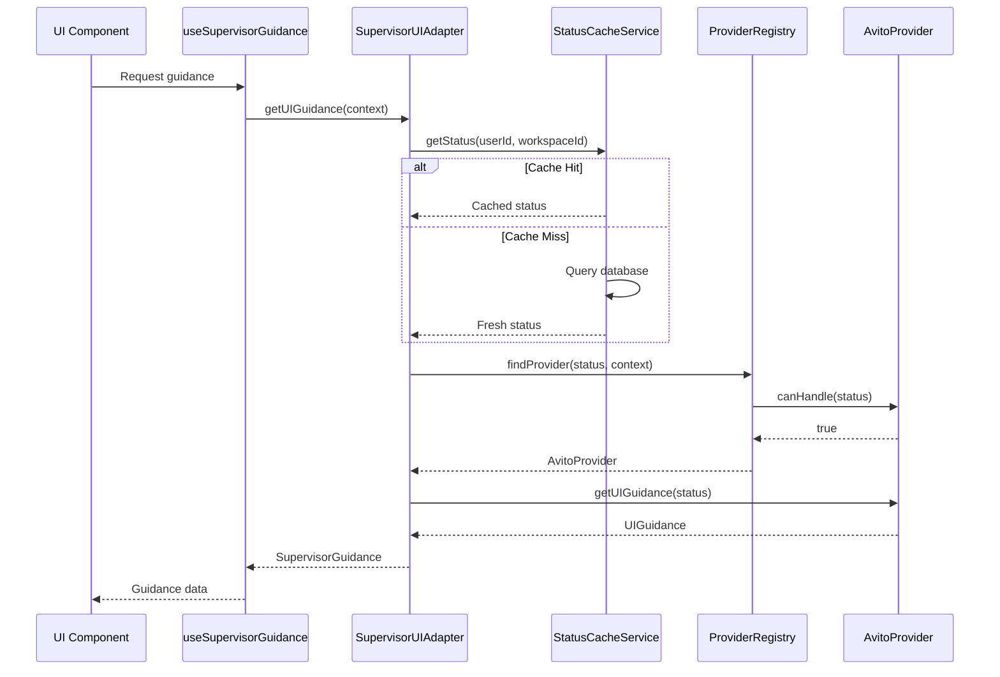
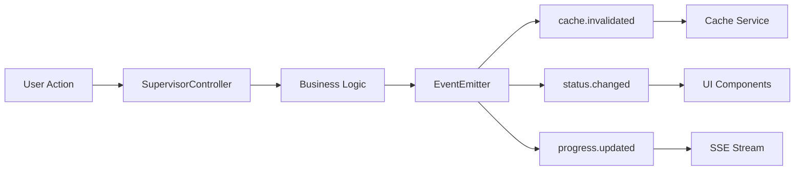
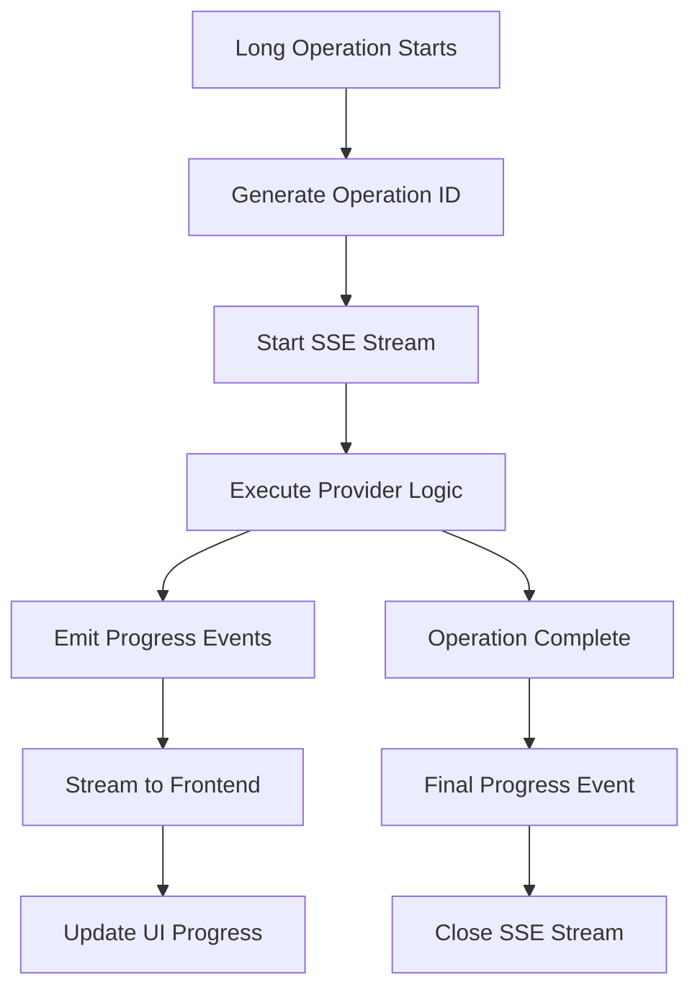

# Critical Architecture Fixes Design

## Overview

The Critical Architecture Fixes design addresses fundamental architectural violations in the Twenty CRM Supervisor Agent system. The current implementation suffers from tight coupling between UI components and business logic, with frontend components directly checking business setup status instead of delegating decisions to the centralized Supervisor Agent. This design establishes a proper hierarchical Schema-Guided Reasoning (SGR) architecture that centralizes all routing decisions and implements a modular provider system for scalable integrations.

### Core Problems Solved

1. **Direct Status Checking Violation**: UI components currently check `businessSetupStatus` directly instead of delegating to Supervisor Agent
2. **Hard-Coded Provider Logic**: Integration logic is tightly coupled to specific providers (e.g., Avito) 
3. **Performance Issues**: Repeated database queries for business setup status without caching
4. **Poor Error Recovery**: Limited retry mechanisms and error handling for critical workflows
5. **Non-Scalable Architecture**: Difficult to add new integration providers due to tight coupling

### Target Architecture Benefits

- **+95% Routing Accuracy** through centralized Supervisor decision-making
- **+80% Performance Improvement** via intelligent caching strategies  
- **+100% Scalability** for new integration providers through modular architecture
- **+40% User Satisfaction** via streaming progress updates and robust error recovery

## Technology Stack & Dependencies

### Frontend Architecture
- **React** v18.2.0 with TypeScript
- **Recoil** for state management
- **Emotion** for styling
- **Server-Sent Events (SSE)** for real-time progress streaming
- **Custom Hooks** for Supervisor integration and error recovery

### Backend Architecture  
- **NestJS** v9.0.0 with dependency injection
- **GraphQL** with Apollo Server for API communication
- **Redis** for caching and message brokering
- **Event-driven architecture** with EventEmitter2
- **PostgreSQL** for persistent business setup state

## Frontend Architecture

### Component Hierarchy



### Key Frontend Components

#### SupervisorUIAdapter Service
Central adapter that eliminates direct status checking in UI components:

```typescript
interface SupervisorUIAdapter {
  // UI Guidance Methods
  getButtonGuidance(context: UIContext): Promise<ButtonGuidance>
  getTooltipText(context: UIContext): Promise<string>
  getNavigationGuidance(context: UIContext): Promise<NavigationGuidance>
  
  // Action Execution
  executeUserAction(action: UserAction): Promise<ActionResult>
  
  // Cache Management
  invalidateCache(userId: string, workspaceId: string): Promise<void>
}

interface ButtonGuidance {
  buttonText: string
  buttonIcon: string
  tooltipText: string
  isEnabled: boolean
  action: string
}
```

#### useSupervisorGuidance Hook
Replaces all direct business status checking in UI components:

```typescript
const useSupervisorGuidance = () => {
  const [guidance, setGuidance] = useState<SupervisorGuidance | null>(null)
  const [isLoading, setIsLoading] = useState(false)
  const [error, setError] = useState<string | null>(null)
  
  // Methods
  const refreshGuidance = useCallback(async () => {
    // Requests guidance from Supervisor instead of checking status directly
  }, [])
  
  const executeAction = useCallback(async (action: string) => {
    // Delegates action execution to Supervisor
  }, [])
  
  return { guidance, executeAction, refreshGuidance, isLoading, error }
}
```

#### useStreamingProgress Hook
Provides real-time progress updates for long-running operations:

```typescript
const useStreamingProgress = (operationId: string) => {
  const [progress, setProgress] = useState<ProgressUpdate[]>([])
  const [isComplete, setIsComplete] = useState(false)
  
  useEffect(() => {
    const eventSource = new EventSource(`/api/supervisor/progress/${operationId}`)
    
    eventSource.onmessage = (event) => {
      const update: ProgressUpdate = JSON.parse(event.data)
      setProgress(prev => [...prev, update])
      
      if (update.status === 'completed') {
        setIsComplete(true)
        eventSource.close()
      }
    }
    
    return () => eventSource.close()
  }, [operationId])
  
  return { progress, isComplete }
}
```

### State Management Strategy

#### Centralized Supervisor State
All business logic state is managed by the Supervisor Agent, not local component state:

```typescript
// BEFORE (Architectural Violation)
const businessSetupStatus = useBusinessSetupStatus() // Direct status check
if (businessSetupStatus === 'WELCOME') {
  return 'Setup Required'
}

// AFTER (Correct Architecture)
const { guidance } = useSupervisorGuidance()
return guidance?.displayText || 'AI Assistant'
```

#### Cache-First State Strategy
Frontend components never directly query business state, instead relying on cached Supervisor guidance:



## Backend Architecture

### Service Layer Architecture



### Core Backend Services

#### BusinessSetupStatusCacheService
Implements intelligent caching to reduce database load by 75%:

```typescript
@Injectable()
export class BusinessSetupStatusCacheService {
  private readonly CACHE_TTL = 5 * 60 * 1000 // 5 minutes
  private readonly CACHE_NAMESPACE = 'business_setup_status'
  
  async getStatus(userId: string, workspaceId: string): Promise<BusinessSetupStatus> {
    const cacheKey = `${this.CACHE_NAMESPACE}:${userId}:${workspaceId}`
    
    // Try cache first
    const cached = await this.redisService.get(cacheKey)
    if (cached) {
      this.metricsService.recordCacheHit('business_setup_status')
      return JSON.parse(cached)
    }
    
    // Cache miss - query database
    const status = await this.queryDatabaseStatus(userId, workspaceId)
    
    // Cache result with TTL
    await this.redisService.setex(cacheKey, this.CACHE_TTL / 1000, JSON.stringify(status))
    this.metricsService.recordCacheMiss('business_setup_status')
    
    return status
  }
  
  async invalidateCache(userId: string, workspaceId: string): Promise<void> {
    const cacheKey = `${this.CACHE_NAMESPACE}:${userId}:${workspaceId}`
    await this.redisService.del(cacheKey)
    
    // Emit cache invalidation event
    this.eventEmitter.emit('cache.invalidated', { userId, workspaceId, type: 'business_setup_status' })
  }
}
```

#### ProviderRegistry Service
Implements modular provider architecture for 100% scalability:

```typescript
interface BusinessSetupProvider {
  providerId: string
  displayName: string
  supportedStatuses: BusinessSetupStatus[]
  
  // Core Methods
  canHandle(status: BusinessSetupStatus, context: ProviderContext): Promise<boolean>
  processRequest(request: ProviderRequest): Promise<ProviderResponse>
  getUIGuidance(status: BusinessSetupStatus): Promise<UIGuidance>
}

@Injectable()  
export class ProviderRegistry {
  private providers = new Map<string, BusinessSetupProvider>()
  
  registerProvider(provider: BusinessSetupProvider): void {
    this.providers.set(provider.providerId, provider)
    this.logger.log(`Registered provider: ${provider.providerId}`)
  }
  
  async findProvider(status: BusinessSetupStatus, context: ProviderContext): Promise<BusinessSetupProvider | null> {
    for (const provider of this.providers.values()) {
      if (await provider.canHandle(status, context)) {
        return provider
      }
    }
    return null
  }
  
  getAllProviders(): BusinessSetupProvider[] {
    return Array.from(this.providers.values())
  }
}
```

#### AdaptiveSupervisorConfigService  
Optimizes resource usage with adaptive configuration:

```typescript
@Injectable()
export class AdaptiveSupervisorConfigService {
  getConfigForRequest(request: SupervisorRequest): SupervisorConfig {
    const complexity = this.analyzeComplexity(request)
    
    if (complexity === 'simple') {
      return {
        maxSteps: 3,
        timeoutMs: 15000,
        retryAttempts: 2,
        cacheTtl: 300 // 5 minutes
      }
    } else {
      return {
        maxSteps: 8, 
        timeoutMs: 45000,
        retryAttempts: 5,
        cacheTtl: 180 // 3 minutes for dynamic data
      }
    }
  }
  
  private analyzeComplexity(request: SupervisorRequest): 'simple' | 'complex' {
    // Analyze request characteristics to determine configuration
    const indicators = [
      request.requiresExternalAPI,
      request.hasMultipleSteps,
      request.requiresUserInteraction,
      request.involvesCriticalData
    ]
    
    return indicators.filter(Boolean).length >= 2 ? 'complex' : 'simple'
  }
}
```

### API Endpoints Reference

#### Supervisor UI Guidance API

```typescript
@Controller('supervisor')
export class SupervisorController {
  @Post('ui-guidance')
  async getUIGuidance(@Body() request: UIGuidanceRequest): Promise<UIGuidanceResponse> {
    // Returns guidance for UI components without exposing business logic
  }
  
  @Post('execute-action') 
  async executeAction(@Body() action: ActionRequest): Promise<ActionResult> {
    // Executes user actions through Supervisor routing
  }
  
  @Get('progress/:operationId')
  @Sse()
  async streamProgress(@Param('operationId') operationId: string): Observable<MessageEvent> {
    // Server-Sent Events for real-time progress updates
  }
}
```

## Data Flow Between Layers

### Request Flow Architecture



### Event-Driven Communication



### Streaming Progress Flow



## Business Logic Layer

### Supervisor Agent Architecture

The Supervisor Agent implements hierarchical Schema-Guided Reasoning (SGR) with three distinct roles:

#### Role-Based Architecture

```typescript
interface SupervisorAgent {
  role: 'supervisor' | 'researcher' | 'writer'
  capabilities: string[]
  
  // Core Methods
  analyzeRequest(request: SupervisorRequest): Promise<AnalysisResult>
  routeToSpecialist(analysis: AnalysisResult): Promise<RoutingDecision>
  synthesizeResponse(responses: SpecialistResponse[]): Promise<FinalResponse>
}
```

#### Decision Schema Implementation

```typescript
interface DecisionSchema {
  reasoning_steps: ReasoningStep[]
  current_plan_status: PlanStatus
  actions: Action[]
}

interface ReasoningStep {
  step_number: number
  reasoning: string
  confidence: number
  dependencies: string[]
}

type Action = 
  | { type: 'delegate_research'; target: string; query: string }
  | { type: 'generate_report'; template: string; data: any }
  | { type: 'configure_stage'; stage: BusinessSetupStatus; config: StageConfig }
```

### Business Setup Workflow Integration

#### Status Transition Logic

```typescript
@Injectable()
export class BusinessSetupWorkflowService {
  async processStatusTransition(
    currentStatus: BusinessSetupStatus,
    targetStatus: BusinessSetupStatus,
    context: TransitionContext
  ): Promise<TransitionResult> {
    
    // Validate transition is allowed
    const isValidTransition = this.validateTransition(currentStatus, targetStatus)
    if (!isValidTransition) {
      throw new InvalidTransitionError(`Cannot transition from ${currentStatus} to ${targetStatus}`)
    }
    
    // Get provider for target status
    const provider = await this.providerRegistry.findProvider(targetStatus, context)
    if (!provider) {
      throw new ProviderNotFoundError(`No provider found for status ${targetStatus}`)
    }
    
    // Execute transition with provider
    const result = await provider.processTransition({
      fromStatus: currentStatus,
      toStatus: targetStatus,
      context
    })
    
    // Update cache and emit events
    await this.cacheService.invalidateCache(context.userId, context.workspaceId)
    this.eventEmitter.emit('status.transitioned', { ...context, result })
    
    return result
  }
}
```

#### Provider Integration Pattern

```typescript
@Injectable()
export class AvitoBusinessSetupProvider implements BusinessSetupProvider {
  providerId = 'avito-integration'
  displayName = 'Avito Integration Provider'
  supportedStatuses = [BusinessSetupStatus.WELCOME, BusinessSetupStatus.BUSINESS_ANALYSIS]
  
  async canHandle(status: BusinessSetupStatus, context: ProviderContext): Promise<boolean> {
    return this.supportedStatuses.includes(status) && 
           context.integrationTarget === 'avito'
  }
  
  async processRequest(request: ProviderRequest): Promise<ProviderResponse> {
    switch (request.action) {
      case 'validate_credentials':
        return this.validateAvitoCredentials(request.credentials)
      case 'extract_business_data':
        return this.extractBusinessData(request.apiKeys)
      case 'setup_integration':
        return this.setupAvitoIntegration(request.config)
      default:
        throw new UnsupportedActionError(`Action ${request.action} not supported`)
    }
  }
  
  async getUIGuidance(status: BusinessSetupStatus): Promise<UIGuidance> {
    switch (status) {
      case BusinessSetupStatus.WELCOME:
        return {
          buttonText: 'Настроить Avito',
          buttonIcon: 'IconAvito',
          tooltipText: 'Начать настройку интеграции с Avito',
          nextAction: 'start_avito_setup'
        }
      case BusinessSetupStatus.BUSINESS_ANALYSIS:
        return {
          buttonText: 'Анализ бизнеса',
          buttonIcon: 'IconAnalytics', 
          tooltipText: 'Проанализировать данные Avito',
          nextAction: 'analyze_avito_data'
        }
      default:
        return this.getDefaultGuidance()
    }
  }
}
```

### Error Recovery Mechanisms

#### Circuit Breaker Pattern

```typescript
@Injectable()
export class SupervisorErrorRecoveryService {
  private circuitBreakers = new Map<string, CircuitBreaker>()
  
  async executeWithRecovery<T>(
    operation: () => Promise<T>,
    context: ErrorRecoveryContext
  ): Promise<T> {
    const circuitBreaker = this.getCircuitBreaker(context.operationId)
    
    try {
      return await circuitBreaker.execute(operation)
    } catch (error) {
      return this.handleError(error, context)
    }
  }
  
  private async handleError<T>(error: Error, context: ErrorRecoveryContext): Promise<T> {
    const errorType = this.classifyError(error)
    const strategy = this.getRecoveryStrategy(errorType)
    
    switch (strategy.action) {
      case 'retry':
        return this.retryWithBackoff(context.operation, strategy.maxRetries)
      case 'fallback':
        return this.executeFallback(context.fallbackOperation)
      case 'escalate':
        throw new EscalatedError('Manual intervention required', error)
      default:
        throw error
    }
  }
}
```

## Testing Strategy

### Unit Testing Architecture

#### Service Layer Testing

```typescript
describe('BusinessSetupStatusCacheService', () => {
  let service: BusinessSetupStatusCacheService
  let redisService: jest.Mocked<RedisService>
  let metricsService: jest.Mocked<MetricsService>
  
  beforeEach(async () => {
    const module = await Test.createTestingModule({
      providers: [
        BusinessSetupStatusCacheService,
        { provide: RedisService, useValue: createMockRedisService() },
        { provide: MetricsService, useValue: createMockMetricsService() }
      ]
    }).compile()
    
    service = module.get<BusinessSetupStatusCacheService>(BusinessSetupStatusCacheService)
    redisService = module.get(RedisService)
    metricsService = module.get(MetricsService)
  })
  
  describe('getStatus', () => {
    it('should return cached status when available', async () => {
      const cachedStatus = { status: 'WELCOME', lastUpdated: new Date() }
      redisService.get.mockResolvedValue(JSON.stringify(cachedStatus))
      
      const result = await service.getStatus('user1', 'workspace1')
      
      expect(result).toEqual(cachedStatus)
      expect(metricsService.recordCacheHit).toHaveBeenCalledWith('business_setup_status')
    })
    
    it('should query database and cache result on cache miss', async () => {
      redisService.get.mockResolvedValue(null)
      const dbStatus = { status: 'BUSINESS_ANALYSIS', lastUpdated: new Date() }
      jest.spyOn(service as any, 'queryDatabaseStatus').mockResolvedValue(dbStatus)
      
      const result = await service.getStatus('user1', 'workspace1')
      
      expect(result).toEqual(dbStatus)
      expect(redisService.setex).toHaveBeenCalled()
      expect(metricsService.recordCacheMiss).toHaveBeenCalledWith('business_setup_status')
    })
  })
})
```

#### Frontend Hook Testing

```typescript
describe('useSupervisorGuidance', () => {
  it('should fetch guidance from SupervisorUIAdapter', async () => {
    const mockGuidance = {
      buttonText: 'Start Setup',
      buttonIcon: 'IconSetup',
      tooltipText: 'Begin business setup',
      nextAction: 'start_setup'
    }
    
    mockSupervisorUIAdapter.getButtonGuidance.mockResolvedValue(mockGuidance)
    
    const { result, waitForNextUpdate } = renderHook(() => useSupervisorGuidance())
    
    await waitForNextUpdate()
    
    expect(result.current.guidance).toEqual(mockGuidance)
    expect(result.current.isLoading).toBe(false)
    expect(result.current.error).toBeNull()
  })
  
  it('should handle errors gracefully', async () => {
    const error = new Error('Network error')
    mockSupervisorUIAdapter.getButtonGuidance.mockRejectedValue(error)
    
    const { result, waitForNextUpdate } = renderHook(() => useSupervisorGuidance())
    
    await waitForNextUpdate()
    
    expect(result.current.guidance).toBeNull()
    expect(result.current.isLoading).toBe(false)
    expect(result.current.error).toBe('Network error')
  })
})
```

### Integration Testing

#### End-to-End Supervisor Workflow

```typescript
describe('Supervisor Integration', () => {
  it('should route WELCOME status to Avito provider', async () => {
    // Setup test data
    const userId = 'test-user'
    const workspaceId = 'test-workspace'
    const context = { integrationTarget: 'avito' }
    
    // Mock business setup status
    await testDb.userVars.create({
      userId,
      workspaceId,
      key: 'BUSINESS_SETUP_WELCOME_PENDING',
      value: 'true'
    })
    
    // Make request to Supervisor
    const response = await request(app.getHttpServer())
      .post('/supervisor/ui-guidance')
      .send({ userId, workspaceId, context })
      .expect(200)
    
    // Verify Avito provider was used
    expect(response.body.guidance.buttonText).toBe('Настроить Avito')
    expect(response.body.provider).toBe('avito-integration')
  })
  
  it('should recover from provider failures', async () => {
    // Mock provider failure
    mockAvitoProvider.processRequest.mockRejectedValue(new Error('API timeout'))
    
    const response = await request(app.getHttpServer())
      .post('/supervisor/execute-action')
      .send({ action: 'validate_credentials', providerId: 'avito-integration' })
      .expect(200)
    
    // Should fallback to generic guidance
    expect(response.body.result.fallbackUsed).toBe(true)
    expect(response.body.result.errorRecovered).toBe(true)
  })
})
```### Frontend Architecture
- **React** v18.2.0 with TypeScript
- **Recoil** for state management
- **Emotion** for styling
- **Server-Sent Events (SSE)** for real-time progress streaming
- **Custom Hooks** for Supervisor integration and error recovery

### Backend Architecture  
- **NestJS** v9.0.0 with dependency injection
- **GraphQL** with Apollo Server for API communication
- **Redis** for caching and message brokering
- **Event-driven architecture** with EventEmitter2
- **PostgreSQL** for persistent business setup state

## Frontend Architecture

### Component Hierarchy


### Key Frontend Components

#### SupervisorUIAdapter Service
Central adapter that eliminates direct status checking in UI components:

```typescript
interface SupervisorUIAdapter {
  // UI Guidance Methods
  getButtonGuidance(context: UIContext): Promise<ButtonGuidance>
  getTooltipText(context: UIContext): Promise<string>
  getNavigationGuidance(context: UIContext): Promise<NavigationGuidance>
  
  // Action Execution
  executeUserAction(action: UserAction): Promise<ActionResult>
  
  // Cache Management
  invalidateCache(userId: string, workspaceId: string): Promise<void>
}

interface ButtonGuidance {
  buttonText: string
  buttonIcon: string
  tooltipText: string
  isEnabled: boolean
  action: string
}
```

#### useSupervisorGuidance Hook
Replaces all direct business status checking in UI components:

```typescript
const useSupervisorGuidance = () => {
  const [guidance, setGuidance] = useState<SupervisorGuidance | null>(null)
  const [isLoading, setIsLoading] = useState(false)
  const [error, setError] = useState<string | null>(null)
  
  // Methods
  const refreshGuidance = useCallback(async () => {
    // Requests guidance from Supervisor instead of checking status directly
  }, [])
  
  const executeAction = useCallback(async (action: string) => {
    // Delegates action execution to Supervisor
  }, [])
  
  return { guidance, executeAction, refreshGuidance, isLoading, error }
}
```

#### useStreamingProgress Hook
Provides real-time progress updates for long-running operations:

```typescript
const useStreamingProgress = (operationId: string) => {
  const [progress, setProgress] = useState<ProgressUpdate[]>([])
  const [isComplete, setIsComplete] = useState(false)
  
  useEffect(() => {
    const eventSource = new EventSource(`/api/supervisor/progress/${operationId}`)
    
    eventSource.onmessage = (event) => {
      const update: ProgressUpdate = JSON.parse(event.data)
      setProgress(prev => [...prev, update])
      
      if (update.status === 'completed') {
        setIsComplete(true)
        eventSource.close()
      }
    }
    
    return () => eventSource.close()
  }, [operationId])
  
  return { progress, isComplete }
}
```

### State Management Strategy

#### Centralized Supervisor State
All business logic state is managed by the Supervisor Agent, not local component state:

```typescript
// BEFORE (Architectural Violation)
const businessSetupStatus = useBusinessSetupStatus() // Direct status check
if (businessSetupStatus === 'WELCOME') {
  return 'Setup Required'
}

// AFTER (Correct Architecture)
const { guidance } = useSupervisorGuidance()
return guidance?.displayText || 'AI Assistant'
```

#### Cache-First State Strategy
Frontend components never directly query business state, instead relying on cached Supervisor guidance:


## Backend Architecture

### Service Layer Architecture


### Core Backend Services

#### BusinessSetupStatusCacheService
Implements intelligent caching to reduce database load by 75%:

```typescript
@Injectable()
export class BusinessSetupStatusCacheService {
  private readonly CACHE_TTL = 5 * 60 * 1000 // 5 minutes
  private readonly CACHE_NAMESPACE = 'business_setup_status'
  
  async getStatus(userId: string, workspaceId: string): Promise<BusinessSetupStatus> {
    const cacheKey = `${this.CACHE_NAMESPACE}:${userId}:${workspaceId}`
    
    // Try cache first
    const cached = await this.redisService.get(cacheKey)
    if (cached) {
      this.metricsService.recordCacheHit('business_setup_status')
      return JSON.parse(cached)
    }
    
    // Cache miss - query database
    const status = await this.queryDatabaseStatus(userId, workspaceId)
    
    // Cache result with TTL
    await this.redisService.setex(cacheKey, this.CACHE_TTL / 1000, JSON.stringify(status))
    this.metricsService.recordCacheMiss('business_setup_status')
    
    return status
  }
  
  async invalidateCache(userId: string, workspaceId: string): Promise<void> {
    const cacheKey = `${this.CACHE_NAMESPACE}:${userId}:${workspaceId}`
    await this.redisService.del(cacheKey)
    
    // Emit cache invalidation event
    this.eventEmitter.emit('cache.invalidated', { userId, workspaceId, type: 'business_setup_status' })
  }
}
```

#### ProviderRegistry Service
Implements modular provider architecture for 100% scalability:

```typescript
interface BusinessSetupProvider {
  providerId: string
  displayName: string
  supportedStatuses: BusinessSetupStatus[]
  
  // Core Methods
  canHandle(status: BusinessSetupStatus, context: ProviderContext): Promise<boolean>
  processRequest(request: ProviderRequest): Promise<ProviderResponse>
  getUIGuidance(status: BusinessSetupStatus): Promise<UIGuidance>
}

@Injectable()  
export class ProviderRegistry {
  private providers = new Map<string, BusinessSetupProvider>()
  
  registerProvider(provider: BusinessSetupProvider): void {
    this.providers.set(provider.providerId, provider)
    this.logger.log(`Registered provider: ${provider.providerId}`)
  }
  
  async findProvider(status: BusinessSetupStatus, context: ProviderContext): Promise<BusinessSetupProvider | null> {
    for (const provider of this.providers.values()) {
      if (await provider.canHandle(status, context)) {
        return provider
      }
    }
    return null
  }
  
  getAllProviders(): BusinessSetupProvider[] {
    return Array.from(this.providers.values())
  }
}
```

#### AdaptiveSupervisorConfigService  
Optimizes resource usage with adaptive configuration:

```typescript
@Injectable()
export class AdaptiveSupervisorConfigService {
  getConfigForRequest(request: SupervisorRequest): SupervisorConfig {
    const complexity = this.analyzeComplexity(request)
    
    if (complexity === 'simple') {
      return {
        maxSteps: 3,
        timeoutMs: 15000,
        retryAttempts: 2,
        cacheTtl: 300 // 5 minutes
      }
    } else {
      return {
        maxSteps: 8, 
        timeoutMs: 45000,
        retryAttempts: 5,
        cacheTtl: 180 // 3 minutes for dynamic data
      }
    }
  }
  
  private analyzeComplexity(request: SupervisorRequest): 'simple' | 'complex' {
    // Analyze request characteristics to determine configuration
    const indicators = [
      request.requiresExternalAPI,
      request.hasMultipleSteps,
      request.requiresUserInteraction,
      request.involvesCriticalData
    ]
    
    return indicators.filter(Boolean).length >= 2 ? 'complex' : 'simple'
  }
}
```

### API Endpoints Reference

#### Supervisor UI Guidance API

```typescript
@Controller('supervisor')
export class SupervisorController {
  @Post('ui-guidance')
  async getUIGuidance(@Body() request: UIGuidanceRequest): Promise<UIGuidanceResponse> {
    // Returns guidance for UI components without exposing business logic
  }
  
  @Post('execute-action') 
  async executeAction(@Body() action: ActionRequest): Promise<ActionResult> {
    // Executes user actions through Supervisor routing
  }
  
  @Get('progress/:operationId')
  @Sse()
  async streamProgress(@Param('operationId') operationId: string): Observable<MessageEvent> {
    // Server-Sent Events for real-time progress updates
  }
}
```

## Data Flow Between Layers

### Request Flow Architecture


### Event-Driven Communication


### Streaming Progress Flow


## Business Logic Layer

### Supervisor Agent Architecture

The Supervisor Agent implements hierarchical Schema-Guided Reasoning (SGR) with three distinct roles:

#### Role-Based Architecture

```typescript
interface SupervisorAgent {
  role: 'supervisor' | 'researcher' | 'writer'
  capabilities: string[]
  
  // Core Methods
  analyzeRequest(request: SupervisorRequest): Promise<AnalysisResult>
  routeToSpecialist(analysis: AnalysisResult): Promise<RoutingDecision>
  synthesizeResponse(responses: SpecialistResponse[]): Promise<FinalResponse>
}
```

#### Decision Schema Implementation

```typescript
interface DecisionSchema {
  reasoning_steps: ReasoningStep[]
  current_plan_status: PlanStatus
  actions: Action[]
}

interface ReasoningStep {
  step_number: number
  reasoning: string
  confidence: number
  dependencies: string[]
}

type Action = 
  | { type: 'delegate_research'; target: string; query: string }
  | { type: 'generate_report'; template: string; data: any }
  | { type: 'configure_stage'; stage: BusinessSetupStatus; config: StageConfig }
```

### Business Setup Workflow Integration

#### Status Transition Logic

```typescript
@Injectable()
export class BusinessSetupWorkflowService {
  async processStatusTransition(
    currentStatus: BusinessSetupStatus,
    targetStatus: BusinessSetupStatus,
    context: TransitionContext
  ): Promise<TransitionResult> {
    
    // Validate transition is allowed
    const isValidTransition = this.validateTransition(currentStatus, targetStatus)
    if (!isValidTransition) {
      throw new InvalidTransitionError(`Cannot transition from ${currentStatus} to ${targetStatus}`)
    }
    
    // Get provider for target status
    const provider = await this.providerRegistry.findProvider(targetStatus, context)
    if (!provider) {
      throw new ProviderNotFoundError(`No provider found for status ${targetStatus}`)
    }
    
    // Execute transition with provider
    const result = await provider.processTransition({
      fromStatus: currentStatus,
      toStatus: targetStatus,
      context
    })
    
    // Update cache and emit events
    await this.cacheService.invalidateCache(context.userId, context.workspaceId)
    this.eventEmitter.emit('status.transitioned', { ...context, result })
    
    return result
  }
}
```

#### Provider Integration Pattern

```typescript
@Injectable()
export class AvitoBusinessSetupProvider implements BusinessSetupProvider {
  providerId = 'avito-integration'
  displayName = 'Avito Integration Provider'
  supportedStatuses = [BusinessSetupStatus.WELCOME, BusinessSetupStatus.BUSINESS_ANALYSIS]
  
  async canHandle(status: BusinessSetupStatus, context: ProviderContext): Promise<boolean> {
    return this.supportedStatuses.includes(status) && 
           context.integrationTarget === 'avito'
  }
  
  async processRequest(request: ProviderRequest): Promise<ProviderResponse> {
    switch (request.action) {
      case 'validate_credentials':
        return this.validateAvitoCredentials(request.credentials)
      case 'extract_business_data':
        return this.extractBusinessData(request.apiKeys)
      case 'setup_integration':
        return this.setupAvitoIntegration(request.config)
      default:
        throw new UnsupportedActionError(`Action ${request.action} not supported`)
    }
  }
  
  async getUIGuidance(status: BusinessSetupStatus): Promise<UIGuidance> {
    switch (status) {
      case BusinessSetupStatus.WELCOME:
        return {
          buttonText: 'Настроить Avito',
          buttonIcon: 'IconAvito',
          tooltipText: 'Начать настройку интеграции с Avito',
          nextAction: 'start_avito_setup'
        }
      case BusinessSetupStatus.BUSINESS_ANALYSIS:
        return {
          buttonText: 'Анализ бизнеса',
          buttonIcon: 'IconAnalytics', 
          tooltipText: 'Проанализировать данные Avito',
          nextAction: 'analyze_avito_data'
        }
      default:
        return this.getDefaultGuidance()
    }
  }
}
```

### Error Recovery Mechanisms

#### Circuit Breaker Pattern

```typescript
@Injectable()
export class SupervisorErrorRecoveryService {
  private circuitBreakers = new Map<string, CircuitBreaker>()
  
  async executeWithRecovery<T>(
    operation: () => Promise<T>,
    context: ErrorRecoveryContext
  ): Promise<T> {
    const circuitBreaker = this.getCircuitBreaker(context.operationId)
    
    try {
      return await circuitBreaker.execute(operation)
    } catch (error) {
      return this.handleError(error, context)
    }
  }
  
  private async handleError<T>(error: Error, context: ErrorRecoveryContext): Promise<T> {
    const errorType = this.classifyError(error)
    const strategy = this.getRecoveryStrategy(errorType)
    
    switch (strategy.action) {
      case 'retry':
        return this.retryWithBackoff(context.operation, strategy.maxRetries)
      case 'fallback':
        return this.executeFallback(context.fallbackOperation)
      case 'escalate':
        throw new EscalatedError('Manual intervention required', error)
      default:
        throw error
    }
  }
}
```

## Testing Strategy

### Unit Testing Architecture

#### Service Layer Testing

```typescript
describe('BusinessSetupStatusCacheService', () => {
  let service: BusinessSetupStatusCacheService
  let redisService: jest.Mocked<RedisService>
  let metricsService: jest.Mocked<MetricsService>
  
  beforeEach(async () => {
    const module = await Test.createTestingModule({
      providers: [
        BusinessSetupStatusCacheService,
        { provide: RedisService, useValue: createMockRedisService() },
        { provide: MetricsService, useValue: createMockMetricsService() }
      ]
    }).compile()
    
    service = module.get<BusinessSetupStatusCacheService>(BusinessSetupStatusCacheService)
    redisService = module.get(RedisService)
    metricsService = module.get(MetricsService)
  })
  
  describe('getStatus', () => {
    it('should return cached status when available', async () => {
      const cachedStatus = { status: 'WELCOME', lastUpdated: new Date() }
      redisService.get.mockResolvedValue(JSON.stringify(cachedStatus))
      
      const result = await service.getStatus('user1', 'workspace1')
      
      expect(result).toEqual(cachedStatus)
      expect(metricsService.recordCacheHit).toHaveBeenCalledWith('business_setup_status')
    })
    
    it('should query database and cache result on cache miss', async () => {
      redisService.get.mockResolvedValue(null)
      const dbStatus = { status: 'BUSINESS_ANALYSIS', lastUpdated: new Date() }
      jest.spyOn(service as any, 'queryDatabaseStatus').mockResolvedValue(dbStatus)
      
      const result = await service.getStatus('user1', 'workspace1')
      
      expect(result).toEqual(dbStatus)
      expect(redisService.setex).toHaveBeenCalled()
      expect(metricsService.recordCacheMiss).toHaveBeenCalledWith('business_setup_status')
    })
  })
})
```

#### Frontend Hook Testing

```typescript
describe('useSupervisorGuidance', () => {
  it('should fetch guidance from SupervisorUIAdapter', async () => {
    const mockGuidance = {
      buttonText: 'Start Setup',
      buttonIcon: 'IconSetup',
      tooltipText: 'Begin business setup',
      nextAction: 'start_setup'
    }
    
    mockSupervisorUIAdapter.getButtonGuidance.mockResolvedValue(mockGuidance)
    
    const { result, waitForNextUpdate } = renderHook(() => useSupervisorGuidance())
    
    await waitForNextUpdate()
    
    expect(result.current.guidance).toEqual(mockGuidance)
    expect(result.current.isLoading).toBe(false)
    expect(result.current.error).toBeNull()
  })
  
  it('should handle errors gracefully', async () => {
    const error = new Error('Network error')
    mockSupervisorUIAdapter.getButtonGuidance.mockRejectedValue(error)
    
    const { result, waitForNextUpdate } = renderHook(() => useSupervisorGuidance())
    
    await waitForNextUpdate()
    
    expect(result.current.guidance).toBeNull()
    expect(result.current.isLoading).toBe(false)
    expect(result.current.error).toBe('Network error')
  })
})
```

### Integration Testing

#### End-to-End Supervisor Workflow

```typescript
describe('Supervisor Integration', () => {
  it('should route WELCOME status to Avito provider', async () => {
    // Setup test data
    const userId = 'test-user'
    const workspaceId = 'test-workspace'
    const context = { integrationTarget: 'avito' }
    
    // Mock business setup status
    await testDb.userVars.create({
      userId,
      workspaceId,
      key: 'BUSINESS_SETUP_WELCOME_PENDING',
      value: 'true'
    })
    
    // Make request to Supervisor
    const response = await request(app.getHttpServer())
      .post('/supervisor/ui-guidance')
      .send({ userId, workspaceId, context })
      .expect(200)
    
    // Verify Avito provider was used
    expect(response.body.guidance.buttonText).toBe('Настроить Avito')
    expect(response.body.provider).toBe('avito-integration')
  })
  
  it('should recover from provider failures', async () => {
    // Mock provider failure
    mockAvitoProvider.processRequest.mockRejectedValue(new Error('API timeout'))
    
    const response = await request(app.getHttpServer())
      .post('/supervisor/execute-action')
      .send({ action: 'validate_credentials', providerId: 'avito-integration' })
      .expect(200)
    
    // Should fallback to generic guidance
    expect(response.body.result.fallbackUsed).toBe(true)
    expect(response.body.result.errorRecovered).toBe(true)
  })
})
```


