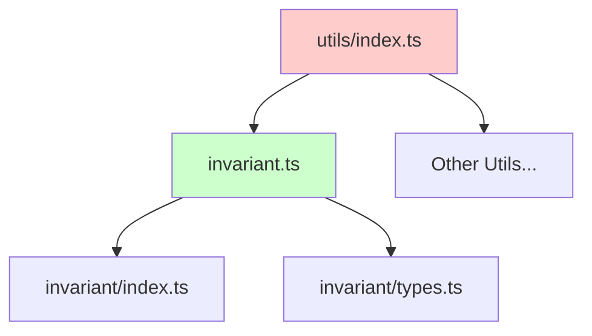

# Duplicate Export Fix Design

## Overview

The twenty-shared package is experiencing a build failure due to duplicate exports in the utils/index.ts barrel file. The error occurs because the `debug`, `log`, `warn`, and `error` functions are being exported twice - once directly from the invariant module and again as individual exports.

## Architecture

### Current State

The issue exists in the barrel export file `/packages/twenty-shared/src/utils/index.ts` where the following exports are duplicated:

```
Lines 25-32:
export {
  InvariantError,
  invariant,
  debug,      // ← First export
  log,        // ← First export
  warn,       // ← First export
  error,      // ← First export
  debug,      // ← Duplicate export
  log,        // ← Duplicate export
  warn,       // ← Duplicate export
  error,      // ← Duplicate export
  setVerbosity,
  getVerbosity,
} from './invariant';
```

### Error Context

The build system (Rollup via Preconstruct) detects this duplication and fails with:
- Error Type: `SyntaxError: Duplicate export 'debug'`
- Location: Line 20, Column 61 in utils/index.ts
- Build Tool: Preconstruct/Rollup
- Target: twenty-shared package

### Module Structure



## Issue Analysis

### Root Cause
The duplicate exports occurred due to manual editing of the auto-generated barrel file, where the same exports were listed twice in the export statement from the invariant module.

### Impact Assessment
- **Build System**: Complete build failure for twenty-shared package
- **Dependent Packages**: Cannot build packages that depend on twenty-shared
- **Development**: Blocks local development and CI/CD pipelines
- **Production**: Prevents deployment of updates

### TypeScript/JavaScript Module System
The ES6 module system prohibits duplicate named exports from the same module, which is enforced by bundlers like Rollup during the build process.

## Solution Implementation

### Fix Strategy
Remove the individual exports of logging functions from the invariant module while keeping the namespace exports. The namespace exports are actively used throughout the codebase and provide the same functionality, making the individual exports redundant.

### Code Changes

#### File: `/packages/twenty-shared/src/utils/invariant.ts`
**Root Cause Analysis:**
The invariant.ts file exports the same logging functions in two ways:
1. As namespace exports: `invariant.debug`, `invariant.log`, etc. (lines 105-110)
2. As individual exports: `debug`, `log`, etc. (lines 113-116)

The barrel generator detects both sets and creates duplicate exports in the index.ts file.

**Solution:**
Remove the individual exports (lines 113-116) since:
- Namespace exports are actively used in the codebase
- Individual exports are marked as "for barrel compatibility" but cause conflicts
- Namespace exports provide better organization and avoid naming conflicts

**Before (Lines 113-116):**
```typescript
// Individual exports for barrel compatibility
export const debug = wrapConsoleMethod("debug");
export const log = wrapConsoleMethod("log");
export const warn = wrapConsoleMethod("warn");
export const error = wrapConsoleMethod("error");
```

**After:**
```typescript
// Individual exports removed - use namespace exports instead
// Available as: invariant.debug, invariant.log, invariant.warn, invariant.error
```

### Impact Analysis
- **Namespace Exports**: Continue to work as `invariant.debug()`, etc.
- **Individual Exports**: Will no longer be available as standalone functions
- **Breaking Change**: Minimal - most usage is through namespace
- **Build System**: Resolves Rollup/Preconstruct duplicate export error

## Testing Strategy

### Unit Testing Approach
1. **Build Verification**: Ensure `npx nx build twenty-shared` completes successfully
2. **Export Validation**: Verify all intended exports are available and properly typed
3. **Import Testing**: Test imports in dependent packages work correctly
4. **Regression Testing**: Ensure no other exports are accidentally removed

### Validation Steps
```bash
# 1. Clean build test
npx nx build twenty-shared

# 2. Import verification
import { debug, log, warn, error } from 'twenty-shared/utils'

# 3. Function availability test
console.log(typeof debug === 'function')
console.log(typeof log === 'function') 
console.log(typeof warn === 'function')
console.log(typeof error === 'function')
```

## Implementation Steps

### Step 1: Fix Source File
Edit `/packages/twenty-shared/src/utils/invariant.ts` to remove lines 113-116:

```typescript
// Remove these lines:
// Individual exports for barrel compatibility
export const debug = wrapConsoleMethod("debug");
export const log = wrapConsoleMethod("log");
export const warn = wrapConsoleMethod("warn");
export const error = wrapConsoleMethod("error");
```

### Step 2: Regenerate Barrel Files
Run the barrel generation script to update the auto-generated index files:

```bash
npx nx run twenty-shared:generateBarrels
```

### Step 3: Verify Build
Test that the build now completes successfully:

```bash
npx nx build twenty-shared
```

## Migration Guide

### For Existing Code Using Individual Exports
If any code was importing individual logging functions (which our analysis shows none currently do), they would need to be updated:

**Before:**
```typescript
import { debug, log, warn, error } from 'twenty-shared/utils';

debug('Debug message');
log('Log message');
```

**After:**
```typescript
import { invariant } from 'twenty-shared/utils';

invariant.debug('Debug message');
invariant.log('Log message');
```

### Verification Commands
After implementing the fix, verify everything works:

```bash
# 1. Clean and rebuild
npx nx clean twenty-shared
npx nx build twenty-shared

# 2. Run tests to ensure no regressions
npx nx test twenty-shared

# 3. Test dependent packages
npx nx build twenty-server
npx nx build twenty-front
```

### Expected Results
- Build completes without errors
- All logging functions are available for import
- Type definitions work correctly
- No regression in dependent packages