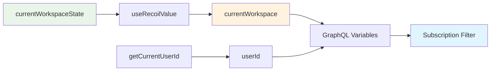

# Fix Missing Hook Import Design

## Overview

The Twenty frontend application has a TypeScript compilation error in the AI module due to a missing import. The `useBusinessSetupSubscriptions.ts` file is attempting to import a non-existent `useCurrentWorkspace` hook, causing the build to fail.

## Technology Stack & Dependencies

- **Frontend Framework**: React with TypeScript
- **State Management**: Recoil for workspace state management
- **Build System**: Vite with TypeScript checking
- **Code Organization**: Monorepo structure with Nx

## Architecture

### Current Issue

The file `packages/twenty-front/src/modules/ai/hooks/useBusinessSetupSubscriptions.ts` contains an invalid import:

```typescript
import { useCurrentWorkspace } from '~/auth/hooks/useCurrentWorkspace';
```

This hook does not exist in the codebase, causing TypeScript compilation failure.

### Correct Pattern Analysis

Throughout the Twenty codebase, workspace data is accessed using the Recoil state pattern:

```typescript
import { currentWorkspaceState } from '@/auth/states/currentWorkspaceState';
import { useRecoilValue } from 'recoil';

const currentWorkspace = useRecoilValue(currentWorkspaceState);
```

## Component Architecture

### Import Structure Correction

```mermaid
graph TD
    A[useBusinessSetupSubscriptions.ts] --> B[useRecoilValue]
    A --> C[currentWorkspaceState]
    B --> D[Recoil Library]
    C --> E[@/auth/states/currentWorkspaceState]
    
    style A fill:#e1f5fe
    style B fill:#f3e5f5
    style C fill:#fff3e0
```

### State Access Pattern

The corrected implementation follows the established architectural pattern:

| Component | Import Pattern | Usage Pattern |
|-----------|---------------|---------------|
| State Import | `import { currentWorkspaceState } from '@/auth/states/currentWorkspaceState'` | Standard relative import |
| Hook Import | `import { useRecoilValue } from 'recoil'` | Recoil state management |
| Usage | `const currentWorkspace = useRecoilValue(currentWorkspaceState)` | Direct state access |

## API Integration Layer

### Current Implementation Context

The `useBusinessSetupSubscriptions` hooks use workspace data for:

- **GraphQL Subscriptions**: Filtering events by workspace ID
- **User Context**: Combining with user ID for authentication
- **Event Processing**: Workspace-specific event handling

### Data Flow Architecture



## Testing Strategy

### Unit Testing Requirements

- **Import Validation**: Ensure correct import paths resolve
- **State Access**: Verify workspace state is properly accessed
- **Hook Functionality**: Maintain existing subscription behavior
- **Type Safety**: Confirm TypeScript compilation success

### Integration Testing

- **Subscription Flow**: Verify GraphQL subscriptions receive correct workspace context
- **Event Filtering**: Ensure events are properly filtered by workspace
- **Error Handling**: Maintain existing error handling patterns

## State Management

### Recoil Pattern Consistency

The fix aligns with the established Recoil patterns used throughout the application:

```typescript
// Consistent with existing patterns in:
// - SettingsWorkspace.tsx
// - SettingsDomain.tsx
// - useSubscriptionStatus.ts
// - useIsWorkspaceActivationStatusEqualsTo.ts
```

### Workspace State Structure

The `currentWorkspaceState` provides:
- **Workspace ID**: For GraphQL subscription filtering
- **Domain Information**: Subdomain and custom domain data  
- **Feature Flags**: Workspace-specific feature enablement
- **Billing Information**: Subscription status and billing details

## Routing & Navigation

No routing changes required. This is purely a state access pattern correction.

## Styling Strategy

No styling changes required. This fix addresses only the import and state access pattern.