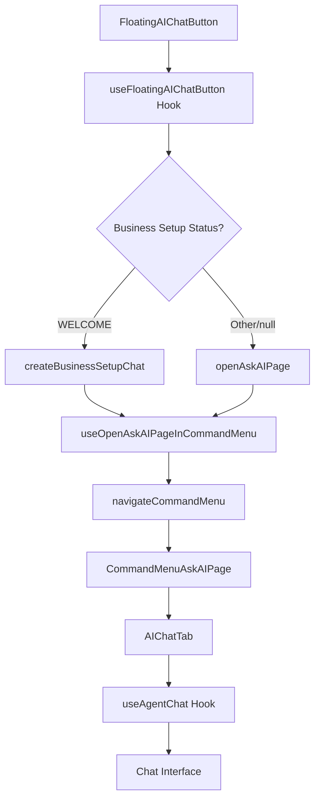
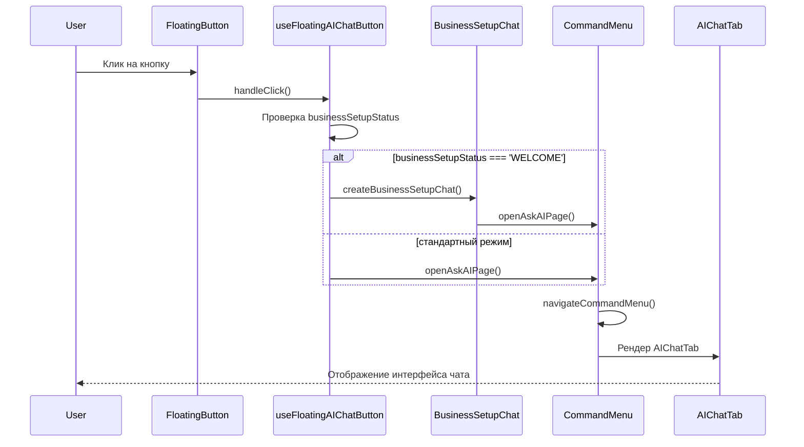
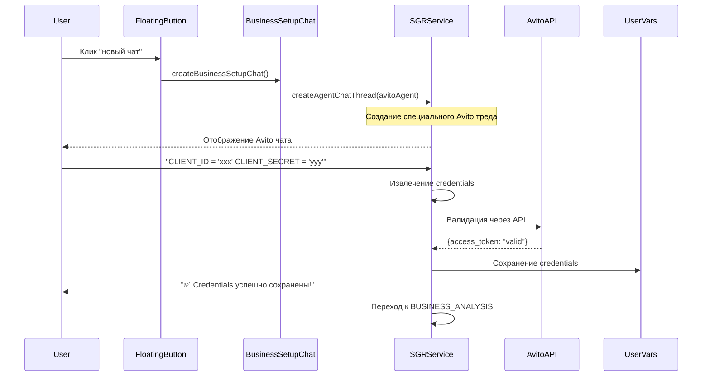

# Анализ Floating AI Chat Button: Полный поток выполнения при нажатии "новый чат"

## Обзор системы

Twenty CRM включает в себя плавающую кнопку AI чата (`FloatingAIChatButton`), расположенную в правом нижнем углу экрана. Эта кнопка предоставляет быстрый доступ к AI функциональности из любой страницы приложения.

## Архитектура компонентов

### Основные компоненты



### Структура файлов

```
packages/twenty-front/src/modules/
├── ai/
│   ├── components/
│   │   ├── FloatingAIChatButton/
│   │   │   ├── FloatingAIChatButton.tsx
│   │   │   ├── FloatingAIChatButton.styles.ts
│   │   │   └── README.md
│   │   └── AIChatTab.tsx
│   ├── hooks/
│   │   └── useFloatingAIChatButton.ts
│   └── states/
│       └── isFloatingAIChatButtonVisibleState.ts
├── business-setup/
│   └── hooks/
│       └── useBusinessSetupAgentChat.ts
└── command-menu/
    ├── hooks/
    │   ├── useOpenAskAIPageInCommandMenu.ts
    │   └── useCommandMenu.ts
    └── pages/
        └── ask-ai/
            └── components/
                └── CommandMenuAskAIPage.tsx
```

## Детальный анализ выполнения

### 1. Инициализация кнопки

**Файл:** `FloatingAIChatButton.tsx`

Кнопка отображается только при соблюдении условий:
- ✅ AI функция включена (`FeatureFlagKey.IS_AI_ENABLED`)
- ✅ Кнопка видима (`isFloatingAIChatButtonVisibleState = true`)
- ✅ AI чат не открыт в данный момент

```typescript
const isVisible = isVisible && isAiEnabled && !isAIChatOpen;
```

### 2. Обработка клика

**Файл:** `useFloatingAIChatButton.ts`

При нажатии на кнопку выполняется логика:

```typescript
const handleClick = () => {
  console.log('Floating AI chat button clicked with businessSetupStatus:', businessSetupStatus);
  
  // Проверка режима Business Setup
  if (businessSetupStatus === 'WELCOME') {
    console.log('Creating business setup chat for WELCOME status');
    createBusinessSetupChat();
  } else {
    console.log('Opening standard AI page');
    openAskAIPage();
  }
};
```

### 3. Условная логика выбора чата

#### 3.1 Business Setup режим (статус = 'WELCOME')

**Файл:** `useBusinessSetupAgentChat.ts`

Если пользователь находится в режиме настройки бизнеса:

```typescript
const createBusinessSetupChat = () => {
  const currentStep = businessSetupStatus || 'WELCOME';
  
  console.log('Creating business setup chat with step:', currentStep);
  console.log('Opening empty chat interface - no pre-filled messages');
  
  // Открывается пустой чат без предзаполненных сообщений
  // Пользователь может ввести свое сообщение для запуска AI ответа
  openAskAIPage();
};
```

#### 3.2 Стандартный режим

Прямой вызов `openAskAIPage()` без дополнительной логики.

### 4. Навигация к AI странице

**Файл:** `useOpenAskAIPageInCommandMenu.ts`

```typescript
const openAskAIPage = (pageTitle?: string | null) => {
  navigateCommandMenu({
    page: CommandMenuPages.AskAI,
    pageTitle: pageTitle ?? t`Ask AI`,
    pageIcon: IconSparkles,
    pageId: v4(),
  });
};
```

Функция навигации:
- 📄 Устанавливает страницу: `CommandMenuPages.AskAI`
- 🏷️ Заголовок: "Ask AI" (локализуемый)
- ⭐ Иконка: `IconSparkles`
- 🆔 Уникальный ID страницы: `v4()`

### 5. Командное меню навигация

**Файл:** `useNavigateCommandMenu.ts`

```typescript
const navigateCommandMenu = ({
  page,
  pageTitle,
  pageIcon,
  pageIconColor,
  pageId,
  resetNavigationStack = false,
}) => {
  const computedPageId = pageId || v4();

  // Открытие командного меню
  openCommandMenu();
  
  // Установка состояния страницы
  set(commandMenuPageState, page);
  set(commandMenuPageInfoState, {
    title: pageTitle,
    Icon: pageIcon,
    instanceId: computedPageId,
  });

  // Управление стеком навигации
  if (resetNavigationStack) {
    set(commandMenuNavigationStackState, [/* новый стек */]);
  } else {
    set(commandMenuNavigationStackState, [...currentStack, newPage]);
  }
};
```

### 6. Отображение AI чата

**Файл:** `CommandMenuAskAIPage.tsx`

```typescript
export const CommandMenuAskAIPage = () => {
  const currentWorkspace = useRecoilValue(currentWorkspaceState);
  const agentId = currentWorkspace?.defaultAgent?.id;

  if (!agentId) {
    return <StyledEmptyState>No AI Agent found.</StyledEmptyState>;
  }

  return (
    <StyledContainer>
      <AIChatTab agentId={agentId} />
    </StyledContainer>
  );
};
```

### 7. Основной интерфейс чата

**Файл:** `AIChatTab.tsx`

Компонент предоставляет полнофункциональный интерфейс чата:

#### 7.1 Провайдеры контекста

```typescript
<AgentChatMessagesComponentInstanceContext.Provider value={{ instanceId: agentId }}>
  <IsAgentChatCurrentContextActiveInstanceContext.Provider value={{ instanceId: agentId }}>
    <AIChatTabInternal agentId={agentId} />
  </IsAgentChatCurrentContextActiveInstanceContext.Provider>
</AgentChatMessagesComponentInstanceContext.Provider>
```

#### 7.2 Основные возможности

- 💬 **Сообщения**: Отображение истории диалога
- ⌨️ **Ввод текста**: `TextArea` для новых сообщений
- 📎 **Загрузка файлов**: `AgentChatFileUploadButton`
- 📋 **Контекст записей**: `SendMessageWithRecordsContextButton`
- 🔄 **Новый чат**: Кнопка создания нового треда
- 📚 **История**: Просмотр предыдущих чатов
- 🔄 **SGR Events**: Обработка Schema-Guided Reasoning событий

#### 7.3 Состояния интерфейса

- **Пустое состояние**: `AIChatEmptyState` когда нет сообщений
- **Загрузка**: `AIChatSkeletonLoader` во время загрузки
- **SGR прогресс**: Индикатор анализа и выполнения инструментов
- **Перетаскивание файлов**: `isDraggingFile` режим

## Состояния и хуки

### Основные состояния Recoil

```typescript
// Видимость кнопки
isFloatingAIChatButtonVisibleState: atom<boolean>

// Состояние командного меню
isCommandMenuOpenedState: atom<boolean>
commandMenuPageState: atom<CommandMenuPages>

// Текущий тред чата
currentAIChatThreadComponentState: atomFamily<string | null, string>
```

### Основные хуки

#### useFloatingAIChatButton

```typescript
const {
  isVisible: boolean,           // Должна ли кнопка отображаться
  handleClick: () => void,      // Обработчик клика
  businessSetupStatus: string   // Статус настройки бизнеса
} = useFloatingAIChatButton();
```

#### useAgentChat

```typescript
const {
  messages: AgentChatMessage[],     // Список сообщений
  isLoading: boolean,               // Состояние загрузки
  input: string,                    // Текущий ввод
  handleInputChange: (value) => void, // Обработчик изменения ввода
  agentStreamingMessage: string,    // Потоковое сообщение от AI
  scrollWrapperId: string,          // ID для скроллинга
  currentThreadId: string           // Текущий ID треда
} = useAgentChat(agentId);
```

## Поток данных и события

### 1. Клик на кнопку



### 2. Business Setup события

При создании Business Setup чата на backend генерируются события:

```typescript
// События сервера
BUSINESS_SETUP_EVENTS = {
  AI_AGENT_WELCOME_CHAT_CREATION_STARTED: 'ai-agent.welcome.chat-creation-started',
  AI_AGENT_WELCOME_CHAT_CREATED: 'ai-agent.welcome.chat-created',
  AI_AGENT_WELCOME_CHAT_CREATION_FAILED: 'ai-agent.welcome.chat-creation-failed'
};
```

### 3. SGR (Schema-Guided Reasoning) обработка

AI чат поддерживает продвинутую обработку:

```typescript
// SGR события
const sgrEvents = [
  'sgr.thinking',      // AI анализирует
  'sgr.tool_execution', // Выполнение инструментов
  'sgr.response'       // Генерация ответа
];
```

## Интеграция с системой

### Горячие клавиши

Кнопка интегрирована с системой горячих клавиш:

```typescript
useGlobalHotkeys({
  keys: ['@'],
  callback: () => {
    if (isAiEnabled) {
      openAskAIPage();
    }
  },
  containsModifier: false,
  dependencies: [openAskAIPage, isAiEnabled],
});
```

### Навигация

Доступ к AI чату также возможен через:
- 📱 Главная навигация: "Ask AI" пункт меню
- ⌨️ Горячая клавиша: `@`
- 🔄 Меню действий: Глобальные действия

### Feature Flags

Функциональность контролируется флагом:

```typescript
const isAiEnabled = useIsFeatureEnabled(FeatureFlagKey.IS_AI_ENABLED);
```

## Пользовательский опыт

### Адаптивность

Кнопка адаптируется к размеру экрана:

```typescript
const buttonSize = isMobile ? 'small' : 'medium';
```

### Анимации

- 🎭 **Появление**: fade-in + scale-up анимация
- 🎯 **Hover**: плавное изменение фона
- 💫 **Tooltip**: slide-up с информацией
- 🔄 **Loading**: спиннер во время обработки

### Всплывающие сообщения

При Business Setup режиме:

```typescript
{showPopup && welcomeMessage && (
  <StyledWelcomePopup>
    <StyledPopupHeader>🤖 AI Assistant</StyledPopupHeader>
    <StyledPopupContent>
      <ReactMarkdown>{welcomeMessage}</ReactMarkdown>
    </StyledPopupContent>
    <StyledPopupActions>
      <button onClick={continueChat}>Continue Chat</button>
      <button onClick={() => setShowPopup(false)}>Dismiss</button>
    </StyledPopupActions>
  </StyledWelcomePopup>
)}
```

## Обработка ошибок

### Error Boundary

Компонент обернут в `AIErrorBoundary`:

```typescript
<AIErrorBoundary
  fallback={
    <div style={{ /* стили ошибки */ }}>
      AI Assistant temporarily unavailable
    </div>
  }
>
  <FloatingAIChatButtonContent />
</AIErrorBoundary>
```

### Состояния ошибок

- 🚫 **Нет агента**: "No AI Agent found"
- ⚠️ **Ошибка подключения**: SGR connection error
- 🔄 **Таймаут**: Chat creation timeout

## Производительность

### Ленивая загрузка

```typescript
// Markdown рендерер загружается по требованию
export { LazyMarkdownRenderer } from './LazyMarkdownRenderer';
```

### Мемоизация

Использует `memo` для предотвращения лишних рендеров:

```typescript
const ExpensiveComponent = memo(({ data }) => {
  // Сложная логика рендеринга
});
```

### Дебаунсинг

Ввод текста дебаунсится для оптимизации:

```typescript
const debouncedInput = useDebounce(input, 300);
```

## Безопасность и права доступа

### Проверка прав

```typescript
// Проверка включения AI функции
const isAiEnabled = useIsFeatureEnabled(FeatureFlagKey.IS_AI_ENABLED);

// Проверка рабочего пространства
const currentWorkspace = useRecoilValue(currentWorkspaceState);
const agentId = currentWorkspace?.defaultAgent?.id;
```

### Валидация данных

- ✅ Проверка существования агента
- ✅ Валидация ID треда
- ✅ Санитизация пользовательского ввода

## Интернационализация

Поддерживаются локализации для:

```typescript
// Основные тексты
t`Ask AI`                    // Заголовок
t`Enter a question...`       // Placeholder ввода
t`View Previous AI Chats`    // История чатов
t`Continue Business Setup`   // Business Setup режим
```

Доступные языки:
- 🇺🇸 English (en)
- 🇨🇳 Chinese Simplified (zh-CN)
- 🇹🇼 Chinese Traditional (zh-TW)
- 🇵🇱 Polish (pl-PL)
- 🇪🇸 Catalan (ca-ES)
- 🇹🇷 Turkish (tr-TR)
- И другие...

## Тестирование

### Unit тесты

```typescript
describe('FloatingAIChatButton', () => {
  it('should render when AI is enabled', () => {
    render(<FloatingAIChatButton />);
    expect(screen.getByTestId('floating-ai-chat-button')).toBeInTheDocument();
  });

  it('should open AI chat when clicked', () => {
    const mockOpenAskAIPage = jest.fn();
    // ... тест логики
  });
});
```

### E2E тесты

```typescript
test('Floating AI Chat Button functionality', async ({ page }) => {
  await page.goto('/');
  
  const floatingButton = page.locator('[data-testid="floating-ai-chat-button"]');
  await expect(floatingButton).toBeVisible();
  
  await floatingButton.click();
  await expect(page.locator('[data-testid="ai-chat-tab"]')).toBeVisible();
});
```

## План реализации SGR Avito агента

### Этап 1: Подготовка Frontend компонентов

#### 1.1 Модификация useBusinessSetupAgentChat
**Файл:** `packages/twenty-front/src/modules/business-setup/hooks/useBusinessSetupAgentChat.ts`

```typescript
import { useRecoilValue } from 'recoil';
import { currentWorkspaceState } from '@/auth/states/currentWorkspaceState';
import { useCreateNewAIChatThread } from '@/ai/hooks/useCreateNewAIChatThread';
import { useOpenAskAIPageInCommandMenu } from '@/command-menu/hooks/useOpenAskAIPageInCommandMenu';
import { useBusinessSetupStatus } from './useBusinessSetupStatus';

export const useBusinessSetupAgentChat = () => {
  const businessSetupStatus = useBusinessSetupStatus();
  const { openAskAIPage } = useOpenAskAIPageInCommandMenu();
  const currentWorkspace = useRecoilValue(currentWorkspaceState);
  
  const createBusinessSetupChat = async () => {
    const currentStep = businessSetupStatus || 'WELCOME';
    
    console.log('Creating SGR Avito chat with step:', currentStep);
    
    try {
      // Получаем или создаем Avito агента
      const avitoAgentId = await getOrCreateAvitoAgent(currentWorkspace?.id);
      
      // Создаем хук для создания треда с Avito агентом
      const { createAgentChatThread } = useCreateNewAIChatThread({ 
        agentId: avitoAgentId
      });
      
      // Создаем новый тред с business setup контекстом
      await createAgentChatThread();
      
      // Открываем чат с созданным тредом
      openAskAIPage('🚀 Настройка интеграции Avito');
      
    } catch (error) {
      console.error('Failed to create SGR Avito chat:', error);
      // Fallback к стандартному чату
      openAskAIPage();
    }
  };

  return { createBusinessSetupChat };
};

// Вспомогательная функция для получения Avito агента
async function getOrCreateAvitoAgent(workspaceId: string): Promise<string> {
  // Вызов GraphQL мутации для получения/создания Avito агента
  const response = await fetch('/graphql', {
    method: 'POST',
    headers: { 'Content-Type': 'application/json' },
    body: JSON.stringify({
      query: `
        mutation GetOrCreateAvitoAgent($workspaceId: String!) {
          getOrCreateAvitoAgent(workspaceId: $workspaceId) {
            id
            name
            modelId
          }
        }
      `,
      variables: { workspaceId }
    })
  });
  
  const result = await response.json();
  return result.data.getOrCreateAvitoAgent.id;
}
```

#### 1.2 Расширение useCreateNewAIChatThread
**Файл:** `packages/twenty-front/src/modules/ai/hooks/useCreateNewAIChatThread.ts`

```typescript
export const useCreateNewAIChatThread = ({ agentId }: { agentId: string }) => {
  const [, setCurrentThreadId] = useRecoilComponentState(
    currentAIChatThreadComponentState,
    agentId,
  );
  const { openAskAIPage } = useOpenAskAIPageInCommandMenu();
  const businessSetupStatus = useBusinessSetupStatus();
  
  // Подготавливаем переменные мутации с business setup контекстом
  const mutationVariables = {
    input: {
      agentId,
      // Включаем businessSetupStep если пользователь в business setup потоке
      ...(businessSetupStatus && businessSetupStatus !== 'COMPLETED' && {
        businessSetupStep: businessSetupStatus,
      }),
    },
  };
  
  const [createAgentChatThread] = useCreateAgentChatThreadMutation({
    variables: mutationVariables,
    onCompleted: (data) => {
      setCurrentThreadId(data.createAgentChatThread.id);
      // Не открываем автоматически - пусть вызывающий код решает
    },
    onError: (error) => {
      console.error('Failed to create agent chat thread:', error);
      throw error;
    }
  });

  return { createAgentChatThread };
};
```

### Этап 2: Backend GraphQL мутации

#### 2.1 Создание GraphQL резолвера
**Файл:** `packages/twenty-server/src/engine/core-modules/business-setup/resolvers/business-setup-agent.resolver.ts`

```typescript
import { Resolver, Mutation, Args } from '@nestjs/graphql';
import { UseGuards } from '@nestjs/common';
import { AuthUser } from '@/auth/decorators/auth-user.decorator';
import { AuthWorkspace } from '@/auth/decorators/auth-workspace.decorator';
import { JwtAuthGuard } from '@/auth/guards/jwt-auth.guard';
import { User } from '@/user/user.entity';
import { Workspace } from '@/workspace/workspace.entity';
import { BusinessSetupWelcomeAgentService } from '../services/business-setup-welcome-agent.service';

@Resolver()
@UseGuards(JwtAuthGuard)
export class BusinessSetupAgentResolver {
  constructor(
    private readonly businessSetupWelcomeAgentService: BusinessSetupWelcomeAgentService,
  ) {}

  @Mutation(() => AgentEntity)
  async getOrCreateAvitoAgent(
    @AuthUser() user: User,
    @AuthWorkspace() workspace: Workspace,
    @Args('workspaceId') workspaceId: string,
  ): Promise<AgentEntity> {
    // Проверяем права доступа
    if (workspace.id !== workspaceId) {
      throw new Error('Access denied to workspace');
    }

    return await this.businessSetupWelcomeAgentService.getOrCreateAvitoAgent(
      workspaceId
    );
  }
}
```

#### 2.2 Расширение AgentChatService
**Файл:** `packages/twenty-server/src/engine/metadata-modules/agent/agent-chat.service.ts`

```typescript
// Добавить метод для создания треда с business setup контекстом
async createThreadWithBusinessSetupContext(
  agentId: string,
  userWorkspaceId: string,
  businessSetupStep?: BusinessSetupStatus,
): Promise<AgentChatThreadEntity> {
  let effectiveAgentId = agentId;
  let isBusinessSetupAgent = false;

  // Если указан business setup step, используем соответствующий агент
  if (businessSetupStep) {
    try {
      const businessSetupAgent = await this.businessSetupAgentService.getAgentForStep(
        businessSetupStep,
        userWorkspaceId,
      );
      effectiveAgentId = businessSetupAgent.id;
      isBusinessSetupAgent = true;
    } catch (error) {
      console.warn(`Failed to get business setup agent for step ${businessSetupStep}:`, error);
    }
  }

  const thread = this.threadRepository.create({
    agentId: effectiveAgentId,
    userWorkspaceId,
  });

  const savedThread = await this.threadRepository.save(thread);

  // Если это business setup агент, отправляем welcome сообщение
  if (isBusinessSetupAgent && businessSetupStep) {
    await this.sendWelcomeMessage(savedThread.id, businessSetupStep);
  }

  return savedThread;
}
```

### Этап 3: SGR интеграция

#### 3.1 Модификация BusinessSetupWelcomeAgentService
**Файл:** `packages/twenty-server/src/engine/core-modules/business-setup/services/business-setup-welcome-agent.service.ts`

```typescript
// Публичный метод для получения/создания Avito агента
public async getOrCreateAvitoAgent(workspaceId: string): Promise<AgentEntity> {
  return await this.getAvitoAgent(workspaceId);
}

// Метод обработки сообщений пользователя с SGR
public async processUserMessage(
  threadId: string,
  message: string,
  workspaceId: string,
  userId: string,
): Promise<void> {
  this.logger.log(`Processing user message in thread ${threadId}`);

  try {
    // Проверяем, является ли тред business setup тредом
    const thread = await this.agentChatService.findThreadById(threadId);
    if (!thread || !await this.isBusinessSetupThread(thread.agentId, workspaceId)) {
      throw new Error('Not a business setup thread');
    }

    // Запускаем SGR обработку
    await this.avitoWelcomeSGRService.processWelcomeMessage(
      message,
      userId,
      workspaceId,
      threadId
    );

  } catch (error) {
    this.logger.error('Failed to process user message:', error);
    // Fallback к стандартной обработке
    await this.handleFallbackProcessing(threadId, message, workspaceId, userId);
  }
}

// Проверка, является ли агент business setup агентом
private async isBusinessSetupThread(agentId: string, workspaceId: string): Promise<boolean> {
  const agent = await this.agentRepository.findOne({
    where: { id: agentId, workspaceId }
  });
  
  return agent?.name === 'Avito Agent' || agent?.name?.includes('business-setup');
}
```

### Этап 4: Интеграция с существующим чатом

#### 4.1 Модификация AIChatTab
**Файл:** `packages/twenty-front/src/modules/ai/components/AIChatTab.tsx`

```typescript
// Добавить обработку business setup сообщений
const { messages, sendMessage } = useAgentChat(agentId);
const businessSetupStatus = useBusinessSetupStatus();

// Обработчик отправки сообщений с учетом business setup контекста
const handleSendMessage = async (content: string) => {
  try {
    if (businessSetupStatus === 'WELCOME' && isAvitoAgent(agentId)) {
      // Отправляем сообщение через business setup сервис
      await sendBusinessSetupMessage({
        threadId: currentThreadId,
        message: content,
        workspaceId: currentWorkspace?.id,
        userId: currentUser?.id
      });
    } else {
      // Стандартная отправка сообщения
      await sendMessage(content);
    }
  } catch (error) {
    console.error('Failed to send message:', error);
    // Показать ошибку пользователю
  }
};
```

### Этап 5: Тестирование

#### 5.1 Unit тесты
```typescript
// packages/twenty-front/src/modules/business-setup/hooks/__tests__/useBusinessSetupAgentChat.test.ts
describe('useBusinessSetupAgentChat', () => {
  it('should create SGR Avito chat thread', async () => {
    const { result } = renderHook(() => useBusinessSetupAgentChat());
    
    await act(async () => {
      await result.current.createBusinessSetupChat();
    });
    
    expect(mockCreateAgentChatThread).toHaveBeenCalledWith(
      expect.objectContaining({
        agentId: 'avito-agent-id',
        businessSetupStep: 'WELCOME'
      })
    );
  });
});
```

#### 5.2 Integration тесты
```typescript
// packages/twenty-server/src/engine/core-modules/business-setup/__tests__/sgr-avito-integration.spec.ts
describe('SGR Avito Integration', () => {
  it('should process credentials and validate with Avito API', async () => {
    const message = "CLIENT_ID = 'test123' CLIENT_SECRET = 'secret456'";
    
    await businessSetupService.processUserMessage(
      threadId,
      message,
      workspaceId,
      userId
    );
    
    expect(mockAvitoApi.validateCredentials).toHaveBeenCalled();
    expect(mockUserVarsService.set).toHaveBeenCalledWith({
      key: 'AVITO_CLIENT_ID',
      value: 'test123'
    });
  });
});
```

## Решение: Прямой чат с SGR Avito агентом

Для создания прямого чата с SGR Avito агентом нужно модифицировать функцию `createBusinessSetupChat`:

### Текущая реализация

```typescript
const createBusinessSetupChat = () => {
  const currentStep = businessSetupStatus || 'WELCOME';
  
  console.log('Creating business setup chat with step:', currentStep);
  console.log('Opening empty chat interface - no pre-filled messages');
  
  // Открывается пустой чат без предзаполненных сообщений
  // Пользователь может ввести свое сообщение для запуска AI ответа
  openAskAIPage();
};
```

### Предлагаемое решение

```typescript
const createBusinessSetupChat = async () => {
  const currentStep = businessSetupStatus || 'WELCOME';
  
  console.log('Creating business setup chat with step:', currentStep);
  console.log('Creating direct chat with SGR Avito agent');
  
  try {
    // Создаем новый тред чата с бизнес-setup контекстом
    const { createAgentChatThread } = useCreateNewAIChatThread({ 
      agentId: currentWorkspace?.avitoAgent?.id || 'avito-agent-fallback'
    });
    
    // Создаем тред с указанием business setup контекста
    await createAgentChatThread({
      businessSetupStep: currentStep,
      agentType: 'avito-sgr'
    });
    
    // Открываем страницу AI чата (она автоматически загрузит новый тред)
    openAskAIPage('🚀 Настройка интеграции Avito');
    
  } catch (error) {
    console.error('Failed to create SGR Avito chat:', error);
    // Fallback к стандартному чату
    openAskAIPage();
  }
};
```

### Архитектура SGR Avito агента

#### Серверная часть (Backend)

SGR Avito агент реализован на сервере через:

1. **`AvitoWelcomeSGRService`** - Основной сервис Schema-Guided Reasoning
2. **`BusinessSetupWelcomeAgentService`** - Сервис управления welcome агентом
3. **`BusinessSetupAgentService`** - Сервис получения агентов для этапов

```typescript
// Создание Avito агента автоматически
export class BusinessSetupWelcomeAgentService {
  private async getAvitoAgent(workspaceId: string): Promise<AgentEntity> {
    let avitoAgent = await this.agentRepository.findOne({
      where: { 
        name: 'Avito Agent',
        workspaceId 
      }
    });

    if (!avitoAgent) {
      // Создает специализированного Avito агента с Gemini моделью
      avitoAgent = await this.agentRepository.save({
        name: 'Avito Agent',
        label: 'Avito Agent',
        description: 'Avito API integration and credentials management agent for Russian marketplace',
        prompt: 'Привет! Добро пожаловать в интеграцию Avito! Я - агент для подключения к Avito API. Помогу вам настроить интеграцию с российским маркетплейсом Avito, собрать и проверить ваши API учетные данные CLIENT_ID и CLIENT_SECRET. Готовы начать?',
        modelId: 'google/gemini-2.5-flash', // SGR требует Gemini
        workspaceId,
        isCustom: true,
      });
    }

    return avitoAgent;
  }
}
```

#### SGR Workflow

SGR система обрабатывает сообщения пользователя структурированно:

```typescript
// Основной поток SGR
export class AvitoWelcomeSGRService {
  async processWelcomeMessage(
    message: string,
    userId: string,
    workspaceId: string,
    threadId: string
  ): Promise<void> {
    const task = `
Пользователь отправил сообщение: "${message}"

Задача: Получить CLIENT_ID и CLIENT_SECRET для Avito API, проверить их валидность 
через https://api.avito.ru/token и сохранить для дальнейшего использования.

Если credentials найдены - проверь их. Если не найдены - запроси у пользователя.
Используй дружелюбный тон на русском языке.`;

    // Выполнение SGR с Gemini 2.5 Flash
    const sgrResult = await this.executeSGRWorkflow({
      task,
      userId,
      workspaceId,
      threadId,
      maxSteps: 5
    });
    
    // Обработка результата и отправка ответа
    await this.handleSGRResult(sgrResult, threadId);
  }
}
```

### Улучшенная интеграция на Frontend

Для полной интеграции нужно модифицировать несколько компонентов:

#### 1. useBusinessSetupAgentChat Hook

```typescript
export const useBusinessSetupAgentChat = () => {
  const businessSetupStatus = useBusinessSetupStatus();
  const { openAskAIPage } = useOpenAskAIPageInCommandMenu();
  const currentWorkspace = useRecoilValue(currentWorkspaceState);
  const { createAgentChatThread } = useCreateNewAIChatThread({ 
    agentId: currentWorkspace?.avitoAgent?.id || 'default-agent'
  });

  const createBusinessSetupChat = async () => {
    const currentStep = businessSetupStatus || 'WELCOME';
    
    console.log('Creating SGR Avito chat with step:', currentStep);
    
    try {
      // Создаем тред с business setup контекстом
      const thread = await createAgentChatThread({
        businessSetupStep: currentStep,
        agentType: 'avito-sgr'
      });
      
      // Открываем чат с созданным тредом
      openAskAIPage('🚀 Настройка интеграции Avito');
      
    } catch (error) {
      console.error('Failed to create SGR chat:', error);
      // Fallback
      openAskAIPage();
    }
  };

  return { createBusinessSetupChat };
};
```

#### 2. Модификация useCreateNewAIChatThread

```typescript
export const useCreateNewAIChatThread = ({ agentId }: { agentId: string }) => {
  const [, setCurrentThreadId] = useRecoilComponentState(
    currentAIChatThreadComponentState,
    agentId,
  );
  const { openAskAIPage } = useOpenAskAIPageInCommandMenu();
  const businessSetupStatus = useBusinessSetupStatus();
  
  const [createAgentChatThread] = useCreateAgentChatThreadMutation({
    variables: {
      input: {
        agentId,
        // Включаем business setup контекст
        ...(businessSetupStatus && businessSetupStatus !== 'COMPLETED' && {
          businessSetupStep: businessSetupStatus,
        }),
      },
    },
    onCompleted: (data) => {
      setCurrentThreadId(data.createAgentChatThread.id);
      // Автоматически не открываем - пусть вызывающий код решает
    },
  });

  return { createAgentChatThread };
};
```

### SGR Возможности

SGR Avito агент обладает продвинутыми возможностями:

#### 1. Извлечение учетных данных
- Поддержка множественных форматов
- Регулярные выражения и NLP анализ
- Валидация формата CLIENT_ID/CLIENT_SECRET

#### 2. Валидация через Avito API
- Реальные запросы к https://api.avito.ru/token
- Проверка валидности токена
- Обработка ошибок авторизации

#### 3. Безопасное хранение
- Использование UserVarsService
- Шифрование учетных данных
- Изоляция по пользователям и workspace

#### 4. Переходы между этапами
- Автоматический переход к BUSINESS_ANALYSIS
- Событийная система уведомлений
- Отслеживание прогресса

### Поток данных SGR



## Заключение

При нажатии на плавающую кнопку "новый чат" запускается сложная цепочка действий:

1. 🎯 **Проверка условий** отображения и доступности
2. 🔀 **Условная логика** в зависимости от режима (Business Setup vs стандартный)
3. 🚀 **Навигация** через командное меню
4. 💬 **Инициализация** полнофункционального чата
5. 🔗 **Интеграция** с AI агентами и SGR системой
6. 🎨 **Отображение** адаптивного интерфейса с анимациями

**Для создания прямого чата с SGR Avito агентом** нужно:
- Использовать `useCreateNewAIChatThread` с Avito агентом
- Передавать `businessSetupStep` контекст
- SGR система автоматически активируется на backend
- Пользователь получает специализированный Avito чат с русскоязычным интерфейсом

Система спроектирована с учетом производительности, доступности, интернационализации и обработки ошибок, предоставляя пользователям бесшовный опыт взаимодействия с AI функциональностью Twenty CRM.

## Как это будет работать

### Пользовательский сценарий

#### Шаг 1: Нажатие на плавающую кнопку
```
Пользователь -> Floating Button -> Business Setup Mode Detected
```

1. **Пользователь нажимает** на плавающую кнопку "новый чат"
2. **Система проверяет** `businessSetupStatus === 'WELCOME'`
3. **Активируется** `createBusinessSetupChat()` вместо обычного `openAskAIPage()`

#### Шаг 2: Создание специализированного чата
```
createBusinessSetupChat() -> getOrCreateAvitoAgent() -> createAgentChatThread()
```

1. **Frontend отправляет GraphQL запрос** для получения/создания Avito агента
2. **Backend создает/находит** специализированного Avito агента с Gemini 2.5 Flash моделью
3. **Создается новый тред чата** с business setup контекстом
4. **Открывается чат** с заголовком "🚀 Настройка интеграции Avito"

#### Шаг 3: Автоматическое welcome сообщение
```
Thread Created -> SGR Welcome Message -> Russian Interface
```

**Avito агент автоматически отправляет:**
```
Привет! 👋 Добро пожаловать в настройку интеграции с Avito!

Для подключения к Avito API мне нужны ваши уникальные учетные данные:

📋 Что мне нужно:
• CLIENT_ID - идентификатор вашего приложения
• CLIENT_SECRET - секретный ключ для аутентификации

🔍 Где найти:
1. Зайдите в Личный кабинет Avito
2. Перейдите в раздел "API и интеграции"
3. Скопируйте CLIENT_ID и CLIENT_SECRET

💬 Отправьте мне credentials в любом удобном формате:
• CLIENT_ID = 'ваш_id' CLIENT_SECRET = 'ваш_secret'
• Просто вставьте их из личного кабинета

Готовы начать? 🚀
```

### Техническая реализация

#### Frontend Flow
```typescript
// 1. Пользователь нажимает кнопку
handleClick() {
  if (businessSetupStatus === 'WELCOME') {
    createBusinessSetupChat(); // <- Новый путь
  } else {
    openAskAIPage(); // <- Стандартный путь
  }
}

// 2. Создание Avito чата
async createBusinessSetupChat() {
  // Получаем Avito агента
  const avitoAgent = await getOrCreateAvitoAgent(workspaceId);
  
  // Создаем тред с business setup контекстом
  const thread = await createAgentChatThread({
    agentId: avitoAgent.id,
    businessSetupStep: 'WELCOME'
  });
  
  // Открываем специализированный чат
  openAskAIPage('🚀 Настройка интеграции Avito');
}
```

#### Backend Flow
```typescript
// 1. GraphQL мутация создания треда
createAgentChatThread(input: {
  agentId: string,
  businessSetupStep?: 'WELCOME'
}) {
  // Создаем тред
  const thread = await agentChatService.createThread(agentId, userWorkspaceId);
  
  // Если business setup - отправляем welcome сообщение
  if (input.businessSetupStep === 'WELCOME') {
    await sendAvitoWelcomeMessage(thread.id);
  }
  
  return thread;
}

// 2. Обработка сообщений пользователя через SGR
processUserMessage(threadId, message, workspaceId, userId) {
  // Запускаем SGR workflow
  await avitoWelcomeSGRService.processWelcomeMessage(
    message, userId, workspaceId, threadId
  );
}
```

### SGR Workflow в действии

#### Сценарий: Пользователь отправляет credentials

**Пользователь пишет:**
```
Привет! Вот мои данные:
CLIENT_ID = 'R3cTDMk9rEJ2lh5A9_QF'
CLIENT_SECRET = 'ehAWb-RBQrLmgoJWfgtst737eQV6KIBHzmV1NmIc'
```

**SGR обработка (за кулисами):**

1. **Структурированный анализ (Gemini 2.5 Flash):**
```json
{
  "current_state": "Пользователь предоставил CLIENT_ID и CLIENT_SECRET",
  "plan_remaining_steps": [
    "Извлечь credentials из сообщения",
    "Валидировать через Avito API",
    "Сохранить если валидны"
  ],
  "task_completed": false,
  "function": {
    "tool": "extract_credentials",
    "message": "CLIENT_ID = 'R3cTDMk9rEJ2lh5A9_QF'..."
  }
}
```

2. **Извлечение credentials:**
```typescript
// SGR вызывает инструмент
const result = await toolDispatcher.extractCredentials({
  message: userMessage,
  extractionMethod: 'regex'
});
// Результат: { clientId: 'R3cTDMk9rEJ2lh5A9_QF', clientSecret: 'ehAWb...', success: true }
```

3. **Валидация через Avito API:**
```typescript
// SGR вызывает следующий инструмент
const validation = await toolDispatcher.validateAvitoToken({
  clientId: 'R3cTDMk9rEJ2lh5A9_QF',
  clientSecret: 'ehAWb-RBQrLmgoJWfgtst737eQV6KIBHzmV1NmIc'
});
// HTTP запрос к https://api.avito.ru/token
// Результат: { access_token: 'xyz123...', expires_in: 86400, success: true }
```

4. **Сохранение credentials:**
```typescript
// SGR сохраняет данные
await toolDispatcher.storeCredentials({
  clientId: 'R3cTDMk9rEJ2lh5A9_QF',
  clientSecret: 'ehAWb-RBQrLmgoJWfgtst737eQV6KIBHzmV1NmIc',
  accessToken: 'xyz123...'
});
```

**Пользователь получает:**
```
✅ Отлично! Ваши credentials успешно проверены и сохранены!

🔗 Подключение к Avito API:
• CLIENT_ID: R3cT****9_QF (скрыт для безопасности)
• Токен доступа получен и действителен 24 часа
• Статус интеграции: Активна ✅

🚀 Теперь переходим к анализу вашего бизнеса!
Я помогу вам настроить автоматизацию для работы с Avito.

Расскажите о вашем бизнесе - что вы продаете на Avito?
```

5. **Автоматический переход:**
```typescript
// SGR завершает WELCOME этап и переходит к BUSINESS_ANALYSIS
await toolDispatcher.reportWelcomeCompletion({
  userId,
  workspaceId,
  nextStep: 'BUSINESS_ANALYSIS'
});
```

### Обработка ошибок

#### Неверные credentials
**Пользователь:**
```
CLIENT_ID = 'invalid' CLIENT_SECRET = 'wrong'
```

**SGR ответ:**
```
❌ К сожалению, предоставленные credentials недействительны.

🔍 Проверьте:
• CLIENT_ID должен быть в формате: R3cTDMk9rEJ2lh5A9_QF (20+ символов)
• CLIENT_SECRET должен содержать специальные символы
• Credentials должны быть активными в личном кабинете Avito

💡 Получить новые credentials:
1. Авито → Личный кабинет → API и интеграции
2. Создать новое приложение или обновить существующее
3. Скопировать CLIENT_ID и CLIENT_SECRET

Попробуйте еще раз! 🔄
```

#### Неполные данные
**Пользователь:**
```
Привет! Хочу подключить Avito
```

**SGR ответ:**
```
👋 Привет! Отлично, что хотите подключить Avito!

Для этого мне понадобятся ваши API credentials от Avito:

📋 Нужные данные:
• CLIENT_ID (например: R3cTDMk9rEJ2lh5A9_QF)
• CLIENT_SECRET (например: ehAWb-RBQrLmgoJWfgtst737eQV6KIBHzmV1NmIc)

🔍 Где найти:
1. Зайдите на avito.ru → Личный кабинет
2. Перейдите в "Настройки" → "API и интеграции"
3. Создайте приложение или используйте существующее
4. Скопируйте CLIENT_ID и CLIENT_SECRET

📝 Отправьте мне в любом формате:
• CLIENT_ID = 'ваш_id' CLIENT_SECRET = 'ваш_secret'
• Или просто вставьте их текстом

Готовы? 🚀
```

### Результат реализации

**Что получит пользователь:**
1. 🎯 **Специализированный Avito чат** вместо общего AI чата
2. 🇷🇺 **Русскоязычный интерфейс** для российского маркетплейса
3. 🤖 **Умную обработку credentials** через SGR
4. ✅ **Реальную валидацию** через Avito API
5. 🔒 **Безопасное хранение** учетных данных
6. 🔄 **Автоматический переход** к следующему этапу настройки

**Техническая выгода:**
- **Структурированная обработка** вместо простого промпта
- **Прозрачная логика** через SGR схемы
- **Надежная валидация** через реальные API вызовы
- **Модульная архитектура** с возможностью расширения
- **Полное логирование** для отладки и мониторинга