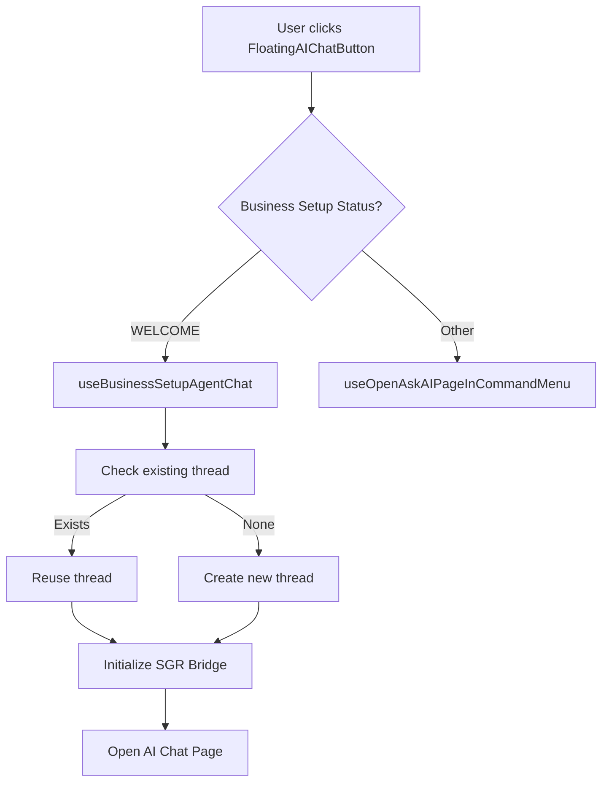
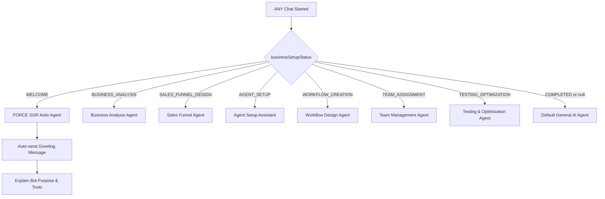
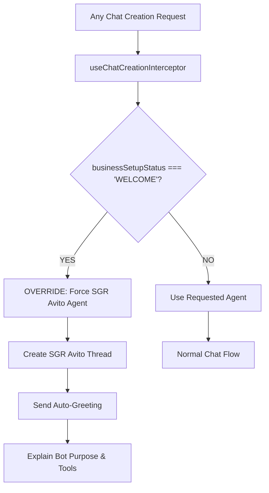

# Floating AI Chat Button Implementation Design

## Overview

This document addresses critical issues in the floating AI chat button implementation where multiple chat threads are being created and SGR Event Bridge is cycling between start/stop states. The design provides solutions for proper state management, agent selection clarity, and resource lifecycle management.

## Problem Analysis

Based on the console logs, several issues have been identified:

### 1. Multiple Thread Creation
```
useCreateNewAIChatThread.ts:41 Created new chat thread: 2db09290-434f-40de-bf6f-11bd35cb82d2
useCreateNewAIChatThread.ts:41 Created new chat thread: 53bf4326-0964-4aa0-8b5e-d914dca8450d  
useCreateNewAIChatThread.ts:41 Created new chat thread: a50765ae-6402-404d-a185-bcfac409d3d3
```
**Issue**: Single button click creates multiple chat threads instead of reusing existing ones.

### 2. SGR Event Bridge Cycling
```
sgr-event-bridge.service.ts:143 SGR Event Bridge: Initialized for agent 2f851163-c7ea-4eae-b960-13f019b256e3
sgr-event-bridge.service.ts:162 SGR Event Bridge: Started listening for events
sgr-event-bridge.service.ts:174 SGR Event Bridge: Stopped listening for events
```
**Issue**: Event bridge repeatedly starts and stops, causing resource leaks and poor performance.

### 3. Agent ID Mismatch
```
Created new chat thread: 2db09290-434f-40de-bf6f-11bd35cb82d2 with agent: 58bb8bf2-a610-4079-931a-6d4a62fdd107
SGR Event Bridge: Initialized for agent 2f851163-c7ea-4eae-b960-13f019b256e3
```
**Issue**: Thread created with one agent ID but SGR bridge initialized with different agent ID.

## Architecture

### Component Hierarchy
```
DefaultLayout
├── FloatingAIChatButton
│   ├── AIErrorBoundary
│   └── FloatingAIChatButtonContent
│       ├── useFloatingAIChatButton
│       ├── useWelcomeMessage  
│       └── WelcomePopup (conditional)
```

### State Management Flow


### Agent Selection Logic


## Data Models

### Thread State Management
```typescript
type AIChatThreadState = {
  threadId: string | null;
  agentId: string;
  businessSetupStep?: BusinessSetupStatus;
  isActive: boolean;
  lastActivity: Date;
  sgrBridgeConnected: boolean;
};

type FloatingButtonState = {
  isVisible: boolean;
  isCreatingThread: boolean;
  lastClickTimestamp: Date | null;
  activeThreadId: string | null;
};
```

### SGR Bridge Connection Pool
```typescript
type SGRConnectionState = {
  agentId: string;
  threadId: string;
  isListening: boolean;
  connectionStartTime: Date;
  lastEventTime: Date | null;
  listenerCount: number;
};

type SGRConnectionPool = {
  connections: Map<string, SGRConnectionState>;
  maxConnections: number;
  connectionTimeout: number;
};
```

### Agent Configuration
```typescript
type BusinessSetupAgentConfig = {
  step: BusinessSetupStatus;
  agentId: string;
  displayName: string;
  capabilities: string[];
  sgrEnabled: boolean;
  autoInit: boolean;
};

const BUSINESS_SETUP_AGENTS: Record<BusinessSetupStatus, BusinessSetupAgentConfig> = {
  WELCOME: {
    step: 'WELCOME',
    agentId: 'sgr-avito-agent-id',
    displayName: 'SGR Avito Integration Assistant',
    capabilities: ['credential_extraction', 'api_validation', 'setup_guidance', 'auto_greeting'],
    sgrEnabled: true,
    autoInit: true,
    forceAgent: true, // ALWAYS use this agent during WELCOME
    autoGreeting: true // ALWAYS send greeting message
  },
  // ... other configurations
};
```

## Component Architecture

### Enhanced useFloatingAIChatButton Hook
```typescript
export const useFloatingAIChatButton = () => {
  const [isCreatingThread, setIsCreatingThread] = useState(false);
  const [lastClickTime, setLastClickTime] = useState<Date | null>(null);
  
  const businessSetupStatus = useBusinessSetupStatus();
  const activeThreadId = useRecoilValue(currentAIChatThreadComponentState);
  
  const handleClick = useCallback(async () => {
    // Prevent rapid clicks
    const now = new Date();
    if (lastClickTime && now.getTime() - lastClickTime.getTime() < 1000) {
      console.log('Ignoring rapid click');
      return;
    }
    
    setLastClickTime(now);
    setIsCreatingThread(true);
    
    try {
      if (businessSetupStatus === 'WELCOME') {
        // ALWAYS force SGR Avito Agent during WELCOME stage
        console.log('WELCOME stage detected - forcing SGR Avito Agent with auto-greeting');
        await createSGRAvitoAgentWithGreeting();
      } else {
        openAskAIPage();
      }
    } finally {
      setIsCreatingThread(false);
    }
  }, [businessSetupStatus, lastClickTime]);
  
  return {
    isVisible: isVisible && isAiEnabled && !isAIChatOpen,
    handleClick,
    isCreatingThread,
    businessSetupStatus
  };
};
```

### WELCOME Stage Agent Override
```typescript
export const useBusinessSetupAgentChat = () => {
  const businessSetupStatus = useBusinessSetupStatus();
  const currentWorkspace = useRecoilValue(currentWorkspaceState);
  
  const createSGRAvitoAgentWithGreeting = useCallback(async () => {
    console.log('Creating SGR Avito Agent for WELCOME stage with auto-greeting');
    
    try {
      // ALWAYS create SGR Avito Agent during WELCOME - no thread reuse
      const sgrAvitoAgentId = 'sgr-avito-agent-specialized-id';
      
      // Create specialized SGR Avito thread
      const { createAgentChatThread } = useCreateNewAIChatThread({ 
        agentId: sgrAvitoAgentId,
        businessSetupStep: 'WELCOME',
        forceNewThread: true // Always create new thread for WELCOME
      });
      
      const threadId = await createAgentChatThread();
      
      // AUTOMATICALLY send greeting message
      await sendSGRAvitoGreeting(threadId);
      
      console.log('SGR Avito Agent created and greeting sent');
      
    } catch (error) {
      console.error('Failed to create SGR Avito Agent:', error);
      // No fallback - WELCOME stage MUST use SGR Avito Agent
      throw new Error('SGR Avito Agent is required for WELCOME stage');
    }
  }, [businessSetupStatus]);
  
  const sendSGRAvitoGreeting = async (threadId: string) => {
    const greetingMessage = `
🤖 **Привет! Я SGR Avito Integration Assistant**

**Моя задача:** Помочь вам настроить интеграцию с Avito для автоматизации вашего бизнеса.

**Мои инструменты и возможности:**
🔧 **Извлечение учетных данных** - безопасно извлекаю CLIENT_ID и CLIENT_SECRET из ваших сообщений
🔐 **Валидация API** - проверяю подлинность ваших Avito API ключей
📋 **Пошаговая настройка** - веду вас через весь процесс интеграции
🔄 **SGR Processing** - использую Schema-Guided Reasoning для точной обработки
📊 **Анализ данных** - помогаю понять структуру ваших Avito данных

**Что мне нужно от вас:**
Предоставьте ваши Avito API учетные данные:
- CLIENT_ID (идентификатор клиента)
- CLIENT_SECRET (секретный ключ)

Я обработаю их безопасно и настрою интеграцию для вашего CRM.

**Готовы начать? Отправьте мне ваши учетные данные Avito API!** 🚀
    `;
    
    // Send the greeting message to the thread
    await agentChatService.addMessage({
      threadId,
      role: AgentChatMessageRole.ASSISTANT,
      content: greetingMessage,
      fileIds: []
    });
  };
  
  return { createSGRAvitoAgentWithGreeting };
};
```

### SGR Event Bridge Resource Management
```typescript
class SGREventBridgeService {
  private connectionPool: Map<string, SGRConnectionState> = new Map();
  private readonly maxConnections = 5;
  private readonly connectionTimeout = 300000; // 5 minutes
  
  initialize(agentId: string, threadId: string): void {
    const connectionKey = `${agentId}-${threadId}`;
    
    // Clean up old connections
    this.cleanupStaleConnections();
    
    // Check if connection already exists
    if (this.connectionPool.has(connectionKey)) {
      console.log(`SGR Bridge: Reusing existing connection for ${connectionKey}`);
      return;
    }
    
    // Create new connection
    const connection: SGRConnectionState = {
      agentId,
      threadId,
      isListening: false,
      connectionStartTime: new Date(),
      lastEventTime: null,
      listenerCount: 0
    };
    
    this.connectionPool.set(connectionKey, connection);
    console.log(`SGR Event Bridge: New connection created for agent ${agentId}, thread ${threadId}`);
  }
  
  private cleanupStaleConnections(): void {
    const now = new Date();
    for (const [key, connection] of this.connectionPool.entries()) {
      const age = now.getTime() - connection.connectionStartTime.getTime();
      if (age > this.connectionTimeout || connection.listenerCount === 0) {
        this.connectionPool.delete(key);
        console.log(`SGR Bridge: Cleaned up stale connection ${key}`);
      }
    }
  }
}
```

### Enhanced useSGREvents Hook
```typescript
export const useSGREvents = (agentId: string, threadId: string | null) => {
  const [events, setEvents] = useState<SGREvent[]>([]);
  const [isConnected, setIsConnected] = useState(false);
  const connectionRef = useRef<string | null>(null);
  
  useEffect(() => {
    if (!threadId || !agentId) {
      return;
    }
    
    const connectionKey = `${agentId}-${threadId}`;
    
    // Prevent duplicate connections
    if (connectionRef.current === connectionKey) {
      return;
    }
    
    // Cleanup previous connection
    if (connectionRef.current) {
      sgrEventBridge.stopListening();
    }
    
    connectionRef.current = connectionKey;
    
    // Initialize new connection
    sgrEventBridge.initialize(agentId, threadId);
    sgrEventBridge.startListening();
    setIsConnected(true);
    
    const handleEvent = (event: SGREvent) => {
      setEvents(prevEvents => [...prevEvents, event]);
    };
    
    sgrEventBridge.addEventListener(handleEvent);
    
    return () => {
      sgrEventBridge.removeEventListener(handleEvent);
      sgrEventBridge.stopListening();
      setIsConnected(false);
      connectionRef.current = null;
    };
  }, [agentId, threadId]);
  
  return { events, isConnected };
};
```

## User Interface Components

### Enhanced FloatingAIChatButton
```typescript
export const FloatingAIChatButton = () => {
  const { isVisible, handleClick, isCreatingThread, businessSetupStatus } = useFloatingAIChatButton();
  const { welcomeMessage, showPopup, setShowPopup, continueChat } = useWelcomeMessage();
  const [isTooltipVisible, setIsTooltipVisible] = useState(false);
  
  const getTooltipText = useCallback(() => {
    if (isCreatingThread) return t`Creating chat...`;
    
    switch (businessSetupStatus) {
      case 'WELCOME':
        return t`Setup Avito Integration`;
      case 'BUSINESS_ANALYSIS':
        return t`Analyze Business`;
      case 'SALES_FUNNEL_DESIGN':
        return t`Design Sales Funnel`;
      default:
        return t`Ask AI (Press @)`;
    }
  }, [businessSetupStatus, isCreatingThread]);
  
  return (
    <StyledFloatingAIChatButtonContainer
      style={{
        opacity: isVisible ? 1 : 0,
        transform: isVisible ? 'scale(1)' : 'scale(0.8)',
        pointerEvents: isVisible ? 'auto' : 'none',
      }}
    >
      <StyledFloatingAIChatButton>
        <FloatingIconButton
          Icon={isCreatingThread ? IconLoader : IconSparkles}
          size={isMobile ? 'small' : 'medium'}
          onClick={handleClick}
          disabled={isCreatingThread}
          data-testid="floating-ai-chat-button"
        />
        
        <StyledTooltip visible={isTooltipVisible}>
          {getTooltipText()}
        </StyledTooltip>
      </StyledFloatingAIChatButton>
      
      {showPopup && welcomeMessage && (
        <WelcomePopup
          message={welcomeMessage}
          onContinue={continueChat}
          onDismiss={() => setShowPopup(false)}
        />
      )}
    </StyledFloatingAIChatButtonContainer>
  );
};
```

### Agent Status Indicator
```typescript
const AgentStatusIndicator = ({ agentId, status }: {
  agentId: string;
  status: BusinessSetupStatus | null;
}) => {
  const agentConfig = status ? BUSINESS_SETUP_AGENTS[status] : null;
  
  return (
    <StyledAgentStatus>
      <StyledAgentIcon>
        {agentConfig?.sgrEnabled ? '🤖' : '💬'}
      </StyledAgentIcon>
      <StyledAgentName>
        {agentConfig?.displayName || 'General AI Assistant'}
      </StyledAgentName>
    </StyledAgentStatus>
  );
};
```

## Error Handling

### Connection Error Recovery
```typescript
export const useRobustSGRConnection = (agentId: string, threadId: string | null) => {
  const [connectionState, setConnectionState] = useState<'disconnected' | 'connecting' | 'connected' | 'error'>('disconnected');
  const [retryCount, setRetryCount] = useState(0);
  const maxRetries = 3;
  
  const connectWithRetry = useCallback(async () => {
    if (retryCount >= maxRetries) {
      setConnectionState('error');
      return;
    }
    
    try {
      setConnectionState('connecting');
      await new Promise(resolve => setTimeout(resolve, 1000 * retryCount)); // Exponential backoff
      
      sgrEventBridge.initialize(agentId, threadId!);
      sgrEventBridge.startListening();
      
      setConnectionState('connected');
      setRetryCount(0);
    } catch (error) {
      console.error('SGR connection failed:', error);
      setRetryCount(prev => prev + 1);
      connectWithRetry();
    }
  }, [agentId, threadId, retryCount]);
  
  return { connectionState, connectWithRetry };
};
```

### Fallback Agent Selection
```typescript
export const useAgentWithFallback = (businessSetupStatus: BusinessSetupStatus | null) => {
  const currentWorkspace = useRecoilValue(currentWorkspaceState);
  
  const getAgentId = useCallback(() => {
    // Try to get specialized business setup agent
    if (businessSetupStatus && BUSINESS_SETUP_AGENTS[businessSetupStatus]) {
      return BUSINESS_SETUP_AGENTS[businessSetupStatus].agentId;
    }
    
    // Fallback to workspace default agent
    if (currentWorkspace?.defaultAgent?.id) {
      return currentWorkspace.defaultAgent.id;
    }
    
    // Final fallback
    return 'fallback-general-agent';
  }, [businessSetupStatus, currentWorkspace]);
  
  return { agentId: getAgentId() };
};
```

## Performance Optimizations

## Universal WELCOME Stage Override

### Core Requirement
**During WELCOME stage, ANY chat initiation (FloatingAIChatButton, Command Menu, Direct Navigation) MUST:**
1. ✅ Always create SGR Avito Agent (no exceptions)
2. ✅ Always send automatic greeting message
3. ✅ Explain bot purpose, tasks, and tools
4. ✅ Never fallback to other agents

### Implementation Strategy
```typescript
// Global interceptor for all chat creation during WELCOME
export const useChatCreationInterceptor = () => {
  const businessSetupStatus = useBusinessSetupStatus();
  
  const interceptChatCreation = useCallback(async (originalAgentId?: string) => {
    if (businessSetupStatus === 'WELCOME') {
      console.log('WELCOME stage detected - intercepting chat creation');
      console.log('Original agent would be:', originalAgentId);
      console.log('Forcing SGR Avito Agent instead');
      
      // FORCE SGR Avito Agent regardless of requested agent
      return await createSGRAvitoAgentWithGreeting();
    }
    
    // Normal flow for other stages
    return originalAgentId;
  }, [businessSetupStatus]);
  
  return { interceptChatCreation };
};
```

### Modified Chat Creation Flow


### Integration Points

#### 1. FloatingAIChatButton Integration
```typescript
// In useFloatingAIChatButton hook
const { interceptChatCreation } = useChatCreationInterceptor();

const handleClick = async () => {
  // Always check for WELCOME override
  await interceptChatCreation();
};
```

#### 2. Command Menu Integration  
```typescript
// In useOpenAskAIPageInCommandMenu hook
const { interceptChatCreation } = useChatCreationInterceptor();

const openAskAIPage = async () => {
  // Intercept before opening AI page
  await interceptChatCreation();
  // Continue with normal flow...
};
```

#### 3. Direct Agent Creation Override
```typescript
// In useCreateNewAIChatThread hook
const { interceptChatCreation } = useChatCreationInterceptor();

const createAgentChatThread = async (requestedAgentId?: string) => {
  // Check if we need to override the agent
  const finalAgentId = await interceptChatCreation(requestedAgentId);
  
  // Use the potentially overridden agent ID
  return await createThread(finalAgentId);
};
```

#### 4. AIChatTab Enhancement
```typescript
// Enhanced to show SGR Avito Agent information
const AIChatTabHeader = () => {
  const businessSetupStatus = useBusinessSetupStatus();
  
  return (
    <StyledHeader>
      {businessSetupStatus === 'WELCOME' && (
        <StyledSGRBadge>
          🤖 SGR Avito Integration Assistant
        </StyledSGRBadge>
      )}
    </StyledHeader>
  );
};
```

## Testing Strategy

### Unit Tests
```typescript
describe('useFloatingAIChatButton', () => {
  it('should prevent rapid clicks', async () => {
    const { result } = renderHook(() => useFloatingAIChatButton());
    
    // First click
    await act(async () => {
      result.current.handleClick();
    });
    
    // Second click within 1 second should be ignored
    await act(async () => {
      result.current.handleClick();
    });
    
    expect(mockCreateBusinessSetupChat).toHaveBeenCalledTimes(1);
  });
  
  it('should reuse existing thread for same business step', async () => {
    const existingThreadId = 'existing-thread-123';
    mockUseRecoilValue.mockReturnValue(existingThreadId);
    
    const { result } = renderHook(() => useBusinessSetupAgentChat());
    
    await act(async () => {
      await result.current.createOrReuseBusinessSetupChat();
    });
    
    expect(mockCreateAgentChatThread).not.toHaveBeenCalled();
    expect(mockOpenAskAIPage).toHaveBeenCalled();
  });
});

describe('SGREventBridgeService', () => {
  it('should cleanup stale connections', () => {
    const service = new SGREventBridgeService();
    
    // Create connection that's too old
    service.initialize('agent-1', 'thread-1');
    
    // Fast-forward time
    jest.advanceTimersByTime(400000); // > 5 minutes
    
    // Initialize new connection should trigger cleanup
    service.initialize('agent-2', 'thread-2');
    
    expect(service.getActiveConnections()).toBe(1);
  });
});
```

### Integration Tests
```typescript
describe('FloatingAIChatButton Integration', () => {
  it('should create appropriate agent for business setup step', async () => {
    const { user } = render(<FloatingAIChatButton />);
    
    // Mock business setup status
    mockUseBusinessSetupStatus.mockReturnValue('WELCOME');
    
    const button = screen.getByTestId('floating-ai-chat-button');
    await user.click(button);
    
    // Should create Avito SGR agent
    expect(mockCreateBusinessSetupChat).toHaveBeenCalledWith('WELCOME');
    expect(mockSgrEventBridge.initialize).toHaveBeenCalledWith(
      'avito-sgr-agent-id',
      expect.any(String)
    );
  });
});
```

## Implementation Priority

### Phase 1: Critical Fixes
1. **Thread Deduplication** - Prevent multiple thread creation
2. **SGR Connection Pooling** - Fix repeated start/stop cycles  
3. **Click Debouncing** - Prevent rapid clicks

### Phase 2: Enhanced Features
1. **Agent Status Indicator** - Show which agent is active
2. **Thread Caching** - Reuse existing threads
3. **Connection Recovery** - Robust error handling

### Phase 3: Optimizations
1. **Performance Monitoring** - Track connection health
2. **Analytics Integration** - Usage metrics
3. **Advanced Caching** - Cross-session persistence