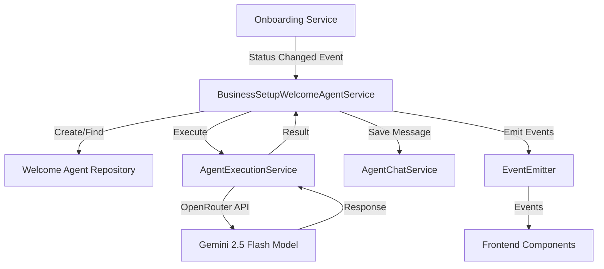
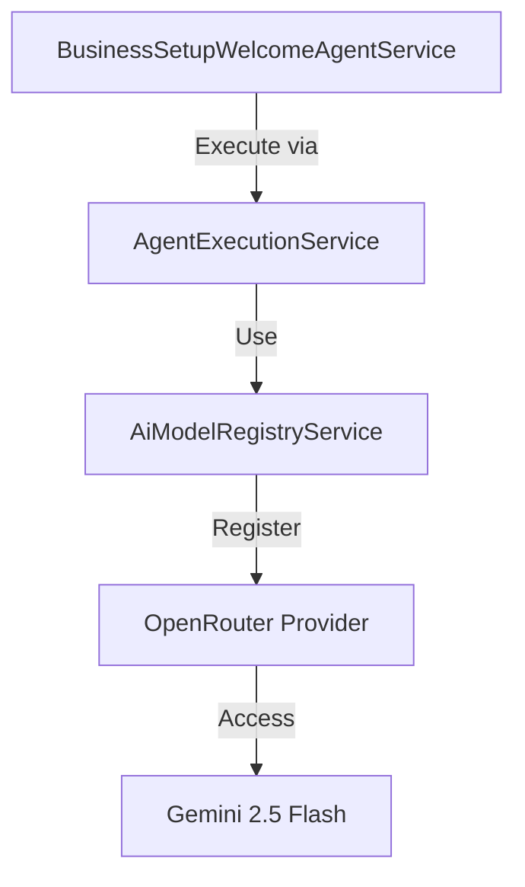
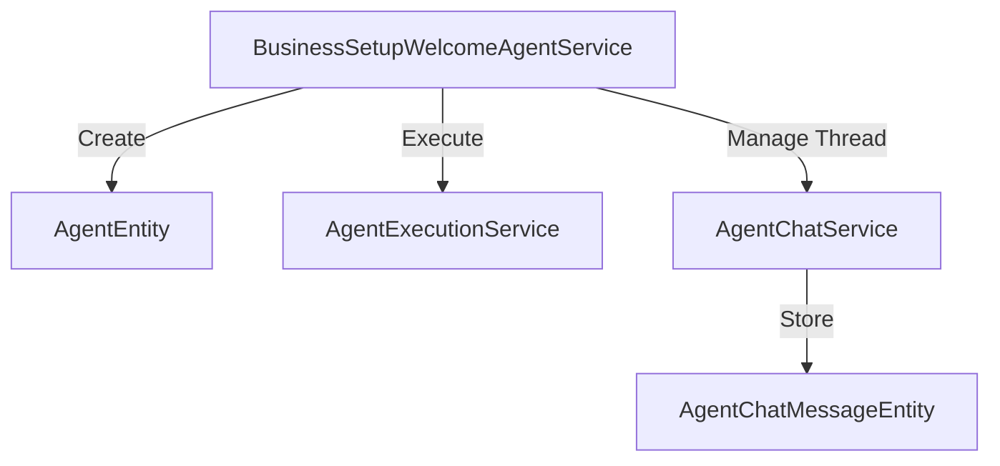

# Gemini Welcome Agent Implementation Design

## 1. Overview

This design document details the implementation of Google's Gemini 2.5 Flash model via OpenRouter for the welcome step in Twenty CRM. The solution ensures that all LLM interactions during the welcome step exclusively use the Gemini model, providing a consistent and controlled experience.

## 2. Architecture

The implementation leverages Twenty's existing architecture, particularly the event-driven system and agent infrastructure, while adding specific enhancements to enforce model selection and simplify the welcome experience.

### 2.1 System Components



### 2.2 Data Flow

1. User completes onboarding
2. Onboarding status change event is triggered
3. Welcome agent service intercepts the event
4. Service retrieves or creates a dedicated Gemini agent
5. Service executes the agent with explicit model settings
6. Response is saved to chat thread
7. Events are emitted for monitoring and tracking

## 3. Core Components

### 3.1 BusinessSetupWelcomeAgentService

This service is the central component responsible for:
- Intercepting onboarding completion events
- Creating or retrieving the dedicated Gemini agent
- Executing the agent with enforced model selection
- Saving responses and managing the chat thread

```typescript
@Injectable()
export class BusinessSetupWelcomeAgentService {
  // Event handler for onboarding status changes
  @OnEvent('onboarding.status.changed')
  private async handleOnboardingStatusChange(payload: OnboardingStatusChangedEvent) {
    // Only proceed when status changes to COMPLETED
    if (payload.status === 'COMPLETED' && payload.previousStatus !== 'COMPLETED') {
      // Create welcome chat with retry mechanism for reliability
      await this.createWelcomeChatWithRetry(payload.userId, payload.workspaceId);
    }
  }

  // Create welcome chat with enforced Gemini model
  private async createWelcomeChat(userId: string, workspaceId: string): Promise<void> {
    // Fetch or create dedicated Gemini agent
    const welcomeAgent = await this.agentRepository.findOne({
      where: { 
        name: 'Welcome Greeting Bot',
        workspaceId 
      }
    });

    let agent;
    
    if (!welcomeAgent) {
      // Create dedicated Gemini agent
      agent = await this.agentRepository.save({
        name: 'Welcome Greeting Bot',
        description: 'Simple greeting bot for welcome status',
        prompt: 'You are a simple greeting bot. You ONLY respond with greetings.',
        modelId: 'google/gemini-2.5-flash', // Enforce Gemini model
        workspaceId,
      });
    } else {
      agent = welcomeAgent;
    }

    // Execute agent with explicit model enforcement in context
    const aiResponse = await this.agentExecutionService.executeAgent({
      agent,
      context: { 
        userId, 
        workspaceId, 
        step: 'WELCOME',
        prompt: welcomePrompt,
        threadId: thread.id,
        modelId: 'google/gemini-2.5-flash' // Double enforcement of model
      },
      schema: {},
      userPrompt: welcomePrompt,
    });

    // Save response and emit events
    // ...
  }
}
```

### 3.2 Environment Configuration

The implementation uses environment variables to configure OpenRouter integration:

```
OPENAI_COMPATIBLE_BASE_URL=https://openrouter.ai/api/v1
OPENAI_COMPATIBLE_API_KEY=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
OPENAI_COMPATIBLE_MODEL_NAMES=google/gemini-2.5-flash
DEFAULT_MODEL_ID=google/gemini-2.5-flash
```

### 3.3 Agent Entity Management

The implementation adds repository injection for agent management:

```typescript
@Injectable()
export class BusinessSetupWelcomeAgentService {
  constructor(
    // Other dependencies
    @InjectRepository(AgentEntity, 'core')
    private readonly agentRepository: Repository<AgentEntity>,
  ) {}
  
  // Service methods
}
```

### 3.4 Event System

The implementation leverages the existing event system:

```typescript
// Event constants
export const BUSINESS_SETUP_EVENTS = {
  // Onboarding events
  ONBOARDING_STATUS_CHANGED: 'onboarding.status.changed',
  
  // AI Agent events
  AI_AGENT_WELCOME_CHAT_CREATION_STARTED: 'ai-agent.welcome.chat-creation-started',
  AI_AGENT_WELCOME_CHAT_CREATED: 'ai-agent.welcome.chat-created',
  AI_AGENT_WELCOME_CHAT_CREATION_FAILED: 'ai-agent.welcome.chat-creation-failed',
  
  // Other events...
};
```

## 4. Simplified Welcome Message

The welcome message has been simplified to function strictly as a greeting:

```typescript
private async getPersonalizedWelcomePrompt(userId: string, workspaceId: string): Promise<string> {
  try {
    // Get user and workspace data for personalization
    const user = await this.userService.findById(userId);
    const workspace = await this.workspaceService.findById(workspaceId);

    const userName = user?.firstName || user?.email || 'User';
    const workspaceName = workspace?.displayName || 'Workspace';

    return `👋 Hello ${userName}!

I AM A WELCOME BOT AND NOTHING MORE. I'm here to greet you in ${workspaceName}.

Have a great day!`;
  } catch (error) {
    // Fallback to default prompt
    return `👋 Hello there!

I AM A WELCOME BOT AND NOTHING MORE. I'm here to greet you.

Have a great day!`;
  }
}
```

## 5. Reliability Mechanisms

### 5.1 Retry Logic

The implementation includes robust retry logic with exponential backoff:

```typescript
private async createWelcomeChatWithRetry(userId: string, workspaceId: string): Promise<void> {
  for (let attempt = 1; attempt <= this.maxRetries; attempt++) {
    try {
      await this.createWelcomeChat(userId, workspaceId);
      this.logger.log(`Welcome chat created successfully on attempt ${attempt}`);
      return;
    } catch (error) {
      this.logger.warn(`Attempt ${attempt} failed for user ${userId}:`, error);
      
      if (attempt === this.maxRetries) {
        this.logger.error(`All ${this.maxRetries} attempts failed for user ${userId}`);
        throw error;
      }
      
      // Use exponential backoff before retry
      const delayMs = Math.pow(2, attempt) * this.retryDelayMs;
      await this.delay(delayMs);
    }
  }
}
```

### 5.2 Error Handling

The implementation includes comprehensive error handling:

```typescript
try {
  // Operation code
} catch (error) {
  this.logger.error('Failed to create welcome chat:', error);
  
  // Emit error event for monitoring
  this.eventEmitter.emit('ai-agent.welcome.chat-creation-failed', {
    userId: payload.userId,
    workspaceId: payload.workspaceId,
    error: error.message,
    attempts: this.maxRetries,
    timestamp: new Date()
  });
  
  throw error;
}
```

## 6. Testing Strategy

### 6.1 Unit Tests

The implementation includes dedicated tests for Gemini model enforcement:

```typescript
// Test agent creation with correct model
it('should create a welcome agent with the Gemini model if it does not exist', async () => {
  // Test implementation
  expect(mockAgentRepository.save).toHaveBeenCalledWith(
    expect.objectContaining({
      modelId: 'google/gemini-2.5-flash',
    })
  );
});

// Test model enforcement in context
it('should always use the Gemini model in the context regardless of agent', async () => {
  // Test implementation
  expect(mockAgentExecutionService.executeAgent).toHaveBeenCalledWith(
    expect.objectContaining({
      context: expect.objectContaining({
        modelId: 'google/gemini-2.5-flash'
      })
    })
  );
});
```

### 6.2 Integration Tests

Integration tests verify the end-to-end flow:

```typescript
it('creates welcome chat when onboarding status changes to COMPLETED', async () => {
  // Test implementation
  expect(mockAgentChatService.createThread).toHaveBeenCalled();
  expect(mockAgentExecutionService.executeAgent).toHaveBeenCalled();
  expect(mockAgentChatService.addMessage).toHaveBeenCalled();
});
```

## 7. Multiple Safeguards for Model Enforcement

The implementation includes multiple layers of safeguards to ensure Gemini model usage:

1. **Agent-level enforcement**: The welcome agent is explicitly created with `modelId: 'google/gemini-2.5-flash'`
2. **Context-level enforcement**: The execution context includes `modelId: 'google/gemini-2.5-flash'` as an override
3. **Environment-level enforcement**: The default model is set to Gemini via environment variables
4. **Testing verification**: Tests explicitly verify model selection at each step

This multi-layered approach ensures that even if one layer fails, the others will maintain the requirement to use Gemini exclusively.

## 8. Integration with Existing Systems

### 8.1 OpenRouter Integration

The implementation leverages Twenty's existing OpenAI-compatible provider support:



### 8.2 Agent System Integration

The welcome agent seamlessly integrates with the existing agent infrastructure:



## 9. Verification Process

The implementation includes a verification checklist:

1. **Environment Configuration**
   - Set OpenRouter base URL and API key
   - Configure model names and default model

2. **Code Implementation**
   - Create dedicated Gemini agent
   - Apply model enforcement in context
   - Simplify welcome message

3. **Testing**
   - Run unit tests for model enforcement
   - Verify agent creation with correct model
   - Test welcome message format

4. **Production Verification**
   - Monitor logs for model usage
   - Verify OpenRouter API calls
   - Confirm greeting-only format in practice

## 10. Constraints and Considerations

1. **API Key Security**: The OpenRouter API key must be securely managed and not exposed in client-side code
2. **Rate Limits**: OpenRouter may impose rate limits that should be considered for high-volume deployments
3. **Fallback Behavior**: The implementation intentionally has no fallback to other models - if Gemini is unavailable, the operation will fail rather than use a different model
4. **Cost Considerations**: Usage of OpenRouter with Gemini may have different pricing than other models