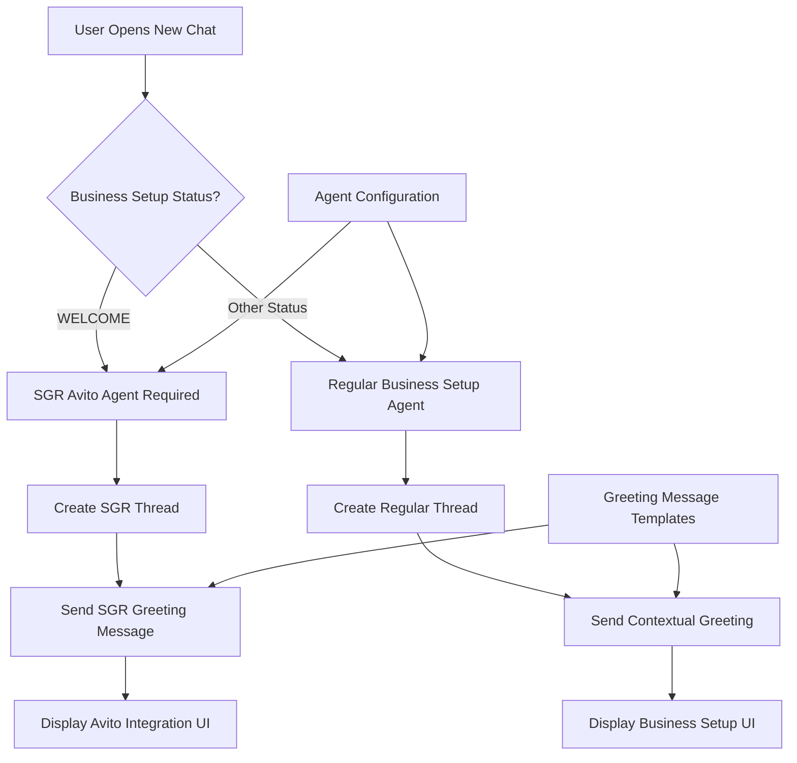
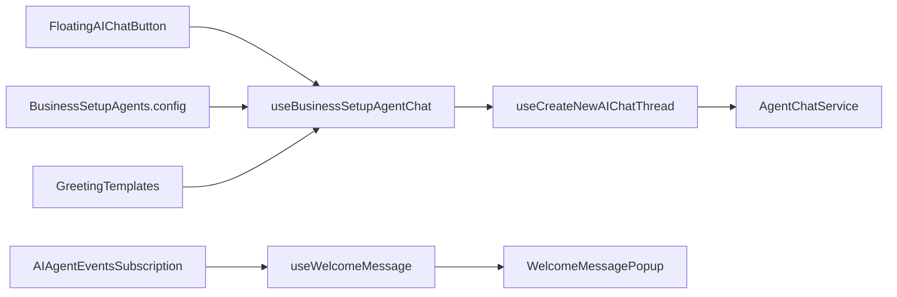
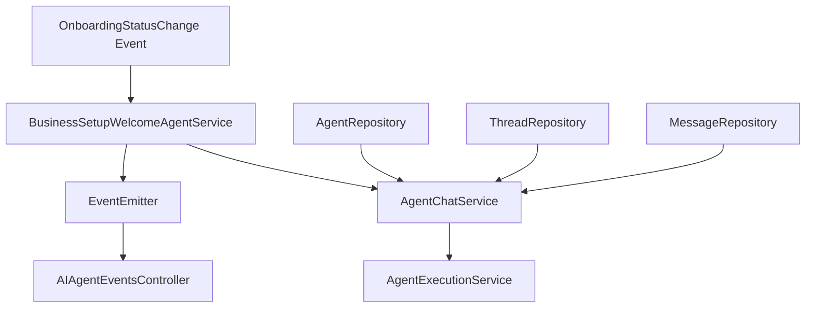
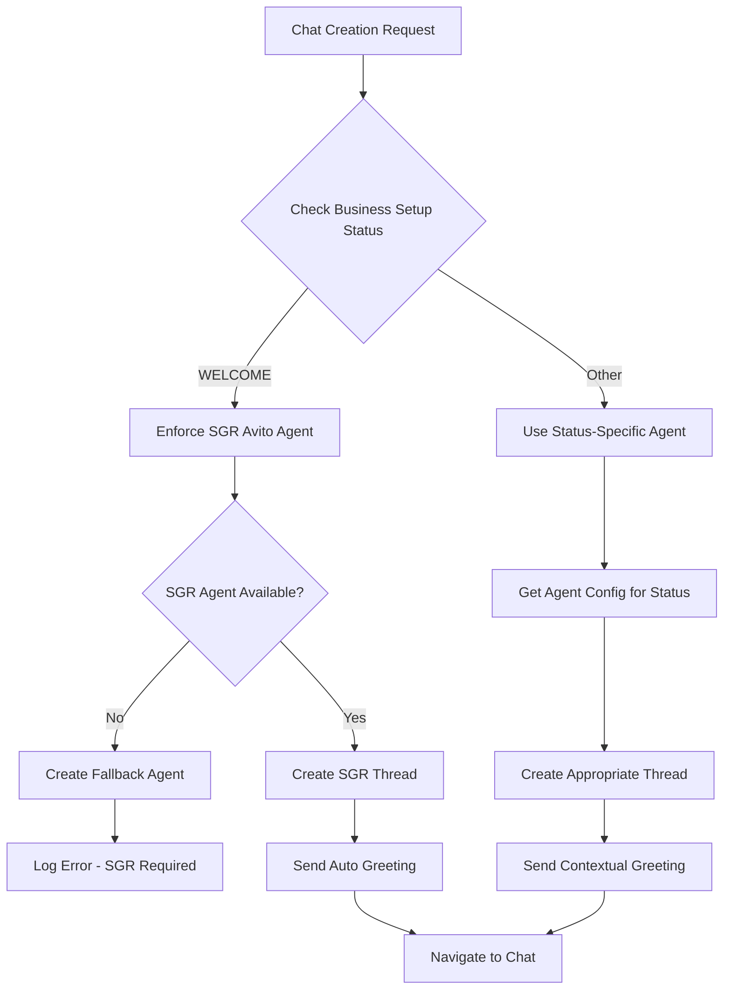
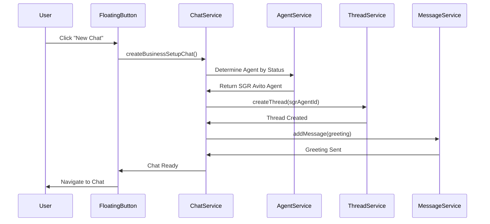

# Greeting Response System Design

## Overview

This document addresses the issue where new chat sessions fail to display appropriate greeting messages from specialized agents, particularly the SGR Avito agent. The system currently has inconsistent behavior where users see either no greeting message or incorrect messages from the wrong agent type.

## Problem Analysis

### Current Issues
1. **Missing Greeting Messages**: New chats open empty without any agent introduction
2. **Wrong Agent Context**: Business setup messages appear instead of SGR Avito agent greetings
3. **Inconsistent Agent Selection**: The system doesn't consistently use the correct specialized agent
4. **Welcome Message Logic**: Automatic welcome message generation was disabled, leaving users confused

### Root Causes
- Agent chat service no longer sends automatic welcome messages upon thread creation
- Business setup status conflicts with agent selection logic  
- SGR Avito agent configuration not properly enforced during WELCOME stage
- Frontend and backend greeting logic mismatch

## Architecture



## Component Architecture

### Frontend Components



### Backend Services



## Data Models & Agent Configuration

### Agent Configuration Types

| Field | Type | Description |
|-------|------|-------------|
| `step` | `BusinessSetupStatus` | Associated business setup stage |
| `agentId` | `string` | Unique agent identifier |
| `displayName` | `string` | Human-readable agent name |
| `capabilities` | `string[]` | Agent feature capabilities |
| `sgrEnabled` | `boolean` | Schema-Guided Reasoning enabled |
| `autoInit` | `boolean` | Auto-initialize on stage entry |
| `forceAgent` | `boolean` | Always use this agent for stage |
| `autoGreeting` | `boolean` | Automatically send greeting |
| `greetingMessage` | `string` | Predefined greeting template |

### SGR Avito Agent Configuration

```typescript
WELCOME: {
  step: 'WELCOME',
  agentId: '2f851163-c7ea-4eae-b960-13f019b256e3',
  displayName: 'SGR Avito Integration Assistant',
  capabilities: [
    'credential_extraction',
    'api_validation', 
    'setup_guidance',
    'auto_greeting',
    'sgr_processing'
  ],
  sgrEnabled: true,
  autoInit: true,
  forceAgent: true,
  autoGreeting: true,
  greetingMessage: "🤖 **Привет! Я SGR Avito Integration Assistant**..."
}
```

## Business Logic Layer

### Agent Selection Logic



### Greeting Message Flow



### Error Recovery & Retry Logic

```typescript
interface RetryConfiguration {
  agentId: string;
  businessSetupStatus: BusinessSetupStatus;
  maxRetries: number;
  backoffMs: number;
}

const retryPolicy = {
  WELCOME: { maxRetries: 3, requiredAgent: SGR_AVITO_AGENT_ID },
  BUSINESS_ANALYSIS: { maxRetries: 2, fallbackAllowed: true },
  // ... other stages
}
```

## API Integration Layer

### GraphQL Mutations

#### CreateAgentChatThread
```graphql
mutation CreateAgentChatThread($input: CreateAgentChatThreadInput!) {
  createAgentChatThread(input: $input) {
    id
    agentId
    messages {
      id
      role
      content
    }
  }
}
```

#### Input Schema
```typescript
interface CreateAgentChatThreadInput {
  agentId: string;
  businessSetupStep?: BusinessSetupStatus;
  autoGreeting?: boolean;
  greetingTemplate?: string;
}
```

### Event Subscription System

#### Welcome Chat Events
```typescript
interface WelcomeChatEvent {
  userId: string;
  workspaceId: string;
  threadId: string;
  agentType: 'SGR_AVITO' | 'BUSINESS_SETUP' | 'GENERIC';
  greetingMessage: string;
  timestamp: Date;
}
```

#### Event Types
- `ai-agent.welcome.chat-created`
- `ai-agent.welcome.chat-failed`
- `ai-agent.welcome.greeting-sent`

## Middleware & Interceptors

### Agent Enforcement Middleware

```typescript
@Injectable()
export class AgentEnforcementInterceptor {
  intercept(context: ExecutionContext, next: CallHandler) {
    const request = context.switchToHttp().getRequest();
    const businessSetupStatus = request.body?.businessSetupStep;
    
    if (businessSetupStatus === 'WELCOME') {
      // Enforce SGR Avito Agent
      request.body.agentId = SGR_AVITO_AGENT_ID;
      request.body.autoGreeting = true;
    }
    
    return next.handle();
  }
}
```

### Greeting Message Interceptor

```typescript
@Injectable()
export class GreetingInterceptor {
  async intercept(context: ExecutionContext, next: CallHandler) {
    const result = await next.handle().toPromise();
    
    // Auto-send greeting after thread creation
    if (result.threadId && context.getClass().name === 'AgentChatResolver') {
      await this.sendGreetingMessage(result.threadId);
    }
    
    return result;
  }
}
```

## Testing Strategy

### Unit Tests

#### Frontend Testing
```typescript
describe('useBusinessSetupAgentChat', () => {
  it('should force SGR Avito agent for WELCOME status', async () => {
    mockBusinessSetupStatus.mockReturnValue('WELCOME');
    
    const { result } = renderHook(() => useBusinessSetupAgentChat());
    await act(() => result.current.createBusinessSetupChat());
    
    expect(createSGRThread).toHaveBeenCalledWith({
      agentId: SGR_AVITO_AGENT_ID,
      autoGreeting: true
    });
  });
});
```

#### Backend Testing
```typescript
describe('BusinessSetupWelcomeAgentService', () => {
  it('should create SGR agent with greeting for WELCOME status', async () => {
    await service.createWelcomeChat('user-123', 'workspace-123');
    
    expect(agentRepository.save).toHaveBeenCalledWith(
      expect.objectContaining({
        modelId: 'google/gemini-2.5-flash',
        prompt: expect.stringContaining('SGR Avito')
      })
    );
  });
});
```

### Integration Tests

#### End-to-End Greeting Flow
```typescript
describe('Agent Greeting E2E', () => {
  it('should display SGR Avito greeting in new WELCOME chat', async () => {
    // Navigate to app in WELCOME status
    await page.goto('/business-setup');
    
    // Click floating chat button
    await page.click('[data-testid="floating-ai-chat"]');
    
    // Verify SGR Avito greeting appears
    await expect(page.locator('.chat-message')).toContainText(
      'SGR Avito Integration Assistant'
    );
  });
});
```

### Performance Testing

#### Chat Creation Latency
- Target: < 2 seconds for thread creation + greeting
- Measure: Time from button click to greeting display
- Monitor: Success rate of agent selection

#### Error Recovery Testing
- Simulate agent unavailability
- Test retry mechanisms
- Verify fallback behavior

## How It Works - Step by Step Implementation Flow

### Current State vs Target State

#### Current Broken State
1. User opens new chat → Empty chat appears
2. No greeting message displayed
3. Wrong agent context (Business Setup instead of SGR Avito)
4. User confusion about what agent they're talking to

#### Target Working State
1. User opens new chat → System detects WELCOME status
2. SGR Avito agent automatically selected
3. Greeting message immediately appears
4. User sees clear Avito integration context

### Detailed Operation Flow

#### Step 1: User Initiates Chat Creation
```typescript
// When user clicks floating AI button
const handleFloatingButtonClick = async () => {
  // 1. Check business setup status
  const status = getCurrentBusinessSetupStatus(); // Returns 'WELCOME'
  
  // 2. Route to appropriate agent creation
  if (status === 'WELCOME') {
    await createSGRAvitoAgentWithGreeting();
  } else {
    await createRegularBusinessAgent();
  }
};
```

#### Step 2: Agent Selection & Enforcement
```typescript
// System enforces SGR Avito agent for WELCOME status
const createSGRAvitoAgentWithGreeting = async () => {
  // 1. Force SGR Avito agent ID
  const agentId = SGR_AVITO_AGENT_ID; // '2f851163-c7ea-4eae-b960-13f019b256e3'
  
  // 2. Create thread with specific agent
  const thread = await agentChatService.createThread(agentId, workspaceId);
  
  // 3. Get greeting template for SGR Avito agent
  const greetingMessage = BUSINESS_SETUP_AGENTS.WELCOME.greetingMessage;
  
  // 4. Send greeting as first message
  await agentChatService.addMessage({
    threadId: thread.id,
    role: 'assistant',
    content: greetingMessage
  });
  
  // 5. Navigate user to chat
  navigate(`/chat/${thread.id}`);
};
```

#### Step 3: Greeting Message Display
```typescript
// SGR Avito greeting message appears immediately
const sgrAvitoGreeting = `
🤖 **Привет! Я SGR Avito Integration Assistant**

**Моя задача:** Помочь вам настроить интеграцию с Avito для автоматизации вашего бизнеса.

**Мои инструменты и возможности:**
🔧 **Извлечение учетных данных** - безопасно извлекаю CLIENT_ID и CLIENT_SECRET
🔐 **Валидация API** - проверяю подлинность ваших Avito API ключей
📋 **Пошаговая настройка** - веду вас через весь процесс интеграции
🔄 **SGR Processing** - использую Schema-Guided Reasoning для точной обработки
📊 **Анализ данных** - помогаю понять структуру ваших Avito данных

**Что мне нужно от вас:**
Предоставьте ваши Avito API учетные данные:
- CLIENT_ID (идентификатор клиента)
- CLIENT_SECRET (секретный ключ)

**Готовы начать? Отправьте мне ваши учетные данные Avito API!** 🚀
`;
```

### Backend Implementation Flow

#### Thread Creation with Auto-Greeting
```typescript
// Enhanced createThread method
class AgentChatService {
  async createThread(agentId: string, workspaceId: string) {
    // 1. Create thread entity
    const thread = await this.threadRepository.save({
      agentId,
      userWorkspaceId: workspaceId
    });
    
    // 2. Check if agent requires auto-greeting
    const agentConfig = this.getAgentConfig(agentId);
    
    if (agentConfig.autoGreeting && agentConfig.greetingMessage) {
      // 3. Send greeting message immediately
      await this.addMessage({
        threadId: thread.id,
        role: 'assistant',
        content: agentConfig.greetingMessage
      });
      
      // 4. Emit event for real-time updates
      this.eventEmitter.emit('ai-agent.greeting.sent', {
        threadId: thread.id,
        agentId,
        greetingMessage: agentConfig.greetingMessage
      });
    }
    
    return thread;
  }
}
```

#### Agent Configuration Lookup
```typescript
// How system determines which agent and greeting to use
const getAgentConfig = (businessSetupStatus: BusinessSetupStatus) => {
  // 1. Look up agent configuration
  const config = BUSINESS_SETUP_AGENTS[businessSetupStatus];
  
  // 2. For WELCOME status, always return SGR Avito config
  if (businessSetupStatus === 'WELCOME') {
    return {
      agentId: SGR_AVITO_AGENT_ID,
      autoGreeting: true,
      greetingMessage: 'SGR Avito Integration Assistant greeting...'
    };
  }
  
  return config;
};
```

### Frontend Real-time Updates

#### Message Display Flow
```typescript
// How greeting appears in chat UI
const ChatMessages = () => {
  const [messages, setMessages] = useState([]);
  
  // 1. Subscribe to new messages
  useEffect(() => {
    const subscription = subscribeToMessages(threadId);
    
    subscription.onMessage((newMessage) => {
      // 2. New greeting message received
      if (newMessage.role === 'assistant' && newMessage.isGreeting) {
        // 3. Display with special greeting styling
        setMessages(prev => [newMessage, ...prev]);
      }
    });
  }, [threadId]);
  
  return (
    <div className="chat-messages">
      {messages.map(message => (
        <MessageBubble 
          key={message.id}
          message={message}
          isGreeting={message.isGreeting}
        />
      ))}
    </div>
  );
};
```

### Error Recovery Mechanism

#### Retry Logic for Failed Greeting
```typescript
// How system handles failures
const createChatWithRetry = async (maxRetries = 3) => {
  for (let attempt = 1; attempt <= maxRetries; attempt++) {
    try {
      // 1. Attempt to create chat with greeting
      const thread = await createSGRAvitoAgentWithGreeting();
      
      // 2. Verify greeting was sent
      const messages = await getThreadMessages(thread.id);
      const hasGreeting = messages.some(msg => 
        msg.role === 'assistant' && msg.content.includes('SGR Avito')
      );
      
      if (hasGreeting) {
        return thread; // Success!
      } else {
        throw new Error('Greeting not sent');
      }
      
    } catch (error) {
      if (attempt === maxRetries) {
        // 3. Final fallback - show error to user
        showErrorMessage('Failed to create SGR Avito chat. Please try again.');
        throw error;
      }
      
      // 4. Wait before retry (exponential backoff)
      await delay(Math.pow(2, attempt) * 1000);
    }
  }
};
```

### Database State Changes

#### Thread Creation
```sql
-- 1. Thread record created
INSERT INTO agent_chat_thread (
  id, agent_id, user_workspace_id, created_at
) VALUES (
  'thread-123', 
  '2f851163-c7ea-4eae-b960-13f019b256e3',  -- SGR Avito Agent
  'workspace-456',
  NOW()
);

-- 2. Greeting message record created
INSERT INTO agent_chat_message (
  id, thread_id, role, content, created_at
) VALUES (
  'msg-789',
  'thread-123',
  'assistant',
  'Привет! Я SGR Avito Integration Assistant...',
  NOW()
);
```

### Event System Flow

#### Real-time Event Propagation
```typescript
// Backend event emission
this.eventEmitter.emit('ai-agent.greeting.sent', {
  userId: 'user-123',
  workspaceId: 'workspace-456', 
  threadId: 'thread-123',
  agentType: 'SGR_AVITO',
  greetingMessage: 'Привет! Я SGR Avito Integration Assistant...',
  timestamp: new Date()
});

// Frontend event reception
const { greetingEvents } = useAIAgentEventsSubscription();

useEffect(() => {
  const latestGreeting = greetingEvents[greetingEvents.length - 1];
  if (latestGreeting && latestGreeting.threadId === currentThreadId) {
    // Display greeting in UI
    addMessageToChat(latestGreeting.greetingMessage);
  }
}, [greetingEvents]);
```

### User Experience Timeline

```
T=0ms:    User clicks "New Chat" button
T=100ms:  System detects WELCOME status
T=200ms:  SGR Avito agent selection enforced
T=500ms:  Thread created in database
T=600ms:  Greeting message added to thread
T=700ms:  Event emitted for real-time update
T=800ms:  User navigates to chat interface
T=900ms:  Greeting message appears in chat UI
T=1000ms: User sees "SGR Avito Integration Assistant" ready
```

### Validation & Testing Points

#### How to Verify It's Working
1. **Agent Selection**: Check thread.agentId === SGR_AVITO_AGENT_ID
2. **Greeting Presence**: Verify first message contains "SGR Avito"
3. **Message Role**: Confirm first message.role === 'assistant'
4. **Timing**: Greeting appears within 1 second of chat creation
5. **UI Display**: Chat shows agent context immediately

#### Debug Commands
```bash
# Check agent configuration
console.log(BUSINESS_SETUP_AGENTS.WELCOME);

# Verify thread creation
SELECT * FROM agent_chat_thread WHERE agent_id = '2f851163-c7ea-4eae-b960-13f019b256e3';

# Check greeting messages
SELECT * FROM agent_chat_message WHERE role = 'assistant' AND content LIKE '%SGR Avito%';
```

## Implementation Roadmap

### Phase 1: Core Agent Selection (Week 1)
- Fix agent enforcement for WELCOME status
- Implement proper SGR Avito agent creation
- Add error recovery for agent selection failures

### Phase 2: Greeting System (Week 2)  
- Restore automatic greeting message functionality
- Implement greeting templates system
- Add greeting message interceptors

### Phase 3: Event System (Week 3)
- Complete GraphQL subscription integration
- Implement real-time greeting delivery
- Add event-driven error handling

### Phase 4: Testing & Optimization (Week 4)
- Comprehensive E2E testing
- Performance optimization
- Error handling improvements

## Configuration & Deployment

### Environment Variables
```bash
# Agent Configuration
SGR_AVITO_AGENT_ID="2f851163-c7ea-4eae-b960-13f019b256e3"
WELCOME_AGENT_MODEL="google/gemini-2.5-flash"
AUTO_GREETING_ENABLED=true

# Retry Configuration  
AGENT_CREATION_MAX_RETRIES=3
AGENT_CREATION_RETRY_DELAY_MS=1000
```

### Feature Flags
```typescript
const greetingFeatures = {
  autoGreeting: process.env.AUTO_GREETING_ENABLED === 'true',
  sgrEnforcement: true,
  greetingInterceptors: true,
  eventSubscriptions: true
};
```

## Monitoring & Metrics

### Key Metrics
- Chat creation success rate
- Greeting message delivery rate  
- Agent selection accuracy
- Average greeting display time

### Error Tracking
- Agent creation failures
- Greeting message failures
- Event subscription errors
- User experience issues

### Performance Monitoring
- Thread creation latency
- Message delivery time
- Error recovery effectiveness
- User abandonment rate