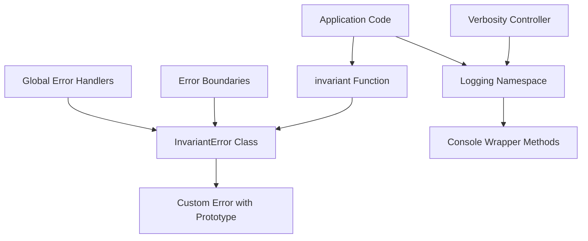
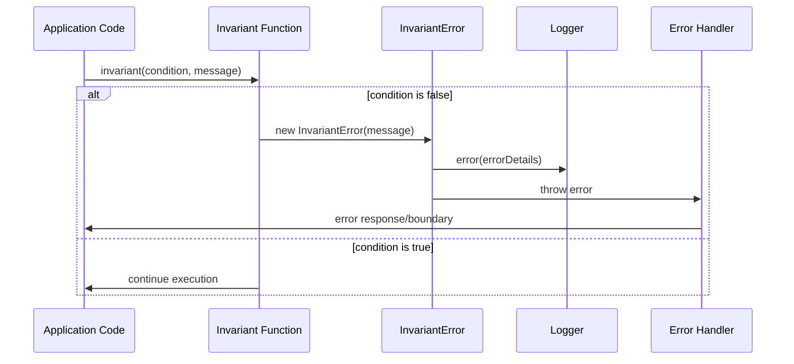
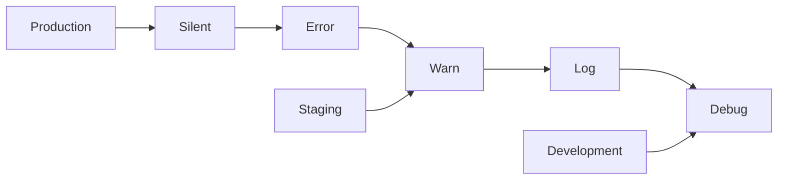

# Invariant Error Handler Design

## Overview

The Invariant Error Handler is a robust error handling and assertion utility designed for the Twenty CRM application. It provides a type-safe mechanism for runtime assertions, comprehensive logging capabilities, and graceful error handling throughout the full-stack TypeScript application.

This utility combines traditional invariant checking with configurable logging levels and custom error types, ensuring robust error handling across both frontend (React) and backend (NestJS) components.

## Architecture

### Component Structure



### Core Components

#### 1. InvariantError Class
- **Purpose**: Custom error type for invariant violations
- **Features**:
  - Extends native Error class
  - Maintains proper prototype chain
  - Supports numeric error codes with URL references
  - Stack trace optimization with `framesToPop`

#### 2. Invariant Function
- **Purpose**: Runtime assertion with type narrowing
- **Features**:
  - TypeScript assertion signature
  - Throws InvariantError on false conditions
  - Supports custom error messages

#### 3. Logging System
- **Purpose**: Configurable console logging wrapper
- **Features**:
  - Five verbosity levels: debug, log, warn, error, silent
  - Runtime verbosity control
  - Fallback to console.log for missing methods

## Error Handling Architecture

### Error Types and Codes

| Error Type | Code Range | Description |
|------------|------------|-------------|
| Validation Errors | 1000-1999 | Input validation failures |
| Authentication Errors | 2000-2999 | Auth/authorization issues |
| Database Errors | 3000-3999 | Data persistence problems |
| Business Logic Errors | 4000-4999 | Domain rule violations |
| System Errors | 5000-5999 | Infrastructure failures |

### Error Flow Patterns



## Integration Patterns

### Frontend Integration (React)

```typescript
// Component validation
const UserProfile = ({ user }) => {
  invariant(user, "User data is required for profile component");
  invariant(user.id, "User ID is required");
  
  return <div>{user.name}</div>;
};

// Error boundary integration
class ErrorBoundary extends Component {
  componentDidCatch(error: Error) {
    if (error instanceof InvariantError) {
      // Handle invariant violations specifically
      invariant.error('Invariant violation caught:', error.message);
    }
  }
}
```

### Backend Integration (NestJS)

```typescript
// Service validation
@Injectable()
export class UserService {
  async updateUser(id: string, data: UpdateUserDto) {
    invariant(id, 1001); // Numeric code for documentation
    invariant(data.email, "Email is required for user update");
    
    const user = await this.findUser(id);
    invariant(user, 1002); // User not found
    
    return this.userRepository.save({ ...user, ...data });
  }
}

// Global exception filter
@Catch(InvariantError)
export class InvariantExceptionFilter implements ExceptionFilter {
  catch(exception: InvariantError, host: ArgumentsHost) {
    const response = host.switchToHttp().getResponse();
    
    invariant.error('Invariant violation:', exception.message);
    
    response.status(400).json({
      statusCode: 400,
      message: exception.message,
      error: 'Invariant Violation'
    });
  }
}
```

## Logging Strategy

### Verbosity Levels



### Environment Configuration

| Environment | Default Level | Use Case |
|-------------|---------------|----------|
| Production | error | Critical errors only |
| Staging | warn | Warnings and errors |
| Development | debug | Full logging |
| Testing | silent | No console output |

## Testing Strategy

### Unit Testing Patterns

```typescript
describe('Invariant Error Handler', () => {
  describe('invariant function', () => {
    it('should throw InvariantError when condition is false', () => {
      expect(() => invariant(false, 'Test error')).toThrow(InvariantError);
    });
    
    it('should not throw when condition is true', () => {
      expect(() => invariant(true, 'Test error')).not.toThrow();
    });
    
    it('should handle numeric error codes', () => {
      expect(() => invariant(false, 1001)).toThrow('Invariant Violation: 1001');
    });
  });
  
  describe('logging system', () => {
    beforeEach(() => {
      jest.spyOn(console, 'log').mockImplementation();
      jest.spyOn(console, 'error').mockImplementation();
    });
    
    it('should respect verbosity levels', () => {
      setVerbosity('error');
      invariant.log('test message');
      expect(console.log).not.toHaveBeenCalled();
      
      invariant.error('error message');
      expect(console.error).toHaveBeenCalled();
    });
  });
});
```

### Integration Testing

```typescript
describe('Error Handler Integration', () => {
  it('should handle invariant violations in API endpoints', async () => {
    const response = await request(app)
      .post('/users')
      .send({ name: '' }); // Invalid data
      
    expect(response.status).toBe(400);
    expect(response.body.error).toBe('Invariant Violation');
  });
  
  it('should log errors appropriately', async () => {
    const logSpy = jest.spyOn(invariant, 'error');
    
    await request(app)
      .post('/users')
      .send({ invalid: 'data' });
      
    expect(logSpy).toHaveBeenCalledWith(
      expect.stringContaining('Invariant violation')
    );
  });
});
```

## Performance Considerations

### Optimization Strategies

1. **Lazy Message Evaluation**
   ```typescript
   // Expensive message computation only when needed
   invariant(condition, () => expensiveMessageComputation());
   ```

2. **Production Assertions**
   ```typescript
   // Conditional assertions based on environment
   if (process.env.NODE_ENV !== 'production') {
     invariant(complexValidation(), 'Development-only check');
   }
   ```

3. **Stack Trace Optimization**
   - `framesToPop` property removes invariant internals from stack traces
   - Improves debugging experience by focusing on application code

### Memory Management

- Error messages are stored efficiently
- Console method wrappers are created once and reused
- Verbosity level changes don't recreate wrapper functions

## Security Considerations

### Error Information Disclosure

```typescript
// Safe error messages for production
const getSafeErrorMessage = (error: InvariantError, isProduction: boolean) => {
  if (isProduction && typeof error.message === 'number') {
    return `System error occurred. Reference: ${error.message}`;
  }
  return error.message;
};
```

### Input Validation

```typescript
// Sanitize error messages to prevent injection
const sanitizeErrorMessage = (message: string | number): string => {
  if (typeof message === 'number') return message.toString();
  return message.replace(/[<>]/g, ''); // Basic XSS prevention
};
```

## Monitoring and Observability

### Error Tracking Integration

```typescript
// Sentry integration example
class InvariantError extends Error {
  constructor(message: string | number = genericMessage) {
    super(/* ... */);
    
    if (typeof window !== 'undefined' && window.Sentry) {
      window.Sentry.captureException(this, {
        tags: { errorType: 'invariant' },
        extra: { originalMessage: message }
      });
    }
  }
}
```

### Metrics Collection

- Track invariant violation frequency by error code
- Monitor error message patterns
- Analyze error distribution across application layers

## Migration Strategy

### Existing Error Handling

The Twenty application currently uses:
- `assert` utility in `packages/twenty-server/src/utils/assert.ts`
- `assertUnreachable` in `packages/twenty-shared/src/utils/assertUnreachable.ts`
- Various error throwing patterns throughout the codebase

### Integration Plan

1. **Phase 1**: Deploy invariant handler alongside existing utilities
2. **Phase 2**: Gradually replace existing assertion patterns
3. **Phase 3**: Standardize error codes and messages
4. **Phase 4**: Full integration with monitoring systems

### Compatibility Layer

```typescript
// Wrapper for existing assert function
export const legacyAssert = (condition: unknown, message?: string) => {
  invariant(condition, message);
};

// Migration helper
export const migrateToInvariant = (oldAssert: Function) => {
  return (condition: unknown, message?: string) => {
    console.warn('Legacy assert usage detected. Please migrate to invariant.');
    invariant(condition, message);
  };
};
```