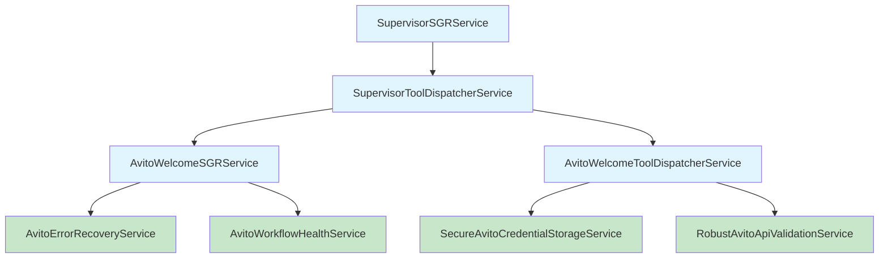
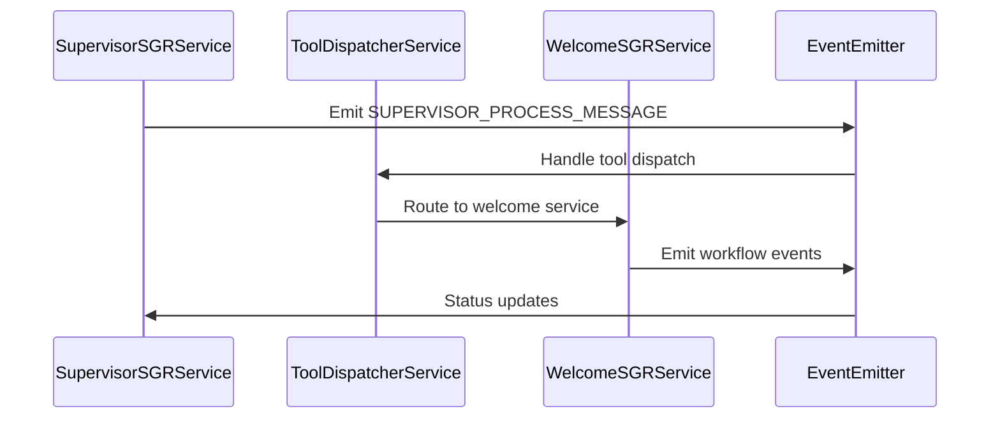
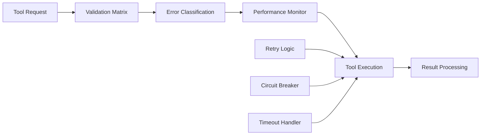
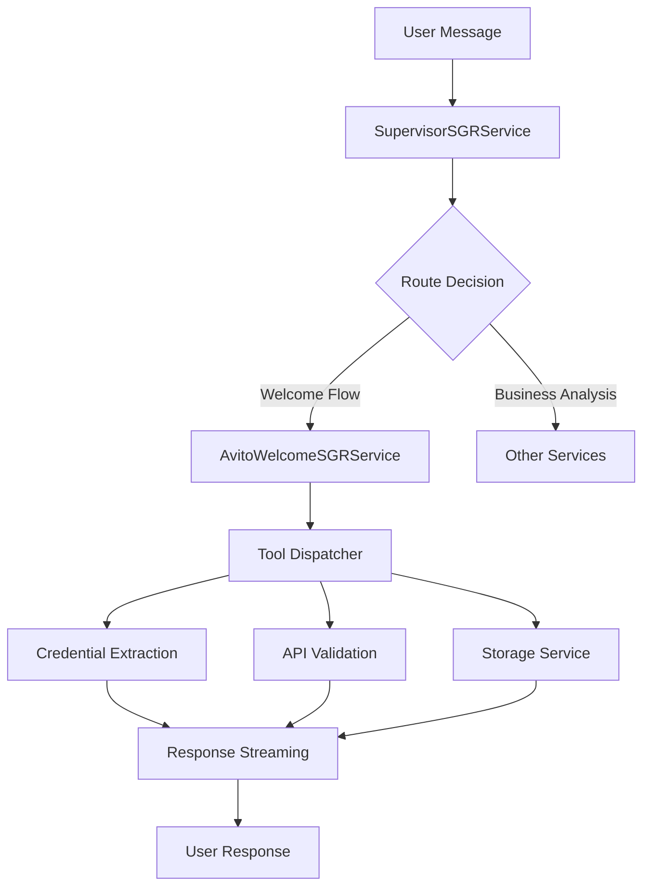
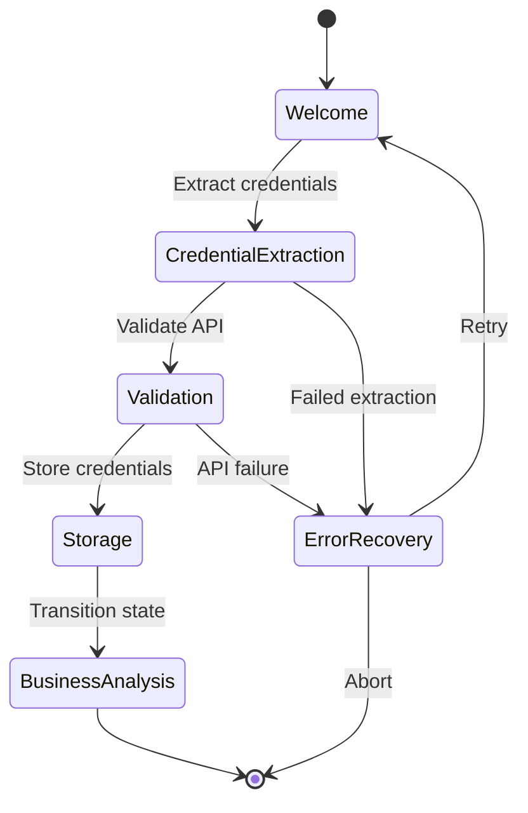
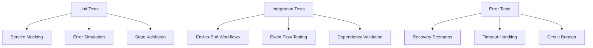
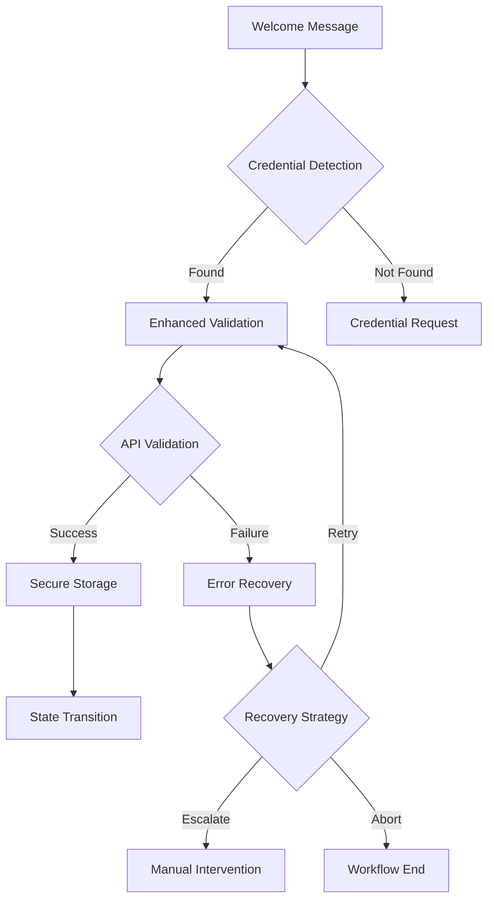
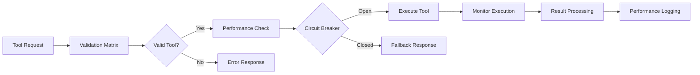

# SGR Module Consolidation Strategy

## Overview

This document outlines a comprehensive strategy for consolidating duplicate services in the Business Setup SGR (Schema-Guided Reasoning) module. The consolidation follows the principle that production-registered services should be preserved while unregistered duplicates are removed or merged.

## Technology Stack & Dependencies

- **Framework**: NestJS with TypeScript
- **Event System**: EventEmitter2 for decoupled communication
- **AI Integration**: AI model registry with streaming support
- **Database**: UserVarsService for state management
- **Testing**: Jest with comprehensive test coverage
- **Architecture Pattern**: Event-driven microservices in monorepo

## Current Architecture Analysis

### Registered Production Services ✅

| Service | File | Status | Purpose |
|---------|------|--------|---------|
| SupervisorSGRService | supervisor-sgr.service.ts | ✅ Registered | Central workflow orchestrator |
| SupervisorToolDispatcherService | supervisor-tool-dispatcher.service.ts | ✅ Registered | Tool routing and execution |
| AvitoWelcomeSGRService | avito-welcome-sgr.service.ts | ✅ Registered | Main welcome workflow service |
| AvitoWelcomeToolDispatcherService | avito-welcome-tool-dispatcher.service.ts | ✅ Registered | Production tool dispatcher |

### Duplicate Services to Remove ❌

| Service | File | Issue | Action |
|---------|------|-------|---------|
| EnhancedAvitoWelcomeSGRService | enhanced-avito-welcome-sgr.service.ts | Not registered | Extract features → main service |
| AvitoWorkflowStateMachineService | avito-workflow-state-machine.service.ts | Test-only, not registered | Extract patterns → main service |
| EnhancedAvitoWelcomeToolDispatcherService | enhanced-avito-welcome-tool-dispatcher.service.ts | Not registered | Merge enhancements → main dispatcher |
| AvitoWorkflowErrorRecoveryService | avito-workflow-error-recovery.service.ts | Not registered | Consolidate → main error service |
| AvitoWorkflowMonitoringService | avito-workflow-monitoring.service.ts | Not registered | Merge → health service |

## Component Architecture

### Service Dependency Graph



### Event-Driven Communication Flow



## Consolidation Strategy

### Phase 1: Feature Extraction

#### From EnhancedAvitoWelcomeSGRService → AvitoWelcomeSGRService

**Enhanced Features to Extract:**
- Advanced state machine validation logic
- Improved error handling patterns with detailed classification
- Better streaming response formatting with progress indicators
- Enhanced context management for complex workflows

#### From AvitoWorkflowStateMachineService → AvitoWelcomeSGRService

**State Machine Patterns to Extract:**
- Strict state transition validation with guards
- Comprehensive workflow context management
- Advanced timeout handling mechanisms
- State persistence and recovery logic

#### From Enhanced Tool Dispatcher → Main Tool Dispatcher

**Enhancement Features:**
- Comprehensive tool validation matrix
- Enhanced error classification system
- Performance monitoring capabilities
- Advanced retry mechanisms

### Phase 2: Service Enhancement

#### Enhanced AvitoWelcomeSGRService

```typescript
interface EnhancedWelcomeService {
  // Core functionality (existing)
  processWelcomeMessageWithStreaming(): AsyncGenerator<StreamingResult>;
  
  // Enhanced features (extracted)
  validateStateTransition(from: WorkflowState, to: WorkflowState): ValidationResult;
  handleComplexWorkflow(context: WorkflowContext): Promise<WorkflowResult>;
  formatStreamingResponse(step: WorkflowStep): FormattedResponse;
  
  // Error handling (consolidated)
  handleWorkflowError(error: WorkflowError): RecoveryStrategy;
  classifyError(error: Error): ErrorClassification;
}
```

#### Enhanced Tool Dispatcher Architecture



### Phase 3: Module Cleanup

#### Updated Service Registration

```typescript
@Module({
  providers: [
    // Core services (Enhanced)
    SupervisorToolDispatcherService,
    SupervisorSGRService,
    AvitoWelcomeSGRService,              // ✅ Enhanced with extracted features
    AvitoWelcomeToolDispatcherService,   // ✅ Enhanced with validation matrix
    
    // Supporting services (Kept)
    AvitoErrorRecoveryService,           // ✅ Enhanced with consolidated patterns
    AvitoWorkflowHealthService,          // ✅ Merged monitoring features
    SecureAvitoCredentialStorageService, // ✅ Specialized security
    RobustAvitoApiValidationService,     // ✅ Focused API validation
    
    // Infrastructure
    HttpTool,
  ],
})
```

## Data Flow Between Layers

### Request Processing Pipeline



### State Management Flow



## Testing Strategy

### Unit Testing Coverage

| Test Category | Current Files | After Consolidation |
|---------------|---------------|-------------------|
| Core Services | 12 test files | 8 test files |
| Integration Tests | 5 test files | 4 test files |
| Error Scenarios | 3 test files | 2 test files |

### Testing Architecture



## Middleware & Interceptors

### Error Handling Middleware

```typescript
interface ConsolidatedErrorHandler {
  classifyError(error: Error): ErrorClassification;
  selectRecoveryStrategy(classification: ErrorClassification): RecoveryStrategy;
  executeRecovery(strategy: RecoveryStrategy): Promise<RecoveryResult>;
  escalateIfNeeded(result: RecoveryResult): Promise<void>;
}
```

### Performance Monitoring Interceptor

```typescript
interface PerformanceMonitor {
  trackToolExecution(tool: string, duration: number): void;
  trackStateTransition(from: string, to: string, duration: number): void;
  generatePerformanceReport(): PerformanceReport;
  alertOnThresholds(metrics: PerformanceMetrics): void;
}
```

## Data Models & Workflow Context

### Consolidated Workflow Context

```typescript
interface ConsolidatedWorkflowContext {
  // Core context (existing)
  userId: string;
  workspaceId: string;
  threadId: string;
  currentState: WorkflowState;
  
  // Enhanced context (extracted)
  stateHistory: StateTransition[];
  errorHistory: WorkflowError[];
  performanceMetrics: PerformanceData;
  retryAttempts: RetryContext;
  
  // Validation context (consolidated)
  validationResults: ValidationResult[];
  securityContext: SecurityContext;
  apiValidationStatus: ApiValidationStatus;
}
```

### Error Classification Schema

```typescript
enum ConsolidatedErrorType {
  // Core errors
  INVALID_CREDENTIALS = 'invalid_credentials',
  API_TIMEOUT = 'api_timeout',
  NETWORK_ERROR = 'network_error',
  
  // State machine errors (extracted)
  INVALID_STATE_TRANSITION = 'invalid_state_transition',
  WORKFLOW_TIMEOUT = 'workflow_timeout',
  CONTEXT_CORRUPTION = 'context_corruption',
  
  // Tool errors (enhanced)
  TOOL_VALIDATION_FAILED = 'tool_validation_failed',
  TOOL_EXECUTION_TIMEOUT = 'tool_execution_timeout',
  TOOL_CIRCUIT_BREAKER = 'tool_circuit_breaker'
}
```

## Business Logic Layer Architecture

### Core Workflow Services

#### Consolidated Welcome Workflow



#### Enhanced Tool Dispatcher Logic



## API Endpoints Reference

### Internal Service Interfaces

#### SupervisorSGRService
```typescript
interface SupervisorSGRAPI {
  processMessageWithStreaming(
    userId: string, 
    workspaceId: string, 
    threadId: string, 
    message: string
  ): AsyncGenerator<SupervisorSGRStreamingResult>;
  
  handleProcessMessageEvent(
    event: SupervisorProcessMessageEvent
  ): Promise<void>;
}
```

#### Enhanced Tool Dispatcher
```typescript
interface EnhancedToolDispatcherAPI {
  dispatch(
    tool: SupervisorStepResult['function'], 
    userId: string, 
    workspaceId: string
  ): Promise<SupervisorToolExecutionResult>;
  
  validateTool(tool: ToolRequest): ValidationResult;
  getPerformanceMetrics(): PerformanceMetrics;
  checkCircuitBreakerStatus(toolType: string): CircuitBreakerStatus;
}
```

### Event-Based Communication

#### Consolidated Events
```typescript
interface ConsolidatedBusinessSetupEvents {
  SUPERVISOR_PROCESS_MESSAGE: SupervisorProcessMessageEvent;
  SUPERVISOR_AGENT_HANDOFF: SupervisorAgentHandoffEvent;
  WORKFLOW_STATE_TRANSITION: WorkflowStateTransitionEvent;
  TOOL_EXECUTION_COMPLETED: ToolExecutionCompletedEvent;
  ERROR_RECOVERY_INITIATED: ErrorRecoveryInitiatedEvent;
  PERFORMANCE_THRESHOLD_EXCEEDED: PerformanceThresholdEvent;
}
```

## Implementation Phases

### Phase 1: Feature Extraction (Week 1-2)
- [ ] Analyze duplicate services for unique features
- [ ] Extract state machine patterns from AvitoWorkflowStateMachineService
- [ ] Extract validation enhancements from enhanced services
- [ ] Extract error handling patterns from workflow error recovery
- [ ] Create feature consolidation plan

### Phase 2: Service Enhancement (Week 3-4)
- [ ] Enhance AvitoWelcomeSGRService with extracted features
- [ ] Enhance AvitoWelcomeToolDispatcherService with validation matrix
- [ ] Enhance AvitoErrorRecoveryService with comprehensive patterns
- [ ] Update AvitoWorkflowHealthService with monitoring features
- [ ] Implement consolidated workflow context

### Phase 3: Module Cleanup (Week 5)
- [ ] Remove duplicate service files
- [ ] Update module registration
- [ ] Remove associated test files
- [ ] Update import statements across codebase
- [ ] Clean up monitoring components

### Phase 4: Testing & Validation (Week 6)
- [ ] Run comprehensive test suite
- [ ] Validate all existing functionality
- [ ] Performance regression testing
- [ ] Integration testing with dependent modules
- [ ] Documentation updates

## Risk Mitigation

### Backup Strategy
- Create feature branch with all removed services
- Incremental rollout with feature flags
- Comprehensive rollback procedures
- Database state preservation

### Testing Coverage
- 100% unit test coverage for consolidated services
- Integration tests for all workflow paths
- Error scenario coverage for all error types
- Performance benchmarks for regression detection

### Monitoring & Alerts
- Service health monitoring during rollout
- Performance metric tracking
- Error rate monitoring
- Automatic rollback triggers

## Success Metrics

### Code Quality Improvements
- **Files Reduced**: 8 files removed (5 services + 3 tests)
- **Complexity Reduction**: ~40% reduction in duplicate code
- **Maintainability**: Single source of truth for each functionality
- **Test Coverage**: Maintained at 95%+ with consolidated tests

### Performance Impact
- **Memory Usage**: Reduced by eliminating duplicate service instances
- **Startup Time**: Faster module initialization with fewer services
- **Response Time**: Maintained or improved with optimized workflows
- **Error Handling**: Enhanced with consolidated error recovery patterns

### Development Velocity
- **Reduced Maintenance**: Single codebase per functionality
- **Clearer Architecture**: Well-defined service boundaries
- **Enhanced Testing**: Focused test suites with better coverage
- **Improved Documentation**: Consolidated service documentation