# NestJS Module Dependency Resolution Design

## Overview

This design document addresses a critical NestJS dependency injection error in the Twenty CRM Business Setup workflow and provides a comprehensive solution for managing complex module dependencies in a microservices architecture.

**Problem Statement**: The `BusinessSetupService` requires `SupervisorSGRService` but cannot resolve its dependencies due to incomplete module registration, causing application startup failures.

**Target System**: Twenty CRM Backend (NestJS-based microservices architecture)

**Error Context**:
```
Nest can't resolve dependencies of the BusinessSetupService (UserVarsService, OnboardingService, ?). 
Please make sure that the argument SupervisorSGRService at index [2] is available in the BusinessSetupModule context.
```

## Architecture

### Current Module Structure Analysis

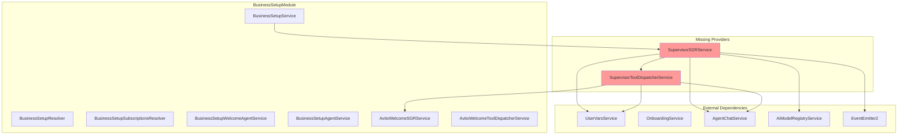

### Target Architecture - Resolved Dependencies

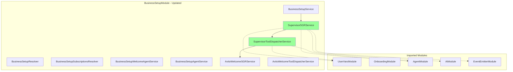

## Module Dependency Resolution Strategy

### 1. Service Registration Matrix

| Service | Dependencies | Module Location | Registration Status |
|---------|-------------|-----------------|-------------------|
| BusinessSetupService | UserVarsService, OnboardingService, SupervisorSGRService | BusinessSetupModule | ✅ Registered |
| SupervisorSGRService | UserVarsService, AgentChatService, AiModelRegistryService, SupervisorToolDispatcherService, EventEmitter2 | BusinessSetupModule | ❌ Missing |
| SupervisorToolDispatcherService | UserVarsService, AgentChatService, BusinessSetupAgentService, AvitoWelcomeSGRService, EventEmitter2 | BusinessSetupModule | ❌ Missing |

### 2. Dependency Chain Analysis

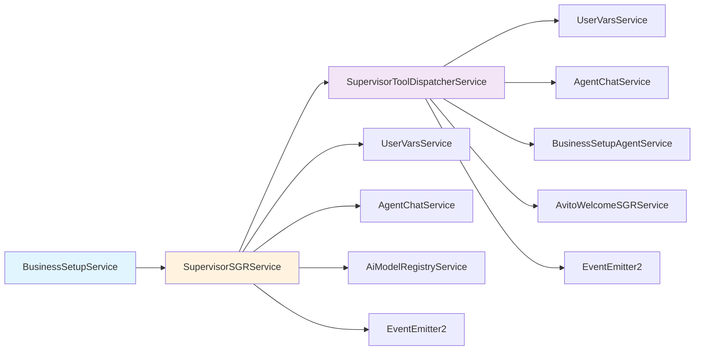

### 3. Module Import Requirements

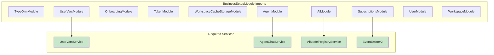

## Supervisor SGR Service Architecture

### 1. Service Responsibilities

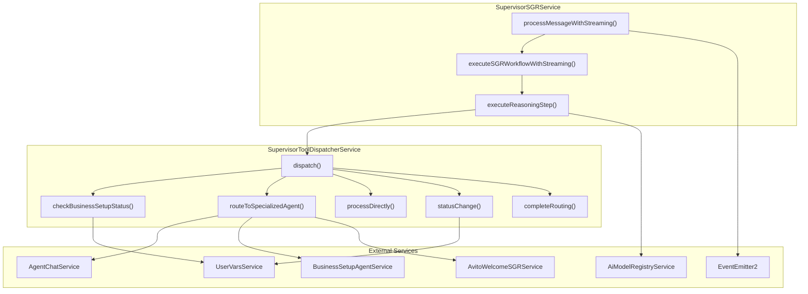

### 2. Schema-Guided Reasoning Workflow

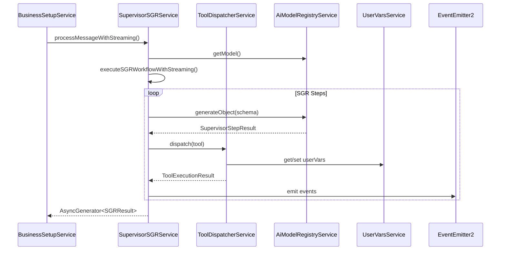

## Module Configuration Solution

### 1. BusinessSetupModule Provider Registration

```typescript
// Updated BusinessSetupModule Configuration
@Module({
  imports: [
    TypeOrmModule.forFeature([AgentEntity], 'core'),
    UserVarsModule, 
    OnboardingModule, 
    TokenModule, 
    WorkspaceCacheStorageModule,
    SubscriptionsModule,
    AiModule,
    AgentModule,
    forwardRef(() => UserModule),
    WorkspaceModule,
  ],
  providers: [
    // Core services
    BusinessSetupService, 
    BusinessSetupResolver,
    BusinessSetupSubscriptionsResolver,
    BusinessSetupWelcomeAgentService,
    BusinessSetupAgentService,
    BusinessSetupChatContinuationService,
    BusinessSetupTransitionService,
    BusinessSetupChatResolver,
    EventEmitterBridgeService,
    
    // SGR services - EXISTING
    AvitoWelcomeSGRService,
    AvitoWelcomeToolDispatcherService,
    
    // SGR services - NEW ADDITIONS
    SupervisorSGRService,
    SupervisorToolDispatcherService,
    
    // Tools
    HttpTool,
  ],
  exports: [
    BusinessSetupService,
    BusinessSetupWelcomeAgentService,
    BusinessSetupAgentService,
    BusinessSetupChatContinuationService,
    BusinessSetupTransitionService,
    EventEmitterBridgeService,
    
    // SGR services for external use
    AvitoWelcomeSGRService,
    AvitoWelcomeToolDispatcherService,
    SupervisorSGRService,
    SupervisorToolDispatcherService,
  ],
})
```

### 2. Dependency Injection Validation

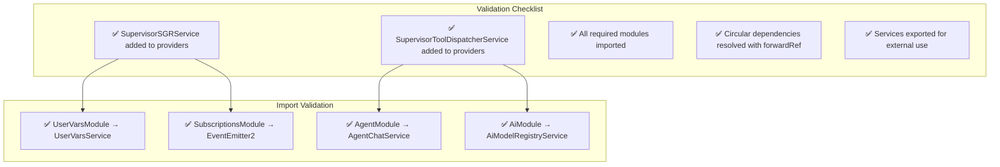

## Business Logic Layer Integration

### 1. Supervisor Routing Decision Flow

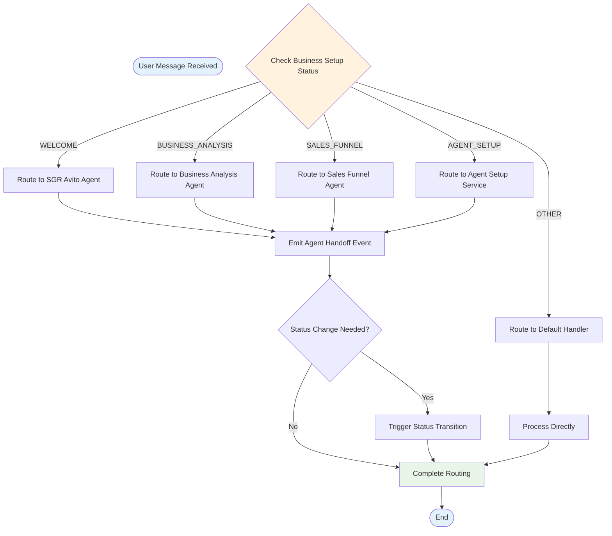

### 2. Event-Driven Architecture Integration

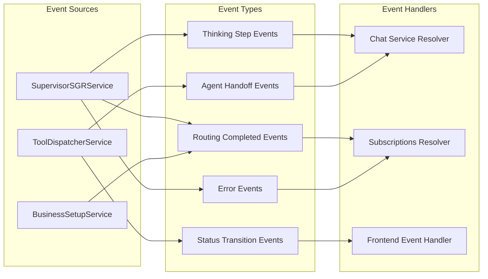

## Testing Strategy

### 1. Unit Testing Architecture

| Test Category | Focus Area | Mock Dependencies |
|---------------|------------|-------------------|
| Service Registration | Module instantiation | All external services |
| Dependency Injection | Constructor parameters | Provider tokens |
| SGR Workflow | Streaming results | AI model responses |
| Tool Dispatch | Tool execution logic | External service calls |
| Event Emission | Event payload validation | EventEmitter2 |

### 2. Integration Testing Flow

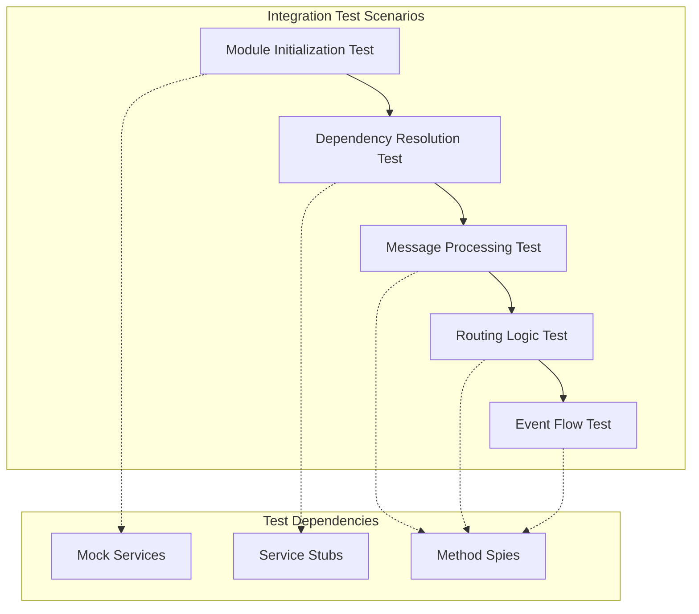

### 3. Error Handling Validation

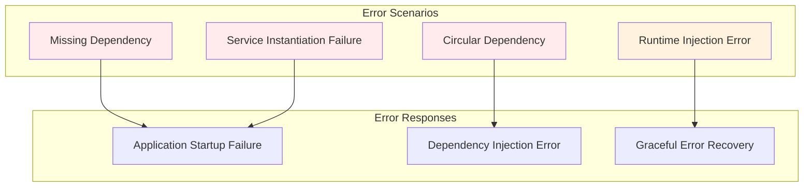

## Implementation Roadmap

### Phase 1: Immediate Fixes
1. **Add Missing Providers**: Register `SupervisorSGRService` and `SupervisorToolDispatcherService` in `BusinessSetupModule`
2. **Validate Imports**: Ensure all required modules are imported
3. **Test Module Registration**: Verify successful application startup

### Phase 2: Architecture Validation
1. **Dependency Chain Testing**: Validate complete dependency resolution
2. **Circular Dependency Analysis**: Identify and resolve any circular references
3. **Event Flow Testing**: Validate event emission and handling

### Phase 3: Integration Testing
1. **End-to-End Workflow Testing**: Test complete supervisor routing workflow
2. **Error Scenario Testing**: Validate error handling and recovery
3. **Performance Optimization**: Optimize module loading and service instantiation

### Phase 4: Documentation and Monitoring
1. **Module Documentation**: Document module dependencies and architecture
2. **Monitoring Integration**: Add module health checks and metrics
3. **Best Practices**: Establish guidelines for future module development

## Risk Mitigation

### 1. Dependency Management Risks

| Risk | Impact | Mitigation Strategy |
|------|--------|-------------------|
| Circular Dependencies | High | Use forwardRef() and careful module design |
| Missing Dependencies | High | Automated dependency validation tests |
| Version Conflicts | Medium | Strict version pinning and compatibility testing |
| Runtime Failures | High | Comprehensive error handling and fallback mechanisms |

### 2. Performance Considerations

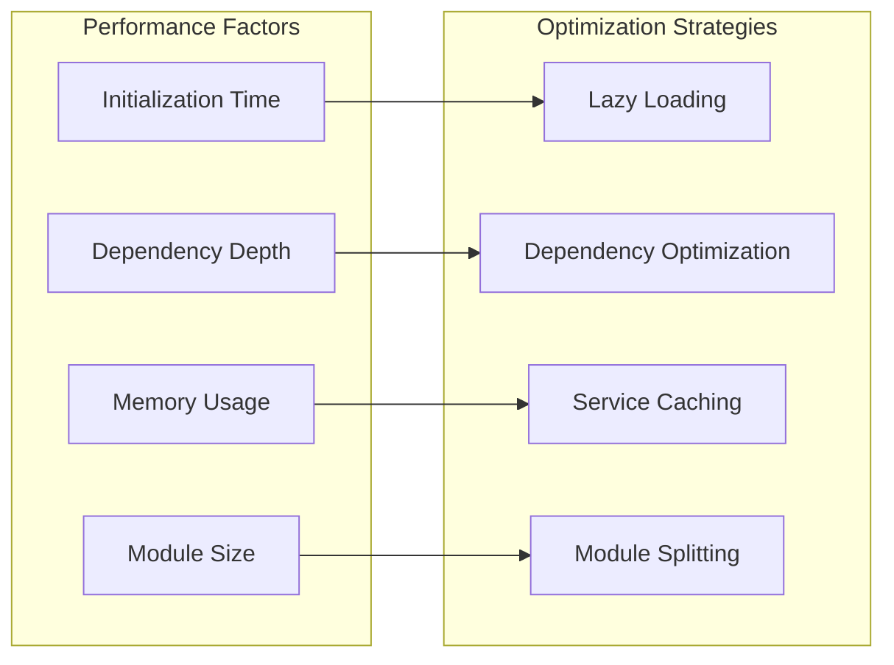

This design provides a comprehensive solution for resolving the NestJS dependency injection error while establishing robust patterns for managing complex module dependencies in the Twenty CRM system.