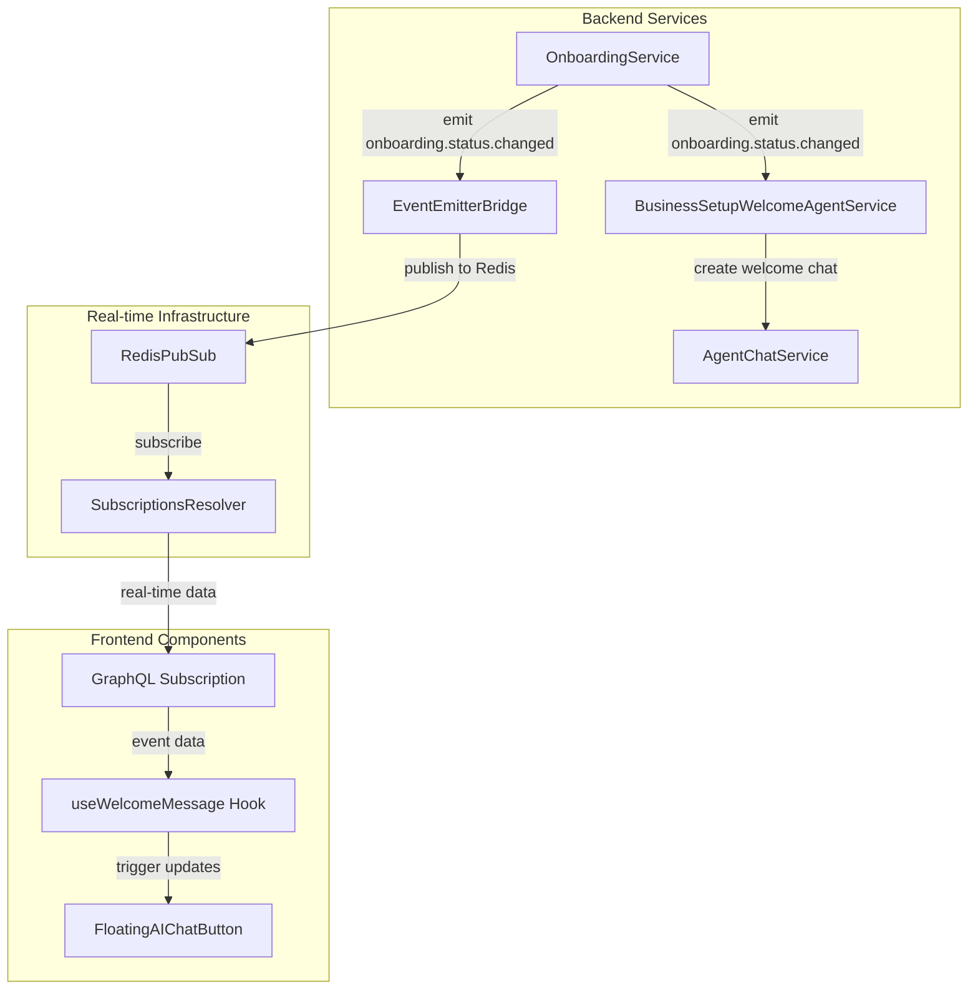
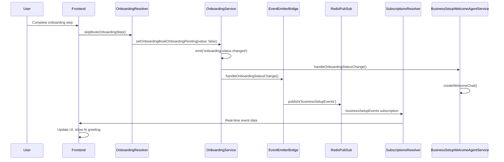

# Onboarding Events Bridge Design

## Overview

This document outlines the design for bridging backend NestJS EventEmitter2 events to frontend real-time communication to fix the AI agent greeting issue after onboarding completion. The system will enable seamless communication between backend business logic events and frontend UI updates through GraphQL subscriptions.

**Problem Statement:**
- OnboardingService emits `onboarding.status.changed` events using NestJS EventEmitter2
- BusinessSetupWelcomeAgentService listens to these events and creates welcome chats
- Frontend has no real-time visibility into these events
- AI agent doesn't appear or greet users after onboarding completion

**Solution:**
Create a bridge that translates local backend events into GraphQL subscription-compatible messages using the existing RedisPubSub infrastructure.

## Technology Stack & Dependencies

### Backend Dependencies
- **NestJS EventEmitter2**: Local event emission (`@nestjs/event-emitter`)
- **RedisPubSub**: GraphQL subscription infrastructure (`graphql-redis-subscriptions`)
- **GraphQL Subscriptions**: Real-time client communication (`@nestjs/graphql`)
- **Redis**: Message broker for pub/sub operations

### Frontend Dependencies
- **Apollo Client**: GraphQL subscriptions handling
- **React Hooks**: State management for real-time updates
- **TypeScript**: Type safety for event payloads

## Architecture

### System Overview



### Event Flow Architecture



## Component Architecture

### Backend Components

#### 1. EventEmitterBridge Service

**Location**: `packages/twenty-server/src/engine/core-modules/business-setup/services/event-emitter-bridge.service.ts`

**Purpose**: Translates NestJS EventEmitter2 events to RedisPubSub messages

```typescript
interface EventEmitterBridgeService {
  // Event handlers
  handleOnboardingStatusChange(payload: OnboardingStatusChangedEvent): Promise<void>
  handleBusinessSetupChatEvents(payload: BusinessSetupChatEvent): Promise<void>
  
  // Publishing methods
  publishToSubscription(channel: string, payload: any): Promise<void>
  formatEventForSubscription(event: BusinessSetupEvent): SubscriptionPayload
}
```

**Key Features**:
- Listens to all business setup related EventEmitter2 events
- Formats events for GraphQL subscription compatibility
- Publishes to Redis with proper channel naming
- Handles error scenarios and retries

#### 2. BusinessSetupSubscriptionsResolver

**Location**: `packages/twenty-server/src/engine/core-modules/business-setup/business-setup-subscriptions.resolver.ts`

**Purpose**: Provides GraphQL subscriptions for business setup events

```typescript
interface BusinessSetupSubscriptionsResolver {
  onBusinessSetupEvent(input: BusinessSetupEventInput): AsyncIterableIterator<BusinessSetupEventPayload>
  onOnboardingStatusChanged(input: OnboardingEventInput): AsyncIterableIterator<OnboardingStatusChangedPayload>
  onAIAgentEvents(input: AIAgentEventInput): AsyncIterableIterator<AIAgentEventPayload>
}
```

#### 3. Event Type Definitions

**Location**: `packages/twenty-server/src/engine/core-modules/business-setup/types/`

**Event Categories**:
- **Onboarding Events**: Status changes, step completion
- **AI Agent Events**: Chat creation, message handling, errors
- **Business Setup Events**: Step transitions, configuration updates

### Frontend Components

#### 1. GraphQL Subscription Hooks

**Location**: `packages/twenty-front/src/modules/business-setup/hooks/`

```typescript
interface UseBusinessSetupEventsReturn {
  events: BusinessSetupEvent[]
  isConnected: boolean
  lastEvent: BusinessSetupEvent | null
  connectionError: Error | null
}

interface UseWelcomeMessageReturn {
  showWelcomeMessage: boolean
  welcomeThread: ChatThread | null
  isLoading: boolean
  error: Error | null
}
```

#### 2. Real-time State Management

**Location**: `packages/twenty-front/src/modules/business-setup/providers/BusinessSetupEventProvider.tsx`

**Purpose**: Centralized state management for business setup events

```typescript
interface BusinessSetupEventContextValue {
  // Event state
  currentEvents: BusinessSetupEvent[]
  onboardingStatus: OnboardingStatus
  aiAgentStatus: AIAgentStatus
  
  // Actions
  markEventAsProcessed: (eventId: string) => void
  resetEventState: () => void
  
  // Subscription management
  isSubscriptionActive: boolean
  reconnectSubscription: () => void
}
```

## API Endpoints Reference

### GraphQL Subscriptions

#### Business Setup Events Subscription

```graphql
subscription OnBusinessSetupEvents($input: BusinessSetupEventInput!) {
  onBusinessSetupEvent(input: $input) {
    id
    type
    payload {
      userId
      workspaceId
      timestamp
      data
    }
    metadata {
      source
      retryCount
      processingTime
    }
  }
}
```

**Input Types**:
```typescript
interface BusinessSetupEventInput {
  userId?: string
  workspaceId: string
  eventTypes?: BusinessSetupEventType[]
  includeMetadata?: boolean
}

enum BusinessSetupEventType {
  ONBOARDING_STATUS_CHANGED = "ONBOARDING_STATUS_CHANGED"
  AI_AGENT_WELCOME_CHAT_CREATED = "AI_AGENT_WELCOME_CHAT_CREATED"
  AI_AGENT_WELCOME_CHAT_FAILED = "AI_AGENT_WELCOME_CHAT_FAILED"
  BUSINESS_SETUP_STEP_COMPLETED = "BUSINESS_SETUP_STEP_COMPLETED"
}
```

#### Onboarding Status Subscription

```graphql
subscription OnOnboardingStatusChanged($input: OnboardingEventInput!) {
  onOnboardingStatusChanged(input: $input) {
    userId
    workspaceId
    status
    previousStatus
    timestamp
    stepData {
      completedSteps
      currentStep
      nextStep
    }
  }
}
```

#### AI Agent Events Subscription

```graphql
subscription OnAIAgentEvents($input: AIAgentEventInput!) {
  onAIAgentEvents(input: $input) {
    eventType
    threadId
    messageId
    status
    error {
      code
      message
      details
    }
    timestamp
  }
}
```

### Authentication Requirements

All subscriptions require:
- **User Authentication**: Valid JWT token
- **Workspace Authorization**: User must belong to workspace
- **Event Filtering**: Users only receive events for their workspace/user context

## Data Models & Event Schemas

### Core Event Types

#### OnboardingStatusChangedEvent
```typescript
interface OnboardingStatusChangedEvent {
  userId: string
  workspaceId: string
  status: OnboardingStatus
  previousStatus: OnboardingStatus
  timestamp: Date
  stepData?: {
    completedSteps: string[]
    skippedSteps: string[]
    currentStep: string
  }
}
```

#### AIAgentWelcomeChatEvent
```typescript
interface AIAgentWelcomeChatEvent {
  eventType: 'CHAT_CREATED' | 'CHAT_FAILED' | 'MESSAGE_SENT'
  userId: string
  workspaceId: string
  threadId?: string
  messageId?: string
  content?: string
  error?: {
    code: string
    message: string
    retryCount: number
  }
  timestamp: Date
}
```

#### BusinessSetupProgressEvent
```typescript
interface BusinessSetupProgressEvent {
  userId: string
  workspaceId: string
  currentStep: BusinessSetupStep
  previousStep?: BusinessSetupStep
  progress: {
    completedSteps: number
    totalSteps: number
    percentage: number
  }
  timestamp: Date
}
```

### Subscription Payload Wrappers

#### SubscriptionEventPayload
```typescript
interface SubscriptionEventPayload<T = any> {
  id: string
  type: BusinessSetupEventType
  payload: T
  metadata: {
    source: string
    version: string
    timestamp: Date
    processingTime?: number
    retryCount?: number
  }
}
```

## Business Logic Layer

### Event Processing Architecture

#### 1. Event Listener Registration

```mermaid
graph LR
    subgraph "Event Sources"
        OS[OnboardingService]
        BSWAS[BusinessSetupWelcomeAgentService]
        BS[BusinessSetupService]
    end
    
    subgraph "Event Bridge"
        EEB[EventEmitterBridge]
        EH1[OnboardingEventHandler]
        EH2[AIAgentEventHandler]
        EH3[BusinessSetupEventHandler]
    end
    
    subgraph "Subscription System"
        RP[RedisPubSub]
        SR[SubscriptionsResolver]
    end
    
    OS -->|onboarding.*| EH1
    BSWAS -->|ai-agent.*| EH2
    BS -->|business-setup.*| EH3
    
    EH1 --> EEB
    EH2 --> EEB
    EH3 --> EEB
    
    EEB --> RP
    RP --> SR
```



#### 2. Event Processing Pipeline

Each event follows this processing pipeline:

1. **Event Emission**: Service emits event using EventEmitter2
2. **Event Capture**: EventEmitterBridge captures event
3. **Event Transformation**: Convert to subscription-compatible format
4. **Event Publishing**: Publish to Redis channel
5. **Event Subscription**: Frontend receives via GraphQL subscription
6. **Event Processing**: Frontend updates UI state

#### 3. Error Handling Strategy

```typescript
interface EventProcessingStrategy {
  // Retry configuration
  maxRetries: number
  retryDelayMs: number
  exponentialBackoff: boolean
  
  // Error handling
  onError: (error: Error, event: BusinessSetupEvent) => void
  onMaxRetriesExceeded: (event: BusinessSetupEvent) => void
  
  // Circuit breaker
  circuitBreakerEnabled: boolean
  failureThreshold: number
  resetTimeoutMs: number
}
```

### Event Handler Implementations

#### OnboardingEventHandler
```typescript
class OnboardingEventHandler {
  @OnEvent('onboarding.status.changed')
  async handleStatusChange(event: OnboardingStatusChangedEvent): Promise<void> {
    // Transform event for subscription
    const subscriptionEvent = this.transformEvent(event)
    
    // Publish to subscription channel
    await this.eventEmitterBridge.publishToSubscription(
      'businessSetupEvents',
      subscriptionEvent
    )
    
    // Handle specific status transitions
    if (event.status === OnboardingStatus.COMPLETED) {
      await this.handleOnboardingCompletion(event)
    }
  }
  
  private async handleOnboardingCompletion(event: OnboardingStatusChangedEvent): Promise<void> {
    // Trigger business setup initialization
    await this.eventEmitterBridge.publishToSubscription(
      'businessSetupEvents',
      {
        type: 'BUSINESS_SETUP_READY',
        payload: {
          userId: event.userId,
          workspaceId: event.workspaceId,
          trigger: 'ONBOARDING_COMPLETED'
        }
      }
    )
  }
}
```

#### AIAgentEventHandler
```typescript
class AIAgentEventHandler {
  @OnEvent('ai-agent.welcome.chat-created')
  async handleChatCreated(event: AIAgentWelcomeChatEvent): Promise<void> {
    await this.eventEmitterBridge.publishToSubscription(
      'aiAgentEvents',
      {
        type: 'WELCOME_CHAT_READY',
        payload: {
          userId: event.userId,
          workspaceId: event.workspaceId,
          threadId: event.threadId,
          messageId: event.messageId,
          status: 'READY',
          timestamp: event.timestamp
        }
      }
    )
  }
  
  @OnEvent('ai-agent.welcome.chat-creation-failed')
  async handleChatFailed(event: AIAgentWelcomeChatEvent): Promise<void> {
    await this.eventEmitterBridge.publishToSubscription(
      'aiAgentEvents',
      {
        type: 'WELCOME_CHAT_ERROR',
        payload: {
          userId: event.userId,
          workspaceId: event.workspaceId,
          error: event.error,
          retryAvailable: event.error?.retryCount < 3,
          timestamp: event.timestamp
        }
      }
    )
  }
}
```

## Routing & Navigation

### Subscription Channel Architecture

#### Channel Naming Convention
```typescript
const SUBSCRIPTION_CHANNELS = {
  // Main business setup events
  BUSINESS_SETUP_EVENTS: 'businessSetupEvents',
  
  // Specific event categories
  ONBOARDING_EVENTS: 'onboardingEvents',
  AI_AGENT_EVENTS: 'aiAgentEvents',
  CHAT_EVENTS: 'chatEvents',
  
  // User-specific channels
  USER_EVENTS: (userId: string) => `user:${userId}:events`,
  WORKSPACE_EVENTS: (workspaceId: string) => `workspace:${workspaceId}:events`,
}
```

#### Event Routing Logic
```typescript
class EventRouter {
  routeEvent(event: BusinessSetupEvent): string[] {
    const channels: string[] = []
    
    // Add to main channel
    channels.push(SUBSCRIPTION_CHANNELS.BUSINESS_SETUP_EVENTS)
    
    // Add to category-specific channel
    if (event.type.startsWith('ONBOARDING_')) {
      channels.push(SUBSCRIPTION_CHANNELS.ONBOARDING_EVENTS)
    }
    
    if (event.type.startsWith('AI_AGENT_')) {
      channels.push(SUBSCRIPTION_CHANNELS.AI_AGENT_EVENTS)
    }
    
    // Add to user/workspace specific channels
    channels.push(SUBSCRIPTION_CHANNELS.USER_EVENTS(event.payload.userId))
    channels.push(SUBSCRIPTION_CHANNELS.WORKSPACE_EVENTS(event.payload.workspaceId))
    
    return channels
  }
}
```

## State Management

### Frontend Event State Architecture

#### BusinessSetupEventStore
```typescript
interface BusinessSetupEventStore {
  // Event storage
  events: Map<string, BusinessSetupEvent>
  eventHistory: BusinessSetupEvent[]
  
  // Connection state
  subscriptionStatus: 'CONNECTING' | 'CONNECTED' | 'DISCONNECTED' | 'ERROR'
  connectionError: Error | null
  lastHeartbeat: Date | null
  
  // Processing state
  processingQueue: BusinessSetupEvent[]
  processedEvents: Set<string>
  failedEvents: Map<string, Error>
  
  // UI state
  showWelcomeMessage: boolean
  activeThread: ChatThread | null
  isInitialized: boolean
}
```

#### Event Processing Actions
```typescript
interface BusinessSetupEventActions {
  // Event management
  addEvent: (event: BusinessSetupEvent) => void
  markEventProcessed: (eventId: string) => void
  retryFailedEvent: (eventId: string) => Promise<void>
  clearEventHistory: () => void
  
  // Connection management
  connectSubscription: () => Promise<void>
  disconnectSubscription: () => void
  handleConnectionError: (error: Error) => void
  
  // UI state management
  setWelcomeMessageVisible: (visible: boolean) => void
  setActiveThread: (thread: ChatThread | null) => void
  initializeState: () => Promise<void>
}
```

### React Context Implementation

#### BusinessSetupEventProvider
```typescript
const BusinessSetupEventProvider: React.FC<{ children: React.ReactNode }> = ({ children }) => {
  const [state, setState] = useState<BusinessSetupEventStore>(initialState)
  const { user, workspace } = useAuth()
  
  // Subscription management
  const { data, loading, error } = useSubscription(BUSINESS_SETUP_EVENTS_SUBSCRIPTION, {
    variables: {
      input: {
        userId: user?.id,
        workspaceId: workspace?.id,
        eventTypes: [
          'ONBOARDING_STATUS_CHANGED',
          'AI_AGENT_WELCOME_CHAT_CREATED',
          'AI_AGENT_WELCOME_CHAT_FAILED'
        ]
      }
    },
    onSubscriptionData: ({ subscriptionData }) => {
      if (subscriptionData.data?.onBusinessSetupEvent) {
        handleNewEvent(subscriptionData.data.onBusinessSetupEvent)
      }
    },
    onError: handleSubscriptionError
  })
  
  const handleNewEvent = useCallback((event: BusinessSetupEvent) => {
    setState(prev => ({
      ...prev,
      events: new Map(prev.events).set(event.id, event),
      eventHistory: [event, ...prev.eventHistory].slice(0, 100), // Keep last 100 events
      processingQueue: [...prev.processingQueue, event]
    }))
    
    // Process event based on type
    processEvent(event)
  }, [])
  
  const processEvent = useCallback(async (event: BusinessSetupEvent) => {
    try {
      switch (event.type) {
        case 'ONBOARDING_STATUS_CHANGED':
          await handleOnboardingStatusChanged(event)
          break
        case 'AI_AGENT_WELCOME_CHAT_CREATED':
          await handleWelcomeChatCreated(event)
          break
        case 'AI_AGENT_WELCOME_CHAT_FAILED':
          await handleWelcomeChatFailed(event)
          break
      }
      
      // Mark as processed
      setState(prev => ({
        ...prev,
        processedEvents: new Set(prev.processedEvents).add(event.id),
        processingQueue: prev.processingQueue.filter(e => e.id !== event.id)
      }))
    } catch (error) {
      setState(prev => ({
        ...prev,
        failedEvents: new Map(prev.failedEvents).set(event.id, error),
        processingQueue: prev.processingQueue.filter(e => e.id !== event.id)
      }))
    }
  }, [])
  
  const contextValue: BusinessSetupEventContextValue = {
    ...state,
    addEvent: handleNewEvent,
    markEventProcessed: (eventId) => {
      setState(prev => ({
        ...prev,
        processedEvents: new Set(prev.processedEvents).add(eventId)
      }))
    },
    // ... other actions
  }
  
  return (
    <BusinessSetupEventContext.Provider value={contextValue}>
      {children}
    </BusinessSetupEventContext.Provider>
  )
}
```

## Testing Strategy

### Backend Testing

#### Unit Tests
```typescript
describe('EventEmitterBridge', () => {
  let service: EventEmitterBridge
  let mockPubSub: jest.Mocked<RedisPubSub>
  
  beforeEach(() => {
    const module = Test.createTestingModule({
      providers: [
        EventEmitterBridge,
        { provide: 'PUB_SUB', useValue: mockPubSub }
      ]
    }).compile()
    
    service = module.get<EventEmitterBridge>(EventEmitterBridge)
  })
  
  it('should publish onboarding events to subscription channel', async () => {
    const event: OnboardingStatusChangedEvent = {
      userId: 'user-1',
      workspaceId: 'workspace-1',
      status: OnboardingStatus.COMPLETED,
      previousStatus: OnboardingStatus.BOOK_ONBOARDING,
      timestamp: new Date()
    }
    
    await service.handleOnboardingStatusChange(event)
    
    expect(mockPubSub.publish).toHaveBeenCalledWith(
      'businessSetupEvents',
      expect.objectContaining({
        type: 'ONBOARDING_STATUS_CHANGED',
        payload: event
      })
    )
  })
})
```

#### Integration Tests
```typescript
describe('BusinessSetup Subscriptions Integration', () => {
  let app: INestApplication
  let eventEmitter: EventEmitter2
  
  beforeEach(async () => {
    const module = await Test.createTestingModule({
      imports: [BusinessSetupModule, SubscriptionsModule]
    }).compile()
    
    app = module.createNestApplication()
    eventEmitter = module.get<EventEmitter2>(EventEmitter2)
    await app.init()
  })
  
  it('should receive subscription events when onboarding status changes', async () => {
    const subscriptionClient = createSubscriptionClient()
    const events: BusinessSetupEvent[] = []
    
    subscriptionClient.subscribe({
      query: BUSINESS_SETUP_EVENTS_SUBSCRIPTION,
      variables: { input: { workspaceId: 'test-workspace' } }
    }).subscribe({
      next: (data) => events.push(data.onBusinessSetupEvent)
    })
    
    // Emit onboarding status change
    eventEmitter.emit('onboarding.status.changed', {
      userId: 'test-user',
      workspaceId: 'test-workspace',
      status: OnboardingStatus.COMPLETED,
      previousStatus: OnboardingStatus.BOOK_ONBOARDING,
      timestamp: new Date()
    })
    
    // Wait for event processing
    await new Promise(resolve => setTimeout(resolve, 100))
    
    expect(events).toHaveLength(1)
    expect(events[0].type).toBe('ONBOARDING_STATUS_CHANGED')
  })
})
```

### Frontend Testing

#### Hook Testing
```typescript
describe('useWelcomeMessage', () => {
  let mockSubscription: MockedResponse
  
  beforeEach(() => {
    mockSubscription = {
      request: {
        query: BUSINESS_SETUP_EVENTS_SUBSCRIPTION,
        variables: { input: { workspaceId: 'test-workspace' } }
      },
      result: {
        data: {
          onBusinessSetupEvent: {
            id: 'event-1',
            type: 'AI_AGENT_WELCOME_CHAT_CREATED',
            payload: {
              userId: 'test-user',
              workspaceId: 'test-workspace',
              threadId: 'thread-1',
              timestamp: new Date()
            }
          }
        }
      }
    }
  })
  
  it('should show welcome message when chat is created', async () => {
    const { result } = renderHook(() => useWelcomeMessage(), {
      wrapper: ({ children }) => (
        <MockedProvider mocks={[mockSubscription]}>
          <BusinessSetupEventProvider>
            {children}
          </BusinessSetupEventProvider>
        </MockedProvider>
      )
    })
    
    await waitFor(() => {
      expect(result.current.showWelcomeMessage).toBe(true)
      expect(result.current.welcomeThread).toEqual(
        expect.objectContaining({ id: 'thread-1' })
      )
    })
  })
})
```

#### Component Integration Testing
```typescript
describe('FloatingAIChatButton Integration', () => {
  it('should appear when welcome chat is created', async () => {
    const mockEvent: BusinessSetupEvent = {
      id: 'event-1',
      type: 'AI_AGENT_WELCOME_CHAT_CREATED',
      payload: {
        userId: 'test-user',
        workspaceId: 'test-workspace',
        threadId: 'thread-1',
        timestamp: new Date()
      }
    }
    
    render(
      <MockedProvider>
        <BusinessSetupEventProvider>
          <FloatingAIChatButton />
        </BusinessSetupEventProvider>
      </MockedProvider>
    )
    
    // Simulate receiving subscription event
    act(() => {
      fireEvent(window, new CustomEvent('business-setup-event', {
        detail: mockEvent
      }))
    })
    
    await waitFor(() => {
      expect(screen.getByTestId('floating-ai-chat-button')).toBeInTheDocument()
      expect(screen.getByText(/welcome/i)).toBeInTheDocument()
    })
  })
})
```