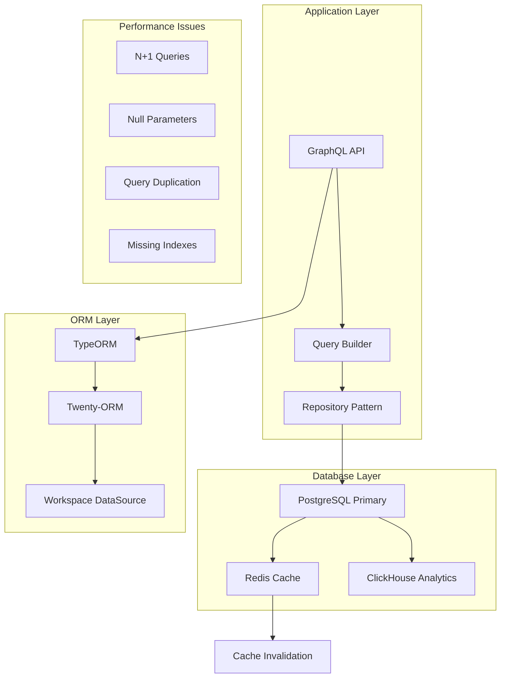
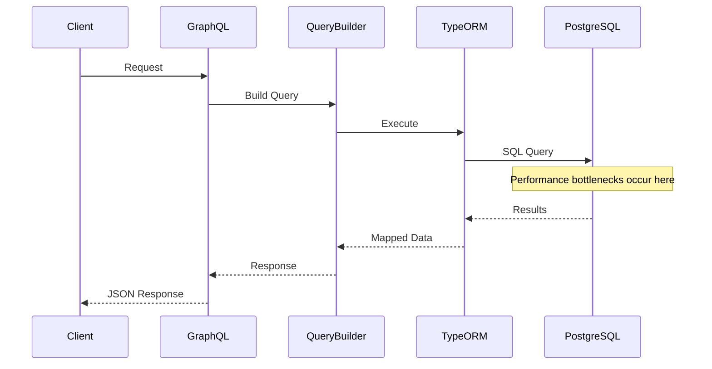
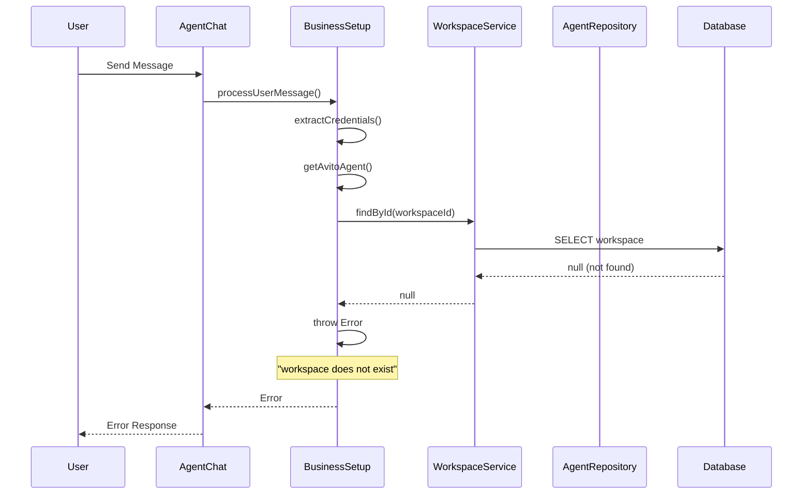
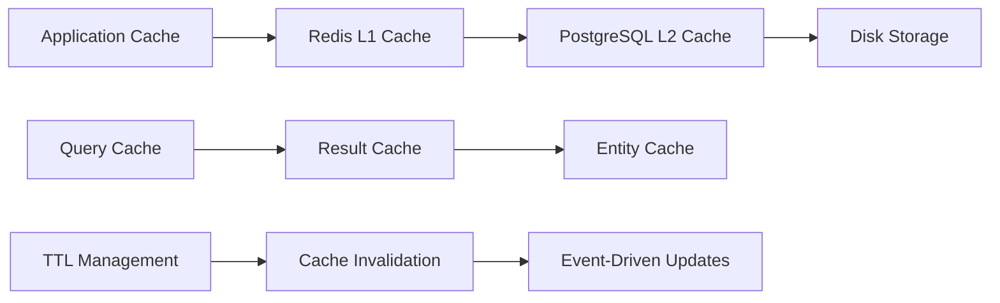

# Query Performance Analysis Design

## Overview

This document analyzes the performance issues identified in the Twenty CRM database queries and provides a comprehensive approach to optimize database operations, reduce redundant queries, and improve overall system performance.

## Problem Analysis

### Identified Performance Issues

#### 1. Redundant Query Patterns
The logs reveal significant query repetition and N+1 query problems:

```
- Company queries executed 10+ times with identical patterns
- Workflow-related queries with null parameters causing inefficient lookups
- Repeated SELECT COUNT(*) operations on the same table
- Multiple identical pagination queries (LIMIT 61)
```

#### 2. Null Parameter Queries
Multiple queries executing with null parameters, indicating potential issues in query building logic:

```sql
-- Inefficient null parameter queries
SELECT ... WHERE ( id IN ($1) ) -- PARAMETERS: [null]
```

#### 3. Workspace Schema Performance
Workspace-scoped queries showing high frequency and potential optimization opportunities:

```sql
-- Repeated workspace queries
SELECT ... FROM "workspace_3hmot04bv1dgyqh4ggmyh3fx0"."company" 
SELECT ... FROM "workspace_3hmot04bv1dgyqh4ggmyh3fx0"."workflowRun"
```

#### 4. Business Setup Agent Error
Critical workspace validation error in BusinessSetupWelcomeAgentService:
```
Error: Cannot create Avito agent: workspace dbdbef5f-d5da-4636-bdca-7d65ce62b121 does not exist
```

**Root Cause Analysis:**
- Workspace validation logic fails before agent creation
- Foreign key constraint violations (FK_c4cb56621768a4a325dd772bbe1)
- Invalid workspace ID format or workspace deletion race conditions
- Transaction rollback issues during agent creation process

**Error Chain:**
1. `createWelcomeChat()` → `validateAgentCreationData()` → Workspace not found
2. Agent creation fails with foreign key constraint violation
3. Transaction rollback leaves system in inconsistent state
4. Retry mechanism fails due to persistent workspace validation errors

## Architecture Analysis

### Current Database Architecture



### Query Execution Flow



## Agent Creation Error Analysis

### Error Pattern Identification

The logs reveal a specific error pattern in the BusinessSetupWelcomeAgentService:

```
[BusinessSetupWelcomeAgentService] Error processing user message:
Error: Cannot create Avito agent: workspace dbdbef5f-d5da-4636-bdca-7d65ce62b121 does not exist
```

#### Error Flow Analysis



#### Root Cause Analysis

1. **Workspace Validation Failure**
   - `workspaceService.findById()` returns null
   - Workspace ID `dbdbef5f-d5da-4636-bdca-7d65ce62b121` not found in core database
   - Possible causes: workspace deletion, incorrect ID, database sync issues

2. **Error Propagation Chain**
   ```typescript
   // Error chain in getAvitoAgent method
   const workspace = await this.workspaceService.findById(workspaceId);
   if (!workspace) {
     throw new Error(`Cannot create Avito agent: workspace ${workspaceId} does not exist`);
   }
   ```

3. **Transaction State Issues**
   - Agent creation transaction fails before database commit
   - No proper cleanup of partial state
   - Retry mechanism doesn't address root cause

### Error Resolution Strategy

#### 1. Enhanced Workspace Validation

```typescript
interface WorkspaceValidationResult {
  exists: boolean;
  isActive: boolean;
  errorCode?: 'NOT_FOUND' | 'DELETED' | 'INVALID_FORMAT';
  details?: string;
}

interface AgentCreationContext {
  workspaceId: string;
  userId: string;
  agentType: 'WELCOME' | 'AVITO' | 'BUSINESS_ANALYSIS';
  retryAttempt: number;
}
```

#### 2. Improved Error Handling

```typescript
// Enhanced error handling with specific error types
class WorkspaceValidationError extends Error {
  constructor(
    message: string,
    public readonly workspaceId: string,
    public readonly errorCode: string
  ) {
    super(message);
    this.name = 'WorkspaceValidationError';
  }
}

class AgentCreationError extends Error {
  constructor(
    message: string,
    public readonly context: AgentCreationContext,
    public readonly cause?: Error
  ) {
    super(message);
    this.name = 'AgentCreationError';
  }
}
```

#### 3. Defensive Programming Patterns

```typescript
// Comprehensive validation before agent creation
private async validateAgentCreationPrerequisites(
  context: AgentCreationContext
): Promise<WorkspaceValidationResult> {
  // Step 1: Format validation
  if (!this.isValidUUID(context.workspaceId)) {
    return {
      exists: false,
      isActive: false,
      errorCode: 'INVALID_FORMAT',
      details: `Invalid UUID format: ${context.workspaceId}`
    };
  }
  
  // Step 2: Existence check with detailed logging
  const workspace = await this.workspaceService.findById(context.workspaceId);
  if (!workspace) {
    this.logger.warn(`Workspace not found: ${context.workspaceId}`, {
      userId: context.userId,
      agentType: context.agentType,
      retryAttempt: context.retryAttempt
    });
    
    return {
      exists: false,
      isActive: false,
      errorCode: 'NOT_FOUND',
      details: `Workspace ${context.workspaceId} not found in database`
    };
  }
  
  // Step 3: Active status check
  if (workspace.deletedAt) {
    return {
      exists: true,
      isActive: false,
      errorCode: 'DELETED',
      details: `Workspace ${context.workspaceId} is soft-deleted`
    };
  }
  
  return {
    exists: true,
    isActive: true
  };
}
```

## Performance Optimization Strategy

### 1. Query Optimization Patterns

#### DataLoader Implementation
Implement DataLoader pattern to batch and cache database queries:

```typescript
interface QueryBatch {
  ids: string[];
  entityType: string;
  workspaceId: string;
}

interface CachedQuery {
  query: string;
  parameters: any[];
  ttl: number;
  workspaceScope: string;
}
```

#### Query Deduplication Service
Create a service to identify and eliminate redundant queries:

```typescript
interface QueryDeduplication {
  queryHash: string;
  executionCount: number;
  lastExecuted: Date;
  workspace: string;
}
```

### 2. Database Connection Optimization

#### Connection Pool Configuration
Optimize TypeORM connection pool settings:

| Parameter | Current | Optimized | Rationale |
|-----------|---------|-----------|-----------|
| maxConnections | 10 | 20 | Handle peak loads |
| acquireTimeout | 60000 | 30000 | Faster timeout |
| timeout | 60000 | 45000 | Reduce hanging connections |
| maxQueryExecutionTime | - | 10000 | Kill slow queries |

#### Workspace-Scoped Connection Management
Implement connection pooling per workspace schema:

```typescript
interface WorkspaceConnection {
  workspaceId: string;
  schemaName: string;
  connectionPool: ConnectionPool;
  queryCache: QueryCache;
}
```

### 3. Caching Strategy Enhancement

#### Multi-Level Caching Architecture



#### Cache Key Strategy
Implement hierarchical cache keys:

```
workspace:{workspaceId}:entity:{entityType}:query:{queryHash}
workspace:{workspaceId}:count:{entityType}
workspace:{workspaceId}:aggregation:{entityType}:{operation}
```

### 4. Query Monitoring and Analytics

#### Performance Metrics Collection

| Metric | Type | Purpose |
|--------|------|---------|
| Query Execution Time | Histogram | Identify slow queries |
| Query Frequency | Counter | Find hot queries |
| Connection Pool Usage | Gauge | Monitor resource usage |
| Cache Hit Rate | Ratio | Measure cache effectiveness |
| Workspace Query Distribution | Distribution | Balance load |

#### Real-time Query Analysis
Implement query performance monitoring:

```typescript
interface QueryMetrics {
  queryId: string;
  executionTime: number;
  rowsReturned: number;
  workspaceId: string;
  queryType: 'SELECT' | 'INSERT' | 'UPDATE' | 'DELETE';
  isCacheHit: boolean;
}
```

## Implementation Plan

### Phase 1: Immediate Optimizations (Week 1-2)

#### Critical Query Fixes
1. **Null Parameter Handling**
   - Implement query parameter validation
   - Add early returns for null queries
   - Fix workflow and entity lookup logic

2. **Business Setup Agent Workspace Validation**
   - **Root Cause:** Workspace validation fails in `BusinessSetupWelcomeAgentService.validateAgentCreationData()`
   - **Solution:** Enhanced workspace existence checking before agent creation
   - **Implementation:**
     ```typescript
     // Enhanced workspace validation with proper error handling
     private async validateWorkspaceForAgentCreation(workspaceId: string): Promise<void> {
       // 1. Validate UUID format
       if (!this.isValidUUID(workspaceId)) {
         throw new WorkspaceValidationError(`Invalid workspace ID format: ${workspaceId}`);
       }
       
       // 2. Check workspace existence with retry logic
       const workspace = await this.workspaceService.findById(workspaceId);
       if (!workspace) {
         // Log detailed error for debugging
         this.logger.error(`Workspace validation failed: ${workspaceId} not found in core database`);
         throw new WorkspaceNotFoundError(`Workspace ${workspaceId} does not exist`);
       }
       
       // 3. Verify workspace is active and not soft-deleted
       if (workspace.deletedAt) {
         throw new WorkspaceValidationError(`Workspace ${workspaceId} is deleted`);
       }
     }
     ```
   - Add transaction rollback for failed operations
   - Implement proper error handling for workspace not found scenarios
   - Add metrics tracking for workspace validation failures

3. **Foreign Key Constraint Violations**
   - **Problem:** FK_c4cb56621768a4a325dd772bbe1 constraint violations during agent creation
   - **Solution:** Pre-validate all foreign key relationships before database operations
   - **Implementation:**
     ```typescript
     // Pre-validate foreign key relationships
     private async validateForeignKeyConstraints(workspaceId: string): Promise<void> {
       const constraintChecks = [
         this.validateWorkspaceExists(workspaceId),
         this.validateUserExists(userId), // if userId is involved
         this.validateAgentEntityConstraints()
       ];
       
       await Promise.all(constraintChecks);
     }
     ```

4. **Duplicate Query Elimination**
   - Implement query deduplication middleware
   - Add request-level query batching
   - Cache repeated COUNT operations

### Phase 2: Architecture Improvements (Week 3-4)

#### DataLoader Integration
1. **Entity DataLoaders**
   - Company DataLoader
   - WorkflowRun DataLoader  
   - Person DataLoader
   - Task DataLoader
   - Opportunity DataLoader

2. **Aggregation DataLoaders**
   - Count operations
   - Statistical queries
   - Complex aggregations

#### Enhanced Caching
1. **Query Result Caching**
   - Implement Redis-based query cache
   - Add cache invalidation strategies
   - TTL management per entity type

2. **Entity-Level Caching**
   - Cache frequently accessed entities
   - Implement cache warming strategies
   - Add cache preloading for common queries

### Phase 3: Advanced Optimizations (Week 5-6)

#### Database Schema Optimization
1. **Index Analysis and Creation**
   - Analyze query patterns for missing indexes
   - Create composite indexes for common WHERE clauses
   - Optimize workspace-scoped queries

2. **Query Plan Optimization**
   - Analyze EXPLAIN plans for slow queries
   - Implement query hints where necessary
   - Optimize JOIN operations

#### Performance Monitoring
1. **Real-time Monitoring Dashboard**
   - Query performance metrics
   - Cache hit rates
   - Connection pool status
   - Workspace-specific performance

2. **Alerting System**
   - Slow query alerts
   - High connection usage alerts
   - Cache miss rate alerts

## Database Schema Enhancements

### Workspace Performance Tables

```sql
-- Query performance tracking
CREATE TABLE workspace_query_performance (
    id UUID PRIMARY KEY DEFAULT gen_random_uuid(),
    workspace_id UUID NOT NULL,
    query_hash VARCHAR(64) NOT NULL,
    execution_time_ms INTEGER NOT NULL,
    rows_returned INTEGER,
    query_type VARCHAR(20) NOT NULL,
    executed_at TIMESTAMP WITH TIME ZONE DEFAULT NOW(),
    INDEX idx_workspace_query_perf_workspace_id (workspace_id),
    INDEX idx_workspace_query_perf_query_hash (query_hash),
    INDEX idx_workspace_query_perf_execution_time (execution_time_ms)
);

-- Cache performance tracking
CREATE TABLE workspace_cache_metrics (
    id UUID PRIMARY KEY DEFAULT gen_random_uuid(),
    workspace_id UUID NOT NULL,
    cache_key VARCHAR(255) NOT NULL,
    hit_count INTEGER DEFAULT 0,
    miss_count INTEGER DEFAULT 0,
    last_accessed TIMESTAMP WITH TIME ZONE DEFAULT NOW(),
    ttl_seconds INTEGER,
    INDEX idx_workspace_cache_workspace_id (workspace_id),
    INDEX idx_workspace_cache_key (cache_key)
);
```

### Connection Pool Optimization

```sql
-- Connection pool monitoring
CREATE TABLE connection_pool_metrics (
    id UUID PRIMARY KEY DEFAULT gen_random_uuid(),
    workspace_id UUID,
    active_connections INTEGER NOT NULL,
    idle_connections INTEGER NOT NULL,
    pending_requests INTEGER NOT NULL,
    total_requests INTEGER NOT NULL,
    recorded_at TIMESTAMP WITH TIME ZONE DEFAULT NOW(),
    INDEX idx_connection_pool_workspace_id (workspace_id),
    INDEX idx_connection_pool_recorded_at (recorded_at)
);
```

## Testing Strategy

### Performance Testing Framework

#### Load Testing Scenarios
1. **High Frequency Query Testing**
   - Simulate repeated company queries
   - Test workflow pagination under load
   - Validate cache performance under stress

2. **Workspace Isolation Testing**
   - Test query performance across multiple workspaces
   - Validate connection pool isolation
   - Test cache key collision prevention

3. **Error Handling Testing**
   - Test null parameter handling
   - Validate workspace not found scenarios
   - Test transaction rollback mechanisms

#### Performance Benchmarks

| Scenario | Current Baseline | Target Performance | Test Method |
|----------|-----------------|-------------------|-------------|
| Company List Query | 150ms | <50ms | Load test 1000 requests |
| Workflow Run Query | 200ms | <75ms | Concurrent 100 users |
| Count Operations | 100ms | <25ms | Batch testing |
| Cache Hit Rate | 60% | >90% | Extended load test |

### Unit Testing for Query Optimization

```typescript
describe('Query Performance', () => {
  it('should eliminate duplicate queries within request', async () => {
    const queryTracker = new QueryTracker();
    // Test implementation
  });

  it('should handle null parameters gracefully', async () => {
    const result = await repository.findByIds([null]);
    expect(result).toEqual([]);
  });

  it('should validate workspace existence before operations', async () => {
    await expect(
      agentService.createAgent('invalid-workspace-id')
    ).rejects.toThrow('Workspace does not exist');
  });
});
```

## Monitoring and Alerting

### Performance Metrics Dashboard

#### Key Performance Indicators (KPIs)
- Average query execution time per workspace
- Query frequency distribution
- Cache hit/miss ratios
- Connection pool utilization
- Failed query percentage

#### Alert Thresholds

| Metric | Warning | Critical | Action |
|--------|---------|----------|--------|
| Query Execution Time | >500ms | >1000ms | Investigate slow queries |
| Cache Hit Rate | <80% | <70% | Review cache strategy |
| Connection Pool Usage | >80% | >95% | Scale connection pool |
| Failed Queries | >5% | >10% | Emergency response |

### Automated Performance Optimization

#### Self-Healing Mechanisms
1. **Automatic Query Optimization**
   - Detect slow queries and suggest indexes
   - Automatic cache warming for hot queries
   - Connection pool auto-scaling

2. **Proactive Cache Management**
   - Predictive cache preloading
   - Automatic cache key optimization
   - TTL adjustment based on usage patterns

## Risk Assessment and Mitigation

### Performance Risks

| Risk | Impact | Probability | Mitigation Strategy |
|------|--------|-------------|-------------------|
| Query Performance Degradation | High | Medium | Continuous monitoring, automated alerts |
| Cache System Failure | Medium | Low | Fallback to database, redundant cache nodes |
| Connection Pool Exhaustion | High | Medium | Auto-scaling, connection limits |
| Workspace Data Isolation | Critical | Low | Strict validation, audit trails |

### Rollback Strategy

#### Performance Optimization Rollback Plan
1. **Feature Flags for Optimizations**
   - Enable/disable query caching per workspace
   - Toggle DataLoader usage
   - Control connection pool settings

2. **Gradual Rollout Strategy**
   - Deploy to development workspaces first
   - Monitor performance impact
   - Gradual expansion to production workspaces

3. **Emergency Rollback Procedures**
   - Immediate feature flag disable
   - Database connection fallback
   - Cache bypass mechanisms