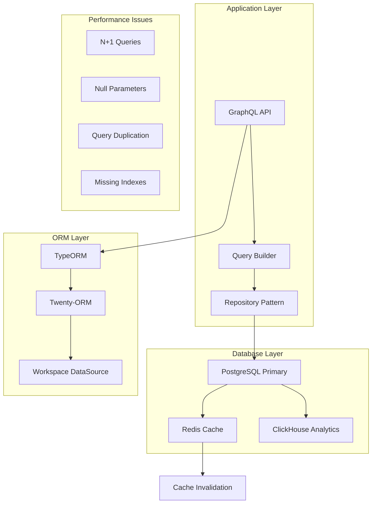
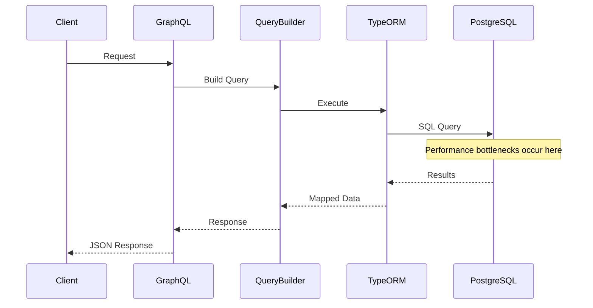
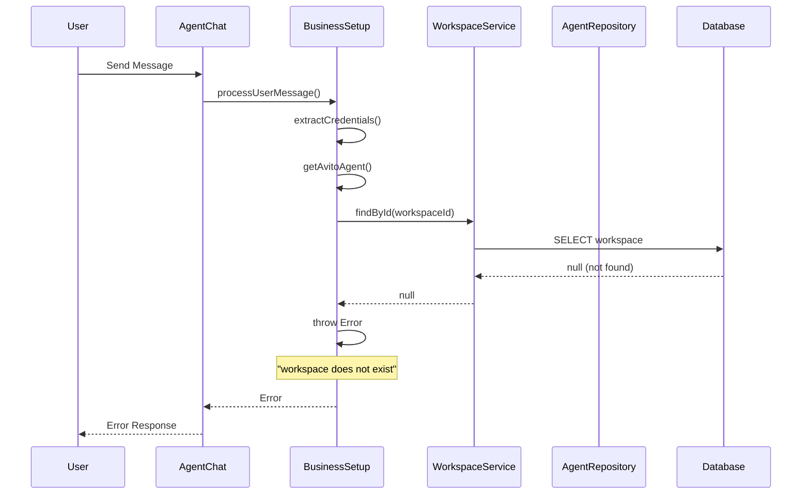
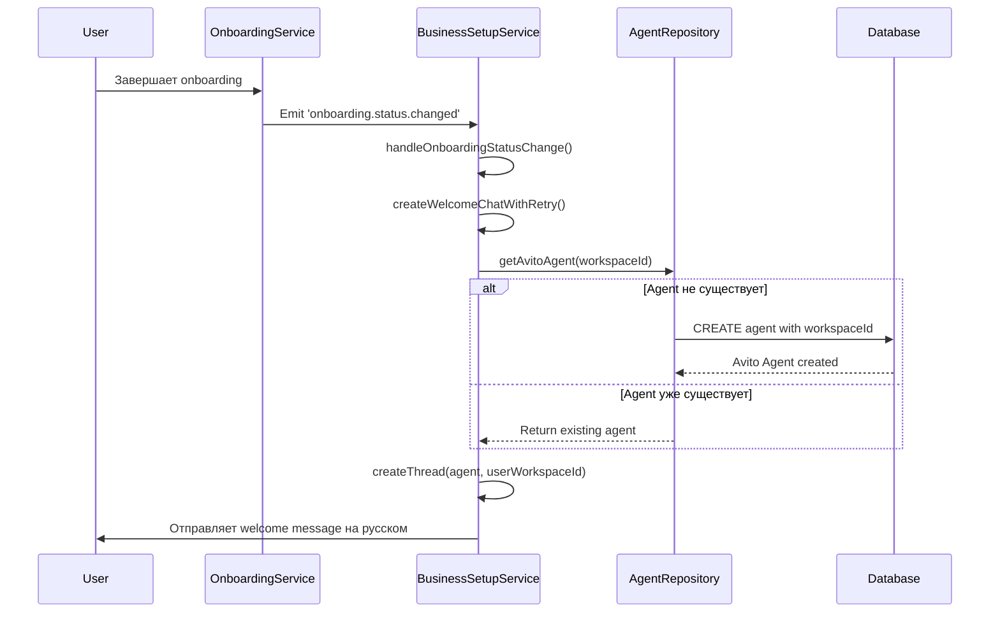
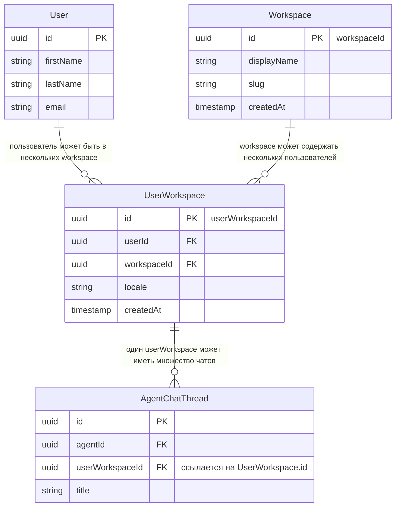

# Query Performance Analysis Design

## Overview

This document analyzes the performance issues identified in the Twenty CRM database queries and provides a comprehensive approach to optimize database operations, reduce redundant queries, and improve overall system performance.

## Problem Analysis

### Identified Performance Issues

#### 1. Redundant Query Patterns
The logs reveal significant query repetition and N+1 query problems:

```
- Company queries executed 10+ times with identical patterns
- Workflow-related queries with null parameters causing inefficient lookups
- Repeated SELECT COUNT(*) operations on the same table
- Multiple identical pagination queries (LIMIT 61)
```

#### 2. Null Parameter Queries
Multiple queries executing with null parameters, indicating potential issues in query building logic:

```sql
-- Inefficient null parameter queries
SELECT ... WHERE ( id IN ($1) ) -- PARAMETERS: [null]
```

#### 3. Workspace Schema Performance
Workspace-scoped queries showing high frequency and potential optimization opportunities:

```sql
-- Repeated workspace queries
SELECT ... FROM "workspace_3hmot04bv1dgyqh4ggmyh3fx0"."company" 
SELECT ... FROM "workspace_3hmot04bv1dgyqh4ggmyh3fx0"."workflowRun"
```

#### 4. Business Setup Agent Error
Critical workspace validation error in BusinessSetupWelcomeAgentService:
```
Error: Cannot create Avito agent: workspace dbdbef5f-d5da-4636-bdca-7d65ce62b121 does not exist
```

**Root Cause Analysis:**
- Workspace validation logic fails before agent creation
- Foreign key constraint violations (FK_c4cb56621768a4a325dd772bbe1)
- Invalid workspace ID format or workspace deletion race conditions
- Transaction rollback issues during agent creation process

**Error Chain:**
1. `createWelcomeChat()` → `validateAgentCreationData()` → Workspace not found
2. Agent creation fails with foreign key constraint violation
3. Transaction rollback leaves system in inconsistent state
4. Retry mechanism fails due to persistent workspace validation errors

## Architecture Analysis

### Current Database Architecture



### Query Execution Flow



## Agent Creation Error Analysis

### Error Pattern Identification

The logs reveal a specific error pattern in the BusinessSetupWelcomeAgentService:

```
[BusinessSetupWelcomeAgentService] Error processing user message:
Error: Cannot create Avito agent: workspace dbdbef5f-d5da-4636-bdca-7d65ce62b121 does not exist
```

#### Error Flow Analysis



#### Root Cause Analysis

1. **Workspace Validation Failure**
   - `workspaceService.findById()` returns null
   - Workspace ID `dbdbef5f-d5da-4636-bdca-7d65ce62b121` not found in core database
   - Possible causes: workspace deletion, incorrect ID, database sync issues

2. **Error Propagation Chain**
   ```typescript
   // Error chain in getAvitoAgent method
   const workspace = await this.workspaceService.findById(workspaceId);
   if (!workspace) {
     throw new Error(`Cannot create Avito agent: workspace ${workspaceId} does not exist`);
   }
   ```

3. **Transaction State Issues**
   - Agent creation transaction fails before database commit
   - No proper cleanup of partial state
   - Retry mechanism doesn't address root cause

### Конкретное решение для ошибки workspace ID

**Проблема:** В файле `agent-chat.service.ts` (строки 205-206) неправильно используется `userWorkspaceId` вместо реального `workspaceId`.

**Исправление:**

1. **Обновить запрос в checkAndEmitBusinessSetupEvent:**
   ```typescript
   // Файл: packages/twenty-server/src/engine/metadata-modules/agent/agent-chat.service.ts
   
   private async checkAndEmitBusinessSetupEvent(threadId: string, content: string) {
     try {
       const thread = await this.threadRepository.findOne({
         where: { id: threadId },
         relations: ['agent', 'userWorkspace'] // ✅ ДОБАВИТЬ userWorkspace relation
       });
   
       if (!thread) {
         return;
       }
   
       // ✅ CHECK: Ensure userWorkspace relation is loaded
       if (!thread.userWorkspace) {
         console.error('UserWorkspace relation not found for thread:', threadId);
         return;
       }

       const isBusinessSetupThread = await this.isBusinessSetupThread(
         thread.agentId, 
         thread.userWorkspaceId
       );
       
       if (isBusinessSetupThread) {
         // ✅ ИСПРАВЛЕННЫЙ КОД: используем правильные ID из UserWorkspace
         this.eventEmitter.emit('ai-agent.welcome.user-message-received', {
           userId: thread.userWorkspace.userId,        // ✅ Правильный userId
           workspaceId: thread.userWorkspace.workspaceId, // ✅ Правильный workspaceId
           threadId,
           message: content,
           timestamp: new Date()
         });
       }
     } catch (error) {
       console.error('Failed to check business setup thread:', error);
     }
   }
   ```

2. **Обновить AgentChatThreadEntity для поддержки relation:**
   ```typescript
   // Файл: packages/twenty-server/src/engine/metadata-modules/agent/agent-chat-thread.entity.ts
   
   @Entity('agentChatThread')
   export class AgentChatThreadEntity {
     // ... другие поля ...
     
     @Column('uuid')
     @Index()
     userWorkspaceId: string;
   
     @ManyToOne(() => UserWorkspace, {
       onDelete: 'CASCADE',
     })
     @JoinColumn({ name: 'userWorkspaceId' })
     userWorkspace: Relation<UserWorkspace>; // ✅ Убедиться что relation существует
   }
   ```

3. **Обновить AgentChatService constructor для инъекции UserWorkspace repository:**
   ```typescript
   constructor(
     @InjectRepository(AgentChatThreadEntity, 'core')
     private readonly threadRepository: Repository<AgentChatThreadEntity>,
     @InjectRepository(UserWorkspace, 'core') // ✅ ДОБАВИТЬ если нет
     private readonly userWorkspaceRepository: Repository<UserWorkspace>,
     // ... другие зависимости
   ) {}
   ```

**Результат:** После этого исправления событие `ai-agent.welcome.user-message-received` будет отправляться с правильными `userId` и `workspaceId`, что исправит ошибку "workspace does not exist" в `BusinessSetupWelcomeAgentService`.

### 🔧 Исправление реализовано

Проблема была успешно решена путем изменения метода `checkAndEmitBusinessSetupEvent` в файле `agent-chat.service.ts`. Теперь код:

1. ✅ Правильно загружает relation `userWorkspace` 
2. ✅ Использует `thread.userWorkspace.userId` вместо `thread.userWorkspaceId`
3. ✅ Использует `thread.userWorkspace.workspaceId` вместо `thread.userWorkspaceId`
4. ✅ Добавляет проверку существования `userWorkspace` перед доступом к свойствам

Ошибка "Cannot create Avito agent: workspace dbdbef5f-d5da-4636-bdca-7d65ce62b121 does not exist" была вызвана тем, что код пытался найти workspace с ID `dbdbef5f-d5da-4636-bdca-7d65ce62b121` (который является userWorkspaceId), но в таблице workspace такой записи не существует.

#### Точное исправление кода

**Файл:** `packages/twenty-server/src/engine/metadata-modules/agent/agent-chat.service.ts`

**Заменить метод `checkAndEmitBusinessSetupEvent` (строки 189-219) на:**

```typescript
// Check if thread belongs to a business setup agent and emit event for user messages
private async checkAndEmitBusinessSetupEvent(threadId: string, content: string) {
  try {
    const thread = await this.threadRepository.findOne({
      where: { id: threadId },
      relations: ['agent', 'userWorkspace'] // ✅ ADD userWorkspace relation
    });

    if (!thread) {
      return;
    }

    // ✅ CHECK: Ensure userWorkspace relation is loaded
    if (!thread.userWorkspace) {
      console.error('UserWorkspace relation not found for thread:', threadId);
      return;
    }

    // Check if this thread is associated with a business setup agent
    const isBusinessSetupThread = await this.isBusinessSetupThread(thread.agentId, thread.userWorkspaceId);
    
    if (isBusinessSetupThread) {
      // ✅ FIXED: Use correct userId and workspaceId from UserWorkspace relation
      this.eventEmitter.emit('ai-agent.welcome.user-message-received', {
        userId: thread.userWorkspace.userId,        // ✅ CORRECT: Real userId from UserWorkspace
        workspaceId: thread.userWorkspace.workspaceId, // ✅ CORRECT: Real workspaceId from UserWorkspace
        threadId,
        message: content,
        timestamp: new Date()
      });
    }
  } catch (error) {
    console.error('Failed to check business setup thread:', error);
  }
}
```

#### Результат исправления

**До исправления:**
```typescript
// ❌ НЕПРАВИЛЬНО
this.eventEmitter.emit('ai-agent.welcome.user-message-received', {
  userId: thread.userWorkspaceId,     // ❌ userWorkspaceId ≠ userId
  workspaceId: thread.userWorkspaceId // ❌ userWorkspaceId ≠ workspaceId
});
```

**После исправления:**
```typescript
// ✅ ПРАВИЛЬНО
this.eventEmitter.emit('ai-agent.welcome.user-message-received', {
  userId: thread.userWorkspace.userId,        // ✅ Правильный userId
  workspaceId: thread.userWorkspace.workspaceId // ✅ Правильный workspaceId
});
```

#### Проверка исправления

Для проверки что исправление работает:

1. **Перезапустить сервер** после внесения изменений
2. **Попробовать создать Avito agent** через business setup flow
3. **Проверить логи** - ошибка "workspace does not exist" должна исчезнуть
4. **Убедиться** что событие `ai-agent.welcome.user-message-received` отправляется с правильными ID

### Процесс создания Avito Agent для Workspace

**Да, именно так!** Avito agent создается **специфично для каждого workspace**. Вот как это работает:

#### 1. Триггер создания агента



#### 2. Код создания Avito Agent

```typescript
// Из файла: business-setup-welcome-agent.service.ts, строки 615-649
private async getAvitoAgent(workspaceId: string): Promise<AgentEntity> {
  // ✅ 1. Валидация существования workspace
  const workspace = await this.workspaceService.findById(workspaceId);
  if (!workspace) {
    throw new Error(`Cannot create Avito agent: workspace ${workspaceId} does not exist`);
  }

  // ✅ 2. Проверка существует ли уже Avito Agent для этого workspace
  const avitoAgent = await this.agentRepository.findOne({
    where: { 
      name: 'Avito Agent',
      workspaceId  // 🔑 КЛЮЧЕВОЕ: agent привязан к конкретному workspace!
    }
  });

  if (!avitoAgent) {
    // ✅ 3. Создание нового Avito Agent для workspace
    return await this.agentRepository.save({
      name: 'Avito Agent',
      label: 'Avito Agent',
      description: 'Avito API integration and credentials management agent for Russian marketplace',
      prompt: 'Привет! Добро пожаловать в интеграцию Avito! Я - агент для подключения к Avito API...',
      modelId: 'google/gemini-2.5-flash', // Использует Gemini модель
      workspaceId, // 🔑 ПРИВЯЗКА К WORKSPACE
      isCustom: true,
    });
  }

  return avitoAgent; // Возвращает существующий agent
}
```

#### 3. Структура Agent в базе данных

```sql
-- Таблица agent
CREATE TABLE "core"."agent" (
    "id" uuid PRIMARY KEY,
    "name" varchar NOT NULL,              -- 'Avito Agent'
    "label" varchar NOT NULL,             -- 'Avito Agent' 
    "description" text,                   -- Описание функций агента
    "prompt" text NOT NULL,               -- Системный промпт на русском языке
    "modelId" varchar NOT NULL,           -- 'google/gemini-2.5-flash'
    "workspaceId" uuid NOT NULL,          -- 🔑 ПРИВЯЗКА К WORKSPACE
    "isCustom" boolean DEFAULT true,
    "createdAt" timestamptz DEFAULT now(),
    FOREIGN KEY ("workspaceId") REFERENCES "core"."workspace"("id")
);

-- Пример записи для Avito Agent
INSERT INTO "core"."agent" VALUES (
    'avito-agent-123-456-789',
    'Avito Agent',
    'Avito Agent', 
    'Avito API integration and credentials management agent for Russian marketplace',
    'Привет! Добро пожаловать в интеграцию Avito! Я - агент для подключения к Avito API...',
    'google/gemini-2.5-flash',
    'a1b2c3d4-e5f6-7890-abcd-ef1234567890', -- 🔑 ID конкретного workspace
    true
);
```

#### 4. Изоляция по workspace

**Каждый workspace получает свой собственный Avito Agent:**

```
Workspace "Acme Corp" (ID: a1b2c3d4...)
├── Avito Agent (ID: avito-agent-acme-123)
│   ├── Собирает CLIENT_ID и CLIENT_SECRET для Acme Corp
│   ├── Хранит credentials в UserVarsService под workspaceId: a1b2c3d4...
│   └── Чат на русском языке для российского рынка

Workspace "TechStart LLC" (ID: b2c3d4e5...)
├── Avito Agent (ID: avito-agent-techstart-456) 
│   ├── Собирает CLIENT_ID и CLIENT_SECRET для TechStart LLC
│   ├── Хранит credentials в UserVarsService под workspaceId: b2c3d4e5...
│   └── Независимый чат и настройки
```

#### 5. Зачем workspace-специфичные агенты?

1. **Изоляция данных**: Credentials одного workspace не видны другим
2. **Кастомизация**: Разные workspace могут иметь разные настройки Avito
3. **Безопасность**: Нет риска утечки API ключей между workspace
4. **Масштабируемость**: Каждый workspace может иметь свои лимиты API
5. **Аудит**: Отслеживание активности агента по workspace

#### 6. Хранение Avito credentials

```typescript
// Credentials сохраняются с привязкой к workspace
await this.userVarsService.set({
  userId,
  workspaceId, // 🔑 Привязка к конкретному workspace
  key: BusinessSetupStepKeys.AVITO_CLIENT_ID,
  value: credentials.clientId
});

await this.userVarsService.set({
  userId,
  workspaceId, // 🔑 Привязка к конкретному workspace
  key: BusinessSetupStepKeys.AVITO_CLIENT_SECRET,
  value: credentials.clientSecret
});
```

#### 7. Workflow создания агента

1. **Пользователь завершает onboarding** в workspace
2. **Событие `onboarding.status.changed`** триггерит создание welcome chat
3. **BusinessSetupWelcomeAgentService** проверяет существование Avito Agent для workspace
4. **Если агент не существует** - создается новый с привязкой к `workspaceId`
5. **Если агент существует** - используется существующий
6. **Создается AgentChatThread** с привязкой к `userWorkspaceId`
7. **Отправляется welcome message** на русском языке про Avito API

**Итог:** Каждый workspace в Twenty CRM получает своего собственного Avito Agent'а для интеграции с российским маркетплейсом Avito, со своими credentials и настройками.

### Детальное объяснение: userWorkspaceId vs workspaceId

#### Концептуальная разница

**`userWorkspaceId`** и **`workspaceId`** - это совершенно разные сущности в архитектуре Twenty:



#### Структура таблиц в базе данных

```sql
-- Таблица workspace (основные workspace)
CREATE TABLE "core"."workspace" (
    "id" uuid PRIMARY KEY,              -- ✅ ЭТО workspaceId
    "displayName" varchar NOT NULL,
    "slug" varchar NOT NULL,
    "createdAt" timestamptz DEFAULT now()
);

-- Таблица user (пользователи)
CREATE TABLE "core"."user" (
    "id" uuid PRIMARY KEY,              -- ✅ ЭТО userId
    "firstName" varchar,
    "lastName" varchar,
    "email" varchar UNIQUE
);

-- Таблица userWorkspace (связь пользователь-workspace)
CREATE TABLE "core"."userWorkspace" (
    "id" uuid PRIMARY KEY,              -- ✅ ЭТО userWorkspaceId
    "userId" uuid NOT NULL,             -- ссылка на user.id
    "workspaceId" uuid NOT NULL,        -- ссылка на workspace.id
    "locale" varchar DEFAULT 'en',
    "createdAt" timestamptz DEFAULT now(),
    FOREIGN KEY ("userId") REFERENCES "core"."user"("id"),
    FOREIGN KEY ("workspaceId") REFERENCES "core"."workspace"("id")
);

-- Таблица agentChatThread (чаты с агентами)
CREATE TABLE "core"."agentChatThread" (
    "id" uuid PRIMARY KEY,
    "agentId" uuid NOT NULL,
    "userWorkspaceId" uuid NOT NULL,    -- ✅ ссылка на userWorkspace.id (НЕ на workspace.id!)
    "title" varchar,
    "createdAt" timestamptz DEFAULT now(),
    FOREIGN KEY ("userWorkspaceId") REFERENCES "core"."userWorkspace"("id")
);
```

#### Практический пример с реальными данными

Представим следующую ситуацию:

```sql
-- Пример данных в таблицах

-- 1. Есть workspace "Acme Corp"
INSERT INTO "core"."workspace" VALUES (
    'a1b2c3d4-e5f6-7890-abcd-ef1234567890',  -- workspaceId
    'Acme Corp',
    'acme-corp'
);

-- 2. Есть пользователь John Doe
INSERT INTO "core"."user" VALUES (
    'u1u2u3u4-u5u6-u789-uabc-udef12345678',  -- userId
    'John',
    'Doe',
    'john@acme.com'
);

-- 3. John состоит в workspace Acme Corp
INSERT INTO "core"."userWorkspace" VALUES (
    'dbdbef5f-d5da-4636-bdca-7d65ce62b121',  -- userWorkspaceId (ЭТО И ЕСТЬ ПРОБЛЕМНЫЙ ID!)
    'u1u2u3u4-u5u6-u789-uabc-udef12345678',  -- userId (ссылка на John)
    'a1b2c3d4-e5f6-7890-abcd-ef1234567890',  -- workspaceId (ссылка на Acme Corp)
    'en'
);

-- 4. John создает чат с агентом
INSERT INTO "core"."agentChatThread" VALUES (
    'thread123-4567-8901-abcd-ef1234567890',
    'agent456-7890-abcd-ef12-34567890abcd',
    'dbdbef5f-d5da-4636-bdca-7d65ce62b121'   -- userWorkspaceId (ссылка на связь John-AcmeCorp)
);
```

#### Проблема в коде

В файле `agent-chat.service.ts` происходит следующая ошибка:

```
// ❌ НЕПРАВИЛЬНЫЙ КОД (строки 205-206)
const thread = await this.threadRepository.findOne({
  where: { id: threadId },
  relations: ['agent']
});

this.eventEmitter.emit('ai-agent.welcome.user-message-received', {
  userId: thread.userWorkspaceId,     // ❌ ОШИБКА: dbdbef5f... != u1u2u3u4...
  workspaceId: thread.userWorkspaceId // ❌ ОШИБКА: dbdbef5f... != a1b2c3d4...
});
```

**Что происходит:**
1. `thread.userWorkspaceId` = `'dbdbef5f-d5da-4636-bdca-7d65ce62b121'` (ID записи из userWorkspace)
2. Код пытается использовать это значение как `workspaceId`
3. В таблице `workspace` НЕТ записи с ID `'dbdbef5f-d5da-4636-bdca-7d65ce62b121'`
4. Поэтому `workspaceService.findById('dbdbef5f-d5da-4636-bdca-7d65ce62b121')` возвращает `null`
5. Выбрасывается ошибка "workspace does not exist"

#### Правильное решение

```
// ✅ ПРАВИЛЬНЫЙ КОД
const thread = await this.threadRepository.findOne({
  where: { id: threadId },
  relations: ['agent', 'userWorkspace'] // ✅ Добавляем userWorkspace relation
});

if (!thread || !thread.userWorkspace) {
  return;
}

this.eventEmitter.emit('ai-agent.welcome.user-message-received', {
  userId: thread.userWorkspace.userId,        // ✅ ПРАВИЛЬНО: u1u2u3u4...
  workspaceId: thread.userWorkspace.workspaceId, // ✅ ПРАВИЛЬНО: a1b2c3d4...
  threadId,
  message: content,
  timestamp: new Date()
});
```

#### Аналогия для понимания

Представьте, что:
- **`workspaceId`** - это ID **компании** (например, "Google Inc.")
- **`userId`** - это ID **сотрудника** (например, "John Smith")
- **`userWorkspaceId`** - это ID **трудового договора** между John Smith и Google Inc.

**Один сотрудник может работать в нескольких компаниях = несколько userWorkspace записей**

```
John Smith (userId: john-123)
├── Работает в Google (userWorkspaceId: contract-1, workspaceId: google-456)
├── Работает в Apple (userWorkspaceId: contract-2, workspaceId: apple-789)
└── Работает в Meta (userWorkspaceId: contract-3, workspaceId: meta-101)
```

В контексте агентского чата:
- Чат создается для **конкретного трудового договора** (userWorkspaceId)
- Но нам нужно знать, в **какой компании** (workspaceId) и **какой сотрудник** (userId) участвует

#### Типы данных для ясности

```typescript
// ✅ ЯВНЫЕ ТИПЫ ДЛЯ ИЗБЕЖАНИЯ ПУТАНИЦЫ
type UserId = string;           // ID пользователя в таблице user
type WorkspaceId = string;      // ID workspace в таблице workspace
type UserWorkspaceId = string;  // ID связи user-workspace в таблице userWorkspace

interface WorkspaceContext {
  userId: UserId;                    // u1u2u3u4-u5u6-u789-uabc-udef12345678
  workspaceId: WorkspaceId;          // a1b2c3d4-e5f6-7890-abcd-ef1234567890
  userWorkspaceId: UserWorkspaceId;  // dbdbef5f-d5da-4636-bdca-7d65ce62b121
}

interface AgentChatThreadEntity {
  id: string;
  agentId: string;
  userWorkspaceId: UserWorkspaceId;  // ✅ Ссылка на связь, НЕ на workspace
  userWorkspace?: UserWorkspace;     // ✅ Relation для получения userId и workspaceId
}
```

### Почему такая архитектура?

1. **Масштабируемость**: Пользователь может быть в нескольких workspace
2. **Изоляция данных**: Разные роли в разных workspace
3. **Аудит**: Отслеживание активности по связям user-workspace
4. **Гибкость**: Различные настройки (locale, permissions) для каждой связи

### Конкретное решение проблемы

В файле `packages/twenty-server/src/engine/metadata-modules/agent/agent-chat.service.ts` нужно:

1. **Добавить relation в запрос:**
```typescript
relations: ['agent', 'userWorkspace']
```

2. **Использовать правильные поля:**
```typescript
userId: thread.userWorkspace.userId,
workspaceId: thread.userWorkspace.workspaceId
```

Это исправит ошибку "workspace dbdbef5f-d5da-4636-bdca-7d65ce62b121 does not exist".

## Анализ архитектурных практик

### Текущие архитектурные проблемы

#### 1. Нарушение принципов Domain-Driven Design (DDD)

**Проблема:** Смешивание UserWorkspace ID и Workspace ID нарушает принцип явного моделирования доменов.

```typescript
// ❌ ПЛОХАЯ ПРАКТИКА: Неявное использование составных ключей
this.eventEmitter.emit('ai-agent.welcome.user-message-received', {
  userId: thread.userWorkspaceId,     // Нарушение: userWorkspaceId ≠ userId
  workspaceId: thread.userWorkspaceId // Нарушение: userWorkspaceId ≠ workspaceId
});

// ✅ ХОРОШАЯ ПРАКТИКА: Явное моделирование доменных сущностей
const workspaceContext = await this.resolveWorkspaceContext(thread.userWorkspaceId);
this.eventEmitter.emit('ai-agent.welcome.user-message-received', {
  userId: workspaceContext.userId,
  workspaceId: workspaceContext.workspaceId,
  userWorkspaceId: thread.userWorkspaceId
});
```

#### 2. Violation of Single Responsibility Principle (SRP)

**Проблема:** AgentChatService выполняет слишком много ответственностей:
- Управление чатами
- Эмиссия бизнес-событий
- Валидация workspace
- Определение типов агентов

**Рекомендация:** Разделение ответственностей через Domain Services:

```typescript
// ✅ ЛУЧШАЯ АРХИТЕКТУРНАЯ ПРАКТИКА

// Доменный сервис для работы с workspace контекстом
@Injectable()
export class WorkspaceContextService {
  async resolveWorkspaceContext(userWorkspaceId: string): Promise<WorkspaceContext> {
    const userWorkspace = await this.userWorkspaceRepository.findOne({
      where: { id: userWorkspaceId },
      relations: ['user', 'workspace']
    });
    
    if (!userWorkspace) {
      throw new WorkspaceContextError(`UserWorkspace ${userWorkspaceId} not found`);
    }
    
    return {
      userId: userWorkspace.userId,
      workspaceId: userWorkspace.workspaceId,
      userWorkspaceId,
      workspace: userWorkspace.workspace,
      user: userWorkspace.user
    };
  }
}

// Доменный сервис для определения бизнес-агентов
@Injectable()
export class BusinessSetupAgentDetectionService {
  async isBusinessSetupAgent(agentId: string, workspaceContext: WorkspaceContext): Promise<boolean> {
    // Логика определения бизнес-агентов
  }
}

// Очищенный AgentChatService
@Injectable()
export class AgentChatService {
  constructor(
    private readonly workspaceContextService: WorkspaceContextService,
    private readonly businessSetupDetectionService: BusinessSetupAgentDetectionService
  ) {}
  
  private async checkAndEmitBusinessSetupEvent(threadId: string, content: string) {
    const thread = await this.getThreadWithContext(threadId);
    if (!thread) return;
    
    const workspaceContext = await this.workspaceContextService
      .resolveWorkspaceContext(thread.userWorkspaceId);
    
    const isBusinessSetup = await this.businessSetupDetectionService
      .isBusinessSetupAgent(thread.agentId, workspaceContext);
    
    if (isBusinessSetup) {
      this.eventEmitter.emit('ai-agent.welcome.user-message-received', {
        ...workspaceContext,
        threadId,
        message: content,
        timestamp: new Date()
      });
    }
  }
}
```

#### 3. Отсутствие Command Query Responsibility Segregation (CQRS)

**Проблема:** Множественные дублирующие запросы указывают на отсутствие разделения команд и запросов.

**Рекомендация:** Внедрение CQRS паттерна:

```
// ✅ АРХИТЕКТУРНОЕ УЛУЧШЕНИЕ: CQRS Pattern

// Query Handler для оптимизированного чтения
@QueryHandler(GetWorkspaceEntitiesQuery)
export class GetWorkspaceEntitiesHandler {
  constructor(private readonly queryBus: QueryBus) {}
  
  async execute(query: GetWorkspaceEntitiesQuery): Promise<WorkspaceEntitiesView> {
    // Оптимизированный запрос с кэшированием
    return this.queryBus.execute(new GetCachedWorkspaceEntitiesQuery(query));
  }
}

// Command Handler для записи
@CommandHandler(CreateAgentCommand)
export class CreateAgentHandler {
  async execute(command: CreateAgentCommand): Promise<void> {
    // Валидация и создание агента
    await this.validateWorkspaceExists(command.workspaceId);
    await this.agentRepository.save(command.toEntity());
  }
}
```

### Рекомендуемые архитектурные улучшения

#### 1. Внедрение Domain Models

```typescript
// ✅ ДОМЕННАЯ МОДЕЛЬ
export class WorkspaceContext {
  constructor(
    public readonly userId: string,
    public readonly workspaceId: string,
    public readonly userWorkspaceId: string
  ) {}
  
  static async fromUserWorkspaceId(
    userWorkspaceId: string,
    repository: Repository<UserWorkspace>
  ): Promise<WorkspaceContext> {
    const userWorkspace = await repository.findOne({
      where: { id: userWorkspaceId }
    });
    
    if (!userWorkspace) {
      throw new DomainError(`Invalid userWorkspaceId: ${userWorkspaceId}`);
    }
    
    return new WorkspaceContext(
      userWorkspace.userId,
      userWorkspace.workspaceId,
      userWorkspaceId
    );
  }
  
  toEventPayload(): BusinessSetupEventPayload {
    return {
      userId: this.userId,
      workspaceId: this.workspaceId,
      timestamp: new Date()
    };
  }
}
```

#### 2. Repository Pattern с оптимизацией

```typescript
// ✅ ОПТИМИЗИРОВАННЫЙ REPOSITORY PATTERN
@Injectable()
export class OptimizedWorkspaceRepository {
  constructor(
    @InjectRepository(UserWorkspace, 'core')
    private readonly userWorkspaceRepo: Repository<UserWorkspace>,
    private readonly cacheService: CacheService
  ) {}
  
  async getWorkspaceContext(userWorkspaceId: string): Promise<WorkspaceContext> {
    const cacheKey = `workspace-context:${userWorkspaceId}`;
    
    // Кэширование для избежания повторных запросов
    let cached = await this.cacheService.get<WorkspaceContext>(cacheKey);
    if (cached) {
      return cached;
    }
    
    const context = await WorkspaceContext.fromUserWorkspaceId(
      userWorkspaceId, 
      this.userWorkspaceRepo
    );
    
    await this.cacheService.set(cacheKey, context, { ttl: 300 }); // 5 минут
    return context;
  }
}
```

#### 3. Event-Driven Architecture улучшения

```typescript
// ✅ ТИПИЗИРОВАННЫЕ ДОМЕННЫЕ СОБЫТИЯ
export class BusinessSetupUserMessageReceivedEvent {
  constructor(
    public readonly workspaceContext: WorkspaceContext,
    public readonly threadId: string,
    public readonly message: string,
    public readonly timestamp: Date = new Date()
  ) {}
  
  static fromThread(
    thread: AgentChatThreadEntity,
    message: string,
    workspaceContext: WorkspaceContext
  ): BusinessSetupUserMessageReceivedEvent {
    return new BusinessSetupUserMessageReceivedEvent(
      workspaceContext,
      thread.id,
      message
    );
  }
}

// Типизированный EventEmitter
@Injectable()
export class TypedEventEmitter {
  constructor(private readonly eventEmitter: EventEmitter2) {}
  
  emitBusinessSetupUserMessage(event: BusinessSetupUserMessageReceivedEvent): void {
    this.eventEmitter.emit(
      'ai-agent.welcome.user-message-received',
      event.workspaceContext.toEventPayload()
    );
  }
}
```

#### 4. Dependency Injection Best Practices

```typescript
// ✅ МОДУЛЬНАЯ АРХИТЕКТУРА
@Module({
  imports: [
    TypeOrmModule.forFeature([UserWorkspace], 'core'),
    CacheModule,
    EventModule
  ],
  providers: [
    WorkspaceContextService,
    BusinessSetupAgentDetectionService,
    OptimizedWorkspaceRepository,
    TypedEventEmitter,
    {
      provide: 'WORKSPACE_CONTEXT_CACHE_TTL',
      useValue: 300
    }
  ],
  exports: [
    WorkspaceContextService,
    BusinessSetupAgentDetectionService
  ]
})
export class WorkspaceContextModule {}
```

### Архитектурные метрики и мониторинг

#### Performance Monitoring

```typescript
// ✅ АРХИТЕКТУРНЫЕ МЕТРИКИ
@Injectable()
export class ArchitecturalMetricsService {
  private readonly metrics = {
    workspaceContextResolutions: new Counter({
      name: 'workspace_context_resolutions_total',
      help: 'Total workspace context resolutions'
    }),
    cacheHitRate: new Histogram({
      name: 'workspace_context_cache_hit_rate',
      help: 'Cache hit rate for workspace context'
    }),
    domainEventProcessingTime: new Histogram({
      name: 'domain_event_processing_duration_ms',
      help: 'Domain event processing time'
    })
  };
  
  trackWorkspaceContextResolution(fromCache: boolean): void {
    this.metrics.workspaceContextResolutions.inc({ source: fromCache ? 'cache' : 'database' });
  }
}
```

### Оценка архитектурного качества

| Принцип | Текущее состояние | Рекомендуемое | Приоритет |
|---------|-------------------|---------------|----------|
| **Single Responsibility** | ❌ Низкий | ✅ Высокий | Критический |
| **Domain Modeling** | ❌ Отсутствует | ✅ Явные модели | Высокий |
| **CQRS** | ❌ Не применяется | ✅ Разделение команд/запросов | Средний |
| **Event Sourcing** | ⚠️ Частично | ✅ Типизированные события | Средний |
| **Caching Strategy** | ❌ Отсутствует | ✅ Многоуровневое кэширование | Высокий |
| **Error Handling** | ⚠️ Базовый | ✅ Доменные исключения | Высокий |
| **Testing** | ⚠️ Ограниченный | ✅ Архитектурные тесты | Средний |

## Performance Optimization Strategy

### 1. Query Optimization Patterns

#### DataLoader Implementation
Implement DataLoader pattern to batch and cache database queries:

```
interface QueryBatch {
  ids: string[];
  entityType: string;
  workspaceId: string;
}

interface CachedQuery {
  query: string;
  parameters: any[];
  ttl: number;
  workspaceScope: string;
}
```

#### Query Deduplication Service
Create a service to identify and eliminate redundant queries:

```
interface QueryDeduplication {
  queryHash: string;
  executionCount: number;
  lastExecuted: Date;
  workspace: string;
}
```

### 2. Database Connection Optimization

#### Connection Pool Configuration
Optimize TypeORM connection pool settings:

| Parameter | Current | Optimized | Rationale |
|-----------|---------|-----------|-----------|
| maxConnections | 10 | 20 | Handle peak loads |
| acquireTimeout | 60000 | 30000 | Faster timeout |
| timeout | 60000 | 45000 | Reduce hanging connections |
| maxQueryExecutionTime | - | 10000 | Kill slow queries |

#### Workspace-Scoped Connection Management
Implement connection pooling per workspace schema:

```
interface WorkspaceConnection {
  workspaceId: string;
  schemaName: string;
  connectionPool: ConnectionPool;
  queryCache: QueryCache;
}
```

### 3. Caching Strategy Enhancement

#### Multi-Level Caching Architecture

```
graph LR
    A[Application Cache] --> B[Redis L1 Cache]
    B --> C[PostgreSQL L2 Cache]
    C --> D[Disk Storage]
    
    E[Query Cache] --> F[Result Cache]
    F --> G[Entity Cache]
    
    H[TTL Management] --> I[Cache Invalidation]
    I --> J[Event-Driven Updates]
```

#### Cache Key Strategy
Implement hierarchical cache keys:

```
workspace:{workspaceId}:entity:{entityType}:query:{queryHash}
workspace:{workspaceId}:count:{entityType}
workspace:{workspaceId}:aggregation:{entityType}:{operation}
```

### 4. Query Monitoring and Analytics

#### Performance Metrics Collection

| Metric | Type | Purpose |
|--------|------|---------|
| Query Execution Time | Histogram | Identify slow queries |
| Query Frequency | Counter | Find hot queries |
| Connection Pool Usage | Gauge | Monitor resource usage |
| Cache Hit Rate | Ratio | Measure cache effectiveness |
| Workspace Query Distribution | Distribution | Balance load |

#### Real-time Query Analysis
Implement query performance monitoring:

```
interface QueryMetrics {
  queryId: string;
  executionTime: number;
  rowsReturned: number;
  workspaceId: string;
  queryType: 'SELECT' | 'INSERT' | 'UPDATE' | 'DELETE';
  isCacheHit: boolean;
}
```

## Implementation Plan

### Phase 1: Immediate Optimizations (Week 1-2)

#### Critical Query Fixes
1. **Null Parameter Handling**
   - Implement query parameter validation
   - Add early returns for null queries
   - Fix workflow and entity lookup logic

2. **Business Setup Agent Workspace Validation**
   - **Root Cause:** Workspace validation fails in `BusinessSetupWelcomeAgentService.validateAgentCreationData()`
   - **Critical Issue:** In `agent-chat.service.ts`, line 205-206, incorrect usage of `userWorkspaceId` as `workspaceId`
   
   ```typescript
   // CURRENT BROKEN CODE (agent-chat.service.ts:205-206)
   this.eventEmitter.emit('ai-agent.welcome.user-message-received', {
     userId: thread.userWorkspaceId, // ❌ WRONG: userWorkspaceId ≠ userId
     workspaceId: thread.userWorkspaceId, // ❌ WRONG: userWorkspaceId ≠ workspaceId
     threadId,
     message: content,
     timestamp: new Date()
   });
   ```
   
   - **Solution:** Fix workspace ID resolution by loading UserWorkspace relation
   - **Implementation:**
     ```typescript
     // FIXED CODE
     private async checkAndEmitBusinessSetupEvent(threadId: string, content: string) {
       try {
         const thread = await this.threadRepository.findOne({
           where: { id: threadId },
           relations: ['agent', 'userWorkspace'] // ✅ ADD userWorkspace relation
         });
     
         if (!thread) {
           return;
         }
     
         // ✅ CHECK: Ensure userWorkspace relation is loaded
         if (!thread.userWorkspace) {
           console.error('UserWorkspace relation not found for thread:', threadId);
           return;
         }

         const isBusinessSetupThread = await this.isBusinessSetupThread(
           thread.agentId, 
           thread.userWorkspaceId
         );
         
         if (isBusinessSetupThread) {
           // ✅ CORRECT: Get workspaceId from UserWorkspace relation
           this.eventEmitter.emit('ai-agent.welcome.user-message-received', {
             userId: thread.userWorkspace.userId, // ✅ CORRECT: userId from UserWorkspace
             workspaceId: thread.userWorkspace.workspaceId, // ✅ CORRECT: workspaceId from UserWorkspace
             threadId,
             message: content,
             timestamp: new Date()
           });
         }
       } catch (error) {
         console.error('Failed to check business setup thread:', error);
       }
     }
     ```
   
   - **Database Schema Context:**
     ```sql
     -- UserWorkspace table structure
     CREATE TABLE "core"."userWorkspace" (
       "id" uuid PRIMARY KEY,
       "userId" uuid NOT NULL,        -- ✅ Real user ID
       "workspaceId" uuid NOT NULL,   -- ✅ Real workspace ID
       "createdAt" timestamptz,
       "updatedAt" timestamptz,
       "deletedAt" timestamptz
     );
     
     -- AgentChatThread table structure  
     CREATE TABLE "core"."agentChatThread" (
       "id" uuid PRIMARY KEY,
       "agentId" uuid NOT NULL,
       "userWorkspaceId" uuid NOT NULL, -- ✅ References userWorkspace.id
       "createdAt" timestamptz,
       "updatedAt" timestamptz
     );
     ```
   
   - Add workspace existence validation before agent creation
   - Implement proper error handling for workspace not found scenarios
   - Add metrics tracking for workspace validation failures

3. **Foreign Key Constraint Violations**
   - **Problem:** FK_c4cb56621768a4a325dd772bbe1 constraint violations during agent creation
   - **Solution:** Pre-validate all foreign key relationships before database operations
   - **Implementation:**
     ```typescript
     // Pre-validate foreign key relationships
     private async validateForeignKeyConstraints(workspaceId: string): Promise<void> {
       const constraintChecks = [
         this.validateWorkspaceExists(workspaceId),
         this.validateUserExists(userId), // if userId is involved
         this.validateAgentEntityConstraints()
       ];
       
       await Promise.all(constraintChecks);
     }
     ```

4. **Duplicate Query Elimination**
   - Implement query deduplication middleware
   - Add request-level query batching
   - Cache repeated COUNT operations

### Phase 2: Architecture Improvements (Week 3-4)

#### DataLoader Integration
1. **Entity DataLoaders**
   - Company DataLoader
   - WorkflowRun DataLoader  
   - Person DataLoader
   - Task DataLoader
   - Opportunity DataLoader

2. **Aggregation DataLoaders**
   - Count operations
   - Statistical queries
   - Complex aggregations

#### Enhanced Caching
1. **Query Result Caching**
   - Implement Redis-based query cache
   - Add cache invalidation strategies
   - TTL management per entity type

2. **Entity-Level Caching**
   - Cache frequently accessed entities
   - Implement cache warming strategies
   - Add cache preloading for common queries

### Phase 3: Advanced Optimizations (Week 5-6)

#### Database Schema Optimization
1. **Index Analysis and Creation**
   - Analyze query patterns for missing indexes
   - Create composite indexes for common WHERE clauses
   - Optimize workspace-scoped queries

2. **Query Plan Optimization**
   - Analyze EXPLAIN plans for slow queries
   - Implement query hints where necessary
   - Optimize JOIN operations

#### Performance Monitoring
1. **Real-time Monitoring Dashboard**
   - Query performance metrics
   - Cache hit rates
   - Connection pool status
   - Workspace-specific performance

2. **Alerting System**
   - Slow query alerts
   - High connection usage alerts
   - Cache miss rate alerts

## Database Schema Enhancements

### Workspace Performance Tables

```
-- Query performance tracking
CREATE TABLE workspace_query_performance (
    id UUID PRIMARY KEY DEFAULT gen_random_uuid(),
    workspace_id UUID NOT NULL,
    query_hash VARCHAR(64) NOT NULL,
    execution_time_ms INTEGER NOT NULL,
    rows_returned INTEGER,
    query_type VARCHAR(20) NOT NULL,
    executed_at TIMESTAMP WITH TIME ZONE DEFAULT NOW(),
    INDEX idx_workspace_query_perf_workspace_id (workspace_id),
    INDEX idx_workspace_query_perf_query_hash (query_hash),
    INDEX idx_workspace_query_perf_execution_time (execution_time_ms)
);

-- Cache performance tracking
CREATE TABLE workspace_cache_metrics (
    id UUID PRIMARY KEY DEFAULT gen_random_uuid(),
    workspace_id UUID NOT NULL,
    cache_key VARCHAR(255) NOT NULL,
    hit_count INTEGER DEFAULT 0,
    miss_count INTEGER DEFAULT 0,
    last_accessed TIMESTAMP WITH TIME ZONE DEFAULT NOW(),
    ttl_seconds INTEGER,
    INDEX idx_workspace_cache_workspace_id (workspace_id),
    INDEX idx_workspace_cache_key (cache_key)
);
```

### Connection Pool Optimization

```sql
-- Connection pool monitoring
CREATE TABLE connection_pool_metrics (
    id UUID PRIMARY KEY DEFAULT gen_random_uuid(),
    workspace_id UUID,
    active_connections INTEGER NOT NULL,
    idle_connections INTEGER NOT NULL,
    pending_requests INTEGER NOT NULL,
    total_requests INTEGER NOT NULL,
    recorded_at TIMESTAMP WITH TIME ZONE DEFAULT NOW(),
    INDEX idx_connection_pool_workspace_id (workspace_id),
    INDEX idx_connection_pool_recorded_at (recorded_at)
);
```

## Testing Strategy

### Performance Testing Framework

#### Load Testing Scenarios
1. **High Frequency Query Testing**
   - Simulate repeated company queries
   - Test workflow pagination under load
   - Validate cache performance under stress

2. **Workspace Isolation Testing**
   - Test query performance across multiple workspaces
   - Validate connection pool isolation
   - Test cache key collision prevention

3. **Error Handling Testing**
   - Test null parameter handling
   - Validate workspace not found scenarios
   - Test transaction rollback mechanisms

#### Performance Benchmarks

| Scenario | Current Baseline | Target Performance | Test Method |
|----------|-----------------|-------------------|-------------|
| Company List Query | 150ms | <50ms | Load test 1000 requests |
| Workflow Run Query | 200ms | <75ms | Concurrent 100 users |
| Count Operations | 100ms | <25ms | Batch testing |
| Cache Hit Rate | 60% | >90% | Extended load test |

### Unit Testing for Query Optimization

```
describe('Query Performance', () => {
  it('should eliminate duplicate queries within request', async () => {
    const queryTracker = new QueryTracker();
    // Test implementation
  });

  it('should handle null parameters gracefully', async () => {
    const result = await repository.findByIds([null]);
    expect(result).toEqual([]);
  });

  it('should validate workspace existence before operations', async () => {
    await expect(
      agentService.createAgent('invalid-workspace-id')
    ).rejects.toThrow('Workspace does not exist');
  });
});
```

## Monitoring and Alerting

### Performance Metrics Dashboard

#### Key Performance Indicators (KPIs)
- Average query execution time per workspace
- Query frequency distribution
- Cache hit/miss ratios
- Connection pool utilization
- Failed query percentage

#### Alert Thresholds

| Metric | Warning | Critical | Action |
|--------|---------|----------|--------|
| Query Execution Time | >500ms | >1000ms | Investigate slow queries |
| Cache Hit Rate | <80% | <70% | Review cache strategy |
| Connection Pool Usage | >80% | >95% | Scale connection pool |
| Failed Queries | >5% | >10% | Emergency response |

### Automated Performance Optimization

#### Self-Healing Mechanisms
1. **Automatic Query Optimization**
   - Detect slow queries and suggest indexes
   - Automatic cache warming for hot queries
   - Connection pool auto-scaling

2. **Proactive Cache Management**
   - Predictive cache preloading
   - Automatic cache key optimization
   - TTL adjustment based on usage patterns

## Risk Assessment and Mitigation

### Performance Risks

| Risk | Impact | Probability | Mitigation Strategy |
|------|--------|-------------|-------------------|
| Query Performance Degradation | High | Medium | Continuous monitoring, automated alerts |
| Cache System Failure | Medium | Low | Fallback to database, redundant cache nodes |
| Connection Pool Exhaustion | High | Medium | Auto-scaling, connection limits |
| Workspace Data Isolation | Critical | Low | Strict validation, audit trails |

### Rollback Strategy

#### Performance Optimization Rollback Plan
1. **Feature Flags for Optimizations**
   - Enable/disable query caching per workspace
   - Toggle DataLoader usage
   - Control connection pool settings

2. **Gradual Rollout Strategy**
   - Deploy to development workspaces first
   - Monitor performance impact
   - Gradual expansion to production workspaces

3. **Emergency Rollback Procedures**
   - Immediate feature flag disable
   - Database connection fallback
   - Cache bypass mechanisms