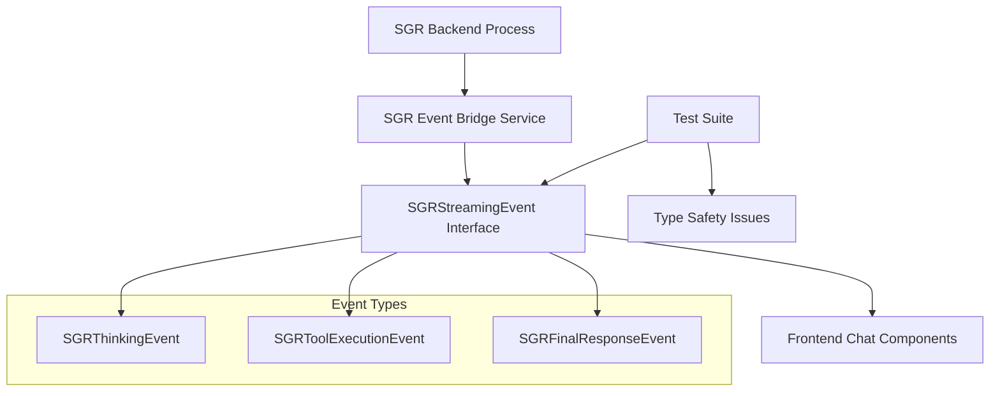
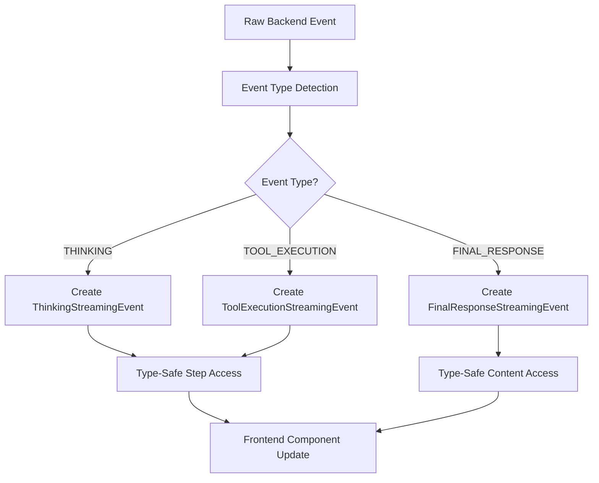
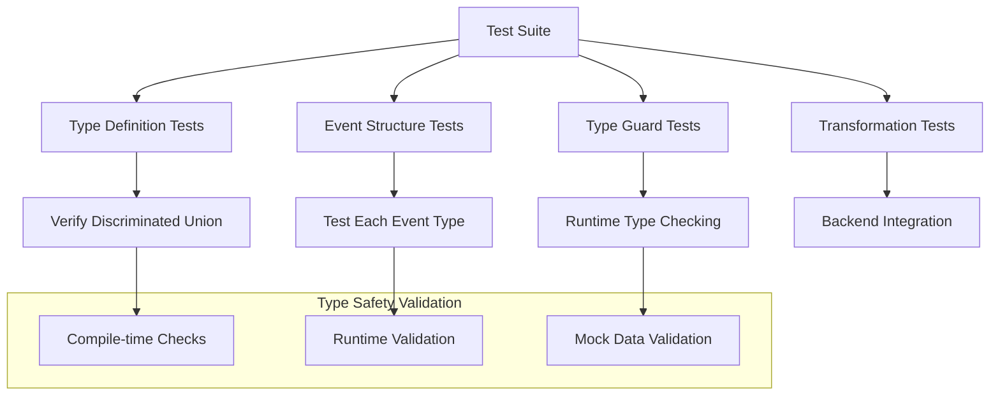

# SGR Event Step TypeScript Fix Design

## Overview

The Twenty CRM application is experiencing TypeScript compilation errors in the SGR (Schema-Guided Reasoning) event bridge service tests. The errors occur because the `step` property in `SGRStreamingEvent` is optional (`step?: SGRThinkingStep`), but the test code attempts to access its properties without null checking.

## Technology Stack

- **Frontend Framework**: React 18 with TypeScript 5.3.3
- **Build Tool**: Nx monorepo with Vite
- **Testing Framework**: Jest
- **Type System**: TypeScript with strict null checks

## Architecture

### Current SGR Event System



### Problem Analysis

The `SGRStreamingEvent` interface has optional properties that create type safety issues:

```typescript
export interface SGRStreamingEvent {
  type: SGRMessageType;
  step?: SGRThinkingStep;  // Optional property causing issues
  content?: string;
  completed?: boolean;
  timestamp: Date;
}
```

## Data Models & Type Definitions

### Current Problematic Structure

| Event Type | Required Properties | Optional Properties | Issue |
|------------|-------------------|-------------------|-------|
| `THINKING` | `type`, `timestamp` | `step`, `content`, `completed` | Tests assume `step` exists |
| `TOOL_EXECUTION` | `type`, `timestamp` | `step`, `content`, `completed` | Tests assume `step` exists |
| `FINAL_RESPONSE` | `type`, `timestamp` | `step`, `content`, `completed` | Different structure needed |

### Proposed Enhanced Structure

```typescript
// Base interface for all streaming events
interface BaseSGRStreamingEvent {
  type: SGRMessageType;
  timestamp: Date;
}

// Thinking events always have step data
interface SGRThinkingStreamingEvent extends BaseSGRStreamingEvent {
  type: SGRMessageType.THINKING;
  step: SGRThinkingStep;  // Required for thinking events
}

// Tool execution events always have step data
interface SGRToolExecutionStreamingEvent extends BaseSGRStreamingEvent {
  type: SGRMessageType.TOOL_EXECUTION;
  step: SGRThinkingStep;  // Required for tool execution events
}

// Final response events have different structure
interface SGRFinalResponseStreamingEvent extends BaseSGRStreamingEvent {
  type: SGRMessageType.FINAL_RESPONSE;
  content: string;        // Required for final response
  completed: boolean;     // Required for final response
}

// Discriminated union for type safety
export type SGRStreamingEvent = 
  | SGRThinkingStreamingEvent 
  | SGRToolExecutionStreamingEvent 
  | SGRFinalResponseStreamingEvent;
```

## Component Architecture

### Type Guards and Utility Functions

```typescript
// Type guard functions for runtime type checking
export function isThinkingEvent(event: SGRStreamingEvent): event is SGRThinkingStreamingEvent {
  return event.type === SGRMessageType.THINKING;
}

export function isToolExecutionEvent(event: SGRStreamingEvent): event is SGRToolExecutionStreamingEvent {
  return event.type === SGRMessageType.TOOL_EXECUTION;
}

export function isFinalResponseEvent(event: SGRStreamingEvent): event is SGRFinalResponseStreamingEvent {
  return event.type === SGRMessageType.FINAL_RESPONSE;
}

// Helper function to safely access step data
export function getEventStep(event: SGRStreamingEvent): SGRThinkingStep | null {
  return (isThinkingEvent(event) || isToolExecutionEvent(event)) ? event.step : null;
}
```

### Enhanced Test Structure

The test cases will use discriminated unions to ensure type safety:

```typescript
describe('SGRStreamingEvent Structure', () => {
  it('should have correct structure for thinking events', () => {
    const event: SGRThinkingStreamingEvent = {
      type: SGRMessageType.THINKING,
      step: {
        stepNumber: 1,
        currentState: 'Analyzing user message',
        plannedSteps: ['Extract credentials', 'Validate with API'],
        selectedTool: 'extract_credentials',
        timestamp: new Date()
      },
      timestamp: new Date()
    };

    // Type-safe access - no undefined checks needed
    expect(event.step.stepNumber).toBe(1);
    expect(event.step.currentState).toBe('Analyzing user message');
  });
}
```

## Business Logic Layer

### Event Processing Architecture



### Event Transformation Logic

```typescript
class SGREventTransformer {
  static transformBackendEvent(rawEvent: any): SGRStreamingEvent {
    switch (rawEvent.type) {
      case SGRMessageType.THINKING:
        return {
          type: SGRMessageType.THINKING,
          step: this.validateAndTransformStep(rawEvent.step),
          timestamp: new Date(rawEvent.timestamp)
        } as SGRThinkingStreamingEvent;
        
      case SGRMessageType.TOOL_EXECUTION:
        return {
          type: SGRMessageType.TOOL_EXECUTION,
          step: this.validateAndTransformStep(rawEvent.step),
          timestamp: new Date(rawEvent.timestamp)
        } as SGRToolExecutionStreamingEvent;
        
      case SGRMessageType.FINAL_RESPONSE:
        return {
          type: SGRMessageType.FINAL_RESPONSE,
          content: rawEvent.content || '',
          completed: rawEvent.completed || false,
          timestamp: new Date(rawEvent.timestamp)
        } as SGRFinalResponseStreamingEvent;
        
      default:
        throw new Error(`Unknown SGR event type: ${rawEvent.type}`);
    }
  }
}
```

## Testing

### Unit Test Strategy



### Test Implementation Approach

1. **Compile-time Type Safety**
   - Use TypeScript discriminated unions
   - Ensure all event types have required properties
   - Validate type guards work correctly

2. **Runtime Type Validation**
   - Test type guard functions
   - Validate event transformation
   - Ensure proper error handling

3. **Mock Data Consistency**
   - Create typed mock data factories
   - Ensure test data matches production structure
   - Validate all event scenarios

### Key Test Cases

| Test Category | Test Description | Expected Outcome |
|---------------|------------------|------------------|
| Type Guards | `isThinkingEvent()` with thinking event | Returns `true`, narrows type |
| Type Guards | `isThinkingEvent()` with tool execution event | Returns `false` |
| Event Creation | Create thinking event with required step | Compiles without errors |
| Event Access | Access `step.stepNumber` on thinking event | No TypeScript errors |
| Event Access | Access `content` on final response event | No TypeScript errors |
| Error Cases | Invalid event type transformation | Throws appropriate error |

## Migration Strategy

### Phase 1: Type Definition Enhancement
1. Update `SGRStreamingEvent` to use discriminated unions
2. Add type guard functions
3. Update existing interfaces

### Phase 2: Test Refactoring  
1. Update test cases to use typed events
2. Remove undefined checks where not needed
3. Add comprehensive type guard tests

### Phase 3: Component Integration
1. Update components using SGR events
2. Implement type-safe event handling
3. Add runtime validation where needed

### Phase 4: Validation & Documentation
1. Ensure all TypeScript errors resolved
2. Update API documentation
3. Add usage examples for new types