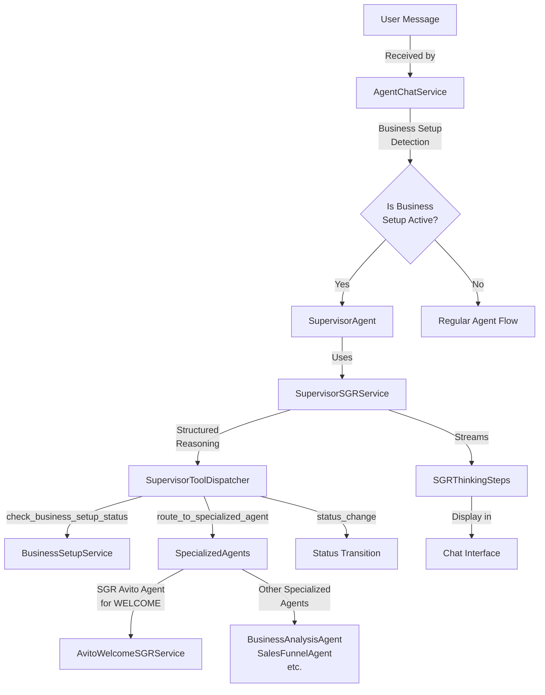
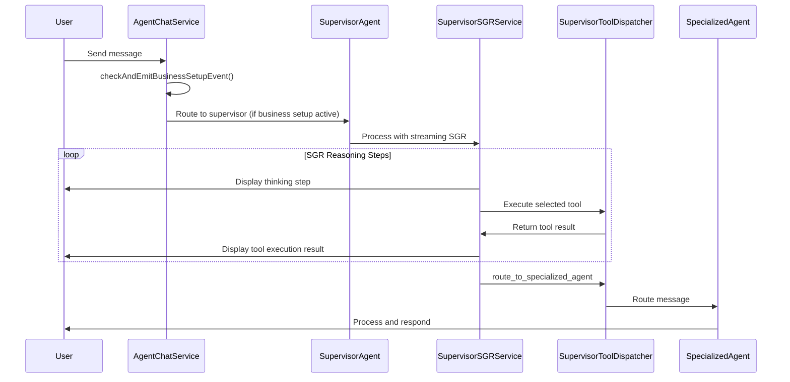

# Supervisor Agent Implementation Design

## 1. Overview

This document outlines the design for a Supervisor Agent implementation within Twenty CRM's Business Setup workflow. The supervisor implements a "supervisor agent" pattern where a main agent analyzes client status and routes requests to specialized agents while displaying transparent thinking steps in the chat interface.

The supervisor extends the existing Schema-Guided Reasoning (SGR) implementation to create a routing agent that automatically manages the Business Setup workflow progression and delegates tasks to appropriate specialized agents.

## 2. Architecture Integration

### 2.1. Current System Context

Twenty CRM currently implements:
- **Business Setup Service**: Manages progression through 8 setup stages (WELCOME → COMPLETED)
- **Specialized Agents**: Individual agents for each business setup stage
- **SGR System**: Sophisticated Schema-Guided Reasoning for the Avito Welcome Agent
- **Agent Chat Service**: Handles agent communication and thread management

### 2.2. Supervisor Agent Extension



## 3. Component Architecture

### 3.1. Core Components

| Component | Purpose | Integration Point |
|-----------|---------|-------------------|
| `SupervisorSGRService` | Orchestrates supervisor reasoning workflow | Extends existing SGR pattern |
| `SupervisorToolDispatcherService` | Executes supervisor routing decisions | Uses BusinessSetupAgentService |
| `BusinessSetupAgentService` (Extended) | Creates and manages supervisor agent | Existing service - add supervisor methods |
| `AgentChatService` (Extended) | Detects business setup and routes to supervisor | Existing service - add business setup detection |

### 3.2. Data Flow Sequence



## 4. Implementation Components

### 4.1. SupervisorSGRService

Extends the existing SGR pattern for supervisor-specific reasoning:

**Key Methods:**
- `processMessageWithStreaming()`: Main entry point for streaming supervisor processing
- `executeSGRWorkflowWithStreaming()`: Core streaming workflow implementation
- `executeReasoningStepWithStreaming()`: Generates single reasoning step with LLM

**Schema Integration:**
- Uses `SupervisorStepSchema` for structured reasoning
- Supports discriminated union for different tool types
- Maintains conversation context across reasoning steps

**Streaming Implementation:**
- Yields `SGRStreamingResult` objects for real-time UI updates
- Shows thinking steps, planned actions, and tool execution progress
- Integrates with existing chat message streaming system

### 4.2. SupervisorToolDispatcherService

Type-safe tool execution service for supervisor actions:

**Available Tools:**
```typescript
type SupervisorToolUnion = 
  | 'check_business_setup_status'
  | 'route_to_specialized_agent'
  | 'process_directly'
  | 'status_change'
  | 'complete_routing';
```

**Tool Implementations:**
- **check_business_setup_status**: Retrieves current business setup status
- **route_to_specialized_agent**: Delegates to appropriate specialized agent
- **status_change**: Triggers progression to next business setup stage
- **process_directly**: Handles simple queries without routing
- **complete_routing**: Signals completion of routing decision

### 4.3. BusinessSetupAgentService (Extended)

Add supervisor agent management to existing service:

**New Methods:**
- `getSupervisorAgent(userWorkspaceId)`: Creates or retrieves supervisor agent
- `createSupervisorAgent(workspaceId)`: Creates workspace-specific supervisor
- Enhanced agent creation for all business setup stages

**Agent Configuration:**
- **Name**: `business-setup-supervisor`
- **Model**: `google/gemini-2.5-flash` (for fast routing decisions)
- **Scope**: Workspace-specific instances
- **Integration**: Leverages existing agent creation patterns

### 4.4. AgentChatService (Extended)

Enhance existing business setup detection:

**Enhanced `checkAndEmitBusinessSetupEvent()`:**
- Detect if user is in active business setup workflow
- Route to supervisor agent when business setup is active
- Emit `BUSINESS_SETUP_ROUTE_MESSAGE` event for supervisor processing
- Maintain compatibility with existing agent routing

## 5. Schema Definitions

### 5.1. SupervisorStepSchema

```typescript
export const SupervisorStepSchema = z.object({
  current_state: z.string()
    .describe('Current understanding of user request and business setup status'),
  
  plan_remaining_steps: z.array(z.string())
    .min(1).max(3)
    .describe('Next 1-3 planned steps to handle the request'),
  
  task_completed: z.boolean()
    .describe('Whether the request routing is complete'),
  
  function: z.discriminatedUnion('tool', [
    z.object({
      tool: z.literal('check_business_setup_status'),
      userId: z.string(),
      workspaceId: z.string()
    }),
    z.object({
      tool: z.literal('route_to_specialized_agent'),
      status: z.enum(['WELCOME', 'BUSINESS_ANALYSIS', 'SALES_FUNNEL_DESIGN', 
                     'AGENT_SETUP', 'WORKFLOW_CREATION', 'TEAM_ASSIGNMENT', 
                     'TESTING_OPTIMIZATION', 'COMPLETED']),
      reason: z.string(),
      message: z.string()
    }),
    z.object({
      tool: z.literal('status_change'),
      from_status: z.enum(['WELCOME', 'BUSINESS_ANALYSIS', /* ... */]),
      to_status: z.enum(['WELCOME', 'BUSINESS_ANALYSIS', /* ... */]),
      reason: z.string()
    }),
    z.object({
      tool: z.literal('complete_routing'),
      success: z.boolean(),
      final_message: z.string()
    })
  ])
});
```

### 5.2. Business Setup Types Extension

```typescript
export interface BusinessSetupProgress {
  status: BusinessSetupStatus;
  lastUpdated: Date;
  isComplete: boolean;
}

export interface ToolExecutionResult {
  success: boolean;
  data?: any;
  error?: string;
  message: string;
}
```

## 6. Integration with Existing SGR System

### 6.1. SGR Pattern Consistency

The supervisor implementation maintains consistency with the existing Avito Welcome SGR:

**Shared Patterns:**
- `processMessageWithStreaming()` signature and behavior
- `SGRStreamingResult` type for real-time updates
- `executeSGRWorkflowWithStreaming()` workflow structure
- Tool dispatcher pattern with type safety

**SGR Thinking Steps:**
```typescript
export interface SGRThinkingStep {
  stepNumber: number;
  currentState: string;
  plannedSteps: string[];
  selectedTool: string;
  toolExecution?: {
    status: 'in_progress' | 'completed' | 'failed';
    result?: any;
    error?: string;
  };
  timestamp: Date;
}
```

### 6.2. Supervisor-to-SGR Avito Routing

Special handling for WELCOME status routing to SGR Avito Agent:

**Routing Logic:**
1. Supervisor detects WELCOME status
2. Routes to workspace-specific SGR Avito Agent (`sgr-avito-agent`)
3. Preserves SGR thinking stream context
4. Monitors for completion signals from SGR Avito Agent
5. Triggers status transition when credentials are validated

**Integration Points:**
- Supervisor monitors SGR Avito completion events
- Automatic status transition from WELCOME to BUSINESS_ANALYSIS
- Seamless handoff between supervisor and specialized SGR agent

## 7. Event System Integration

### 7.1. Event Constants Extension

```typescript
export const BUSINESS_SETUP_EVENTS = {
  // Existing events...
  BUSINESS_SETUP_ROUTE_MESSAGE: 'business-setup.route-message',
  BUSINESS_SETUP_STATUS_CHANGED: 'business-setup.status-changed',
  BUSINESS_SETUP_AGENT_CREATED: 'business-setup.agent-created',
  SUPERVISOR_THINKING_STEP: 'supervisor.thinking-step',
  SUPERVISOR_ROUTING_COMPLETED: 'supervisor.routing-completed'
} as const;
```

### 7.2. Event Handlers

**BusinessSetupService Event Handlers:**
```typescript
@OnEvent(BUSINESS_SETUP_EVENTS.BUSINESS_SETUP_ROUTE_MESSAGE)
async handleRouteMessage(payload: RouteMessagePayload): Promise<void> {
  await this.supervisorSGRService.processMessageWithStreaming(
    payload.message,
    payload.userId,
    payload.workspaceId,
    payload.threadId
  );
}
```

## 8. Specialized Agent Integration

### 8.1. SGR Avito Agent (WELCOME Stage)

**Enhanced Integration:**
- Supervisor routes WELCOME requests to SGR Avito Agent
- Monitors completion via `report_welcome_completion` tool
- Automatic status transition upon successful credential validation
- Preserves SGR thinking stream visualization

**Completion Detection:**
```typescript
// Supervisor detects these completion indicators:
- "credentials successfully stored" message content
- "ready for next stage" completion signal
- Successful Avito API validation
```

### 8.2. Other Specialized Agents

**Agent Mapping:**
```typescript
const AGENT_MAPPING: Record<BusinessSetupStatus, string> = {
  'WELCOME': 'sgr-avito-agent',           // Special SGR agent
  'BUSINESS_ANALYSIS': 'business-analysis-agent',
  'SALES_FUNNEL_DESIGN': 'funnel-designer-agent',
  'AGENT_SETUP': 'agent-orchestrator-agent',
  'WORKFLOW_CREATION': 'workflow-generator-agent',
  'TEAM_ASSIGNMENT': 'team-assignment-agent',
  'TESTING_OPTIMIZATION': 'testing-optimization-agent'
};
```

**Agent Creation:**
- Workspace-specific agent instances
- Consistent prompts and model configuration
- Leverages existing `BusinessSetupAgentService` patterns

## 9. UI Integration Patterns

### 9.1. Transparent Reasoning Display

The supervisor leverages existing SGR visualization:

**Thinking Step Display:**
```typescript
// Example supervisor thinking steps displayed in chat:
Step 1: Analysis
- Current State: "Analyzing user request: 'I need help with my sales funnel'"
- Planned Steps: ["Check current business setup status", "Route to appropriate agent"]
- Selected Tool: check_business_setup_status

Step 2: Routing Decision  
- Current State: "User is in SALES_FUNNEL_DESIGN phase"
- Planned Steps: ["Route to Sales Funnel Designer agent"]
- Selected Tool: route_to_specialized_agent
```

### 9.2. Chat Message Integration

**Message Flow:**
1. User sends message → Supervisor shows thinking steps
2. Supervisor routing decision → Display routing rationale
3. Specialized agent response → Normal agent response display
4. Status transitions → Visual progress indicators

## 10. Configuration and Prompts

### 10.1. Supervisor Agent Prompt

```typescript
export const SUPERVISOR_AGENT_PROMPT = `You are a Supervisor Agent for the Business Setup workflow in Twenty CRM.

Your responsibilities:
1. Analyze user requests in the context of business setup progress
2. Route requests to appropriate specialized agents based on current status
3. Manage progression through business setup stages
4. Provide transparent reasoning for all routing decisions

Available Business Setup Stages:
- WELCOME: Initial setup and Avito API credential collection
- BUSINESS_ANALYSIS: Business requirements analysis
- SALES_FUNNEL_DESIGN: Sales funnel creation and optimization
- AGENT_SETUP: AI agent team configuration
- WORKFLOW_CREATION: Automated workflow creation
- TEAM_ASSIGNMENT: Team role and responsibility assignment
- TESTING_OPTIMIZATION: System testing and optimization
- COMPLETED: Business setup complete

CRITICAL ROUTING RULES:
- WELCOME status: ALWAYS route to SGR Avito Agent (sgr-avito-agent)
- Never process WELCOME requests yourself - always delegate to SGR agent
- Monitor for stage completion signals and trigger status transitions
- Provide clear reasoning for every routing decision

Use the available tools to check status, route requests, and manage transitions.
Always maintain a helpful and informative tone while making routing decisions.`;
```

### 10.2. LLM Model Configuration

**Model Selection: Google Gemini 2.5 Flash**
- **Rationale**: Fast response times for routing decisions
- **Benefits**: 
  - Efficient structured reasoning capabilities
  - Strong schema adherence for consistent tool usage
  - Cost efficiency for frequent routing operations
  - Reliable JSON output for tool dispatch

## 11. Error Handling and Recovery

### 11.1. Routing Failure Scenarios

**Error Cases:**
- Business setup status detection failure
- Specialized agent not found
- SGR reasoning workflow errors
- Tool execution failures

**Recovery Strategies:**
```typescript
// Example error recovery in SupervisorSGRService
try {
  const toolResult = await this.toolDispatcher.dispatch(command, userId, workspaceId);
} catch (error) {
  yield {
    type: 'tool_execution',
    data: {
      stepNumber,
      tool: command.tool,
      result: { success: false, error: error.message },
      timestamp: new Date()
    }
  };
  
  // Fallback to direct processing
  yield* this.fallbackToDirectProcessing(userMessage);
}
```

### 11.2. Business Setup State Recovery

**State Synchronization:**
- Automatic status detection on supervisor activation
- Recovery from inconsistent business setup states
- Graceful handling of missing specialized agents
- Fallback to previous stage when progression fails

## 12. Testing Strategy

### 12.1. Unit Testing

**Test Coverage:**
- `SupervisorSGRService` reasoning workflow
- `SupervisorToolDispatcherService` tool execution
- Business setup status detection and routing
- Agent creation and retrieval logic

**Test Examples:**
```typescript
describe('SupervisorSGRService', () => {
  it('should route WELCOME requests to SGR Avito Agent', async () => {
    // Test WELCOME status routing logic
  });
  
  it('should trigger status transitions upon completion', async () => {
    // Test automatic progression logic
  });
});
```

### 12.2. Integration Testing

**Integration Scenarios:**
- End-to-end supervisor routing workflow
- SGR Avito Agent integration with supervisor
- Business setup progression through all stages
- Event emission and handling across services

### 12.3. User Experience Testing

**UX Validation:**
- Transparent reasoning step display
- Smooth agent transitions in chat interface
- Status progression visual indicators
- Error state handling and recovery

## 13. Performance Considerations

### 13.1. Optimization Strategies

**Caching:**
- Business setup status caching for frequent checks
- Agent instance caching to avoid repeated database queries
- Conversation context optimization for long reasoning chains

**Async Processing:**
- Streaming SGR responses for immediate UI feedback
- Parallel tool execution where possible
- Background status updates and agent preparation

### 13.2. Monitoring and Metrics

**Key Metrics:**
- Supervisor routing accuracy
- Average reasoning steps per request
- Business setup completion rates
- Agent response times across stages

## 14. Deployment and Migration

### 14.1. Database Schema

**Required Changes:**
- No new database tables required
- Leverages existing `AgentEntity` table for supervisor agents
- Uses existing `UserVarsService` for business setup state
- Maintains compatibility with current schema

### 14.2. Rollout Strategy

**Phases:**
1. **Phase 1**: Deploy supervisor infrastructure without activation
2. **Phase 2**: Enable supervisor for new business setup workflows
3. **Phase 3**: Migrate existing active business setup sessions
4. **Phase 4**: Full deployment with monitoring and optimization

### 14.3. Configuration Management

**Environment Variables:**
```typescript
const SUPERVISOR_CONFIG = {
  ENABLED: process.env.SUPERVISOR_AGENT_ENABLED || 'true',
  MAX_REASONING_STEPS: parseInt(process.env.SUPERVISOR_MAX_STEPS) || 5,
  MODEL_ID: process.env.SUPERVISOR_MODEL_ID || 'google/gemini-2.5-flash',
  TIMEOUT_MS: parseInt(process.env.SUPERVISOR_TIMEOUT_MS) || 30000
};
```

## 15. Future Enhancements

### 15.1. Advanced Routing Intelligence

**Machine Learning Integration:**
- Learn from successful routing patterns
- Optimize agent selection based on user behavior
- Predictive status transitions

### 15.2. Multi-Language Support

**Internationalization:**
- Localized supervisor prompts
- Multi-language specialized agents
- Cultural adaptation for different regions

### 15.3. Advanced Analytics

**Business Intelligence:**
- Business setup completion analytics
- Agent performance optimization
- User journey analysis and optimization

## 16. Implementation Checklist

### 16.1. Backend Components
- [ ] `SupervisorSGRService` implementation
- [ ] `SupervisorToolDispatcherService` implementation  
- [ ] `BusinessSetupAgentService` supervisor extensions
- [ ] `AgentChatService` business setup detection
- [ ] Event system integration and handlers

### 16.2. Schema and Types
- [ ] `SupervisorStepSchema` definition
- [ ] Tool type definitions and interfaces
- [ ] Business setup type extensions
- [ ] SGR streaming type integration

### 16.3. Agent Configuration
- [ ] Supervisor agent prompts and configuration
- [ ] Specialized agent creation workflows
- [ ] Agent mapping and routing logic
- [ ] Model configuration and optimization

### 16.4. Testing and Validation
- [ ] Unit tests for all supervisor components
- [ ] Integration tests for agent routing
- [ ] End-to-end business setup workflow tests
- [ ] Performance and stress testing

This design provides a comprehensive foundation for implementing the supervisor agent pattern within Twenty CRM's existing sophisticated business setup workflow, maintaining consistency with established patterns while adding powerful routing and reasoning capabilities.