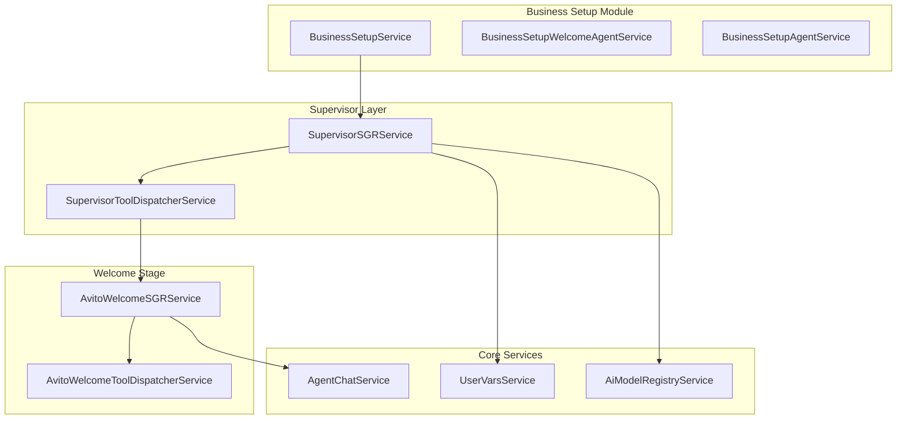
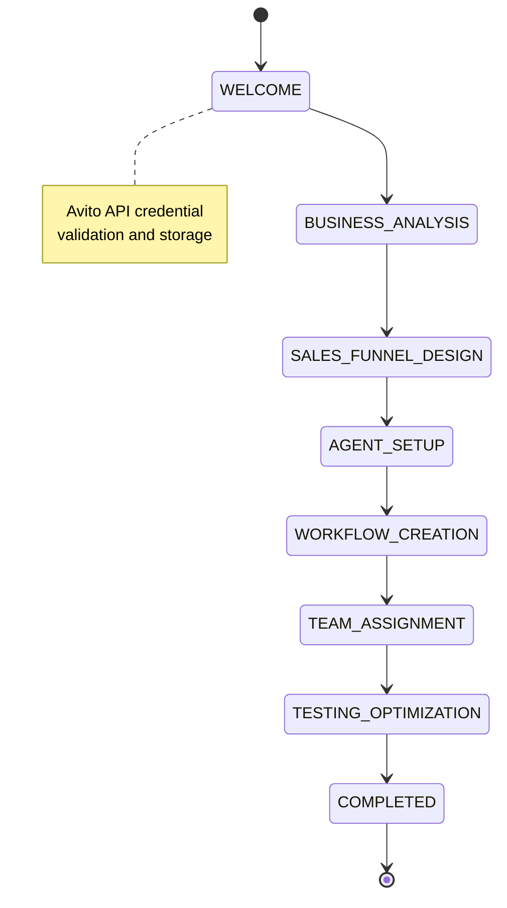
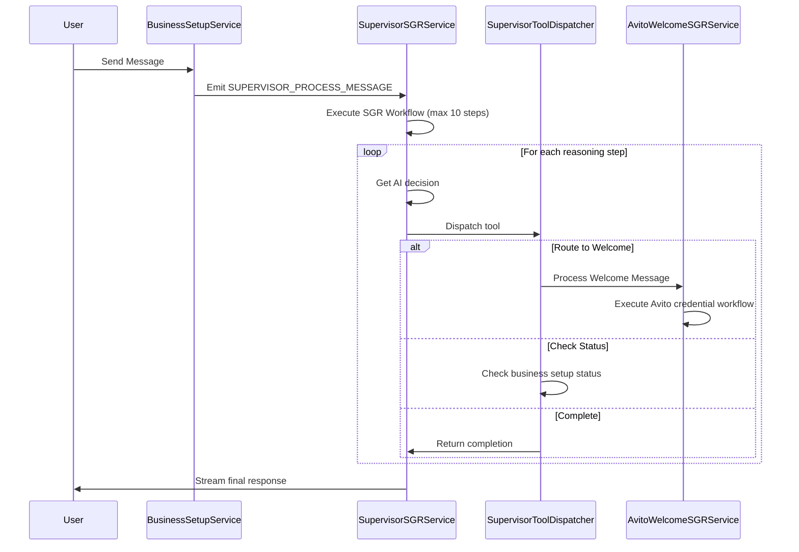
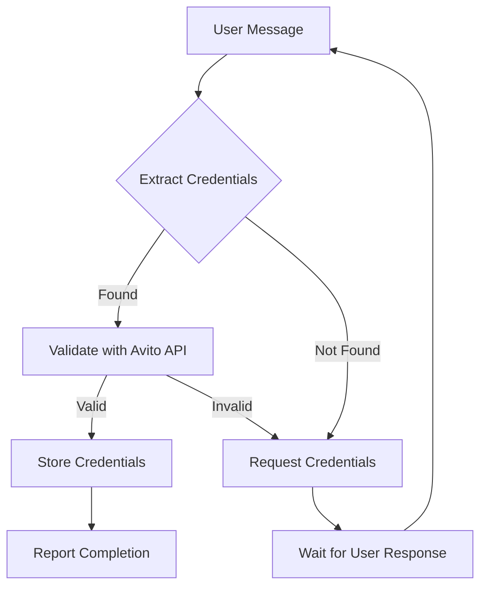
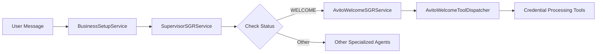
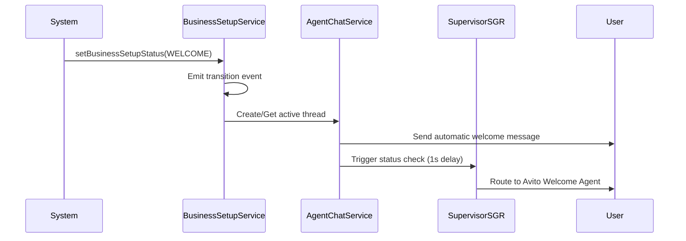

# Supervisor SGR Business Setup Workflow Analysis

## Overview

The Twenty CRM platform implements a sophisticated business setup workflow using a **Supervisor-first architecture** with **Schema-Guided Reasoning (SGR)** for intelligent agent routing and task orchestration. The system automatically guides users through an 8-stage business setup process, with the Welcome stage specifically handling Avito API integration through credential validation and storage.

## Technology Stack

- **AI Model**: Google Gemini 2.5 Flash
- **Backend**: NestJS with TypeScript
- **State Management**: UserVarsService with PostgreSQL persistence
- **Event System**: EventEmitter2 for decoupled communication
- **Schema Validation**: Zod schemas for structured decision-making
- **Streaming**: Real-time AI reasoning visibility

## Architecture

### Core Components



### Business Setup Status Flow



## Supervisor Agent Architecture

### Core Functionality

The SupervisorSGRService serves as the central orchestrator that:

1. **Receives messages** via event-driven architecture
2. **Analyzes user intent** using structured AI reasoning
3. **Routes requests** to specialized agents based on business setup status
4. **Provides transparency** through streaming thought processes
5. **Manages state transitions** across business setup stages

### Key Configuration

```typescript
const SUPERVISOR_CONFIG = {
  MODEL_ID: 'google/gemini-2.5-flash',
  maxSteps: 10,
  totalTimeoutMs: 30000,
  stepTimeoutMs: 5000,
  retryAttempts: 3,
  temperature: 0.1
};
```

### Processing Workflow



### Tool Dispatcher Architecture

The SupervisorToolDispatcherService handles five core tool types:

1. **check_business_setup_status**: Determines current stage
2. **route_to_specialized_agent**: Routes to stage-specific agents
3. **process_directly**: Handles general queries
4. **status_change**: Manages state transitions
5. **complete_routing**: Finalizes routing decisions

## Welcome Stage - Avito Integration

### SGR Workflow Implementation

The AvitoWelcomeSGRService implements a sophisticated credential processing workflow:



### Credential Processing Tools

| Tool | Purpose | Implementation |
|------|---------|----------------|
| `extract_credentials` | Parse CLIENT_ID and CLIENT_SECRET from user message | Multiple regex patterns for flexible input |
| `validate_avito_token` | Verify credentials with Avito API | HTTPS call to api.avito.ru/token |
| `store_credentials` | Persist validated credentials | UserVarsService with secure storage |
| `request_credentials` | Ask user for missing credentials | Friendly Russian language prompts |
| `report_welcome_completion` | Complete welcome stage | Transition to BUSINESS_ANALYSIS |

### Credential Validation Process

```typescript
// API endpoint validation
const avitoApiEndpoint = 'https://api.avito.ru/token';

// Credential format validation rules
const CREDENTIAL_VALIDATION_RULES = {
  clientId: {
    minLength: 10,
    maxLength: 100,
    pattern: /^[A-Za-z0-9_-]+$/
  },
  clientSecret: {
    minLength: 20,
    maxLength: 200,
    pattern: /^[A-Za-z0-9_-]+$/
  }
};
```

### Streaming SGR Implementation

Both Supervisor and Welcome stages implement real-time streaming:

```typescript
interface SGRStreamingResult {
  type: 'thinking' | 'tool_execution' | 'final_response';
  content?: string;
  step?: SGRThinkingStep;
  completed: boolean;
  timestamp?: string;
}
```

## Event-Driven Architecture

### Core Events

| Event | Purpose | Payload |
|-------|---------|---------|
| `BUSINESS_SETUP_ROUTE_MESSAGE` | Trigger supervisor routing | userId, message, workspaceId |
| `SUPERVISOR_PROCESS_MESSAGE` | Start SGR workflow | message, userId, workspaceId, threadId |
| `SUPERVISOR_THINKING_STEP` | Stream AI reasoning | step details, userId, workspaceId |
| `SUPERVISOR_ROUTING_COMPLETED` | Routing decision made | success, finalMessage, routedTo |
| `SUPERVISOR_ERROR_OCCURRED` | Error handling | errorType, errorMessage, context |

### State Management

Business setup state is persisted using UserVarsService with typed key-value storage:

```typescript
enum BusinessSetupStepKeys {
  BUSINESS_SETUP_WELCOME_PENDING = 'BUSINESS_SETUP_WELCOME_PENDING',
  BUSINESS_SETUP_CURRENT_STATUS = 'BUSINESS_SETUP_CURRENT_STATUS',
  SUPERVISOR_ENABLED = 'SUPERVISOR_ENABLED',
  AVITO_CLIENT_ID = 'AVITO_CLIENT_ID',
  AVITO_CLIENT_SECRET = 'AVITO_CLIENT_SECRET',
  AVITO_ACCESS_TOKEN = 'AVITO_ACCESS_TOKEN',
  // ... additional keys
}
```

## Configuration and Timeouts

### SGR Configuration

```typescript
const DEFAULT_SUPERVISOR_SGR_CONFIG = {
  maxSteps: 10,
  totalTimeoutMs: 30000,     // 30 seconds total
  stepTimeoutMs: 5000,       // 5 seconds per step
  retryAttempts: 3,
  temperature: 0.1
};

const DEFAULT_SGR_THINKING_CONFIG = {
  maxSteps: 10,
  stepTimeoutMs: 5000,
  workflowTimeoutMs: 600000  // 10 minutes for welcome
};
```

### Enhanced Error Handling

The system implements comprehensive error handling with recovery mechanisms:

- **SupervisorException**: Typed error handling with context
- **SGRStreamingException**: Streaming-specific error management  
- **Timeout handling**: Per-step and total workflow timeouts
- **Retry mechanisms**: Exponential backoff for failed operations
- **Circuit breaker patterns**: Prevent cascade failures

## Production Workflow Coordination

### Key Implementation Details

1. **Supervisor-First Architecture**: All business setup threads use `createThreadWithSupervisorAgent`
2. **Automatic Routing**: Messages automatically route based on business setup status
3. **Production Coordination**: AvitoWelcomeSGRService handles production workflow, not AvitoWorkflowStateMachineService
4. **Tool Dispatcher Integration**: AvitoWelcomeToolDispatcherService actively executes production tools
5. **Status-Based Routing**: For WELCOME status, supervisor always routes to SGR Avito Agent

### Critical Production Paths



## API Integration Specifications

### Avito API Requirements

- **Correct Endpoint**: `https://api.avito.ru/token` (not .com)
- **SSL Certificate**: Must match hostname to prevent certificate errors
- **Authentication**: OAuth 2.0 client credentials flow
- **Content Type**: `application/x-www-form-urlencoded`
- **User Agent**: `Twenty CRM Avito Integration v1.0`

### Request Format

```typescript
const requestBody = new URLSearchParams({
  grant_type: 'client_credentials',
  client_id: clientId,
  client_secret: clientSecret
}).toString();
```

## Proposed Enhancement: Automatic Welcome Message System

### Current Behavior Analysis

Currently, the system handles Welcome stage transitions as follows:

1. **Manual Status Setting**: `setBusinessSetupStatus()` is called to transition to WELCOME
2. **Thread Creation**: `createThreadWithBusinessSetupContext()` creates a thread with appropriate agent
3. **Greeting Message**: Agent automatically sends a greeting message based on business setup step
4. **Status Check**: Supervisor automatically triggers status check after 1 second delay

### Proposed Automatic Message Enhancement



### Implementation Strategy

#### 1. Enhanced Business Setup Transition Service

```typescript
@Injectable()
export class BusinessSetupTransitionService {
  async transitionToNextStep(
    userId: string,
    workspaceId: string,
    input: BusinessSetupTransitionInput,
  ): Promise<{ success: boolean; fromStep: string; toStep: string }> {
    // ... existing transition logic ...
    
    // NEW: Trigger automatic message for Welcome stage
    if (input.toStep === BusinessSetupStatus.WELCOME) {
      await this.triggerWelcomeStageMessage(userId, workspaceId);
    }
    
    // ... rest of method ...
  }
  
  private async triggerWelcomeStageMessage(
    userId: string,
    workspaceId: string,
  ): Promise<void> {
    try {
      // Find or create active business setup thread
      const thread = await this.agentChatService.getOrCreateBusinessSetupThread(
        userId,
        workspaceId,
        BusinessSetupStatus.WELCOME
      );
      
      // Send automatic welcome message
      await this.agentChatService.addMessage({
        threadId: thread.id,
        role: AgentChatMessageRole.ASSISTANT,
        content: this.getWelcomeStageMessage(),
        fileIds: [],
      });
      
      // Trigger supervisor status check with delay
      setTimeout(async () => {
        await this.agentChatService.triggerAutomaticStatusCheck(thread.id);
      }, 1000);
      
    } catch (error) {
      this.logger.error('Failed to trigger welcome stage message:', error);
    }
  }
  
  private getWelcomeStageMessage(): string {
    return `🎯 **Добро пожаловать в Business Setup Assistant!**

Вы перешли на этап настройки интеграции с Avito. Я помогу вам:

✅ Получить и проверить API ключи Avito
✅ Настроить безопасное соединение
✅ Подготовить систему к работе

Для начала мне потребуются ваши CLIENT_ID и CLIENT_SECRET от Avito API.

Отправьте их в формате:
\`\`\`
CLIENT_ID=ваш_client_id
CLIENT_SECRET=ваш_client_secret
\`\`\`

Или просто напишите "помощь" для получения подробных инструкций! 🚀`;
  }
}
```

#### 2. Enhanced Agent Chat Service Integration

```typescript
@Injectable()
export class AgentChatService {
  async getOrCreateBusinessSetupThread(
    userId: string,
    workspaceId: string,
    businessSetupStep: BusinessSetupStatus
  ): Promise<AgentChatThreadEntity> {
    // Try to find existing active thread for this user/workspace
    const existingThread = await this.findActiveBusinessSetupThread(
      userId,
      workspaceId
    );
    
    if (existingThread) {
      return existingThread;
    }
    
    // Create new thread with supervisor agent
    return await this.createThreadWithSupervisorAgent(workspaceId);
  }
  
  private async findActiveBusinessSetupThread(
    userId: string,
    workspaceId: string
  ): Promise<AgentChatThreadEntity | null> {
    // Implementation to find active business setup thread
    // Could be based on recent activity, thread metadata, etc.
  }
}
```

#### 3. Event-Driven Architecture Enhancement

```typescript
// New event types for automatic messaging
export const BUSINESS_SETUP_EVENTS = {
  WELCOME_STAGE_ENTERED: 'business-setup.welcome.stage-entered',
  AUTOMATIC_MESSAGE_SENT: 'business-setup.welcome.auto-message-sent',
  AUTOMATIC_MESSAGE_FAILED: 'business-setup.welcome.auto-message-failed',
  // ... existing events
};

// Event handlers in BusinessSetupService
@OnEvent(BUSINESS_SETUP_EVENTS.WELCOME_STAGE_ENTERED)
async handleWelcomeStageEntered(payload: {
  userId: string;
  workspaceId: string;
  timestamp: Date;
}): Promise<void> {
  await this.transitionService.triggerWelcomeStageMessage(
    payload.userId,
    payload.workspaceId
  );
}
```

### Configuration Options

```typescript
const WELCOME_MESSAGE_CONFIG = {
  enableAutomaticMessages: true,
  statusCheckDelay: 1000, // 1 second
  messageTemplate: 'welcome_stage_avito',
  retryAttempts: 3,
  retryDelay: 2000,
};
```

### Testing Strategy Enhancements

#### Unit Tests
- Automatic message triggering on Welcome transition
- Message content generation and localization
- Error handling for failed message delivery
- Event emission verification

#### Integration Tests
- End-to-end Welcome stage automatic flow
- Thread creation/reuse logic
- Supervisor status check coordination
- User experience flow validation

### Benefits

1. **Proactive User Guidance**: Users immediately know what to do when entering Welcome stage
2. **Consistent Experience**: Every Welcome transition triggers the same helpful workflow
3. **Reduced User Confusion**: Clear instructions appear automatically
4. **Improved Onboarding**: Seamless transition from registration to API setup
5. **Better Conversion**: Users are more likely to complete setup with immediate guidance

### Rollback Strategy

The enhancement can be controlled via feature flags:
- `ENABLE_AUTOMATIC_WELCOME_MESSAGES`
- Graceful fallback to existing manual interaction flow
- Configuration-based message customization

## Testing Strategy

### Unit Testing Coverage

- SupervisorSGRService: Routing logic and tool dispatch
- AvitoWelcomeSGRService: Credential processing workflow
- SupervisorToolDispatcherService: Tool execution validation
- Error recovery scenarios: Timeout and failure handling
- State transition validation: Business setup flow integrity
- **NEW**: Automatic welcome message triggering and delivery
- **NEW**: Welcome stage transition event handling

### Integration Testing

- End-to-end supervisor routing
- Avito API credential validation
- State persistence across sessions
- Event-driven communication flow
- Streaming SGR user experience
- **NEW**: Automatic Welcome stage message flow
- **NEW**: Thread creation/reuse for business setup