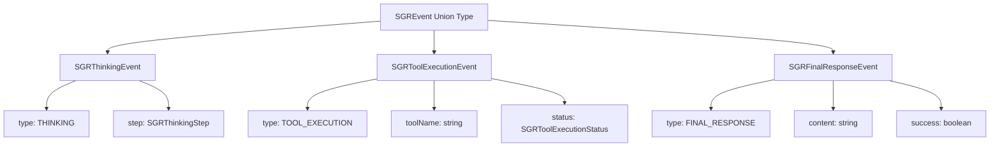

# TypeScript Error Fixes for SGR Event Handling

## Overview

This design addresses multiple TypeScript errors in the Twenty frontend codebase, specifically in the AIChatTab component test file and related SGR (Schema-Guided Reasoning) event handling system. The errors stem from type mismatches between test mock objects and expected SGR event types, as well as a missing import path resolution.

## Repository Type

**Full-Stack Application** - React frontend with NestJS backend in an Nx monorepo

## Architecture

The SGR event system follows a discriminated union pattern for type safety:



## Core Issues Identified

### 1. Import Resolution Error
- **Issue**: `Cannot find module 'twenty-ui' or its corresponding type declarations`
- **Root Cause**: Test imports `lightTheme` from 'twenty-ui' but should import `THEME_LIGHT`
- **Location**: `AIChatTab.test.tsx:9:28`

### 2. Type Discrimination Failures
- **Issue**: Mock objects don't properly match discriminated union types
- **Root Cause**: Using generic `SGRMessageType` enum instead of specific literal types
- **Affected Events**: All SGR event types in test mocks

### 3. Type Guard Failures
- **Issue**: TypeScript can't narrow union types due to improper mock structure
- **Impact**: Events with `null`/invalid properties fail type assignment

## Type System Architecture

### Current SGR Event Types

```typescript
// Discriminated Union Structure
type SGREvent = SGRThinkingEvent | SGRToolExecutionEvent | SGRFinalResponseEvent

interface SGRThinkingEvent {
  type: SGRMessageType.THINKING;  // Literal type
  step: SGRThinkingStep;
  threadId: string;
  timestamp: Date;
}

interface SGRToolExecutionEvent {
  type: SGRMessageType.TOOL_EXECUTION;  // Literal type
  toolName: string;
  status: SGRToolExecutionStatus;
  threadId: string;
  timestamp: Date;
}

interface SGRFinalResponseEvent {
  type: SGRMessageType.FINAL_RESPONSE;  // Literal type
  content: string;
  success: boolean;
  threadId: string;
  timestamp: Date;
}
```

### Required Test Mock Structure

Test mocks must use exact literal types to satisfy TypeScript's discriminated union checking:

```typescript
// ✅ Correct - Uses literal type
const mockThinkingEvent: SGRThinkingEvent = {
  type: SGRMessageType.THINKING as const,
  step: { /* valid step data */ },
  threadId: 'test-thread-123',
  timestamp: new Date(),
}

// ❌ Incorrect - Generic enum type
const mockThinkingEvent = {
  type: SGRMessageType.THINKING,  // TypeScript sees this as generic SGRMessageType
  step: { /* step data */ },
  threadId: 'test-thread-123',
  timestamp: new Date(),
}
```

## Resolution Strategy

### 1. Import Path Correction

Replace incorrect twenty-ui import with proper theme import:

```typescript
// Current (incorrect)
import { lightTheme } from 'twenty-ui';

// Fixed
import { THEME_LIGHT } from 'twenty-ui';
```

### 2. Type-Safe Mock Objects

Update all test mocks to use proper typing and literal type assertions:

```typescript
// Thinking Event Mock
const mockThinkingEvent: SGRThinkingEvent = {
  type: SGRMessageType.THINKING,
  step: {
    stepNumber: 2,
    currentState: 'Processing credentials',
    plannedSteps: ['Validate', 'Store'],
    selectedTool: 'validator',
    timestamp: new Date(),
  },
  threadId: 'test-thread-123',
  timestamp: new Date(),
};

// Tool Execution Event Mock
const mockToolEvent: SGRToolExecutionEvent = {
  type: SGRMessageType.TOOL_EXECUTION,
  toolName: 'credential_extractor',
  status: SGRToolExecutionStatus.IN_PROGRESS,
  threadId: 'test-thread-123',
  timestamp: new Date(),
};

// Final Response Event Mock
const mockFinalEvent: SGRFinalResponseEvent = {
  type: SGRMessageType.FINAL_RESPONSE,
  content: 'Process completed successfully',
  success: true,
  threadId: 'test-thread-123',
  timestamp: new Date(),
};
```

### 3. Invalid Event Handling

For testing error scenarios, create separate types that allow invalid properties:

```typescript
// Type for testing invalid events
type InvalidSGREvent = {
  type: SGRMessageType | null | string;
  step?: SGRThinkingStep | null;
  toolName?: string | null;
  status?: SGRToolExecutionStatus;
  content?: string;
  success?: boolean;
  threadId: string;
  timestamp: Date;
}

// Use type assertion for invalid test cases
const mockInvalidEvent = {
  type: null,
  threadId: 'test-thread-123',
  timestamp: new Date(),
} as any; // Type assertion to bypass strict checking
```

## Testing Strategy

### Type-Safe Event Array Handling

Create properly typed event arrays for multi-event tests:

```typescript
const events: SGREvent[] = [
  {
    type: SGRMessageType.THINKING,
    step: { /* valid step */ },
    threadId: 'test-thread-123',
    timestamp: new Date(),
  } satisfies SGRThinkingEvent,
  {
    type: SGRMessageType.TOOL_EXECUTION,
    toolName: 'extractor',
    status: SGRToolExecutionStatus.COMPLETED,
    threadId: 'test-thread-123',
    timestamp: new Date(),
  } satisfies SGRToolExecutionEvent,
  {
    type: SGRMessageType.FINAL_RESPONSE,
    content: 'Analysis complete',
    success: true,
    threadId: 'test-thread-123',
    timestamp: new Date(),
  } satisfies SGRFinalResponseEvent,
];
```

### Mock Hook Implementation

Update mock return types to match expected interface:

```typescript
const mockUseSGREvents = jest.mocked(sgrEventBridge.useSGREvents);

// Type-safe mock return
mockUseSGREvents.mockReturnValue({
  events: events,  // Properly typed SGREvent[]
  isConnected: true,
  emitThinkingEvent: jest.fn(),
  emitToolExecutionEvent: jest.fn(),
  emitFinalResponseEvent: jest.fn(),
  getStatus: jest.fn(),
});
```

## Error Prevention Measures

### 1. Strict Type Guards

Ensure type guards work correctly with proper literal types:

```typescript
export function isThinkingEvent(event: SGREvent): event is SGRThinkingEvent {
  return event.type === SGRMessageType.THINKING;
}

// Usage in tests validates correct discrimination
if (isThinkingEvent(mockEvent)) {
  // TypeScript knows event.step exists and is required
  expect(event.step.stepNumber).toBeDefined();
}
```

### 2. Runtime Validation

Add runtime validation in actual implementation for robustness:

```typescript
function validateSGREvent(event: any): event is SGREvent {
  if (!event || typeof event.type !== 'string') {
    return false;
  }
  
  switch (event.type) {
    case SGRMessageType.THINKING:
      return event.step && typeof event.step.stepNumber === 'number';
    case SGRMessageType.TOOL_EXECUTION:
      return typeof event.toolName === 'string' && event.status;
    case SGRMessageType.FINAL_RESPONSE:
      return typeof event.content === 'string' && typeof event.success === 'boolean';
    default:
      return false;
  }
}
```

### 3. Theme Import Consistency

Establish consistent theme import pattern across codebase:

```typescript
// Standardize on named imports from twenty-ui
import { THEME_LIGHT, THEME_DARK } from 'twenty-ui';

// Use in ThemeProvider
<ThemeProvider theme={THEME_LIGHT}>
  {children}
</ThemeProvider>
```

## Implementation Impact

### Files Requiring Changes

1. **AIChatTab.test.tsx**: Fix import and all mock object types
2. **SGR Event Types**: Ensure proper discriminated union structure
3. **Theme Exports**: Verify twenty-ui exports are properly configured

### Backward Compatibility

All changes maintain backward compatibility with existing SGR event handling logic. Only test mocks and import statements require updates.

### Performance Considerations

- Type-safe discriminated unions enable better tree-shaking
- Compile-time type checking prevents runtime errors
- No runtime performance impact from type changes

## Testing Coverage

The fix ensures comprehensive testing of:

- ✅ Valid SGR event handling for all event types
- ✅ Invalid/malformed event graceful degradation  
- ✅ Type guard functionality with proper discrimination
- ✅ Event sequence processing with mixed event types
- ✅ Error boundary behavior with exception handling

## Benefits

1. **Type Safety**: Eliminates runtime type errors through strict compile-time checking
2. **Developer Experience**: Clear IntelliSense and autocomplete for SGR events
3. **Maintainability**: Self-documenting code through explicit type definitions
4. **Test Reliability**: Accurate mocks that reflect real runtime behavior
5. **Code Quality**: Adherence to Twenty's TypeScript guidelines and discriminated union patterns