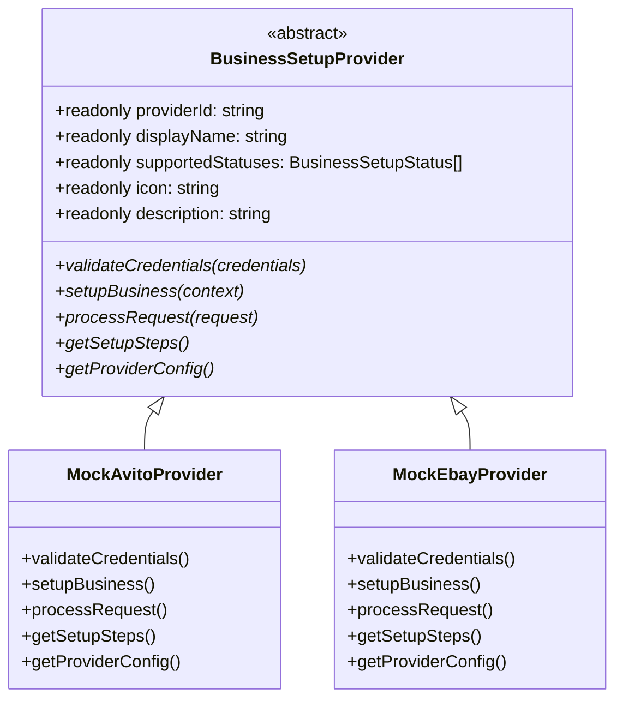
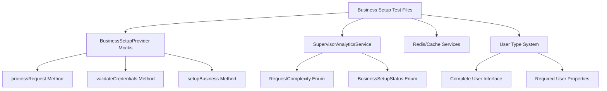

# TypeScript Compilation Error Resolution Design

## Overview

This design document outlines the systematic resolution of TypeScript compilation errors in the Twenty project's business-setup module. The errors span across multiple test files and involve type mismatches, incomplete mock implementations, missing imports, and incorrect enum usage.

## Technology Stack

- **Backend Framework**: NestJS with TypeScript
- **Testing Framework**: Jest with @nestjs/testing
- **Architecture Pattern**: Modular monolith with abstract provider pattern
- **Type System**: Strict TypeScript with complete interface implementations

## Error Categories & Analysis

### 1. Import Resolution Errors
- **Missing RedisService imports**: Test files reference undefined `RedisService`
- **Incorrect service names**: `SupervisorMetricsService` should be `SupervisorAnalyticsService`
- **Root Cause**: Test files using outdated or incorrect service references

### 2. Mock Implementation Completeness Errors
- **BusinessSetupProvider abstract members**: Mock classes missing required abstract method implementations
- **Required Methods**: `processRequest`, `validateCredentials`, `setupBusiness`, `getSetupSteps`, `getProviderConfig`
- **Root Cause**: Test mocks not updated to match current abstract class definition

### 3. Enum Type Mismatches
- **BusinessSetupStatus**: String literals ("WELCOME") instead of enum values (BusinessSetupStatus.WELCOME)
- **RequestComplexity**: String literals ("simple") instead of enum values (RequestComplexity.SIMPLE)
- **Root Cause**: Test data using raw strings instead of typed enum values

### 4. User Type Implementation Errors
- **MockUser objects**: Missing required properties from User interface
- **Required Properties**: firstName, lastName, defaultAvatarUrl, isEmailVerified, and 14+ additional properties
- **Root Cause**: Incomplete mock objects not matching current User type definition

### 5. Method Signature Mismatches
- **Parameter Count**: Methods expecting different number of arguments
- **Boolean Type Issues**: Incorrect usage of Boolean constructor vs boolean primitives
- **Root Cause**: API changes not reflected in test implementations

## Component Architecture

### Abstract Provider Pattern


### Service Dependency Graph


## Resolution Strategy

### Phase 1: Import and Service Reference Corrections

#### 1.1 RedisService Import Resolution
- **Issue**: `RedisService` not found in test files
- **Action**: Replace with correct service imports or create proper mock
- **Files**: `business-setup-status-cache.service.spec.ts`

#### 1.2 Service Name Corrections  
- **Issue**: `SupervisorMetricsService` should be `SupervisorAnalyticsService`
- **Action**: Update all references to use correct service name
- **Files**: `business-setup-status-cache.service.spec.ts`

### Phase 2: Mock Provider Implementation Completion

#### 2.1 BusinessSetupProvider Abstract Members
```typescript
// Required abstract members for all mock providers
interface RequiredProviderMembers {
  processRequest(request: any): Promise<any>;
  validateCredentials(credentials: ProviderCredentials): Promise<ValidationResult>;
  setupBusiness(context: BusinessSetupContext): Promise<SetupResult>;
  getSetupSteps(): ProviderSetupStep[];
  getProviderConfig(): {
    requiredCredentials: string[];
    optionalCredentials: string[];
    apiEndpoints: string[];
    capabilities: string[];
  };
}
```

#### 2.2 Mock Provider Enhancement
- **MockAvitoProvider**: Add missing processRequest implementation
- **MockEbayProvider**: Add missing processRequest implementation
- **Test Object Mocks**: Ensure complete provider interface compliance

### Phase 3: Enum Value Standardization

#### 3.1 BusinessSetupStatus Enum Usage
```typescript
// Current (incorrect)
status: "WELCOME"
status: "COMPLETED" 
status: "BUSINESS_ANALYSIS"

// Corrected
status: BusinessSetupStatus.WELCOME
status: BusinessSetupStatus.COMPLETED
status: BusinessSetupStatus.BUSINESS_ANALYSIS
```

#### 3.2 RequestComplexity Enum Usage
```typescript
// Current (incorrect)
complexity: "simple"

// Corrected  
complexity: RequestComplexity.SIMPLE
```

### Phase 4: User Type Implementation

#### 4.1 Complete MockUser Structure
```typescript
interface MockUser {
  id: string;
  firstName: string;
  lastName: string;
  email: string;
  defaultAvatarUrl: string;
  isEmailVerified: boolean;
  disabled?: boolean;
  locale: string;
  createdAt: Date;
  updatedAt: Date;
  deletedAt?: Date;
  onboardingStatus?: OnboardingStatus;
  passwordHash?: string;
  supportUserHash?: string;
  userVars?: JSONObject;
  canAccessFullAdminPanel: boolean;
  canImpersonate: boolean;
  // Additional required properties...
}
```

#### 4.2 Mock User Factory
- **Create centralized MockUser factory**: Consistent user object generation
- **Type-safe implementation**: Ensure all required properties are present
- **Reusable across tests**: Single source of truth for mock user data

### Phase 5: Method Signature Alignment

#### 5.1 Parameter Count Corrections
- **Issue**: Methods called with wrong number of arguments
- **Action**: Align test calls with current method signatures
- **Examples**: Provider registration methods, UI guidance methods

#### 5.2 Boolean Type Corrections
- **Issue**: Boolean constructor vs boolean primitive confusion
- **Action**: Replace `Boolean` constructor calls with proper boolean values
- **Pattern**: `.toHaveBeenCalledWith(expect.any(Boolean))` instead of `Boolean()`

## Testing Strategy

### Unit Test Compliance
- **Mock Completeness**: All mocks implement required abstract members
- **Type Safety**: No TypeScript compilation errors
- **Service Alignment**: Test services match production service interfaces

### Integration Test Readiness
- **Provider Pattern**: Mock providers follow same interface as real providers
- **Data Flow**: Test data matches production data structures  
- **Error Handling**: Proper error type handling in test scenarios

## Implementation Checklist

### Critical Fixes (Phase 1-2)
- [ ] Fix RedisService import issues in business-setup-status-cache.service.spec.ts
- [ ] Correct SupervisorMetricsService to SupervisorAnalyticsService references
- [ ] Add processRequest method to MockAvitoProvider and MockEbayProvider
- [ ] Complete all abstract method implementations in mock providers

### Type Safety Fixes (Phase 3-4)  
- [ ] Replace string literals with BusinessSetupStatus enum values
- [ ] Replace string literals with RequestComplexity enum values  
- [ ] Create complete MockUser implementations with all required properties
- [ ] Update all User type references in test files

### Method Signature Fixes (Phase 5)
- [ ] Align provider registration method calls with current signatures
- [ ] Fix Boolean type usage in test assertions
- [ ] Correct UI guidance method parameter counts
- [ ] Update service method calls to match current interfaces

### Validation & Testing
- [ ] Run `nx run twenty-server:typecheck` to verify all errors resolved
- [ ] Execute individual test files to ensure runtime compatibility
- [ ] Validate mock implementations against production interfaces
- [ ] Confirm no regression in existing test functionality

## Risk Mitigation

### Type Safety Enforcement
- **Strict TypeScript**: Maintain strict type checking throughout resolution
- **Interface Compliance**: Ensure all implementations fully satisfy interface contracts
- **No Type Assertions**: Avoid `any` types or unsafe type assertions

### Backward Compatibility
- **Incremental Changes**: Apply fixes incrementally to maintain stability
- **Test Isolation**: Ensure fixes don't break unrelated test functionality
- **Interface Stability**: Maintain stable interfaces for production code

### Quality Assurance
- **Comprehensive Testing**: Verify each fix category independently
- **Cross-File Impact**: Check for ripple effects across related files
- **Documentation Updates**: Update relevant documentation for interface changes