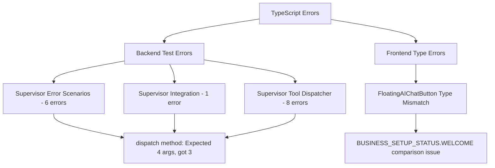
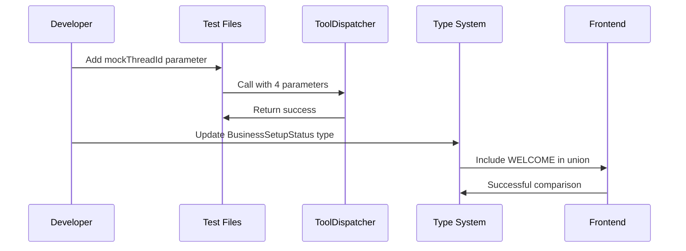

# TypeScript Errors Fix Design Document

## Overview

This document addresses critical TypeScript compilation errors in the Twenty CRM codebase that are preventing successful builds. The errors fall into two categories:

1. **Method Signature Mismatch**: Test files calling methods with incorrect argument counts
2. **Type Definition Inconsistency**: Frontend type comparison issues with business setup status

**Repository Type**: Full-Stack Application (Backend Service + Frontend Application)

**Primary Impact**: 
- Build pipeline failures
- Development workflow interruption  
- Test execution blocked

## Architecture

### Error Categories Analysis



### Root Cause Analysis

#### Backend Method Signature Changes

The `SupervisorToolDispatcherService.dispatch()` method signature has been updated to require 4 parameters:

| Parameter Position | Type | Name | Description |
|-------------------|------|------|-------------|
| 1 | `SupervisorStepResult['function']` | tool | Tool configuration |
| 2 | `string` | userId | User identifier |
| 3 | `string` | workspaceId | Workspace identifier |
| 4 | `string` | threadId | **Missing in tests** - Thread identifier |

#### Frontend Type Definition Gap

The frontend code references `BUSINESS_SETUP_STATUS.WELCOME` but type definitions exclude this value from comparison operations.

## API Endpoints Reference

### Affected Service Methods

#### SupervisorToolDispatcherService

```typescript
// Current Signature (Fixed)
async dispatch(
  tool: SupervisorStepResult['function'],
  userId: string,
  workspaceId: string,
  threadId: string  // Added parameter
): Promise<SupervisorToolExecutionResult>

// Test Files Currently Calling (Broken)
toolDispatcher.dispatch(tool, mockUserId, mockWorkspaceId)
//                                                     ^ Missing threadId
```

#### Related Method Signatures

```typescript
// routeToSpecializedAgent method also affected
async routeToSpecializedAgent(
  status: BusinessSetupStatus,
  message: string,
  userId: string,
  workspaceId: string,
  threadId: string,  // Added parameter
  reason: string
): Promise<SupervisorToolExecutionResult>
```

### Authentication Requirements

- **Service Level**: Tests use mocked authentication with `mockUserId` and `mockWorkspaceId`
- **Thread Context**: New `threadId` parameter requires proper mock thread identifiers

## Data Models & ORM Mapping

### Test Data Structure

```typescript
// Test Mock Data Requirements
interface TestMockContext {
  mockUserId: string;      // Existing
  mockWorkspaceId: string; // Existing  
  mockThreadId: string;    // NEW - Required for all test calls
}

// Business Setup Status Type Definition
type BusinessSetupStatus = 
  | 'WELCOME'              // Frontend expects this
  | 'BUSINESS_ANALYSIS'
  | 'SALES_FUNNEL_DESIGN'
  | 'AGENT_SETUP'
  | 'WORKFLOW_CREATION'
  | 'TEAM_ASSIGNMENT'
  | 'TESTING_OPTIMIZATION'
  | 'COMPLETED';
```

## Business Logic Layer

### Error Resolution Strategy

#### Phase 1: Backend Test Parameter Updates

**Affected Files & Line Numbers:**
1. `supervisor-error-scenarios.spec.ts` - Lines: 250, 334, 338, 359, 403, 440
2. `supervisor-integration.spec.ts` - Line: 389
3. `supervisor-tool-dispatcher.service.spec.ts` - Lines: 107, 152, 175, 190, 209, 223, 340, 353

**Resolution Pattern:**
```typescript
// Before (Broken)
await toolDispatcher.dispatch(tool, mockUserId, mockWorkspaceId)

// After (Fixed)  
await toolDispatcher.dispatch(tool, mockUserId, mockWorkspaceId, mockThreadId)
```

#### Phase 2: Frontend Type Definition Alignment

**Affected File:**
- `FloatingAIChatButton.tsx` - Line: 299

**Resolution:**
```typescript
// Current Issue
businessSetupStatus === BUSINESS_SETUP_STATUS.WELCOME
// Type error: 'WELCOME' not in union type

// Fix: Ensure type definition includes WELCOME
type BusinessSetupStatus = 
  | typeof BUSINESS_SETUP_STATUS.WELCOME  // Explicitly include
  | typeof BUSINESS_SETUP_STATUS.BUSINESS_ANALYSIS
  // ... other statuses
```

### Implementation Sequence



## Middleware & Interceptors

### Mock Thread ID Generation

**Test Setup Requirements:**
```typescript
// Test setup pattern for all affected test files
const mockThreadId = 'test-thread-' + Date.now();

// Or use consistent test thread ID
const mockThreadId = 'mock-thread-id-123';
```

### Error Handling Strategy

**Graceful Degradation:**
- Tests should use valid mock thread IDs
- Frontend should handle undefined WELCOME status gracefully
- Type guards for business setup status validation

## Testing Strategy

### Unit Test Updates

**Test File Modification Pattern:**
1. **Add Mock Thread ID**: Define `mockThreadId` constant in test setup
2. **Update Method Calls**: Add `mockThreadId` as 4th parameter to all dispatch calls
3. **Verify Integration**: Ensure mock thread ID is properly passed through
4. **Type Safety**: Validate that all parameters match expected types

### Test Data Consistency

```typescript
// Standard test setup for all supervisor test files
beforeEach(() => {
  mockUserId = 'user-123';
  mockWorkspaceId = 'workspace-456'; 
  mockThreadId = 'thread-789';        // NEW
});
```

### Regression Prevention

**Type Safety Measures:**
- Strict TypeScript compilation settings
- Pre-commit hooks for type checking
- Automated test parameter validation

### Error Validation Testing

```typescript
// Ensure proper error handling with correct parameter count
it('should handle errors with all required parameters', async () => {
  await expect(
    toolDispatcher.dispatch(
      invalidTool, 
      mockUserId, 
      mockWorkspaceId, 
      mockThreadId  // All 4 parameters
    )
  ).rejects.toThrow(SupervisorException);
});
```

## Implementation Checklist

### Backend Fixes
- [ ] Update `supervisor-error-scenarios.spec.ts` (6 locations)
- [ ] Update `supervisor-integration.spec.ts` (1 location)  
- [ ] Update `supervisor-tool-dispatcher.service.spec.ts` (8 locations)
- [ ] Add `mockThreadId` to all test setups
- [ ] Verify method call signatures match service expectations

### Frontend Fixes
- [ ] Review `BusinessSetupStatus` type definition
- [ ] Ensure `WELCOME` status is properly included in type union
- [ ] Update `FloatingAIChatButton.tsx` type comparison
- [ ] Add type guards for business setup status validation

### Validation
- [ ] Run TypeScript compilation to verify error resolution
- [ ] Execute affected test suites to ensure functionality
- [ ] Validate frontend component renders without type errors
- [ ] Confirm build pipeline completion

### Quality Assurance
- [ ] Code review for parameter consistency
- [ ] Documentation updates for method signatures
- [ ] Integration testing across affected modules
- [ ] Performance impact assessment for additional parameter