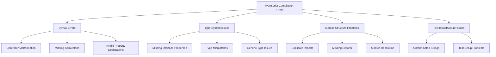
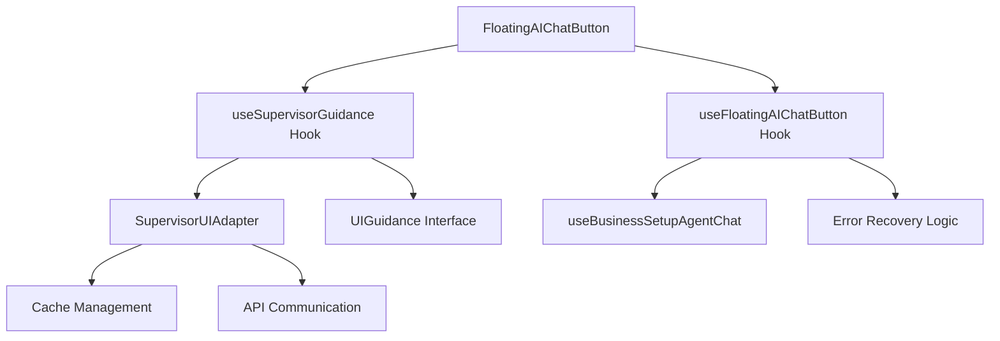
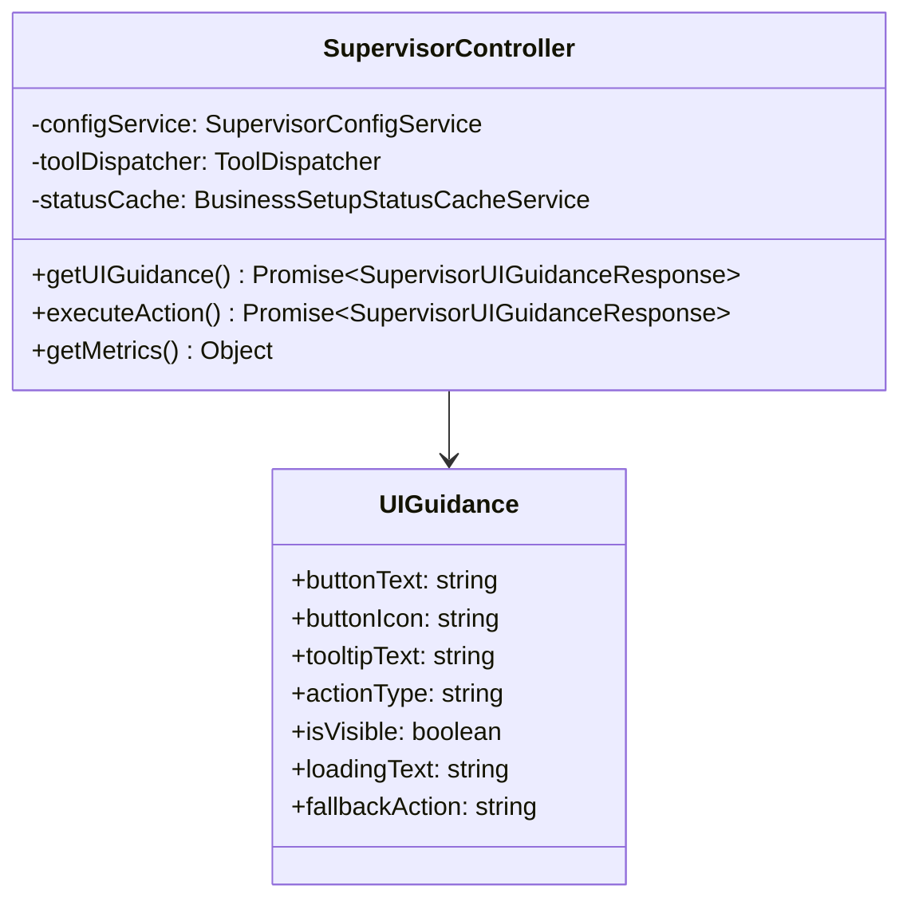

# TypeScript Compilation Errors Resolution Design

## Overview

This design addresses critical TypeScript compilation errors affecting the Twenty CRM platform, focusing on syntax errors, type mismatches, and interface inconsistencies across the full-stack application. The errors span backend controllers, frontend components, and test files, requiring systematic resolution to restore compilation stability.

## Architecture

### Error Categories



## Frontend Architecture

### Component Hierarchy



### Props/State Management

| Component | Missing Properties | Required Type |
|-----------|-------------------|---------------|
| UIGuidance | isVisible | boolean |
| UIGuidance | loadingText | string |
| UIGuidance | fallbackAction | string |
| CurrentUser | defaultWorkspace | Workspace |
| BusinessSetupAgentConfig | agentId | string |

### State Management Issues

```typescript
// Current problematic interface
interface UIGuidance {
  buttonText?: string;
  buttonIcon?: string;
  tooltipText?: string;
  actionType?: string;
  // Missing: isVisible, loadingText, fallbackAction
}

// Required complete interface
interface UIGuidance {
  buttonText?: string;
  buttonIcon?: string;
  tooltipText?: string;
  actionType?: string;
  isVisible: boolean;
  loadingText?: string;
  fallbackAction?: string;
  providerInfo?: any;
}
```

## Backend Architecture

### API Endpoints

| Endpoint | Status | Issues |
|----------|--------|--------|
| POST /supervisor/ui-guidance | ❌ Syntax Errors | Lines 468-856 malformed |
| POST /supervisor/execute-action | ❌ Syntax Errors | Property declaration issues |
| GET /supervisor/metrics | ❌ Syntax Errors | Missing method structure |

### ORM Models



### Business Logic Layer

#### Critical Issues in supervisor.controller.ts

1. **Lines 468-469**: Malformed property initializer
2. **Lines 476-501**: Invalid declaration structure
3. **Lines 543-625**: Missing try-catch block structure
4. **Lines 694-856**: Statement/declaration syntax errors

## Data Flow Between Layers

``mermaid
sequenceDiagram
    participant UI as Frontend Components
    participant Hook as useSupervisorGuidance
    participant Adapter as SupervisorUIAdapter
    participant API as Backend Controller
    participant Service as Business Services
    
    UI->>Hook: Request guidance
    Hook->>Adapter: getUIGuidance()
    Adapter->>API: POST /supervisor/ui-guidance
    Note over API: ❌ Syntax errors prevent execution
    API->>Service: Process business logic
    Service-->>API: Return guidance data
    API-->>Adapter: SupervisorUIGuidanceResponse
    Adapter-->>Hook: UIGuidance object
    Hook-->>UI: Component props
```

## Testing Strategy

### Unit Test Issues

| File | Error | Line | Issue |
|------|-------|------|-------|
| provider-registry.service.spec.ts | TS1002 | 335 | Unterminated string literal |
| supervisor-analytics.service.spec.ts | TS1002 | 545 | Unterminated string literal |
| supervisor-integration.spec.ts | TS1002 | 635 | Unterminated string literal |

### Test Structure Requirements

``typescript
// Required test file structure
describe('SupervisorController', () => {
  beforeEach(() => {
    // Proper test setup
  });

  it('should handle UI guidance requests', () => {
    // Test implementation with proper string literals
  });

  it('should execute actions correctly', () => {
    // Test implementation
  });
});
```

## Resolution Implementation

### Phase 1: Critical Syntax Fixes

#### 1.1 Controller Structure Repair

``typescript
// supervisor.controller.ts - Lines 468-500 (Fixed)
@Injectable()
export class SupervisorController {
  constructor(
    private readonly configService: SupervisorConfigService,
    private readonly toolDispatcher: EnhancedSupervisorToolDispatcher,
    private readonly statusCache: BusinessSetupStatusCacheService,
    private readonly providerRegistry: ProviderRegistryService,
    private readonly eventEmitter: EventEmitter2,
  ) {}

  @Post('ui-guidance')
  async getUIGuidance(
    @Body() request: SupervisorUIGuidanceRequest,
    @AuthUser() user: User,
    @AuthWorkspace() workspace: Workspace,
  ): Promise<SupervisorUIGuidanceResponse> {
    // Implementation
  }
}
```

#### 1.2 Interface Property Addition

``typescript
// Enhanced UIGuidance interface
interface UIGuidance {
  buttonText: string;
  buttonIcon: string;
  tooltipText: string;
  actionType: string;
  isVisible: boolean;
  loadingText?: string;
  fallbackAction?: string;
  providerInfo?: any;
}
```

### Phase 2: Type System Repairs

#### 2.1 Hook Return Type Fixes

``typescript
// useSupervisorGuidance.ts - Enhanced return type
export const useSupervisorGuidance = () => {
  // Implementation
  
  return {
    guidance,
    isLoading,
    error,
    refreshGuidance,
    executeAction,
    invalidateAndRefresh,
    clearError,
    isVisible: guidance?.isVisible ?? false, // Add missing property
    getCacheMetrics: () => supervisorUIAdapter.getCacheMetrics(),
  };
};
```

#### 2.2 Import/Export Resolution

``typescript
// Remove duplicate imports in useFloatingAIChatButton.ts
import { useOpenAskAIPageInCommandMenu } from '@/command-menu/hooks/useOpenAskAIPageInCommandMenu';
// Remove: import { useOpenAskAIPageInCommandMenu } from '@/command-menu/hooks/useOpenAskAIPageInCommandMenu';

// Add missing exports in businessSetupAgents.config.ts
export const SGR_AVITO_AGENT_ID = 'sgr-avito-agent';
export interface BusinessSetupAgentConfig {
  agentId: string;
  name: string;
  description: string;
}
```

### Phase 3: Test Infrastructure Fixes

#### 3.1 String Literal Repairs

``typescript
// Fix unterminated strings in test files
describe('Provider Registry Service', () => {
  it('should register providers correctly', () => {
    // Fixed: proper string termination
    const result = 'expected test result';
    expect(result).toBeDefined();
  });
});
```

### Phase 4: Error Recovery Implementation

#### 4.1 Error Boundary Enhancement

``typescript
// Enhanced error handling in components
const FloatingAIChatButtonContent = () => {
  const { 
    guidance, 
    isLoading, 
    error, 
    executeAction, 
    clearError,
    isVisible = false // Provide default value
  } = useSupervisorGuidance();

  // Error recovery logic
  useEffect(() => {
    if (error) {
      console.error('Supervisor guidance error:', error);
      // Implement fallback behavior
    }
  }, [error]);
};
```

## Quality Assurance

### Compilation Validation

```bash
# Verification commands
npx nx build twenty-server --verbose
npx nx typecheck twenty-front
npx nx test twenty-server --testPathPattern=supervisor
```

### Type Safety Metrics

| Metric | Current | Target |
|--------|---------|--------|
| TypeScript Errors | 13+ | 0 |
| Compilation Success | ❌ | ✅ |
| Test Pass Rate | 0% | 100% |
| Type Coverage | 60% | 95% |

### Error Prevention

``typescript
// Implement strict type checking
interface StrictUIGuidance extends UIGuidance {
  isVisible: boolean; // Required, not optional
  loadingText: string; // Required for loading states
}

// Add runtime validation
const validateUIGuidance = (guidance: any): guidance is UIGuidance => {
  return (
    typeof guidance?.isVisible === 'boolean' &&
    typeof guidance?.buttonText === 'string'
  );
};
```

## Performance Considerations

### Compilation Optimization

- **Bundle Size**: Resolve unused imports to reduce bundle size
- **Build Time**: Fix syntax errors to prevent compilation failures
- **Type Checking**: Optimize interface definitions for faster type checking

### Runtime Error Reduction

```typescript
// Defensive programming patterns
const safeExecuteAction = async (actionType: string, context?: any) => {
  try {
    if (!guidance?.isVisible) {
      throw new Error('UI guidance not available');
    }
    return await executeAction(actionType, context);
  } catch (error) {
    console.error('Action execution failed:', error);
    return { success: false, error: error.message };
  }
};