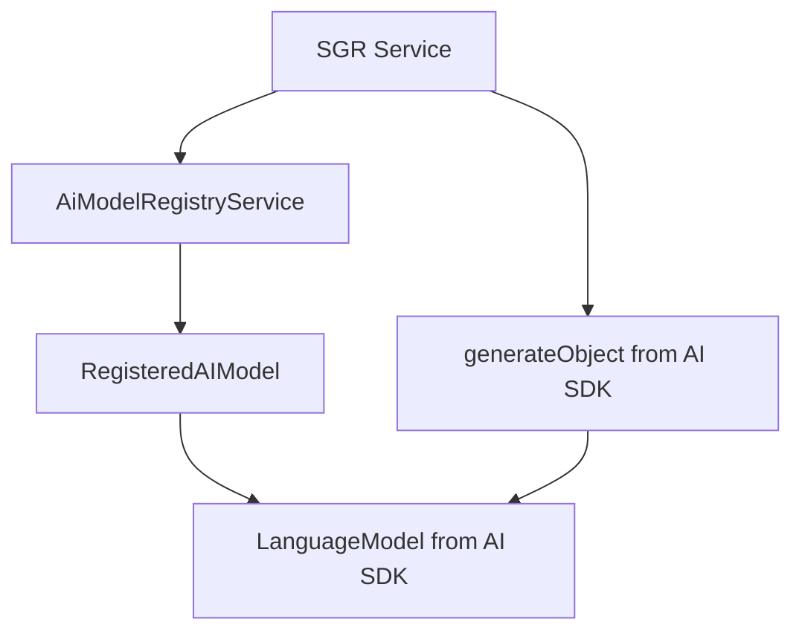
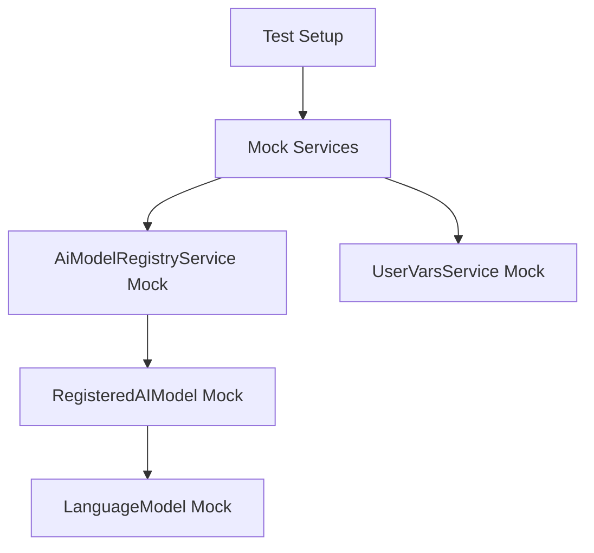

# TypeScript Compilation Fix Design

## Overview

This design document addresses critical TypeScript compilation errors preventing the twenty-server build from completing successfully. The errors are related to AI model interface mismatches and incorrect mock configurations in test files.

## Repository Type

**Full-Stack Application** - The Twenty CRM is a comprehensive full-stack application with:
- Backend: NestJS TypeScript server
- Frontend: React TypeScript application  
- Testing: Jest with TypeScript
- AI Integration: Schema-Guided Reasoning (SGR) with AI models

## Architecture

### Current Error Analysis

Two primary TypeScript compilation errors are blocking the build:

1. **AI Model Interface Mismatch** (Line 383 in `avito-welcome-sgr.integration.spec.ts`)
   - Error: `Property 'generateObject' does not exist on type 'LanguageModelV1'`
   - Root Cause: Mock configuration incorrectly assigns `generateObject` to the model instance

2. **Jest Mock Type Error** (Line 221 in `avito-welcome-sgr.service.spec.ts`)  
   - Error: `Argument of type 'null' is not assignable to parameter of type 'string | boolean | Promise<string | boolean>'`
   - Root Cause: Mock service returning `null` for method expecting non-null values

### Error Context

The errors occur in the business setup SGR (Schema-Guided Reasoning) system that implements AI-driven credential collection for Avito API integration.

## Technical Architecture

### AI Model Registry Pattern


### Mock Configuration Architecture


## Error Resolution Strategy

### 1. AI Model Interface Fix

**Problem**: Test mocks incorrectly place `generateObject` on the model instance instead of using it as a standalone function.

**Current Incorrect Pattern**:
```typescript
// ❌ Wrong - generateObject is not a method of LanguageModel
model: {
  generateObject: jest.fn()
}
```

**Correct Pattern**:
```typescript  
// ✅ Correct - generateObject is imported from 'ai' package
import { generateObject } from 'ai';
// Mock the generateObject function globally or via jest.mock()
```

### 2. Mock Return Value Fix

**Problem**: UserVarsService mock returns `null` but the actual service returns typed values.

**Current Issue**:
```typescript
// ❌ Wrong - null not assignable to string | boolean
mockUserVarsService.get.mockResolvedValue(null)
```

**Solution Strategy**:
```typescript
// ✅ Correct - return appropriate default values
mockUserVarsService.get.mockResolvedValue(false) // for boolean fields
mockUserVarsService.get.mockResolvedValue('') // for string fields
```

## Implementation Plan

### Phase 1: AI Model Mock Correction

**Files to Modify**:
- `avito-welcome-sgr.integration.spec.ts` (line 383)
- `avito-welcome-sgr.service.spec.ts` (related mocks)

**Changes Required**:
1. Remove `generateObject` from model mock
2. Mock `generateObject` at module level using `jest.mock('ai')`
3. Ensure mock returns properly typed responses

### Phase 2: UserVarsService Mock Fix

**Files to Modify**:
- `avito-welcome-sgr.service.spec.ts` (line 221 context)

**Changes Required**:
1. Replace `null` returns with appropriate typed defaults
2. Ensure mock behavior matches expected service interface
3. Add proper type annotations for mock return values

### Phase 3: Type Safety Improvements

**Validation Steps**:
1. Verify all mock interfaces match actual service contracts
2. Ensure test coverage maintains realistic behavior simulation
3. Validate TypeScript strict mode compliance

## Testing Strategy

### Unit Test Validation
- Mock services must return properly typed values
- AI model mocks should simulate realistic behavior
- Error handling paths must be properly tested

### Integration Test Requirements  
- End-to-end SGR workflow testing
- AI model integration verification
- Fallback mechanism validation

### Type Safety Verification
- All mocks must satisfy TypeScript strict mode
- Interface contracts must be maintained
- No `any` types in production code paths

## Implementation Details

### Mock Configuration Pattern
```typescript
// Correct AI model registry mock
mockAiModelRegistryService = {
  getModel: jest.fn().mockReturnValue({
    modelId: 'google/gemini-2.5-flash',
    provider: 'google',
    model: mockLanguageModel // LanguageModel instance
  })
}

// Separate generateObject mock
jest.mock('ai', () => ({
  generateObject: jest.fn().mockResolvedValue({
    object: { /* structured response */ }
  })
}))
```

### Service Mock Type Safety
```typescript
// Correct service mock with proper types
mockUserVarsService = {
  get: jest.fn().mockImplementation((params) => {
    // Return appropriate typed values based on key
    switch (params.key) {
      case BusinessSetupStepKeys.BUSINESS_SETUP_WELCOME_PENDING:
        return Promise.resolve(false); // boolean
      case BusinessSetupStepKeys.AVITO_CLIENT_ID:
        return Promise.resolve('mock-client-id'); // string
      default:
        return Promise.resolve(undefined); // undefined for optional values
    }
  })
}
```

## File Modifications Required

### 1. avito-welcome-sgr.integration.spec.ts
- **Line 55-60**: Remove `generateObject` from model mock
- **Line 25-30**: Add proper AI SDK mocking
- **Line 383**: Ensure mock model structure matches expected interface

### 2. avito-welcome-sgr.service.spec.ts  
- **Line 221**: Fix null return value with proper typing
- **Line 25-35**: Update UserVarsService mock configuration
- **Line 40-50**: Align AI model mock with integration test pattern

## Validation Criteria

### Build Success Metrics
- ✅ TypeScript compilation completes without errors
- ✅ All test files pass type checking
- ✅ Mock interfaces satisfy strict mode requirements

### Functional Test Requirements
- ✅ SGR workflow tests execute successfully  
- ✅ AI model integration functions correctly
- ✅ Error handling maintains expected behavior

### Code Quality Standards
- ✅ No TypeScript `any` types introduced
- ✅ Mock behavior remains realistic
- ✅ Test coverage preserved or improved

## Risk Mitigation

### Type Safety Risks
- **Risk**: Mock changes break test functionality
- **Mitigation**: Incremental testing with each fix

### Integration Risks  
- **Risk**: AI model behavior changes affect SGR system
- **Mitigation**: Preserve mock response structure and timing

### Regression Risks
- **Risk**: Fixes introduce new compilation errors
- **Mitigation**: Run full build after each change