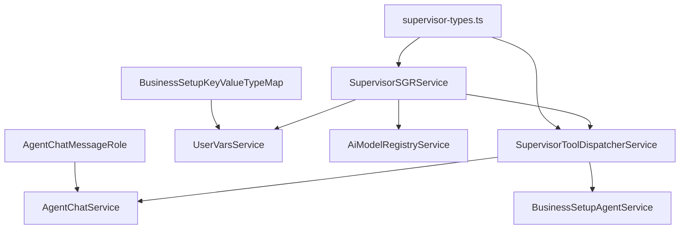

# TypeScript Compilation Fixes for Supervisor SGR Implementation

## Overview

This document outlines the fixes required to resolve TypeScript compilation errors in the business setup supervisor SGR (Schema-Guided Reasoning) implementation. The errors are related to type mismatches, missing type exports, and incorrect type usage in the supervisor workflow system.

## Architecture

The supervisor SGR system consists of several key components that need type alignment:



## Type System Issues & Solutions

### 1. Missing SupervisorToolExecutionResult Export

**Error**: `'"../types/supervisor-types"' has no exported member named 'SupervisorToolExecutionResult'`

**Root Cause**: The `SupervisorToolExecutionResult` interface is defined in `supervisor-sgr.schema.ts` but not exported from `supervisor-types.ts`

**Solution**: 
- Move `SupervisorToolExecutionResult` interface to `supervisor-types.ts`
- Ensure proper export and import structure
- Maintain compatibility with existing `SupervisorToolExecutionStreamResult`

### 2. AgentChatMessageRole Type Mismatch

**Error**: `Type '"user"' is not assignable to type 'AgentChatMessageRole'`

**Root Cause**: The `AgentChatMessageRole` enum only accepts `'user'` and `'assistant'` values, but the code is trying to assign a string literal

**Solution**:
- Use enum values instead of string literals
- Import and use `AgentChatMessageRole.USER` instead of `'user'`

### 3. BusinessSetupKeyValueTypeMap Key Issues

**Errors**:
- `Type '"SUPERVISOR_ENABLED"' is not assignable to type 'keyof BusinessSetupKeyValueTypeMap'`
- `Type '"BUSINESS_SETUP_CURRENT_STATUS"' is not assignable to type 'keyof BusinessSetupKeyValueTypeMap'`

**Root Cause**: Missing keys in `BusinessSetupStepKeys` enum and `BusinessSetupKeyValueTypeMap` type definition

**Solution**:
- Extend `BusinessSetupStepKeys` enum with supervisor-specific keys
- Update `BusinessSetupKeyValueTypeMap` to include new key-value mappings

### 4. Type Coercion Issues

**Error**: `Type 'string | boolean' is not assignable to type 'boolean'`

**Root Cause**: UserVarsService can return string or boolean, but code expects boolean only

**Solution**:
- Add proper type checking and conversion logic
- Handle both string and boolean return types from UserVarsService

### 5. Test Parameter Type Issues

**Error**: `Argument of type 'null' is not assignable to parameter`

**Root Cause**: Test is passing `null` where a specific type is expected

**Solution**:
- Update test mocks to provide proper type-safe values
- Use proper mock implementations

## Type Definitions

### Enhanced Supervisor Types

```typescript
// supervisor-types.ts extensions
export interface SupervisorToolExecutionResult {
  success: boolean;
  data?: any;
  error?: string;
  message: string;
  timestamp: Date;
}

export interface SupervisorStatus {
  supervisorEnabled: boolean;
  currentBusinessSetupStatus?: BusinessSetupStatus;
  lastProcessedAt?: Date;
  activeThreads?: number;
}
```

### Extended Business Setup Types

```typescript
// BusinessSetupStepKeys extensions
export enum BusinessSetupStepKeys {
  // ... existing keys
  SUPERVISOR_ENABLED = 'SUPERVISOR_ENABLED',
  BUSINESS_SETUP_CURRENT_STATUS = 'BUSINESS_SETUP_CURRENT_STATUS',
}

// BusinessSetupKeyValueTypeMap extensions
export type BusinessSetupKeyValueTypeMap = {
  // ... existing mappings
  [BusinessSetupStepKeys.SUPERVISOR_ENABLED]: boolean;
  [BusinessSetupStepKeys.BUSINESS_SETUP_CURRENT_STATUS]: BusinessSetupStatus;
};
```

## Implementation Strategy

### Phase 1: Type Definition Fixes

1. **Update supervisor-types.ts**
   - Move `SupervisorToolExecutionResult` from schema file
   - Add missing type exports
   - Ensure proper interface definitions

2. **Extend BusinessSetupStepKeys enum**
   - Add `SUPERVISOR_ENABLED` key
   - Add `BUSINESS_SETUP_CURRENT_STATUS` key

3. **Update BusinessSetupKeyValueTypeMap**
   - Map new keys to appropriate types
   - Ensure type safety for UserVarsService operations

### Phase 2: Service Implementation Fixes

1. **SupervisorToolDispatcherService fixes**
   - Import correct types from supervisor-types
   - Use `AgentChatMessageRole.USER` instead of string literal
   - Add proper error handling for type coercion

2. **SupervisorSGRService fixes**
   - Use new BusinessSetupStepKeys enum values
   - Add type guards for UserVarsService return values
   - Handle string-to-boolean conversion safely

### Phase 3: Test Infrastructure Updates

1. **Update test mocks**
   - Provide proper type-safe mock values
   - Replace `null` arguments with appropriate defaults
   - Ensure test coverage for new type scenarios

## Error Handling Strategy

### Type-Safe UserVarsService Operations

```typescript
// Type-safe helper for boolean values
private async getBooleanValue(
  userId: string,
  workspaceId: string,
  key: keyof BusinessSetupKeyValueTypeMap
): Promise<boolean> {
  const value = await this.userVarsService.get({ userId, workspaceId, key });
  
  if (typeof value === 'boolean') {
    return value;
  }
  
  if (typeof value === 'string') {
    return value.toLowerCase() === 'true';
  }
  
  return false; // Default fallback
}
```

### AgentChatService Integration

```typescript
// Type-safe message role usage
await this.agentChatService.addMessage({
  threadId,
  role: AgentChatMessageRole.USER, // Use enum instead of string
  content: message,
  fileIds: []
});
```

## Testing Strategy

### Unit Test Enhancements

1. **Type Safety Validation**
   - Test proper enum usage
   - Validate type coercion logic
   - Ensure error handling for type mismatches

2. **Mock Improvements**
   - Type-safe mock implementations
   - Proper return value typing
   - Comprehensive error scenario coverage

3. **Integration Testing**
   - End-to-end supervisor workflow validation
   - Type compatibility across service boundaries
   - Error propagation testing

## Migration Considerations

### Backward Compatibility

- Existing code using string literals needs gradual migration
- Old test fixtures require updates
- Service interfaces maintain compatibility

### Deployment Strategy

- Deploy type fixes incrementally
- Monitor for runtime type errors
- Validate supervisor workflow functionality

### Performance Impact

- Minimal performance overhead from type checking
- Improved development experience with better IntelliSense
- Reduced runtime errors through compile-time validation