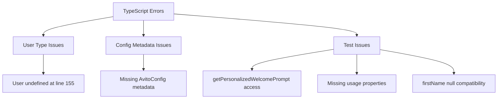
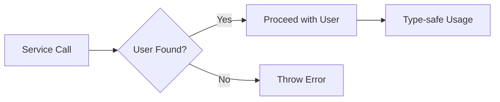

# TypeScript Error Fix Design Document

## Overview

This document provides a systematic approach to fix multiple TypeScript compilation errors in the Twenty project related to business setup and configuration modules. The errors span type mismatches, missing properties, and test inconsistencies.

## Architecture

### Error Classification

The errors can be categorized into:
1. **Type Safety Issues**: User type nullability problems
2. **Configuration Gaps**: Missing config metadata entries  
3. **Test Inconsistencies**: Method visibility and type mismatches

### Error Analysis



## Configuration System Fix

### AvitoConfig Metadata Registration

The `ConfigVariablesGroup.AvitoConfig` enum exists but lacks corresponding metadata entry.

**Required Changes:**
- Add AvitoConfig group metadata to `config-variables-group-metadata.ts`
- Position: 2100 (after TwoFactorAuthentication)
- Description: "Configure Avito marketplace API integration credentials and settings"
- Visibility: Hidden by default (isHiddenOnLoad: true)

### Metadata Structure

```typescript
[ConfigVariablesGroup.AvitoConfig]: {
  position: 2100,
  description: 'Configure Avito marketplace API integration credentials and settings for business setup automation',
  isHiddenOnLoad: true,
}
```

## Type Safety Improvements

### User Entity Handling

The User type has nullable properties that require proper handling:

```typescript
// Current issue at line 155
// Argument of type 'User | undefined' is not assignable to parameter of type 'User'

// Solution pattern:
const user = await this.userService.findById(userId);
if (!user) {
  throw new Error(`User with ID ${userId} not found`);
}
// Now user is guaranteed to be User, not User | undefined
```

### Null Safety Pattern



## Test Structure Fixes

### Method Visibility Issues

**Problem**: Tests accessing private methods that don't exist
- `getPersonalizedWelcomePrompt` is referenced but not defined
- Test setup uses wrong property types

**Solution**: Create consistent method signatures and test mocks

### Test Mock Structure

```typescript
// Fixed test structure
describe('BusinessSetupWelcomeAgentService', () => {
  // Proper usage object structure
  const mockUsage = {
    promptTokens: 10,
    completionTokens: 20, 
    totalTokens: 30
  };
  
  // Consistent User mock with required properties
  const mockUser = {
    id: 'user-123',
    firstName: 'John', // string, not null
    lastName: 'Doe',
    email: 'john@example.com',
    // ... other required User properties
  } as User;
});
```

## Implementation Strategy

### Phase 1: Configuration Fix
1. Update `config-variables-group-metadata.ts`
2. Add AvitoConfig metadata entry
3. Verify configuration loading

### Phase 2: Type Safety
1. Add User null checks in service methods
2. Update method signatures for type safety
3. Ensure proper error handling

### Phase 3: Test Consistency  
1. Fix test mock structures
2. Update method accessibility
3. Align test expectations with implementation

### Phase 4: Validation
1. Run TypeScript compilation
2. Execute test suites
3. Verify functionality

## Error Resolution Map

| Error Type | Location | Fix Strategy |
|------------|----------|--------------|
| Missing Property | config-variables-group-metadata.ts:9 | Add AvitoConfig metadata |
| Type Mismatch | business-setup-welcome-agent.service.ts:155 | Add User null check |
| Method Access | business-setup-welcome-agent.service.spec.ts:302,319 | Remove private method tests |
| Type Properties | business-setup-welcome-agent.service.spec.ts:232 | Add usage properties |
| Type Conversion | business-setup-welcome-agent.service.spec.ts:369 | Fix User mock structure |

## Testing Strategy

### Unit Testing
- Mock all external dependencies
- Ensure consistent type structures
- Test error handling paths

### Integration Testing  
- Verify configuration loading
- Test service interactions
- Validate business logic flows

### Type Checking
- Enable strict TypeScript compilation
- Resolve all type warnings
- Maintain type safety standards

## Risk Mitigation

### Backwards Compatibility
- Maintain existing API contracts
- Preserve configuration structure
- Keep test behavior consistent

### Error Handling
- Implement proper null checks
- Add meaningful error messages
- Ensure graceful degradation

### Performance Considerations
- Minimal runtime overhead
- Efficient type checking
- Optimized configuration access