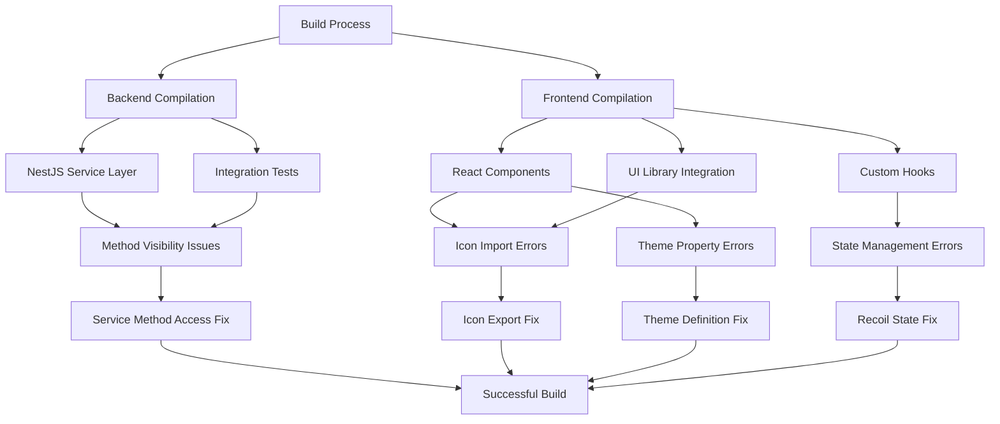

# TypeScript Error Fixes Design Document

## Overview

The Twenty CRM project is experiencing multiple TypeScript compilation errors across both backend (twenty-server) and frontend (twenty-front) packages. These errors are preventing successful builds and application startup. The errors fall into several categories: method visibility issues, missing exports, type definition problems, and incorrect API usage.

## Technology Stack & Dependencies

- **Backend**: NestJS 9, TypeScript 5.3.3, Node.js 24.5+
- **Frontend**: React 18, TypeScript 5.3.3, Recoil state management
- **Build Tool**: Nx monorepo with SWC compiler
- **UI Library**: twenty-ui package with custom icon components

## Error Categories Analysis

### Backend Service Errors
- **Method Visibility**: Private method `handleUserMessage` accessed in integration tests
- **Location**: `business-setup-welcome-agent.service.ts`
- **Impact**: Integration test compilation failures

### Frontend Component Errors
- **Missing Icon Exports**: `IconBrain` not exported from twenty-ui/display
- **Theme Property Errors**: Missing `success` and `warning` color properties
- **Unknown Type Issues**: `messages` type resolution problems
- **Recoil State Errors**: Component state function call signature issues

### Test File Errors
- **Missing Exports**: `SGRStreamingEvent` not exported from service
- **Property Access**: Accessing non-existent properties in hook tests

## Architecture



## Component Definition

### Backend Service Component
```typescript
interface BusinessSetupWelcomeAgentService {
  // Current: private handleUserMessage()
  // Required: public handleUserMessage() for test access
  handleUserMessage(message: string): Promise<any>;
}
```

### Frontend Component Interfaces
```typescript
interface AIChatMessage {
  messages: AgentChatMessage[]; // Currently unknown type
  currentThreadId: string | null;
}

interface ThemeColors {
  font: {
    color: {
      // Missing properties:
      success: string;
      warning: string;
    }
  };
  background: {
    transparent: {
      // Missing property:
      success: string;
    }
  };
}
```

### Component State Management
```typescript
interface ComponentStateFunction<T> {
  (componentId: string): RecoilState<T>;
}

// Current issue: Functions return ComponentState<T> instead of RecoilState<T>
```

## Business Logic Layer

### Error Resolution Strategy
1. **Service Method Visibility**: Change private methods to public for test compatibility
2. **Icon Export Management**: Add missing icon exports to twenty-ui package
3. **Theme Property Extension**: Add missing color properties to theme definitions
4. **Type Definition Correction**: Fix return types and function signatures
5. **State Management Alignment**: Correct Recoil component state usage

### Error Prioritization Matrix
| Error Type | Impact | Complexity | Priority |
|------------|---------|------------|----------|
| Method Visibility | High | Low | 1 |
| Missing Icons | Medium | Low | 2 |
| Theme Properties | Medium | Medium | 3 |
| Type Definitions | High | Medium | 4 |
| State Management | High | High | 5 |

## API Endpoints Reference

### Service Method Fixes
- **Endpoint**: `BusinessSetupWelcomeAgentService.handleUserMessage`
- **Current Access**: private
- **Required Access**: public (for integration tests)
- **Authentication**: Internal service method

### Component State Access
- **Pattern**: `useRecoilComponentState(stateFunction(componentId))`
- **Current Issue**: State functions not callable
- **Required Fix**: Proper state function implementation

## Data Models & Type Mapping

### Theme Color Extension
```typescript
interface FontColors {
  primary: string;
  secondary: string;
  tertiary: string;
  light: string;
  extraLight: string;
  inverted: string;
  danger: string;
  // Add missing:
  success: string;
  warning: string;
}
```

### Component State Types
```typescript
interface SGRToolExecution {
  status: SGRToolExecutionStatus;
  error?: string;
  // Add missing:
  result?: any;
}
```

### Message Type Definitions
```typescript
interface AgentChatMessage {
  id: string;
  content: string;
  type: 'user' | 'assistant';
  timestamp: Date;
}
```

## Middleware & Error Handling

### TypeScript Compilation Flow
1. **SWC Compilation**: Successfully compiles 3014 files
2. **Type Checking**: Fails on method access and missing exports
3. **Build Failure**: Prevents application startup

### Error Recovery Strategy
- **Incremental Fixes**: Address errors by category
- **Build Verification**: Test compilation after each fix group
- **Rollback Plan**: Maintain method signatures for backward compatibility

## Testing Strategy

### Integration Test Compatibility
- **Current Issue**: Tests access private service methods
- **Solution**: Expose required methods or create test-specific interfaces
- **Validation**: Ensure tests pass after visibility changes

### Unit Test Updates
- **Hook Tests**: Update expectations for modified return types
- **Component Tests**: Verify icon and theme property usage
- **Service Tests**: Confirm public method accessibility

## Implementation Plan

### Phase 1: Backend Service Fixes
- Modify `BusinessSetupWelcomeAgentService` method visibility
- Export missing `SGRStreamingEvent` interface
- Update service method signatures for test compatibility

### Phase 2: Frontend Icon & Theme Fixes  
- Add `IconBrain` export to twenty-ui/display package
- Extend theme definitions with missing color properties
- Fix `IconDotsVertical` import/usage issues

### Phase 3: State Management Corrections
- Correct Recoil component state function signatures
- Fix type definitions for hook return values
- Update component prop interfaces

### Phase 4: Type Definition Alignment
- Add missing properties to interface definitions
- Correct function parameter types
- Resolve implicit 'any' type issues

### Phase 5: Build Verification
- Test compilation after each phase
- Verify application startup
- Validate test suite execution