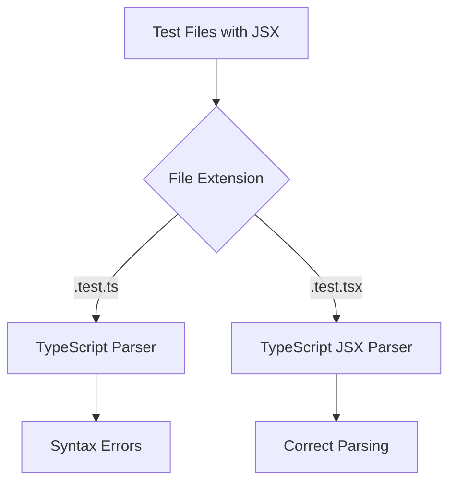
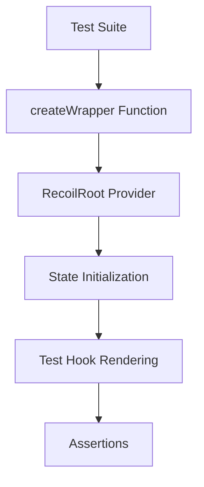
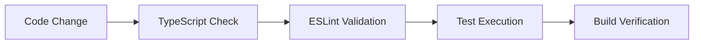

# TypeScript Syntax Fix Design

## Overview

This document outlines the design for fixing TypeScript compilation errors in the Twenty codebase, specifically targeting JSX syntax issues in test files that are causing the TypeScript compiler to misinterpret React component syntax.

## Problem Analysis

### Error Categories

The TypeScript errors fall into several categories:

1. **Unterminated Regular Expression Literal**: TypeScript compiler misinterpreting `</` in JSX closing tags as regex
2. **JSX Parsing Issues**: Incorrect interpretation of JSX props and component structure
3. **Property Assignment Expected**: Misunderstanding of JSX prop syntax

### Affected Files

```
packages/twenty-front/src/modules/ai/hooks/__tests__/useCreateNewAIChatThread.test.ts
packages/twenty-front/src/modules/business-setup/hooks/__tests__/useBusinessSetupAgentChat.test.ts
```

### Root Cause

The files have `.test.ts` extension but contain JSX syntax, causing TypeScript to parse them as regular TypeScript files rather than React/JSX files.

## Architecture

### File Extension Strategy



### Component Testing Structure


## Solution Design

### 1. File Extension Correction

**Current State:**
- Files use `.test.ts` extension
- Contain JSX syntax (RecoilRoot components)
- TypeScript parser doesn't recognize JSX

**Target State:**
- Files use `.test.tsx` extension
- JSX syntax properly recognized
- TypeScript JSX parser engaged

### 2. Import Statement Updates

**Required Imports for JSX:**
```typescript
import React, { type ReactNode } from 'react';
import { RecoilRoot } from 'recoil';
```

### 3. Type Definitions

**Wrapper Component Types:**
```typescript
type WrapperProps = {
  children: ReactNode;
};

type CreateWrapperFunction = (workspaceState?: any) => React.ComponentType<WrapperProps>;
```

## Implementation Strategy

### Phase 1: File Extension Updates

1. **Rename Test Files**
   - `useCreateNewAIChatThread.test.ts` → `useCreateNewAIChatThread.test.tsx`
   - `useBusinessSetupAgentChat.test.ts` → `useBusinessSetupAgentChat.test.tsx`

2. **Update Build Configuration**
   - Ensure Jest configuration recognizes `.tsx` test files
   - Update TypeScript configuration for JSX support

### Phase 2: Import Optimization

**Standard Test File Import Pattern:**
```typescript
// React and JSX
import React, { type ReactNode } from 'react';
import { RecoilRoot, type MutableSnapshot } from 'recoil';

// Testing utilities
import { renderHook, act } from '@testing-library/react';

// Project modules
import { useCreateNewAIChatThread } from '../useCreateNewAIChatThread';
import { currentWorkspaceState } from '@/workspace/states/currentWorkspaceState';
```

### Phase 3: Component Structure Standardization

**Wrapper Component Pattern:**
```typescript
const createWrapper = (workspaceState: any = null) => {
  return ({ children }: { children: ReactNode }) => (
    <RecoilRoot
      initializeState={(snapshot: MutableSnapshot) => {
        if (workspaceState) {
          snapshot.set(currentWorkspaceState, workspaceState);
        }
      }}
    >
      {children}
    </RecoilRoot>
  );
};
```

## Testing Architecture

### Test Wrapper Hierarchy



### Mock Management

**Hook Mocking Pattern:**
```typescript
// Mock external dependencies
jest.mock('@/business-setup/hooks/useBusinessSetupStatus');
jest.mock('@/command-menu/hooks/useOpenAskAIPageInCommandMenu');
jest.mock('~/generated-metadata/graphql');

// Type-safe mock access
const mockUseBusinessSetupStatus = useBusinessSetupStatus as jest.MockedFunction<typeof useBusinessSetupStatus>;
```

## Configuration Updates

### TypeScript Configuration

**tsconfig.json Updates:**
```json
{
  "compilerOptions": {
    "jsx": "react-jsx",
    "allowSyntheticDefaultImports": true,
    "esModuleInterop": true
  },
  "include": [
    "src/**/*.ts",
    "src/**/*.tsx"
  ]
}
```

### Jest Configuration

**Test Pattern Updates:**
```javascript
module.exports = {
  testMatch: [
    '**/__tests__/**/*.(ts|tsx|js|jsx)',
    '**/*.(test|spec).(ts|tsx|js|jsx)'
  ],
  transform: {
    '^.+\\.(ts|tsx)$': 'ts-jest'
  }
};
```

## Error Prevention

### ESLint Rules

**Custom Rules for Test Files:**
```json
{
  "rules": {
    "@typescript-eslint/explicit-function-return-type": "off",
    "react/jsx-no-undef": "error",
    "react/jsx-uses-react": "error",
    "react/jsx-uses-vars": "error"
  },
  "overrides": [
    {
      "files": ["**/*.test.tsx", "**/*.spec.tsx"],
      "rules": {
        "testing-library/prefer-screen-queries": "error"
      }
    }
  ]
}
```

### Pre-commit Hooks

**Validation Steps:**
1. TypeScript compilation check
2. ESLint validation
3. Test execution
4. File extension consistency check

## Validation Strategy

### Automated Checks



### Manual Verification

**Checklist:**
- [ ] All test files with JSX use `.tsx` extension
- [ ] TypeScript compilation succeeds
- [ ] Tests execute without syntax errors
- [ ] Mock functions work correctly
- [ ] RecoilRoot initialization functions properly

## Rollout Plan

### Step 1: File Extension Migration
- Rename affected test files
- Update import references
- Verify build configuration

### Step 2: Syntax Validation
- Run TypeScript compiler
- Execute test suites
- Fix any remaining syntax issues

### Step 3: Quality Assurance
- Run full test suite
- Verify CI/CD pipeline
- Update documentation

## Risk Mitigation

### Backup Strategy
- Maintain original file versions
- Incremental rollout per module
- Automated rollback capability

### Monitoring
- TypeScript compilation metrics
- Test execution success rates
- Build time impact assessment

## Success Metrics

- **Zero TypeScript compilation errors**
- **All tests passing**
- **No performance regression**
- **Consistent file naming convention**


