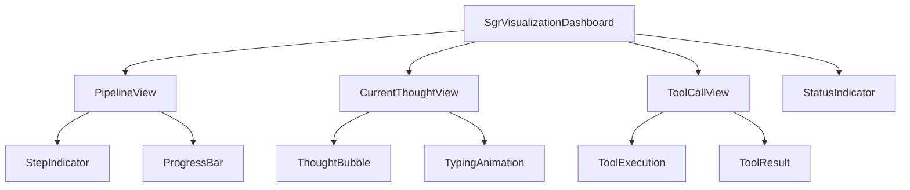
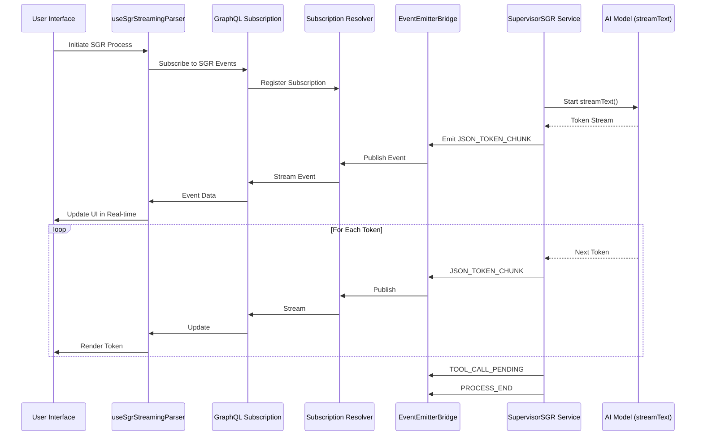

# SGR Streaming Implementation Design

## Overview

This design document outlines the comprehensive implementation of enhanced SGR (Schema-Guided Reasoning) streaming for the Twenty CRM platform. The current implementation uses `generateObject()` which returns final results, but the enhanced version will implement real-time token streaming using `streamText()` to provide transparent visibility into AI thinking processes.

## Technology Stack & Dependencies

### Backend Technologies
- **NestJS** 9.0.0 - Backend framework with event-driven architecture
- **TypeScript** 5.3.3 - Type-safe development with strict checking
- **GraphQL** with Apollo Server - API communication layer
- **Redis** with RedisPubSub - Event streaming and message brokering
- **AI SDK** - streamText() for token-level streaming, generateObject() for structured output

### Frontend Technologies  
- **React** 18.2.0 with hooks-based architecture
- **Recoil** - State management for streaming data
- **GraphQL Subscriptions** - Real-time event consumption
- **Framer Motion** - UI animations for streaming visualization

### Infrastructure
- **Nx** monorepo management with enforced project boundaries
- **BullMQ** + Redis for background job processing
- **Docker** containerization for deployment

## Architecture

### System Architecture Overview

```mermaid
graph TB
    subgraph "Frontend Layer"
        UI[React UI Components]
        Hook[useSgrStreamingParser Hook]
        Sub[GraphQL Subscriptions]
    end
    
    subgraph "Backend Layer"
        Resolver[Subscriptions Resolver]
        Bridge[EventEmitterBridge Service]
        SGRService[SupervisorSGR Service]
        Dispatcher[Tool Dispatcher]
    end
    
    subgraph "AI Layer"
        Stream[streamText() API]
        Parse[JSON Parser]
        Tools[SGR Tools]
    end
    
    subgraph "Infrastructure"
        Redis[(Redis PubSub)]
        Events[Event System]
    end
    
    UI --> Hook
    Hook --> Sub
    Sub --> Resolver
    Resolver --> Redis
    Bridge --> Redis
    SGRService --> Bridge
    SGRService --> Stream
    Stream --> Parse
    Parse --> Tools
    Tools --> Dispatcher
    Dispatcher --> Events
    Events --> Bridge
```

### Component Hierarchy



### Data Flow Architecture



## API Endpoints Reference

### GraphQL Subscriptions

#### SGR Streaming Events Subscription
```graphql
subscription SGRStreamingEvents($input: BusinessSetupEventInput!) {
  onBusinessSetupEvent(input: $input) {
    id
    type
    payload
    metadata {
      timestamp
      source
      sgrStreaming
    }
  }
}
```

**Input Schema:**
```typescript
interface BusinessSetupEventInput {
  workspaceId: string
  userId?: string
  eventTypes?: BusinessSetupEventType[]
  threadId?: string
}
```

**Event Types (Extends existing BusinessSetupEventType):**
- `SGR_STREAMING_START` - Process initialization  
- `SGR_JSON_STREAM_START` - JSON generation begins
- `SGR_JSON_TOKEN_CHUNK` - Individual token emission
- `SGR_JSON_STREAM_END` - JSON generation complete
- `SGR_TOOL_CALL_PENDING` - Tool execution starting
- `SGR_STREAMING_END` - Process completion
- `SGR_STREAMING_ERROR` - Error handling

#### Authentication Requirements
- **WorkspaceAuthGuard** - Validates workspace access
- **UserAuthGuard** - Validates user authentication
- **Workspace Filtering** - Events filtered by workspace ID for security

## Data Models & Type Definitions

### Extended BusinessSetupEventType (No Duplicate Enum)

```typescript
// Extends existing BusinessSetupEventType in business-setup-subscription.types.ts
export enum BusinessSetupEventType {
  // ... existing types ...
  ONBOARDING_STATUS_CHANGED = 'ONBOARDING_STATUS_CHANGED',
  AI_AGENT_WELCOME_CHAT_CREATED = 'AI_AGENT_WELCOME_CHAT_CREATED',
  AI_AGENT_WELCOME_CHAT_FAILED = 'AI_AGENT_WELCOME_CHAT_FAILED',
  BUSINESS_SETUP_STEP_COMPLETED = 'BUSINESS_SETUP_STEP_COMPLETED',
  
  // NEW: SGR Streaming Events
  SGR_STREAMING_START = 'SGR_STREAMING_START',
  SGR_JSON_STREAM_START = 'SGR_JSON_STREAM_START',
  SGR_JSON_TOKEN_CHUNK = 'SGR_JSON_TOKEN_CHUNK', 
  SGR_JSON_STREAM_END = 'SGR_JSON_STREAM_END',
  SGR_TOOL_CALL_PENDING = 'SGR_TOOL_CALL_PENDING',
  SGR_STREAMING_END = 'SGR_STREAMING_END',
  SGR_STREAMING_ERROR = 'SGR_STREAMING_ERROR',
}

export interface SGRStreamingPayload {
  threadId: string
  stepId: string
  token?: string
  fullJson?: string
  toolName?: string
  toolArgs?: Record<string, any>
  error?: string
  timestamp: Date
  metadata?: SGRStreamingMetadata
}

export interface SGRStreamingMetadata {
  stepNumber?: number
  totalSteps?: number
  processingTime?: number
  tokensEmitted?: number
  batchSize?: number
}

// Type mapping to reuse existing event infrastructure
export type SGRStreamEvent = {
  type: BusinessSetupEventType
  payload: SGRStreamingPayload
}

// Event creation helpers
export const createSGRStreamEvent = (
  type: BusinessSetupEventType,
  payload: SGRStreamingPayload
): SGRStreamEvent => ({ type, payload })
  totalSteps?: number
  processingTime?: number
  tokensEmitted?: number
  batchSize?: number
}
```

### Supervisor SGR Types

```typescript
export interface SupervisorStreamingContext {
  userId: string
  workspaceId: string
  threadId: string
  userMessage: string
  maxSteps: number
  stepNumber: number
  conversationLog: CoreMessage[]
}

export interface SupervisorThinkingStep {
  stepNumber: number
  currentState: string
  plannedSteps: string[]
  selectedTool: string
  timestamp: Date
  toolExecution?: {
    status: 'in_progress' | 'completed' | 'failed'
    result?: any
    error?: string
  }
  metadata?: {
    processingTime: number
    aiModelUsed: string
  }
}
```

## Business Logic Layer

### SupervisorSGRService Architecture

### Enhanced SupervisorSGRService - streamText Integration

```typescript
export class SupervisorSGRService implements ISupervisorSGRService {
  // ... existing methods ...

  /**
   * ENHANCED: Process message with detailed streaming using streamText()
   * Replaces generateObject() with real-time token streaming
   */
  async *processMessageWithDetailedStreaming(
    userMessage: string,
    userId: string, 
    workspaceId: string,
    threadId: string,
  ): AsyncGenerator<SGRStreamEvent> {
    const stepId = this.generateUniqueStepId()
    
    // Emit process start
    yield createSGRStreamEvent(
      BusinessSetupEventType.SGR_STREAMING_START,
      { threadId, stepId, timestamp: new Date() }
    )
    
    try {
      const context = this.createStreamingContext(userId, workspaceId, threadId, userMessage)
      yield* this.executeDetailedSGRWorkflow(context, stepId)
      
      yield createSGRStreamEvent(
        BusinessSetupEventType.SGR_STREAMING_END,
        { threadId, stepId, timestamp: new Date() }
      )
    } catch (error) {
      yield createSGRStreamEvent(
        BusinessSetupEventType.SGR_STREAMING_ERROR,
        { threadId, stepId, error: error.message, timestamp: new Date() }
      )
    }
  }
```

  /**
   * ENHANCED: Token-level streaming with streamText() instead of generateObject()
   */
  private async *streamJSONFromLLM(
    context: SupervisorStreamingContext,
    stepNumber: number,
  ): AsyncGenerator<SGRStreamEvent> {
    const aiModel = this.aiModelRegistryService.getModel(this.GEMINI_MODEL_ID)?.model
    
    // Use streamText() for real-time token streaming
    const stream = streamText({
      model: aiModel,
      messages: [...context.conversationLog],
      temperature: 0.1,
      maxTokens: 1500,
    })

    let fullJson = ''
    
    // Stream each token in real-time
    for await (const chunk of stream.textStream) {
      if (chunk.type === 'text-delta') {
        const token = chunk.textDelta
        fullJson += token
        
        yield createSGRStreamEvent(
          BusinessSetupEventType.SGR_JSON_TOKEN_CHUNK,
          { 
            threadId: context.threadId,
            stepId: `step-${stepNumber}`,
            token,
            timestamp: new Date()
          }
        )
      }
    }
    
    yield createSGRStreamEvent(
      BusinessSetupEventType.SGR_JSON_STREAM_END,
      { 
        threadId: context.threadId,
        stepId: `step-${stepNumber}`,
        fullJson,
        timestamp: new Date()
      }
    )
  }
}
```

### Enhanced EventEmitterBridge Integration

```typescript
// Extend existing EventEmitterBridge service instead of creating new handlers
@Injectable()
export class EventEmitterBridgeService {
  // ... existing methods ...

  /**
   * NEW: SGR streaming event handler - integrates with existing infrastructure
   */
  @OnEvent('sgr.streaming.event')
  async handleSGRStreamingEvent(payload: SGRStreamEvent): Promise<void> {
    const startTime = Date.now()
    
    try {
      // Reuse existing sanitization and formatting
      const sanitizedPayload = this.sanitizeSGRPayload(payload)
      const subscriptionPayload = this.formatEventForSubscription({
        type: sanitizedPayload.type,
        payload: sanitizedPayload.payload,
        source: 'SGRStreamingBridge'
      })
      
      // Reuse existing retry mechanism
      await this.publishToSubscriptionWithRetry(
        SUBSCRIPTION_CHANNELS.BUSINESS_SETUP_EVENTS,
        subscriptionPayload
      )
      
      this.updateSGRMetrics(startTime, payload.type)
    } catch (error) {
      this.logger.error('Failed to publish SGR streaming event:', error)
    }
  }
```

  /**
   * REUSE: Existing sanitization with SGR-specific enhancements
   */
  private sanitizeSGRPayload(payload: SGRStreamEvent): SGRStreamEvent {
    if (payload.type === BusinessSetupEventType.SGR_TOOL_CALL_PENDING && payload.payload.toolArgs) {
      return {
        ...payload,
        payload: {
          ...payload.payload,
          toolArgs: this.removeSensitiveData(payload.payload.toolArgs),
        },
      }
    }
    return payload
  }

  // REUSE: Existing removeSensitiveData method already handles this case
}
```
```

## Frontend Implementation

### useSgrStreamingParser Hook

### useSgrStreamingParser Hook - No Duplication

```typescript
export const useSgrStreamingParser = (threadId: string) => {
  const [status, setStatus] = useState<SGRStreamingStatus>('idle')
  const [rawJson, setRawJson] = useState('')
  const [parsedState, setParsedState] = useState<Record<string, any>>({})
  const [lastError, setLastError] = useState<string | null>(null)
  const [connectionRetries, setConnectionRetries] = useState(0)
  
  // REUSE: Existing subscription infrastructure
  const { data, loading, error } = useSubscription(SGR_STREAMING_SUBSCRIPTION, {
    variables: { 
      input: { 
        threadId,
        eventTypes: [
          BusinessSetupEventType.SGR_STREAMING_START,
          BusinessSetupEventType.SGR_JSON_TOKEN_CHUNK,
          BusinessSetupEventType.SGR_JSON_STREAM_END,
          BusinessSetupEventType.SGR_TOOL_CALL_PENDING,
          BusinessSetupEventType.SGR_STREAMING_END,
          BusinessSetupEventType.SGR_STREAMING_ERROR
        ]
      }
    },
    onSubscriptionData: ({ subscriptionData }) => {
      const event = subscriptionData.data?.onBusinessSetupEvent
      if (!event) return
      
      switch (event.type) {
        case BusinessSetupEventType.SGR_STREAMING_START:
          setStatus('streaming_json')
          setRawJson('')
          break
          
        case BusinessSetupEventType.SGR_JSON_TOKEN_CHUNK:
          setRawJson(prev => prev + event.payload.token)
          break
          
        case BusinessSetupEventType.SGR_JSON_STREAM_END:
          setRawJson(event.payload.fullJson)
          setParsedState(parsePartialJson(event.payload.fullJson))
          break
          
        case BusinessSetupEventType.SGR_TOOL_CALL_PENDING:
          setStatus('pending_tool')
          break
          
        case BusinessSetupEventType.SGR_STREAMING_END:
          setStatus('completed')
          break
          
        case BusinessSetupEventType.SGR_STREAMING_ERROR:
          setStatus('error')
          setLastError(event.payload.error)
          break
      }
    },
    // REUSE: Existing error recovery pattern
    onError: (error) => {
      if (connectionRetries < MAX_RETRIES) {
        setTimeout(() => {
          setConnectionRetries(prev => prev + 1)
        }, 1000 * Math.pow(2, connectionRetries))
      }
    },
  })
  
  const parsedState = useMemo(() => 
    parsePartialJson(rawJson), [rawJson]
  )
  
  return { 
    status, 
    parsedState, 
    lastError, 
    isConnected: !loading && !error,
    retryCount: connectionRetries
  }
}
```

### JSON Parsing Utilities

```typescript
const parsePartialJson = (jsonString: string): Record<string, any> => {
  if (!jsonString.trim()) return {}
  
  try {
    return JSON.parse(jsonString)
  } catch {
    // Attempt partial parsing
    return parsePartialJsonWithRegex(jsonString)
  }
}

const parsePartialJsonWithRegex = (jsonString: string): Record<string, any> => {
  const result: Record<string, any> = {}
  
  // Extract key-value pairs using regex
  const keyValuePattern = /"([^"]+)":\s*"([^"]*)"/g
  let match
  
  while ((match = keyValuePattern.exec(jsonString)) !== null) {
    result[match[1]] = match[2]
  }
  
  return result
}
```

### UI Components

#### SgrVisualizationDashboard
```typescript
export const SgrVisualizationDashboard = ({ threadId }: { threadId: string }) => {
  const { status, parsedState, lastError } = useSgrStreamingParser(threadId)
  
  if (status === 'idle' || status === 'completed') return null
  
  return (
    <motion.div 
      className="sgr-dashboard"
      initial={{ opacity: 0, y: 20 }}
      animate={{ opacity: 1, y: 0 }}
      exit={{ opacity: 0, y: -20 }}
    >
      <PipelineView 
        currentTool={parsedState.function?.tool}
        plannedSteps={parsedState.plan_remaining_steps}
      />
      <CurrentThoughtView 
        reasoningText={parsedState.current_state}
        status={status}
      />
      {status === 'pending_tool' && (
        <ToolCallView 
          toolName={parsedState.function?.tool}
          toolArgs={parsedState.function}
        />
      )}
      {lastError && (
        <ErrorDisplay error={lastError} />
      )}
    </motion.div>
  )
}
```

#### CurrentThoughtView with Typing Animation
```typescript
export const CurrentThoughtView = ({ 
  reasoningText, 
  status 
}: { 
  reasoningText: string
  status: SGRStreamingStatus 
}) => {
  return (
    <div className="thought-bubble">
      <div className="thought-header">
        <Brain className="brain-icon" />
        <span>AI Thinking...</span>
        {status === 'streaming_json' && <TypingIndicator />}
      </div>
      <motion.div 
        className="thought-content"
        initial={{ opacity: 0 }}
        animate={{ opacity: 1 }}
      >
        <TypewriterText text={reasoningText || 'Analyzing your request...'} />
      </motion.div>
    </div>
  )
}
```

## State Management

### Recoil State Architecture

```typescript
// SGR Streaming State
export const sgrStreamingState = atom<SGRStreamingState>({
  key: 'sgrStreamingState',
  default: {
    activeThreads: {},
    globalStatus: 'idle',
    errorHistory: [],
    metrics: {
      totalEvents: 0,
      averageProcessingTime: 0,
      errorRate: 0,
    }
  }
})

// Thread-specific state
export const threadStreamingState = atomFamily<ThreadStreamingState, string>({
  key: 'threadStreamingState',
  default: {
    status: 'idle',
    rawJson: '',
    parsedState: {},
    lastError: null,
    stepHistory: [],
    connectionQuality: 'good'
  }
})

// Derived state for active threads
export const activeThreadsSelector = selector({
  key: 'activeThreadsSelector',
  get: ({ get }) => {
    const state = get(sgrStreamingState)
    return Object.entries(state.activeThreads)
      .filter(([_, thread]) => thread.status !== 'idle')
      .map(([threadId, thread]) => ({ threadId, ...thread }))
  }
})
```

## Performance & Security

### Token Throttling Implementation

```typescript
private tokenBuffer: Map<string, string[]> = new Map()
private readonly TOKEN_THROTTLE_MS = 100
private readonly MAX_TOKENS_PER_BATCH = 10

private async throttledTokenEmission(payload: {
  token: string
  threadId: string
  stepId: string
}): Promise<void> {
  const key = `token-buffer-${payload.threadId}-${payload.stepId}`
  
  if (!this.tokenBuffer.has(key)) {
    this.tokenBuffer.set(key, [])
  }
  
  this.tokenBuffer.get(key)!.push(payload.token)
  
  if (this.tokenBuffer.get(key)!.length >= this.MAX_TOKENS_PER_BATCH) {
    await this.emitTokenBatch(key, payload.threadId, payload.stepId)
  } else {
    setTimeout(() => {
      this.emitTokenBatch(key, payload.threadId, payload.stepId)
    }, this.TOKEN_THROTTLE_MS)
  }
}
```

### Connection Recovery Strategy

```typescript
export const useConnectionRecovery = (threadId: string) => {
  const [retryCount, setRetryCount] = useState(0)
  const [connectionState, setConnectionState] = useState<'connected' | 'disconnected' | 'reconnecting'>('connected')
  
  const handleConnectionError = useCallback((error: Error) => {
    setConnectionState('disconnected')
    
    if (retryCount < MAX_RETRY_ATTEMPTS) {
      setConnectionState('reconnecting')
      
      const backoffDelay = Math.pow(2, retryCount) * BASE_RETRY_DELAY
      const jitter = Math.random() * 0.1 * backoffDelay
      
      setTimeout(() => {
        setRetryCount(prev => prev + 1)
        setConnectionState('connected')
      }, backoffDelay + jitter)
    }
  }, [retryCount])
  
  return { connectionState, handleConnectionError }
}
```

### Security Measures

#### Input Validation
```typescript
const validateSGRInput = (input: BusinessSetupEventInput): boolean => {
  // Validate workspace ID format
  if (!input.workspaceId || !isValidUUID(input.workspaceId)) {
    return false
  }
  
  // Validate user ID if provided
  if (input.userId && !isValidUUID(input.userId)) {
    return false
  }
  
  // Validate event types
  if (input.eventTypes) {
    const validTypes = Object.values(BusinessSetupEventType)
    return input.eventTypes.every(type => validTypes.includes(type))
  }
  
  return true
}
```

#### Rate Limiting
```typescript
@Injectable()
export class SGRRateLimitingService {
  private requestCounts = new Map<string, number>()
  private readonly RATE_LIMIT_WINDOW_MS = 60000 // 1 minute
  private readonly MAX_REQUESTS_PER_WINDOW = 100
  
  canProceed(userId: string): boolean {
    const key = `${userId}-${Math.floor(Date.now() / this.RATE_LIMIT_WINDOW_MS)}`
    const currentCount = this.requestCounts.get(key) || 0
    
    if (currentCount >= this.MAX_REQUESTS_PER_WINDOW) {
      return false
    }
    
    this.requestCounts.set(key, currentCount + 1)
    return true
  }
}
```

## Testing Strategy

### Reuse Existing Testing Infrastructure

```typescript
// ENHANCE existing tests instead of creating duplicates
describe('SupervisorSGRService Enhanced Streaming', () => {
  // Reuse existing test setup from supervisor-sgr.service.spec.ts
  
  it('should stream JSON tokens using existing event infrastructure', async () => {
    const events: SGRStreamEvent[] = []
    
    for await (const event of service.processMessageWithDetailedStreaming(
      'test message',
      'user-1', 
      'workspace-1',
      'thread-1'
    )) {
      events.push(event)
    }
    
    // Verify events use existing BusinessSetupEventType
    expect(events[0].type).toBe(BusinessSetupEventType.SGR_STREAMING_START)
    expect(events.some(e => e.type === BusinessSetupEventType.SGR_JSON_TOKEN_CHUNK)).toBe(true)
    expect(events[events.length - 1].type).toBe(BusinessSetupEventType.SGR_STREAMING_END)
  })
  
  it('should integrate with existing EventEmitterBridge', async () => {
    // Test that events are properly routed through existing infrastructure
    const mockEventEmitter = jest.mocked(eventEmitter)
    
    await service.processMessageWithDetailedStreaming('test', 'user-1', 'workspace-1', 'thread-1')
    
    expect(mockEventEmitter.emit).toHaveBeenCalledWith(
      'sgr.streaming.event',
      expect.objectContaining({
        type: BusinessSetupEventType.SGR_STREAMING_START
      })
    )
  })
})
```

### Integration Testing

```typescript
describe('SGR Streaming Integration', () => {
  it('should handle complete workflow end-to-end', async () => {
    // Setup test environment
    const testThreadId = 'test-thread-1'
    const events: any[] = []
    
    // Subscribe to events
    const subscription = subscribeToSGREvents(testThreadId, (event) => {
      events.push(event)
    })
    
    // Trigger SGR process
    await triggerSGRProcess(testThreadId, 'Test message')
    
    // Wait for completion
    await waitForEventType(events, 'SGR_PROCESS_END', 30000)
    
    // Verify event sequence
    expect(events[0].type).toBe('SGR_PROCESS_START')
    expect(events.some(e => e.type === 'SGR_JSON_TOKEN_CHUNK')).toBe(true)
    expect(events[events.length - 1].type).toBe('SGR_PROCESS_END')
    
    subscription.unsubscribe()
  })
})
```

### Load Testing

```typescript
describe('SGR Streaming Performance', () => {
  it('should handle multiple concurrent streams', async () => {
    const concurrentStreams = 50
    const promises = []
    
    for (let i = 0; i < concurrentStreams; i++) {
      promises.push(
        service.processMessageWithDetailedStreaming(
          `Test message ${i}`,
          `user-${i}`,
          'workspace-1',
          `thread-${i}`
        )
      )
    }
    
    const startTime = Date.now()
    await Promise.all(promises)
    const endTime = Date.now()
    
    expect(endTime - startTime).toBeLessThan(60000) // Should complete within 1 minute
  })
})
```

## Monitoring & Metrics

### Performance Metrics Collection

```typescript
export class SGRStreamingMetricsService {
  private metrics = {
    totalEventsProcessed: 0,
    totalTokensEmitted: 0,
    averageProcessingTime: 0,
    errorRate: 0,
    connectionDrops: 0,
    peakConcurrentStreams: 0
  }
  
  trackEvent(eventType: SGRStreamEventType, processingTime: number): void {
    this.metrics.totalEventsProcessed++
    this.metrics.averageProcessingTime = 
      (this.metrics.averageProcessingTime + processingTime) / 2
    
    if (eventType === SGRStreamEventType.JSON_TOKEN_CHUNK) {
      this.metrics.totalTokensEmitted++
    }
    
    // Send to monitoring system
    this.sendToMonitoring(this.metrics)
  }
  
  private sendToMonitoring(metrics: any): void {
    // Integration with monitoring service (Prometheus, DataDog, etc.)
  }
}
```

### Health Checks

```typescript
@Injectable()
export class SGRStreamingHealthService {
  async performHealthCheck(): Promise<HealthCheckResult> {
    const checks = await Promise.allSettled([
      this.checkRedisConnection(),
      this.checkAIModelAvailability(),
      this.checkEventEmitterStatus(),
      this.checkSubscriptionChannels()
    ])
    
    const failures = checks
      .map((check, index) => ({ check, index }))
      .filter(({ check }) => check.status === 'rejected')
    
    return {
      isHealthy: failures.length === 0,
      checks: checks.map(check => ({
        status: check.status,
        details: check.status === 'fulfilled' ? check.value : check.reason
      })),
      timestamp: new Date()
    }
  }
}
```

## Configuration Management

### Configuration Consolidation

```typescript
// EXTEND existing configuration instead of creating new enums
export enum BusinessSetupStepKeys {
  // ... existing keys ...
  
  // NEW: SGR Streaming Configuration
  SGR_DETAILED_STREAMING_ENABLED = 'SGR_DETAILED_STREAMING_ENABLED',
  SGR_TOKEN_THROTTLING_ENABLED = 'SGR_TOKEN_THROTTLING_ENABLED', 
  SGR_STREAMING_CONFIG = 'SGR_STREAMING_CONFIG',
}

// EXTEND existing BusinessSetupKeyValueTypeMap
export interface BusinessSetupKeyValueTypeMap {
  // ... existing types ...
  
  // NEW: SGR Streaming Types
  SGR_DETAILED_STREAMING_ENABLED: boolean
  SGR_TOKEN_THROTTLING_ENABLED: boolean
  SGR_STREAMING_CONFIG: {
    tokenThrottleMs: number
    maxTokensPerBatch: number
    enablePartialJsonParsing: boolean
    retryAttempts: number
  }
}

// CONSOLIDATE configuration into existing SUPERVISOR_CONFIG
export const SUPERVISOR_CONFIG = {
  // ... existing config ...
  
  // NEW: Streaming configuration
  STREAMING: {
    TOKEN_THROTTLE_MS: 100,
    MAX_TOKENS_PER_BATCH: 10,
    ENABLE_DETAILED_STREAMING: false, // Feature flag
    ENABLE_SANITIZATION: true,
    ENABLE_METRICS: true
  }
} as const
```

### Environment Configuration

```typescript
export interface SGRStreamingEnvironmentConfig {
  production: {
    tokenThrottleMs: 100
    maxTokensPerBatch: 10
    enableMetrics: true
    logLevel: 'warn'
  }
  development: {
    tokenThrottleMs: 50
    maxTokensPerBatch: 5
    enableMetrics: true
    logLevel: 'debug'
  }
  testing: {
    tokenThrottleMs: 0
    maxTokensPerBatch: 1
    enableMetrics: false
    logLevel: 'error'
  }
}
```

## Architecture Simplification

### Key Principles for Avoiding Duplication

1. **Reuse Existing Event Infrastructure**: Extend `BusinessSetupEventType` instead of creating separate `SGRStreamEventType`

2. **Leverage Current Services**: Enhance `EventEmitterBridgeService` instead of creating new event handlers

3. **Integrate with Existing Subscriptions**: Use current GraphQL subscription infrastructure with new event types

4. **Consolidate Configuration**: Extend existing configuration objects instead of creating new ones

5. **Enhance Current Tests**: Build upon existing test suites instead of duplicating test infrastructure

### Implementation Strategy

- **Phase 1**: Extend existing enums and types
- **Phase 2**: Enhance existing services with new methods 
- **Phase 3**: Add new event types to existing subscription resolvers
- **Phase 4**: Implement frontend integration using existing patterns
- **Phase 5**: Enhance existing tests with new scenarios

This approach ensures minimal code duplication while maintaining backward compatibility and leveraging the robust existing infrastructure.

### Phased Rollout Plan

#### Phase 1: Infrastructure Setup (Week 1)
- Deploy enhanced EventEmitterBridge service
- Set up Redis channels for SGR streaming
- Implement basic token throttling

#### Phase 2: Backend Implementation (Week 2)
- Deploy SupervisorSGRService enhancements
- Implement streamText() integration
- Add security and sanitization layers

#### Phase 3: Frontend Integration (Week 3)
- Deploy React components and hooks
- Implement real-time UI visualization
- Add error recovery mechanisms

#### Phase 4: Testing & Optimization (Week 4)
- Conduct load testing
- Performance optimization
- Security audit

#### Phase 5: Production Rollout (Week 5)
- Gradual rollout with feature flags
- Monitor performance metrics
- Gather user feedback

### Rollback Strategy

```typescript
export class SGRStreamingRollbackService {
  async rollbackToLegacyStreaming(): Promise<void> {
    // Disable detailed streaming feature flag
    await this.featureFlagService.disable(
      SGRStreamingFeatureFlags.DETAILED_STREAMING_ENABLED
    )
    
    // Clear streaming buffers
    await this.clearStreamingBuffers()
    
    // Revert to legacy generateObject() implementation
    await this.activateLegacyMode()
    
    // Notify monitoring systems
    await this.notifyRollback()
  }
}
```

### Monitoring & Alerting

```typescript
export const SGR_STREAMING_ALERTS = {
  HIGH_ERROR_RATE: {
    threshold: 0.05, // 5%
    window: '5m',
    action: 'notify_team'
  },
  CONNECTION_DROPS: {
    threshold: 10,
    window: '1m', 
    action: 'auto_rollback'
  },
  PROCESSING_LATENCY: {
    threshold: 5000, // 5 seconds
    window: '2m',
    action: 'scale_up'
  }
}
```

This comprehensive design provides a robust, secure, and scalable implementation of enhanced SGR streaming for the Twenty CRM platform, ensuring real-time visibility into AI thinking processes while maintaining system performance and reliability.