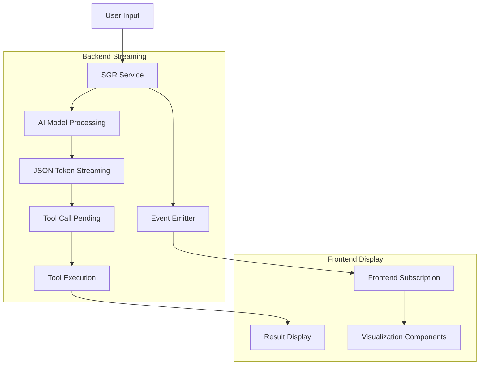
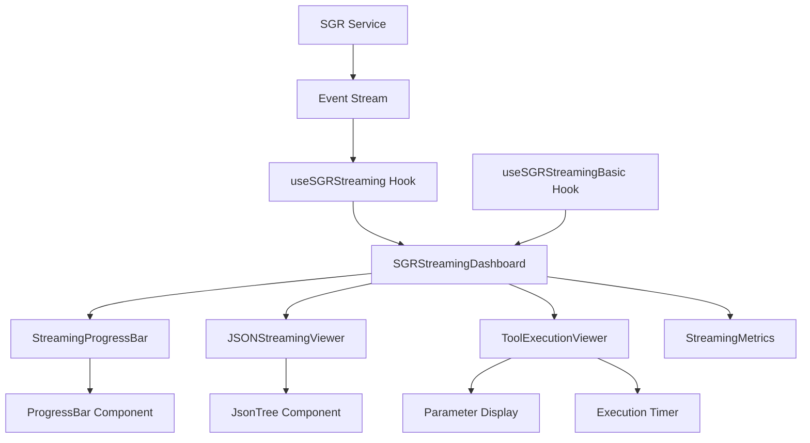
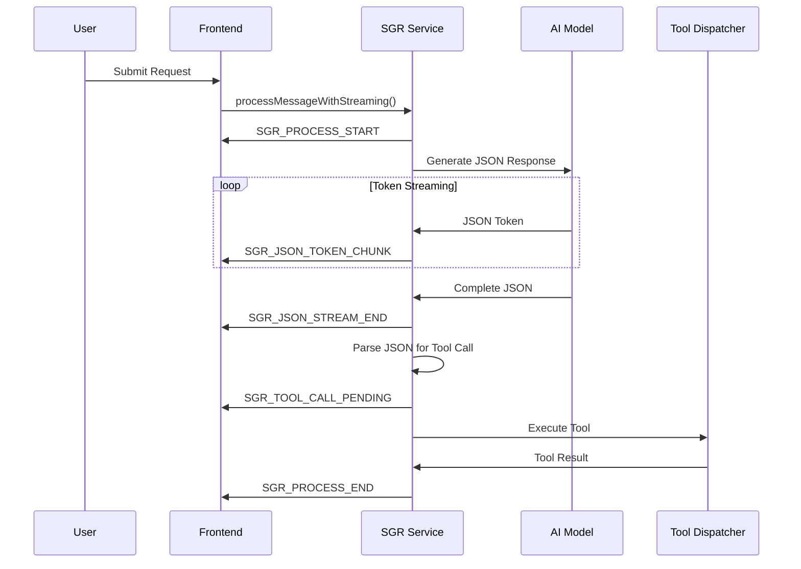
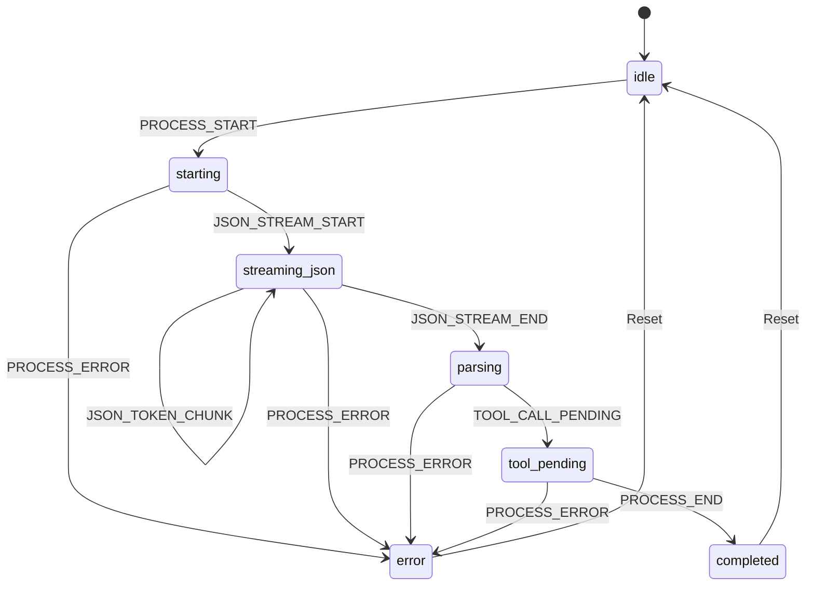

# SGR Streaming Visualization System Design

## 1. Overview

The SGR (Schema-Guided Reasoning) Streaming Visualization System provides real-time visual feedback for AI reasoning processes in the Twenty CRM platform. This system displays the AI's thinking process, tool execution progress, and results as they stream from the backend to the frontend, creating a transparent and engaging user experience during complex AI operations.

## 2. Technology Stack & Dependencies

### Frontend
- **React** v18.2.0 with TypeScript
- **Recoil** for state management
- **Emotion** for styled components
- **Framer Motion** for animations
- **React hooks** for state and effect management

### Backend
- **NestJS** v9.0.0 with TypeScript
- **EventEmitter2** for event-driven streaming
- **Redis** for message queuing (if needed)
- **WebSocket** or **Server-Sent Events** for real-time communication

### Integration
- **GraphQL subscriptions** or **WebSocket** for streaming data
- **Zod** schemas for type-safe data validation
- **Custom hooks** for React state management

## 3. Architecture

### 3.1 System Flow



### 3.2 Component Architecture



## 4. Core Components

### 4.1 Streaming State Management

#### SGRVisualizationState Interface
```typescript
interface SGRVisualizationState {
  status: SGRStreamingStatus;
  threadId: string | null;
  stepId: string | null;
  currentStep?: SGRThinkingStep;
  jsonStreaming?: JSONStreamingData;
  toolCall?: ToolCallData;
  error?: string;
  startTime?: Date;
  endTime?: Date;
  totalProcessingTime?: number;
}
```

#### SGRStreamingStatus Enum
- `idle`: No active streaming
- `starting`: Process initialization
- `streaming_json`: AI model generating JSON response
- `parsing`: Parsing completed JSON
- `tool_pending`: Tool call identified and queued
- `completed`: Process finished successfully
- `error`: Error occurred during processing

### 4.2 Event System

#### SGRStreamEventType Enumeration
```typescript
enum SGRStreamEventType {
  PROCESS_START = 'SGR_PROCESS_START',
  JSON_STREAM_START = 'SGR_JSON_STREAM_START',
  JSON_TOKEN_CHUNK = 'SGR_JSON_TOKEN_CHUNK',
  JSON_STREAM_END = 'SGR_JSON_STREAM_END',
  TOOL_CALL_PENDING = 'SGR_TOOL_CALL_PENDING',
  PROCESS_END = 'SGR_PROCESS_END',
  PROCESS_ERROR = 'SGR_PROCESS_ERROR'
}
```

#### Event Payload Structure
```typescript
type SGRStreamEvent =
  | { type: SGRStreamEventType.PROCESS_START; payload: { threadId: string; stepId: string } }
  | { type: SGRStreamEventType.JSON_TOKEN_CHUNK; payload: { token: string; totalTokens: number } }
  | { type: SGRStreamEventType.TOOL_CALL_PENDING; payload: { toolName: string; toolArgs: Record<string, unknown> } }
  | { type: SGRStreamEventType.PROCESS_ERROR; payload: { error: string } }
```

### 4.3 Visualization Components

#### SGRStreamingDashboard
Main container component that orchestrates the entire visualization experience:

**Props:**
- `visualizationState: SGRVisualizationState`
- `isVisible: boolean`
- `showMetrics?: boolean`

**Features:**
- Animated entrance/exit with Framer Motion
- Status-based content switching
- Error handling and display
- Responsive design adaptation

#### JSONStreamingViewer
Displays real-time JSON token streaming with syntax highlighting:

**Props:**
- `jsonData: JSONStreamingData`
- `isActive: boolean`

**Features:**
- Token-by-token streaming visualization
- Syntax highlighting for JSON
- Parsing validation indicators
- Streaming speed metrics

#### ToolExecutionViewer
Shows tool execution progress and parameters:

**Props:**
- `toolCall: ToolCallData`
- `isActive: boolean`

**Features:**
- Parameter tree display with JsonTree
- Execution progress simulation
- Timer for execution duration
- Result/error display

### 4.4 React Hooks

#### useSGRStreaming Hook
Primary hook for SGR streaming state management:

**Parameters:**
- `threadId: string`
- `options?: SGRStreamingOptions`

**Returns:**
```typescript
{
  visualizationState: SGRVisualizationState;
  isConnected: boolean;
  isStreaming: boolean;
  currentStatus: SGRStreamingStatus;
  hasError: boolean;
  jsonData?: JSONStreamingData;
  toolCall?: ToolCallData;
  resetStreaming: () => void;
  getStreamingMetrics: () => StreamingMetrics;
}
```

#### useSGRStreamingBasic Hook
Simplified version for basic streaming needs:

**Parameters:**
- `threadId: string`

**Returns:**
```typescript
{
  isStreaming: boolean;
  currentStep: string;
  progress: number;
  error: string | null;
}
```

## 5. Data Flow Architecture

### 5.1 Backend Streaming Pipeline



### 5.2 Frontend State Updates



## 6. Visual Design Specifications

### 6.1 Color Coding System

#### Status Colors
- **Starting**: Blue (#3b82f6) - Initialization
- **Streaming**: Yellow (#f59e0b) - Active processing
- **Parsing**: Orange (#f97316) - Analysis phase
- **Tool Pending**: Purple (#8b5cf6) - Tool execution
- **Completed**: Green (#10b981) - Success
- **Error**: Red (#ef4444) - Failure state

#### Component Styling
- **Progress Bars**: Gradient animations with smooth transitions
- **JSON Display**: Syntax highlighting with token-level updates
- **Tool Parameters**: Collapsible tree structure with icons
- **Status Indicators**: Animated icons with pulse effects

### 6.2 Animation Specifications

#### Entrance Animations
- **Dashboard**: Scale and fade-in (0.3s duration)
- **Progress Bar**: Width animation with easing
- **JSON Tokens**: Typewriter effect with cursor

#### Transition Animations
- **Status Changes**: Color transitions (0.2s duration)
- **Tool Switching**: Slide transitions between views
- **Error States**: Shake animation for attention

## 7. Integration Patterns

### 7.1 Business Setup Integration

The SGR streaming system integrates with the business setup workflow:

**Welcome Stage Integration:**
- Automatic streaming activation for Avito agent
- Credential extraction progress visualization
- API validation status display

**Supervisor Agent Integration:**
- Routing decision visualization
- Multi-agent coordination display
- Status change notifications

### 7.2 WebSocket/SSE Implementation

#### Event Subscription Pattern
```typescript
// Frontend subscription setup
const eventSource = new EventSource(`/api/sgr/stream/${threadId}`);
eventSource.onmessage = (event) => {
  const sgrEvent: SGRStreamEvent = JSON.parse(event.data);
  updateVisualizationState(sgrEvent);
};
```

#### Backend Event Emission
```typescript
// SGR Service streaming implementation
async *processMessageWithStreaming(params): AsyncGenerator<SGRStreamingResult> {
  yield { type: 'SGR_PROCESS_START', payload: { threadId, stepId } };
  
  for await (const token of aiModel.streamTokens()) {
    yield { type: 'SGR_JSON_TOKEN_CHUNK', payload: { token, totalTokens } };
  }
  
  yield { type: 'SGR_TOOL_CALL_PENDING', payload: { toolName, toolArgs } };
}
```

## 8. Performance Optimizations

### 8.1 Frontend Optimizations

#### Token Batching
- Batch multiple tokens for smooth display
- Debounce rapid updates to prevent lag
- Use requestAnimationFrame for smooth animations

#### Memory Management
- Cleanup event listeners on component unmount
- Limit stored streaming history
- Use React.memo for expensive components

### 8.2 Backend Optimizations

#### Streaming Efficiency
- Implement backpressure handling
- Use efficient JSON parsing libraries
- Optimize event emission frequency

#### Resource Management
- Connection pooling for WebSocket
- Memory cleanup for completed streams
- Rate limiting for concurrent streams

## 9. Error Handling Strategy

### 9.1 Frontend Error Recovery

#### Connection Loss Handling
- Automatic reconnection attempts
- Exponential backoff strategy
- User notification for persistent failures

#### State Recovery
- Persist streaming state in session storage
- Resume from last known state on reconnection
- Graceful degradation for unsupported features

### 9.2 Backend Error Management

#### Stream Interruption
- Graceful stream termination
- Error event emission with details
- Cleanup of partial states

#### Tool Execution Errors
- Tool-specific error handling
- Retry mechanisms for transient failures
- Fallback options for critical tools

## 10. Testing Strategy

### 10.1 Unit Testing

#### Component Testing
- Jest/React Testing Library for components
- Mock streaming data providers
- Animation state verification

#### Hook Testing
- Custom hook testing with react-hooks-testing-library
- State transition verification
- Error handling validation

### 10.2 Integration Testing

#### End-to-End Streaming
- Playwright for full workflow testing
- Mock SGR service responses
- Visual regression testing for animations

#### Performance Testing
- Streaming latency measurement
- Memory usage monitoring
- Connection stability testing