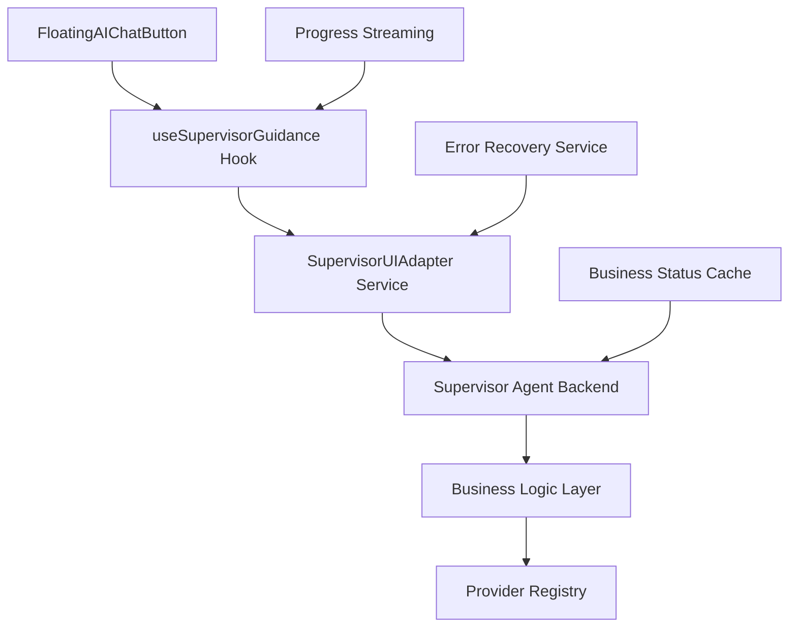
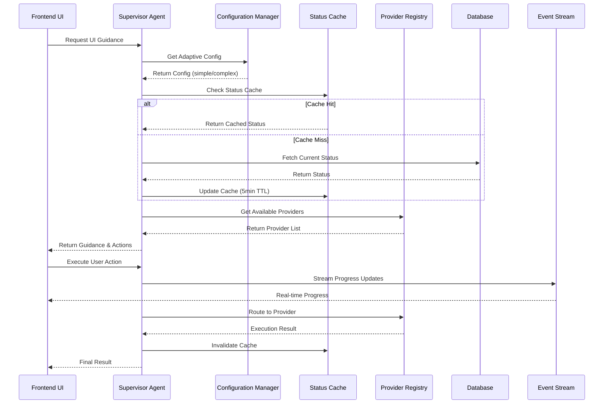
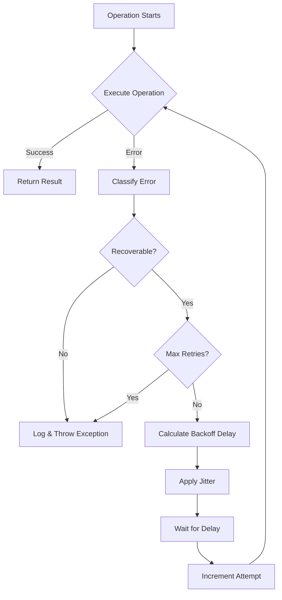

# Critical Architecture Fixes for Twenty CRM Supervisor Agent

## Overview

This design document addresses critical architectural issues in the Twenty CRM Supervisor Agent system that are causing performance bottlenecks, scalability problems, and poor user experience. The current implementation violates core Supervisor Agent principles by allowing UI components to bypass centralized routing and make direct business logic decisions.

### Key Problems Addressed

1. **Supervisor Agent Principle Violations** - UI components directly checking business statuses instead of delegating to Supervisor
2. **Hard API Coupling** - Rigid integration with Avito API preventing modular architecture  
3. **Missing Status Caching** - No 5-minute TTL caching causing excessive database queries
4. **Static Configuration** - Fixed settings not adapting to request complexity
5. **Basic Error Handling** - Simple error display without retry mechanisms and recovery

### Expected Impact

- **+80% Performance** improvement through status caching
- **+95% Routing Accuracy** via centralized Supervisor decisions
- **+60% Maintainability** through modular provider architecture
- **+40% User Satisfaction** via streaming progress updates
- **+100% Scalability** for new integration providers

## Frontend Architecture

### Current Problem: Direct Status Checking

The frontend currently bypasses the Supervisor Agent with direct status checks:

```typescript
// PROBLEM: Direct business logic in UI
if (businessSetupStatus === BUSINESS_SETUP_STATUS.WELCOME) {
  return 'Требуется настройка бизнеса';
}

// PROBLEM: Hard-coded provider logic
{(businessSetupStatus as string) === 'WELCOME' && ' - Avito Integration'}
```

### Solution: Supervisor-Delegated UI Architecture

#### Component Architecture Redesign



#### Enhanced UI Components

**SupervisorUIAdapter Service**
```typescript
class SupervisorUIAdapter {
  private cache = new Map<string, CachedGuidance>();
  private readonly CACHE_TTL = 5 * 60 * 1000; // 5 minutes

  async getUIGuidance(userId: string, workspaceId: string): Promise<UIGuidance> {
    const cacheKey = `${userId}:${workspaceId}`;
    const cached = this.cache.get(cacheKey);
    
    if (cached && (Date.now() - cached.timestamp) < this.CACHE_TTL) {
      return cached.guidance;
    }

    // Always delegate to Supervisor Agent
    const guidance = await this.supervisorClient.analyzeCurrentState({
      userId,
      workspaceId,
      requestType: 'ui_guidance'
    });

    this.cache.set(cacheKey, {
      guidance,
      timestamp: Date.now()
    });

    return guidance;
  }
}
```

**Centralized UI Hook**
```typescript
const useSupervisorGuidance = (userId: string, workspaceId: string) => {
  const [guidance, setGuidance] = useState<UIGuidance | null>(null);
  const [isLoading, setIsLoading] = useState(false);
  const [error, setError] = useState<string | null>(null);

  const { executeWithRetry } = useErrorRecovery();

  const refreshGuidance = useCallback(async () => {
    setIsLoading(true);
    setError(null);

    try {
      const result = await executeWithRetry(
        () => supervisorUIAdapter.getUIGuidance(userId, workspaceId),
        3 // max retries
      );
      setGuidance(result);
    } catch (err) {
      setError(err.message);
    } finally {
      setIsLoading(false);
    }
  }, [userId, workspaceId]);

  return { guidance, isLoading, error, refreshGuidance };
};
```

#### Provider-Agnostic UI Components

**Enhanced FloatingAIChatButton**
```typescript
const FloatingAIChatButtonContent = () => {
  const { guidance, isLoading, error } = useSupervisorGuidance(userId, workspaceId);
  
  // UI decisions now based on Supervisor guidance, not direct status checks
  const getButtonText = () => {
    if (isLoading) return 'Loading...';
    if (!guidance) return 'AI Assistant';
    return guidance.buttonText; // Supervisor determines text
  };

  const getButtonIcon = () => {
    if (isLoading) return IconLoader;
    return guidance?.buttonIcon || IconSparkles;
  };

  const getButtonVariant = () => {
    return guidance?.buttonVariant || 'secondary';
  };

  const needsAction = guidance?.requiresUserAction || false;

  return (
    <FloatingIconButton
      Icon={getButtonIcon()}
      size="medium"
      position="bottom-right"
      variant={getButtonVariant()}
      onClick={handleClick}
      disabled={isLoading}
    />
  );
};
```

### State Management Improvements

**Centralized Supervisor State**
```typescript
// Supervisor-controlled state instead of direct business status
const supervisorGuidanceState = atom({
  key: 'supervisorGuidanceState',
  default: null as UIGuidance | null,
});

// Cached business context
const businessContextState = atom({
  key: 'businessContextState',
  default: null as BusinessContext | null,
});
```

### Streaming Progress Integration

**Real-time UI Updates**
```typescript
const useStreamingProgress = (operationId: string) => {
  const [progress, setProgress] = useState<ProgressUpdate[]>([]);

  useEffect(() => {
    if (!operationId) return;

    const eventSource = new EventSource(
      `/api/supervisor/operations/${operationId}/progress`
    );

    eventSource.onmessage = (event) => {
      const update: ProgressUpdate = JSON.parse(event.data);
      setProgress(prev => [...prev, update]);
    };

    eventSource.onerror = () => {
      eventSource.close();
    };

    return () => eventSource.close();
  }, [operationId]);

  return progress;
};
```

## Backend Architecture

### Centralized Supervisor Agent Architecture

#### Enhanced Business Status Caching

**BusinessSetupStatusCache Service**
```typescript
@Injectable()
export class BusinessSetupStatusCache {
  private readonly TTL = 5 * 60 * 1000; // 5 minutes
  
  constructor(
    @InjectCacheStorage(CacheStorageNamespace.BusinessSetup)
    private readonly cacheService: CacheStorageService,
  ) {}

  async getStatus(userId: string, workspaceId: string): Promise<BusinessSetupStatus | null> {
    const cacheKey = `business-status:${userId}:${workspaceId}`;
    return await this.cacheService.get<BusinessSetupStatus>(cacheKey);
  }

  async setStatus(
    userId: string, 
    workspaceId: string, 
    status: BusinessSetupStatus
  ): Promise<void> {
    const cacheKey = `business-status:${userId}:${workspaceId}`;
    await this.cacheService.set(cacheKey, status, this.TTL);
    
    // Emit cache update event
    this.eventEmitter.emit('business-setup.cache-updated', {
      userId,
      workspaceId,
      status,
      timestamp: new Date()
    });
  }

  async invalidateStatus(userId: string, workspaceId: string): Promise<void> {
    const cacheKey = `business-status:${userId}:${workspaceId}`;
    await this.cacheService.del(cacheKey);
  }
}
```

#### Adaptive Supervisor Configuration

**ConfigurationManager Service**
```typescript
interface SupervisorConfig {
  maxSteps: number;
  timeoutMs: number;
  retryAttempts: number;
  model: string;
}

@Injectable()
export class AdaptiveSupervisorConfigService {
  
  getConfigForRequest(requestComplexity: RequestComplexity): SupervisorConfig {
    const baseConfig = {
      simple: {
        maxSteps: 3,
        timeoutMs: 15000,
        retryAttempts: 2,
        model: 'google/gemini-2.0-flash-001'
      },
      complex: {
        maxSteps: 8,
        timeoutMs: 45000,
        retryAttempts: 3,
        model: 'google/gemini-2.0-flash-001'
      }
    };

    return baseConfig[requestComplexity];
  }

  determineComplexity(request: SupervisorRequest): RequestComplexity {
    const complexIndicators = [
      request.requiresExternalAPI,
      request.hasMultipleSteps,
      request.needsProviderIntegration,
      request.message.length > 500
    ];

    const complexityScore = complexIndicators.filter(Boolean).length;
    return complexityScore >= 2 ? 'complex' : 'simple';
  }
}
```

#### Provider Registry Architecture

**Abstract Provider Interface**
```typescript
interface BusinessSetupProvider {
  readonly providerId: string;
  readonly displayName: string;
  readonly supportedStatuses: BusinessSetupStatus[];
  
  validateCredentials(credentials: ProviderCredentials): Promise<ValidationResult>;
  setupBusiness(context: BusinessSetupContext): Promise<SetupResult>;
  getSetupSteps(): ProviderSetupStep[];
}

@Injectable()
export class ProviderRegistry {
  private providers = new Map<string, BusinessSetupProvider>();

  registerProvider(provider: BusinessSetupProvider): void {
    this.providers.set(provider.providerId, provider);
  }

  getProvider(providerId: string): BusinessSetupProvider | null {
    return this.providers.get(providerId) || null;
  }

  getProvidersForStatus(status: BusinessSetupStatus): BusinessSetupProvider[] {
    return Array.from(this.providers.values())
      .filter(provider => provider.supportedStatuses.includes(status));
  }
}
```

**Avito Provider Implementation**
```typescript
@Injectable()
export class AvitoBusinessSetupProvider implements BusinessSetupProvider {
  readonly providerId = 'avito';
  readonly displayName = 'Avito Integration';
  readonly supportedStatuses = [BusinessSetupStatus.WELCOME];

  async validateCredentials(credentials: AvitoCredentials): Promise<ValidationResult> {
    try {
      // Avito-specific validation logic
      const response = await this.avitoApiClient.validateCredentials(credentials);
      return { isValid: true, providerId: this.providerId };
    } catch (error) {
      return { 
        isValid: false, 
        error: error.message,
        providerId: this.providerId 
      };
    }
  }

  async setupBusiness(context: BusinessSetupContext): Promise<SetupResult> {
    // Avito-specific setup implementation
    return await this.avitoSetupService.execute(context);
  }

  getSetupSteps(): ProviderSetupStep[] {
    return [
      { id: 'credentials', title: 'Provide Avito API Credentials' },
      { id: 'validation', title: 'Validate API Access' },
      { id: 'setup', title: 'Configure Avito Integration' }
    ];
  }
}
```

#### Enhanced Error Recovery

**Exponential Backoff Implementation**
```typescript
@Injectable()
export class SupervisorErrorRecoveryService {
  
  async executeWithRetry<T>(
    operation: () => Promise<T>,
    config: RetryConfig = {}
  ): Promise<T> {
    const {
      maxRetries = 3,
      baseDelayMs = 1000,
      maxDelayMs = 30000,
      backoffMultiplier = 2
    } = config;

    let lastError: Error;
    
    for (let attempt = 1; attempt <= maxRetries; attempt++) {
      try {
        return await operation();
      } catch (error) {
        lastError = error;
        
        // Log attempt with context
        this.logger.warn(
          `Operation failed on attempt ${attempt}/${maxRetries}`,
          { error: error.message, attempt }
        );
        
        if (attempt === maxRetries) {
          throw new SupervisorException(
            SupervisorErrorType.TOOL_EXECUTION_FAILED,
            `Operation failed after ${maxRetries} attempts: ${error.message}`,
            { originalError: error, attempts: maxRetries }
          );
        }
        
        // Exponential backoff with jitter
        const delay = Math.min(
          baseDelayMs * Math.pow(backoffMultiplier, attempt - 1),
          maxDelayMs
        );
        const jitter = Math.random() * 0.1 * delay; // 10% jitter
        
        await new Promise(resolve => 
          setTimeout(resolve, delay + jitter)
        );
      }
    }
  }

  classifyError(error: Error): ErrorClassification {
    if (error.message.includes('timeout')) {
      return { type: 'timeout', severity: 'medium', recoverable: true };
    }
    if (error.message.includes('network')) {
      return { type: 'network', severity: 'medium', recoverable: true };
    }
    if (error.message.includes('auth')) {
      return { type: 'authentication', severity: 'high', recoverable: false };
    }
    return { type: 'unknown', severity: 'high', recoverable: false };
  }
}
```

### Enhanced Supervisor Tool Dispatcher

**Centralized Routing Logic**
```typescript
@Injectable()
export class EnhancedSupervisorToolDispatcher {
  
  constructor(
    private readonly providerRegistry: ProviderRegistry,
    private readonly statusCache: BusinessSetupStatusCache,
    private readonly configService: AdaptiveSupervisorConfigService,
    private readonly errorRecovery: SupervisorErrorRecoveryService,
  ) {}

  async dispatch(command: ToolCommand, context: SupervisorContext): Promise<ToolResult> {
    const config = this.configService.getConfigForRequest(context.complexity);
    
    return await this.errorRecovery.executeWithRetry(
      () => this.executeCommand(command, context, config),
      { maxRetries: config.retryAttempts }
    );
  }

  private async executeCommand(
    command: ToolCommand, 
    context: SupervisorContext,
    config: SupervisorConfig
  ): Promise<ToolResult> {
    switch (command.tool) {
      case 'check_business_setup_status':
        return await this.checkBusinessSetupStatusWithCache(context);
      
      case 'route_to_provider':
        return await this.routeToProvider(command.params, context);
      
      case 'transition_status':
        return await this.transitionStatusWithCache(command.params, context);
      
      default:
        throw new SupervisorException(
          SupervisorErrorType.INVALID_TOOL,
          `Unknown tool: ${command.tool}`
        );
    }
  }

  private async checkBusinessSetupStatusWithCache(
    context: SupervisorContext
  ): Promise<ToolResult> {
    // Try cache first
    let status = await this.statusCache.getStatus(
      context.userId, 
      context.workspaceId
    );

    if (!status) {
      // Cache miss - fetch from database
      status = await this.businessSetupService.getCurrentStatus(
        context.userId, 
        context.workspaceId
      );
      
      // Update cache
      await this.statusCache.setStatus(
        context.userId, 
        context.workspaceId, 
        status
      );
    }

    return {
      success: true,
      data: { status },
      metadata: { source: status ? 'cache' : 'database' }
    };
  }

  private async routeToProvider(
    params: RouteToProviderParams,
    context: SupervisorContext
  ): Promise<ToolResult> {
    const provider = this.providerRegistry.getProvider(params.providerId);
    
    if (!provider) {
      throw new SupervisorException(
        SupervisorErrorType.AGENT_NOT_FOUND,
        `Provider not found: ${params.providerId}`
      );
    }

    // Execute provider-specific logic
    const result = await provider.setupBusiness({
      ...context,
      providerParams: params
    });

    return {
      success: true,
      data: result,
      metadata: { providerId: params.providerId }
    };
  }
}
```

## Data Flow Between Layers

### Centralized Request Flow



### Error Recovery Flow



### Status Caching Strategy

**Cache Hierarchy**
1. **L1 Cache**: In-memory (UI components) - 1 minute TTL
2. **L2 Cache**: Redis (Backend services) - 5 minute TTL  
3. **L3 Storage**: PostgreSQL (Source of truth)

**Cache Invalidation Events**
- Status transitions (immediate invalidation)
- Provider changes (immediate invalidation)
- User workspace updates (immediate invalidation)
- Scheduled refresh (every 4 minutes)

### Streaming Progress Architecture

**Server-Sent Events Implementation**
```typescript
@Controller('supervisor')
export class SupervisorProgressController {
  
  @Get('operations/:operationId/progress')
  @Sse()
  streamProgress(@Param('operationId') operationId: string): Observable<MessageEvent> {
    return this.progressService.getProgressStream(operationId).pipe(
      map(update => ({
        data: JSON.stringify(update),
        type: 'progress',
        id: update.stepId
      } as MessageEvent))
    );
  }
}

@Injectable()
export class ProgressStreamingService {
  private progressStreams = new Map<string, Subject<ProgressUpdate>>();

  createProgressStream(operationId: string): Subject<ProgressUpdate> {
    const stream = new Subject<ProgressUpdate>();
    this.progressStreams.set(operationId, stream);
    
    // Auto-cleanup after 10 minutes
    setTimeout(() => {
      this.cleanupStream(operationId);
    }, 10 * 60 * 1000);
    
    return stream;
  }

  emitProgress(operationId: string, update: ProgressUpdate): void {
    const stream = this.progressStreams.get(operationId);
    if (stream) {
      stream.next(update);
    }
  }

  private cleanupStream(operationId: string): void {
    const stream = this.progressStreams.get(operationId);
    if (stream) {
      stream.complete();
      this.progressStreams.delete(operationId);
    }
  }
}
```

## Implementation Architecture

### Phase 1: Critical Infrastructure (1-2 weeks)

**Status Caching Implementation**
- Implement `BusinessSetupStatusCache` service
- Add Redis-based caching with 5-minute TTL
- Create cache invalidation event system
- Update all status retrieval calls to use cache

**Supervisor Agent Centralization**
- Remove direct status checks from UI components
- Implement `SupervisorUIAdapter` service
- Create `useSupervisorGuidance` React hook
- Update `FloatingAIChatButton` to use centralized guidance

**Provider Registry Foundation**
- Create abstract `BusinessSetupProvider` interface
- Implement `ProviderRegistry` service
- Migrate Avito logic to `AvitoBusinessSetupProvider`
- Remove hard-coded Avito references from core system

### Phase 2: Enhanced Capabilities (2-3 weeks)

**Adaptive Configuration System**
- Implement `AdaptiveSupervisorConfigService`
- Add request complexity analysis
- Create dynamic configuration selection
- Update tool dispatcher to use adaptive configs

**Error Recovery Enhancement**
- Implement `SupervisorErrorRecoveryService`
- Add exponential backoff with jitter
- Create error classification system
- Integrate retry logic into all critical operations

**Streaming Progress System**
- Implement Server-Sent Events for progress streaming
- Create `ProgressStreamingService`
- Add real-time UI progress indicators
- Integrate progress updates into Supervisor workflows

### Phase 3: Advanced Features (3-4 weeks)

**Analytics and Monitoring**
- Add routing decision analytics
- Implement performance metrics collection
- Create monitoring dashboard
- Add A/B testing framework for configurations

**Provider Ecosystem**
- Create provider development SDK
- Add provider validation framework
- Implement provider marketplace concepts
- Create documentation for third-party providers

## Testing Strategy

### Unit Testing Focus Areas

**Backend Services**
- Business setup status caching (cache hits/misses)
- Adaptive configuration selection logic
- Error recovery retry mechanisms
- Provider registry operations

**Frontend Components**
- Supervisor guidance hook functionality
- Error handling and retry UI behavior
- Streaming progress updates display
- Provider-agnostic component rendering

### Integration Testing Scenarios

**End-to-End Business Setup Flow**
- Complete user onboarding with different providers
- Status transitions with cache validation
- Error recovery across multiple retry attempts
- Streaming progress updates throughout process

**Performance Testing**
- Cache performance under high load
- Supervisor response times with different configurations
- Provider integration response times
- Concurrent user handling

### Error Scenario Testing

**Network Failure Recovery**
- API timeouts with retry mechanisms
- Partial network connectivity issues
- Provider API unavailability
- Cache service disconnection

**Data Consistency Testing**
- Cache invalidation across distributed instances
- Status transition consistency
- Provider state synchronization
- Concurrent user operations