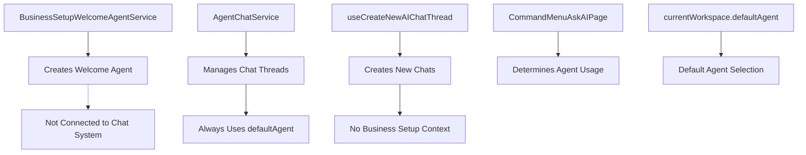
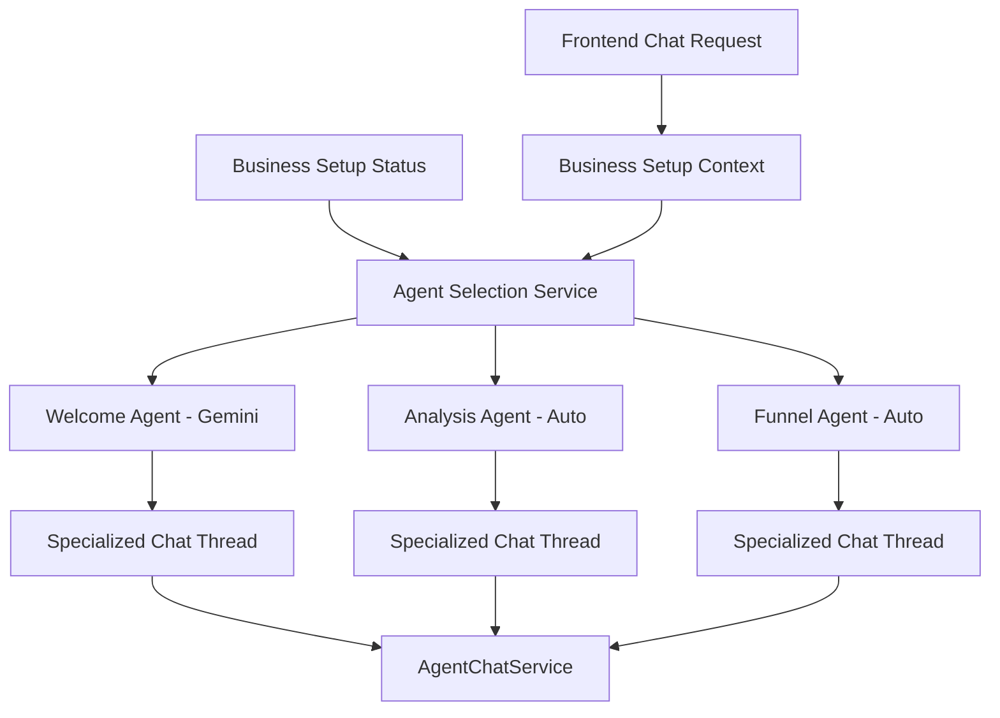
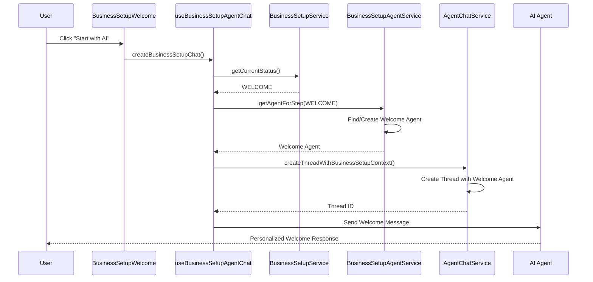
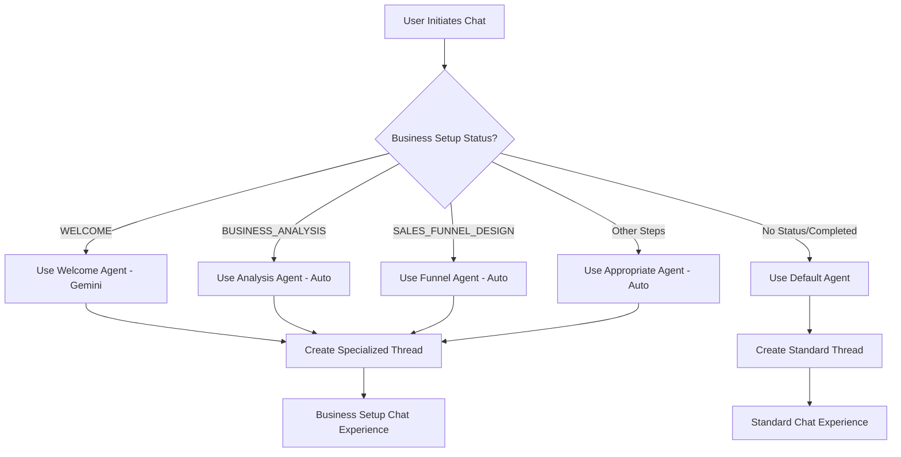

# Welcome AI Agent Integration Design

## Implementation Progress

### ✅ Completed
- Design document created
- Implementation strategy defined
- Current system analysis completed

### 🔄 In Progress
- **Phase 1: Backend Infrastructure Foundation**
  - Step 1.1: Extend CreateAgentChatThreadInput (Next)

### ⏳ Pending
- Step 1.2: Create BusinessSetupAgentService
- Step 1.3: Enhance AgentChatService 
- Step 1.4: Update AgentChatResolver
- Phase 2: Frontend Integration
- Phase 3: Integration Points
- Phase 4-6: Testing & Deployment

---

## Overview

This document outlines the design for integrating a **Welcome AI Agent** with the Twenty chat system to ensure that users in the **WELCOME** stage of business setup interact exclusively with a specialized Welcome AI agent instead of the universal default AI agent.

### Problem Statement

Currently, the system has the following issues:
- Welcome AI agent is created but not integrated with the chat system
- New chats always use the `defaultAgent` regardless of business setup status
- No connection between Business Setup status and agent selection
- Users cannot access specialized AI assistance during the WELCOME step

### Solution Goals

Create a system where:
- Users in **WELCOME** status interact exclusively with the Welcome AI agent
- Other business setup stages use appropriate specialized agents
- The system automatically determines the correct agent based on status
- Seamless integration with existing chat infrastructure

## Architecture

### Current System Components



### Proposed Architecture



## Component Architecture

### Backend Components

#### BusinessSetupAgentService

**Purpose**: Central service for managing business setup specific agents

**Key Responsibilities**:
- Map business setup steps to appropriate AI agents
- Create specialized agents when needed
- Maintain agent configurations for each step

**Methods**:
- `getAgentForStep(step: BusinessSetupStatus, workspaceId: string): Promise<AgentEntity>`
- `createAgentForStep(step: BusinessSetupStatus, workspaceId: string): Promise<AgentEntity>`

**Agent Mapping Strategy**:
```typescript
const agentMapping = {
  [BusinessSetupStatus.WELCOME]: 'welcome-agent',
  [BusinessSetupStatus.BUSINESS_ANALYSIS]: 'business-analysis-agent',
  [BusinessSetupStatus.SALES_FUNNEL_DESIGN]: 'funnel-designer-agent',
  [BusinessSetupStatus.AGENT_SETUP]: 'agent-orchestrator-agent',
  [BusinessSetupStatus.WORKFLOW_CREATION]: 'workflow-generator-agent',
  [BusinessSetupStatus.TEAM_ASSIGNMENT]: 'team-assignment-agent',
  [BusinessSetupStatus.TESTING_OPTIMIZATION]: 'testing-optimization-agent',
};
```

#### Enhanced AgentChatService

**Purpose**: Extended chat service with business setup context awareness

**New Methods**:
- `createThreadWithBusinessSetupContext(agentId: string, userWorkspaceId: string, businessSetupStep?: BusinessSetupStatus)`

**Enhanced Logic**:
- Automatically selects appropriate agent based on business setup step
- Maintains backward compatibility with existing chat creation
- Handles fallback scenarios when specialized agents are unavailable

#### GraphQL Schema Extensions

**Enhanced Input Types**:
```typescript
@InputType()
export class CreateAgentChatThreadInput {
  @Field(() => UUIDScalarType)
  agentId: string;

  @Field(() => String, { nullable: true })
  businessSetupStep?: string;
}
```

### Frontend Components

#### useBusinessSetupAgentChat Hook

**Purpose**: Specialized hook for business setup chat interactions

**Features**:
- Context-aware chat creation
- Step-specific welcome messages
- Business setup mode indicators

**Interface**:
```typescript
export interface BusinessSetupAgentChatHook {
  createBusinessSetupChat: () => void;
  getWelcomeMessageForStep: (step: BusinessSetupStatus) => string;
}
```

#### Enhanced useCreateNewAIChatThread Hook

**Purpose**: Extended to support business setup context

**New Features**:
- Business setup status detection
- Automatic agent selection based on status
- Context-aware thread creation

#### Business Setup Integration Points

**BusinessSetupWelcome Component**:
- Direct integration with Welcome AI agent
- Specialized chat initialization
- Context-aware user flow

**FloatingAIChatButton Enhancement**:
- Business setup status awareness
- Conditional agent selection
- Seamless user experience across setup steps

## Data Flow

### Chat Creation Flow



### Agent Selection Flow



## API Endpoints Reference

### GraphQL Mutations

#### createAgentChatThread

**Enhanced Input**:
```graphql
input CreateAgentChatThreadInput {
  agentId: String!
  businessSetupStep: String
}
```

**Usage Examples**:
```graphql
# Standard chat creation
mutation {
  createAgentChatThread(input: { agentId: "agent-uuid" }) {
    id
    agentId
    userWorkspaceId
  }
}

# Business setup chat creation
mutation {
  createAgentChatThread(input: { 
    agentId: "agent-uuid",
    businessSetupStep: "WELCOME"
  }) {
    id
    agentId
    userWorkspaceId
  }
}
```

### REST API Integration

**Agent Events Controller**:
- Enhanced to handle business setup context
- Support for step-specific agent events
- Integration with existing AI agent events system

## Business Logic Layer

### Agent Configuration Management

**Welcome Agent Configuration**:
```typescript
{
  name: 'welcome-agent',
  label: 'Welcome AI Assistant',
  description: 'AI assistant for welcome step in business setup',
  prompt: `You are a Welcome AI assistant for Business Setup Wizard. Your role is to:
    1. Greet users warmly and welcome them to the business setup process
    2. Explain what Business Setup Wizard will accomplish
    3. Guide users through the initial steps
    4. Answer questions about the setup process
    5. Motivate users to continue with business setup
    
    Be friendly, encouraging, and explain what will happen next.`,
  modelId: 'google/gemini-2.5-flash',
  isCustom: true,
}
```

**Business Analysis Agent Configuration**:
```typescript
{
  name: 'business-analysis-agent',
  label: 'Business Analysis AI',
  description: 'AI assistant for business analysis step',
  prompt: `You are a Business Analysis AI specialist. Your role is to:
    1. Help users understand their business better
    2. Ask relevant questions about industry, size, model
    3. Provide industry insights and trends
    4. Suggest optimization opportunities
    5. Prepare users for funnel design`,
  modelId: 'auto',
  isCustom: true,
}
```

### Context Propagation Strategy

**Thread Context**:
- Business setup step information
- User progression tracking
- Step-specific conversation history
- Agent transition handling

**Session Management**:
- Persistent business setup state
- Cross-step context preservation
- User preference tracking

## State Management

### Frontend State Architecture

**Business Setup States**:
```typescript
// Business setup status state
const businessSetupStatusState = atom({
  key: 'businessSetupStatusState',
  default: null as BusinessSetupStatus | null,
});

// Current business setup agent state
const currentBusinessSetupAgentState = atom({
  key: 'currentBusinessSetupAgentState',
  default: null as AgentEntity | null,
});

// Business setup chat context state
const businessSetupChatContextState = atom({
  key: 'businessSetupChatContextState',
  default: {
    isBusinessSetupMode: false,
    currentStep: null as BusinessSetupStatus | null,
    stepProgress: 0,
  },
});
```

### Backend State Management

**Agent Registry**:
- Cached agent configurations
- Dynamic agent creation
- Agent lifecycle management

**Thread Context Storage**:
- Business setup metadata in threads
- Step progression tracking
- Context preservation across sessions

## Routing & Navigation

### Enhanced Route Handling

**Business Setup Routes**:
```typescript
const businessSetupRoutes = [
  {
    path: AppPath.BusinessSetupWelcome,
    element: <BusinessSetupWelcome />,
    agentType: 'welcome-agent',
  },
  {
    path: AppPath.BusinessAnalysis,
    element: <BusinessAnalysis />,
    agentType: 'business-analysis-agent',
  },
  // ... other routes
];
```

**Agent-Aware Navigation**:
- Automatic agent switching on route changes
- Context preservation during navigation
- Seamless chat experience across steps

## Testing Strategy

### Unit Tests

**Backend Services**:
```typescript
describe('BusinessSetupAgentService', () => {
  it('should return welcome agent for WELCOME status', async () => {
    const agent = await service.getAgentForStep(
      BusinessSetupStatus.WELCOME, 
      'workspace-id'
    );
    expect(agent.name).toBe('welcome-agent');
    expect(agent.modelId).toBe('google/gemini-2.5-flash');
  });

  it('should create agent if not exists', async () => {
    const agent = await service.getAgentForStep(
      BusinessSetupStatus.BUSINESS_ANALYSIS,
      'new-workspace-id'
    );
    expect(agent).toBeDefined();
    expect(agent.name).toBe('business-analysis-agent');
  });
});
```

**Frontend Hooks**:
```typescript
describe('useBusinessSetupAgentChat', () => {
  it('should create business setup chat with correct context', () => {
    const { createBusinessSetupChat } = renderHook(() => 
      useBusinessSetupAgentChat()
    ).result.current;
    
    createBusinessSetupChat();
    
    expect(openAskAIPage).toHaveBeenCalledWith(
      expect.objectContaining({
        context: expect.objectContaining({
          businessSetupMode: true,
          step: 'WELCOME',
        }),
      })
    );
  });
});
```

### Integration Tests

**End-to-End Chat Flow**:
```typescript
describe('Business Setup Chat Integration', () => {
  it('should create welcome chat when user starts business setup', async () => {
    // Navigate to business setup welcome
    await page.goto('/business-setup/welcome');
    
    // Click start with AI button
    await page.click('[data-testid="start-with-ai"]');
    
    // Verify welcome agent chat is opened
    await expect(page.locator('[data-testid="ai-chat"]')).toBeVisible();
    await expect(page.locator('[data-testid="agent-name"]')).toContainText('Welcome AI Assistant');
    
    // Verify welcome message
    await expect(page.locator('[data-testid="welcome-message"]')).toContainText('Welcome to Business Setup');
  });

  it('should transition to analysis agent when moving to next step', async () => {
    // Complete welcome step
    await completeWelcomeStep();
    
    // Navigate to business analysis
    await page.goto('/business-setup/business-analysis');
    
    // Start new chat
    await page.click('[data-testid="floating-ai-button"]');
    
    // Verify analysis agent is used
    await expect(page.locator('[data-testid="agent-name"]')).toContainText('Business Analysis AI');
  });
});
```

### Performance Tests

**Agent Creation Performance**:
- Measure agent lookup vs creation times
- Cache effectiveness validation
- Memory usage optimization

**Chat Thread Performance**:
- Thread creation latency
- Message processing speed
- Context switching overhead

## Implementation Phases

### Phase 1: Backend Infrastructure (Week 1)
- [ ] Create BusinessSetupAgentService
- [ ] Enhance AgentChatService with business setup context
- [ ] Update GraphQL schema and resolvers
- [ ] Implement agent configuration management
- [ ] Add comprehensive unit tests

### Phase 2: Frontend Integration (Week 2)
- [ ] Create useBusinessSetupAgentChat hook
- [ ] Enhance useCreateNewAIChatThread with business setup support
- [ ] Update BusinessSetupWelcome component
- [ ] Enhance FloatingAIChatButton with context awareness
- [ ] Implement state management updates

### Phase 3: Testing & Optimization (Week 3)
- [ ] Integration testing across all components
- [ ] End-to-end testing for complete user flows
- [ ] Performance optimization and caching
- [ ] Error handling and fallback mechanisms
- [ ] Documentation and developer guides

## Error Handling & Fallback Mechanisms

### Agent Selection Fallbacks

**Primary Strategy**: Use business setup specific agent
**Fallback 1**: Use workspace default agent
**Fallback 2**: Use system default agent
**Error Recovery**: Log issues and continue with available agent

### Chat Creation Error Handling

```typescript
try {
  const businessSetupAgent = await this.businessSetupAgentService.getAgentForStep(
    businessSetupStep, 
    userWorkspaceId
  );
  effectiveAgentId = businessSetupAgent.id;
} catch (error) {
  this.logger.warn(`Failed to get business setup agent: ${error.message}`);
  // Continue with original agentId as fallback
}
```

### Frontend Error Boundaries

**Business Setup Chat Errors**:
- Graceful degradation to standard chat
- User notification of limited functionality
- Automatic retry mechanisms

## Security Considerations

### Agent Access Control

**Workspace Isolation**:
- Business setup agents are workspace-specific
- No cross-workspace agent access
- User permission validation

**Model Access Security**:
- Controlled access to Gemini model for welcome step
- API key management and rotation
- Rate limiting and usage monitoring

### Data Protection

**Chat Content Security**:
- Encryption of business setup chat data
- PII detection and protection
- Audit logging for compliance

**Context Data Handling**:
- Secure storage of business setup context
- Data retention policies
- User consent management

## Monitoring & Analytics

### Performance Metrics

**Agent Selection Metrics**:
- Agent lookup/creation latency
- Cache hit rates
- Error rates by business setup step

**Chat Experience Metrics**:
- User engagement by agent type
- Conversation completion rates
- Step progression analytics

### Business Metrics

**Business Setup Completion**:
- Conversion rates by step
- AI assistance effectiveness
- User satisfaction scores

**Agent Performance**:
- Response quality by agent type
- User feedback analysis
- Model performance comparison

## Configuration Management

### Environment Variables

```env
# Business Setup Agent Configuration
BUSINESS_SETUP_WELCOME_AGENT_MODEL=google/gemini-2.5-flash
BUSINESS_SETUP_DEFAULT_MODEL=auto
BUSINESS_SETUP_AGENT_CACHE_TTL=3600

# Feature Flags
ENABLE_BUSINESS_SETUP_AGENTS=true
ENABLE_WELCOME_AGENT_GEMINI=true
ENABLE_AGENT_AUTO_CREATION=true
```

### Runtime Configuration

**Agent Model Mapping**:
```typescript
const modelMapping = {
  [BusinessSetupStatus.WELCOME]: process.env.BUSINESS_SETUP_WELCOME_AGENT_MODEL,
  [BusinessSetupStatus.BUSINESS_ANALYSIS]: process.env.BUSINESS_SETUP_DEFAULT_MODEL,
  // ... other mappings
};
```

## Implementation Strategy

### Phase 1: Backend Infrastructure Foundation

#### Step 1.1: Extend CreateAgentChatThreadInput

**File**: `packages/twenty-server/src/engine/metadata-modules/agent/dtos/create-agent-chat-thread.input.ts`

```typescript
import { Field, InputType } from '@nestjs/graphql';
import { IsNotEmpty, IsOptional, IsString } from 'class-validator';
import { UUIDScalarType } from 'src/engine/api/graphql/workspace-schema-builder/graphql-types/scalars';

@InputType()
export class CreateAgentChatThreadInput {
  @IsNotEmpty()
  @Field(() => UUIDScalarType)
  agentId: string;

  @IsOptional()
  @IsString()
  @Field(() => String, { nullable: true })
  businessSetupStep?: string;
}
```

#### Step 1.2: Create BusinessSetupAgentService

**File**: `packages/twenty-server/src/engine/core-modules/business-setup/services/business-setup-agent.service.ts`

```typescript
import { Injectable, Logger } from '@nestjs/common';
import { InjectRepository } from '@nestjs/typeorm';
import { Repository } from 'typeorm';
import { AgentEntity } from 'src/engine/metadata-modules/agent/agent.entity';
import { AgentService } from 'src/engine/metadata-modules/agent/agent.service';
import { BusinessSetupStatus } from '../enums/business-setup-status.enum';

@Injectable()
export class BusinessSetupAgentService {
  private readonly logger = new Logger(BusinessSetupAgentService.name);

  constructor(
    @InjectRepository(AgentEntity, 'core')
    private readonly agentRepository: Repository<AgentEntity>,
    private readonly agentService: AgentService,
  ) {}

  async getAgentForStep(
    step: BusinessSetupStatus,
    workspaceId: string,
  ): Promise<AgentEntity> {
    const agentMapping = {
      [BusinessSetupStatus.WELCOME]: 'welcome-agent',
      [BusinessSetupStatus.BUSINESS_ANALYSIS]: 'business-analysis-agent',
      [BusinessSetupStatus.SALES_FUNNEL_DESIGN]: 'funnel-designer-agent',
      [BusinessSetupStatus.AGENT_SETUP]: 'agent-orchestrator-agent',
      [BusinessSetupStatus.WORKFLOW_CREATION]: 'workflow-generator-agent',
      [BusinessSetupStatus.TEAM_ASSIGNMENT]: 'team-assignment-agent',
      [BusinessSetupStatus.TESTING_OPTIMIZATION]: 'testing-optimization-agent',
    };

    const agentName = agentMapping[step];
    if (!agentName) {
      throw new Error(`No agent mapping for step: ${step}`);
    }

    // Look for existing agent
    let agent = await this.agentRepository.findOne({
      where: { name: agentName, workspaceId },
    });

    // Create agent if it doesn't exist
    if (!agent) {
      agent = await this.createAgentForStep(step, workspaceId);
    }

    return agent;
  }

  private async createAgentForStep(
    step: BusinessSetupStatus,
    workspaceId: string,
  ): Promise<AgentEntity> {
    const agentConfigs = {
      [BusinessSetupStatus.WELCOME]: {
        name: 'welcome-agent',
        label: 'Welcome AI Assistant',
        description: 'AI assistant for welcome step in business setup',
        prompt: `You are a Welcome AI assistant for Business Setup Wizard. Your role is to:

1. Greet users warmly and welcome them to the business setup process
2. Explain what Business Setup Wizard will accomplish
3. Guide users through the initial steps
4. Answer questions about the setup process
5. Motivate users to continue with business setup

Be friendly, encouraging, and explain what will happen next. Focus on building excitement and confidence.`,
        modelId: 'google/gemini-2.5-flash',
        isCustom: true,
      },
      [BusinessSetupStatus.BUSINESS_ANALYSIS]: {
        name: 'business-analysis-agent',
        label: 'Business Analysis AI',
        description: 'AI assistant for business analysis step',
        prompt: `You are a Business Analysis AI specialist. Your role is to:

1. Help users understand their business better
2. Ask relevant questions about industry, size, model
3. Provide industry insights and trends
4. Suggest optimization opportunities
5. Prepare users for funnel design

Focus on gathering actionable business intelligence.`,
        modelId: 'auto',
        isCustom: true,
      },
      // Add other agent configurations...
    };

    const config = agentConfigs[step];
    if (!config) {
      throw new Error(`No configuration for step: ${step}`);
    }

    return await this.agentRepository.save({
      ...config,
      workspaceId,
    });
  }
}
```

#### Step 1.3: Enhance AgentChatService

**File**: `packages/twenty-server/src/engine/metadata-modules/agent/agent-chat.service.ts`

Add new method after existing `createThread` method:

```typescript
async createThreadWithBusinessSetupContext(
  agentId: string,
  userWorkspaceId: string,
  businessSetupStep?: BusinessSetupStatus,
) {
  let effectiveAgentId = agentId;

  // If business setup step is provided, use appropriate agent
  if (businessSetupStep) {
    try {
      const businessSetupAgent = await this.businessSetupAgentService.getAgentForStep(
        businessSetupStep,
        userWorkspaceId,
      );
      effectiveAgentId = businessSetupAgent.id;
    } catch (error) {
      // Log warning but continue with original agentId
      console.warn(`Failed to get business setup agent for step ${businessSetupStep}:`, error);
    }
  }

  const thread = this.threadRepository.create({
    agentId: effectiveAgentId,
    userWorkspaceId,
  });

  return this.threadRepository.save(thread);
}
```

#### Step 1.4: Update AgentChatResolver

**File**: `packages/twenty-server/src/engine/metadata-modules/agent/agent-chat.resolver.ts`

Update the `createAgentChatThread` method:

```typescript
@Mutation(() => AgentChatThreadDTO)
@RequireFeatureFlag(FeatureFlagKey.IS_AI_ENABLED)
async createAgentChatThread(
  @Args('input') input: CreateAgentChatThreadInput,
  @AuthUserWorkspaceId() userWorkspaceId: string,
) {
  // If businessSetupStep is provided, use enhanced logic
  if (input.businessSetupStep) {
    return this.agentChatService.createThreadWithBusinessSetupContext(
      input.agentId,
      userWorkspaceId,
      input.businessSetupStep as BusinessSetupStatus,
    );
  }

  // Otherwise use standard logic
  return this.agentChatService.createThread(input.agentId, userWorkspaceId);
}
```

### Phase 2: Frontend Integration

#### Step 2.1: Create useBusinessSetupAgentChat Hook

**File**: `packages/twenty-front/src/modules/business-setup/hooks/useBusinessSetupAgentChat.ts`

```typescript
import { useOpenAskAIPageInCommandMenu } from '@/command-menu/hooks/useOpenAskAIPageInCommandMenu';
import { useBusinessSetupStatus } from './useBusinessSetupStatus';
import { BusinessSetupStatus } from './useSetNextBusinessSetupStatus';

export const useBusinessSetupAgentChat = () => {
  const businessSetupStatus = useBusinessSetupStatus();
  const { openAskAIPage } = useOpenAskAIPageInCommandMenu();

  const createBusinessSetupChat = () => {
    openAskAIPage(
      getWelcomeMessageForStep(businessSetupStatus || 'WELCOME'),
      {
        businessSetupMode: true,
        step: businessSetupStatus,
        agentType: `BUSINESS_SETUP_${businessSetupStatus}`,
      },
    );
  };

  const getWelcomeMessageForStep = (step: BusinessSetupStatus): string => {
    const messages = {
      WELCOME: "🎉 Welcome to Business Setup! I'm here to guide you through creating your automated business system.",
      BUSINESS_ANALYSIS: "🚀 Let's analyze your business! I'll help you understand your processes and opportunities.",
      SALES_FUNNEL_DESIGN: "🎯 Time to design your sales funnel! I'll help you create the perfect conversion path.",
      AGENT_SETUP: "🤖 Let's set up your AI agents! I'll help you build your automated team.",
      WORKFLOW_CREATION: "⚡ Time to create workflows! I'll help you automate your processes.",
      TEAM_ASSIGNMENT: "👥 Let's assign your team! I'll help you organize roles and responsibilities.",
      TESTING_OPTIMIZATION: "🧪 Let's test and optimize! I'll help you ensure everything works perfectly.",
    };
    return messages[step] || messages.WELCOME;
  };

  return { createBusinessSetupChat, getWelcomeMessageForStep };
};
```

#### Step 2.2: Enhance useCreateNewAIChatThread

**File**: `packages/twenty-front/src/modules/ai/hooks/useCreateNewAIChatThread.ts`

Replace existing content with:

```typescript
import { currentAIChatThreadComponentState } from '@/ai/states/currentAIChatThreadComponentState';
import { useOpenAskAIPageInCommandMenu } from '@/command-menu/hooks/useOpenAskAIPageInCommandMenu';
import { useRecoilComponentState } from '@/ui/utilities/state/component-state/hooks/useRecoilComponentState';
import { useCreateAgentChatThreadMutation } from '~/generated-metadata/graphql';
import { useBusinessSetupStatus } from '@/business-setup/hooks/useBusinessSetupStatus';

export const useCreateNewAIChatThread = ({ agentId }: { agentId: string }) => {
  const [, setCurrentThreadId] = useRecoilComponentState(
    currentAIChatThreadComponentState,
    agentId,
  );

  const { openAskAIPage } = useOpenAskAIPageInCommandMenu();
  const businessSetupStatus = useBusinessSetupStatus();
  
  const [createAgentChatThread] = useCreateAgentChatThreadMutation({
    variables: {
      input: {
        agentId,
        businessSetupStep: businessSetupStatus === 'WELCOME' ? 'WELCOME' : undefined,
      },
    },
    onCompleted: (data) => {
      setCurrentThreadId(data.createAgentChatThread.id);
      openAskAIPage();
    },
  });

  return { createAgentChatThread };
};
```

#### Step 2.3: Update BusinessSetupWelcome Component

**File**: `packages/twenty-front/src/pages/business-setup/BusinessSetupWelcome.tsx`

Replace the `handleStartWithAI` function:

```typescript
import { useBusinessSetupAgentChat } from '@/business-setup/hooks/useBusinessSetupAgentChat';

// Inside component:
const { createBusinessSetupChat } = useBusinessSetupAgentChat();

const handleStartWithAI = () => {
  createBusinessSetupChat();
};
```

### Phase 3: Integration Points

#### Step 3.1: Update Business Setup Module

**File**: `packages/twenty-server/src/engine/core-modules/business-setup/business-setup.module.ts`

Add BusinessSetupAgentService to providers:

```typescript
import { BusinessSetupAgentService } from './services/business-setup-agent.service';

@Module({
  imports: [
    TypeOrmModule.forFeature([AgentEntity], 'core'),
    // ... other imports
  ],
  providers: [
    BusinessSetupService,
    BusinessSetupResolver,
    BusinessSetupWelcomeAgentService,
    BusinessSetupAgentService, // Add this
    // ... other providers
  ],
  exports: [
    BusinessSetupService,
    BusinessSetupAgentService, // Add this
  ],
})
export class BusinessSetupModule {}
```

#### Step 3.2: Update AgentChatService Dependencies

**File**: `packages/twenty-server/src/engine/metadata-modules/agent/agent-chat.service.ts`

Add BusinessSetupAgentService to constructor:

```typescript
import { BusinessSetupAgentService } from 'src/engine/core-modules/business-setup/services/business-setup-agent.service';

constructor(
  @InjectRepository(AgentChatThreadEntity, 'core')
  private readonly threadRepository: Repository<AgentChatThreadEntity>,
  @InjectRepository(AgentChatMessageEntity, 'core')
  private readonly messageRepository: Repository<AgentChatMessageEntity>,
  @InjectRepository(FileEntity, 'core')
  private readonly fileRepository: Repository<FileEntity>,
  private readonly titleGenerationService: AgentTitleGenerationService,
  private readonly businessSetupAgentService: BusinessSetupAgentService,
) {}
```

### Phase 4: Testing Strategy

#### Step 4.1: Backend Unit Tests

**File**: `packages/twenty-server/src/engine/core-modules/business-setup/services/business-setup-agent.service.spec.ts`

```typescript
describe('BusinessSetupAgentService', () => {
  let service: BusinessSetupAgentService;
  let agentRepository: Repository<AgentEntity>;

  beforeEach(async () => {
    const module = await Test.createTestingModule({
      providers: [
        BusinessSetupAgentService,
        {
          provide: getRepositoryToken(AgentEntity, 'core'),
          useClass: Repository,
        },
      ],
    }).compile();

    service = module.get<BusinessSetupAgentService>(BusinessSetupAgentService);
    agentRepository = module.get<Repository<AgentEntity>>(getRepositoryToken(AgentEntity, 'core'));
  });

  it('should return welcome agent for WELCOME status', async () => {
    const mockAgent = {
      id: 'agent-id',
      name: 'welcome-agent',
      modelId: 'google/gemini-2.5-flash',
    } as AgentEntity;

    jest.spyOn(agentRepository, 'findOne').mockResolvedValue(mockAgent);

    const agent = await service.getAgentForStep(
      BusinessSetupStatus.WELCOME,
      'workspace-id',
    );

    expect(agent.name).toBe('welcome-agent');
    expect(agent.modelId).toBe('google/gemini-2.5-flash');
  });

  it('should create agent if not exists', async () => {
    jest.spyOn(agentRepository, 'findOne').mockResolvedValue(null);
    jest.spyOn(agentRepository, 'save').mockResolvedValue({
      id: 'new-agent-id',
      name: 'business-analysis-agent',
    } as AgentEntity);

    const agent = await service.getAgentForStep(
      BusinessSetupStatus.BUSINESS_ANALYSIS,
      'workspace-id',
    );

    expect(agent).toBeDefined();
    expect(agent.name).toBe('business-analysis-agent');
  });
});
```

#### Step 4.2: Frontend Unit Tests

**File**: `packages/twenty-front/src/modules/business-setup/hooks/__tests__/useBusinessSetupAgentChat.test.ts`

```typescript
import { renderHook } from '@testing-library/react';
import { useBusinessSetupAgentChat } from '../useBusinessSetupAgentChat';

jest.mock('@/command-menu/hooks/useOpenAskAIPageInCommandMenu');
jest.mock('../useBusinessSetupStatus');

const mockOpenAskAIPage = jest.fn();

describe('useBusinessSetupAgentChat', () => {
  beforeEach(() => {
    jest.clearAllMocks();
    require('@/command-menu/hooks/useOpenAskAIPageInCommandMenu').useOpenAskAIPageInCommandMenu.mockReturnValue({
      openAskAIPage: mockOpenAskAIPage,
    });
    require('../useBusinessSetupStatus').useBusinessSetupStatus.mockReturnValue('WELCOME');
  });

  it('should create business setup chat with correct context', () => {
    const { result } = renderHook(() => useBusinessSetupAgentChat());
    
    result.current.createBusinessSetupChat();
    
    expect(mockOpenAskAIPage).toHaveBeenCalledWith(
      expect.stringContaining('Welcome to Business Setup'),
      expect.objectContaining({
        businessSetupMode: true,
        step: 'WELCOME',
        agentType: 'BUSINESS_SETUP_WELCOME',
      }),
    );
  });

  it('should return correct welcome message for each step', () => {
    const { result } = renderHook(() => useBusinessSetupAgentChat());
    
    const welcomeMessage = result.current.getWelcomeMessageForStep('WELCOME');
    const analysisMessage = result.current.getWelcomeMessageForStep('BUSINESS_ANALYSIS');
    
    expect(welcomeMessage).toContain('Welcome to Business Setup');
    expect(analysisMessage).toContain('analyze your business');
  });
});
```

### Phase 5: Integration Testing

#### Step 5.1: End-to-End Tests

**File**: `packages/twenty-e2e-testing/tests/business-setup-welcome-agent.spec.ts`

```typescript
import { test, expect } from '@playwright/test';

test.describe('Business Setup Welcome Agent Integration', () => {
  test('should create welcome chat when user starts business setup', async ({ page }) => {
    // Navigate to business setup welcome
    await page.goto('/business-setup/welcome');
    
    // Click start with AI button
    await page.click('[data-testid="start-with-ai"]');
    
    // Verify welcome agent chat is opened
    await expect(page.locator('[data-testid="ai-chat"]')).toBeVisible();
    await expect(page.locator('[data-testid="agent-name"]')).toContainText('Welcome AI Assistant');
    
    // Verify welcome message contains business setup context
    await expect(page.locator('[data-testid="ai-message"]')).toContainText('Welcome to Business Setup');
  });

  test('should use correct agent based on business setup step', async ({ page }) => {
    // Mock business setup status as BUSINESS_ANALYSIS
    await page.addInitScript(() => {
      window.localStorage.setItem('business-setup-status', 'BUSINESS_ANALYSIS');
    });
    
    // Navigate to business analysis page
    await page.goto('/business-setup/business-analysis');
    
    // Open AI chat
    await page.click('[data-testid="floating-ai-button"]');
    
    // Verify analysis agent is used
    await expect(page.locator('[data-testid="agent-name"]')).toContainText('Business Analysis AI');
    await expect(page.locator('[data-testid="ai-message"]')).toContainText('analyze your business');
  });
});
```

### Phase 6: Deployment Strategy

#### Step 6.1: Feature Flag Implementation

**Environment Variables**:
```env
# Business Setup Agent Integration
ENABLE_BUSINESS_SETUP_AGENTS=true
BUSINESS_SETUP_WELCOME_AGENT_MODEL=google/gemini-2.5-flash
BUSINESS_SETUP_DEFAULT_MODEL=auto
```

#### Step 6.2: Migration Scripts

**File**: `packages/twenty-server/src/database/typeorm/core/migrations/common/xxxx-create-business-setup-agents.ts`

```typescript
import { MigrationInterface, QueryRunner } from 'typeorm';

export class CreateBusinessSetupAgents implements MigrationInterface {
  public async up(queryRunner: QueryRunner): Promise<void> {
    // Create default business setup agents for existing workspaces
    await queryRunner.query(`
      INSERT INTO core.agent (id, name, label, description, prompt, "modelId", "isCustom", "workspaceId", "createdAt", "updatedAt")
      SELECT 
        gen_random_uuid(),
        'welcome-agent',
        'Welcome AI Assistant',
        'AI assistant for welcome step in business setup',
        'You are a Welcome AI assistant for Business Setup Wizard...',
        'google/gemini-2.5-flash',
        true,
        w.id,
        now(),
        now()
      FROM core.workspace w
      WHERE NOT EXISTS (
        SELECT 1 FROM core.agent a 
        WHERE a.name = 'welcome-agent' AND a."workspaceId" = w.id
      );
    `);
  }

  public async down(queryRunner: QueryRunner): Promise<void> {
    await queryRunner.query(`
      DELETE FROM core.agent 
      WHERE name IN ('welcome-agent', 'business-analysis-agent', 'funnel-designer-agent');
    `);
  }
}
```

### Critical Implementation Considerations

#### Error Handling Strategy

1. **Graceful Degradation**: If business setup agent creation fails, fall back to default agent
2. **Retry Mechanism**: Implement exponential backoff for agent creation
3. **Monitoring**: Track agent creation success/failure rates
4. **User Feedback**: Clear error messages when agent unavailable

#### Performance Optimization

1. **Agent Caching**: Cache created agents to avoid repeated database queries
2. **Lazy Loading**: Create agents only when needed
3. **Connection Pooling**: Optimize database connections for agent queries
4. **Background Creation**: Pre-create agents for active workspaces

#### Security Considerations

1. **Workspace Isolation**: Ensure agents are workspace-specific
2. **Permission Validation**: Verify user access to business setup features
3. **Input Sanitization**: Validate business setup step parameters
4. **Rate Limiting**: Prevent abuse of agent creation endpoints

## Migration Strategy

### Backward Compatibility

**Existing Chat Threads**:
- Continue to work with current agents
- No breaking changes to existing API
- Gradual migration to new system

**Agent Migration**:
- Automatic creation of missing agents
- Migration scripts for existing workspaces
- Rollback mechanisms if needed

### Feature Toggle Strategy

**Gradual Rollout**:
- Feature flags for business setup agent integration
- A/B testing capabilities
- Safe deployment with quick rollback options
