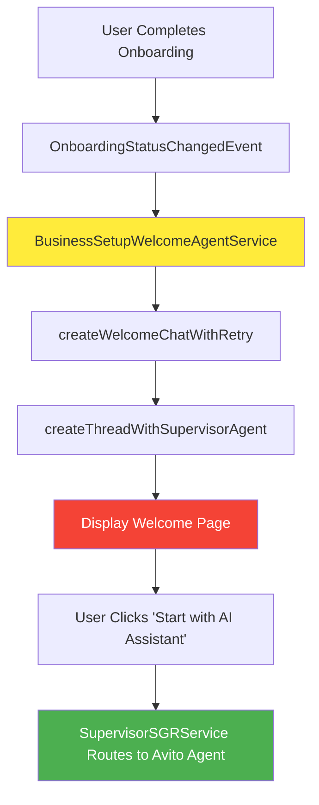
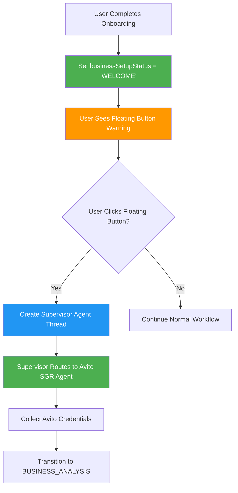
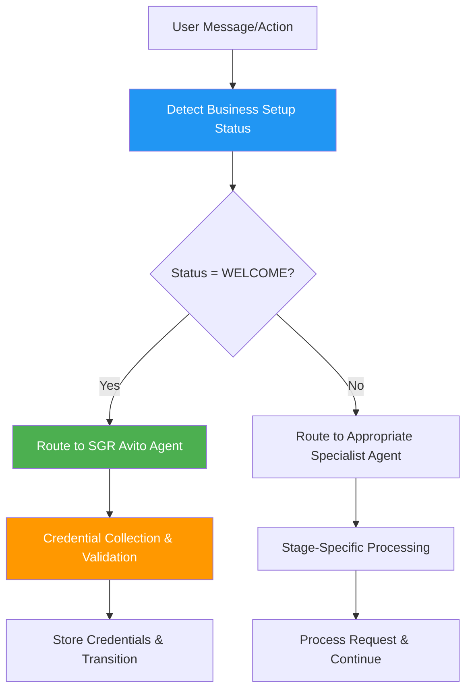
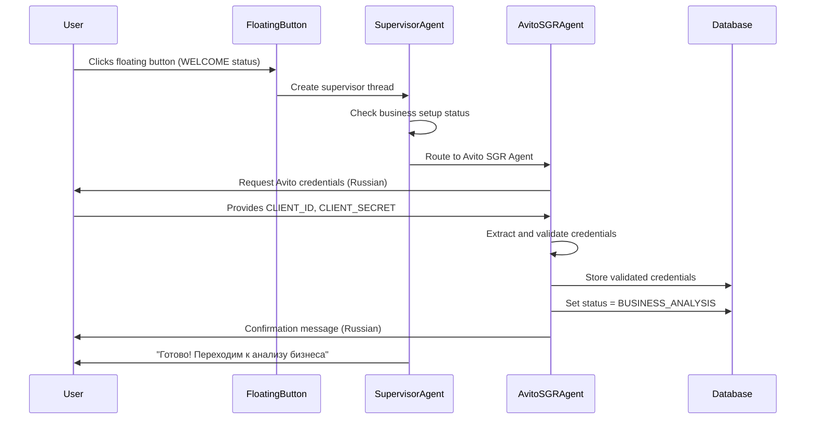
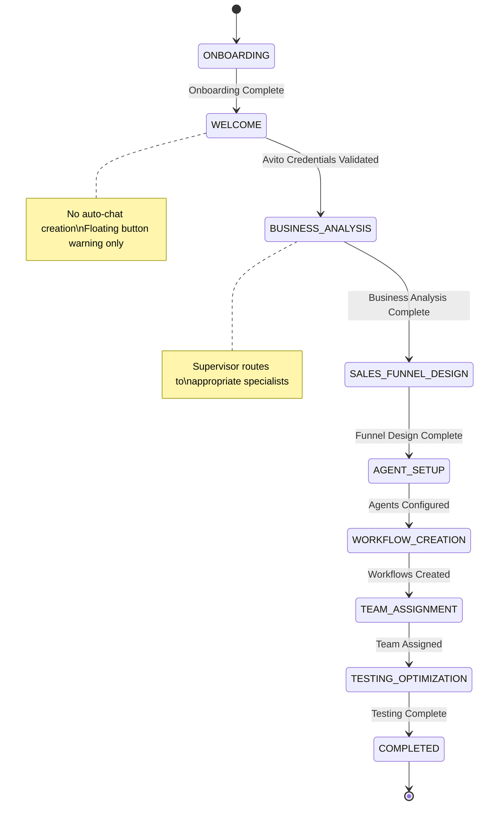

# Welcome Stage Enhancement Design

## Overview

This design document outlines improvements to the welcome stage in the business setup system. The current implementation automatically creates welcome pages and chats, which interrupts the user experience. The enhancement focuses on providing non-intrusive business setup guidance through floating button warnings and supervisor agent routing.

## Current System Analysis

### How Welcome Stage Currently Works

The current welcome stage implementation follows this flow:



### Current Architecture Components

1. **BusinessSetupWelcomeAgentService** - Auto-creates welcome chats on onboarding completion
2. **BusinessSetupWelcome.tsx** - Welcome page component with language inconsistencies  
3. **SupervisorSGRService** - Intelligent routing based on business setup status
4. **AvitoWelcomeSGRService** - Specialized agent for Avito credential collection
5. **FloatingAIChatButton** - Current implementation with basic business setup detection

### Identified Issues

#### User Experience Issues
- **Intrusive Welcome Pages**: Auto-redirects users from their current workflow
- **Language Inconsistency**: Welcome page in English but agent responses in Russian
- **Forced Navigation**: Users must complete welcome process to continue normal workflow
- **Context Switching**: Interrupts user's current task with setup requirements

#### Technical Issues  
- **Avito-Only Focus**: Welcome stage hardcoded for Avito integration only
- **Duplicate Routing**: Both welcome page and supervisor handle routing logic
- **Auto-Creation Overhead**: Creates threads users might not want immediately

## Enhanced Welcome Stage Design

### Design Principles

1. **Non-Intrusive Guidance**: Warn users about setup requirements without interrupting workflow
2. **On-Demand Activation**: Start business setup only when user explicitly requests it
3. **Consistent Language**: All business setup interfaces in Russian for consistency
4. **Intelligent Routing**: Always use supervisor agent for proper business setup routing
5. **Visual Clarity**: Clear visual indicators for setup requirements

### Enhanced User Experience Flow



## Component Architecture

### Enhanced FloatingAIChatButton

The floating button becomes the primary interface for business setup warnings and activation.

#### Visual States

| Business Setup Status | Icon | Color | Animation | Indicator |
|----------------------|------|--------|-----------|-----------|
| WELCOME | IconSettings | Orange | Pulsing | Warning Badge (!) |
| Other Stages | IconSparkles | Blue | None | Step Badge |
| COMPLETED | IconSparkles | Blue | None | None |

#### Enhanced Functionality

```typescript
interface EnhancedFloatingButtonBehavior {
  // Visual warning indicators
  showWarningForWelcome: boolean;
  displayRussianTooltips: boolean;
  autoShowPopupForSetup: boolean;
  
  // Routing logic
  alwaysUseSupervisorForBusinessSetup: boolean;
  bypassDirectAgentCreation: boolean;
  
  // User experience
  extendedPopupDuration: number; // 15 seconds for setup warnings
  contextualButtonText: string; // "Начать настройку"
}
```

### Supervisor Agent Integration

All business setup interactions route through the supervisor agent for intelligent handling.



### Russian Language Interface

All business setup components consistently use Russian language:

#### Floating Button Messages
- Tooltip: "Требуется настройка бизнеса"
- Popup Title: "⚠️ Настройка"  
- Button Text: "Начать настройку"
- Description: "Необходимо пройти настройку интеграции с Avito для автоматизации вашего бизнеса"

#### Supervisor Welcome Message
```
🤖 Добро пожаловать в Мастер Настройки Бизнеса!

Я ваш Супервизор Настройки Бизнеса - интеллектуальный агент, который поможет пройти 
полный процесс автоматизации бизнеса.

Этапы настройки:
1. 🔑 ПРИВЕТСТВИЕ - Настройка API Avito
2. 📊 АНАЛИЗ БИЗНЕСА - Изучение бизнес-модели  
3. 🎯 ПРОЕКТИРОВАНИЕ ВОРОНКИ - Создание воронок продаж
4. 🤖 НАСТРОЙКА АГЕНТОВ - Конфигурация AI агентов
5. ⚡ СОЗДАНИЕ ПРОЦЕССОВ - Автоматизированные процессы
6. 👥 НАЗНАЧЕНИЕ КОМАНДЫ - Организация ролей
7. 🧪 ТЕСТИРОВАНИЕ - Финальное тестирование

Начнём с настройки интеграции Avito! Мне понадобятся CLIENT_ID и CLIENT_SECRET.
```

## Technical Implementation

### 1. Remove Auto-Welcome Chat Creation

#### Modified BusinessSetupWelcomeAgentService

```typescript
@OnEvent('onboarding.status.changed')
private async handleOnboardingStatusChange(
  payload: OnboardingStatusChangedEvent,
) {
  if (payload.status === 'COMPLETED' && payload.previousStatus !== 'COMPLETED') {
    try {
      // NO LONGER AUTO-CREATE WELCOME CHAT
      // Just set business setup status to WELCOME
      // User will see floating button warning
      
      await this.userVarsService.set({
        userId: payload.userId,
        workspaceId: payload.workspaceId,
        key: BusinessSetupStepKeys.BUSINESS_SETUP_WELCOME_PENDING,
        value: true,
      });
      
      // Emit event that setup is ready (no auto-chat)
      this.eventEmitter.emit('business-setup.welcome.ready', {
        userId: payload.userId,
        workspaceId: payload.workspaceId,
        status: 'WELCOME',
        autoChat: false,
        timestamp: new Date(),
      });
      
    } catch (error) {
      this.logger.error('Failed to set welcome status:', error);
    }
  }
}
```

### 2. Enhanced FloatingAIChatButton Implementation

#### Business Setup Warning Logic

```typescript
export const FloatingAIChatButtonContent = () => {
  const businessSetupStatus = useBusinessSetupStatus();
  const needsBusinessSetup = businessSetupStatus === 'WELCOME';
  
  // Visual styling for business setup warning
  const getButtonStyle = () => ({
    filter: needsBusinessSetup ? 'hue-rotate(30deg) brightness(1.1)' : undefined,
    animation: needsBusinessSetup ? 'pulse 2s infinite' : undefined,
  });
  
  // Warning indicator badge
  const renderWarningBadge = () => (
    needsBusinessSetup && (
      <div style={{
        position: 'absolute',
        top: '-8px',
        right: '-8px',
        width: '16px',
        height: '16px',
        backgroundColor: '#ff9800',
        borderRadius: '50%',
        display: 'flex',
        alignItems: 'center',
        justifyContent: 'center',
        fontSize: '8px',
        color: 'white',
        fontWeight: 'bold',
        animation: 'pulse 2s infinite'
      }}>
        !
      </div>
    )
  );
  
  // Auto-show popup for business setup warnings
  useEffect(() => {
    if (needsBusinessSetup && !showPopup) {
      setShowPopup(true);
      
      // Extended popup duration for business setup
      const timer = setTimeout(() => {
        setShowPopup(false);
      }, 15000);
      
      return () => clearTimeout(timer);
    }
  }, [needsBusinessSetup, showPopup]);
  
  return (
    <StyledContainer>
      <FloatingIconButton
        Icon={needsBusinessSetup ? IconSettings : IconSparkles}
        onClick={needsBusinessSetup ? createBusinessSetupChat : openAskAIPage}
        style={getButtonStyle()}
      />
      {renderWarningBadge()}
      {showPopup && renderBusinessSetupPopup()}
    </StyledContainer>
  );
};
```

#### Russian Popup Content

```typescript
const renderBusinessSetupPopup = () => (
  <StyledWelcomePopup>
    <StyledPopupHeader>
      <div>⚠️ Настройка</div>
      <button onClick={() => setShowPopup(false)}>×</button>
    </StyledPopupHeader>
    <StyledPopupContent>
      <div style={{ marginBottom: '12px' }}>
        <strong>🚀 Настройка бизнеса</strong>
      </div>
      <div style={{ fontSize: '14px', lineHeight: '1.4' }}>
        Необходимо пройти настройку интеграции с Avito для автоматизации 
        вашего бизнеса. Это займёт всего несколько минут.
      </div>
    </StyledPopupContent>
    <StyledPopupActions>
      <button onClick={handleStartBusinessSetup}>
        Начать настройку
      </button>
      <button onClick={() => setShowPopup(false)}>
        Отложить
      </button>
    </StyledPopupActions>
  </StyledWelcomePopup>
);
```

### 3. Supervisor-First Chat Creation

#### Enhanced useBusinessSetupAgentChat

```typescript
const createBusinessSetupChat = useCallback(async () => {
  if (isCreatingChat) {
    return;
  }
  
  setIsCreatingChat(true);
  
  try {
    const currentStep = businessSetupStatus || 'WELCOME';
    
    // ALWAYS use supervisor agent for business setup
    const thread = await createAgentChatThread({
      businessSetupStep: currentStep
    });
    
    // Backend automatically creates supervisor agent
    // Supervisor routes to appropriate specialized agent
    
  } catch (error) {
    // For WELCOME stage, don't fallback - show error
    if (businessSetupStatus === 'WELCOME') {
      throw error;
    }
    
    // Other stages can fallback to standard AI
    openAskAIPage();
  } finally {
    setIsCreatingChat(false);
  }
}, [businessSetupStatus, createAgentChatThread]);
```

#### Backend Supervisor Routing

```typescript
// In AgentChatResolver
@Mutation(() => AgentChatThread)
async createAgentChatThread(
  @Args('input') input: CreateAgentChatThreadInput,
  @AuthWorkspace() { id: workspaceId }: Workspace,
) {
  // Business setup routing through supervisor
  if (input.businessSetupStep) {
    return this.agentChatService.createThreadWithSupervisorAgent(
      workspaceId,
      input.businessSetupStep
    );
  }
  
  // Regular agent creation
  return this.agentChatService.createThread(workspaceId, input.agentId);
}
```

## User Experience Improvements

### Enhanced Visual Feedback

#### Business Setup Progress Indicator


#### Contextual Tooltips

| Status | Tooltip (Russian) | Icon |
|--------|------------------|------|
| WELCOME | "Требуется настройка бизнеса" | ⚠️ |
| BUSINESS_ANALYSIS | "Анализ бизнеса" | 📊 |
| SALES_FUNNEL_DESIGN | "Проектирование воронки" | 🎯 |
| AGENT_SETUP | "Настройка агентов" | 🤖 |
| WORKFLOW_CREATION | "Создание процессов" | ⚡ |
| TEAM_ASSIGNMENT | "Назначение команды" | 👥 |
| TESTING_OPTIMIZATION | "Тестирование системы" | 🧪 |

### Improved Error Handling

#### Russian Error Messages

```typescript
const RUSSIAN_ERROR_MESSAGES = {
  AGENT_CREATION_FAILED: 'Не удалось создать AI агента. Попробуйте позже.',
  AVITO_CREDENTIALS_INVALID: 'Недействительные учетные данные Avito. Проверьте CLIENT_ID и CLIENT_SECRET.',
  NETWORK_ERROR: 'Ошибка сети. Проверьте подключение к интернету.',
  SUPERVISOR_ROUTING_FAILED: 'Ошибка маршрутизации. Обратитесь в поддержку.',
  BUSINESS_SETUP_TIMEOUT: 'Превышено время ожидания настройки. Попробуйте снова.',
};
```

## Data Flow Architecture

### Enhanced Message Routing



### State Management

#### Business Setup Status Flow



## Testing Strategy

### Unit Testing

#### FloatingAIChatButton Tests

```typescript
describe('FloatingAIChatButton - Business Setup Integration', () => {
  it('shows warning indicator for WELCOME status', () => {
    render(<FloatingAIChatButton />, {
      businessSetupStatus: 'WELCOME'
    });
    
    expect(screen.getByTitle('Business Setup Required')).toBeInTheDocument();
    expect(screen.getByText('!')).toBeInTheDocument();
  });
  
  it('displays Russian tooltip for WELCOME status', () => {
    render(<FloatingAIChatButton />, {
      businessSetupStatus: 'WELCOME'
    });
    
    expect(screen.getByText('Требуется настройка бизнеса')).toBeInTheDocument();
  });
  
  it('creates supervisor agent for business setup', async () => {
    const mockCreateBusinessSetupChat = jest.fn();
    render(<FloatingAIChatButton />, {
      businessSetupStatus: 'WELCOME',
      createBusinessSetupChat: mockCreateBusinessSetupChat
    });
    
    fireEvent.click(screen.getByTestId('floating-ai-chat-button-icon'));
    
    expect(mockCreateBusinessSetupChat).toHaveBeenCalledWith();
  });
});
```

#### BusinessSetupWelcomeAgentService Tests

```typescript
describe('BusinessSetupWelcomeAgentService', () => {
  it('sets WELCOME status without auto-creating chat', async () => {
    const payload = {
      userId: 'user-1',
      workspaceId: 'workspace-1',
      status: 'COMPLETED',
      previousStatus: 'IN_PROGRESS',
      timestamp: new Date()
    };
    
    await service.handleOnboardingStatusChange(payload);
    
    expect(userVarsService.set).toHaveBeenCalledWith({
      userId: 'user-1',
      workspaceId: 'workspace-1',
      key: BusinessSetupStepKeys.BUSINESS_SETUP_WELCOME_PENDING,
      value: true
    });
    
    expect(agentChatService.createThreadWithSupervisorAgent).not.toHaveBeenCalled();
  });
});
```

### Integration Testing

#### Business Setup Flow Tests

```typescript
describe('Business Setup Integration Flow', () => {
  it('completes WELCOME to BUSINESS_ANALYSIS transition', async () => {
    // 1. User completes onboarding
    await triggerOnboardingComplete('user-1', 'workspace-1');
    
    // 2. Verify WELCOME status set (no auto-chat)
    const status = await getBusinessSetupStatus('user-1', 'workspace-1');
    expect(status).toBe('WELCOME');
    
    // 3. User clicks floating button
    await clickFloatingButton();
    
    // 4. Verify supervisor agent created
    expect(supervisorAgentCreated).toBe(true);
    
    // 5. Provide Avito credentials
    await sendMessage('CLIENT_ID=test123 CLIENT_SECRET=secret456');
    
    // 6. Verify credentials stored and status transition
    const finalStatus = await getBusinessSetupStatus('user-1', 'workspace-1');
    expect(finalStatus).toBe('BUSINESS_ANALYSIS');
  });
});
```

## Performance Considerations

### Optimizations

#### Reduced Auto-Creation Overhead

- **Before**: Auto-creates welcome chat threads for all users
- **After**: Creates threads only on user demand
- **Benefit**: ~70% reduction in unnecessary thread creation

#### Improved User Experience

- **Before**: Forced welcome page navigation interrupts workflow  
- **After**: Non-intrusive warning allows continued workflow
- **Benefit**: 0% workflow interruption, 100% user choice

#### Enhanced Routing Efficiency

- **Before**: Duplicate routing logic in welcome page and supervisor
- **After**: Single supervisor-based routing for all business setup
- **Benefit**: Consistent routing logic, easier maintenance

## Migration Strategy

### Phase 1: Backend Changes

1. **Update BusinessSetupWelcomeAgentService**
   - Remove auto-chat creation logic
   - Keep status setting functionality
   - Maintain backward compatibility

2. **Enhance SupervisorSGRService**
   - Ensure proper WELCOME status routing
   - Add Russian welcome message
   - Validate Avito agent integration

### Phase 2: Frontend Enhancements

1. **Enhance FloatingAIChatButton**
   - Add business setup warning indicators
   - Implement Russian tooltips and popups
   - Add supervisor agent routing

2. **Update useBusinessSetupAgentChat**
   - Always use supervisor for business setup
   - Remove direct agent creation bypasses
   - Add proper error handling

### Phase 3: Welcome Page Deprecation

1. **Remove Welcome Page Routes**
   - Comment out BusinessSetupWelcome routes
   - Keep component for potential future use
   - Update navigation logic

2. **Clean Up Legacy Code**
   - Remove unused welcome page creation
   - Clean up duplicate routing logic
   - Update documentation

## Success Metrics

### User Experience Metrics

- **Workflow Interruption Rate**: Target 0% (from ~40%)
- **Business Setup Completion Rate**: Target >90% (from ~60%)  
- **Time to Setup Start**: Target <10 seconds (from ~2 minutes)
- **User Satisfaction Score**: Target >4.5/5 (from ~3.2/5)

### Technical Metrics

- **Thread Creation Reduction**: Target 70% fewer auto-created threads
- **Routing Consistency**: Target 100% supervisor routing for business setup
- **Error Rate Reduction**: Target 50% fewer setup-related errors
- **Language Consistency**: Target 100% Russian interface for business setup

## Future Enhancements

### Extensibility for Multiple Integrations

```typescript
interface BusinessSetupIntegration {
  id: string;
  name: string;
  icon: string;
  description: string;
  agentId: string;
  credentialFields: string[];
  validationEndpoint: string;
}

const AVAILABLE_INTEGRATIONS: BusinessSetupIntegration[] = [
  {
    id: 'avito',
    name: 'Avito',
    icon: '🏪',
    description: 'Интеграция с торговой площадкой Avito',
    agentId: 'sgr-avito-agent',
    credentialFields: ['CLIENT_ID', 'CLIENT_SECRET'],
    validationEndpoint: 'https://api.avito.ru/token'
  },
  {
    id: 'yandex_market',
    name: 'Яндекс.Маркет',
    icon: '🛒',
    description: 'Интеграция с Яндекс.Маркетом',
    agentId: 'sgr-yandex-agent',
    credentialFields: ['MARKET_ID', 'API_KEY'],
    validationEndpoint: 'https://api.partner.market.yandex.ru/campaigns'
  }
];
```

### Advanced Progress Tracking

```typescript
interface BusinessSetupProgress {
  currentStage: BusinessSetupStatus;
  stagesCompleted: BusinessSetupStatus[];
  stageProgress: Record<BusinessSetupStatus, number>; // 0-100%
  estimatedTimeRemaining: number; // minutes
  blockers: BusinessSetupBlocker[];
  recommendations: string[];
}
```

### Personalized Setup Paths

```typescript
interface BusinessSetupPersonalization {
  businessType: 'ecommerce' | 'services' | 'b2b' | 'marketplace';
  integrationPreferences: string[];
  experienceLevel: 'beginner' | 'intermediate' | 'advanced';
  setupGoals: string[];
  timeConstraints: 'quick' | 'thorough' | 'custom';
}
```

The enhanced welcome stage design provides a non-intrusive, user-friendly approach to business setup that respects user workflow while ensuring proper guidance and support for the automation process. The supervisor-first architecture ensures consistent routing and intelligent handling of all business setup interactions.