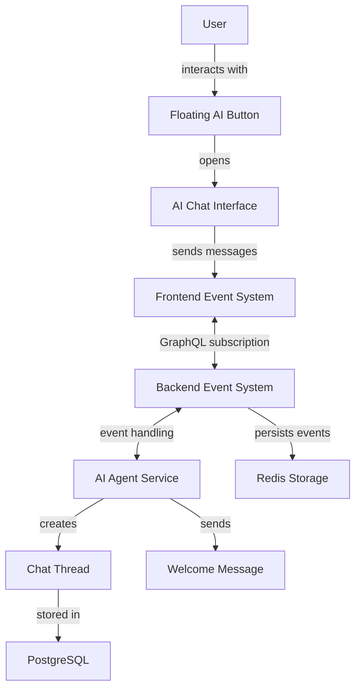
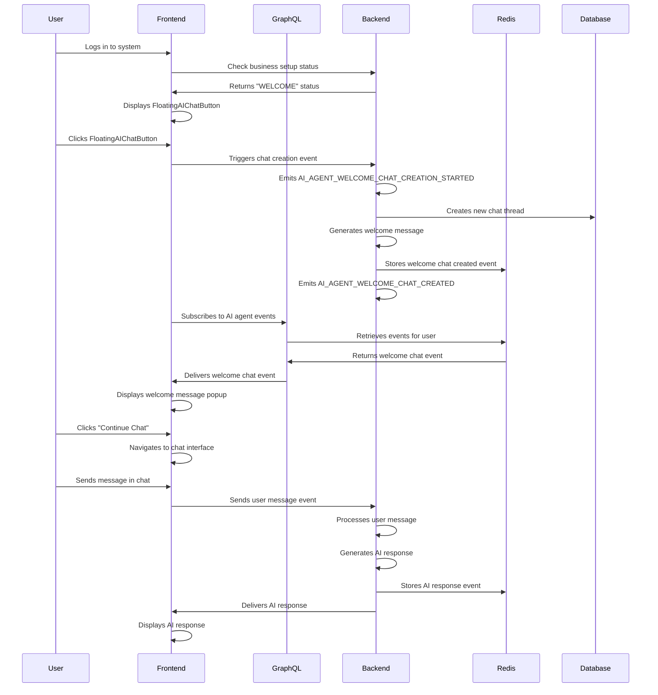
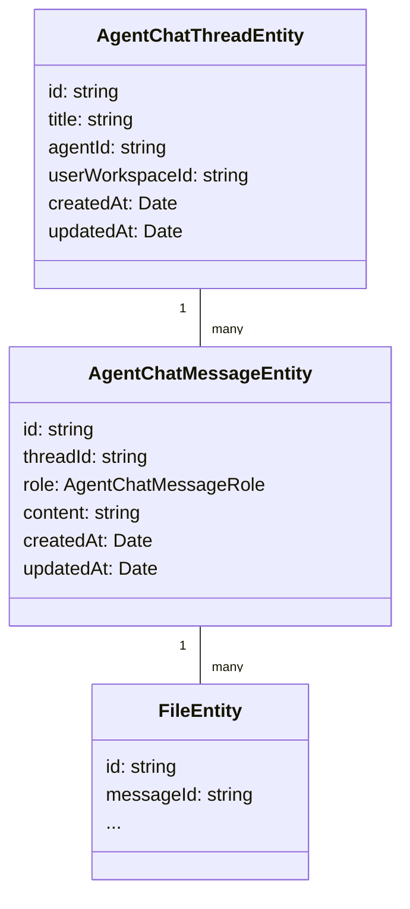
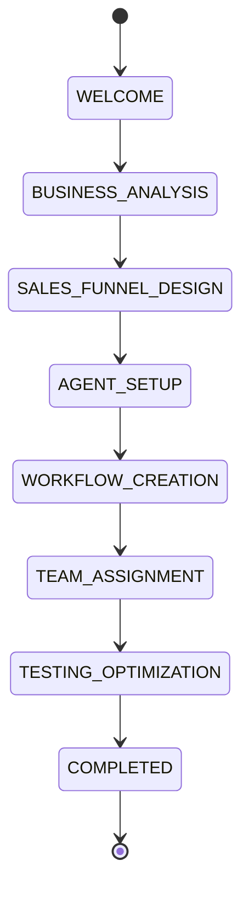

# Welcome Status Agent Communication Analysis

## 1. Overview

This document analyzes the current implementation of agent communication during the "Welcome" status in the Twenty CRM business setup process. The welcome status represents the initial step of the business automation setup wizard where users first interact with the AI assistant to begin configuring their CRM system.

## 2. Architecture

The communication between the user and the AI agent during the Welcome status follows an event-driven architecture with real-time messaging capabilities. The system is built on a full-stack implementation with clear separation between frontend and backend components.

### 2.1 System Components



### 2.2 Core Components

#### Frontend Components:
- **FloatingAIChatButton**: Visual entry point for initiating AI agent interaction
- **useWelcomeMessage**: Hook managing welcome message display and interaction
- **useFloatingAIChatButton**: Hook controlling button visibility and click behavior
- **useBusinessSetupStatus**: Hook determining current business setup stage
- **useAIAgentEventsSubscription**: Hook providing real-time event communication

#### Backend Services:
- **AIAgentEventsService**: Manages AI agent events storage and retrieval
- **AgentChatService**: Handles chat thread and message management
- **BusinessSetupService**: Controls business setup state and progression

## 3. Communication Flow

The welcome status agent communication follows this sequence:



### 3.1 Event Types

The system uses the following key events for welcome status communication:

| Event | Description |
|-------|-------------|
| `AI_AGENT_WELCOME_CHAT_CREATION_STARTED` | Triggered when welcome chat creation begins |
| `AI_AGENT_WELCOME_CHAT_CREATED` | Triggered when welcome chat is successfully created |
| `AI_AGENT_WELCOME_CHAT_CREATION_FAILED` | Triggered when welcome chat creation fails |
| `AI_AGENT_WELCOME_USER_MESSAGE_RECEIVED` | Triggered when user sends message in welcome chat |
| `AI_AGENT_WELCOME_AI_RESPONSE_GENERATED` | Triggered when AI generates response in welcome chat |
| `BUSINESS_SETUP_READY_FOR_NEXT_STEP` | Triggered when current setup step is completed |

## 4. Data Model

### 4.1 Agent Chat Thread



### 4.2 Business Setup Status

The business setup process follows a defined state machine with the following statuses:



## 5. Current Implementation Analysis

### 5.1 Frontend Implementation

The frontend implementation uses React hooks for state management and GraphQL subscriptions for real-time communication. Key components include:

#### 5.1.1 FloatingAIChatButton Component

This component serves as the entry point for AI agent interaction:
- Renders a floating button with an icon
- Shows tooltip based on business setup status
- Displays welcome popup when messages are received
- Includes error boundary for graceful failure handling

Current implementation in `FloatingAIChatButton.tsx`:
```typescript
export const FloatingAIChatButton = () => {
  return (
    <AIErrorBoundary
      fallback={
        <div style={{ /* error styling */ }}>
          AI Assistant temporarily unavailable
        </div>
      }
    >
      <FloatingAIChatButtonContent />
    </AIErrorBoundary>
  );
};
```

#### 5.1.2 Welcome Message Handling

The `useWelcomeMessage` hook manages the welcome message state and interaction:
- Subscribes to AI agent events via GraphQL
- Processes welcome chat created/failed events
- Manages popup display state
- Provides navigation to chat interface
- Handles error states and retry functionality

### 5.2 Backend Implementation

The backend implementation uses NestJS with EventEmitter2 for event handling and Redis for event persistence:

#### 5.2.1 AIAgentEventsService

This service manages AI agent events:
- Stores events in Redis with TTL
- Provides event retrieval for specific users
- Handles welcome chat creation events
- Provides event simulation for testing

#### 5.2.2 AgentChatService

This service manages chat threads and messages:
- Creates and retrieves chat threads
- Adds messages to threads
- Manages file attachments
- Generates thread titles

#### 5.2.3 BusinessSetupService

This service manages the business setup state:
- Retrieves current business setup status
- Sets new business setup status
- Clears existing statuses

### 5.3 Event Communication Bridge

The system uses GraphQL subscriptions to bridge events between backend and frontend:
- Backend emits events using EventEmitter2
- Events are stored in Redis with user context
- Frontend subscribes to events via GraphQL subscriptions
- Events are filtered by user and workspace ID

### 5.4 Welcome Agent Prompt Implementation

The current implementation in `business-setup-welcome-agent.service.ts` uses a complex business-focused welcome message:

```typescript
private async getPersonalizedWelcomePrompt(userId: string, workspaceId: string): Promise<string> {
  try {
    // Get user and workspace data for personalization
    const user = await this.userService.findById(userId);
    const workspace = await this.workspaceService.findById(workspaceId);

    const userName = user?.firstName || user?.email || 'User';
    const workspaceName = workspace?.displayName || 'Workspace';

    return `🎉 Welcome to Business Setup Wizard!

Hi ${userName}! I'm your AI assistant, and I'm here to help you automate your business and set up efficient processes for ${workspaceName}.

Let's start with a simple question: What type of business do you have?

I'll guide you through each step of the Business Setup process to help you:
• Design your sales funnel
• Set up email marketing automation
• Configure your CRM workflows
• Optimize your customer journey

Ready to get started? Just tell me about your business!`;
  } catch (error) {
    // Fallback to default prompt
    return `🎉 Welcome to Business Setup Wizard!

Hi there! I'm your AI assistant, and I'm here to help you automate your business and set up efficient processes.

Let's start with a simple question: What type of business do you have?

I'll guide you through each step of the Business Setup process to help you:
• Design your sales funnel
• Set up email marketing automation
• Configure your CRM workflows
• Optimize your customer journey

Ready to get started? Just tell me about your business!`;
  }
}
```

This needs to be simplified to just be a greeting bot as requested.

## 6. Current Implementation Issues

Based on the analysis of the current implementation, several observations can be made:

1. **Overly Complex Welcome Message**: The welcome message currently includes business setup guidance rather than just being a simple greeting bot. The current implementation contains business-focused content when it should simply act as a welcoming bot with minimal functionality.

2. **Limited Error Handling**: While there is basic error handling, it lacks comprehensive retry mechanisms with exponential backoff.

3. **Russian Comments in Code**: Several components contain Russian comments instead of standardized English comments:
   ```typescript
   // Показываем всплывающее сообщение при получении welcome сообщения
   useEffect(() => {
     if (welcomeMessage && !showPopup) {
       setShowPopup(true);
       
       // Автоматически скрываем через 10 секунд
       const timer = setTimeout(() => {
         setShowPopup(false);
       }, 10000);
   ```

4. **Test Business Status**: The `useBusinessSetupStatus` hook has a temporary implementation that always returns 'WELCOME' for testing purposes:
   ```typescript
   export const useBusinessSetupStatus = ():
     | BusinessSetupStatus
     | null
     | undefined => {
     const isLoggedIn = useIsLogged();
     // Временно возвращаем WELCOME для тестирования
     return isLoggedIn ? BUSINESS_SETUP_STATUS.WELCOME : undefined;
   };
   ```

5. **Event Message Consumption**: Events are marked as consumed after being retrieved, which might cause issues if the frontend needs to re-fetch events.

6. **Limited Thread State Management**: The chat thread status updates aren't fully reflected in real-time across all components.

7. **Missing Mobile Responsiveness**: While there is a check for mobile devices, the implementation might not be fully responsive.

8. **AI Model Selection**: The current implementation doesn't specify which AI model to use, defaulting to whatever is configured in the system. This needs to be changed to exclusively use google/gemini-2.5-flash via OpenRouter.

## 7. Testing Strategy

The current implementation includes basic testing:

- Unit tests for FloatingAIChatButton component
- Unit tests for welcome message parsing utilities
- Limited integration tests for event communication

Missing test coverage:
- End-to-end tests for welcome status flow
- Stress testing for concurrent event handling
- Network failure recovery testing
- Comprehensive UI state testing

## 8. Recommendations

1. **Simplify Welcome Agent Prompt and Enforce Gemini Model**: Replace the current business-focused welcome message with a simple greeting that clearly states it is just a welcome bot, and ensure all interactions exclusively use the google/gemini-2.5-flash model via OpenRouter. The recommended implementation would be:

```typescript
private async getPersonalizedWelcomePrompt(userId: string, workspaceId: string): Promise<string> {
  try {
    const user = await this.userService.findById(userId);
    const workspace = await this.workspaceService.findById(workspaceId);

    const userName = user?.firstName || user?.email || 'User';
    const workspaceName = workspace?.displayName || 'Workspace';

    return `👋 Hello ${userName}!

I AM A WELCOME BOT AND NOTHING MORE. I'm here to greet you in ${workspaceName}.

Have a great day!`;
  } catch (error) {
    return `👋 Hello there!

I AM A WELCOME BOT AND NOTHING MORE. I'm here to greet you.

Have a great day!`;
  }
}
```

2. **Enhance Error Handling**: Implement comprehensive error handling with retry mechanisms.

3. **Standardize Code Comments**: Replace Russian comments with English comments for consistency.

4. **Complete Business Setup Status Implementation**: Replace temporary testing code with proper business setup status retrieval.

5. **Improve Event Consumption Logic**: Revise event consumption strategy to allow for re-fetching events when needed.

6. **Enhance Thread State Management**: Implement more robust thread state tracking across components.

7. **Improve Mobile Responsiveness**: Enhance mobile support for all AI agent interaction components.

8. **Configure OpenRouter Integration**: Set up OpenRouter integration to use google/gemini-2.5-flash model exclusively for all welcome agent interactions.

## 9. Implementation Steps for Welcome Bot with Gemini 2.5 Flash Model

To convert the current welcome agent implementation to a simple greeting bot that exclusively uses the google/gemini-2.5-flash model via OpenRouter, the following steps are needed:

### 9.1 Update Welcome Agent Prompt

Modify the `getPersonalizedWelcomePrompt` method in `business-setup-welcome-agent.service.ts` to use the simplified prompt recommended in section 8.1.

### 9.2 Configure OpenRouter for Gemini 2.5 Flash

1. Configure the OpenRouter integration in environment variables:

```bash
# OpenAI-compatible API config for OpenRouter
OPENAI_COMPATIBLE_BASE_URL=https://openrouter.ai/api/v1
OPENAI_COMPATIBLE_API_KEY=your_openrouter_api_key_here
OPENAI_COMPATIBLE_MODEL_NAMES=google/gemini-2.5-flash
# Set as default model
DEFAULT_MODEL_ID=google/gemini-2.5-flash
```

2. Create a dedicated agent entity for the welcome bot with the Gemini model:

```typescript
// Create a specific welcome agent in the database
const welcomeAgent = await this.agentRepository.save({
  name: 'Welcome Greeting Bot',
  description: 'Simple greeting bot for welcome status',
  prompt: 'You are a simple greeting bot. You ONLY respond with greetings.',
  modelId: 'google/gemini-2.5-flash', // Force use of Gemini model
  workspaceId: workspaceId,
});
```

### 9.3 Update AI Agent Execution in Welcome Chat Creation

Modify the `createWelcomeChat` method to use the Gemini model exclusively:

```typescript
// Fetch or create a welcome agent with specific model
let welcomeAgent = await this.agentRepository.findOne({
  where: { name: 'Welcome Greeting Bot', workspaceId }
});

if (!welcomeAgent) {
  welcomeAgent = await this.agentRepository.save({
    name: 'Welcome Greeting Bot',
    description: 'Simple greeting bot for welcome status',
    prompt: 'You are a simple greeting bot. You ONLY respond with greetings.',
    modelId: 'google/gemini-2.5-flash', // Force use of Gemini model
    workspaceId,
  });
}

// Get personalized welcome prompt
const welcomePrompt = await this.getPersonalizedWelcomePrompt(userId, workspaceId);

// Send prompt to LLM using the specific agent with Gemini model
const aiResponse = await this.agentExecutionService.executeAgent({
  agent: welcomeAgent, // Use specific agent with Gemini model
  context: { 
    userId, 
    workspaceId, 
    threadId: thread.id,
    role: 'GREETING_BOT',
    modelId: 'google/gemini-2.5-flash' // Ensure this specific model is used
  },
  schema: {}, // Simple schema for welcome
  userPrompt: welcomePrompt,
});
```

### 9.4 Override Agent Execution Service to Force Gemini Model

Extend the `BusinessSetupWelcomeAgentService` to ensure all LLM interactions use Gemini:

```typescript
// Add a method to handle user messages that always uses Gemini
async handleUserMessage(threadId: string, userMessage: string): Promise<string> {
  try {
    // Force the use of Gemini model for all interactions
    const aiResponse = await this.agentExecutionService.streamChatResponse({
      threadId,
      userMessage,
      modelId: 'google/gemini-2.5-flash', // Force Gemini model
    });
    
    return aiResponse;
  } catch (error) {
    this.logger.error('Failed to process user message with Gemini model:', error);
    throw error;
  }
}
```

### 9.5 Update Frontend Popup Display

Update the `FloatingAIChatButtonContent` component to display an appropriate greeting message:

```typescript
// Modify popup title to reflect simple greeting bot
<StyledPopupHeader>
  <span>👋 Welcome Bot (Gemini)</span>
  <button onClick={() => setShowPopup(false)}>×</button>
</StyledPopupHeader>
```

### 9.6 Documentation and Comments

Update comments and documentation to reflect the use of Gemini model:

```typescript
/**
 * Creates a welcome chat using google/gemini-2.5-flash model exclusively via OpenRouter
 * This agent provides greeting messages and responds to all user interactions
 * using only the Gemini model
 */
private async createWelcomeChat(userId: string, workspaceId: string): Promise<void> {
  // Implementation...
}
```

These changes will ensure that the welcome agent functions solely as a greeting bot and exclusively uses the google/gemini-2.5-flash model via OpenRouter for all interactions.