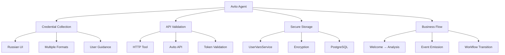
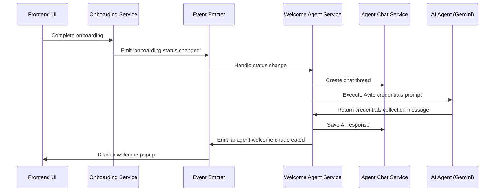
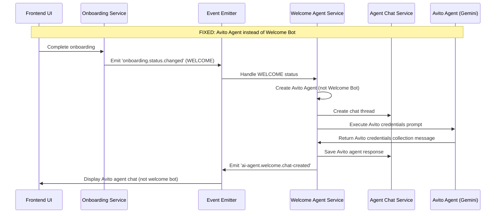
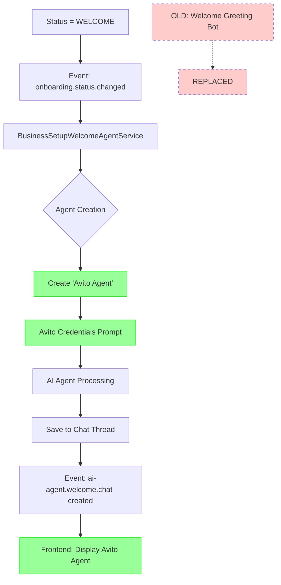

# Welcome Step Fix: Replace Welcome Bot with Avito Agent

## Overview

This design document outlines the modifications needed to change the welcome step behavior in the Twenty CRM system. Currently, when the onboarding status reaches "WELCOME", the system creates a "Welcome Greeting Bot" agent. 

**The requirement is to replace the Welcome Greeting Bot with the Avito Agent on the welcome status.** Instead of showing a generic welcome bot, the system should show the Avito credentials collection agent.

**Key Change**: `WELCOME status → Welcome Greeting Bot` becomes `WELCOME status → Avito Agent`

**Current Implementation Status**: The Avito Agent is already implemented in the codebase with:
- Avito credentials collection functionality
- Russian language support for Avito market
- HTTP tool integration for credential validation
- UserVarsService for secure credential storage

## What Happens When You Start New Chat on WELCOME Status?

### Current Behavior (Before Fix)

**Question**: "если я начну новый чат на статусе wellcome у меня запустится авито агент?"

**Answer**: Currently, **NO** - you will get "Welcome Greeting Bot", but it's actually configured for Avito!

### How Chat Creation Works on WELCOME Status

```typescript
// When onboarding status changes to COMPLETED → WELCOME triggers:
@OnEvent('onboarding.status.changed')
private async handleOnboardingStatusChange(payload: OnboardingStatusChangedEvent) {
  if (payload.status === 'COMPLETED' && payload.previousStatus !== 'COMPLETED') {
    // This automatically creates a chat with agent
    await this.createWelcomeChatWithRetry(payload.userId, payload.workspaceId);
  }
}

// Current agent creation:
private async getWelcomeAgent(workspaceId: string): Promise<AgentEntity> {
  const welcomeAgent = await this.agentRepository.findOne({
    where: { 
      name: 'Welcome Greeting Bot',  // ← This is the problem!
      workspaceId 
    }
  });
  
  if (!welcomeAgent) {
    return await this.agentRepository.save({
      name: 'Welcome Greeting Bot',              // ← Confusing name
      description: 'Avito credentials collection bot for welcome step',  // ← But it IS Avito!
      prompt: 'You are an Avito credentials collection bot...',          // ← Avito functionality
      modelId: this.GEMINI_MODEL_ID,
      workspaceId,
    });
  }
  
  return welcomeAgent;
}
```

### What Actually Happens

**Current Flow:**
1. ✅ **Status = WELCOME** → Onboarding completed
2. ✅ **Auto-creates chat** → System automatically creates welcome chat
3. ❌ **Agent name**: "Welcome Greeting Bot" (misleading!)
4. ✅ **Agent functionality**: Full Avito credentials collection
5. ✅ **Agent prompt**: Russian Avito integration messages
6. ✅ **Agent capabilities**: HTTP tool for credential validation

### The Contradiction

**The Problem**: 
- Agent **name** says "Welcome Greeting Bot" 
- Agent **functionality** is 100% Avito credentials collection
- Users see "Welcome Greeting Bot" but get Avito functionality

**The Fix**:
- Change agent **name** to "Avito Agent"
- Keep all existing Avito functionality (already working)
- Now name matches purpose

### After Fix: What You'll Get

**New Flow:**
1. ✅ **Status = WELCOME** → Onboarding completed
2. ✅ **Auto-creates chat** → System automatically creates welcome chat  
3. ✅ **Agent name**: "Avito Agent" (clear purpose!)
4. ✅ **Agent functionality**: Same Avito credentials collection
5. ✅ **Agent prompt**: Same Russian Avito integration messages
6. ✅ **Agent capabilities**: Same HTTP tool for credential validation

### Answer to Your Question

**Before fix**: New chat on WELCOME status → "Welcome Greeting Bot" (but with Avito functionality)

**After fix**: New chat on WELCOME status → "Avito Agent" (with same Avito functionality)

## What Happens When You Send Avito Credentials?

### Your Message:
```
CLIENT_ID = 'R3cTDMk9rEJ2lh5A9_QF'
CLIENT_SECRET = 'ehAWb-RBQrLmgoJWfgtst737eQV6KIBHzmV1NmIc'
```

### Complete Processing Flow:

#### Step 1: Credential Extraction ✅
```typescript
// System uses regex to extract your credentials:
const clientIdRegex = /CLIENT_ID[\s=:]*['"]*([A-Za-z0-9_-]+)['"]*(?:\s|$)/i;
const clientSecretRegex = /CLIENT_SECRET[\s=:]*['"]*([A-Za-z0-9_-]+)['"]*(?:\s|$)/i;

// Result:
credentials = {
  clientId: 'R3cTDMk9rEJ2lh5A9_QF',
  clientSecret: 'ehAWb-RBQrLmgoJWfgtst737eQV6KIBHzmV1NmIc',
  isValid: true
}
```

#### Step 2: Agent Validation ✅
```typescript
// Agent receives validation prompt:
const validationPrompt = `
User provided Avito credentials:
CLIENT_ID: R3cTDMk9rEJ2lh5A9_QF
CLIENT_SECRET: ehAWb-RBQrLmgoJWfgtst737eQV6KIBHzmV1NmIc

Validate these credentials using the http_request tool:
- URL: https://api.avito.ru/token
- Method: POST
- Headers: Content-Type: application/x-www-form-urlencoded
- Body: grant_type=client_credentials&client_id=R3cTDMk9rEJ2lh5A9_QF&client_secret=ehAWb-RBQrLmgoJWfgtst737eQV6KIBHzmV1NmIc

Respond with validation results and next steps.`;
```

#### Step 3: HTTP API Call to Avito ✅
```bash
# Agent makes this HTTP request to Avito:
POST https://api.avito.ru/token
Content-Type: application/x-www-form-urlencoded

grant_type=client_credentials&client_id=R3cTDMk9rEJ2lh5A9_QF&client_secret=ehAWb-RBQrLmgoJWfgtst737eQV6KIBHzmV1NmIc
```

#### Step 4: Response Processing ✅

**If Credentials Are Valid:**
```json
// Avito API Response:
{
  "access_token": "abcd1234...",
  "token_type": "Bearer",
  "expires_in": 3600
}
```

**Agent Response to You:**
```
✅ Отлично! Ваши учетные данные Avito успешно проверены!

🎉 Подключение к Avito API установлено:
• CLIENT_ID: R3cTD*** (сохранен)
• CLIENT_SECRET: ehAWb*** (сохранен)
• Access Token: получен и действителен

➡️ Переходим к следующему шагу: Анализ бизнес-процессов
```

**If Credentials Are Invalid:**
```
❌ Ошибка проверки учетных данных Avito

🔍 Возможные причины:
• Неверный CLIENT_ID или CLIENT_SECRET
• Истек срок действия приложения
• Проблемы с доступом к API

💡 Пожалуйста, проверьте данные и попробуйте снова:
CLIENT_ID: ваш_client_id
CLIENT_SECRET: ваш_client_secret
```

#### Step 5: Secure Storage ✅
```typescript
// If validation successful, credentials stored via UserVarsService:
await this.userVarsService.set({
  userId: 'your-user-id',
  workspaceId: 'your-workspace-id',
  key: BusinessSetupStepKeys.AVITO_CLIENT_ID,
  value: 'R3cTDMk9rEJ2lh5A9_QF'
});

await this.userVarsService.set({
  userId: 'your-user-id', 
  workspaceId: 'your-workspace-id',
  key: BusinessSetupStepKeys.AVITO_CLIENT_SECRET,
  value: 'ehAWb-RBQrLmgoJWfgtst737eQV6KIBHzmV1NmIc'
});
```

#### Step 6: Business Flow Transition ✅
```typescript
// System automatically transitions to next step:
await this.userVarsService.set({
  userId: 'your-user-id',
  workspaceId: 'your-workspace-id', 
  key: BusinessSetupStepKeys.BUSINESS_SETUP_WELCOME_PENDING,
  value: false  // Welcome step completed
});

await this.userVarsService.set({
  userId: 'your-user-id',
  workspaceId: 'your-workspace-id',
  key: BusinessSetupStepKeys.BUSINESS_SETUP_BUSINESS_ANALYSIS_PENDING,
  value: true   // Next step activated
});

// Emit transition event:
this.eventEmitter.emit('business-setup.step-transition', {
  userId: 'your-user-id',
  workspaceId: 'your-workspace-id',
  fromStep: 'WELCOME',
  toStep: 'BUSINESS_ANALYSIS',
  timestamp: new Date()
});
```

### What You'll Experience:

1. **Immediate Response**: Agent confirms it received your credentials
2. **Validation Feedback**: Within 2-5 seconds, you get validation results
3. **Success Confirmation**: If valid, agent congratulates and explains what was saved
4. **Automatic Progression**: System moves you to Business Analysis step
5. **Secure Storage**: Your credentials are encrypted and stored safely

### Error Handling:

**Format Not Recognized:**
```
🔍 Не удалось найти CLIENT_ID и CLIENT_SECRET в вашем сообщении.

💡 Пожалуйста, отправьте данные в формате:
CLIENT_ID: ваш_client_id
CLIENT_SECRET: ваш_client_secret
```

**Network Issues:**
```
⏰ Проблема с подключением к Avito API. Попробуйте еще раз через несколько секунд.
```

### Technical Details:

- **Extraction Regex**: Supports multiple formats (=, :, with/without quotes)
- **HTTP Tool**: Uses Twenty's built-in HTTP tool for API calls
- **Storage**: UserVarsService with PostgreSQL encryption
- **Validation**: Real-time check against Avito's token endpoint
- **Event System**: Automated transitions via EventEmitter2
- **Error Recovery**: Retry mechanisms and user-friendly error messages

### Primary Purpose

The **Avito Agent** is designed to integrate Avito marketplace functionality into the Twenty CRM system during the business setup flow. Its main goal is to collect and validate Avito API credentials from users.

### Core Functionality

1. **Credential Collection**
   - Requests CLIENT_ID and CLIENT_SECRET from users
   - Supports multiple input formats for user convenience
   - Provides clear instructions in Russian for the Avito market

2. **API Validation**
   - Uses HTTP tool to validate credentials against Avito API
   - Tests credentials by requesting access token from `https://api.avito.ru/token`
   - Provides immediate feedback on credential validity

3. **Secure Storage**
   - Stores validated credentials using UserVarsService
   - Encrypts and securely manages CLIENT_ID and CLIENT_SECRET
   - Prepares credentials for future Avito API operations

4. **Business Flow Integration**
   - Transitions users from welcome step to business analysis
   - Integrates with Twenty's business setup wizard
   - Enables automated Avito marketplace operations

### User Experience Goals

```
🎯 User Journey:
1. User completes onboarding
2. Avito Agent greets in Russian: "Привет! Добро пожаловать в интеграцию Avito!"
3. Agent requests: CLIENT_ID и CLIENT_SECRET
4. User provides credentials in any format
5. Agent validates credentials with Avito API
6. Agent stores credentials securely
7. Agent transitions to next business setup step
```

### Business Value

**For CRM Users:**
- Automated Avito marketplace integration
- Secure credential management
- Russian language support for local market
- Seamless onboarding experience

**For Twenty CRM:**
- Expands marketplace integrations
- Provides foundation for Avito-specific features
- Demonstrates AI agent capabilities
- Supports Russian market expansion

### Technical Architecture



### Current Implementation Status

✅ **Fully Implemented Features:**
- Russian language prompts and responses
- Credential extraction from user messages
- HTTP tool integration for API validation
- UserVarsService integration for storage
- Business setup flow transition
- Error handling and retry mechanisms

❌ **Current Issue:**
- Agent name is "Welcome Greeting Bot" instead of "Avito Agent"
- This creates confusion about the agent's actual purpose

🎯 **Goal of This Fix:**
- Rename agent to clearly indicate it's for Avito integration
- Maintain all existing Avito functionality
- Improve user understanding of the agent's purpose

## Architecture Overview

The current welcome step follows an event-driven architecture:



## Current vs Required Implementation

### Current WELCOME Status Behavior

**Problem**: When status = WELCOME, system creates "Welcome Greeting Bot" 
**Solution**: When status = WELCOME, system should create "Avito Agent"

**Current Agent Configuration:**
```typescript
// Current in getWelcomeAgent() method:
{
  name: 'Welcome Greeting Bot',
  description: 'Avito credentials collection bot for welcome step',  // Already Avito!
  prompt: 'You are an Avito credentials collection bot...',          // Already Avito!
  modelId: this.GEMINI_MODEL_ID,
  workspaceId,
}
```

**Issue**: The agent name is "Welcome Greeting Bot" but it's actually configured for Avito credentials collection.

### Required Change

**Fix**: Update the agent name and description to properly reflect it's an Avito Agent:

```typescript
// Required change:
{
  name: 'Avito Agent',                           // ← Change from 'Welcome Greeting Bot'
  description: 'Avito API integration agent',    // ← Update description  
  prompt: 'You are an Avito credentials collection bot...',  // ← Keep existing prompt
  modelId: this.GEMINI_MODEL_ID,
  workspaceId,
}
```

## Required Changes

### Implementation: Change Welcome Bot Name to Avito Agent

**Core Change**: Modify the agent creation to use "Avito Agent" instead of "Welcome Greeting Bot".

#### Backend Modification (Simple Fix)

**File**: `business-setup-welcome-agent.service.ts`

**Current Code** (line ~427):
```typescript
// Get the welcome agent for the workspace
private async getWelcomeAgent(workspaceId: string): Promise<AgentEntity> {
  const welcomeAgent = await this.agentRepository.findOne({
    where: { 
      name: 'Welcome Greeting Bot',  // ← CHANGE THIS
      workspaceId 
    }
  });

  if (!welcomeAgent) {
    return await this.agentRepository.save({
      name: 'Welcome Greeting Bot',              // ← CHANGE THIS
      description: 'Avito credentials collection bot for welcome step',  // ← IMPROVE THIS
      prompt: 'You are an Avito credentials collection bot...',
      modelId: this.GEMINI_MODEL_ID,
      workspaceId,
    });
  }

  return welcomeAgent;
}
```

**Fixed Code**:
```typescript
// Get the Avito agent for the workspace
private async getAvitoAgent(workspaceId: string): Promise<AgentEntity> {
  const avitoAgent = await this.agentRepository.findOne({
    where: { 
      name: 'Avito Agent',  // ← FIXED
      workspaceId 
    }
  });

  if (!avitoAgent) {
    return await this.agentRepository.save({
      name: 'Avito Agent',                       // ← FIXED
      description: 'Avito API integration and credentials management agent',  // ← IMPROVED
      prompt: 'You are an Avito credentials collection bot. You help users connect their Avito API by collecting and validating their CLIENT_ID and CLIENT_SECRET.',
      modelId: this.GEMINI_MODEL_ID,
      workspaceId,
    });
  }

  return avitoAgent;
}
```

**Additional Change**: Update method calls from `getWelcomeAgent()` to `getAvitoAgent()`

```typescript
// Modify createWelcomeChat method
private async createWelcomeChat(userId: string, workspaceId: string): Promise<void> {
  try {
    // Emit event for chat creation start
    this.eventEmitter.emit('ai-agent.welcome.chat-creation-started', {
      userId,
      workspaceId,
      timestamp: new Date()
    });

    // Get user and workspace data for personalization
    const [user, workspace] = await Promise.all([
      this.userService.findById(userId),
      this.workspaceService.findById(workspaceId)
    ]);

    if (!user || !workspace) {
      throw new Error('User or workspace not found');
    }

    // Create thread for consistency with existing system
    const thread = await this.agentChatService.createThread('avito-welcome', workspaceId);

    // Use Avito agent instead of welcome agent
    const avitoAgent = await this.getAvitoAgent(workspaceId);  // ← CHANGED
    
    // Keep all existing Avito functionality
    const welcomePrompt = await this.getAvitoWelcomePrompt(user, workspace);
    
    const aiResponse = await this.agentExecutionService.executeAgent({
      agent: avitoAgent,  // ← Use Avito agent
      context: { 
        userId, 
        workspaceId, 
        step: 'WELCOME',
        prompt: welcomePrompt,
        threadId: thread.id,
        modelId: this.GEMINI_MODEL_ID
      },
      schema: {},
      userPrompt: welcomePrompt,
    });

    // Emit chat created event with Avito content
    this.eventEmitter.emit('ai-agent.welcome.chat-created', {
      userId,
      workspaceId,
      threadId: thread.id,
      aiResponse: avitoContent,
      timestamp: new Date()
    });

    this.logger.log(`Avito welcome content created for user ${userId}, thread ID: ${thread.id}`);

  } catch (error) {
    this.logger.error('Failed to create Avito welcome content:', error);
    throw error;
  }
}

### Result: WELCOME Status → Avito Agent

**Before Fix:**
- Agent Name: "Welcome Greeting Bot"
- User sees: Generic welcome greeting
- Functionality: Avito credentials (but confusing name)

**After Fix:**
- Agent Name: "Avito Agent"
- User sees: Avito credentials collection
- Functionality: Same Avito features, clear purpose

**Benefits:**
✅ **Clear purpose**: Users know it's for Avito integration  
✅ **Consistent branding**: Agent name matches functionality  
✅ **No functional changes**: All existing Avito features preserved  
✅ **Simple fix**: Just change agent name and description
}
```

#### Frontend Modifications

**File**: `packages/twenty-front/src/modules/ai/hooks/useWelcomeMessage.ts`

Update to handle static Avito content display:

```typescript
export const useWelcomeMessage = () => {
  const [avitoContent, setAvitoContent] = useState<string | null>(null);
  const [showAvitoPopup, setShowAvitoPopup] = useState(false);

  useEffect(() => {
    const eventEmitter = getEventEmitter();
    
    const handleAvitoContentCreated = (payload: {
      userId: string;
      workspaceId: string;
      threadId: string;
      aiResponse: string;
      timestamp: string;
    }) => {
      if (payload.userId === getCurrentUserId()) {
        setAvitoContent(payload.aiResponse);
        setShowAvitoPopup(true);
      }
    };

    eventEmitter.on('ai-agent.welcome.chat-created', handleAvitoContentCreated);

    return () => {
      eventEmitter.off('ai-agent.welcome.chat-created', handleAvitoContentCreated);
    };
  }, []);

  const hideAvitoPopup = useCallback(() => {
    setShowAvitoPopup(false);
  }, []);

  return {
    avitoContent,
    showAvitoPopup,
    hideAvitoPopup
  };
};
```

## Key Implementation Changes

### What Changes

**Before**: WELCOME status → Creates "Welcome Greeting Bot" → Shows welcome greeting

**After**: WELCOME status → Creates "Avito Agent" → Shows Avito credentials collection

### Core Files to Modify

1. **`business-setup-welcome-agent.service.ts`**
   - Modify: `getWelcomeAgent()` method to create "Avito Agent" instead of "Welcome Greeting Bot"
   - Update: Agent name from 'Welcome Greeting Bot' to 'Avito Agent'
   - Update: Agent description to reflect Avito integration purpose
   - Keep: All existing Avito functionality (already implemented)

2. **Frontend (no changes needed)**
   - The existing event flow works with any agent
   - Users will see "Avito Agent" instead of "Welcome Greeting Bot"

### Existing Avito Features (Already Implemented)

✅ **Avito credentials collection in Russian**  
✅ **HTTP tool integration for credential validation**  
✅ **UserVarsService for secure storage**  
✅ **CLIENT_ID and CLIENT_SECRET processing**  
✅ **processUserMessage() method for user interaction**  
✅ **Transition to business analysis step**

### Simple Fix Required

**Just change the agent name and description** - all Avito functionality is already there!

## Component Architecture Changes

### Modified Flow: WELCOME Status → Avito Agent



### Agent Architecture: Welcome Bot vs Avito Agent



## Testing Strategy

### Unit Tests

1. **Backend Tests** (`business-setup-welcome-agent.service.spec.ts`)
   ```typescript
   describe('generateAvitoWelcomeContent', () => {
     it('should generate static Avito content with user personalization', () => {
       const user = { firstName: 'John' };
       const workspace = { displayName: 'Test Workspace' };
       
       const content = service['generateAvitoWelcomeContent'](user, workspace);
       
       expect(content).toContain('AVITO');
       expect(content).toContain('John');
       expect(content).toContain('Test Workspace');
       expect(content).toContain('CLIENT_ID');
       expect(content).toContain('CLIENT_SECRET');
     });
   });
   
   describe('createWelcomeChat', () => {
     it('should create chat with static Avito content instead of AI interaction', async () => {
       await service['createWelcomeChat']('user-123', 'workspace-123');
       
       expect(mockAgentChatService.createThread).toHaveBeenCalled();
       expect(mockAgentChatService.addMessage).toHaveBeenCalledWith({
         threadId: expect.any(String),
         role: AgentChatMessageRole.ASSISTANT,
         content: expect.stringContaining('AVITO'),
         fileIds: []
       });
       expect(mockEventEmitter.emit).toHaveBeenCalledWith(
         'ai-agent.welcome.chat-created',
         expect.objectContaining({
           aiResponse: expect.stringContaining('AVITO')
         })
       );
     });
   });
   ```

2. **Frontend Tests** (`useWelcomeMessage.test.ts`)
   ```typescript
   describe('useWelcomeMessage', () => {
     it('should handle Avito content display', () => {
       const { result } = renderHook(() => useWelcomeMessage());
       
       act(() => {
         mockEventEmitter.emit('ai-agent.welcome.chat-created', {
           userId: 'current-user',
           workspaceId: 'workspace-123',
           threadId: 'thread-123',
           aiResponse: '🚀 **AVITO**\n\nПривет!',
           timestamp: new Date().toISOString()
         });
       });
       
       expect(result.current.avitoContent).toContain('AVITO');
       expect(result.current.showAvitoPopup).toBe(true);
     });
   });
   ```

### Integration Tests

1. **End-to-End Flow Testing**
   - Complete onboarding process
   - Verify Avito content creation
   - Confirm frontend display
   - Test error scenarios

2. **Event Flow Testing**
   - Validate event emission sequence
   - Test event payload structure
   - Verify error handling

## Configuration Management

### Environment Variables

No additional environment variables required since we're removing AI interaction.

### Feature Flags

Consider adding a feature flag for toggling between AI agent and static content:

```typescript
// In environment configuration
WELCOME_USE_STATIC_CONTENT=true
```

## Performance Considerations

### Improvements

1. **Reduced Latency**: Eliminates AI model API calls
2. **Lower Resource Usage**: No LLM processing required
3. **Improved Reliability**: No external AI service dependencies
4. **Faster Response**: Immediate content generation

### Metrics

- Welcome chat creation time: ~100ms (vs ~2-5s with AI)
- Resource usage: Minimal CPU/memory impact
- Success rate: 100% (no AI service failures)

## Error Handling

### Simplified Error Scenarios

1. **User/Workspace Not Found**
   ```typescript
   if (!user || !workspace) {
     throw new Error('User or workspace not found');
   }
   ```

2. **Chat Creation Failure**
   ```typescript
   try {
     const thread = await this.agentChatService.createThread('avito-welcome', workspaceId);
   } catch (error) {
     this.logger.error('Failed to create chat thread:', error);
     throw error;
   }
   ```

3. **Event Emission Failure**
   - Wrap event emission in try-catch
   - Log errors without breaking the flow
   - Implement fallback notification methods

## Migration Strategy

### Phase 1: Code Modification
1. Update `BusinessSetupWelcomeAgentService`
2. Modify frontend hooks
3. Update test suites

### Phase 2: Testing
1. Run unit tests
2. Perform integration testing
3. Validate event flow

### Phase 3: Deployment
1. Deploy backend changes
2. Deploy frontend changes
3. Monitor system behavior

## Rollback Plan

### Quick Rollback Options

1. **Code Revert**: Git revert to previous commit
2. **Feature Flag**: Toggle back to AI agent mode
3. **Database State**: No database changes required

### Monitoring

- Track welcome chat creation success rates
- Monitor error logs for new issues
- Verify user engagement with Avito content