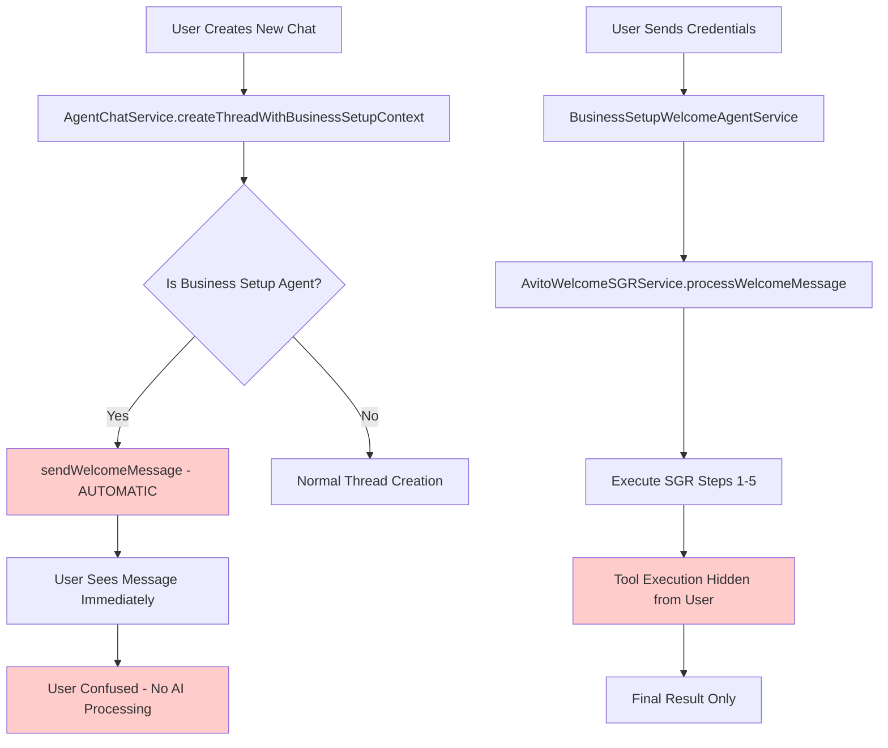
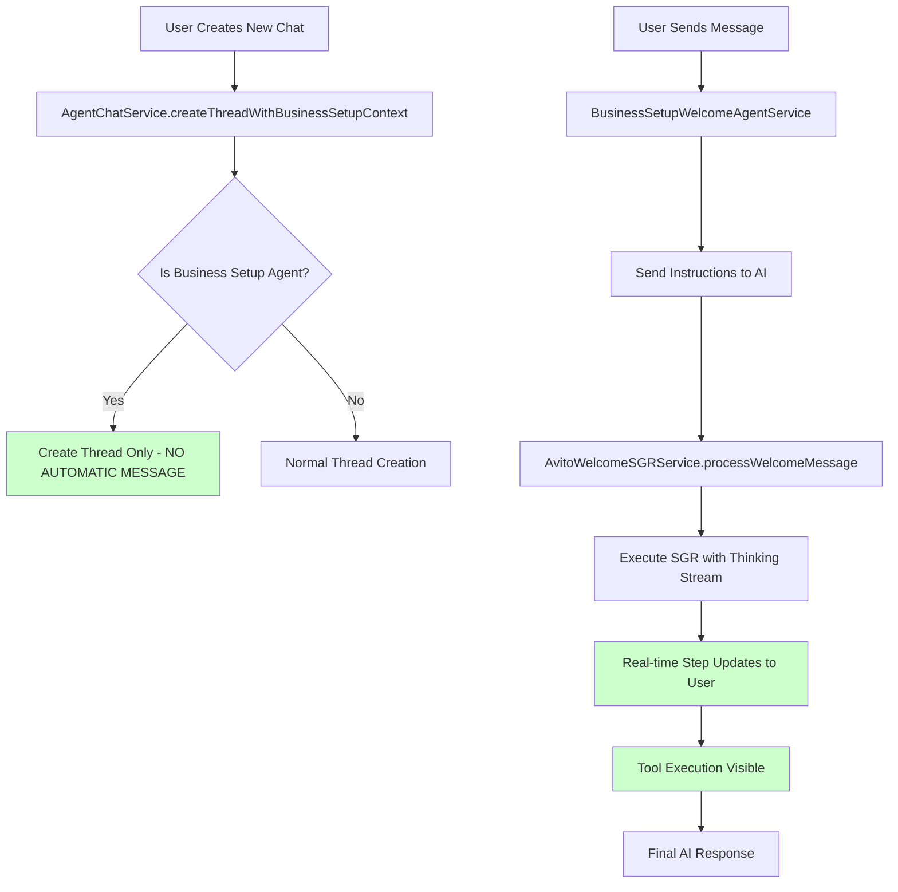
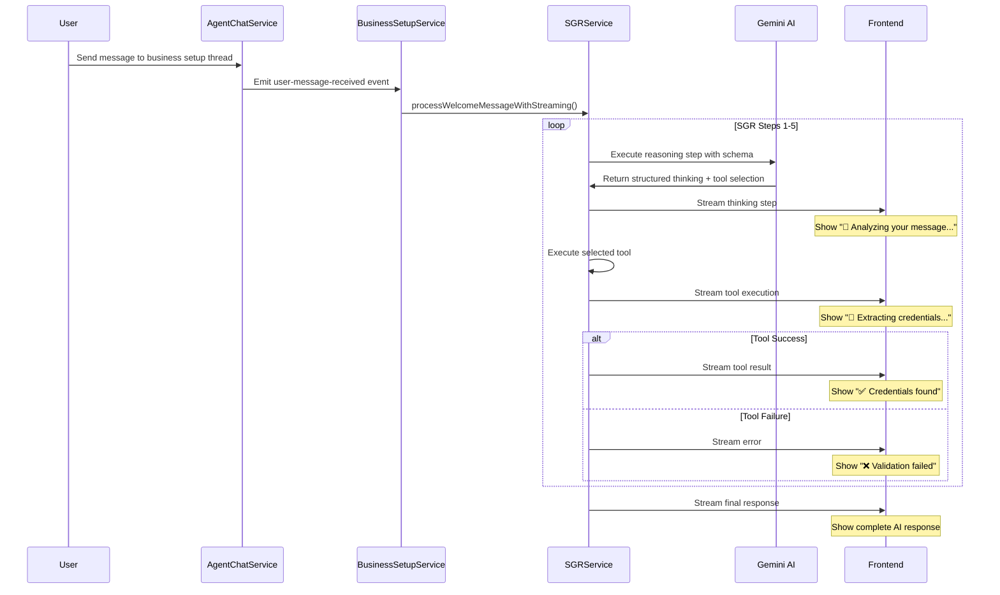

# Workflow Debug and SGR Enhancement Design

## Overview

This design addresses critical issues in the current Schema-Guided Reasoning (SGR) workflow implementation, focusing on improving user experience through transparent AI thinking processes and fixing automatic welcome message behavior. The system currently has two main problems: premature welcome message display when creating new chats and lack of visibility into SGR step execution.

## Architecture

### Current System Analysis

The current SGR implementation shows several architectural challenges:



### Enhanced Architecture



## Core Components

### 1. Enhanced SGR Service with Thinking Visibility

**File**: `avito-welcome-sgr.service.ts`

#### Current Implementation Issues
- SGR steps are executed in a loop without user visibility
- Only final result is shown to user
- No indication of AI reasoning process
- User cannot see tool execution progress

#### Enhanced Implementation
```typescript
interface SGRThinkingStep {
  stepNumber: number;
  currentState: string;
  plannedSteps: string[];
  selectedTool: string;
  toolExecution?: {
    status: 'in_progress' | 'completed' | 'failed';
    result?: any;
    error?: string;
  };
  timestamp: Date;
}

interface SGRStreamingResult {
  type: 'thinking' | 'tool_execution' | 'final_response';
  step?: SGRThinkingStep;
  content?: string;
  completed: boolean;
}
```

#### Key Methods Enhancement
```typescript
public async processWelcomeMessageWithStreaming(
  userMessage: string,
  userId: string,
  workspaceId: string,
  threadId: string
): Promise<AsyncGenerator<SGRStreamingResult>>

private async executeReasoningStepWithStreaming(
  context: WelcomeExecutionContext & { conversationLog: any[] }
): Promise<SGRStepResult>

private async streamThinkingToUser(
  threadId: string,
  step: SGRThinkingStep
): Promise<void>
```

### 2. Agent Chat Service Modifications

**File**: `agent-chat.service.ts`

#### Current Welcome Message Issue
```typescript
// PROBLEMATIC: Automatic welcome message on thread creation
private async sendWelcomeMessage(threadId: string, businessSetupStep: BusinessSetupStatus) {
  const welcomeContent = welcomeMessages[businessSetupStep];
  console.log('Sending welcome content:', welcomeContent.substring(0, 100) + '...');
  
  // This creates immediate message without AI processing
  const welcomeMessage = this.messageRepository.create({
    threadId,
    role: 'assistant' as AgentChatMessageRole,
    content: welcomeContent,
  });
  await this.messageRepository.save(welcomeMessage);
}
```

#### Enhanced Implementation
```typescript
async createThreadWithBusinessSetupContext(
  agentId: string,
  userWorkspaceId: string,
  businessSetupStep?: BusinessSetupStatus,
) {
  // Create thread without automatic welcome message
  const thread = this.threadRepository.create({
    agentId: effectiveAgentId,
    userWorkspaceId,
  });

  const savedThread = await this.threadRepository.save(thread);

  // REMOVED: Automatic welcome message sending
  // The first message should be AI response to user's input
  
  return savedThread;
}
```

### 3. Business Setup Welcome Agent Service

**File**: `business-setup-welcome-agent.service.ts`

#### Enhanced Message Processing
```typescript
@OnEvent('ai-agent.welcome.user-message-received')
private async processUserMessage(payload: WelcomeUserMessageReceivedEvent) {
  try {
    this.logger.log(`Processing user message in business setup thread ${payload.threadId}`);
    
    // NEW: Stream SGR thinking process to user
    const sgrStream = this.avitoWelcomeSGRService.processWelcomeMessageWithStreaming(
      payload.message,
      payload.userId,
      payload.workspaceId,
      payload.threadId
    );

    // Stream each step to user in real-time
    for await (const step of sgrStream) {
      await this.handleSGRStreamingStep(step, payload.threadId);
    }
    
  } catch (error) {
    this.logger.error('SGR processing failed, falling back to legacy method:', error);
    await this.processLegacyCredentialExtraction(payload);
  }
}

private async handleSGRStreamingStep(
  step: SGRStreamingResult, 
  threadId: string
): Promise<void> {
  switch (step.type) {
    case 'thinking':
      await this.sendThinkingMessage(threadId, step.step!);
      break;
    case 'tool_execution':
      await this.sendToolExecutionMessage(threadId, step.step!);
      break;
    case 'final_response':
      await this.sendFinalResponse(threadId, step.content!);
      break;
  }
}
```

### 4. Frontend Chat Integration

**File**: `useBusinessSetupAgentChat.ts`

#### Current Implementation Issue
```typescript
const createBusinessSetupChat = () => {
  const currentStep = businessSetupStatus || 'WELCOME';
  const welcomeMessage = getWelcomeMessageForStep(currentStep);
  
  // PROBLEMATIC: Opens with pre-defined message
  openAskAIPage(welcomeMessage);
};
```

#### Enhanced Implementation
```typescript
const createBusinessSetupChat = () => {
  const currentStep = businessSetupStatus || 'WELCOME';
  
  // NEW: Open chat without pre-filled message
  // Let user type their own message to trigger AI response
  openAskAIPage(); // No pre-filled message
};

// Remove automatic welcome messages - let AI respond naturally
const getWelcomeMessageForStep = (step: BusinessSetupStatus): string => {
  // This function should not be used for automatic messages
  // Only for reference or help text
  return '';
};
```

## Data Flow Enhancements

### 1. SGR Thinking Stream Protocol



### 2. Message Types for Thinking Visibility

```typescript
interface ThinkingMessage {
  type: 'thinking';
  content: string;
  stepNumber: number;
  currentState: string;
  plannedSteps: string[];
  timestamp: Date;
}

interface ToolExecutionMessage {
  type: 'tool_execution';
  toolName: string;
  status: 'starting' | 'in_progress' | 'completed' | 'failed';
  parameters?: any;
  result?: any;
  error?: string;
  timestamp: Date;
}

interface FinalResponseMessage {
  type: 'final_response';
  content: string;
  success: boolean;
  nextAction?: string;
  timestamp: Date;
}
```

## Implementation Strategy

### Phase 1: Remove Automatic Welcome Messages

1. **Modify AgentChatService.createThreadWithBusinessSetupContext()**
   - Remove automatic `sendWelcomeMessage()` call
   - Create empty thread ready for user input

2. **Update Frontend useBusinessSetupAgentChat**
   - Remove pre-filled welcome messages
   - Open empty chat interface

3. **Test chat creation flow**
   - Verify no automatic messages appear
   - Confirm user can type first message

### Phase 2: Implement SGR Thinking Streams

1. **Enhance AvitoWelcomeSGRService**
   - Add `processWelcomeMessageWithStreaming()` method
   - Implement `SGRStreamingResult` generator
   - Stream each reasoning step to frontend

2. **Create thinking message types**
   - Define message schemas for different step types
   - Implement real-time message streaming

3. **Update BusinessSetupWelcomeAgentService**
   - Handle streaming SGR results
   - Send incremental messages to chat

### Phase 3: Frontend Integration

1. **Enhance chat UI for thinking visibility**
   - Add loading states for SGR steps
   - Show step-by-step progress indicators
   - Display tool execution status

2. **Implement real-time message updates**
   - Stream SGR thinking steps to chat
   - Show progress during credential validation
   - Provide clear feedback on each step

### Phase 4: Testing and Validation

1. **End-to-end testing scenarios**
   - New chat creation (no automatic messages)
   - Credential processing with visible thinking
   - Error handling and fallback scenarios

2. **Performance optimization**
   - Optimize streaming performance
   - Ensure responsive UI during SGR execution
   - Handle concurrent user interactions

## Error Handling and Fallback

### SGR Processing Failures

```typescript
// If SGR streaming fails, fallback to legacy processing
try {
  const sgrStream = this.avitoWelcomeSGRService.processWelcomeMessageWithStreaming(
    payload.message, payload.userId, payload.workspaceId, payload.threadId
  );
  
  for await (const step of sgrStream) {
    await this.handleSGRStreamingStep(step, payload.threadId);
  }
} catch (error) {
  this.logger.error('SGR streaming failed, using legacy method:', error);
  await this.processLegacyCredentialExtraction(payload);
}
```

### Message Streaming Interruptions

```typescript
// Handle interruptions in message streaming
private async handleStreamingInterruption(
  threadId: string, 
  error: Error
): Promise<void> {
  await this.agentChatService.addMessage({
    threadId,
    role: AgentChatMessageRole.ASSISTANT,
    content: '⚠️ Обработка была прервана. Продолжаю анализ...',
    fileIds: []
  });
}
```

## Testing Strategy

### Unit Tests
- Test SGR streaming functionality
- Verify message type handling
- Test error scenarios and fallbacks

### Integration Tests
- End-to-end chat creation without automatic messages
- Complete SGR workflow with thinking visibility
- Cross-service event handling

### Manual Testing Scenarios
1. **Create new business setup chat**
   - Should open empty chat
   - No automatic welcome message
   - User can type first message

2. **Send credentials with SGR thinking**
   - Show step-by-step AI reasoning
   - Display tool execution progress
   - Present final response clearly

3. **Error handling**
   - Test invalid credentials
   - Test API failures
   - Verify graceful fallbacks

## Success Metrics

### User Experience Improvements
- ✅ No confusing automatic messages on chat creation
- ✅ Visible AI thinking process during credential processing
- ✅ Clear progress indication for SGR steps
- ✅ Better understanding of AI decision-making

### Technical Performance
- ✅ Streaming SGR steps without blocking
- ✅ Graceful fallback to legacy processing
- ✅ Maintained compatibility with existing workflows
- ✅ Real-time message delivery

## Security Considerations

### Credential Protection
- Ensure streaming doesn't expose sensitive data
- Maintain encryption during SGR processing
- Audit trail for all credential operations

### Message Integrity
- Validate all streaming message types
- Prevent message spoofing or injection
- Ensure proper authentication for stream access