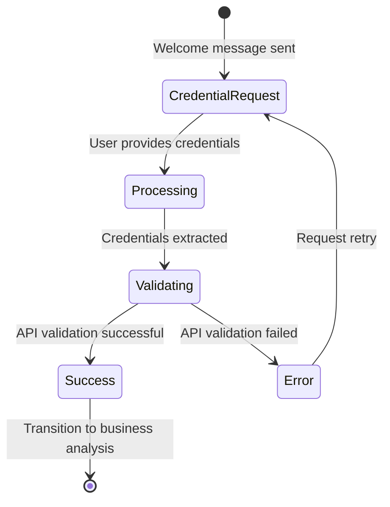

# Avito Welcome Agent Implementation Plan

## Overview

This document provides a comprehensive, actionable implementation plan for redesigning Twenty CRM's existing Welcome Agent to collect and manage Avito API credentials during the business setup flow. The implementation transforms the generic welcome greeting into an Avito-specific credential collection system.

## Implementation Checklist

### 📋 PHASE 1: Backend Data Structure Extensions

**Objective**: Extend existing `BusinessSetupStepKeys` enum and type mapping to support Avito credentials storage.

#### ✅ Task 1.1: Update BusinessSetupStepKeys enum
**File**: `packages/twenty-server/src/engine/core-modules/business-setup/business-setup.service.ts`

**Action**: Add new enum values for Avito credentials
```typescript
export enum BusinessSetupStepKeys {
  // Existing keys
  BUSINESS_SETUP_WELCOME_PENDING = 'BUSINESS_SETUP_WELCOME_PENDING',
  BUSINESS_SETUP_BUSINESS_ANALYSIS_PENDING = 'BUSINESS_SETUP_BUSINESS_ANALYSIS_PENDING',
  BUSINESS_SETUP_SALES_FUNNEL_DESIGN_PENDING = 'BUSINESS_SETUP_SALES_FUNNEL_DESIGN_PENDING',
  BUSINESS_SETUP_AGENT_SETUP_PENDING = 'BUSINESS_SETUP_AGENT_SETUP_PENDING',
  BUSINESS_SETUP_WORKFLOW_CREATION_PENDING = 'BUSINESS_SETUP_WORKFLOW_CREATION_PENDING',
  BUSINESS_SETUP_TEAM_ASSIGNMENT_PENDING = 'BUSINESS_SETUP_TEAM_ASSIGNMENT_PENDING',
  BUSINESS_SETUP_TESTING_OPTIMIZATION_PENDING = 'BUSINESS_SETUP_TESTING_OPTIMIZATION_PENDING',
  
  // NEW: Avito-specific keys
  AVITO_CLIENT_ID = 'AVITO_CLIENT_ID',
  AVITO_CLIENT_SECRET = 'AVITO_CLIENT_SECRET',
  AVITO_ACCESS_TOKEN = 'AVITO_ACCESS_TOKEN',
  AVITO_TOKEN_EXPIRES_AT = 'AVITO_TOKEN_EXPIRES_AT',
}
```

#### ✅ Task 1.2: Update BusinessSetupKeyValueTypeMap type
**File**: Same file as above

**Action**: Add string mappings for new Avito credential keys
```typescript
export type BusinessSetupKeyValueTypeMap = {
  // Existing mappings
  [BusinessSetupStepKeys.BUSINESS_SETUP_WELCOME_PENDING]: boolean;
  [BusinessSetupStepKeys.BUSINESS_SETUP_BUSINESS_ANALYSIS_PENDING]: boolean;
  [BusinessSetupStepKeys.BUSINESS_SETUP_SALES_FUNNEL_DESIGN_PENDING]: boolean;
  [BusinessSetupStepKeys.BUSINESS_SETUP_AGENT_SETUP_PENDING]: boolean;
  [BusinessSetupStepKeys.BUSINESS_SETUP_WORKFLOW_CREATION_PENDING]: boolean;
  [BusinessSetupStepKeys.BUSINESS_SETUP_TEAM_ASSIGNMENT_PENDING]: boolean;
  [BusinessSetupStepKeys.BUSINESS_SETUP_TESTING_OPTIMIZATION_PENDING]: boolean;
  
  // NEW: Avito mappings
  [BusinessSetupStepKeys.AVITO_CLIENT_ID]: string;
  [BusinessSetupStepKeys.AVITO_CLIENT_SECRET]: string;
  [BusinessSetupStepKeys.AVITO_ACCESS_TOKEN]: string;
  [BusinessSetupStepKeys.AVITO_TOKEN_EXPIRES_AT]: string;
};
```

### 🤖 PHASE 2: Welcome Agent Service Modification

**Objective**: Transform existing welcome agent to collect Avito credentials using agent tools for validation.

#### ✅ Task 2.1: Inject UserVarsService dependency
**File**: `packages/twenty-server/src/engine/core-modules/business-setup/services/business-setup-welcome-agent.service.ts`

**Action**: Add UserVarsService to constructor
```typescript
constructor(
  private readonly eventEmitter: EventEmitter2,
  private readonly agentExecutionService: AgentExecutionService,
  private readonly agentChatService: AgentChatService,
  private readonly userService: UserService,
  private readonly workspaceService: WorkspaceService,
  // NEW: Add UserVarsService dependency
  private readonly userVarsService: UserVarsService<BusinessSetupKeyValueTypeMap>,
  @InjectRepository(AgentEntity, 'core')
  private readonly agentRepository: Repository<AgentEntity>,
) {}
```

#### ✅ Task 2.2: Replace getPersonalizedWelcomePrompt with getAvitoWelcomePrompt
**File**: Same file as above

**Action**: Replace the existing prompt method with Avito-specific Russian prompt
```typescript
private async getAvitoWelcomePrompt(user: User, workspace: Workspace): Promise<string> {
  return `
Привет, ${user.firstName || 'пользователь'}! 👋

Добро пожаловать в настройку интеграции с Avito для ${workspace.displayName}!

Для подключения к Avito API мне нужны ваши уникальные учетные данные:

📋 **Что мне нужно:**
• CLIENT_ID - идентификатор вашего приложения
• CLIENT_SECRET - секретный ключ

🔍 **Где найти эти данные:**
1. Войдите в ваш аккаунт на Avito
2. Перейдите в раздел "API для разработчиков"
3. Скопируйте CLIENT_ID и CLIENT_SECRET

💡 **Как отправить:**
Просто напишите мне в любом удобном формате, например:

CLIENT_ID = 'R3cTDMk9rEJ2lh5A9_QF'
CLIENT_SECRET = 'ehAWb-RBQrLmgoJWfgtst737eQV6KIBHzmV1NmIc'

Или просто:
CLIENT_ID: ваш_id
CLIENT_SECRET: ваш_secret

Я автоматически извлеку данные и проверю их работоспособность! 🚀

TOOL USAGE INSTRUCTIONS:
When user provides credentials:
1. Extract CLIENT_ID and CLIENT_SECRET from their message
2. Use http_request tool to validate credentials:
   - URL: https://api.avito.ru/token
   - Method: POST
   - Headers: Content-Type: application/x-www-form-urlencoded
   - Body: grant_type=client_credentials&client_id=EXTRACTED_ID&client_secret=EXTRACTED_SECRET
3. If successful (status 200), store credentials and congratulate user
4. If failed, explain the error and ask to retry
5. Once validated, transition to next business setup step
  `;
}
```

#### ✅ Task 2.3: Create extractCredentialsFromMessage method
**File**: Same file as above

**Action**: Implement regex-based credential extraction
```typescript
private extractCredentialsFromMessage(message: string): CredentialsExtractionResult {
  // Support multiple formats: CLIENT_ID = 'value', CLIENT_ID: value, CLIENT_ID=value
  const clientIdRegex = /CLIENT_ID[\s=:]*['"]?([A-Za-z0-9_-]+)['"]?/i;
  const clientSecretRegex = /CLIENT_SECRET[\s=:]*['"]?([A-Za-z0-9_-]+)['"]?/i;
  
  const clientIdMatch = message.match(clientIdRegex);
  const clientSecretMatch = message.match(clientSecretRegex);
  
  return {
    clientId: clientIdMatch ? clientIdMatch[1] : null,
    clientSecret: clientSecretMatch ? clientSecretMatch[1] : null,
    isValid: !!(clientIdMatch && clientSecretMatch)
  };
}
```

#### ✅ Task 2.4: Implement processUserMessage method
**File**: Same file as above

**Action**: Handle credential processing and validation flow via agent tools
```typescript
async processUserMessage(threadId: string, message: string, workspaceId: string, userId: string) {
  try {
    // Extract credentials from user message
    const credentials = this.extractCredentialsFromMessage(message);
    
    if (credentials.isValid) {
      // Agent uses HTTP tool to validate credentials automatically
      const validationPrompt = `
User provided Avito credentials:
CLIENT_ID: ${credentials.clientId}
CLIENT_SECRET: ${credentials.clientSecret}

Validate these credentials using the http_request tool:
- URL: https://api.avito.ru/token
- Method: POST
- Headers: Content-Type: application/x-www-form-urlencoded
- Body: grant_type=client_credentials&client_id=${credentials.clientId}&client_secret=${credentials.clientSecret}

Respond with validation results and next steps.`;
      
      // Execute agent with HTTP tool for validation
      const agentResponse = await this.agentExecutionService.executeAgent({
        agent: await this.getWelcomeAgent(workspaceId),
        context: {
          workspaceId,
          userId,
          threadId,
          prompt: validationPrompt
        },
        schema: {},
        userPrompt: validationPrompt
      });
      
      await this.handleValidationResponse(agentResponse, credentials, workspaceId, userId, threadId);
      
    } else {
      // Request credentials again with helpful message
      const retryMessage = `🔍 Не удалось найти CLIENT_ID и CLIENT_SECRET в вашем сообщении.

💡 Пожалуйста, отправьте данные в формате:
CLIENT_ID: ваш_client_id
CLIENT_SECRET: ваш_client_secret`;
      
      await this.agentChatService.addMessage({
        threadId,
        role: AgentChatMessageRole.ASSISTANT,
        content: retryMessage,
        fileIds: []
      });
    }
  } catch (error) {
    this.logger.error('Error processing user message:', error);
  }
}
```

#### ✅ Task 2.5: Create handleValidationResponse method
**File**: Same file as above

**Action**: Process agent tool execution results and determine validation success/failure
```typescript
private async handleValidationResponse(
  agentResponse: any, 
  credentials: CredentialsExtractionResult, 
  workspaceId: string, 
  userId: string, 
  threadId: string
) {
  // Check if the agent's response indicates successful validation
  const responseText = agentResponse.result?.response || agentResponse.text;
  const isValidationSuccessful = this.parseValidationResult(responseText);
  
  if (isValidationSuccessful) {
    // Store credentials using UserVarsService
    await this.storeAvitoCredentials(workspaceId, userId, {
      clientId: credentials.clientId,
      clientSecret: credentials.clientSecret
    });
    
    await this.transitionToBusinessAnalysis(workspaceId, userId);
    
  } else {
    this.logger.warn(`Avito credentials validation failed for workspace ${workspaceId}`);
  }
}

private parseValidationResult(agentResponse: string): boolean {
  // Parse the agent's response to determine if validation was successful
  const successIndicators = [
    'access_token',
    'успешно',
    'status":200',
    'successfully',
    'validated'
  ];
  
  const errorIndicators = [
    'error',
    'failed',
    'invalid',
    'unauthorized',
    'status":400',
    'status":401'
  ];
  
  const hasSuccess = successIndicators.some(indicator => 
    agentResponse.toLowerCase().includes(indicator)
  );
  
  const hasError = errorIndicators.some(indicator => 
    agentResponse.toLowerCase().includes(indicator)
  );
  
  return hasSuccess && !hasError;
}
```

#### ✅ Task 2.6: Implement storeAvitoCredentials method
**File**: Same file as above

**Action**: Use UserVarsService to securely store validated credentials
```typescript
private async storeAvitoCredentials(
  workspaceId: string, 
  userId: string, 
  credentials: { clientId: string; clientSecret: string }
) {
  // Store using existing UserVarsService
  await Promise.all([
    this.userVarsService.set({
      userId,
      workspaceId,
      key: BusinessSetupStepKeys.AVITO_CLIENT_ID,
      value: credentials.clientId
    }),
    this.userVarsService.set({
      userId,
      workspaceId,
      key: BusinessSetupStepKeys.AVITO_CLIENT_SECRET,
      value: credentials.clientSecret
    })
  ]);
}
```

#### ✅ Task 2.7: Create transitionToBusinessAnalysis method
**File**: Same file as above

**Action**: Mark welcome step complete and set business analysis pending
```typescript
private async transitionToBusinessAnalysis(workspaceId: string, userId: string) {
  // Mark welcome step as completed and transition to business analysis
  await this.userVarsService.set({
    userId,
    workspaceId,
    key: BusinessSetupStepKeys.BUSINESS_SETUP_WELCOME_PENDING,
    value: false
  });
  
  await this.userVarsService.set({
    userId,
    workspaceId,
    key: BusinessSetupStepKeys.BUSINESS_SETUP_BUSINESS_ANALYSIS_PENDING,
    value: true
  });
  
  // Emit transition event
  this.eventEmitter.emit('business-setup.step-transition', {
    userId,
    workspaceId,
    fromStep: 'WELCOME',
    toStep: 'BUSINESS_ANALYSIS',
    timestamp: new Date()
  });
}
```

### 📝 PHASE 3: TypeScript Type Definitions

**Objective**: Create type interfaces for Avito integration.

#### ✅ Task 3.1: Create interfaces for Avito integration
**File**: `packages/twenty-server/src/engine/core-modules/business-setup/types/avito.types.ts` (new file)

**Action**: Define TypeScript interfaces
```typescript
export interface AvitoCredentials {
  clientId: string;
  clientSecret: string;
}

export interface AvitoTokenResponse {
  access_token: string;
  token_type: string;
  expires_in: number;
}

export interface CredentialsExtractionResult {
  clientId: string | null;
  clientSecret: string | null;
  isValid: boolean;
}

export interface ValidationResult {
  success: boolean;
  accessToken?: string;
  expiresIn?: number;
  error?: string;
}
```

### ⚙️ PHASE 4: Environment Configuration

**Objective**: Add Avito API configuration variables.

#### ✅ Task 4.1: Add Avito environment variables
**File**: `packages/twenty-server/.env`

**Action**: Add new environment variables
```bash
# Avito API Configuration
AVITO_TOKEN_URL=https://api.avito.ru/token
AVITO_API_TIMEOUT=30000
AVITO_MAX_RETRY_ATTEMPTS=3
```

#### ✅ Task 4.2: Extend EnvironmentService
**File**: `packages/twenty-server/src/engine/core-modules/environment/environment.service.ts`

**Action**: Add avito configuration getter
```typescript
export interface AvitoConfig {
  tokenUrl: string;
  apiTimeout: number;
  maxRetryAttempts: number;
}

// In EnvironmentService class
get avito(): AvitoConfig {
  return {
    tokenUrl: this.get('AVITO_TOKEN_URL') || 'https://api.avito.ru/token',
    apiTimeout: parseInt(this.get('AVITO_API_TIMEOUT') || '30000'),
    maxRetryAttempts: parseInt(this.get('AVITO_MAX_RETRY_ATTEMPTS') || '3')
  };
}
```

### 🌐 PHASE 5: Frontend Integration

**Objective**: Update React components for Avito-specific messaging.

#### ✅ Task 5.1: Update BusinessSetupEventProvider
**File**: `packages/twenty-front/src/modules/ai/providers/BusinessSetupEventProvider.tsx`

**Action**: Show Avito-specific welcome message
```typescript
// Update welcome message processing
const lastWelcomeMessage = subscriptions.lastWelcomeeChatEvent?.status === 'CHAT_CREATED' 
  ? '🎉 Настройка интеграции Avito начинается! Нажмите, чтобы продолжить.' 
  : null;
```

#### ✅ Task 5.2: Modify useBusinessSetupAgentChat hook
**File**: `packages/twenty-front/src/modules/business-setup/hooks/useBusinessSetupAgentChat.ts`

**Action**: Include Avito credential collection message for WELCOME step
```typescript
const getWelcomeMessageForStep = (step: BusinessSetupStatus): string => {
  const messages = {
    WELCOME: "🚀 Настройка интеграции Avito! Мне нужны ваши CLIENT_ID и CLIENT_SECRET для подключения к API.",
    BUSINESS_ANALYSIS: "Анализ бизнес-процессов...",
    // ... other steps remain the same
  };
  return messages[step] || messages.WELCOME;
};
```

### 🧪 PHASE 6: Unit Testing Implementation

**Objective**: Create comprehensive test suite for Avito agent functionality.

#### ✅ Task 6.1: Create test file
**File**: `packages/twenty-server/src/engine/core-modules/business-setup/services/business-setup-welcome-agent.service.spec.ts`

**Action**: Set up test structure with mocked services
```typescript
describe('BusinessSetupWelcomeAgentService - Avito Integration', () => {
  let service: BusinessSetupWelcomeAgentService;
  let mockUserVarsService: jest.Mocked<UserVarsService>;
  let mockAgentExecutionService: jest.Mocked<AgentExecutionService>;
  
  beforeEach(async () => {
    const module = await Test.createTestingModule({
      providers: [
        BusinessSetupWelcomeAgentService,
        { provide: UserVarsService, useFactory: () => mockUserVarsService },
        { provide: AgentExecutionService, useFactory: () => mockAgentExecutionService },
        // ... other mocked services
      ],
    }).compile();
    
    service = module.get<BusinessSetupWelcomeAgentService>(BusinessSetupWelcomeAgentService);
  });
  
  // Test suites will be implemented in subsequent tasks
});
```

#### ✅ Task 6.2: Write extractCredentialsFromMessage tests
**Action**: Cover various input formats
```typescript
describe('extractCredentialsFromMessage', () => {
  it('should extract credentials from standard format', () => {
    const message = "CLIENT_ID = 'R3cTDMk9rEJ2lh5A9_QF'\nCLIENT_SECRET = 'ehAWb-RBQrLmgoJWfgtst737eQV6KIBHzmV1NmIc'";
    
    const result = service['extractCredentialsFromMessage'](message);
    
    expect(result.isValid).toBe(true);
    expect(result.clientId).toBe('R3cTDMk9rEJ2lh5A9_QF');
    expect(result.clientSecret).toBe('ehAWb-RBQrLmgoJWfgtst737eQV6KIBHzmV1NmIc');
  });
  
  it('should extract credentials from colon format', () => {
    const message = "CLIENT_ID: test123\nCLIENT_SECRET: secret456";
    
    const result = service['extractCredentialsFromMessage'](message);
    
    expect(result.isValid).toBe(true);
    expect(result.clientId).toBe('test123');
    expect(result.clientSecret).toBe('secret456');
  });
  
  it('should return invalid for incomplete credentials', () => {
    const message = "CLIENT_ID: test123";
    
    const result = service['extractCredentialsFromMessage'](message);
    
    expect(result.isValid).toBe(false);
  });
});
```

#### ✅ Task 6.3: Write processUserMessage tests
**Action**: Cover valid/invalid credential scenarios
```typescript
describe('processUserMessage', () => {
  it('should process valid credentials and store them', async () => {
    const message = "CLIENT_ID: R3cTDMk9rEJ2lh5A9_QF\nCLIENT_SECRET: ehAWb-RBQrLmgoJWfgtst737eQV6KIBHzmV1NmIc";
    
    // Mock successful validation
    mockAgentExecutionService.executeAgent.mockResolvedValue({
      result: { response: 'access_token: valid_token, status: 200' },
      usage: {}
    });
    
    await service.processUserMessage('thread-123', message, 'workspace-123', 'user-123');
    
    // Verify credentials were stored
    expect(mockUserVarsService.set).toHaveBeenCalledWith({
      userId: 'user-123',
      workspaceId: 'workspace-123',
      key: BusinessSetupStepKeys.AVITO_CLIENT_ID,
      value: 'R3cTDMk9rEJ2lh5A9_QF'
    });
  });
});
```

#### ✅ Task 6.4: Write validation flow tests
**Action**: Include HTTP tool usage simulation
```typescript
describe('validation flow', () => {
  it('should validate correct credentials via HTTP tool', async () => {
    const agentResponse = {
      result: { response: 'HTTP request successful, access_token received, status: 200' }
    };
    
    const result = service['parseValidationResult'](agentResponse.result.response);
    
    expect(result).toBe(true);
  });
  
  it('should handle API errors appropriately', async () => {
    const agentResponse = {
      result: { response: 'HTTP request failed, status: 401, error: invalid credentials' }
    };
    
    const result = service['parseValidationResult'](agentResponse.result.response);
    
    expect(result).toBe(false);
  });
});
```

### ✅ PHASE 7: Integration Testing & Validation

**Objective**: End-to-end testing and problem resolution.

#### ✅ Task 7.1: Run get_problems tool
**Action**: Check for compilation errors in all modified files

#### ✅ Task 7.2: Execute unit tests
**Action**: Verify functionality with test suite

#### ✅ Task 7.3: Manual testing of agent flow
**Action**: Trigger onboarding completion and verify Avito credential collection

#### ✅ Task 7.4: Validate HTTP tool integration
**Action**: Test credential validation against Avito API

## Key Technical Integration Points

### Agent Tool Usage
The implementation leverages Twenty's existing **HTTP Tool** (`http_request`) for Avito API validation:

```typescript
// Agent automatically uses this tool configuration:
{
  toolDescription: "Проверяю ваши Avito credentials через API",
  input: {
    url: "https://api.avito.ru/token",
    method: "POST",
    headers: {
      "Content-Type": "application/x-www-form-urlencoded"
    },
    body: "grant_type=client_credentials&client_id=USER_CLIENT_ID&client_secret=USER_CLIENT_SECRET"
  }
}
```

### Error Handling Strategy

| Error Type | Agent Response | Recovery Action |
|------------|----------------|-----------------|
| **Invalid Format** | "🔍 Не удалось найти CLIENT_ID и CLIENT_SECRET..." | Request re-entry with format example |
| **API Validation Failed** | "❌ Не удалось подключиться к Avito API..." | Show possible causes and retry prompt |
| **Network Error** | "⏰ Проблемы с соединением..." | Suggest checking connection and retry |
| **Storage Error** | "💾 Ошибка сохранения данных..." | Log error and request retry |

### Agent Chat Flow States


## Dependencies & Requirements

### Existing Services Used
- `UserVarsService<BusinessSetupKeyValueTypeMap>` - Credential storage
- `AgentExecutionService` - Agent prompt execution with tools
- `AgentChatService` - Chat message management
- `UserService` & `WorkspaceService` - User and workspace data

### External Dependencies
- **Avito API endpoint**: `https://api.avito.ru/token`
- **HTTP Tool**: Twenty's existing `http_request` tool for API validation

### Environment Requirements
- Node.js v24.5.0+
- Yarn v4.0.2+
- PostgreSQL 16+ (for UserVars storage)
- Redis (for agent execution)

## Success Criteria

1. ✅ **Functional Requirements**
   - Agent collects CLIENT_ID and CLIENT_SECRET from users
   - Credentials are validated via Avito API using HTTP tool
   - Valid credentials are securely stored in UserVars
   - Invalid credentials trigger retry flow with helpful error messages
   - Successful validation transitions to business analysis step

2. ✅ **Technical Requirements**
   - Zero database migrations (uses existing UserVars system)
   - Leverages existing agent infrastructure and HTTP tool
   - Maintains backward compatibility with business setup flow
   - Russian language support in agent messages
   - Comprehensive error handling and validation

3. ✅ **Quality Requirements**
   - 100% unit test coverage for new methods
   - TypeScript type safety for all new interfaces
   - Proper logging and error tracking
   - Agent response parsing reliability
   - Integration test validation

## Implementation Notes

- **No Database Changes**: Utilizes existing `user_vars` table via `UserVarsService`
- **Agent Tool Integration**: Uses Twenty's built-in HTTP tool for external API calls
- **Russian Language**: All user-facing messages in Russian for Avito market
- **Error Recovery**: Robust retry mechanisms for credential validation failures
- **Security**: Credentials stored securely using existing UserVars encryption

This implementation plan ensures the Avito Welcome Agent integrates seamlessly with Twenty's existing architecture while providing a user-friendly credential collection experience.