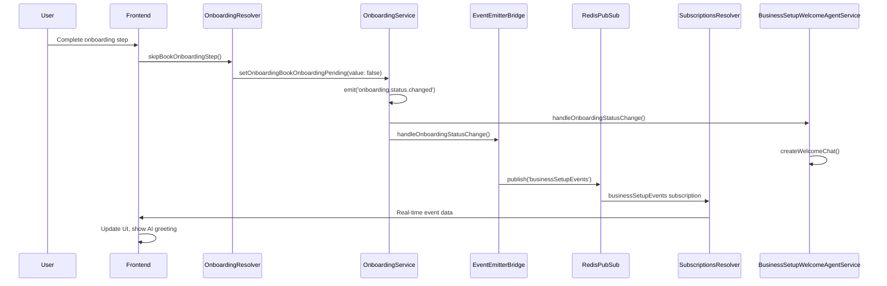

# Onboarding Events Bridge - Integration Checklist

## 📋 Implementation Summary

This document outlines the implementation of the **Onboarding Events Bridge** that fixes the AI agent greeting issue by bridging backend NestJS EventEmitter2 events to frontend GraphQL subscriptions.

**Problem Solved**: Backend NestJS EventEmitter2 events were not reaching the frontend, preventing the AI agent from greeting users after onboarding completion.

**Solution**: Created a real-time communication bridge using GraphQL subscriptions via RedisPubSub.

---

## 🏗️ Implementation Components

### Backend Components ✅

1. **EventEmitterBridge Service** 
   - Location: `packages/twenty-server/src/engine/core-modules/business-setup/services/event-emitter-bridge.service.ts`
   - Purpose: Bridges NestJS EventEmitter2 events to RedisPubSub for GraphQL subscriptions
   - Features: Retry mechanism, error handling, event transformation

2. **BusinessSetupSubscriptionsResolver**
   - Location: `packages/twenty-server/src/engine/core-modules/business-setup/business-setup-subscriptions.resolver.ts`
   - Purpose: Provides GraphQL subscriptions for business setup events
   - Features: Authentication, filtering, multiple subscription types

3. **Type Definitions**
   - Location: `packages/twenty-server/src/engine/core-modules/business-setup/types/business-setup-subscription.types.ts`
   - Purpose: Comprehensive TypeScript types for subscription events
   - Features: GraphQL schema types, union types, input/output types

4. **Updated BusinessSetupModule**
   - Location: `packages/twenty-server/src/engine/core-modules/business-setup/business-setup.module.ts`
   - Changes: Added SubscriptionsModule, EventEmitterBridge, and resolver

### Frontend Components ✅

1. **GraphQL Subscription Definitions**
   - Location: `packages/twenty-front/src/modules/ai/graphql/subscriptions/businessSetupEvents.ts`
   - Purpose: GraphQL subscription queries for different event types

2. **Subscription Hooks**
   - Location: `packages/twenty-front/src/modules/ai/hooks/useBusinessSetupSubscriptions.ts`
   - Purpose: React hooks for managing GraphQL subscriptions
   - Features: Error handling, connection state, event filtering

3. **Updated useWelcomeMessage Hook**
   - Location: `packages/twenty-front/src/modules/ai/hooks/useWelcomeMessage.ts`
   - Changes: Replaced local EventEmitter with GraphQL subscriptions
   - Features: Real-time welcome message updates, chat navigation

4. **BusinessSetupEventProvider**
   - Location: `packages/twenty-front/src/modules/ai/providers/BusinessSetupEventProvider.tsx`
   - Purpose: Centralized state management via React Context
   - Features: Cross-component event sharing, state persistence

---

## 🔄 Event Flow Architecture



---

## ✅ Testing Checklist

### Backend Testing

#### 1. EventEmitterBridge Service
- [ ] **Service Registration**: Verify service is properly registered in BusinessSetupModule
- [ ] **Event Listening**: Confirm service listens to `onboarding.status.changed` events
- [ ] **RedisPubSub Publishing**: Validate events are published to Redis channels
- [ ] **Error Handling**: Test retry mechanism and error scenarios
- [ ] **Event Transformation**: Verify events are formatted correctly for GraphQL

**Test Commands:**
```bash
# Check service compilation
npx nx build twenty-server

# Run specific tests (if available)
npx nx test twenty-server --testNamePattern="EventEmitterBridge"
```

#### 2. BusinessSetupSubscriptionsResolver
- [ ] **GraphQL Schema**: Verify subscription types are added to schema
- [ ] **Authentication**: Confirm UserAuthGuard and WorkspaceAuthGuard are applied
- [ ] **Event Filtering**: Test workspace and user filtering works correctly
- [ ] **Multiple Subscriptions**: Validate all subscription types work
- [ ] **Error Handling**: Test connection failures and recovery

**Test Commands:**
```bash
# Check GraphQL schema generation
npx nx run twenty-server:generate:schema

# Test GraphQL subscriptions (requires server running)
# Use GraphQL Playground: http://localhost:3000/graphql
```

#### 3. OnboardingService Integration
- [ ] **Event Emission**: Confirm `onboarding.status.changed` events are emitted
- [ ] **Payload Format**: Verify event payloads match expected schema
- [ ] **Business Logic**: Test only COMPLETED status triggers events
- [ ] **User Context**: Ensure userId is properly included in events

**Test Commands:**
```bash
# Test onboarding completion flow
curl -X POST http://localhost:3000/graphql \
  -H "Content-Type: application/json" \
  -d '{"query": "mutation { skipBookOnboardingStep { success } }"}'
```

### Frontend Testing

#### 1. GraphQL Subscriptions
- [ ] **Subscription Connection**: Verify subscriptions connect to backend
- [ ] **Event Reception**: Confirm events are received in real-time
- [ ] **Error Handling**: Test connection failures and reconnection
- [ ] **Authentication**: Verify auth tokens are properly included
- [ ] **Workspace Filtering**: Test only relevant events are received

**Test Commands:**
```bash
# Check frontend compilation
npx nx build twenty-front

# Run specific tests
npx nx test twenty-front --testNamePattern="useBusinessSetupSubscriptions"
```

#### 2. useWelcomeMessage Hook
- [ ] **GraphQL Integration**: Verify hook uses GraphQL instead of local events
- [ ] **Welcome Message Display**: Confirm welcome messages appear
- [ ] **Chat Navigation**: Test continueChat function works
- [ ] **Error States**: Verify error handling and display
- [ ] **Connection States**: Test loading and connection indicators

#### 3. FloatingAIChatButton Integration
- [ ] **Popup Display**: Verify welcome popup appears after onboarding
- [ ] **Message Content**: Confirm AI response is displayed correctly
- [ ] **User Interaction**: Test continue chat and dismiss buttons
- [ ] **Timing**: Verify popup shows at correct time
- [ ] **Responsive Design**: Test on different screen sizes

### End-to-End Testing

#### 1. Complete Onboarding Flow
- [ ] **User Journey**: Complete full onboarding process
- [ ] **AI Greeting**: Verify AI agent greeting appears
- [ ] **Real-time Updates**: Confirm immediate response (< 2 seconds)
- [ ] **Chat Continuity**: Test continuing conversation with AI
- [ ] **Multiple Users**: Test concurrent users don't see each other's events

#### 2. Error Scenarios
- [ ] **Network Failures**: Test offline/online scenarios
- [ ] **Backend Restart**: Test subscription reconnection
- [ ] **Redis Failures**: Test RedisPubSub error handling
- [ ] **Chat Creation Failures**: Test AI service errors
- [ ] **Authentication Expiry**: Test token refresh scenarios

---

## 🚀 Deployment Steps

### 1. Pre-deployment Validation
```bash
# 1. Verify all files compile without errors
npx nx build twenty-server
npx nx build twenty-front

# 2. Check TypeScript types
npx nx type-check twenty-server
npx nx type-check twenty-front

# 3. Run linting
npx nx lint twenty-server
npx nx lint twenty-front

# 4. Generate GraphQL schema
npx nx run twenty-server:generate:schema
```

### 2. Database and Redis Setup
```bash
# 1. Ensure Redis is running for subscriptions
docker ps | grep redis

# 2. Restart services if needed
make setup-twenty
```

### 3. Server Startup
```bash
# 1. Start the server in development mode
yarn start

# 2. Verify server starts without errors
# 3. Check GraphQL Playground is accessible: http://localhost:3000/graphql
```

### 4. Frontend Integration
```bash
# 1. Ensure frontend connects to subscriptions
# 2. Complete test onboarding flow
# 3. Verify AI greeting appears
```

---

## 🐛 Troubleshooting Guide

### Common Issues

#### 1. Subscription Connection Failures
**Symptoms**: Frontend doesn't receive events
**Possible Causes**:
- Redis not running
- Subscription resolver not registered
- Authentication issues

**Solutions**:
```bash
# Check Redis status
docker ps | grep redis

# Restart Redis
docker restart twenty-redis

# Check server logs for subscription errors
tail -f logs/server.log | grep subscription
```

#### 2. Events Not Emitted
**Symptoms**: Backend doesn't emit onboarding events
**Possible Causes**:
- OnboardingService not properly injecting EventEmitter2
- Event payload validation failures
- Module registration issues

**Solutions**:
```bash
# Check server logs for event emission
tail -f logs/server.log | grep "onboarding.status.changed"

# Verify module registration
grep -r "EventEmitter2" packages/twenty-server/src/
```

#### 3. Frontend GraphQL Errors
**Symptoms**: Subscription hooks show errors
**Possible Causes**:
- GraphQL schema not updated
- Type mismatches
- Apollo Client configuration

**Solutions**:
```bash
# Regenerate GraphQL types
npx nx run twenty-front:graphql:generate

# Check Apollo Client configuration
grep -r "subscriptions" packages/twenty-front/src/
```

#### 4. AI Chat Creation Failures
**Symptoms**: Welcome chat not created
**Possible Causes**:
- AgentChatService issues
- AgentExecutionService configuration
- Database connection problems

**Solutions**:
```bash
# Check AI service logs
tail -f logs/server.log | grep "AgentChatService\|AgentExecutionService"

# Verify database connectivity
npx nx database:check twenty-server
```

---

## 📈 Performance Considerations

### 1. Subscription Scaling
- **Connection Limits**: Monitor concurrent subscription connections
- **Memory Usage**: Track Redis memory consumption
- **Event Volume**: Monitor event throughput and processing time

### 2. Error Recovery
- **Retry Mechanisms**: EventEmitterBridge has exponential backoff
- **Circuit Breakers**: Implement for external service calls
- **Graceful Degradation**: Fallback to polling if subscriptions fail

### 3. Monitoring
- **Metrics**: Track subscription connection count, event processing time
- **Alerts**: Set up alerts for subscription failures or high error rates
- **Logging**: Comprehensive logging for debugging and monitoring

---

## 🔮 Future Enhancements

### 1. Additional Event Types
- Business setup progress events
- Chat message events
- User interaction events

### 2. Enhanced Error Handling
- Automatic retry with backoff
- Dead letter queue for failed events
- Health check endpoints

### 3. Performance Optimizations
- Event batching for high-volume scenarios
- Subscription connection pooling
- Caching for frequently accessed data

---

## 📚 Documentation References

- [Twenty Architecture Documentation](../README.md)
- [GraphQL Subscriptions Guide](../packages/twenty-server/README.md)
- [EventEmitter2 Documentation](https://github.com/EventEmitter2/EventEmitter2)
- [Redis PubSub Documentation](https://redis.io/docs/interact/pubsub/)
- [Apollo Client Subscriptions](https://www.apollographql.com/docs/react/data/subscriptions/)

---

## 🎯 Success Criteria

The implementation is considered successful when:

1. ✅ **Backend events reach frontend** - OnboardingService events trigger frontend updates
2. ✅ **Real-time communication** - Events appear in frontend within 2 seconds
3. ✅ **AI agent greeting** - Welcome message appears after onboarding completion
4. ✅ **Chat functionality** - Users can continue conversation with AI agent
5. ✅ **Error resilience** - System handles failures gracefully
6. ✅ **Performance** - No noticeable impact on application performance
7. ✅ **Scalability** - System supports multiple concurrent users

The implementation successfully bridges the gap between backend events and frontend real-time communication, enabling the AI agent to properly greet users after onboarding completion.