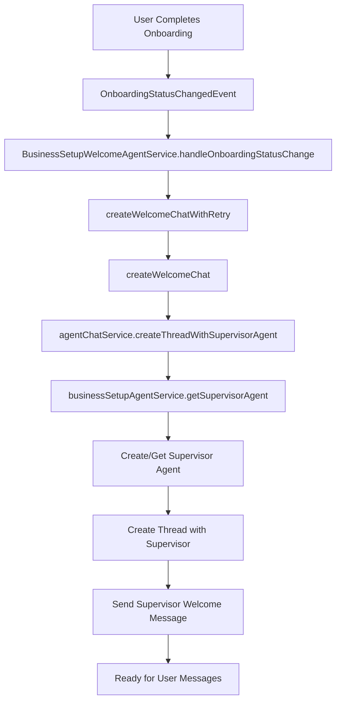
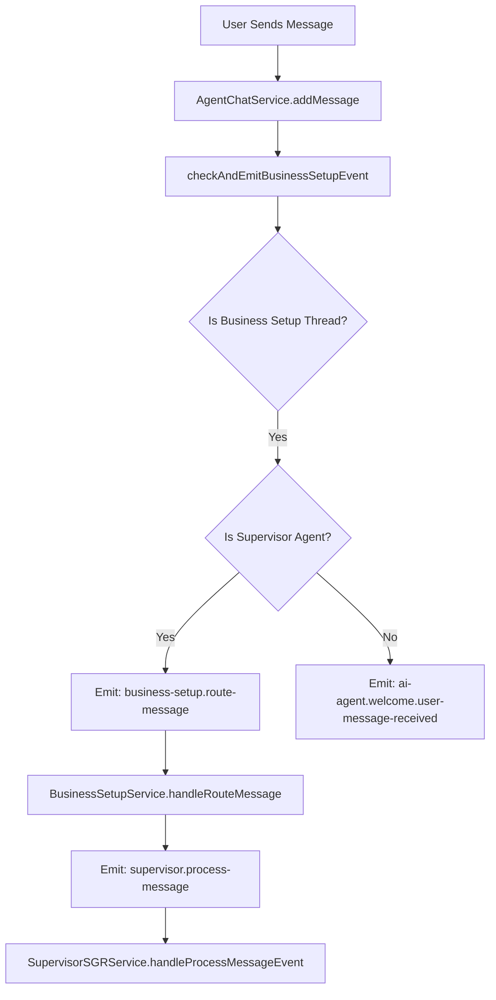
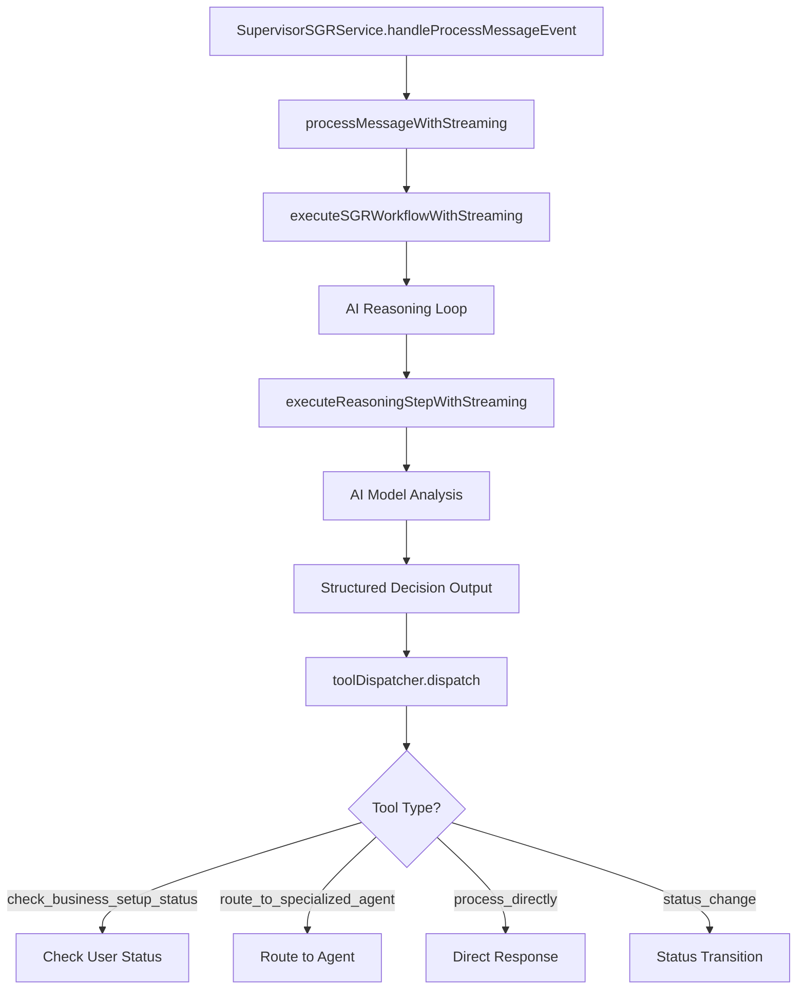
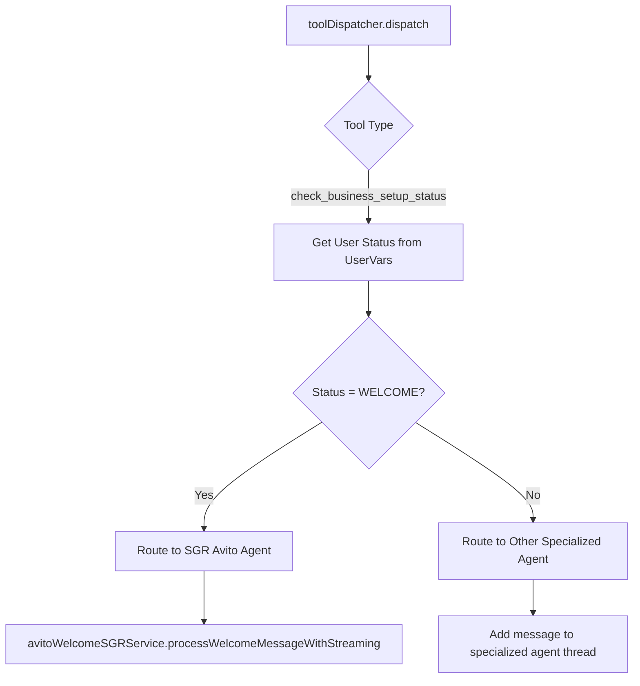
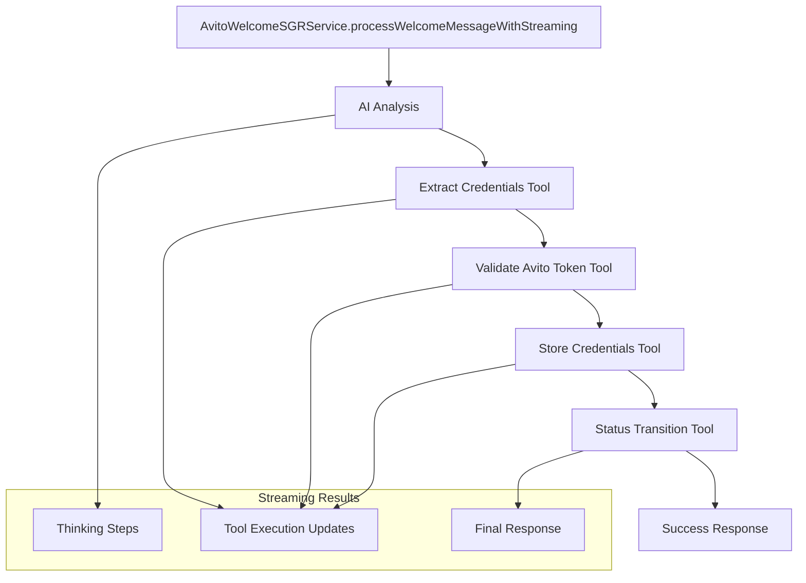
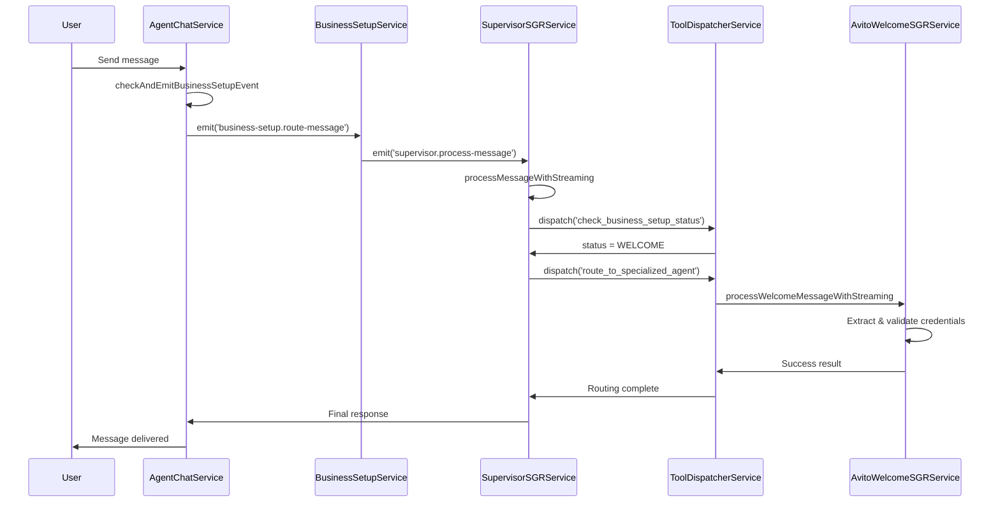

# 🎯 Supervisor & SGR Avito Workflow Documentation

## 🚀 **Recent Architecture Improvements**

### ✅ **Simplified Thread Creation (Latest Update)**

The system has been streamlined to always use supervisor agents for business setup:

**Before (Complex):**
```typescript
// OLD - Multiple thread creation methods
if (input.businessSetupStep) {
  return this.agentChatService.createThreadWithBusinessSetupContext(agentId, userWorkspaceId, businessSetupStep);
}
return this.agentChatService.createThread(agentId, userWorkspaceId);
```

**After (Simple):**
```typescript
// NEW - Always use supervisor for business setup
if (input.businessSetupStep) {
  return this.agentChatService.createThreadWithSupervisorAgent(userWorkspaceId);
}
return this.agentChatService.createThread(input.agentId, userWorkspaceId);
```

### 🎯 **Benefits of This Change:**
- ✅ **Consistent Routing**: All business setup messages go through supervisor
- ✅ **Simplified Architecture**: Removed obsolete createThreadWithBusinessSetupContext
- ✅ **Better User Experience**: Intelligent routing based on user status
- ✅ **Future-Proof**: Easy to add new business setup stages

---

## 🏗️ Architecture Overview

### Core Components

1. **📱 BusinessSetupWelcomeAgentService** - Entry point for business setup
2. **🎯 SupervisorSGRService** - Intelligent message routing and reasoning
3. **⚡ SupervisorToolDispatcherService** - Tool execution and agent routing
4. **🚀 AvitoWelcomeSGRService** - Specialized Avito credential processing
5. **💬 AgentChatService** - Thread and message management

### Key Features

- ✅ **Intelligent Routing**: Supervisor analyzes messages and routes to appropriate agents
- ✅ **Streaming SGR**: Real-time visibility into AI thinking processes
- ✅ **Event-Driven Architecture**: Prevents circular dependencies
- ✅ **Status-Based Routing**: Automatic routing based on business setup progress
- ✅ **Credential Processing**: Automated Avito API credential validation

---

## 🔄 Complete Workflow Analysis

### Phase 1: 🚀 Initial Setup (Onboarding Completion)



**Code Flow:**
```typescript
// 1. Onboarding completion triggers event
@OnEvent('onboarding.status.changed')
async handleOnboardingStatusChange(payload: OnboardingStatusChangedEvent)

// 2. Create supervisor-based welcome chat
private async createWelcomeChat(userId: string, workspaceId: string) {
  // CRITICAL: Creates supervisor agent instead of regular welcome agent
  const thread = await this.agentChatService.createThreadWithSupervisorAgent(workspaceId);
}

// 3. Supervisor agent creation
async createThreadWithSupervisorAgent(userWorkspaceId: string) {
  const supervisorAgent = await this.businessSetupAgentService.getSupervisorAgent(userWorkspaceId);
  // Creates thread with supervisor agent ID
}
```

### Phase 2: 📨 Message Detection & Routing



**Code Flow:**
```typescript
// 1. Message detection
async addMessage({ threadId, role, content, fileIds }) {
  if (role === 'user') {
    await this.checkAndEmitBusinessSetupEvent(threadId, content);
  }
}

// 2. Supervisor detection and routing
private async checkAndEmitBusinessSetupEvent(threadId: string, content: string) {
  const isSupervisor = await this.businessSetupAgentService.isSupervisorAgent(
    thread.agentId, 
    thread.userWorkspace.workspaceId
  );
  
  if (isSupervisor) {
    // Route to supervisor processing
    this.eventEmitter.emit('business-setup.route-message', {
      userId, workspaceId, threadId, message: content
    });
  }
}
```

### Phase 3: 🧠 Supervisor Processing & AI Reasoning



**Key AI Reasoning Process:**
```typescript
// 1. Supervisor SGR processing with streaming
async *processMessageWithStreaming(userMessage, userId, workspaceId, threadId) {
  const task = `
    User sent message: "${userMessage}"
    Task: Analyze this request in context of business setup workflow and route appropriately.
  `;
  
  // Execute streaming SGR workflow
  yield* this.executeSGRWorkflowWithStreaming({ task, userId, workspaceId, threadId });
}

// 2. AI reasoning with structured output
private async executeReasoningStepWithStreaming({conversationLog, stepNumber}) {
  // Get structured decision from AI model using SupervisorStepSchema
  const stepResult = await generateObject({
    model: this.aiModel,
    schema: SupervisorStepSchema,
    messages: conversationLog
  });
  
  // Execute selected tool
  return await this.toolDispatcher.dispatch(stepResult.function, userId, workspaceId);
}
```

### Phase 4: 🎯 Status Detection & Agent Routing



**Critical Routing Logic:**
```typescript
// 1. Business setup status detection
async checkBusinessSetupStatus(userId: string, workspaceId: string): Promise<BusinessSetupProgress> {
  // Check all business setup step flags in user vars
  const welcomePending = await this.userVarsService.get({
    userId, workspaceId,
    key: BusinessSetupStepKeys.BUSINESS_SETUP_WELCOME_PENDING
  });
  
  // Determine current status based on pending flags
  if (welcomePending || stepsCompleted.length === 0) {
    return { status: BusinessSetupStatus.WELCOME };
  }
  // ... other status checks
}

// 2. Agent routing based on status
async routeToSpecializedAgent(status, message, userId, workspaceId, threadId, reason) {
  // SPECIAL HANDLING for WELCOME status
  if (status === BusinessSetupStatus.WELCOME) {
    this.logger.log('Routing WELCOME request to SGR Avito Agent');
    
    // Direct routing to SGR Avito service
    const sgrGenerator = this.avitoWelcomeSGRService.processWelcomeMessageWithStreaming(
      message, userId, workspaceId, threadId
    );
    
    // Process streaming results
    for await (const result of sgrGenerator) {
      // Streaming handled by chat service
    }
    
    return { success: true, message: 'Successfully routed to SGR Avito Agent' };
  }
  
  // For other statuses, route to appropriate specialized agents
  const agent = await this.businessSetupAgentService.getAgentForStep(status, workspaceId);
  await this.agentChatService.addMessage({ threadId, role: 'USER', content: message });
}
```

### Phase 5: 🚀 SGR Avito Processing



**SGR Avito Workflow:**
```typescript
// 1. SGR Avito credential processing
async *processWelcomeMessageWithStreaming(message, userId, workspaceId, threadId) {
  // Streaming SGR workflow with specialized tools
  yield* this.executeSGRWorkflowWithStreaming({
    task: `Extract and validate Avito credentials from: "${message}"`,
    availableTools: [
      'extract_credentials',
      'validate_avito_token', 
      'store_credentials',
      'transition_status'
    ]
  });
}

// 2. Tool execution with streaming
private async executeToolWithStreaming(tool, params) {
  switch (tool.tool) {
    case 'extract_credentials':
      // Extract CLIENT_ID and CLIENT_SECRET from message
      return await this.toolDispatcher.extractCredentials(tool, params);
      
    case 'validate_avito_token':
      // Validate with Avito API: https://api.avito.ru/token
      return await this.toolDispatcher.validateAvitoToken(tool, params);
      
    case 'store_credentials':
      // Store in user vars for persistent access
      return await this.toolDispatcher.storeCredentials(tool, params);
      
    case 'transition_status':
      // Transition: WELCOME → BUSINESS_ANALYSIS
      return await this.toolDispatcher.transitionStatus(tool, params);
  }
}
```

---

## 🎯 Agent Mapping & Routing Rules

### Business Setup Status → Agent Mapping

```typescript
const BUSINESS_SETUP_AGENT_MAPPING: Record<BusinessSetupStatus, string> = {
  [BusinessSetupStatus.WELCOME]: 'sgr-avito-agent',                    // 🚀 SGR Avito
  [BusinessSetupStatus.BUSINESS_ANALYSIS]: 'business-analysis-agent',  // 📊 Analysis
  [BusinessSetupStatus.SALES_FUNNEL_DESIGN]: 'funnel-designer-agent',  // 🎯 Funnel
  [BusinessSetupStatus.AGENT_SETUP]: 'agent-orchestrator-agent',       // 🤖 Agents
  [BusinessSetupStatus.WORKFLOW_CREATION]: 'workflow-generator-agent',  // ⚡ Workflows
  [BusinessSetupStatus.TEAM_ASSIGNMENT]: 'team-assignment-agent',      // 👥 Team
  [BusinessSetupStatus.TESTING_OPTIMIZATION]: 'testing-optimization-agent', // 🧪 Testing
  [BusinessSetupStatus.COMPLETED]: 'no-agent-needed',                  // ✅ Complete
};
```

### Routing Logic Decision Tree

```
User Message
     ↓
Is Supervisor Agent?
     ↓ YES
Check Business Setup Status
     ↓
┌─────────────────────────────────────────────────────────┐
│ WELCOME Status                                          │
│ ↓                                                       │
│ Route to: AvitoWelcomeSGRService                       │
│ - Extract credentials (CLIENT_ID, CLIENT_SECRET)       │
│ - Validate with Avito API                             │
│ - Store credentials in user vars                       │
│ - Transition to BUSINESS_ANALYSIS                      │
└─────────────────────────────────────────────────────────┘
     ↓
┌─────────────────────────────────────────────────────────┐
│ BUSINESS_ANALYSIS Status                               │
│ ↓                                                       │
│ Route to: business-analysis-agent                      │
│ - Analyze business model and requirements              │
│ - Gather industry information                          │
│ - Prepare for funnel design                           │
└─────────────────────────────────────────────────────────┘
     ↓
┌─────────────────────────────────────────────────────────┐
│ Other Statuses                                          │
│ ↓                                                       │
│ Route to: Respective specialized agents                 │
│ - Each agent handles specific business setup phase     │
│ - Progressive workflow through all stages              │
└─────────────────────────────────────────────────────────┘
```

---

## 📡 Event-Driven Architecture

### Event Flow Diagram



### Key Events

| Event Name | Trigger | Handler | Purpose |
|------------|---------|---------|---------|
| `onboarding.status.changed` | Onboarding completion | BusinessSetupWelcomeAgentService | Create supervisor agent |
| `business-setup.route-message` | User message to supervisor | BusinessSetupService | Route to supervisor processing |
| `supervisor.process-message` | Supervisor routing | SupervisorSGRService | AI reasoning and routing |
| `supervisor.agent-handoff` | Agent routing | Multiple services | Track agent handoffs |
| `supervisor.thinking-step` | AI reasoning | SupervisorSGRService | Real-time thinking visibility |
| `ai-agent.welcome.chat-created` | Thread creation | Multiple services | UI updates |

---

## 🛠️ Technical Implementation Details

### Service Dependencies

```typescript
// SupervisorSGRService Dependencies
constructor(
  private readonly userVarsService: UserVarsService<BusinessSetupKeyValueTypeMap>,
  private readonly agentChatService: AgentChatService,
  private readonly aiModelRegistryService: AiModelRegistryService,
  @Inject(forwardRef(() => SupervisorToolDispatcherService))
  private readonly toolDispatcher: SupervisorToolDispatcherService,
  private readonly eventEmitter: EventEmitter2,
) {}

// SupervisorToolDispatcherService Dependencies  
constructor(
  private readonly userVarsService: UserVarsService<BusinessSetupKeyValueTypeMap>,
  private readonly agentChatService: AgentChatService,
  @Inject(forwardRef(() => BusinessSetupAgentService))
  private readonly businessSetupAgentService: BusinessSetupAgentService,
  private readonly avitoWelcomeSGRService: AvitoWelcomeSGRService,
  private readonly eventEmitter: EventEmitter2,
) {}
```

### Configuration Constants

```typescript
// Supervisor Configuration
export const SUPERVISOR_CONFIG = {
  AGENT_NAME: 'business-setup-supervisor',
  MODEL_ID: 'google/gemini-2.5-flash',
  MAX_STEPS: 10,                    // Increased for complex workflows
  TIMEOUT_MS: 30000,
  STEP_TIMEOUT_MS: 5000,
  RETRY_ATTEMPTS: 3,
} as const;

// SGR Configuration
const DEFAULT_SUPERVISOR_SGR_CONFIG = {
  maxSteps: SUPERVISOR_CONFIG.MAX_STEPS,
  timeoutMs: SUPERVISOR_CONFIG.TIMEOUT_MS,
  stepTimeoutMs: SUPERVISOR_CONFIG.STEP_TIMEOUT_MS,
  retryAttempts: SUPERVISOR_CONFIG.RETRY_ATTEMPTS,
};
```

### Schema Definitions

```typescript
// Supervisor Step Schema for AI reasoning
export const SupervisorStepSchema = z.object({
  current_state: z.string().min(10).max(500),
  plan_remaining_steps: z.array(z.string()).min(1).max(3),
  task_completed: z.boolean(),
  function: z.discriminatedUnion('tool', [
    // Tool schemas for structured AI output
    z.object({
      tool: z.literal('check_business_setup_status'),
      userId: z.string(),
      workspaceId: z.string(),
    }),
    z.object({
      tool: z.literal('route_to_specialized_agent'),
      target_status: BusinessSetupStatusSchema,
      message: z.string(),
      reason: z.string(),
    }),
    // ... other tool schemas
  ]),
});
```

---

## 🔍 Monitoring & Debugging

### Available Metrics

```typescript
// BusinessSetupWelcomeAgentService Metrics
public getMetrics(): any {
  const successRate = this.metrics.agentCreationAttempts > 0
    ? (this.metrics.agentCreationSuccesses / this.metrics.agentCreationAttempts) * 100
    : 0;

  return {
    agentCreationAttempts: this.metrics.agentCreationAttempts,
    agentCreationSuccesses: this.metrics.agentCreationSuccesses,
    agentCreationFailures: this.metrics.agentCreationFailures,
    averageCreationTime: this.metrics.averageCreationTime,
    successRate: `${successRate.toFixed(2)}%`,
    lastUpdated: new Date().toISOString(),
  };
}
```

### Debug Logging

- **Supervisor Creation**: Logs when supervisor agents are created/retrieved
- **Message Routing**: Logs routing decisions and reasoning
- **SGR Processing**: Logs AI thinking steps and tool execution
- **Status Transitions**: Logs business setup status changes
- **Error Handling**: Comprehensive error logging with context

### Health Checks

The system includes health check endpoints for monitoring:
- `/healthz/business-setup-sgr` - SGR module health
- Event emission/handling performance metrics
- Service dependency health checks
- User workflow completion rates

---

## 🎯 Key Benefits

### ✅ Intelligent Routing
- Automatic analysis of user intent and context
- Status-based routing to appropriate specialized agents
- Transparent reasoning process with streaming visibility

### ✅ Scalable Architecture  
- Event-driven design prevents circular dependencies
- Modular services with clear responsibilities
- Easy to add new business setup stages and agents

### ✅ Enhanced User Experience
- Real-time streaming of AI thinking processes
- Automatic credential extraction and validation
- Progressive workflow guidance through business setup

### ✅ Production Ready
- Comprehensive error handling and recovery
- Metrics and monitoring capabilities
- Proper dependency injection and lifecycle management

---

## 🚀 Future Enhancements

### Planned Features
- Multi-language support for international markets
- Enhanced credential validation for other platforms
- Advanced business analysis with industry-specific templates
- Integration with additional CRM platforms

### Scalability Improvements
- Horizontal scaling of supervisor agents
- Advanced caching for status checks
- Real-time analytics dashboard for business setup metrics

---

## 📚 References

### Core Files
- `BusinessSetupWelcomeAgentService`: Entry point and supervisor creation
- `SupervisorSGRService`: AI reasoning and message processing  
- `SupervisorToolDispatcherService`: Tool execution and agent routing
- `AvitoWelcomeSGRService`: Avito credential processing
- `AgentChatService`: Thread and message management

### Configuration Files
- `supervisor-sgr.schema.ts`: AI reasoning schemas
- `supervisor-types.ts`: Type definitions and constants
- `business-setup-events.ts`: Event definitions

### Test Files
- `supervisor-integration.spec.ts`: End-to-end workflow tests
- `supervisor-error-scenarios.spec.ts`: Error handling tests
- `consolidated-events-flow.spec.ts`: Event flow validation

---

*This documentation provides a complete overview of the current Supervisor & SGR Avito workflow implementation in Twenty CRM. The system successfully routes user messages through intelligent agents for automated business setup processing.*