# Welcome Agent - Диаграммы и схемы

## 🏗️ Архитектурная диаграмма

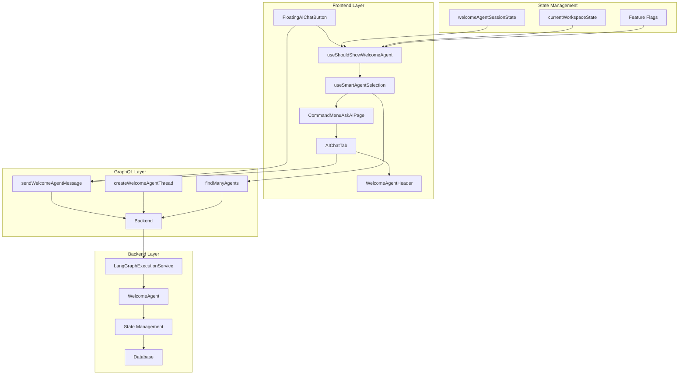

## 🔄 Поток пользователя

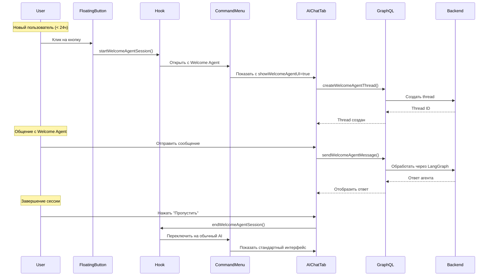

## 🧩 Компонентная схема

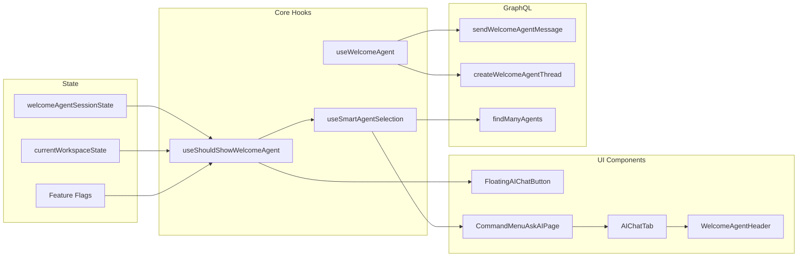

## 📊 Состояния и переходы

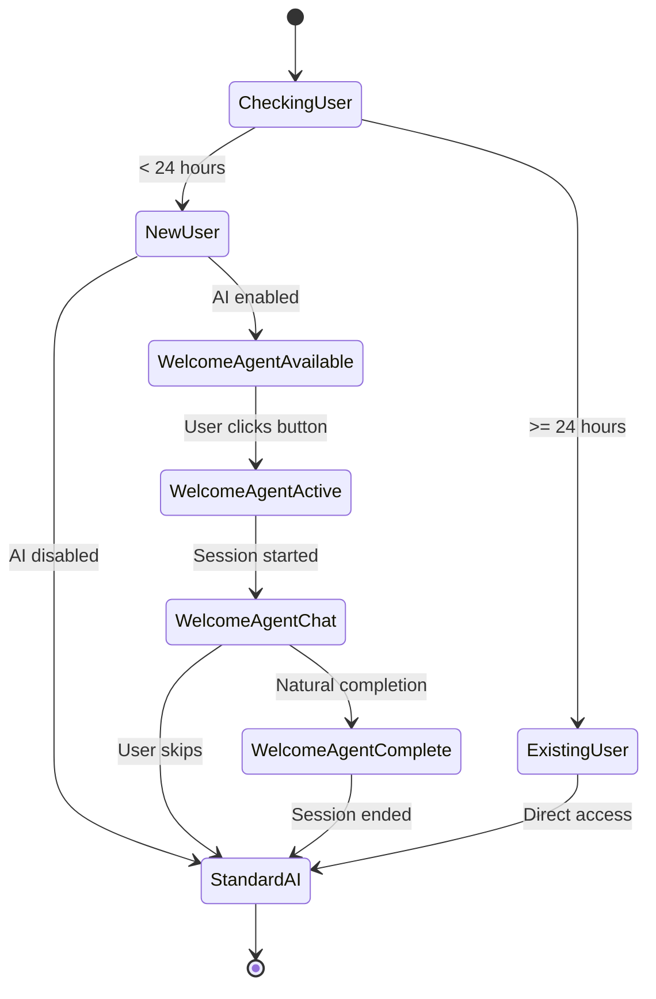

## 🔧 Логика принятия решений

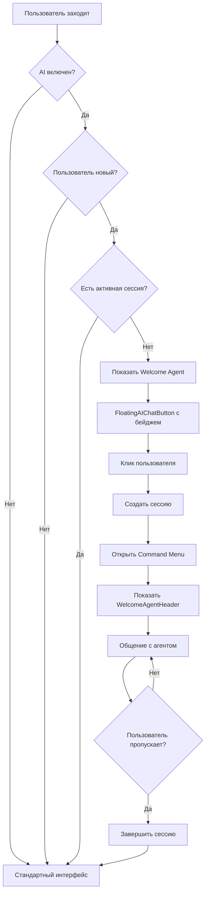

## 🎨 UI/UX Flow

```mermaid
graph TD
    subgraph "Визуальные состояния"
        A[Обычная кнопка<br/>"Ask AI (Press @)"] --> B[Кнопка с бейджем<br/>"Welcome Agent (Новый!)"]
        B --> C[Command Menu<br/>С Welcome Agent]
        C --> D[Стандартный чат<br/>"Enter a question..."]
    end
    
    subgraph "Welcome Agent UI"
        E[WelcomeAgentHeader<br/>"Добро пожаловать в Twenty!"] --> F[Специальный placeholder<br/>"Задайте вопрос о Twenty..."]
        F --> G[Кнопка "Пропустить"]
    end
    
    A --> B
    B --> C
    C --> E
    E --> F
    G --> D
```

## 🔌 GraphQL Schema

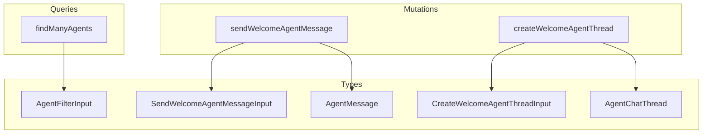

## 🧪 Тестирование

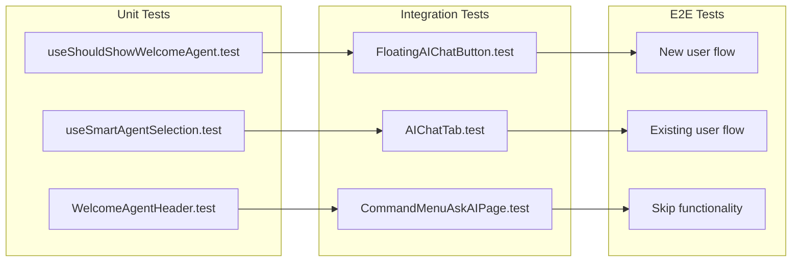

## 📈 Метрики и мониторинг

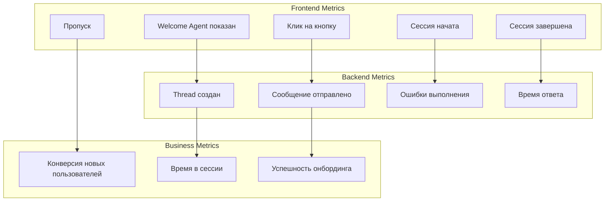

## 🔄 Жизненный цикл компонента

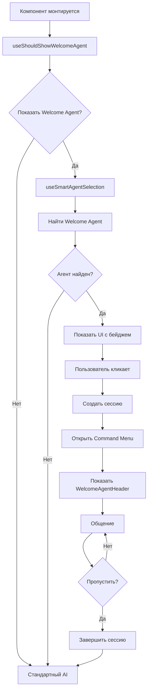

## 🛡️ Безопасность

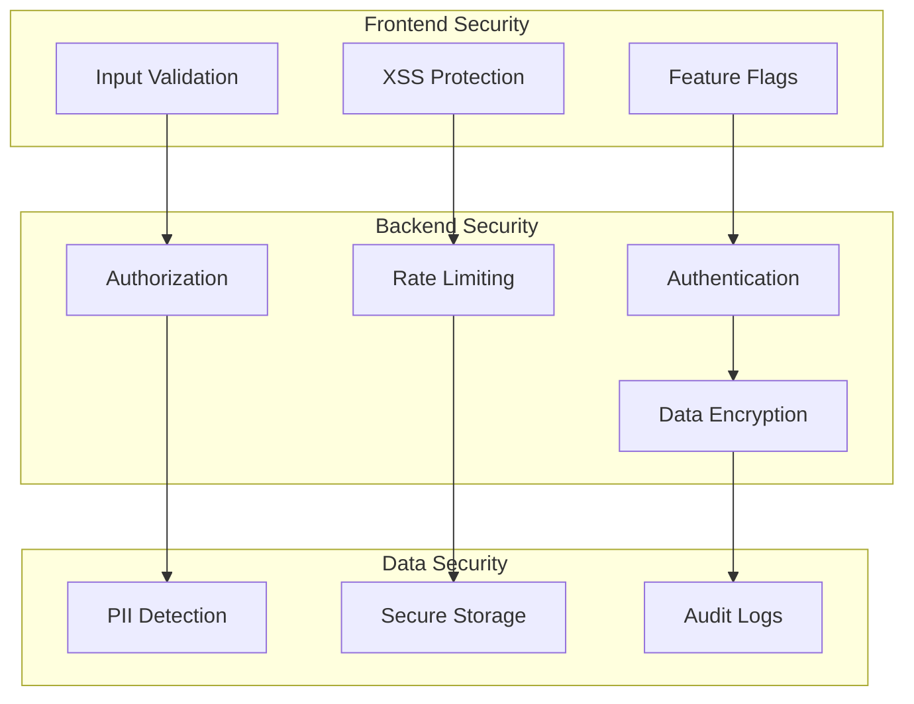

## 🚀 Производительность

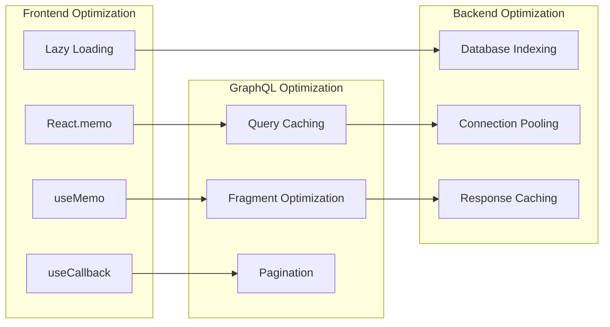

Эти диаграммы предоставляют полное визуальное представление архитектуры Welcome Agent и помогают понять взаимодействие между компонентами на всех уровнях системы.
