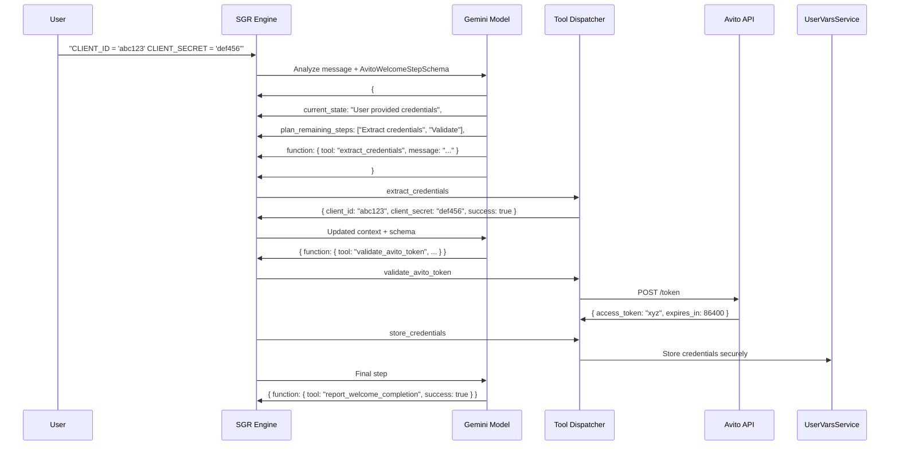

# Avito Welcome Agent SGR Implementation

## Overview

This implementation introduces **Schema-Guided Reasoning (SGR)** to the Avito Welcome Agent in the Twenty CRM system. SGR transforms the simple credential validation process into an intelligent, step-by-step workflow with transparent reasoning and type-safe tool execution.

## What is SGR?

Schema-Guided Reasoning is an AI technique that enforces structured thinking patterns through:

1. **Structured Decision Making**: AI must follow predefined schemas for each reasoning step
2. **Transparent Planning**: Each step includes current state analysis and future step planning
3. **Type-Safe Tool Execution**: All tool calls are validated through Zod schemas
4. **Audit Trail**: Complete conversation log for debugging and monitoring

## Architecture

```
User Message
     ↓
AvitoWelcomeSGRService
     ↓
Gemini 2.5 Flash (with schemas)
     ↓
AvitoWelcomeToolDispatcher
     ↓
Tool Execution (HTTP, Storage, etc.)
     ↓
Business Setup Transition
```

### Core Components

1. **`avito-welcome-sgr.schema.ts`** - Zod schemas for structured reasoning
2. **`avito-welcome-sgr.service.ts`** - Main SGR orchestration service  
3. **`avito-welcome-tool-dispatcher.service.ts`** - Type-safe tool execution
4. **Integration with existing `BusinessSetupWelcomeAgentService`**

## Features

### Enhanced Credential Processing

- **Multiple Format Support**: Handles various credential input formats
  - Standard: `CLIENT_ID = 'value' CLIENT_SECRET = 'value'`
  - JSON: `{"client_id": "value", "client_secret": "value"}`
  - YAML-style: `client_id: value`
  - Colon-separated: `CLIENT_ID: value`

### Intelligent Validation

- **Real-time API Validation**: Validates credentials with actual Avito API
- **Structured Error Handling**: Provides specific error messages and recovery suggestions
- **Secure Storage**: Uses existing UserVarsService for encrypted credential storage

### Russian Language Support

- **Native Russian UI**: All user messages in Russian for target market
- **Contextual Help**: Detailed instructions for finding and providing credentials
- **Error Messages**: Clear, actionable error messages in Russian

## SGR Workflow Example

### Successful Credential Flow



## Available Tools

### 1. Extract Credentials (`extract_credentials`)
Intelligently extracts CLIENT_ID and CLIENT_SECRET from user messages using multiple pattern recognition.

### 2. Request Credentials (`request_credentials`)
Generates user-friendly Russian instructions when credentials are missing or invalid.

### 3. Validate Avito Token (`validate_avito_token`)
Validates credentials with the real Avito API endpoint.

### 4. Store Credentials (`store_credentials`)
Securely stores validated credentials using the existing UserVarsService.

### 5. Report Completion (`report_welcome_completion`)
Completes the welcome stage and transitions to business analysis.

## Usage

### Direct Usage (for testing)

```typescript
const sgrService = new AvitoWelcomeSGRService(/* dependencies */);

await sgrService.processWelcomeMessage(
  "CLIENT_ID = 'R3cTDMk9rEJ2lh5A9_QF' CLIENT_SECRET = 'ehAWb-RBQrLmgoJWfgtst737eQV6KIBHzmV1NmIc'",
  userId,
  workspaceId,
  threadId
);
```

### Integration Usage

The SGR system is automatically used when:

1. User completes onboarding (triggers welcome chat)
2. User sends message to welcome agent thread
3. Message contains potential Avito credentials

### Fallback Mechanism

If SGR fails, the system gracefully falls back to the legacy credential processing method, ensuring reliability.

## Configuration

### Required Environment Variables

```bash
# Gemini Model Access (via OpenRouter)
OPENAI_COMPATIBLE_BASE_URL=https://openrouter.ai/api/v1
OPENAI_COMPATIBLE_API_KEY=your_openrouter_key
OPENAI_COMPATIBLE_MODEL_NAMES=google/gemini-2.5-flash
DEFAULT_MODEL_ID=google/gemini-2.5-flash
```

### Model Configuration

The system specifically uses **Gemini 2.5 Flash** for:
- Low latency structured reasoning
- High reliability with schema adherence
- Cost-effective processing for welcome stage

## Testing

### Unit Tests

```bash
# Run SGR-specific tests
npm test -- --testPathPattern="sgr"

# Run specific test file
npm test avito-welcome-sgr.service.spec.ts
```

### Integration Tests

```bash
# Run complete integration tests
npm test avito-welcome-sgr.integration.spec.ts
```

### Manual Testing

1. **Complete Onboarding** to trigger welcome chat
2. **Send credential message**: 
   ```
   CLIENT_ID = 'R3cTDMk9rEJ2lh5A9_QF'
   CLIENT_SECRET = 'ehAWb-RBQrLmgoJWfgtst737eQV6KIBHzmV1NmIc'
   ```
3. **Verify behavior**:
   - Credentials validated with Avito API
   - Success message in Russian
   - Transition to business analysis stage

## Monitoring and Debugging

### Events Emitted

- `business-setup.welcome.completed` - Successful credential processing
- `business-setup.welcome.failed` - Failed processing with error details
- `business-setup.step-transition` - Stage transition events

### Logging

All SGR operations are logged with structured data:

```typescript
this.logger.log(`SGR step ${stepNumber} completed: ${tool} -> ${success ? 'success' : 'failed'}`);
```

### Status Checking

```typescript
const status = await sgrService.getWelcomeStatus(userId, workspaceId);
// Returns: { welcomePending, credentialsStored, avitoClientId }
```

## Error Handling

### Common Scenarios

1. **Invalid Credentials**: Clear Russian error message with retry instructions
2. **Network Issues**: Timeout handling with retry suggestions
3. **API Rate Limits**: Graceful degradation with user notification
4. **Schema Validation Errors**: Detailed error logging for debugging

### Recovery Mechanisms

- Automatic fallback to legacy processing
- User-friendly error messages
- Event emission for external monitoring
- Comprehensive logging for debugging

## Performance Considerations

### Optimizations

- **Schema Caching**: Zod schemas are compiled once
- **Connection Pooling**: HTTP requests use connection pooling
- **Structured Prompts**: Optimized prompts for faster AI response
- **Token Limits**: Reasonable max tokens to control costs

### Limits

- **Max Steps**: 5 steps for welcome stage (prevents infinite loops)
- **Timeout**: 30 seconds per SGR workflow
- **Token Usage**: ~1000 tokens per credential processing

## Security

### Credential Protection

- **Encrypted Storage**: All credentials stored via UserVarsService
- **Secure Transmission**: HTTPS for all Avito API calls
- **Access Control**: User and workspace isolation
- **Audit Trail**: Complete interaction logging

### API Security

- **Input Validation**: All inputs validated through Zod schemas
- **Rate Limiting**: Respects Avito API rate limits
- **Error Sanitization**: No sensitive data in error messages

## Troubleshooting

### Common Issues

1. **"SGR workflow exceeded maximum steps"**
   - Check AI model response format
   - Verify schema compliance
   - Review conversation log

2. **"AI model not found"**
   - Verify Gemini model configuration
   - Check OpenRouter API key
   - Validate model ID format

3. **"Avito API validation failed"**
   - Verify client credentials
   - Check network connectivity
   - Review Avito API documentation

### Debug Mode

Enable detailed logging:

```typescript
// Set log level to debug in environment
LOG_LEVEL=debug
```

## Future Enhancements

### Planned Features

1. **Multi-language Support**: Support for other marketplaces
2. **Advanced Analytics**: Detailed success/failure metrics
3. **A/B Testing**: Compare SGR vs legacy performance
4. **Smart Retries**: Intelligent retry logic for failed validations

### Extension Points

The SGR system is designed for easy extension:

- Add new tools to `WelcomeToolUnion`
- Extend schemas for additional functionality
- Integrate with other marketplace APIs
- Add custom reasoning patterns

## Contributing

When modifying the SGR system:

1. **Update Schemas**: Ensure Zod schemas reflect changes
2. **Add Tests**: Include unit and integration tests
3. **Update Documentation**: Keep this README current
4. **Verify Fallback**: Ensure legacy system still works
5. **Test Russian Language**: Verify all user-facing text

## License

This implementation is part of the Twenty CRM project and follows the same license terms.